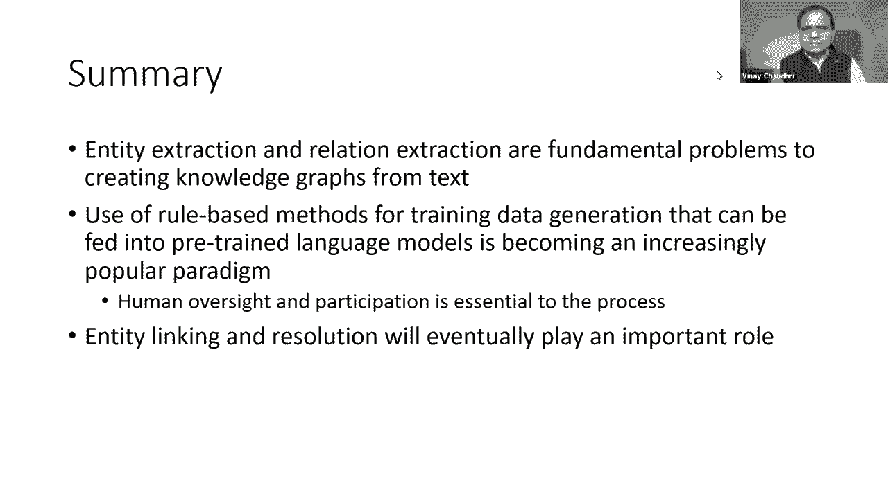

# P13：L9- 如何从文本数据中构建知识图谱 - ShowMeAI - BV1hb4y1r7fF

Welcome to the Knowledge Cloud Seminar。Today we are in the week five of the course and in the course until now we've talked about what is the knowledge graph we have defined the knowledge graph。

 its data model and some query languages。And for the last couple of weeks。

 we've been talking about how to create a knowledge class。

And in that process we talked about how to design the schema of a knowledge graph last week we talked about how we can create a knowledge graph from structured data and the focus for this week is going to be how we can create a knowledge graph from text and images。

Today's lecture is going to primarily focus on how we create the knowledge graph from text。

But in the lecture on Thursday， we would also hear about how we can create knowledge graphs from images。

Okay。For today's lecture， I have structured it into two parts。

 the first part is going to focus on the methods， which is going to be focusing on the techniques for creating knowledge graphs from text。

Mostly in abstract and in the second part of the lecture I will talk about a very concrete application where we can take those methods and try to apply to a real world problem so that you can see how the techniques。

Work and practice。Okay so we start with the first part。

 we will talk about the methods for creating a knowledge graph from text I will start by giving a little overview of the problem then we will talk about a general technique called a language models which can be used both for entity extraction and relation extraction tasks and then I'll conclude this segment with a summary。

As we all know a lot of useful information is available in unstructured text this can include things like SEC filings。

 Wall Street general journal and financial news if there is a way for us to automatically process this information and construct a knowledge graph we can do a lot of interesting analytics on that and an obvious technique for doing this kind of processing comes from the field of natural language processing and in particular from information extraction but at the outset I want to make it clear that today's lecture is not a lecture on NLP and it's not going to be any in- depth discussion on NLP。

Our core， our focus and the focus of this course is on knowledge graphs， like how do we construct。

Structured human understandable representations of a certain part of the world on which we can do inference and on which we can do analytics。

And for the purpose of this lecture and for this course。

 we are resuming that we can use NLP as a black box。

 it's like a tool that is available to us that we can apply to a given problem towards the goal of creating a knowledge graph。

And I cannot stress this point enough because NLP and the techniques that I'm using。

 they are covered in a full length course somewhere else in the curriculum and I'm not trying to reproduce or redo that I'm just trying to leverage but is available to us in the context of the primary goal of this course。

In the first lecture， I had shown this slide where。We talked about how we can。

Extract information from sentences and represent them in a knowledge draft。So for example。

 given this sentence， Albert Einstein was a German born theoretical physicist who developed a theory of relativity。

 we will extract entities such as Albert Einstein， Germany， theoretical physicists etc。

 and then we will extract relations， such as born in occupation， and developed。

And we can connect them using this directed graph representation。

 and once we have the directed graph representation。

 we can do additional inferences using that information such as theory of relatities。

 a branch of physics and theoretical physicist is a kind of physicist， etc。Okay， now。

 but in the overall scope of extracting information from text。

 we have the problem of entity extraction and relation extraction like I just described。

But there' is also the problem of entity resolution。And by entity resolution。

 what we mean is that the same entity can be referenced in a text in many different ways。

 for example， we may have a person John Smith and in a text we may refer to it by he or the company president or there may be other ways to refer to the same real world entity。

I'm not going to cover entity resolution in this lecture。

 partly because I want to limit the scope and partly what I found in my personal experience is that right now the entity extraction and relation extraction tasks are hard enough to do very well on complicated problems that。

The focus is not yet on entity resolution， we are still trying to do well on these two primitive tasks。

And for both of these tasks， the current fashionable or current trend is to use techniques called language models so I'll start by describing at a very high level what a language model is and then when I describe the techniques for entity extraction and relation extraction。

 I will discuss how language models are currently being used in that process。

So the overall concept behind a language model is that it's a tool or it's a model that predicts what word should come in the text in a sequence of words so for example。

 if you are given a text fragments students open their do dot。

The task for long language model is to fill in the do dot as to what could be the next word。

 for example， in this sentence fragment， we could have students open their books or laptops or exams。

Or whatever else。And with each predicted word， it is going to associate a probability of likelihood with which that word might come next。

So more formally， a language model can be also viewed as a probability distribution。

 such that given a set of words x1 through xn minus1， we want to predict the next word Xn。

Given that we've already seen x1 through x and minus1 in our input okay now language models are used all over the place。

 they have lots of applications we go and type in query in the search engine and it gives us likely completions so underneath it is basically using a language model to perform the task。

Similarly， when we are on iPhone and we are typing a message。

At the bottom or just above the keyboard it is suggesting the likely next words。

 so it's a pretty straightforward application of the language model that we see on a daily basis。

Okay。These language models these days are created using deep learning models and recurrent neural networks is a popular approach for creating those language models。

There are several variations of these pretrained language models that are available and those variations that depend based on what data you use for training。

 whether it's a single direction versus bidirect model。

 which particular neural network architecture you're using。And as I have noted previously。

 I'm assuming for this course that a language model is available to us off the shelves and we can adapt it for the task that we have at our hand。

 which is the task is to create a knowledge graph， right？No。

It may be interesting to actually say a little bit more about the difference between a single direction versus a bidirectional language model。

 the example that I gave was of a single directionional language model in which we are given a sequence of words and we are predicting the next word in a bidirectional model we are given a complete sentence in which one particular word is omitted and now we have information both through the left and the right of the word and we are predicting the word in the middle。

So it's useful to understand this at a very high level in terms of what these models do and what they have been trained to do。

A popular language model which has gained a lot of attention in the last few years is known as BRT。

 this was originally developed at Google and more recently there has been a lot of press and news about a new language model called GPT3。

Okay， now let's now。Put our heads down and we focus on the specific problem of entity extraction。

I will start by giving a running example for this problem and then I will outline various approaches for doing entity extraction and then discuss the challenges that arise in using automated entity extraction。

So take this sentence， Cecilia Love， 52， a retired police investigator who lives in Massachusetts。

 said she paid around $370 a ticket with tax for nonstop United Airlines flight to Sacramento。

From Boston for her niece's high school graduation in June 2020 Okay so we are given this sentence and from this sentence。

We want to extract named entities which are defined as things like places。

 companies and people and the definition of entities here is generally broadened to include things like dates times and numerical expression so for example here $370 it's a number that would be considered an entity June 2020 would also be considered in entity it's a time。

So given the sentence above we the task is to produce an annotated version of the sentence of the type shown here。

 so here Cecilia love we have labeled。By person， New Jersey we have labeled as location。

 $370 we've labeled as money， United Airlines， we've labeled as organization and so on okay so the task is to go from this input sentence shown as above to the label version which is shown below。

And typically we use we define a set of tags to mark the entities in a sentence because entities can be more than one word。

 there are these five tags which are defined to mark the boundaries where B denotes the first word in the entity E denotes the last word in the entity E I denotes the internal word in the entity。

O is a word nodding the entity and s is the single word entity。

So given the sentence that we were looking at previously， for Cecilia love。

 Cecilia would be marked by B and love would be marked by E。

 and the rest of the words we can see that they would be tagged in an identical manner。Now。

 in terms of broad approaches， there are three broad approaches for extracting entities。

There is sequence labeling the neural models but neural models actually just mean language models and the rule list approaches and I'll give a quick overview of each of these approaches。

In the sequence labeling approach， we take a standard machine learning type algorithm。

 such as conditional random field。And we。Give it training data which uses features such as part of speech。

 so for example， we may give it an input sentence and we might identify part of speech for every input sentence and say that okay。

 if it is a noun， then it must be a named entity。The training could also be based on whether a particular phrase is present in a mastered list of named entities。

Word embeddings， which we discussed in the first lecture could also be used as a training feature。

 the prefix of a word， and whether something appears in an all CAPS notation。So as you can tell。

 if you're going to use any kind of machine learning approach in this case。

A significant feature engineering is required because it's not clear which features we should put in。

 but there is a lot of wisdom and a lot of practice available using which we can choose what features we should be using in an entity extractor。

Now。In the let's now talk about the use of neural models for entity extraction。

 so here we are going to take an off the shell language model such as BRT and we are going to apply it to our problem at hand。

And there are two kinds of steps that are involved in doing that first is task independent training and the second is the task dependent training。

So these language models that we are going to get from off the shelf。

They are trained on very broad corpus， so maybe all the news or some very general purpose corpus such as Wikipedia。

But in general， we are always interested in a particular domain or solving a particular problem。

 so if we are interested in extracting entities from financial documents or legal documents。

The step of task independent training is to retrain the model that we have on the domain that we are interested in okay。

So that it understands the peculiarities or the vocabulary or the words that appear in that particular domain。

So that's the first step and the second step is the task dependent training so in this case the task is entity extraction。

 so the next thing we are going to have to do is to train our model on the task of entity extraction。

And the way this is done is we will take our sentence and in our sentence。

 we will introduce special markers。So the sentence we were previously working with here we have a marker called CLS。

 which denotes the beginning of the entity and SAP， which denotes the ending of the entity。

These labels are pretty arbitrary， we could have put any marker here。

 but CLS here is I think short form for classification and SP is the short form for separator。Now。

When we train a language model in which the sentences have these markers。呃。

What it will learn is how to predict these markers， okay？

We can repurpose the language model to this entity extraction task by now asking it to predict whether the next token is going to be CLS or whether the next token is going to be SP。

 right？And if。We get it to predict these distinguished tokens。

 we know where the entity boundaries are and we can use that information to mark where the entities are in our sentence。

So it's a pretty clever way of just taking a very general purpose language model technology and repurposing it to entry extraction task。

Okay， let's now talk about the rule based entity extraction。

 the basic idea here is that we are going to write a set of rules which will tell us how we should extract the entities。

And these rules can be based on either something very simple as regular expressions or it could be looking up things in a dictionary or it could be invoking custom extractors okay。

 but the bottom line is。Again， just like in feature engineering we have to come up with features here we have to do rule engineering we have to。

Have enough understanding of our domain to figure out what the entities are and we have to be able to specify the relevant rules which will help extract the entities。

Okay， so that was sort of my quick overview of the methods one can use the difficulties that arise in doing entity extraction well are one obviously is ambiguity we can have entities such as Louis Vuitton which can either refer to a company or to a person or to a product so in cases like this it's difficult to figure out what should be the appropriate label for that end。

Training data。Or future engineering， you know， I mean， rural engineering。

 all of that is the bottleneck in doing this process well。

There are domains where there are variations which are very peculiar to that domain， so for example。

 if you are doing extraction in biology you may have entities such as duplication of cell by efficient。

I mean， which is like a long phrase， which is very different from the kind of things we were seeing in the example where we were primarily limited to company and organization and location。

 etc。And in some domains， you have to extract very general。

Terms as entities like attach or bind or synthesis。And。😊，There again， it becomes a challenge how you。

Define your rules and training。To do。Extraction for those very general entities。And finally。

 entities have multiple forms， so these forms may include singular versus plural。

 you may have abbreviations for an entity， you may have morphological variations of an entity。

All of those things are going to appear in the text and。

We won't be able to figure out that they are all referring to the same entity unless we have a lot of lexical knowledge。

And if you really wanted very high performance on the entity extractor。

 we also need a very good lexicon for the domain so that we can accurately distinguish whether different variations of a entity are actually referring to the same thing。

是。All right， so that was my quick overview of term extraction and now I'm going to move on to methods for relation extraction。

And here again， I'm going to begin by giving a few。

giving one example of the extraction task we want to perform。

 then I'll give a broad picture for various techniques for doing relation extraction and then talk about what's hard。

 what is difficult about doing relation extraction。

So the example is the same sentence that we considered for entity extraction。

 and now we want to extract information such as Cecilia Love lives in Massachusetts that lives in is the relationship United Airline flies from Boston。

 United Airline flies to Boston， so those we want to extract those relations from this sentence。呃。

Okay， so。Actually， I have multiple examples， not just one example。Very popular task that people。

A lot of people focus on is to extract information from Wikipedia because it's very useful for enhancing the search results。

Lot of the fact extraction from Wikipedia is straightforward， but there are a lot of corner cases。

 so if you look at the Wikipedia page for for Larry King he has been married multiple times six or seven times and for each of his marriages there is time duration right and。

If a person is married only a single time， then it's pretty straightforward to extract the spouse relationship。

 but now the person is married multiple times and there is time and sometimes he was married to the same person twice right so it becomes very complicated very soon to associate appropriate temporal。

Information with the fact that you are extracting。I mentioned domain specific extraction in the when I was talking about entities。

 but the same thing arises for relations also there are。Domamain specific extraction systems。

 for example， for the medical domain， where they are primarily interested in information such as what things cause what disease。

 what drug can treat what symptoms， what kind of enzyme or chemical disrupts， what kind of process。

 and thats those meanings and the way they are defined is very specific and peculiar to the biology domain。

 and that by itself becomes a whole subfeed within relation extraction。Even for relation extraction。

 there are three broad approaches， there is a rule based approach。

 there is a supervised learning approach， and then there is open information extraction。

Even within supervised learning， people make a lot of subdistinctions。

 whether it is semiupervised or fully supervised or。

 but as long as the approach is supervised for the purpose of my discussion。

 I have kept everything under the same heading of supervised approaches。

The open information extraction。Approach is a way of extracting information where they don't give any。

Specific attention to the meaning of the labels， they just extract triples out of text。So。😊。

So just as an example， if you're given a sentence， Dante passed away in Dvana。

The open information extraction approach will simply take this text fragment and they will turn this into a triple which is shown here to the left。

 Dante passed away in Uvana。As opposed to。Taking this text and populating a knowledge graph in which we have a vocabulary of relations which have very defined semantics so on the right I'm showing a little property graph there we have a person node and there is a city node and there is a relation called death place which probably has some domain and range constraints defined for it it has some rules and constraints on what values it can or cannot take。

And whenever we are going to talk about where a person died， we would use the same relation okay。

 so there is that careful knowledge engineering and knowledge representation that has happened。

Which would be。Not done in the case of in open information extraction。

 in open information extraction， you just process text in a completely unsupervised way。It's a。

Popular and very compelling story for certain kinds of problems。

 but it becomes very difficult to do the inference and analytics using the information we will extract in open information extraction way so for the purpose of my lecture here I have decided to keep that outside the scope because we are primarily focused on knowledge graphs and we are interested in techniques which will help us popular in knowledge graph where we have well defined meanings for the nodes and labels in our representation。

So for the rest of my discussion， I'm going to primarily discuss information。

 extraction or relation extraction based on syn patterns and supervised learning。Okay。

 so synthetic patterns， they were originally introduced by Martyhurst and in her honor。

 they are also referred to as heararrst patterns。And I illustrate that using an example that I took from the original paper on this topic。

 so let's take this sentence， the bolu such as bambbaran d is plucked and has an individual curved neck for each string。

Now。I've never seen a bullut， I don't know what bombbara and Dang is。

 these are the words I may be encountering for the first time。But。

We can just from the syntactic structure of the sentence， we can say that well， you know。

 the marin D must be a kind of boat loop， assuming kind of or superclass is one relationship that we are interested in。

So this was the key insight that Mardihurst had and she said that while you know。

 we can define such syntactic patterns which based on the way a sentence is structured could give us very strong indication for what might be the relationship between them and she had in her original paper she had several examples。

 so for example， if we have a sentence such as work by authors such as Ericrick Goldsmith and blah。

 blah， blah， we know that Herrick and Goldsmith they authors right。And then if you have a sentence。

 bruise bruises， wounds， broken bones or other injuries。Then we know that in this sentence。

 bruises and wounds must be kind of injuries and so on and so forth。

 you can follow the rest of the examples in the same day。Now。

 when this idea was originally introduced， you know people thought， oh wow。

 this is really cool and if you can do the extraction like this。

 wouldn't this be really a very scalable way of doing it？

But it turns out it's not that easy to generalize。And so even in the original paper， you know。

 there was this section on， okay， how do you generalize it to relations that you have not seen？

And the general methodology that was suggested was that， well。

 if you want to extract a certain relation， what you do is you collect lots and lots of examples of sentences where that relation is described。

And from there you try to figure out what are the general patterns？

And then for those general patterns， you define this syntctic。Now。

 if you take some relationships such as Ha part， it's been very difficult to find very general patterns about how you would extract it from the text and I will actually give you more examples of this in the second part of my lecture。

🤧Some people have。Some people have undertaken research to see if they could。

Auttoomatically learn these patterns， instead of having to manually engineer these patterns using examples and working backwards from example instances of these relations and sentences can be somehow automatically learn them。

And that also has limited success， I mean there is some success in limited domains。

 but not in a sort of very general purpose manner。O。

Now let's switch to the supervised learning approach for relation extraction and first and foremost。

 you know it requires a huge amount of training data。

 you know you may not be required to define patterns for the example occurrence of in a sentence。

 but you still have to find those sentences where those relations occur。诶。And some people。

 what they do is they would。Use the Mardiher style syntactic patterns。

 and they will use those patterns to generate lots and lots of training data。

In the opposite direction。Given that these training data， these sattactic patterns。

 they are not very general and they don't always work。

There is this recent idea called approximate labeling and this is something which Chris Ray in in our department here has pioneered and the basic idea there is that while you know we can't come up with。

Clear way to figure out whether a particular relation exists in a sentence or not。

 so we are going to have lots and lots of different syntactic patterns， which might suggest。

That this relationship might exist in a sentence。And then we are going to use all of them and then through a training process。

 we are going to learn how good each of these is and we are going to combine combine。

The the input or the signal that they give us into what we are going to feed into our into our learning algorithm。

 so as a concrete example， let's say we are we have a relationship has part we want to learn this from the syntax structure of the of the sentence now if our weak labeling function could be that if in a sentence we have。

A has B or A have B。Then we could say that， oh， you know， this might be suggesting that a has part B。

And we know this is not correct， this is not all this correct， in some cases， this is correct。

But that is a labeling function， a weak labeling function that we can use in our training algorithm。

Which eventually。Based on experience， we get better。Okay。啊。Next。

 let's talk about how we can adapt a language model for the task of relation extraction。

And the basic idea here is not very different from the kind of trick we used for entity extraction。

So essentially what we do is。We take our input sentences and we put these special markers in our sentence which denote the beginning and end of each term。

 so term one start and term one end that denotes the first entity and term to start and term to end。

嗯。Deotes the second entity。And in our training data。

 what we are going to train our language model to do is that when the language model encounters a sentence like this。

 its output should be lives in， which is the relationship that we are trying to predict。So again。

 you know， the basic idea。It remains the same。Enhance your input data to add markers which correspond to the task you're trying to perform。

Throw lots and lots of data at the model and get it to learn。The output you are trying to produce。

The challenges you can expect in this case are the first and foremost is the training data like how do you get lots and lots of examples of the。

Relations of the training data， which are required for this any of these techniques to work。

And given that all of these techniques are。Approximate mean they are not going to work in all the cases。

 we still need human verification at the end if the end goal is to come up with a highly accurate knowledge graph。

 you have to have a human in the loop。And。I primarily here talked about relation extraction for entities。

 but there are。Specialized methods when you are trying to extract relationships for events or when you're trying to extract temporal information about entities。

I have not covered them in this lecture， but I just wanted people to be aware that you know。

 there is more to it than what I've just covered here。Okay。

 so that sort of brings me to the summary of the first part or the methods part of what I was going to say。

 and that is entity extraction and relation extraction are fundamental problems if we want to create knowledge graphs from text。

And the overall landscape of methods is that people still prefer to use learning based approaches for doing so。

 but the rule based approaches and syntactic patterns， they are very powerful paradigms。

And people are leveraging them to。Create or bootstrap the training data that they need for their learning algorithm。

We are still trying the state of the art is still such that we are still trying to do well on entity extraction and relation extraction and entity resolution I mean that's an extremely difficult problem again I kept that out of this lecture just to sort of。

Keep the scope。But eventually， I think once the entity extraction and relation extraction becomes well tackled。

 entity resolution is going to be increasingly important。Okay。No。

I would like now to move to the a second part of the lecture。

 which is going to focus on a concrete application where。

I can illustrate how these methods actually worked in a particular project that I was involved in。

I'll take a quick scan at the questions just to see whether there is anything I should address now versus addressing at the。

End of the。End of the lecture。Okay， yeah， I think I we take these questions at the end of the lecture as we get into the discussion part。

Okay。Okay， so in the discussion， I'm going to talk about an application called intelligent textbook where we are trying to create a knowledge graph from textbook textbooks and I will。

Show how some of the techniques that I talked about we were able to apply and how well they worked for our project。

So I'll start off by discussing what is an intelligent textbook。

 what kind of knowledge of do we actually need for an intelligent textbook and then how do we extract entities。

 how do we extract relations and then sort of。Tell you about what were the experiences。

 how much did we succeed and。And what I think is the way forward for using automatic extraction methods in surveys of knowledge graph construction。

So I like to define an intelligent textbook as a traditional textbook。

 which is enhanced by a knowledge graph of concepts and relations which are found in the book。

Once we combine this traditional book with the knowledge graph。

 I'm calling that an intelligent textbook。Now there could be other definitions for an intelligent textbook。

 but that's sort of how I've defined it for the purpose of this lecture。Now。

 the first question that arises here is who needs it。

 why should you even care and what problem are we solving in creating an intelligent textbook？

So I think。Intelent textbook of the sort we have been thinking about is useful for making it easy for students to learn complex new concepts。

And an example student for。who has such a problem is a first year student in a college level biology。

 and if you talk to these students who have aspirations to become doctors someday。

And when they walk into their biology classrooms， we hand them these thick textbooks and they have to master those books if they are going to progress with their education and the sentiment which is shared by these students is that biology is very complex。

 it has huge amounts of new words and they feel lost to help students like this。

 we think an intelligent textbook could be a powerful technology and we have built a concrete prototype of what such a textbook might look like。

 and I'm going to give you a demonstration of this book so that you can see for yourself concretely what I'm talking about。

Okay， so in a it has five different capabilities that help students。

 the first is that for any difficult words that appear such as proteins。

 polysaccharides and nucleic acids， students can get a quick definition by simply clicking on it。

Second， it helps crosslink content coming from different parts of the book， including diagrams。

 regardless of which chapter those diagrams might be defined in。Third， it gives a visualization。

 knowledge graph visualization for every single concept in the book。

 and the student can interactively explore this visualization to ensure that they've learned what they were studying。

Fourth， as the student is reading a book and they highlight a passage， it asks the student questions。

And for example， in this case， the student kind of remembers that hemoglobins carry oxygen。

 but they're not sure。So they decide to touch on that question and by comparing their answer with the answer returned by the book。

 they have this renewed confidence that they actually understood the material。

 so it's a great self testing device。And finally， they can ask questions from the book。

 for example here， the student is asking compare protein with a polysaccharide。

And in response to such a question， the book will systematically compare these two concepts and present the results in a nicely organized table okay。

So using these five new capabilities which are powered by a knowledge graph。

 the student is able to more effectively interact and engage with this complicated body of knowledge。

Okay， so that was the demonstration just to make it concrete for you how the knowledge graph is actually being used in the context of a textbook。

We it's actually not just a demo， it's actually a working prototype and we have tested it out in multiple classrooms at some community colleges at a college campus in Sweden and also at Harvard University and we found that。

These features that I just showed in the demonstration they are uniformly liked by students。

 they also lead to better。Learning outcomes and also it also helps students underperforming students。

So。😊，The real challenge in creating intelligent textbooks like this is to actually build the graph。

 how do we actually build the graph in a scalable manner for lots and lots of books。Now。

The next thing one could ask here is okay， but what kind of knowledge graph is actually needed？

What is it that we are？Trying to create， which would enable the kind of demonstration that I just showed。

So let's now look at it a little bit more carefully because this example is different more different from the Cecilia love example。

 which I was considering in the first part of the lecture。

So let's take this sentence such as on the outer surface of the plasma membrane。

 carbohydrate side chains are found attached to proteins in lipid。

so that's the sentence and from this we want to construct a graph of the sort shown to the right where we do have things like plasma membrane。

 carbohydrate c chain， those things appear in the graph。

 but the protein and lipids instead of appearing as protein and lipids。

 they appear as glycoprotes and glyco lipidids， which are more special kinds of proteins。Now。

 those proteins were not。Explicitly mentioned in this sentence right they were probably mentioned in some other part of the textbook where they were talking about these more special kind of proteins。

But when we extract information and we want to construct this knowledge graph。

 we want to construct this sort of cohesive global knowledge graph and in this case。

To build something like this， we would also have to resolve this lipid entity with the glycolipid entity which already is there in the graph。

 similarly protein entity with a glycoprotein entity。No。

TheI think the other thing which needs to be pointed out here is what is the actual meaning of this graph mean short you know this is a directly labeled graph of the sort that we've defined in this course。

 but what exactly is this graph saying？Now。If I was reading the logical meaning of this goff。

 it's kind of saying that for every plasma membrane there is a glycoprotein。

 there is a carbohydrate side chain such that that side chain is a part of glycorotein so I'm reading this leftmost part of the path that you are seeing on the screen。

Now the first thing you would notice here is that the nodes that we have in the knowledge graph here are genetics right they are not things like Cecilia Love or Boston or United Airlines。

 these are the kind of things that we saw in the first part of the talk， but here we have。

Classes of objects like plasma membranes， gcoroteins， cons， etter。

So the the actual meaning and what we want to do with this graph。

 strictly speaking is much more than。What a knowledge graph between real world entities is because there is some quantification and some more background inference which goes with it。

And now。We know that。Getting all that meaning is。Even more difficult and I think when we were looking at this problem。

 we said， okay。Why don't we see if we can just ignore that all that complicated background quants and those meetings。

 why let's see if we can even just。Extract these relations。Between them。

 let's just extract these isolated relations。Okay。😊。

So that we're still within the sort of narrow version of a knowledge graph and we're not trying to do。

More difficult or much harder portion of assembling a coherent graph from the book。

 let's just see if we can get these isolated micro fragments of a knowledge graph。

Now the other part of the problem is the semantic meanings right so we are using here relations such as has part and has function and and。

Again， you know， they these are not as。Cleanly defined as United Airlines is flying from Boston to Sacramento。

 you know there the definitions are very clear but here。Getting formal definitions。

 it's it's a challenge in itself it's a problem in itself and it turns out that。

At least for this project， the biologists we were working with。

 they're not used to doing formal definitions， they've never even thought about coming up with formal definitions for these concepts。

Now， just to sort of make it more concrete for you on。The problem and the challenge that we faced。

Is let's see you know how biologists define has part and has function。

 they actually like to refer to it as structure and function right and if if you talk to biologists you know you get a definition like this。

Structure and function are correlated at all levels of biological organization。

 the form fits function， and they would say that while you know the birds have these wings which are aerodynamically shaped and they help them fly。

And that's how sort of we think about structure and function or if you are if you have bones。

 bones have honeycomb structure and this honeycomb structure gives the bones strength。

 but it also keeps them light right and so that's sort of what you get that's sort what we got when we were talking to biologists about okay。

 give us the meaning of structure and function。So this by itself， you know， was not。

 we didn't think it was very useful from a computational point of view， so we said， okay， well。

 is there a way we can approach this problem from a computational point of view？And。😊。

I think the way we like to think about this in the context of the designer knowledge graphs is to think in terms of competency questions。

 right， can we come up with a set of questions that our knowledge graph should be able to answer？

And could we work backwards from there to defined， what should be the meaning of the nodes and edges？

And so we came up with two broad categories of questions。

 diagnostic questions and educationally useful questions。

 and I'll give you examples of each of these categories of questions。

So diagnostic questions are questions which basically test whether the system has the knowledge。

 the basic knowledge， so if you ask the system questions such as what is the structure of and what is the function effects the system must be able to answer it right if the system cannot answer that then。

啊。You know， it doesn't even know what a structure and function is then what else can you expect it to do right。

 but you can answer these questions also a string lookup right？

So we wanted to go beyond that right that the question should not be simply a string lookup。

And in the definition of educationally useful questions， we said well， you know。

The question has to be pedagogically useful and it has to be Google hard， Google hard in the sense。

 it's not a string lookup， you have to do more calculation， more computation to answer this question。

And it should not also be too hard right， because answering any question about the biology of。

 you know， myths， it's a open ended research problem。

 but it should be such that we should be able to solve it in a short amount of time。

So we came up with these five categories of educationally useful questions， and in this case。

 we here means teachers and students from a focus group that we had convened。And。They gave us 100。

 200 or so questions， and then we sort of sat down and we categorize them into these five different categories。

How do you relate structure to function， how do you perform qualitative comparisons。

 how do you do similarity reasoning， how do you understand the impact of changing the structure of something on its function？

And we can sort of look at some examples， so for example， if the loop of Heley gets longer。

 how will its function be back？So let's say we want to answer that question。All right。

 so this was sort of a set of requirements working from this set of requirements。Came up with。

A vocabulary or a set of relation definitions which should be present in our knowledge graph and we make made this list and from this you can see some of them are。

Purely meeroic in nature where we are modeling the structure of things。

 there are some relations which are spatial， there are some relations which are about properties and。

We had a similar set of relationships for functions， but just for to keep the talk scope。

 I'm going to primarily focus on the structure relations because that is enough to give you。

The sense for。The complexity of the problem and the challenge that one faces in doing radiation extraction。

So then we spend a lot of time trying to come up with definitions for what these actually mean and this。

Set of definition which I also sometimes like to call it like a flow chart。

 may seem a little esoteric， but there is a lot of thought and a lot of literature behind this based on which we came up with。

And。And the interesting connection between this sort of piece of ontology research with。

Information extraction is that。This is the source for our weak labeling functions right and when we do the relation extraction in a few slides。

And when we are looking for what should be in our weak labeling functions？

This this is one place where you could get them from。Okay。

 so let me sort of quickly walk you through this through this logic。

 we have five relations has part element material possesses and has region right。And。😊，第。😊。

We can have any of these five relationships。Between two entities。

 if it makes sense to say x has y in English， right。

 if it doesn't make sense to say x has y in English， then。

None of these relationships quite likely would apply。

We would say x has region y if y is a regional space defined in relation to x。

And it does not make sense to associate why with properties such as mass or density okay。

 and everyday example of this would be let's say。You have a table and you want to say define the relationship between tabletop and table right and tabletop is a regional space which is defined in relation to a table and tabletop by itself doesn't have mass or density table does have mass in density but tabletop。

n't it's just a region of space。We say x as material y if y is tangible and is's pervasive in x。

Now continuing with the table example。Wood would be material for table because wood is a table is could be made of wood。

X has element y if x is a set of entities of the same type or sibling types that y is an instance of。

嗯。Now， here the。More common example would be like if you have a DNA strand where DNAN strand is made of a set of nucleotides or you in more common sense well you have a necklace and you have a set of beads which constitute a necklace。

 so there the relationship between the necklace and the beads is the elementary relationship。

X possesses y only if y is energy bond or gradient。Now you may say， oh。

 this is sort of very strange way of defining it， but this is actually an example of example application of what Martyhurst。

Argues right so we had this possessed relationship and we went into the book and we see where they were using the possesses relationship and we tried to look for a generic pattern that we could specify when X possesses Y and at least for the biology book。

 this is the best we could come up with。😊，That they were using the word possesses whenever you know the entities happen to be energy bond or as and if none of these relations applies then the likely candidate is the has part relationship okay so I think this is the sort of semantic work semantic definition work which really distinguishes。

The knowledge graph relation extraction from open information extraction where in open information extraction you don't do this kind of work。

 you know you just see what's in the text and that becomes your relation okay。And but here we are。

Trying to pay attention to what these relations mean， how they are actually used。

 and how we might be able to aximatize them， how we might be able to draw conclusions from them。Okay。

 so having set up that framework and the problem definition， let's now talk about entity extraction。

And how we can take entity extraction techniques from the first part of the lecture to solve the problem we have here。

So we go back to our sentence and given this sentence。

 we want to extract plasma membrane carbohydrate side chain proteins and lipids that's what we want to get out of this。

Then the first question you would obviously ask is， well， you know？

Where are we going to get the training data from？And our answer was， well， you know， textbooks have。

Glosies at the back， you know， the author has already gone through the pain of figuring out what the key entities are and they have made a list that's our training data。

Now that's actually not a bad idea and actually a good idea。

 the only problem is that the glossies that tend to be not very complete they don't have everything that you want to extract from these sentences for your knowledge graph but hey you know it's available for free you don't have to do any work so。

Why not use it so that's what we did so what we did was we found about half a dozen different open source textbooks we processed them and we extracted the glossaries and then we we fed them into a language model' BRT we were using BRT we first trained BRT on these books。

 we we did a domain task independent training of Bt on these books。

And then we fed these glossaries into the language model。

And then we obviously had a dev set and the test set right in the development set。

 we had these about less than a dozen or so books on different topics， physics， psychology。

 microbiology， chemistry， etctera。And then we had a test depth set and the test set， and in the test。

 you know we were feeding it sentences such as the one you see above here。

 all cells have cell membranes， but only some have cell walls and we were expecting it to give us the sentence of the kind you see at the bottom。

 where it has to tell us the entities， cells， cell membrane and cell walls because that's going to be a first step that we are going to need to build our knowledge graph。

So we tested this out and we found that the precision on this was not bad meaning it was 0。

67 you know， I'm saying not bad because。It's it's not 0。2 or 0。1， but it's certainly not 0。

99 of the kind that we would like to have in the book and the recall was even lower it was 0。

51 so I mean it was missing out on a lot of things you would want to extract but the beautiful thing about this was that okay this is all automatic you know you can do this you know once you have the code you know you could you could do this right away。

And at this point， you would ask， okay。Why why is it not be having better and if you wanted to make it better。

 how would we go about making it better？So one sort of challenge that we。

Saw and we I mentioned in the previous part of the lecture was that there are multiple ways to refer to entities right so you could have DNA and then DNA is also same as the oxiv nu right and。

You have to somehow you either have to have a language model that tells you synonyms。Right。

 if you don't have that and if you just have entity extraction。

 then entity extractor will think that these are two separate entities。And similarly， you know。

 you may have situations like in a sentence where they are using membrane in another sentence where they're using cell membrane。

 but they're talking about the same thing。And then you have to be able to disembegate between the two。

In biology， there are also a lot of unusual plurals。

 so you have things like mitochondria versus mitochondria。

 So we mitochondria is a plural form of mitochondria， but it's a kind of。Unusual pluural。

And unless language model knows that， or unless you train your language model for pural detection。

 it's going to treat these as two separate entities， right？

So I think one big lesson that we learned in this whole exercise was that a good lexicon is actually essential if you're going to do very high fidelity term extraction。

If you don't have this lexical knowledge or you train your language model to actually learn the lexicon also unless you do that。

The fidelity of information you're going to get through these language models is not going to be very satisfying to the domain actually。

Okay， the main experts of the sort who are writing a book， Okay， I should sort。Make that yet。

And I think the other thing you would have observed by now is that。

This relation extraction problem is very different from the relation extraction problem I talked about in the first segment where we had basically people。

 places， companies， dates， you know there are four or five classes of entities that we were trying to extract。

And here， the entities are much more varied。And just even the definition of what counts as an entity is。

So little very different from what we tend to see in the conventional relation extraction task。

So for example， the biologist would consider a 40 tumor suppressor。

Gene as as an entity and then the question is。Really， is that an entity and this kind of entity。

 it's unlikely to exist in a very general language model， it's very peculiar to biology。

And then something like control of blood flow to skin。

 which is a very reasonable function that you may want to have in your knowledge graph。

But this is a phrase which is six words long and and doing it using language models its。

Currently outside the reach of the current language models。

And I had briefly mentioned these very general words like attack and synthesis。

 which you want to identify as nodes in your knowledge graph， which。你。

Current systems they won't obviously do。All right。So given that。

 let's now move on to the task of relation extraction。

 assuming you know we can do these entities and maybe we can do the correction， let's see if。

We can extract some of the relations we are interested in through these automatic methods。

Now let's go back to the sentence we were working with， we have the entities as shown at the top。

 we have relations as shown at the。Bottom we've identified here that you know plasma membrane has part car side chain and because they are connected then they must be abuing each other so we are using one meeromic and one spatial relationship。

Now the first question that obviously arises here is where do we get the training data from now in this case we had some training data we could get from the existing knowledge base because we had a knowledge base we had hand built and there is this distance supervision technique using which you can。

If you already know some relations， you can map them to the textbook sentences。And in addition。

 we use the weak supervision technique of Chris Ray style based on the semantic definitions of these relationships that I had alluded to earlier。

 so essentially the way the weak supervision works is we define a set of label functions。

We apply each of these label functions to every training instance that we have in our input and then we aggregate the input that these labels labeling functions are giving giving us into。

嗯。Hard levelss and soft levels， hard levels are obtained based on the majority labels。

And soft labels， they are labels calculated by some probabilistic combination of how much we trust each of these labeling functions。

And then we have a very similar pipeline where we have the entities from our entity extraction step。

 we enumerate all pairs of entities， and then we input them into our model。

 we train that model based on our pre-existing knowledge based and the weak labeling functions and the task of the model is to tell us what might be the likely relationship between the two entities that appear in a sense。

Okay， so that was that was the process。Again， the precision turned out to be in the range of 0。

65 and recall was in the range of 0。54 mean it misses out a lot of things。

 but a lot of things that it。It finds theyre not too bad， it's not like 10% or 20% accuracy。

 but it's also not 100% or 99%。Now。At this point， the vision that。

 you know a lot of people get very excited is that while， you know。

You want to feed these books into these learning models and then get the entities and then feed those entities into second language model and then you get the relations and thenvoaha you'll get these knowledge graphs at the other end。

You know， people get excited about that。But because the precision and recall is not quite there this rosy picture doesn't quite pan out in in practice I don't think it's going to pan out anytime soon so the picture that I sort of。

Think how these technologies can be used for knowledge graph。

 highly accurate knowledge graph construction is to introduce a human review step。

 so you do some automatic term extraction and then you have a human actually look at what the model did and then you feed that into relation extraction then you have a human look at it and then there is this still undefined task of how do you take these triple level information and you sort of synthesize and fuse them or integrate them into a coherent knowledge graph。

You could also ask this question， you know， who is going to do the human review and the vision and the picture that I've been arguing for a while is that well。

 you know this should actually be done by a textbook author and it should just become part of the process of writing a book that you as you write the book you part process it through these tools and it gives you some useful information which will also help you improve the book。

And。And yeah， I mean， again， I think the people are sort of receptive to that idea， but I think then。

Ting that I try to do is to see well you know we need some kind of a futuristic glossary editor and a diagram editor and this glossary editor gives you way to bootstrap your glossary at the back of the book in a very comprehensive and text rooted manner and this diagram editor lets you visualize every single concept in the book and then people start saying that well you know author is never going to do this and well maybe there needs to be an author assistant a new kind of professional who works with the author and who is in charge of doing this kind of processing。

诶。Whether somebody is going to buy into this kind of vision。

 you know that's still open to open to discussion， but but this is sort of how I think these automated extraction technologies can potentially enable the authoring of highly accurate knowledge graphs。

So to summarize， what I've tried to argue in this lecture is that。

Enity extraction and relation extraction。 They are sort of fundamental building blocks for。

Creating knowledge graphs from text。呃。At least in sort of my version of the problem。

 the rule based methods or methods which start from the semantics of the relation。

And their potential aximatic definitions， that's really the place where we start from and we can use them for generating some training data and we can feed them into automatic methods and that I think is already popular paradigm。

 but sort of my own personal take on this is to bring in sort of more semantic definition from the from the ontology research and knowledge graph side of things so that what we are actually learning。

Are things that we can do principle inference with。And finally。

 just to acknowledge entity linking and entity resolution。

 they eventually will play a big role in our ability to create these knowledge graphs。

As we're still struggling with doing well on the more primitive tasks of entity extraction and relation extraction。

I'm expecting that entity resolution in a few years might become。An equally important building block。

 eventually we will get there， but with the current state of the art。

 I don't think we are quite there yet。With that， I'd like to conclude my lecture here and we still have seven minutes left for any questions。

Co so sorry， I joined it， but I can I can see a few questions here。On the Q and A tab Okay。

 good so first question is could you mention again the author of approximate labeling function。

 please Yes do you in any specific paper。

To read about the labeling for knowledge graphs using MLl Okay so the specific author is Chris Ray and Chris Ray。

 he gave a lecture in our seminar。Last year， so if you see our series from last year。

 I think it was a second session where he talked about snorkel and his weak labeling approach。

So that's the technology we were using for this project。Okay， thank you。So the next question。

 could we have a link to the code， maybe in Gitthub or somewhere to try the labeling process？Yeah。

 so I think snorkel has become a commercial product now。诶诶。I think they yeah。

 so and I think if you send me email， I can。Send you a link to the code that we developed。

 which is in public open source。 So just send me an email I can I can。Provide reference。Yeah。

 so I have come across several open source projects in Github。 Okay so search for search for。

NLP labeling and there are a couple of projects actually in that。

There's an open source project called Spacey。And they have a new tool called Prodigy。

Which helps you label stuff also， so that also works quite well， so there are quite a few examples。

And the last question here。That I see is are you using predicates such as has part has function？And。

Function from already published ontologies， or are you defining them internal to your system？

So I'd say a little bit of both， so we actually ourselves have a paper on the semantics of structure and function which we authored with the partnership with biologists。

 but as part of that paper we relate our definitions to whats。

In the broader ontology research literature。So we're not that different from what people are talking about in the literature there is certainly some adaptation like you might remember there was one slide in which I explained a flowchar of how you choose between these five relations right so that actually is based it's an adaptation of a piece of work that was done by Maria Ket she is one。

One of the researchers in the anthology research community。

 so we basically took her her framework and then we adapted it because she was not addressing all the nuances that we were seeing seeing in the book so so I think the short answer is yes what we're doing is compatible but I think we've also made some novel contribution to extending what is。

Already known about how to define the semantics of these structure and functional relationships。Cool。

 thank you。 and one question just popped up in the last few seconds。

So this is a question about KG validation should it be done manually or by done by experts do you know of any systematic and automatic ways for doing that so I think Kg validation I view this as a research problem I don't think it is solved。

呃。I mean， again， I think the。Doing it in a manual way is a starting point。

 but I think the way I think about this problem。In the context of the intelligent book that we were building was that once you have the KG。

 then you ought to be able to pose lots and lots of questions to the KG and you ought to be able to show the answers to an expert。

And expert should be able to validate those answers。That's sort of how we were doing the process。

But I think once you have that framework in place， there's no reason why you could not put it on a crowdsourcing platform where。

You have multiple students reading the answer or multiple teachers rating the answers。So， that。

The cost of actually doing the validation is not part of your project you can somehow sort of form it out the to the crowd platform right but it's it's I don't think it has been worked out。

And it's open research Okay， and on a related question related topic。

 I have a question in your project， did you use any implicit。

Feedback mechanisms for validation like Google will collect your clicks and then validate a lot of their algorithm。

 anything you did on the students。Like measure what they clicked on or something like that yeah we we don't have that we did not know that yet so you do not capture did you capture the clicks and English you have the capture of the clicks。

 but we have not utilized it okay。So yeah， I think that's it。On the questions here。

 there was something in the chat in the chat。Do you use a draft Db， which draft D is recommended？诶。

While we were using at the time what you can call it a logic programming system。

 that's sort of what we have in the guts of the current prototype and if you were to ever rebuild it。

 it would be some version of that。嗯。In terms of which graph D you recommend。

Nine has been planning a lecture towards the end of the series where he will give us a sort of survey of the tools available。

And what people should consider looking at， so I think we should def that question to that lecture。

Sounds good。 I will keep this in mind。 This question in mind when I。不 that。Co。

 I think we are done Okay， Mike， do you have anything to add？嗯。

I don't think so unless you want to have a long long drawn out argument about rule base versus machine learning or intelligent textbooks。

 but exactly they are， but I'm just impressed with how much how cool the tool that you built is。

I would like it to see it go farther， but I'm happy to see that it's gotten as far as it has。

All right， well， that's a great。Great closing statement。

 thank you Mike for your support and inspiration。And I will conclude and we will continue our series on Thursday on Thursday we have two fantastic speakers。

 Adier Kanur， who worked on the team that had built the jeopardy system at IBM。

 he will be talking about his current work on creating causal graphs for understanding natural language and we will have a second speaker Ranja Krishna。

 who defended his PhD thesis on Friday， he will be talking about how he has been using scene graphs for image understanding。

So we will see you on Thursday， thank you very much。拜拜。

