# P2：L2- 知识图谱的what和why - ShowMeAI - BV1hb4y1r7fF

欢迎参加知识图研讨会，如你所知，我们本周的主题是什么是今天的知识图，我们很高兴有，陈巴鲁博士，在他的职业生涯中，他目前是国家科学基金会的高级科学顾问，巴鲁博士一直参与大数据的研究，是它创造了它，利用它。

或者对它进行基准测试，他目前参与了收敛加速器计划，在国家科学基金会，作为其中的一部分，他们正在资助当今知识图表领域的几项倡议，我们会收到他的信，什么是知识图，为什么我们要把它们交给你，查塔内特伟大。

非常感谢，呃，当我嗯，所以我很高兴来到这里，我准备了这组幻灯片，呃只是为了，呃，这个场合，所以会有点像，第一次我会经历它，但希望我能，你知道的，看完所有这些幻灯片的重点是，我想以某种方式告诉你这个故事。

嗯，其实，收敛加速器中我们所说的轨迹之一，刚刚在国家科学基金会提到的，这个轨道是在一个叫做开放知识网络的东西上，它实际上是关于在各种不同的科学领域创建知识图，所以我只想把它当成一次旅程，从，嗯。

你知道的，我们正在谈论的事情之一，呃，为什么我们认为，呃，我们需要他们，所以如果我从头开始，我想它会暗示这一点，但你知道，从我自己的背景来看，我是一个我是一个数据库的家伙。

我是一个在数据库系统工作的计算机科学家，所以这是一个我们基本上关心的领域，管理的整个问题，呃，数据，你怎么，呃，以足够强大的方式，你如何有效地储存它，您如何处理和查询它，我想当我还提到一些标杆作品时。

我参与了，所以如果你回到早期，从某种意义上说真正的面向应用的商业计算开始，呃，有人担心，我们如何表示数据，我们如何将它们存储在系统中，这样我们就可以用它们做一些有用的事情，我只是在展示这个。

如果你想用图形的方式连接，呃我们的物品，在十万英尺高度的任何应用中，呃，那是，当然人们最初的想法是对的，所以右边是，呃，我们有教授，我们有课程，呃，课程由教授讲授，一套课程，编什么是课程。

然后每道菜都有一些供品，有这些一对多的关系，然后事实证明，也许一门课程实际上可以在不止一个课程中，所以我们要做很多很多的关系，他们都是，这些都是人们很早就意识到的事情，呃，试着想出模型，呃，对付他们。

看起来像节点和边缘，但他们真正谈论的是如何，如何以有效的方式将所有这些物理存储在磁盘上，实际上这张图之间的很多类比，这些图表，以及数据实际存储在系统中的物理方式，所以在某种意义上。

我们在逻辑上表达它的方式之间没有太多的透明度，以及我们如何在物理上表现它，但不久之后，七十年代中期，呃，你可能听说过的实体关系图模型的出现，嗯，事实上，在第一期，呃，一个非常著名的，现在受人尊敬的，呃。

期刊ACM，数据库系统上的事务，彼得·吉斯的论文，实体关系模型，这是底部的图表，那是更概念化的一点，呃还在说教授，课程，课程和提供，嗯，但这不一定要映射到物理上的东西，呃，我们知道如何，呃。

有许多不同的方法可以将它们映射到存储中，所以这只是说，你知道这些链接的链接模型，如果你想把它们看作图表，从一开始就和我们在一起，但有些东西，一直在改变，正如我所说，很多这些事情的焦点。

在那里有更多关于存储和处理的东西，空气图的对焦是基于，试图捕捉现实世界应用程序中存在的东西的概念建模，我在快进，快进，一直到1990年代，当我们开始谈论面向对象模型时。

只是为了证明当我们使用面向对象的方法时，我们意识到这些物体之间实际上有许多不同的关系，嗯，所以有许多不同种类的边缘连接这些，呃，一起圆圈，可能是，um类层次结构，某物是某物的一种类型，呃，所以你知道。

从其他类继承的类，呃，可能是作文，一组类一起形成以创建另一个类，等等，等等，还有之前那个，到很多很多到很多很多种关系，但更丰富的模式，呃，是从，呃，更多关于软件建模方面的信息，呃。

但在数据建模中也采用了类似的概念，呃再次，更多的概念层面最终必须映射到。

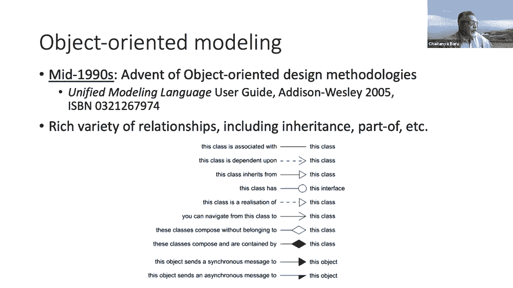

你想怎么储存，现在我快进了，从那里到现在三十年了，呃，现在是怎么回事，我想当我提到大数据的时候，呃，所以一路走来，呃，发生的是我们产生大量数据的能力，多亏了我们产生的所有计算能力，在这个过程中。

我们发明了互联网和网络，呃，这导致了信息的扩散，这些信息在某种意义上都是联系在一起的，仅仅因为他们都有联系，呃，呃，因特网上的节点，嗯，但那真的是各种不同的呃，数据上线，您在Web上看到的非结构化数据。

但许多幕后网站都有一种深度网络，这可能来自结构化数据库，这里有很多异构数据，因为这并不是设计好的，任何人都可以在Internet中添加节点，它只是碰巧有它所拥有的任何数据，可能有些节点有很多图像。

其他人有文本等等，等等，可能会有关于你作为个人的信息，你所连接的所有不同的东西，不管是你的图像，这是你的嗯，来自您的其他信息，呃，让我们说，cv，嗯，可能是，呃，其他类型的信息可能是，让我们说。

与大流行的另一个时期有关，呃时间，你知道，疾病相关信息，以及随之而来的一切，可能是，呃，地理，呃，位置信息等，所以这是一个非常广泛的信息范围，呃，我们必须处理的，嗯，我们对网络的需求是。

我们如何创造以某种合理的方式搜索所有这些数据的能力，嗯，我们想要什么样的知识表示方案，以及哪些不同的方案，嗯，所以我们会触及，我不会详述这件事的任何细节，正如我所说的，这样做的目的是让你。

我们正在做的项目的故事，呃，但有计划，呃，像火花查询语言，呃，都作为建模本体，呃，网络语言，呃，和，有很大的计算能力实际上使我们能够做到这一点，所以很多这个，事实上，几乎所有的事情都不可能真的完成。

如果呃，我们也没有，呃，幕后的计算能力来做这件事。

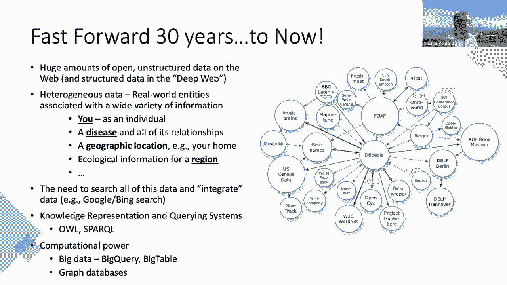

这就是我们所在的地方，我们试图把我们的手放在周围的方式，呃，我们如何管理，呃，查询并做某事，呃有用和合理的这些信息和这些数据，是什么把我们带到语义网的这些概念，所以不是说好。

这一切都只是一堆数据坐在外面，有很多方法来表示，呃，什么意思，呃，意思是，这些数据集之间有什么关系，嗯，呃，如果网上有很多数据是开放的，呃，他们怎么样，这些数据集怎么样，呃链接，嗯。

我们能用那个链接的结构吗，提供更智能的搜索界面，嗯，也许用数据推断等等，这里有几个图表显示了当人们谈论语义Web时，他们在谈论，Web上数据的链接结构，但他们也在谈论标准化的词汇。

这样我们就知道我们正在看的信息是什么，我们理解其中的一些关系，um语义网确实包含了本体的概念，我们将更多地讨论这一点，呃，基本上嗯，这些信息是如何相互关联的概念结构是什么，你将听到的另一个术语，呃。

在网上是，当然是链接的开放数据，U一次又一次，那么这个概念是，你知道的，Web上充满了使用任何标准Internet Web协议实现的数据，很多都是开放的，嗯，其中一些实际上可能是通过使用，呃。

诸如描述框架的排序之类的方案，rdf，那就会，呃，看看只是，呃，呃，一会儿，嗯，这实际上形成了另一个结构，这里你看不到，当我们谈到链接开放数据时，我们不一定看到，呃，我们需要一个推理系统，规则体系。

本体等，但这些都是相关的，呃，概念和主题的变体，这是要记住的，当你浏览这个知识图和知识网络的领域时，嗯，人们可能会认为在表现和能力上有微妙的变化，嗯，但那些确实存在，在某些情况下。

你有一个大的社区在背后，呃，看待事物的方式与另一种方式。

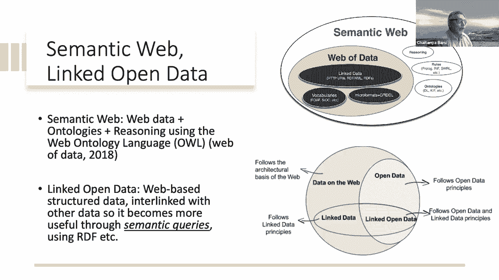

嗯，我还想提一下，嗯，将数据连接在一起的概念，使数据更容易搜索和发现，然后农业联系是非常流行的，它是最活跃的地区之一，呃现在正在进行，这就是为什么你和如果我们有兴趣在这条赛道上，这里有一个例子，嗯。

一些当前和正在进行的数据点世界，呃实际上是一个组织，这是一家提供，嗯，组织从元数据开始到，在某种意义上具有丰富的元数据，即显示关于数据集的元数据中的所有结构和关系，呃他们自己，呃，也代表了，呃。

使用知识图中的数据，呃方法，我们会，我们将更多地讨论什么是知识图，呃，但是如果你去数据点会引用，呃，他们会说他们是由知识图驱动的，自动，构建数据和洞察的连接网络，你可以探索关系。

现在你可以得到相关资产的建议，所以这些都是结合在一起的概念，所以一旦你有了你想要的东西，你就可以用与其他东西的联系来表示，那么你可以想象像搜索这样的操作可以增强，或者推荐系统可以增强。

因为如果你最终在一个节点上，你可以说好，现在你在这个节点上，你知道还有其他节点连接到它，你有兴趣看那个吗等等，所以这些都是活跃的正在进行的企业，现在来创建这些知识图表。

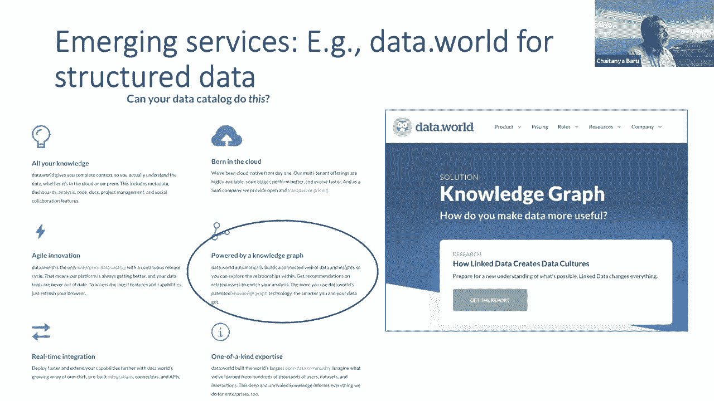

呃，所以让我们再说一遍，通过非常高水平的介绍，所以当我们说知识图时，现在，我们说的是在那些，嗯，所以我开始了一个层次，说可以有一个非常抽象的高层次，呃，什么知识本身是正确的定义。

如果你查阅你的标准参考资料，嗯，几乎有哲学的思考方式，呃，我们不是的知识，当然是在说，呃，那种，呃，在那个抽象层次上，呃，你可以谈论科学知识，嗯，这是一种调查方法，根据收集可观察到的，可衡量的证据，呃。

推理，呃，该方法包括通过观察和实验收集数据，制定和检验假设，现在开始接近我们可能感兴趣的，因为我们对数据感兴趣，我们感兴趣的是人们在收集数据，这些数据很可能是科学观察。

我们想开始在观察到的数据之间建立关系，当然，观察到的数据不一定只是科学，呃，商业和数据在某种程度上都是观察到的数据，人们可以争辩说，和呃的定义，科学知识没有用处，说嗯，应该是。

因为系统显然应该是动态的和自组织的，因为这就是科学，科学再次充满活力，如果你想到流行病，一年前我们对Covid-19了解多少，我们现在知道什么，关于如何从中恢复，我们知道什么。

当时与现在不仅仅是社会信息，但是整个科学知识只是在一年的时间里发展起来的，所以它是非常动态的，那么你创造的结构是什么，稍后我会提到这实际上将是挑战之一，我们如何真正保持这样一个高度动态的系统。

自我一致的、功能性的和可用的，因为它一直在变化，呃它，知识必须构成对外部世界的某种表示，呃，我们感兴趣的是观察到的现象，嗯然后一定有办法，呃，退出，应该有某种方法可以让你很快做到这一点，换句话说。

我们如何处理这个，如查询处理方法或其他分析。

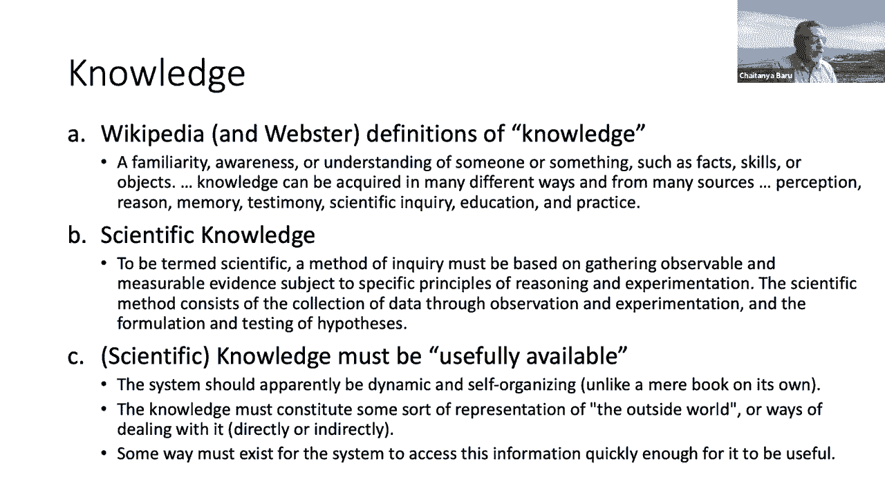

我们想这样做，就像我在知识图上说的，我们关心的不是所谓的哲学知识的认识论意义，呃，这实际上是一种非常数据驱动的方法，我们关心，我们说我们有一堆数据，我如何用这个知识图机制来表示。

数据是关于现实世界的实体，嗯，这个实体及其关系的图表是任务，是知识图的开始，我知道在介绍性讲座中，我认为，呃，呃，乔杜里教授，呃，给了你，呃，他确实把这个作为知识图的模型。

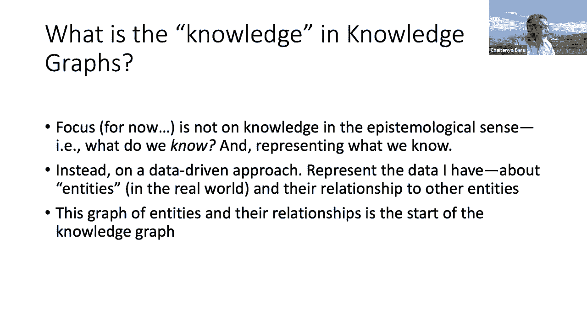

嗯，这只是一个快速的参考，嗯，嗯，回到二十六年，有一篇论文定义了知识图的各种不同定义，嗯，主要包含真实世界的实体，他们的关系等等，纸张显示了一个如下所示的图表，知识图的体系结构，当然有知识库本身。

那是数据本身，但是本体论这个术语又一次来到了这里，我们会回到这个问题上，呃，你知道吗，这些数据必须符合某种已知的，呃，结构或非概念层次结构等等，但它也展示了一个推理引擎，呃，所以基本上，呃。

查询并对数据做更多的事情，这被定义为，嗯，知识图，所有这些加在一起，所以既然本体论这个术语出现在这里。

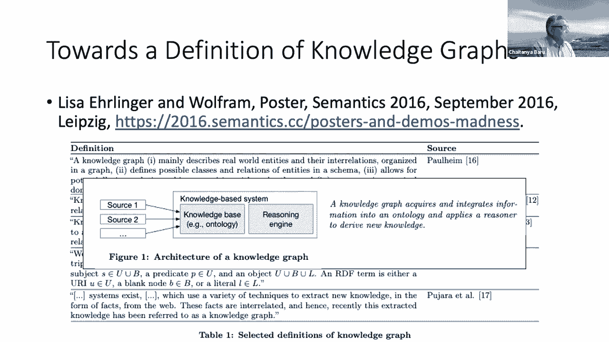

让我们看看那个，我和我想你知道我们的功能定义，呃，基本上你认为本体论是对事物的更正式的表示，我们也许可以用自然语言来描述它，所以如果有一套概念，一组观察，呃，那可能是科学数据。

我们可以讨论它们是什么以及它们之间的关系，呃，这可能是推导什么的开始，呃，你的本体论是什么，呃看起来像，嗯，所以中间的图说本体论，在某种意义上，呃，你可以把它看作是有两个目的的，嗯，它帮助你表达内容。

所以它有助于将内容形式化，呃有助于表达结构，嗯，也许是类层次结构，也许关系，呃，什么和什么有关，什么原因，什么，位于哪个实体，在哪里，呃，哪个实体派生自，什么其他实体，或哪个实体并影响另一个实体。

呃都可以帮助你定义，什么呃，它的结构是，基本上另一边的数据内容，它还被用来定义域本身，可能还有其他方面，呃与信息的治理有关，呃，如何用它进行推理，嗯，这是在什么背景下提出的。

所以其中一些可能是与之关联的元数据，呃，所以它有两面性，有内容的一面，数据表示的uh，这是描述它是关于什么的领域方面，这里有一个例子，一个矫形学可能看起来像，有趣的是，它，这有点回到我们的1970年。

教授、大学和课程类型图，在这种情况下是大学，有学校，有研究小组，大学，呃也许雇人，呃，但是他们有研究人员和研究人员，那种，研究人员有出版物、书籍和文章，各种出版物，等等，所以这种结构是什么，呃。

本体帮助我们，呃定义，它们很有用，因为在某种程度上，这就像是在说，我们记得我们一开始说，Web上有所有这些非结构化数据，从那以后，我们慢慢地回到说好，上面应该有一些结构，所以这是一个有趣的游戏。

这里是我们从数据开始，我们说好，我们需要能够放一些，呃结构，IE本体，呃在那上面，但他们从哪里来，呃，我们如何定义这些本体，所以我喜欢，你知道吗，我想我们可以说有两种方法，嗯，对本体论的思考。

一个只是设计它们，你可以得到一群人，围坐在桌子旁说，是啊，是啊，大学是什么样子的，得出这个图表，它有这个，它有这些组件等等，这种情况在科学上经常发生，嗯，我肯定在满是，嗯，让我们说，地震学家。

地球科学家将坐在，试着从科学的角度来定义什么是地震，对呀，什么是地震，这是地貌的不连续，而且你知道，继续下去，所以你可以坐在那里根据你所知道的来定义，本体应该是什么，另一种方法。

它是从所有这些非结构化数据中派生出来的，我们有很多可能是短信，我们可以看东西，课文中描述的呃，所以这里有一段真正谈论的短信，以及使用药物进行的动作，以及使用的数量，嗯，所以你可能需要一些系统。

这至少会告诉你，这是一种药物，这是用它做的一个动作，还有这些东西，这些数字是数量，但你实际上提取了所有这些并找到它们之间的关系，这实际上是开发本体的另一种方式，所以两者都有效，嗯，都有自己的问题。

嗯在某种意义上，从非结构化来源导出它的第二种方法，我想还需要一些检查，至少在科学用例中，呃，你还想拥有，也许专家会看，呃，但它实际上可以非常强大，因为你可以做得更快，并不是所有的都需要检查。

这有点取决于应用程序是什么。

希望我以后说的话，呃，揭示一些，呃，好的，但回到实体，呃，我们想在这些知识图中拥有的，他们从哪里来，所以到现在，正如我们所说，我们在世界上有很多结构化数据，我们也有很多非结构化的数据，呃。

所以结构化数据是你的典型，你可以把它看作是关系数据库，呃，行列之类的东西，嗯，它们是当前的公司数据库，事实上，许多科学数据库都有这种结构，他们确实有模式，你可以从这些表格中推导出你的实体。

您可以派生您的本体，从那些模式中，呃，至少有一部分，但也有大多数数据，绝大多数数据仍然以非结构化形式存在，呃不管是呃，正文，呃，视频，呃，各种信号，我们希望能够再次提取，正如我们目前所看到的。

所有这些东西的结构，正如你所听到的，出现的模式之一，呃，在你之前的讲座中，节点边，呃，模型和RDF是基本上是三重模型的模型之一，那是主语谓语宾语，连接，查杜里教授教授知识图，呃。

这就变成了一种非常简单但非常强大的方式来表示这些信息，请注意，在这一点上，我们并不真正担心，呃，储存效率或处理效率，等等，我想以后，我们将发现有足够的，或多或少有足够的计算能力来完成其中的一些。

效率很高，尽管我认为这仍然是一个计算机科学问题，如何真正建立，呃，高度可伸缩，超大型高效系统，呃，知识图，所以呃，就像我们之前说的，我们试图再次把这些结构带回来，呃，非结构化的东西。

如果我们有这样一个简单的模型，那只是一个主谓词对象模型，嗯，我如何表达比简单的三重模型更复杂的东西。

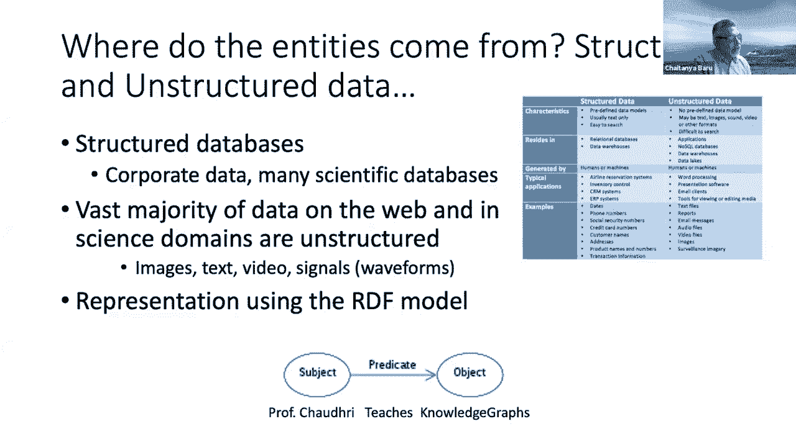

所以我们再一次回到开发模式的概念，它们是，你知道的，某种意义上的本体，基本上向你展示了一些基本的关系，呃，在物体之间，呃，但在一个，我想说的比你可能做的更像是一种失败的方式，当你试图坐下来定义，呃。

严格的关系数据库模式，具有所有的完整性约束，呃，与数据库一起，好的，所以模式定义和模式组织的整个运动，呃，已经变得非常，嗯好吧，它使用得很好，你可以说它变得非常流行，如果你去模式或网站。

这里说网上有超过一千万的网站，使用schema org标记网页和电子邮件消息，对所以如果你，如果你在谷歌或谷歌地图上搜索，然后呃，你在找一家商店，它带你看商店，它甚至可以告诉你什么时候最忙等等。

这些实际上都是结构化的数据，因为有人决定加价，嗯，在模式或标记中，并将其放在Web上，然后这些知道如何处理RDF的引擎能够解释它，发生这种事的原因是因为有太多的商店，数以百万计的商店在网上有信息。

所有的商店都发现这样做很有用，所以这基本上是模式进化的一种方式，只是有很多人，外面有很多数据，那是一种非常相似的，发布这种数据的人愿意标记他们的东西，因为它有一些好处，在这种情况下。

搜索引擎以一种更好的方式显示他们的数据，如果他们没有把它标记出来，所以谷歌的应用程序，微软，Pinterest，等，等，都在使用这些功能，嗯，这个非常基本的模式，让我们看看我需要在屏幕上移动一些东西。

我们开始了，呃有一个非常基本的模式，基本上事物和事物都与行动有关，事情可能是创造性的，工作可能是事件，呃可能是无形的，等等等等，然后是数据类型，有一个类型层次结构，有这些非常基本的类型，很简单的。

基本模型，呃首先，嗯，然后嗯，这样的模型可以扩展到新的应用程序中，所以在这种情况下，嗯，突然我们意识到你知道我们需要能力，呃，描述特别公告，这样我们就可以把它，呃，在层次结构中。

所以我们可以在创造性的工作下，在东西下面，我们可以说有一种叫做特别的东西，现在突然间，每个人都可以开始用它标记，你知道任何RDF处理引擎都会看到它。

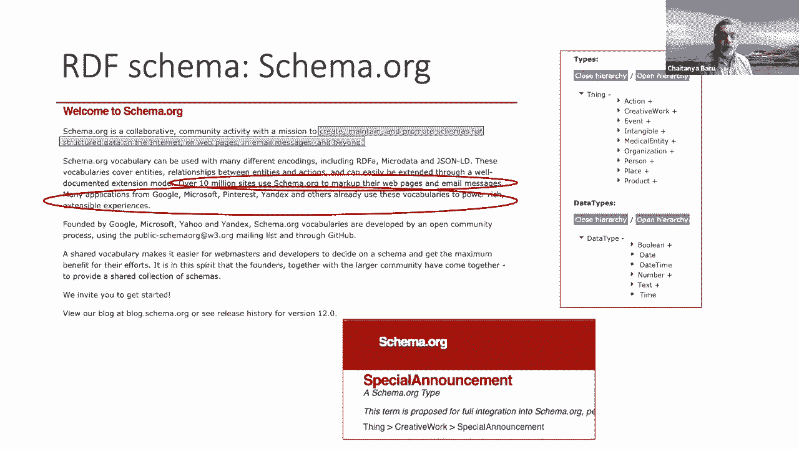

所以从这个意义上说，它是高度可扩展性的，他有一个具体的例子，嗯，Covid-19期间发生了什么，呃，大约一年前，并实际参与，这与谷歌的人合作，因为他们想，呃，所有政府机构都使用该模式，呃，标记。

这样政府网站就可以贴上正确的标签，呃，呃，在十九信息中，人们可以更快地找到这些信息，所以20年3月16日似乎是很久以前的事了，呃，他们宣布他们将对模式进行一些扩展，以适应，嗯，COVID十九信息。

所以特别公告作为其中的一部分，嗯，接下来这个，呃，有一个与模式相关联的博客，它向您展示了所有的更改，和新版本，等等，所以模式组织的版本七点零，发行于2020年3月17日，我有所有这些变化，嗯，其中一个。

它说这里引入了一个虚拟位置类型来支持事件的描述，其位置在线，对呀，所以突然间，他们需要人们去一个，呃，事件站点将需要被告知该事件实际上现在已经变成虚拟的，所以你不去这个身体，有呃，他们的虚拟坐标。

那么我该怎么表达呢，所以这是一个扩展来支持，所以增加了活动出席模式，澄清活动的出席模式是否在线，离线或混合，当然，现在我们都习惯了混合教室，或者所有的网课等等，但这些想法在一年前都不存在，对呀。

所以我想把这个拿出来给你看，这种方法的一个好处是你可以非常动态地改变事情。

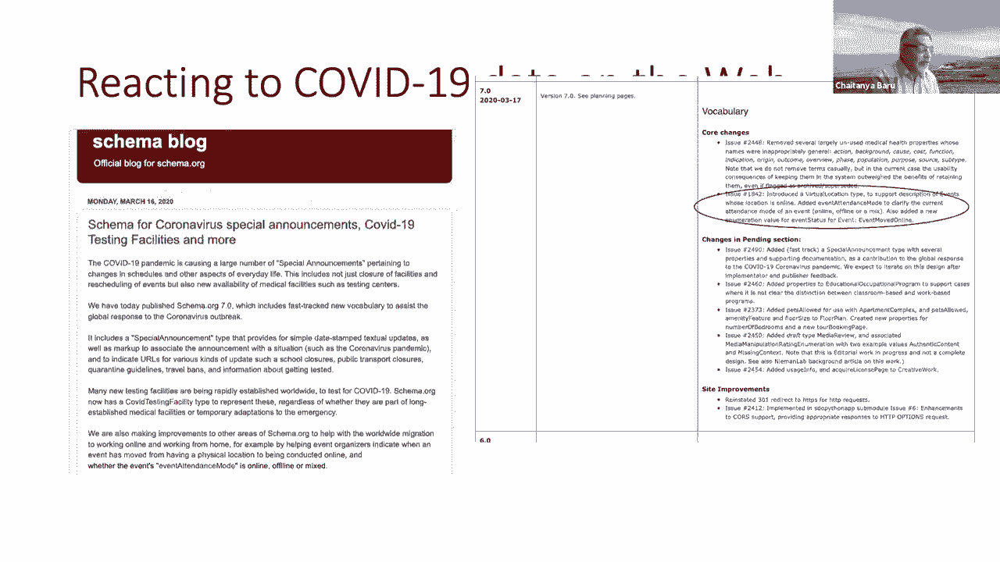

然后这里有一个更详细的，呃，标记，…的描述，你知道，真的是本体，模式，呃点组织扩展，然后人们可以用它来标记，呃，他们的网站，呃，有疾病预防信息，疾病传播，统计，获取测试信息等，等等。

所以这可以是非常动态和非常灵活的，通常情况下，你想在社区上达成某种共识，代表什么样的东西是正确的，呃，这里有一个案例，这是非常迅速的，我想在事情发生后的几周内，呃，开始的想法，呃。

我们有一群人同意这一点，它包括，嗯，做模式的人，呃，一些私营部门的人，处理医疗信息，呃，像HHS和Health这样的地方的人，联邦政府和疾控中心的卫生和公众服务，所有人都很快地看着它说，好的，是的。

这是有道理的，让我们做吧，一旦你有了这种三重奏，嗯，你确实有一些模式，呃，你可以再次使用，这些是我不打算详细讨论的，我想你接下来会有更详细的讲座，呃，火花加工和分布式火花的技术说明等，呃。

但这只是说有一些查询语言可以使用，看起来很合理，如果你看看这里的语法，我们说，选择呃，联系人的姓名和电子邮件，对呀，这就是这个查询的内容，所以很明显有一个本体论，在这种情况下。

它实际上是一个众所周知的本体论，叫做朋友的朋友，已出版和可用，所以如果你，如果你最终用它来描述一个人，那么很多工具就会自动识别你在说什么，呃，用FOF，呃，本体，我们可以说，你知道，所有人。

我想知道他们的名字，而你，是呀，第二个是另一个例子，你知道我们在想象，有一个本体论说，呃，国家，呃在大陆上，各国都有首都，呃，因此，我可以问一个问题，说，给我非洲所有国家的首都，对呀。

所以我只想展示这个，至于说我们来了，最终你知道，在RDF之上创建了模式的结构，呃，因此，我们现在实际上有了一种查询语言，我们可以用来处理它，如果我们是我将暗示的一些人，后来。

在我们的项目中有需要扩展的地方，当你添加更多，嗯，我们就叫它吧，更多种类的数据进入系统，嗯，目前Sparkle本身的能力可能还不够，事实上有一种叫做地理火花的东西。

它扩展了地理空间和特殊类型的操作员的火花，所以这些会继续发生，这是进化这些东西的自然方式。

那么为什么我们想要这个知识知识图，呃，是什么促使我们拥有这些并使用这些，在，呃，一种开放的网络，或在商业部门，呃，有像搜索这样的应用程序，呃，谷歌必应，呃，地图应用程序，都使用这些知识图。

因为他们有那个，他们确实有这种，嗯，图式或某种结构的幕后，所以当你输入像伽利略这样的东西时，呃，当他们意识到你在说这个的时候，嗯，首先，有一个认识这个术语的问题，但后来他们说，哦。

他们可能会给你一套选择，其中一个是，伽利略，的，呃，科学家和艺术家，如果你点击它，嗯，他们会认识到这实际上是一个艺术家，拥有，嗯，很多相关的作品，呃和他或她在一起，以及信息的表示方式，在某种程度上。

展示本身是由知识图诱导的，和目录一样，如果我在寻找什么，嗯在购物目录里，有像嗯这样的事情，搜索这个的人，也搜索那个，这一切的发生是因为呃，此信息在幕后表示，系统实际上是在使用这些信息来控制。

如何向您显示，嗯，在屏幕上，所以这是一个非常强大的能力，同样，也有像Siri这样的智能助手，等，他们也在使用知识图，你知道的，给你一个明智的，希望它是稍微完整的回应，我们为什么要关心它，在科学应用中。

嗯好吧，即使在科学应用中，我们也关心搜索、发现和数据探索，这是因为许多原因，其中之一是科学数据的爆炸式增长，如果你是生物学家、地球科学家甚至社会科学家，外面有更多的数据，然后曾经有，你知道的，几年前。

十年前，二十年前，呃，我们需要更复杂的能力来搜索这些数据，情况不再像呃那样了，一位科学家说，哦，我在寻找这种生态数据，我很清楚去哪里买，你不再，因为有这么多的来源，另一个巨大的，呃要求，呃。

我想我们才刚刚开始，基本上，你可以松散地称之为集成，非常异构的数据，所以科学本身正在朝着一个方向前进，无论是在医学上还是在气候变化上，呃或任何其他领域，你可以认为，呃，交通基础设施。

它不再是单一的数据模式，你所看到的单一模态，你看到的数据来自各种来源和学科，呃甚至，所以这是非常异构的数据，我们需要一些方法，我们应该，我们应该能够把所有这些联系在一起，而不是让科学家们战斗到底。

呃从一些基本的，每次呃，使所有这些数据在知识图中连接在一起，这种方式也将使分析，所以你可以做一些更聪明的事情，嗯，就像推荐引擎可以为你推荐东西一样，因为他们知道关系，科学搜索也可以为你做到这一点。

还有另一个极端，将数据与模型联系起来的一个快速增长的领域，因此，我们越来越多地使用机器学习模型来推导，嗯，你知道吗，数据集的结果，呃，我们希望能够把这两者联系在一起，说，呃，比如说，嗯。

不仅仅是这个模型是从那个数据集导出的，还可以说，呃，像这样的模型可以用于类似的数据集，好的，这是一种关系，知识图，一种关系机制。

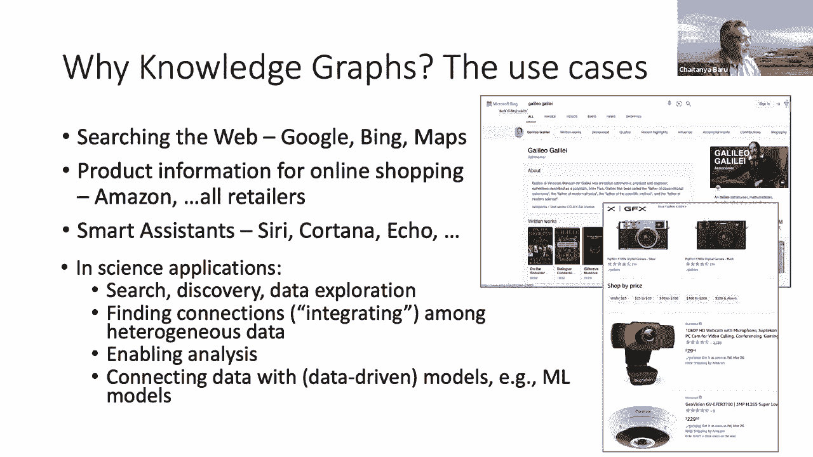

这些事情将变得越来越重要，那么我们从哪里得到这些，所以如果当这些人在我们建造的时候，呃，让我们说，当谷歌和亚马逊，等等正在构建这些大型知识图，呃，你得从某个地方收获这些实体，呃，首先，呃。

所以一个动作是，呃，嗯，这里没有捷径，事实证明，我们只需要把它们做好，所以原来有这个，呃，一个项目，嗯然后嗯，最终成为一家名为Freebase的企业，20年开始，呃，二千零七年，呃。

实际上从许多现有的来源收集数据，并做了所有艰苦的工作，把它放在一起，想出实体关系，以及它的三重模型表示，在这种情况下，谷歌收购了它，然后在内部使用它来本质上为他们的素数赋值，他们的知识图表，对呀。

所以现在有一个谷歌知识图，呃，带有API等，同样二十二，呃，Wiki数据最初是作为收集数据并表示数据的一种方式，它实际上不仅仅可以用作文本，但是在这种知识图的方法中，嗯，几年前在2018年有一次演讲。

呃，从呃，亚马逊的卢娜·东，谈论亚马逊是如何建立他们的知识图表的，其他公司也有很多类似的故事，它是获得他人的结合，谁做了艰苦的工作，还是你，你只是坐下来做所有的工作，好的，所以嗯，当我们看到所有这些。

嗯，我们认为我们现在正在从科学的角度考虑它，正如我所说，随着科学的发展我们说的重点是，我们需要在科学应用中也有一个类似的系统，这样我们就可以使，就像我在搜索前说的，这个发现，科学数据的整合。

所以回到2017年，有一个呃，在联邦政府机构中举办的讲习班，这导致了本报告，称为开放知识网络报告，基本上是说一个开放的，需要广泛的社区努力来发展全国性的基础设施，使各种利益攸关方广泛获得所有这些数据。

正如我所说，随着科学变得更加综合，这并不是说一个科学家群体产生的数据正在被使用，只有科学家们，越来越多的一个社区可能会产生某种数据，集合，另一个完全不同的社区想使用它，因为他们正在做的分析，嗯。

就像你知道的，如果你想说，建立交通网络，你可能真的想要得到很多社会经济数据，因为你关心社会，呃，社区中可能存在的经济差异，你想看看交通基础设施是如何凝结的，你知道的事实。

真正需要交通工具的人住在哪里等等，所以通常你会认为这是两个非常不同的数据集。

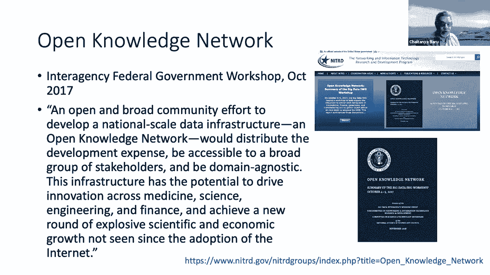

一个来自运输工程部门，另一个来自社会经济，呃数据集，呃传感器之类的东西，所以这个基础设施有可能，你知道的，真正推动了许多领域的发现，所以我想我们确实认为这是未来非常重要的基础设施。

然后我现在会很快给你一个感觉，我们目前有五个项目正在进行中，呃，他们使用这种方法创建知识图表和知识网络在非常不同的，有非常不同目标的领域，我给你描述一下，但在这之前，它的笑点是，嗯。

做这些事情实际上需要一个异构的团队，双方的合作，UM知识表示知识图，一方面是计算机科学类型的专家，但他们知道系统的能力是什么，限制是什么等等，你需要领域专家，因为域的人真的是。

一个可以帮助你处理这些本体和关系的人，重要的关系是什么等等，但你也意识到即使在科学上，呃，数据实际上可以来自非常不同的来源，它们实际上可以来自高度精心策划的科学数据库，这是众所周知的最高质量。

经审查的整理数据，非常可靠，但它们也可以来自众包，对呀，观察事物的人，嗯，这可能发生在，比如说生态学，但是很多人都做过生态观察，他们是不是在看鸟，或者他们在看鱼，或者他们出去钓鱼了。

他们会来报告他们所看到的，这是众包数据，同时，有科学家在同一领域收集高度监管的数据，我们还发现，这项技术是如此，教育下一代科学家也是至关重要的，你实际上是如何使用这些工具的，你怎么样。

即使不管一个工具有多强大，它确实有它的局限性，知识图只取决于它所建立的数据，呃，摄入的那种，它可能会做质量控制，所以要理解这一切，呃可能不是科学家们在他们自己的学科中自然会学到的东西。

他们可能会了解数据的某些方面，但不是，呃，这类事情，所以所有这些都很重要，事情是要吸取的教训，呃，我们通过一种叫做融合加速器的东西来支持这五个项目，所以趋同是一种概念，即多学科需要走到一起。

加速器是这样一个概念，嗯是的，这些都是可以加速的项目，如果你给他们足够的资金，在几年内，它们可以产生重大影响，所以我只想提一下这个，你就会明白为什么我不一一细说了，但是NSF的这个节目，这是非常不同的。

不像其他任何东西，这就是它本身，经历这三步过程，我们第一部分在这里并不重要，但我们确实经历了一个构思阶段，来决定我们希望在哪些领域进行项目，所以正如我提到的，开放知识网络是一个领域。

我们就是这样想出那个区域的，但一旦我们选择了一个我们做项目的领域，经历第一阶段和第二阶段，这些很快，第一阶段长达一年，你可以得到七七，五万元，嗯，基本上是让你把多学科的团队聚集在一起，并做原型以了解。

我们要建造什么，会有多复杂，我们准备好出发了吗，呃，在第二阶段建造它，第二阶段是，你两年最多可以得到500万美元，这实际上是相当多的资金，但这个想法是跟着它跑，向前走，做你想做的事，呃。

你在第一阶段计划做什么，有一个课程，我提到的原因，这是你在第一阶段要做的事情之一，所有队伍都要学习课程我想说一点，因为事实上，这对于开发知识图很重要，我们的课程包括，嗯，好的，它包括用户嗯。

关于的模块或课程，如何进行用户发现，或者你如何找出你的用户是谁，呃以人为中心，呃设计嗯原型，你知道，确保你明白原型意味着什么，有哪些不同的步骤，嗯，你还记得这些团队非常异构，他们并非都是计算机科学家。

所以像计算机科学家甚至工程师这样的人可能知道什么是原型，因为他们可能建造了一些东西，但并不是所有的科学都有相同的原型概念，就像软件原型，就像计算机科学家自然能够想象的那样，和团队科学。

你们如何在团队中一起工作，你有各种各样的人，还有其他的模组，但这最初的四件事我想说，我想我们意识到这对发展像，实际上是为了开发开放知识网络，编制知识图表，因为事实证明，在建造这些东西时，你真的需要明白。

它将如何使用，所以您不打算抽象地构建这个，关于它的用法的思考分歧，事实证明，你必须对这些东西进行原型化，因为，嗯，你知道它对用户来说仍然是模糊的，你必须向他们展示你在做什么，然后他们可能会说，哦，那是。

你就是这么表现的，你就是这样给我看的，实际上我不喜欢，否，你不应该这样做，所以你可能得回去做，和，当然是团队科学，因为当你把技术人员和科学家聚集在一起，他们是非常不同的文化，术语，人们需要能够一起工作。

我认为这也适用于公司环境，如果你有技术人员建造，总有一个顾客是你送货上门的，你必须很快意识到这一点。

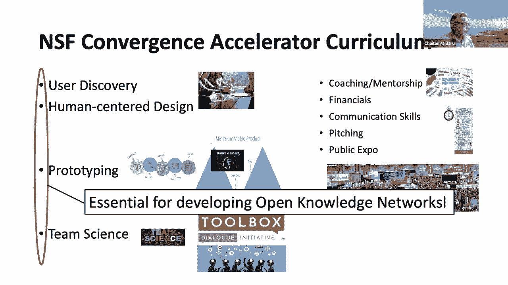

城市防洪计划，呃基本上是创建一个与城市洪水有关的知识图表，这里的图表显示在地图图表的右侧，呃表明在城市环境中，实际上有各种各样的孤立数据集，都由不同的，乡亲们，可能是不同的机构可能是不同的，实际上公司。

所以可能有电网数据，有道路网络数据，有公共卫生信息，呃，社会经济数据等，等等所以这里显示的所有这些圆圈基本上都是不相连的，因为它们完全不同，呃，所有参与将这些组合在一起的玩家。

他们为了自己的目的把它放在一起，突然间你遇到了像洪水这样的问题，你说，嗯，这将影响一切，如果有洪水，可能会导致电网瘫痪，它可能会堵塞污水系统，可能会造成公共卫生危害等，等等，所以你。

你想把所有这些网络连接在一起，实际上，所有这些数据都以某种知识的形式结合在一起，呃，网络以便能够回答这些问题，所以这是他们面临的一个挑战，将城市多路复用中的信息联系在一起，他们想做的另一件事。

在这个项目中独一无二的是，不仅仅是所有的数据，事实上，很多信息都是通过模型来传递的，你实际上有模型可以为你建模，如果这个地理区域有这么多降雨，这是水位将是什么，洪水可能是这样的，嗯，事实证明有。

如果没有，呃，嗯，至少数千，如果不是成千上万的洪水模型，每个地区都有自己的模式，好的，所以每个地区都有自己的专业知识，呃，佛罗里达的人，我的遗嘱可能会告诉你，哦，你来自加利福尼亚。

你不明白这里的水是怎么工作的，现在我们了解了如何在这里对系统建模，和来自加利福尼亚的人，愿你知道你能想象华盛顿的同样的事情，华盛顿州，等等，等等，所有这些模型都在生产，呃，产出，呃，以不同的精度水平。

等等，嗯，所以说，所有这些都必须放在一起，为了把观测数据和预测数据基本联系起来，所以这是它的另一个方面，这些人意识到的最后一件事，这真的取决于谁想消费它吗，这就是我们之前所说的用户，甚至在知识图中。

不是每个人都需要这些知识，呃以同样的方式服务于他们，所以要看情况，你只是一个普通公民吗，想知道，水会进入我的房子吗，还是我的街道会被洪水淹没，或者是管理电网的人，想知道。

在什么时候我需要关闭这部分的电网等等，等等，正因为如此，呃，即使潜在的知识图是相同的，基本基础数据是相同的，你如何传授，对最终用户来说会有所不同，这就是这个项目，嗯，其中一些，我应该说。

其中一些你可能可以谷歌和在网上找到信息，但这些团队都在积极合作，我今天刚和他们开了个会，要建立一个更好的网站，在那里所有这些信息都可以获得，所以你知道，观看空间。

在接下来的六个月里网上应该会有更多的信息，另一个在完全不同的区域，这是生物医学，是可扩展精准医学的辐条项目，我应该抱歉，我应该在上一篇提到的，是莉莉教授送的。

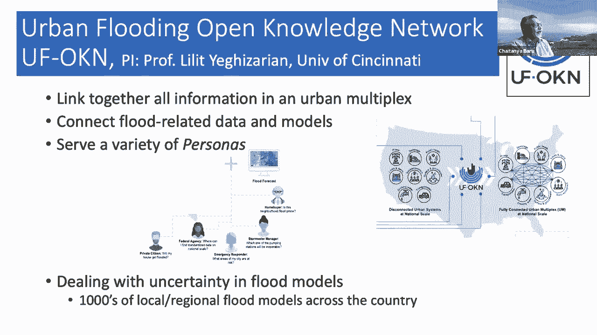

呃，来自辛辛那提大学，就是圆周率，但这个是塞尔吉奥，贝尔齐尼，来自UCSF，正如这里的图表，我是说，正如这张图表所示，他们实际上是在把异构数据放在一起，在这种情况下，有基因，嗯，这是人类健康。

所以有人类基因，有疾病，疾病所在的组织，呃有关，基因在哪里表达，这些东西之间的关系，所有这些围绕着大圆圈的小圆圈，在底部的小圆圈里是所有独立的数据库，你知道的，持续了很多年，并大力收集数据，关于免疫学。

肿瘤学等等，等等，嗯，反应回家，等等等等，它们都位于不同的数据库中，他们想做的是齐心协力，将所有异构数据转化为知识图，然后能够回答关于疾病相互作用的问题，呃，他们的一个用例是药物再利用，你知道吗。

他们能通过知识图发现给定的药物，呃其实有一些，呃，它可能不知道的属性，仅仅因为他们发现了联系，我现在不能详述细节，但他们实际上发现了一些与Covid相关的基因联系，在论文发表之前。

实验室实验就是这样做的，他们只是在数据中发现了它，他们推测这可能是一个联系，然后还有其他人发表了其他论文，表明一个印度人是一个联系，呃，他们谈论金属节点和元边缘，这真的只是，嗯其实。

以及实体类型和边缘节点，呃，边缘类型，你可以想到，所以基本上就像，这是一个模式定义，他们所说的元是，他们说好，有不同类型的节点，所以每个节点都是一种元对象，我们的图由不均匀的节点集组成。

但是从一组类型中提取的异构节点，同样地，这些边都是从不同的类型集合中绘制的，然后有一个完整的查询处理，可以做一次，你知道，边缘类型，节点类型和连通性，实际上有一堆呃参考资料，我我想呃。

幻灯片已经在上面了，所以你应该能看到，一些非常有趣的论文，第一个很好地总结了，从知识图上看整件事是如何工作的，观点，观点，第三个项目又是完全不同的，在这个案子里是法庭记录，法庭记录，司法管辖区，你是呃。

这里的问题是所有的法庭数据实际上都是公共记录，现在，一旦一个核心案件上了法庭并在法庭上得到裁决，呃，不管是，你知道的，庭外和解，或者实际上，呃，提起诉讼的，等，所有这些文件都是公共信息。

除了现在它们都在PDF文件中，有一个网站，你实际上必须支付一些钱，对于您查看的每个PDF页面，所以说，呃，尽管这都是公共数据，呃，你付钱，就因为他们说，嗯，我们需要一些努力才能穿上它。

所以这个东西试图做的是把所有的数据，通过知识图来打开它，对呀，所以他们会处理所有的PDF文本，寻找所有的实体，所以文本中的实体可以是法官的名字，代码的名称，管辖权，是什么样的案子，它是，当事人，等等。

等等现在，它是，呃，你甚至不能做一些最简单的查询，你可能会想象，就像一个随机的查询，就像法官，这种类型的案件有多少，让我们说，um攻击，法官在他们的职业生涯中尝试过吗，你不能问那个问题。

都在PDF文档里，但它不是可以访问和查询的形式，所以这就是这些人试图做的，他们非常关注这里的正义和公平问题，呃，这个过程中的一件事，呃是，他们在看PDF文档并推断结构，本质上推断文档关于什么的语义。

通过查看文档的物理结构，然后给他们暗示，哦，这上面，上面的文字是法官的名字，那边的文字一定是办公室的名字，因为所有的情况，所有关于某某的案件，你知道吗，都是这样的吧，在这个过程中。

他们实际上也在开发本体，事实证明，从来没有为法律数据开发过本体，所以像事件这样的事情，也就是，你知道案件的处理，这个案子是怎么解决的，它没有本体论，呃他们看起来。

他们看到病例实际上有一个生活方式生命周期，他们实际上经历了不同的步骤，他们可能会回去，继续前进，等等，所以他们正在开发所有的，结构知识表示本体论。

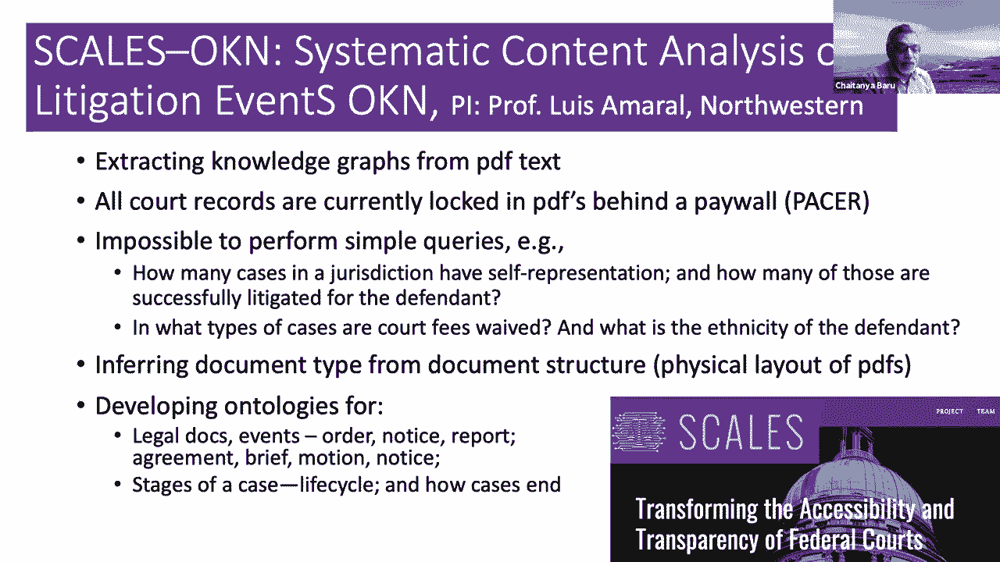

等，呃对于那种事情，下一个项目，前三个我们认为它们是垂直项目，用计算机科学的行话来说，因为它们是关于域的，对吧，这本书的第一本是关于洪水的，第二个是关于生物医学的，第三个是关于法庭记录。

接下来的两个项目，我们认为它们是水平的，从某种意义上说，他们正在开发任何人都可以使用的能力，呃，所以迈克·卡法雷拉的这个项目，他在密歇根，最近搬到麻省理工学院，本质上是开发一个知识图编程系统。

我想到这一点，我一直告诉迈克，但我认为它就像是知识图的IDE，对呀，所以当你写Java程序的时候，你不是从零开始，你有一个ID，在那里你可以借很多课，开始把它放在一起，现在类似的想法。

知识图的开发处于汇编程序阶段，它正处于手工制作的阶段，一切都要从头开始，他说得很好，让我们提高这一个抽象层次，并将其视为编程和环境，那么如何构建一个数据驱动的，系统软件系统，嗯，在这种情况下。

实际上是知识图驱动的系统，其中数据质量调试内置到编程环境中，嗯，社会知识网络的概念是建立在，这实际上是一个有趣的，我认为非常强大的概念，因为在现实世界中，当你开发这些知识网络时。

这又回到了我们团队科学的想法让团队来做这件事，这不是个人的，呃活动，不是一个人真正做了这件事，因为你需要专家，你需要技术专家和领域专家，所以这实际上是一个团队合作，在这个意义上的活动和社会，另外。

如果你把一个关于某件事的知识图放在一起，比如说交通，他们可能是交通专家，你知道全国各地，或其他地方，你可能想和谁互动，说你知道我把这个放在一起，它看起来像什么，所以如果你看看维基百科和维基数据。

它们实际上是社会制度，因为任何人都可以去编辑，有一种，不仅仅是人群方面，但事情的发展有一个社会方面，这基本上就是我的想法，是啊，是啊，如何提供一个具有这些类型的编程系统，呃，环境中自然支持的东西。

随之而来的还有，来源来源实际上是这些东西的一个非常重要的方面，尤其是当你谈论科学数据的时候，你想知道，这段数据是从哪里来的，所以如果你在系统内完成了，那么在这个过程中追踪来源就变得容易多了。

他们也在开发其他工具，他们有将Web数据作为RDF摄取的工具，使用一些机器学习，所以你可以给它几个训练的例子，它会学习结构，事实上，这个团队和法庭记录团队实际上是在合作，因为你可以在这里看到一些。

第三个从物理文档中提取子弹头的提取结构是，事实上，这两个项目的共同努力，嗯，然后他们也提供了一些能力，呃，快速从数据创建本体，这个，如果你还记得一开始，我给你看了一段关于药物和药物活性的文字。

这是一个例子，系统可以为你提取一堆术语，并要求你，嘿，这些有关系吗，这里有类层次结构吗，等，等，用户可以告诉系统它是关于什么的，这样那样，系统学习得很快，本体是什么，所以它基本上是人类的，又是那个。

有一份技术报告，这是最近的事，呃三月，呃第二，描述了系统，所以你可以去看看，其中一些显示了，当你在做社交网络创建活动时会发生什么。

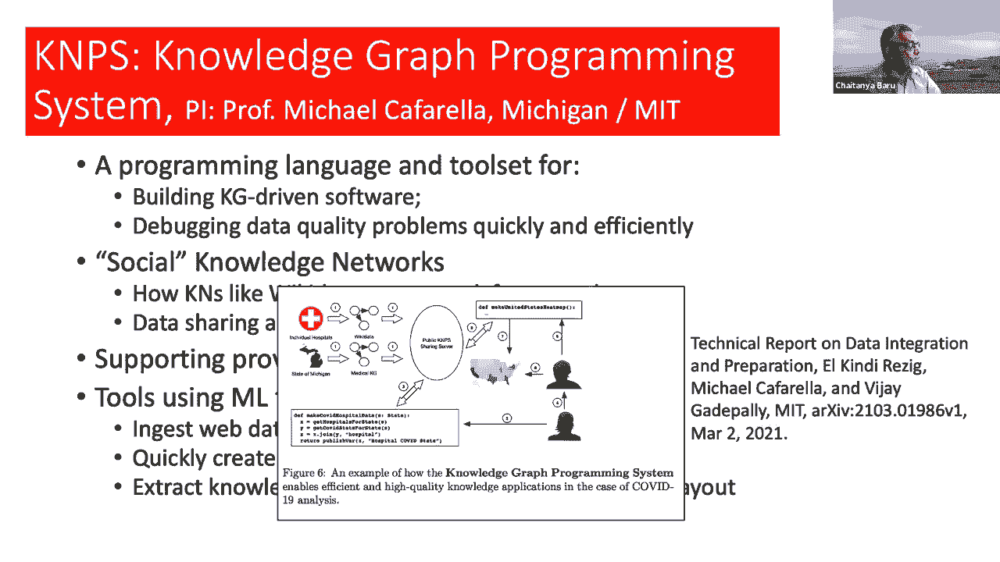

下一个是，以更好的方式纳入地理空间信息，在所有这些知识图中，所以早些时候我们谈到了地理火花，所以有一些地理能力，但事实证明，大多数知识图数据仍然是，相当，呃，在它的方面有障碍，呃，地理空间信息，所以耶。

我有一个例子，对呀，如果你去，你可以去谷歌输入这个，呃问题，之间的距离是多少，我想印度和巴基斯坦，只是因为我碰巧知道他们在哪里，也许有些人不知道，所以说，他们可能在想，印度和巴基斯坦之间的距离是多少。

谷歌会说一千四百五十二公里，和，当然好，这是什么，因为实际上有一个，这些是邻国，您可以与我们和加拿大进行查询，我不认为那很有趣，但你会得到一个同样令人惊讶的答案，嗯，那是因为嗯，在谷歌搜索中。

所有这些都表示为质心的对象，所以中心的最后一长，这些质心的中心是什么空间信息，它计算距离，质心之间的距离，所以另一种说法是，它缺乏足够的地理空间知识来说，嗯，这些其实是邻国。

所以你知道你所说的两者之间的距离是什么意思，因为它可能是零，嗯，他们这样做是为了各种各样的，呃，不同领域，嗯，实际上非常积极地与不同的，非常不同的用户社区，他们正在合作的一个是对供应链感兴趣的商业集团。

呃，数据管理，另一个是兴趣是一个对生态信息感兴趣的非政府组织，实际上我认为一个是与灾难相关的信息，呃，这是一个，就像一个国际非政府组织，在所有情况下都试图说，呃，我们如何整合有价值的地理空间信息。

所以这些数据变得更加有用，呃里面有那种东西，呃好吧，他们正在做的另一件事，如果你们中的一些人可能熟悉，最流行的绘图软件工具之一是弧形图，所以他们实际上和我们一样在这个项目中合作。

他们实际上正在建立摄入RDF的能力，基于地理空间信息的SV艺术地图，这样工具就变得呃。

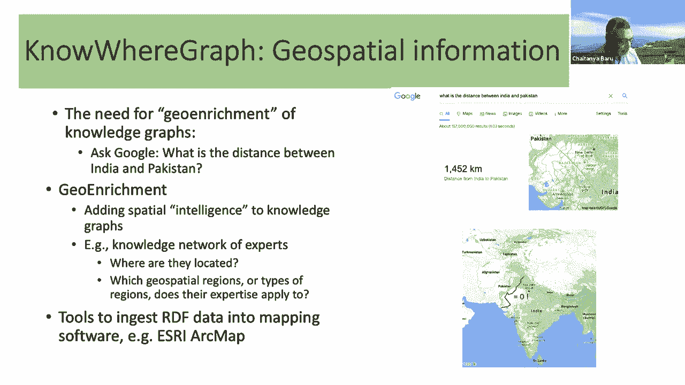

在地理空间信息方面更加智能，我最后要提到的是，有这种努力在进行，呃，在谷歌，称为数据共享空间，www。icj-cij。org，就像这里说的，如果你去那个网站，它是一个开放的知识库。

结合了来自公共数据集的数据，然后为您提供轻松探索的工具，所以他们的意思是，呃，他们实际上收集了很多联邦社会经济数据，就像人口普查局的，劳工统计局的，等等，你可以很容易地你应该试试，它很容易点击，点击。

点击并浏览并生成这些类型的嗯嗯，专题介绍，对嗯，还有其他演示，他们为你画图表，在这种情况下，有一张地图，所有这些数据，呃，它显示了该地区的大量人口和其他社会经济数据，都是从，呃，联邦数据集。

但实际上变得更容易使用，上面还有更多的工具，就像在本例中的映射工具，还有其他情况，他们有图形工具，所以再次展示了在，呃，模式，或者呃方式，rdf，嗯的方式，实体和关系，这样您就可以轻松地将数据活起来。

对呀，所以数据，数据本身在这些知识图中表示，这就是这些的全部意义，也像我们之前说的，记得我们说过，模式组织嵌入在许多网页中，你可以看到这样的东西，呃，营业时间等，事实证明，这些数据现在也被拉进了，呃。

谷歌搜索的一小部分，已经有很多搜索了，嗯，实际上，这个知识图中的一些信息可能会出现在，因为现在已经通过RDF部署和访问了这一点。

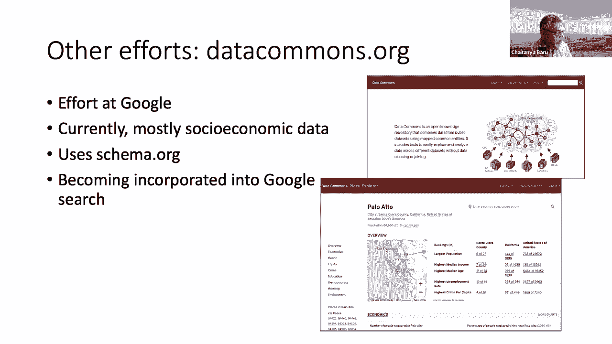

所以我想我要以这些结束，嗯，所以这里的一些问题，以我不会涵盖的术语，但是呃，你可以考虑，也许你将来的一些讲座会涵盖，这是实现，在一天结束的时候，你仍然可以让计算机科学家非常不安。

我们实际上如何表示这些东西，你知道吗，图表应该是图表吗，或者我们应该把它们转换成表格，呃，图表数据库这些年来变得越来越好，呃，新四人组，j，呃，星狗，东方，db，还有更多的电子图形，当然。

您仍然可以使用表格表示，你们可能都知道，有一些非常高效的，呃，处理这类非常大的数据的引擎，这样你就可以，三元组可以简单地表示为行，你可以用大桌子，大查询，火花，任何其他可能是你最喜欢的系统去追求它。

对计算机科学家来说可能是无尽的乐趣，你知道，分割事物并优化，以此类推另一个挑战，一个真正的挑战实际上是这些数据的动态性，因为知识图是关于知识的，不要记住关于数据知识的认识论，嗯，知识不断进化。

因为随着我们了解更多，发现更多，所以说，我们怎么怎么，这对查询处理意味着什么，对于您可能做出的任何推断等等，版本控制如何工作是一个巨大的挑战，这是一个非常强大的工具，但动态方面是有挑战性的，也是有趣的。

用户视图极其重要，事实上，一个已经出现的，即使在今天，在两次不同的会议上，人们也在讨论这个问题，是如何处理，这种基本上不确定的概念，错误数据质量，对呀，我在洪水用例中提到过，呃。

如果我是iPhone的用户，我有一个天气应用程序，它告诉我一些事情，它告诉我温度是多少，它告诉我有多少绿色，我可以期待接下来的X个小时，我对此很满意，但我不是在质疑，这上面的错误键是什么，等等。

因为你或多或少知道，它告诉我，呃，看似合理的信息，所以这种细节对我来说已经足够了，呃好吧，别人需要多少，如果别人在做一个，负责的人，嗯，运行一大堆太阳能电池板，也许他们想要更准确的关于云量的信息。

或者如果他们是科学家，就像其他科学家想分享我作为科学家发布的信息一样，他们可能想知道更多的细节，所以你在知识图中显示的，他们提供的信息模型在很大程度上取决于用户，谁是它们的消费者，他们想做什么。

这是另一篇精彩的论文，呃，pascal hitler是无处图项目的合作者之一，他有一张纸，你知道的，基本上如何设计本体，他们学到的一些教训，呃，有经验的，你需要不止一个具有重叠专业知识的领域专家。

团队中不止一名手推车工程师，因为就像我们说的，这些不是你单独做的项目，这些必须在团队中完成，没有一个人真正知道一切，这是一个方面，确实有观点，在某些观点上，两位科学家可能有一个不同的迹象。

因为人们可能会说，实际上这个概念比那个更重要，反之亦然，所以为了得到合理的东西，你真的需要团队走到一起，就像他说的，根据我们的经验，为了有一个团队，需要三种类型的参与者，可以建立一个好的模块化本体。

其实，因为你需要有人在团队中，谁一开始就明白什么是模块化本体，对呀，你需要领域专家，我们只知道域，并不在乎你把它放在一个本体论的正式结构中，你需要了解这方面的本体工程师，你需要数据科学家。

他们可以用数据做事情，他们可以做任何事情，不管是R、木星还是蟒蛇，或者任何需要做的事情，基本上咀嚼数据，用数据做所有的杂技，所以你需要那个，所以这显然是一项团队运动，嗯，但它是未来必不可少的技术。

面临着以下挑战，你知道的，活力等等，呃，我想，那是，就是这样，我就到此为止。

现在我以前没有看过Q和聊天，好的，你算吗，你认为科学模型算作数据吗，是呀，呃，甚至机器学习模型，其实，一些嗯，我们现在正在运行的收敛加速器中的另一条轨道，就是在那个阶段，我说过的一个。

uh是关于支持数据共享和模型共享，在这种情况下，模型是机器学习模型，嗯，这真的是数据对，因为你说的是训练数据集，所以你试图描述一段代码，在某种程度上，你可以说得好，这就是我所说的一些数据，呃。

所以从这个意义上说，呃，科学模型是数据，哦，顺便说一句，另一个项目实际上正在进行中，嗯，它叫MDF，模型描述格式或类似的东西，我不确定我是否做对了，呃，但他们实际上在考虑交换神经科学。

更多神经科学模型作为数据，这样神经科学家就可以交换呃，以一致的方式建立模型，所以是数据，从这个意义上说，模型也是数据，因为在类似的意义上，如果你从用户角色的角度考虑，某些用户可能不太关心模型本身。

他们只关心模型的输出，所以模型的输出，当然是数据，只要你告诉他们，所以我了解到有一种东西叫黑客作为一个G C R A S，哈斯是美国著名的洪水模型，所以如果你说告诉别人，这来自黑客，他们只需要知道这些。

他们需要的是数据，好的，嗯，所以从这个意义上说，它可能是数据，是啊，是啊，所以所以谢谢，厨师的解释，这个问题实际上来自帕特·兰利，我会要求通过电子邮件与你跟进并进行交谈，嗯嗯，如果有学生想问什么问题。

这将是一个伟大的时间，离下课还有七分钟，在我们等待学生提问的时候，呃，也许我的小组成员想问任何问题，迈克或纳伦，你有什么问题或意见要发表吗，所以一个一般性的问题，呃，为什么不喜欢整个语义网，脱得太多。

还是在一些垂直的地方起飞了，比如购物或者新闻什么的，他们在文章中有一点结构化的信息，是啊，是啊，嗯，我绝不是专家，呃，你知道有很多，呃，你叫它什么，呃，死后检验，我猜对了那个问题。嗯，但我想说的是。

现在事情正在起飞，因为必须这样做，其中一个必要条件是，这种需要汇集在一起的异构数据的想法，嗯我想嗯，在某种程度上，我，我说的是科学数据，我想我想我觉得谈论这个更舒服，呃是因为呃。

科学家们不仅意识到他们真的需要，呃，作为分析的一部分需要集成的其他类型的数据，但他们也意识到他们从零开始做了太多的工作，无时无刻不在，即使在数据科学中，我们也总是这样说。

80%的工作只是把数据汇集在一起，但这现在变得太多了，人们只是厌倦了，所以我认为现在人们对任何能帮助它变得更好的技术都有兴趣，这是一个，呃，所以我想在某种意义上，我会说这是准备好了，呃，不知何故。

嗯嗯领域还没有准备好，另一件事，呃，我推测很可能是这个用户角色，用户视图，也就是，我想你真的需要明白谁会用这个，然后什么是为用例提供这些数据的正确方法，我们正在谈论的，所以建造一些通用的东西。

没有太多的用例，我觉得这可能是另一个问题，是啊，是啊，所以我们还有一个问题，这是GPT三作为公斤工作，我不知道这个问题是否能得到回答，因为有两种不同的技术，是啊，是啊，gpt 3，你能告诉我那是什么吗。

这是一种新的语言模型，不管怎么说，我觉得这个问题没什么意义，即使对我来说，NSF是如何收敛的，项目处理，数据存储和查询成本，谁负责监督，在某种程度上，这实际上是一个很好的问题，因为我告诉过你。

这些项目处于第一阶段，第二阶段，但问题是第二阶段之后会发生什么，在第二阶段之后，他们应该在第三阶段建造了一些自我维持的东西，现在我谈到的五个项目都在使用不同的策略来做到这一点，他们中的一些人计划开始。

公司来做这件事，因此销售产品，呃，其他的像法庭记录是非常明显的，呃非常嗯，对此我应该说些什么呢？他们是非营利组织，他们正在创建一个非营利组织，他们不会去的，他们不会从中赚到钱的。

他们的目标是公开所有这些数据，所以他们实际上有非常适度的成本来维持它，但他们仍然需要找到一些钱来支付每年的费用，所以我这么说的原因是需要多少存储和计算，显然取决于用例是什么，当然还有你有多少用户。

所以它有这些项目如何建造，必须弄清楚这是他们生存模式中的一部分，他们可以赚到查询处理和存储成本所需的钱，那就是，你知道的，这是项目本身的最终答案，他们中的一些人比如洪水项目正在和亚马逊合作。

所以他们用AWS，嗯嗯，其他一些，呃好吧，创造技术的两个项目，在某种意义上，不是真的有平台问题，因为他们只是在创造软件，否，呃，我提到的社会知识图项目，呃迈克·卡法雷拉，我相信是一个基于云的实现。

因为它最终是，这是一个数据共享的系统已经发生了，我围绕它编程，但是数据必须在不同的数据之间共享，科学家或程序员，所以说，这一切都是通过云完成的，所以很多，我是说，我认为最终这些都将是基于云的策略。

以及他们如何支付自己，他们是如何支付这笔费用的，呃，他们商业模式的一部分，伟大，那是个好答案，呃，所以我们只剩一分钟了，呃，也许迈克，你有，你有任何结束语问题或评论吗，我们可以用，你很安静，迈克。

很抱歉，Sudeagarwal确实问了一个有趣的问题，他说，让数据更容易使用的另一面，是对人们隐私的妥协吗，他想知道知识图的努力是否一直在调查，呃，处理的方法，或以任何方式帮助控制数据使用。

实际上又一次，极好的问题，所以我们的第一个开放知识网络研讨会，那个，我把报告给你看了，我不得不说呃，我当时在NSF的最初的人之一，嗯，我回到了NSF，但是和我一起工作的人之一，他煽动了。

这其实是安德鲁·摩尔，谁现在谁曾经在CMU，现在又在谷歌了，我们一开始就决定了一件事，第一件事，嗯，我们在会议上说，在这个开放的知识网络中没有私人数据，这是科学数据，我们不打算处理隐私问题。

正是因为这是一个如此大的问题，对呀，所以我给你的所有例子，甚至生物医学问题实际上是生物医学信息，那里没有病人的信息，实际上他们的一个用例，我没说过，他们的商业模式用例之一是将他们的知识图连接到ehr图。

然后做医疗和医疗，这是它的精准医学方面，但是图本身实际上是公开的开源数据，所以这个项目回避了这个问题，说没有私人数据，话虽如此呃，我只想向你提几件事，一个，因为斯坦福实际上可能是。

因为我们刚刚和美国人口普查局谈过，所以美国人口普查局，就像你一样，如你所知，有关于我们所有人的各种微观数据，他们有关于这个国家企业的各种微观数据，所有的细节都在那里，你实际上可以访问它。

通过一个名为FSR DCS的受保护系统，联邦统计研究和，特定的大学是其中的一部分，所以基本的答案是，如果你确实有私人数据，呃是受保护的访问，这是你做这件事的一种方式，uh和FSR直流数据。

我们正在和他们谈论，我们如何让人们，你可以想象，我们的一些项目对获得微观数据非常感兴趣，那么你如何将一个开放的知识图连接到另一个有私人数据的知识图，是我们正在考虑的事情，我要说的另一件事是。

正如我最近宣布的那样，几个月后我们要开一个车间，对国民的呼唤，国家数据，呃，c国家安全数据共享系统，那么我们如何创建一个全国性的系统来安全地共享数据，其中可能包括一些，我呃，顺便说一句，我谈到的B轨。

它是关于数据共享和模型共享的，明确包括敏感的私有数据，因为人们确实想分享私人数据，你知道吗，只要你有权力做这件事，访问控制和所有这些，或者他们可能会匿名，因此，作为一个NSF，我们需要解决这个问题。

您实际上如何共享私人数据，但在OK和声明中是，这一切都是关于免费开放的科学数据，好的，嗯，呃，我希望我们有更多的时间来讨论，但不幸的是，我们已经下课了，我们必须得出结论，嗯，所以聊天。

这是一个很棒的演示，你给了我们，呃，一些非常迷人和有趣的项目的概述，可能你的演讲提出了很多问题，这至少让我想到了很多后续或后续，所以我想，呃，感谢每一个，呃在网络研讨会上，我期待着继续，嗯。

我们下周的研讨会，呃，下周的话题是，知识图中使用的数据模型是什么好的，非常感谢，谢谢。