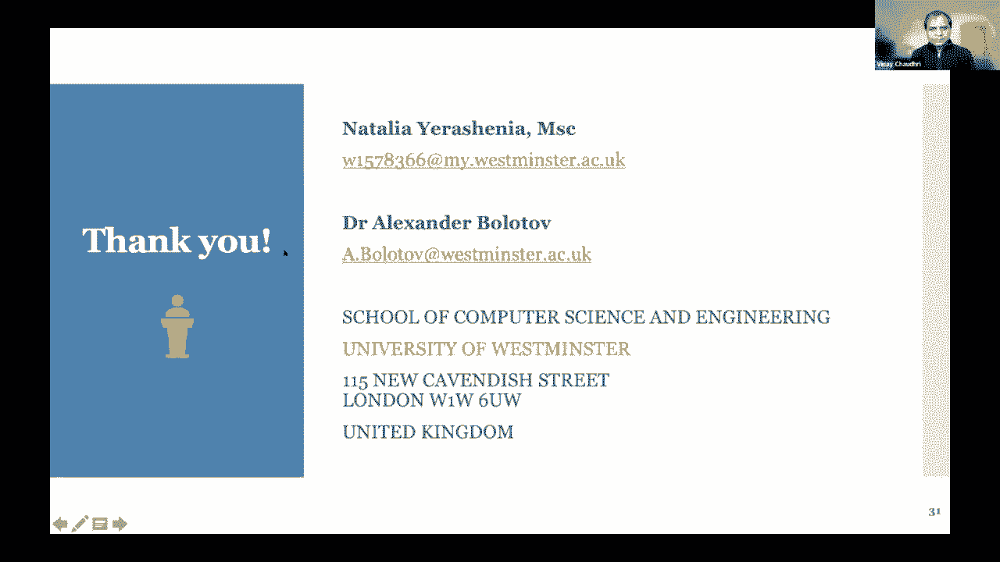

# P31：L18.2- 金融数据用例的通用预测计算建模：应用本体作为金融数据预处理工具 - ShowMeAI - BV1hb4y1r7fF

嗯你好，每个人，嗯，我现在将分享我的屏幕，向您展示我们的演示文稿，稍等，我相信现在你能看到了，所以我叫娜塔莉亚·拉希，来自威斯敏斯特大学，和Walgev博士，和我，知识图实现方法的研究。

今天我们将描述我们正在研究的一个用例，呃，它正在发展，使用本体和图形数据库，以及机器学习引擎，所以今天我们将告诉你我们计算模型的主要目的，我们将描述我们使用的数据。

一个由选集图数据库和机器学习引擎组成的计算模型，而现在，嗯，呃，介绍亚历山大·沃尔特博士，谁会告诉你，呃，通用，嗯，所以我们的任务，首先是解释用例构建的基础，因此，我将介绍通用方法，我们正在开发的，呃。

基于数据预处理和分析的核心理念，适合，呃，整机，如果你想，所以说，正如您将在下一张幻灯片中看到的那样，通用方法的方案涉及几个部分，我要在这里描述他们，所以方法的核心是选集。

我敢肯定你一定听说过很多关于知识图表的知识，嗯，我们刚刚听到了关于因果图的精彩演示，嗯，本体也是图的一部分，你可能知道，我们经常谈论选集，作为，到那个结构，域，呃，可能非常强调我们所说的等级关系。

人们经常比较本体和知识图，可能是，呃，有点像寓言，专用数据集，你最终得到了一个知识图，嗯，呃，在某种意义上，我们遵循这种方法，所以我们要做的，我们想要，我们想给出与给定领域相关的本体创建的解决方案。

当然啦，我们想沿着这种方式前进，建立知识图，而是以图形数据库的形式具体实现知识图，为什么那口井，因为我们需要一些引擎，所以说，我们需要以图形数据库的形式进行一些可能的计算，所以图形数据库将代表知识。

基于此，我们将能够构建一种类型的选集，在这里给出，分三步，所以一旦它这样做了，这是我们的通用构造，我们可以用图形数据库玩游戏游戏的本质是什么，所以我们的想法是我们在管理给整个机器喂食的场景。

具有机器学习模型的选定特性，机器学习模型将与您管理的任务和数据类型相关，所以今天我们将给你一个用例，它将依赖于专用的，也就是说，我们正在处理不同的用例，我们现在正在处理的时间序列的另一个用例。

因此这里将使用不同的引擎，但总的来说，在这个阶段，整个想法是，我们称之为模型的第一种RAM，我们用选定的特征填充模型并训练它，现在电话来了，所以一旦训练结束，我们看这个过程的输出。

我们把它反馈给图数据的方式，然后我们切换嵌入式设施，嵌入式引擎本身，我们想确保机器学习的结果是有意义的，这些结果是什么，嗯，我们希望这些特性是作为机器学习引擎的输入给出的，现在会有调整的重量。

现在这个新的一套，这组新特性将被反馈到图形数据库，我们会让内部引擎再运行一次，与图形数据库一起提出一组新的特征，并调整权重，今天再反馈给他们给模型再运行一次，所以你看我们预计模型会在一些，呃感觉，呃。

在几次跑步中，每一次跑步都有理想的优势，因为运行的输入是通过反馈循环机制进行的，正如您将在下一张幻灯片中看到的那样，有各种各样的呃，本体的开发方法，我不会在这上面花太多时间，它有点正式和逻辑学家。

所以我喜欢正式的定义，所以我们刚听说狗，就亚洲网络而言非常有趣，所以我们这里有的是本体论的定义，以正式的方式，标记图只是一个提示，标记图是具有结构的正规概念的图，有顶点和边的。

但是我们使用语言语言来标记节点，这里我们用一种很简单的方式来做，我们所做的，我们用两个两个一般，呃，这里的参数，价值和重量，如果勇士和体重是重要的或相关的，他们工作，如果它们不重要或不相关。

我们把它们放在零，否则，它们将从给定的数据集，所以这将给我们如何建造，呃，有针对性的选集，如果你想，它有中间的步骤，所以下一张幻灯片将向你展示我们实际上，分阶段做，首先导出选集模板图。

然后移动到中间结构，我们有的地方，呃，带值的图，但没有重量，然后我们用重物把它装满，你想出目标图，所以这就是有一种正式定义的选集的想法，现在发生了什么，我们想前进，当然是所有这些结构和移动反馈循环。

你现在想起来了，整个想法是我们使用地面数据库来提取一组特征，当然是呃，一审专家裁定，但一旦完成，等待调整权重的输出，所以我调整的权重被反馈到图形数据库，我们打开这里洗牌功能，对呀。

所以我们看看那些真正扮演角色的人，如果你想在整个场景中，它们可能会变得更加重要，非正式地说，对呀，那些不是的人，呃，他们不是很重要，会去第二个，考虑的时间，这是机器学习的反馈循环，嗯，我们确实关注数据。

就像我在下一张幻灯片中看到的那样，其中往往是大数据，这是一个很时髦的词，我真的不喜欢，因为现在一切都是大数据，那很时髦，嗯，无论如何，遵循传统，我们只是看着大数据，说写五五，我们在左边的。

通常是大数据的特征，梯度量的变化大致是我们在金融中可以看到的，那是个例外，音量不重要，但重要的是关系正确，因为财务数据是这样的，我们有很多关系，顺便说一句，之前的谈话很棒。

它实际上捕捉到了相当基本的关系类型，对呀，那些产生影响的，现在，我们在这里做什么，我们试图了解更多，正如您将在下一张幻灯片中看到的那样，在构建本体论的过程中发生了什么，所以它有点像楼梯，走上楼梯。

所以我们要继续什么，对领域的概念层面进行越来越专门的分析，从受控词汇表的定义开始，到结构化词汇，到单一层次结构，也许是多重层次结构，最终我们想得到一些东西，这被称为按需类的组合构造，这是一个高级分析。

涉及描述逻辑，比如说，奇妙的东西，现在真的很有趣，为什么我们需要那么多，因为选集，是使我们能够建立知识的实现，以知识图的形式在图数据库中实现，所以如果你看看是的，如果您查看图数据库构造，它会有几个步骤。

从专用格式从本体中传输数据开始，进入图形数据库，技术细节，但这里真正酷的是，提供数据的过程，来自本体论，来自选集的图形结构，来自外部来源的真实数据是这个过程的核心，如果你想对，这样做。

我们就能够分阶段地建立知识图的实现，基于本体构建，所以一旦我们到达那里，我们就能够前进，我们再看机器学习引擎，记住我在这里说的是通用方法，所以下一张幻灯片将给你一个想法，这里的机器学习引擎是什么。

在这里谈论非常通用的框架，所以我们有来自图数据库的这个框架的输入，输入经过训练周期，然后它希望给我们一些特征权重，它将以反馈循环的形式回到图形数据库，这就是现在计划的本质，对呀，所以图数据库的输出。

它只是学习引擎的输入吗，然后我们去，我们沿着第二圈，因此，这种方法有一个通用的特点，现在，是向Natalia讲述用例的创建，基于这种通用方法，呃对，所以嗯，我们使用的是这个通用模型，或者创建用例。

其中一个用例是，呃，呃，我会的，呃，显示在这里，呃，而现在，所以我，这是一个疯狂的CY预测换向模型，和你目前看到的很相似，但它与实际财务数据相吻合，说到我们用于测试数据的财务数据。

我们使用四家中型私营公司的财务记录，我们从我们的名气数据库中获得这些信息，一个堤防数据库，嗯，我们已经知道这些公司的财务阶段，他们中的一些人破产了，他们中的一些人不是，呃，他们有，呃，稳定的财务状况。

所以我们把这些强化的公司分成两组，我们有这个，我们收到了这个信息，呃来自政府，呃，现在让我们选，关于我们用于这个用例的选集的详细信息，它是，呃，或者本体论，它是基于英国和国际立法，它是一套概念，呃与。

呃，破产预测与一般财务分析，我们的P本体受到纤维本体的启发，它是金融界众所周知的本体论，一系列的概念，金融和商业，以及它们之间的关系，它有一个更普遍的性质，但我们的本体论集中在，财务分析的标准。

也可以作为光纤本体的扩展，目前包含这类信息，呃，我们使用Protege环境开发我们的P本体，环境，呃，到目前为止，前面的演讲者提到的，正如你在左手边看到的，你可以看到我们的结构，它是，以及财务，呃。

金融工资，它们实际上是主要的，我们用它作为选集的条目，但越多，我想印度拖船，我们需要考虑到，呃，是关系，所以在右手边你可以看到我们的神论的层次结构，所以它是呃的子类，关系，我们还可以定义已知的等级关系。

在我们的本体中有两种类型的关系，将财务比率与，而且，呃，您可以看到它是隐藏在每个组件中的一个或物质数据数据，例如，在这里你可以看到，呃，财务比率，它包含一个到呃，呃，三个附加属性，就是规范价值。

所以嗯嗯，创造呃，在这些中使用本体，呃用例，呃，我们实际上是简化的呃，我们的本体论并将其分裂，呃一分为二，一个简单的本体，分类法，它是财务报表要素的分类法和公司财务比率的分类法。

你可以在这个例子中看到他们是如何，在这里你可以看到我们本体论的全貌，它的概念表示，我们将这些本体保存为RDF文件或所有文件，在这个用例中，我们有两个独立的，呃，所有文件，其中一个，呃包含了，呃，的。

呃来自，关于该公司特定公司比率的选集，两种类型的呃数据文件，呃为了我们的，呃组件，其训练数据和测试数据，正如我之前提到的训练数据，我们使用一个包含45家英国公司财务比率的CSV文件，而且，呃。

我们有一个单独的文件和输出，呃这四五，破产的公司，也就是破产级别，或者也是为了测试模型，我们有呃文件，呃，它实际上是我们从特定公司的传统数据库中获得的原始数据，我们说如果它抄送文件和，呃，那个呃。

第二个其实是，呃，机器学习引擎的实际输入，呃，但这是一个输出，呃，对于A图数据库，用于破产预测分析，现在让我们来谈谈呃，图数据库建设过程，啊这些本体论，所有文件，我们把这些文件转移到新的四个。

我们的环境，这是我们用来构建图形数据库的环境，我们不需要，呃，用于从头开始构建此，这个骨架，呃，所以我们，传送这些文件，我们建立无层次的连接，呃，在这两个或文件之间，因为我们有分类法，所以我们需要用。

呃，内置，现在我们有一个没有标签的空图形，我们需要得到特定公司的输入数据，所以我们使用传统数据库中的CSV文件，其中载有财务记录，取自资产负债表，现金流量表，特定公司的损益表，嗯，呃，但在此之前。

我们需要匹配节点的标签和呃，我们正在使用的CSV文件的列标题，所以在未来的呃程序，模块就会知道，呃，其中特定数据，呃是，呃，呃，下一步就是，呃，我们，所以特定节点的值和这些值是从CSV文件中获取的，从。

呃，完全呃，数据拟合，呃，但是我们需要计算比率，该等比率并无列载于本公司的财务纪录内，密码编程语言允许，嗯，他用内置的数学公式，准备好进行功能选择了吗，而且它是，呃，对于组件，也就是机器学习的边缘。

我们将图形保存为CSV文件，这就是我们的图形在新的四J环境中的样子，在这里你可以看到图的一部分是满的，呃，带权重的图，所以在第一次迭代后，它安装了，呃，不仅仅是节点组件的值，但也有褪色，这样我们就可以。

这些加州大学的档案，呃，它保存在近四个环境中，在这个特殊的用例中作为机器学习引擎，我们使用具有误差反向传播的经典神经网络，这对于这种类型的数据很理想，因为它会产生0或1和0的结果，在我们的情况下。

公司是稳定的，一是公司有很高的，我在结果旁边输出零或一，我们的机器学习引擎产生，呃，我在这个特定迭代中使用的特征的权重，我们把CSV文件转移到工艺数据库，所以它保留了上一次迭代的记录。

它也保留了我们特征的基础，这意味着它有助于提高下一次迭代的效率，这些权重将用于特征选择，这就是噪声数据的方式，会减少，我开发了通用模块以及破产预测模型，存储在模型中，它有助于提高…的效率。

公司的破产分析，它还储存了公司的所有记录，呃非常，什么是呃，更多，呃有趣的是，呃，这个特殊的计算模型，它具有通用性，所以任何选集和任何图形数据库，和任何机器学习。

发动机可以作为这种特殊作物基地的组成部分，我强烈建议你，你可以找到，呃，关于计算的更详细信息，基于方法，呃这里也是，呃，所以耶，一批谢谢，就是这样，感谢娜塔莉亚和亚历克斯对你工作的出色概述。

现在我们有20分钟的时间提问和讨论，看起来啤酒一直在大量回答，聊天中发布的所有问题，嗯，那太好了，有一个，呃，似乎有一个悬而未决的问题，嗯，娜塔莉亚，人们都在问，P本体有URI吗。

我相信你在上一张幻灯片中展示了。

稍等，我我是，我试着在这张幻灯片上，没关系，就像在网站上，是的，你有一个参考，人们可以，是啊，是啊，我有所有的参考资料，我会发表论文，你也可以找到我的GitHub和所有的信息。

包括本体在我的GitHub上。

所以欢迎，酷，非常好，所以说，嗯，所以现在我们开放了，呃，一般性问题和讨论，有一个伟大的呃，同龄人在问答中实际回答的一系列讨论，我不知道会不会被录下来，但是时间进化的两个主题。

下一个我喜欢的是文本中的集体智慧，呃也许P你能说几句话吗，所以他们可以在这个视频中录到，也许来自文本的集体智慧，当然，但我很想谈谈延迟的事，只是为了表明，也许我会以此开始，金融和更机械的东西之间的区别。

就像在医学上一样，在医学上，当你有一个人的身体，你可以说在一个，一天和三天，在那一刻之间，一些器官出了问题它会影响到另一个器官，对，因为这是一种机械的东西，修理也一样。

你知道我们在维护方面做了很多专家系统，金融方面还好，这很复杂，因为有两个原因，首先，没有潜在的真相，任何东西都是无价的，这完全是我们如何集体行为的问题，我们决定价格，但也有一种叫做预期的东西，也就是。

如果我相信有一个因果效应会在十天内产生影响，我可能会在五天内尝试玩，所以我比其他人先演奏，因此，整个系统永久地自我修改，在延迟和信息影响延迟方面，所以这真的很讨厌，对，所以文本上的集体智慧。

我们就是这样开始的，我们说过，当我们得到资助的时候，我们有一个，我们有几个非常聪明的人说我们只会资助你，呃，如果你有四万条短信，现在我们有一亿条短信，然后呃，我们不断发现，你有越多的文本。

你在因果联系方面越聪明，不仅仅是在数据方面，但就因果关系而言，很多人都在说啊，但你为什么不也把推特和脸书，我们的发现是靠运气，我们买了一个内容聚合器，它是付费记者，付费记者有一个反馈循环。

他们不应该说任何太容易被推翻的事情，否则他们会被老板解雇，在推特和脸书上，你可以说任何话，而且在大部分时间里，顺便说一句，你发表了非常离谱的声明，只是为了确保你听，而不是试图变得聪明。

所以集体智慧一开始就需要一个过滤器，这样人们就会诚实地努力做出贡献，相对于，你知道，只是想在体制内出名，所以呃，所以那是呃，我就是这么想的，是，长期的道路是试图自动阅读科学文本，但它要复杂一点，当然啦。

或者从，呃，来自严肃的记者，嗯，我们得到很多人说，你能比较一个内容和另一个内容的质量吗，所以我们写了一个长短策略来做到这一点，有两个结论，一个是确实有些提要比其他提要有更有趣的内容。

最有趣的提要之一是首席执行官们的声明，季度报表，因为他们有很大的法律压力，只说真话，说全部真话，如果你在公司里隐藏风险，它已经证明你知道风险，你把它藏起来了，呃，你可能会陷入困境，因此。

人们倾向于过度暴露因果关系，呃，因果关系，呃，情况和说实话，但这是第一个想法，有很大的区别，第二个想法，在这一点上，你拥有的数据越多，你的内容就越多，你的模型就越好，这是相当令人惊讶的，因为你可以说嘿。

我有时会添加负面内容，但是如果你做了正确的过滤，包括优化的类型，你必须运行才能生成一个变化网，你最终会得到，呃，呃，基本上是集体的，越聪明，你没事吧，呃很好，是啊，是啊。

所以我有个问题要问亚历克斯和娜塔莉亚，呃我是说，我理解你的系统是在最后，你在训练一个神经网络来做破产预测，在这方面，我不清楚，本体论和新的四个J增加了什么价值，它们似乎与我无关，你的数据是四五家公司。

公平地说，这不足以训练神经网络，所以我真的很想念什么，这里的方法是什么，我们使用的数据集，所以说，是啊，是啊，我同意四五公司是一个相当小的数据集，但我们用它来证明我们的理论，并将其用作此，用例，当然。

这些数据集应包含，至少像，这个行业的大多数公司，提高数据库的神经网络效率，本体和图数据库的目的是什么，首先呢，它构造数据，从外部来源收集数据，如公司的传统数据库，任何其他数据库。

我们最初的想法之一是使用本体和图形数据库，首先呢，这是呃，结构化或异质连接，高度连接的数据，和比特征选择，亚历山大，你想加点什么吗，呃，是啊，是啊，我想是的，呃，呃，是呀，我会的。

我想补充一点关于选集的内容，对我来说，整个故事是关于，呃，建造一个有双重目的的建筑，如果你想，一方面，娜塔莉亚答应了，它所构造的结构，它所提供的知识，它给了一种很好的，一个很好的目标。

以适应图数据库的建设，嗯，人们可能会问什么，为什么我们需要两件事来做同样的事情，我想这可能是一个问题的一部分，对呀，那为什么为什么，为什么两个都要用好，关键是呃，我们实际上是在试图弥合两者之间的差距。

那个呃，从道歉通过图形数据库，对呀，那是发动机的核心，这项技术的目标，但另一方面，因为我们有本体论，我们可以在这里打开一些正式的形式化方法，对呀，所以这很重要，这样我们就可以。

我们实际上可以把它们潜入方法的顶层结构，我们根本没谈过那件事，因为我知道，我是说，我想有很多人在训练神经网络，不使用本体上的图数据库，所以我认为这个问题的精神是可以的，你为什么不这样做呢？你知道。

你干嘛，1。你干嘛加班？但我不想说，我想他们是，我想他们指向未来，因为可以解释，问题是当你有一个非常大的模型，你不知道，你现在的重要因素是什么，这是我寄给你的报纸，Vinay关于微软，试图解释如何。

如何解释中的因果关系，神经网络，这真的很复杂，今天他们说他们失败了，所以这个，未来就是和娜塔莉亚正在做的，这是两者的混合，你有尽可能多的解释能力，你在哪里，你基本上是在使用神经网络的统计特性。

他们擅长什么，千真万确，呃，那真是呃，在我的脑海里，那个呃，其中一个主要原因是给这些数据赋予语义意义，现在我们用它来进行特征选择，因为这是提高机器学习机制或机器学习引擎效率的方法，但它也。

构建他们的知识，并对这些进行一些推理，呃特定数据，好的，嗯，那很好，就目前而言，这是一个很好的答案，所以我还有一个问题要问你们两个，嗯，这是由这个观察驱动的，事后诸葛亮总是二十二十，对呀。

我是说皮尔你给我们看了联合追随者的股票价格，因为Covid什么的，而你，你破产的事情正在根据历史数据进行测试，所以我认为我们可以根据历史数据做出判断并宣称成功，但真正的考验是。

如果我们能预测未来会发生什么，事实证明是真的，所以你有任何故事或任何例子，它不是，你不是真的在看过去的数据，但你实际上看到了未来，与你的模型相比，这个未来实际上是正确的，是啊，是啊，这是个很好的问题。

因为现在我们正在研究第二个用例，而我们，嗯，你知道的，识别金融指数的时间序列数据，预测和结果我们目前有啊我们分析会看到100个指数，但是呃，呃，这么低的价值，所以呃，是呀，我们正在努力解决这个问题，呃。

我们正试图为，实际预测，非历史数据，但是未来的价值，所以耶，好的，是啊，是啊，你对公共汽车有什么看法吗，但是但是当然事情是呃，难度更大，如果你觉得呃，到目前为止。

我们所拥有的是我们可以称之为封闭系统的东西，对呀，这不是全部，所以我们不能，我们不能说呃，那个呃，它对外部信号是开放的，说哪个会来破坏一切，就这样，觊觎来到了两千零二十个，没有，对于这样的事情。

任何预测都不起作用，这将是很好的看看影响图，因为图形可能在这里工作，其实我现在不是很认真，因为我认为解释和各种嫌疑人，如何使你的假设更广泛，对呀，也许也许会来，也许会来，这里有一些绿灯。

因为我们在寻找不同的残疾来扩大投入，也许让系统更开放一点，对呀，看看发生了什么事，到目前为止是什么，我们只是在努力，但什么都没有，什么都没有，没什么没什么在这个阶段是非常非常非常严格的，但这么说吧。

所以我有三个快速的答案，所以第一个是，如果你试图预测，表明你擅长预测四五家公司的破产，这真的很难对吧，当然啦，好的，所以更严肃的答案是，有一个理论和实践的答案，理论上的答案，这就是我做这行的原因。

我坚信因果关系与发生的事件无关，所以顺便说一句这就是我们的美妙之处，在我们的弹性模型中，如果有什么事情发生，好像四五的销售额，对福特的利润有双重影响，如果销量下降，我可以，我可以给你带来负面影响，预测。

以一种非常机械的方式，所以那是呃，这是理论上的答案，实际的答案是，我们参加了一月份的黑客马拉松，由教授驾驶，呃，呃叫桑迪普·古普塔，我们展示了，他用我们的数据表明，我们可以预测美国的国内生产总值。

离纽约联储还有一周，所以我们，我们不确定这是因为纽约联储系统不见了，我们正在提取的数据，或者这是他们现在的铸造方法作为延迟，但是呃，我们可以展示的是，我们比纽约联储更好，用成千上万人的集体智慧写作。

我认为有一种可预测性，你知道的，你知道的，最近，我们有一个对冲基金说，哦，那剩下的一千呢，所以我们突袭了二十家公司，我们说一个月后再看，他们的股票平均比，呃，全球角力，一千，所以说，你知道一个月后。

百分之五，这还不错，但这是一个数据点，对呀，所以每个人都会说，我想做背部测试，还有这个和那个，所以对每个人来说，证据都在布丁里，每个人都喜欢这个理论，但他们想成为，他们想被自己说服，好的，谢谢。

谢谢你的回答，呃，迈克尔，你对评委有什么问题吗，呃，没有有趣的应用程序，非常有趣，呃，但我没有问题，谢谢，你是说你非常非常有趣，当然还有像，嗯，很多对抗性和博弈论，那种效果，有一个问题围绕着这个。

现在在问答小组里，对此有何评论，一般情况下，你怎么，你怎么这么，鉴于研讨会时间已接近尾声，也许你们每个人可以花30秒，告诉我们你接下来要做什么，呃，嗯哼，亚历克斯，你想开始很抱歉，问题是下一步是什么。

什么是，呃，什么是，接下来的三个月你打算做什么？这么说吧，嗯，呃，呃，三十秒，所以说，呃，我们实际上在看一个非常有趣的，它将能够处理多个输入的时间序列，这不是一件容易的事情，不不不不仅因为技术解决方案。

而是因为如何将它嵌入到我们的检测中，对呀，这是第一个问题，第二个问题，它是一样的，如果不是更困难的话，就是将数据案例扩展到，你知道数据边缘的，如果你想对，所以这是这项研究的一部分。

我脑子里在想的第三件事，这与皮埃尔所说的非常接近，我想我有几个问题要问皮埃尔，我邮寄到这里，实际上是因为我想知道这种因果关系的数学性质，这让我想到了一个很有趣的类比，寻找这样的循环，在这样的系统中。

那很有趣对吧，那么属性是什么，这里有传递性，当然是因为如果A对B有影响，b对c的影响，等，等，等，所以它们可能是非常有趣的推理机制，但在数学基础方面，它会给我们什么，所以只是有点，是啊，是啊，是啊。

是啊，这些都是需要思考的大问题，我们都爱在一起，不不，这很好，顺便说一句，其中一个迷人的元素，没有人脑，你可能有一个因果链，这是多个人看到每个链接的结果，但没人看到整个链条，我有一个例子。

但是我会我们会邮寄的，它链接到，对中国人来说，一条路，公告及对钢铁的影响，以及对汽车行业的影响，在过去的几年里，对我们来说也是如此，我们正在生产，我们正在敲定我们系统的第三个版本，已经做了很多工作。

比如说，关于汇率的报告，你永远不会相信陈述这个词有多复杂，当人们谈论汇率时，如果我早知道我就不会死了，我就不会跳进去了，但一旦我们进入其中，你知道我们解决了，但那真的很下流。

在因果关系检测方面有很多改进，因为呃，它是，这是非常复杂的，我们可能有30种不同类型的因果关系，所以你知道，人们在说一些，某些环节强加负面，我将完成这个小示例，我喜欢的，因为它展示了人脑是如何连接的。

所以当我们当你说，呃，美国航空公司提高了利润，那说明利润上升了，但当你说，美国航空公司改善了其温室气体排放，这意味着他们减少了温室气体排放，所以这迫使我们付出了所有的KPI，在KPI中加入有利指数。

这样我们就能够区分负面的改善，KPI是KPI的降低和改进，我们在大脑中自然地这样做，没有任何缺失的节拍，糟糕的自然语言处理系统在，在这样的事情上，但我有喜欢，也许两百我剂量，所以我会，我就停在这里好吗。

嗯，我想我们差不多没时间了，我真的要感谢我们的三位演讲者，谢谢你能来，与我们分享他们的工作，特别感谢亚历克斯和娜塔莉亚，因为现在是夜里两点，对他们来说，他们熬夜到很晚，呃，只是为了和我们一起参与，活着。

但真的，感谢你们三个的到来，告诉我们你正在做的令人兴奋的工作，就全班而言，我们下周二继续，下星期二，娜仁在讲课，为我们提供了可用于构建知识图的各种实现工具的调查，这是一个很常见的问题。

我们在整个系列中都得到了，这是一个常见的问题，呃，去年也，所以周二的会议应该很棒，呃，非常感谢大家，我们稍后再和你谈，谢谢。谢谢。谢谢。谢谢。谢谢。非常感谢。

