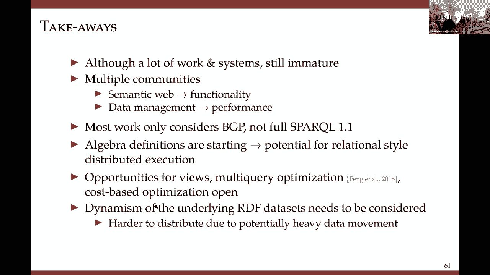

# P5：L4.2- 分布式RDF数据管理与查询 - ShowMeAI - BV1hb4y1r7fF

好的，让我分享一下我的屏幕，希望这次能正常工作，你可以看到，是呀，好的，所有的权利，谢谢你的邀请，呃，这让我对这个话题有了一致的想法，呃，我们一直在研究它的一部分，这是一个把整个演讲放在一起的机会。

你会注意到我的幻灯片比我在30分钟内能看的多得多，这个想法是有一个内部连贯的陈述，呃，但我不打算涵盖全部，那个呃，你可以用幻灯片，在这个背景后面，我希望你不会介意我。

跳过一堆幻灯片或在一些幻灯片上快速前进，呃，有些地方，我的想法是给你一个概述，呃，分布式RDF和Sparkle执行，呃，做了哪些工作，所以说，嗯，我应该说我在叙利亚的所有工作，呃，呃，是在，呃。

和呃一起，呃，两个同事，休闲北京，彭，彭在湖南和雷，陈在香港，呃，USD，这些要么是我的，我和我自己的学生的工作重点是属性图，主要是过去几年的流媒体，流属性图，但那不是，那就改天再说吧，rdf，呃。

用例很常见，你可能已经专注于所有这些，RDF是知识图的构建块之一，和语义网，然后呃，UM链接的开放数据，呃，据最近的统计，大约有一千二百人，呃，数据集，没有人确切知道有多少三倍，但是，呃。

我能找到的最好的猜测是超过1000亿的三倍，嗯我的，我猜那是保守的，因为UniProt本身，也就是生物学上的，呃，呃，知识图um，本身，或RDF故事或其本身，呃，报告超过840亿，呃，三倍，但是但是。

RDF数据集正在增长，在这种情况下，增长相当快，从大约十年前到今天，LODS的增长是巨大的，所有这些都导致了，呃，管理此RDF数据的问题，所以像我这样的人，他们基本上是数据管理研究人员。

当您给我们一个数据模型和查询语言时，我们在我们的区域，我想这就是数据管理问题出现的地方，我们可以看看声明式查询处理，显而易见的解决方案并不高效，所以数据库社区或数据管理社区，通常，呃，查询执行。

RDF最初的系统是单机或集中的，但是随着数据集大小的增长，呃，他们呃，我们去分发解决方案了，我所说的缩放，它在左边，也就是说，你有一个很大的RDF数据集，并获得更好的表现，通常将此数据集分区到多个，呃。

呃机器，然后呃，工作，看看并行执行Sparkle查询，另一方面，那个呃，随着大量的RDF数据集，独立数据集一直在增长，这些都有自己的主人，它们有闪亮的端点，那是呃，他们确实想保存和维护自己的数据。

对于这种环境，已开发出联邦解决方案，所以这就是设置，最近的EDBT有一个呃，会议在呃，大约两周前，呃，把你的整套剪下来，给了一个非常好的，知识图主题演讲，他的方式，她呃分类的系统是呃描绘在这里，然后呃。

她基本上谈到了集中，然后客户机服务器等等到流媒体，我在这方面做了更多的工作，我想我喜欢更细粒度的，所以从我的角度来看，有集中的和集中的可以或多或少的关系，所以拿着三张桌子，用它来工作，或者它可以。

它们可以是基于图形的，我不打算谈论这个，或者它们可以是扩展解决方案，有许多不同的选择，或者它们可以是联邦解决方案，其中有闪亮的端点，从那里，呃，呃，你可以在那里实际执行，呃呃，呃，火花查询或一些呃。

端点可能不是闪亮端点，它们可以存储RDF数据，但没有处理能力，然后呃，呃，流媒体系统已经启动，呃也出现在RDF流方面，所以我今天要做的只是谈谈比例的一部分，呃，基于查询分区云的部分评估，和联邦系统，呃。

其他的我不会碰，嗯，接触卡蒂亚的基调是，呃要被放，我想在YouTube上，我想还没到，但是如果你查EDBT 21，会议网站，你可能会发现当它上线时，我强烈推荐她，看她的演讲，所以幻灯片的轮廓不要说话。

必然，就是，它从RDF介绍开始，我不会经历的，因为呃，我知道你已经介绍了RDF的基础知识，我是，我有两点想补充一下，呃，对后面的讨论很重要，然后我又有一些关于集中系统的概述幻灯片，我就不碰那些了。

然后我将跳转到缩放系统，所以这些主要是做背景的，在RDF介绍中我唯一想提到的是，火花的语义，我只专注于，嗯，火花的子集，它被称为BGP，基本图形模式，呃，就像闪闪发光的查询一样，呃，我相信你已经，呃。

你看到的是由这三个模式组成的，这三重的集合，仅由这三个模式组成的查询，没有别的了，无工会，无选项，等，被称为BGP，呃基本的，呃，呃，呃，图形图案，呃，火花查询，所以如果你真的看看那些。

火花语义是子图匹配的语义之一，利用同态，和操作语义，你真正能想到的是你走进你的三联店，你会发现，呃，所有匹配的三人组，每一个，这些单独的三元组中的每一个，所以在右边，我呃，这个有五个三连，三重图案。

在右边，我有，呃，我有五张清单，他们真的是，思考Sparkle语义的一种方法，你在拿关节，所以在呃，因为呃，受试者有相同的变量，呃呃，对不起，这是我写错的对象，这应该是主题主题关节。

你在做一个主题主题加入，然后你在做一个主语对象连接，然后这里你也在做一个主体对象连接，呃，这些都应该不一样，所以从根本上说，这是你唯一需要的，呃，这是很重要的要记住。

关于Sparkle的另一件事是Sparkle查询形状，因为这些来了，呃相当，嗯嗯，呃，呃，相当多，在随后的讨论中，这些闪亮的查询形状，呃扮演一个角色，呃，大多数Sparkle查询都是星形的。

其中你有一个顶点，从这些，谓词或属性边，呃散发，你可以有树链，周期，和更复杂的查询，当人们谈论，他们谈论这些复杂的查询，它们谈论相互关联的两个星号查询或三个星号查询，但他们不一定只有星星。

他们可能是任何东西，所以这个是星星，它在循环查询中更改，好的，所以这是闪亮唯一重要的部分，呃，呃，跟随，所以现在我要跳到，我将讨论一点关于图分区的问题，因为所有这些系统都假设图是分区的，然后我会说三个。

呃，不同的方法，所以分区的目的，当然啦，这出现在关系系统中，等，你把你的数据，你以某种方式分割它，或者切分就是它所说的，呃，本例中的分区是水平分区，所以你拿起桌子，水平地切割它。

并将每个分区放在不同的工作器中，然后查询在这个上并行执行，和一些提议使用三重表并简单地使用哈希的系统，呃，在三重表上进行简单的散列以获得分区，其中一个问题是，当你做这些主体物体关节时，等等。

你得到了太多的中间结果，所以你的联合成本增加了，尤其是当您进行分区间连接时，这些，呃，你需要移动数据，这就变得复杂了，呃困难，所以这里的问题是三元组表没有捕捉到三元组之间的关系。

所以人们实际上已经开始研究直接的图形分区技术，其中数据不仅仅是一个表，但这是一个正确的图表，但你有相同的目标，你想把它分成不同的，呃，不同的工作节点或机器，两种典型的方法，这不是RDF特有的，这是呃。

对于属性图也是边缘切割或我们所说的，顶点不相交或顶点电流或边缘边缘不相交，以及图分区中的目标，在任何数据分区中，你想，嗯，呃，保持分区或多或少的平衡，以便工作负载在工作节点之间保持平衡，嗯你想要，和。

取决于你是顶点不相交还是边不相交，你想把，呃，一个顶点或一条边，在不同的分区中的每个顶点或每个边，当你在做的时候，您希望最小化边缘和顶点切割，因为这些东西要么会导致额外的通信，要么会导致国家维护。

正如我将向你展示的那样，这些技术中的大多数，图分区技术是我所说的，工作负载不可知论，有一些呃，考虑到工作量的技术，如果我的工作量包括这个呢，我能用图表做什么，但我要讲的技术是工作量诊断。

所以工作顶点不相交分区将每个顶点放在一个分区中，所以这会导致边缘被切割，我们想尽量减少这些，因为它们的每一个边缘都会导致不同分区之间的通信，不同的工作节点，替代方案是散列，呃，在顶点的ID上，简单的。

呃，呃，给你非常平衡的情况，它非常快速、简单，但它引起了很高的，嗯嗯，大量的，呃，呃，中间结果和高切边次数，另一个，在这种情况下，在这个领域的金本位是所谓的电表，一系列算法基本上，通过对图形进行粗化。

所以你在那里看你表示为超级顶点的子图，然后你连续地做这些，直到你得到一个图表，从你开始从零开始，你可以依次，嗯，把一些图表给G N，GNN很小的地方，没关系的呃，分区的成本，你使用任何分区技术。

对g n进行分区，然后你开始前进，回去反思，呃，在整个图上反映分区，就是这个意思，所以一个很简单的案子，我拍了一张图，我用了一个哈希函数，呃，基于垂直顶点标签，你得到这个，所有这些虚线都是切口。

这实际上是一个痛苦的，呃，这并没有很好地反映出来，然后呃，顶点不相交划分性能良好，对于度数较低的图，但是在很常见的低功耗图上，它们会造成很多很多的H割伤，你可以用metis，但是梅蒂斯人有很高的。

呃计算开销，它真的不能缩放到大的图形，所以几乎所有的系统，呃做呃，基于顶点的分区，他们提供哈希作为工具箱的一部分，这里重要的问题是，在这种情况下，我们，因为我将在稍后的RDF案例中讨论。

对于最小化分区间连接来说，什么变得更重要，不是呃，最小化边缘切割，但实际上是为了最小化谓词切割，稍后我会证明这一点，所以，嗯，我将跳过这一点，因为我还没有看过这个例子。

但是这个例子在前面的边缘不相交分区中，以防我们把每条边放在不同的分区上，所揭示的是顶点是复制的，换句话说，如果如果，如果呃，呃，放置在不同分区上的两条边共享一个顶点，那个顶点必须在两个地方重复。

这实际上意味着你，如果呃，的，这些顶点的状态需要在两个地方都保持，所以如果有，呃，这在RDF中成为一个问题，这不是一个简单的问题，因为RDF是一个简单的图模型，其中顶点只有标签，所以没有太多的更新问题。

在那些边缘上，边缘不相交划分在基于云的系统中得到了广泛的应用，我以后再谈，因为在基于云的系统中，他们是什么，他们所做的是，他们用特定的谓词查看每个边，每一个，呃，所有具有相同谓词的边都进入一个文件。

该文件在hdfs上，基于云的系统的目标是最小化扫描，所以呃，这允许您将扫描集中在特定的文件上，取决于Sparkle查询所询问的内容，所以这很重要，一次又一次，如果我拿着这个在那里做，呃。

做我得到的边缘不相交分区，但是右边的是什么，这些虚线顶点被复制，不同顶点之间的，二号，主分区是p2，但我在第三页也复制了它，这些在有电源的低图上表现良好，它们速度快，可序列化程度高。

但是星型查询是有问题的，因为在Star中查询您想要的，你想要顶点和所有的边，所有相邻的顶点都在一个分区中，边缘会把它们打碎，我们可能会得到高顶点复制，所以再一次，那里的例子是这样的。

让我跳入三种类型的扩展系统，我要谈谈，嗯，第一个是查询分区系统，所以这些从分区数据集开始，所以从1到6是，是分区，我们已经对RDF图进行了分区，现在我们进行分区，呃，火花查询，所以我们得到子查询。

我们的想法是要对Sparkle查询进行分区，以这样一种方式，我可以执行尽可能多的，我可以独立地执行其中的每一个，因为我可以在一个在一个在一个，的，工人注意到，所以我不我试图避免关节，部分结果的，创建的。

呃通过这些子查询，因此，问题实际上分布到通过，呃，分区数据，这真的非常，非常类似于关系系统中的分布式查询处理和优化，有许多这种类型的系统，您需要记住的这些系统的主要思想是，如何对数据和查询进行分区。

以最小化分区间连接的方式，以及他们提出的所有技术，呃那个，两者之间有高度的耦合，查询分解和它们使用的分区，所以他们要么说，这是我们对数据所做的分区，下面是如何根据分区对查询进行分区。

或者他们说这是我想对查询进行分区的方式，这是我想要的特点，并满足这些特点，这就是我如何划分呃，对数据进行分区，我会再讲两个例子，这是一个um分区图，呃，其中分成两个分区，呃。

琥珀色的是单词蓝色的是另一个绿色的，呃虚线边缘是你的边缘切割，这基本上是分区之间通信的地方，一个有底座的系统，它说让我们首先使用metis进行分区，但他们承认他们实际上可以用其他无关紧要的东西。

这是给你一个很好的基本分区，然后我要，用n跳复制顶点，所以如果我用一个跳跃，然后是琥珀色的，我要伸手到蓝色的地方，挑一半，可到达顶点，在琥珀里复制它们，蓝色的也一样，蓝色的那个，我会伸出援手复制，呃。

其他的，但它可能是N跳，当然，当n变高时，复制成本增加，呃，但你可以，您可以计算更多的查询，嗯在那里面，在那种情况下是独立的，但在极端，当然是你不分区，但那不是你想要的，当然啦，所以当你得到一个查询。

你看到的是半径，这就是离，呃，将图的中心与边缘匹配的中心查询，如果查询的半径大于n，然后我必须把它分成几个子查询，这样，每个子查询的半径小于或等于n，然后我执行这些子查询，呃在隔板上。

第二种选择非常相似，呃，他们相隔两年被求婚，有趣的是，他们还谈论，穿过呃，顶点，但是他们使用他们所说的语义散列，所以它们首先组成三组，他们说三A，他们把三人组，基于他们是否有相同的主题。

或者它们是否有相同的对象，或者它们是否有相同的谓词，所以他们可以有三组，所有三组，或p三群，然后他们他们，他们使用哈希函数将这些三组中的每一组分配到机器中，然后它们基本上允许复制，呃。

复制的想法是这样的，所以如果这是您的基线分区，你有一个查询，它到达那里，此查询不可独立执行，当然啦，因为你需要，您需要将部分结果在这三个分区上进行连接，但他们的想法是，如果我把p除以，呃有点过了。

然后我就可以自己处理P 1了，同样地，我可以把p5扩展一点，我可以自己处理第五页，这个提议和呃没有很大的不同，另一个，这只是他们如何分区查询，以及它们是如何划分的，呃，图形稍微，呃变了，但大意是一样的。

呃，我们一直在研究这个，还有这个，呃有点不同，这还没有出版，呃，正在提交中，我们工作的要点是，之前的所有工作都试图最大限度地减少边缘切割，但是边缘切割并不是真正导致分区间连接的原因，呃。

如果你能增加你的边缘切口，但是如果你剪的所有边缘，出生，呃，出生在，或者他们都是居民什么的，然后真的，您可以独立执行的查询类增加了相当多，所以基本上这里的想法是我们想，而不是最小化边缘切割。

我们希望最小化在，即使以增加呃为代价，边切边，所以接下来的几张幻灯片，介绍我们是怎么做的，我不打算通过，这与梅蒂斯的想法相似，就是我们变粗，然后我们分割，但是粗化了真正重要的情况，能够选择内部谓词。

那么我如何形成，呃，超级顶点，呃呃，就像我一样，我们使用一种基于弱连通分量的贪婪算法，我们选择那些，呃，呃，谓词，然后我们把呃，右边的航向图，然后我们回到赛道上，呃，呃，原图，我们有一个公式。

我们有一个呃，呃的方法，处理对它的查询和呃，它给了我们相当好的表现，我没时间看了，所以查询分区方法真的是非常非常高的性能，非常适合瘫痪集中的RDF数据，但是查询分解并不容易，查询分解也很困难。

即使在关系案件中，但在他们的呃，呃，这里也很难，然后呃，就像我一开始说的，查询分解和数据分解是非常紧密地结合在一起的，在这里使用自适应关系分布式查询处理方法将会很有趣，嗯，因为那个。

我是说我们在关系案例中所做的，我们做查询分解，我们做数据定位，查询分解给我们一个代数查询，我们查看数据是如何定位的，呃，然后我们取这个代数查询查询树并对其进行分区，以便，呃，连接最小化。

然后我们创建了一个分布式的呃，查询计划并对其进行优化，想出怎么做，呃，呃，呃，如何把结果放在一起，当我们在这些本地站点上执行查询时，然后我们执行分布式的，执行计划，这不是，这真的不是在。

因为他们在这个领域没有太多的工作，从根本上说，正如我稍后会提到的，没有一个很好的代数，呃替代是部分查询评估，我们做了这个，呃呃，一点点，所以嗯，RDF数据再次被分区，我们不在乎它的隔板。

但我们不对查询进行分区，我们使用的是部分查询求值，呃，编程语言的人所拥有的技术，呃，呃，呃，已经，呃发明的，所以当你在x上有一个函数时，我们用两个参数将函数重写为两个，一个是s，这是你知道的一些论点。

你知道的输入，另一个是未知输入，然后我们基本上呃，在s上执行f f素数，只是为了得到呃什么是已知的，我们把D作为未知，我们在上面执行另一个函数来得到最终的答案，所以在我们的背景下，已知的是什么，呃。

一个已知的，呃输入，它基本上是呃查询本身，然后呃，我们还知道所有这些分区，塑料我们所说的延伸边缘，它有真正扩展的顶点，它们实际上是另一个分区上的顶点，在交叉边缘的末端，然后从这里。

我们基本上的想法是将查询发送到每个分区，每个分区计算部分结果，但这些不是最终结果，因为我们拥有的是，我们错过了这些交叉比赛，然后我们把它组装起来，最终的结果，联合算子的这些部分结果。

设置是我是你所期望的，数据所在的一堆机器是，呃分布，我们对这些机器进行局部评估，然后我们做一个组装阶段，可以集中，我们将结果发回查询的来源，并在那里组装，或者我们做分布式联合处理，所以泰勒。

我们还剩五分钟，好的，我会完成的，所以这是，呃，呃，由于并行化，这具有很高的性能，它没有，处理查询分解的问题，但是您需要修改每个站点的RDF系统，能够处理这种部分查询求值技术。

我是这里的最后一个类别是基于云的解决方案，所以数据是RDF数据是分区的，Sparkle查询作为map reduce作业运行，这确实是典型的数据并行执行，这里的主要思想是查询操作是映射减少作业。

所以你需要一个地图缩小系统，它实现了所有的关系运算符，在此处理中可能使用的，正如我所说，你通常在这里做基于边缘的分区来跨越一个例子是很难的，艺术Hadoop RDF，他们把谓词分开。

然后他们基本上把每个谓词分开，所以每一个都是一个文件，所以所有具有他的名字谓词的三元组都在一个文件中，等等，然后他们根据对象进行进一步的划分，图表的一部分，然后当他们得到一个呃，他们做的一个查询。

他们首先选择一个特定的文件，对于每个三重模式，他们在这些文件上执行三重模式作为MapReduce作业，然后他们在最后做一个MapReduce联合，所以我现在手头很紧，因为有一本很好的书你应该，呃。

你可能斯坦福大学订阅了这个，所以你可以下载并阅读，这些都是高度可伸缩的系统，由于MapReduce，它们天生具有容错性，但是性能是由MapReduce所能做的来结合的，所有这些中间关系都是，呃。

你生成的会关闭很多，你必须写出这些hdfs的结果然后运行，联合工作是联合，是一个单独的，呃，MapReduce作业，这意味着您必须再次读取hdfs，无论您做什么优化，你必须在地图制作平台之外进行。

让我来谈谈联邦系统，这些是，呃，呃，正如我所说的不同，你有这些RDF来源，所以你到底是什么，在标量系统中，我们取一个d，然后把它分成一个集合，我们要出发了，我们有一组D潜艇的另一种方式是。

我们把它们放在一起得到一个D，这些suis中的每一个都是一个闪闪发光的端点，这意味着如果你给他们一个闪亮的查询，他们可以执行他们，您将得到Sparkle查询，你把它分解，您在这些闪亮的端点中运行它。

然后你你你你你创作它们，通常你对资源有这样的想法，主要思想是数据集成，你是从底层开始的，哪些是来源，你要去，你要上去，你总是有一个控制站点，它维护了一堆元数据，这是关于访问模式，等等，等等。

通常您所做的是查询站点，控件站点接受查询，执行查询分解并选择查询的哪些部分，或者哪个气去了，呃，应该在哪个源上执行，你对来源进行本地评估，是啊，是啊，你拿回结果，然后你你你在另一端加入部分结果。

您可以进行查询的典型方式，呃，分解，我会用一个，这里有个例子，呃，这个查询，我们基本上决定，这个实际上你也可以从这里看出来，前缀，g这两个三重模式可以在geonames上执行，这个呃。

第三个三重模式可以在其中任何一个上执行，在其中任何一个上，所以我们必须选择，第三个最后一个可以在纽约时报被处决，所以你把这些分成三个查询，q一q二q三，你和你在这些网站上执行它们，然后把结果结合起来。

然后你做一些数据本地化，就像我说的那样，所以你，但你基本上发生的正是我描述的，你拿着这个，您确定要执行它的站点，你执行它们，你创作它们，那是联邦，问题是什么，如果你有一些不是闪闪发光的端点。

在这种情况下，您使用中介，你建立调解人假装，呃，都有，假装这些，呃，源可以执行火花，闪亮的查询，所以他们他们，他们表现得好像他们，呃，那里有闪闪发光的端点，这是一个实际上去多单元专业的例子，数据存储。

嗯和和和选择得到，呃，得到结果，它是面向服务的，呃，呃，联邦查询执行，和，这是一个优点，这是一种数据集成的方法，所以你不会，你拿着数据，给出的数据集，你不想和他们做任何事，然后你从那里开始。

但是Sparkle端点是出了名的不可靠，有研究表明，在任何一个给定的时间，多达64%的这些闪亮端点是离线的，所以如果你发布一个查询，呃，他们可能离线了，所以基本上你需要做的是这种容错，或者呃。

能够承受的查询处理技术，呃，呃，那些，呃，离线的，并不是所有的都是这些，嗯，当你必须做的时候，调解人，那是很重的任务，所以结论是有一个，有很多工作要做，我一开始就列出了系统，但是呃。

我不能说技术和分布式关系数据管理一样成熟，他们不是其中的一部分原因是有多个社区与，RDF语义工作，社区真正关注功能，更不用说性能了，所以如果他们能执行查询，呃一般来说他们，呃，他们很满意，我们担心性能。

但是数据管理社区更关注属性图，比在RDF图上，这就是问题，和，呃，大多数工作只考虑bgp，但充分的火花，一个点有这些选项，联合和聚合，等等，那些真的处理不好，然而，我们有工作要做，呃。

正在进行的代数定义正在开始，最近有一篇论文为Sparkle定义了一个代数，嗯，我还不知道我对它的感觉如何，因为我正在研究它，但是有一个前景，如果这些代数成功了，我们可以去某个地方，有很多机会使用视图。

uh和基于视图的优化，多查询优化，基于成本的优化，这些是我们尚未解决的公开问题，到目前为止，工作只考虑静态RDF图，和，呃，随着时间的推移，怎么做，呃，如何进行增量查询处理以应对，这是，呃，不知道。

所以我就到此为止，嗯在这里多花了几分钟。

但我道歉，是啊，是啊，所以我们还有九分钟的时间来回答任何问题。

所以里面有问题，有两个问题人们已经回答了，一个是给呃的，一个是给佩特拉的，好的，去吧，所以说，我们为什么不从，驯服者的那个，呃，你能解释一下这是关于你的并行化幻灯片，1。你能解释一下原因吗？

或者当需要并行处理时，谢谢好的，所以通常你做并行化，它出现在两个地方，在两个案例中的一个，一个和我一样，呃，联邦案件中提到的，嗯，有业主的数据集，这些主人不想，确实希望保持对其数据的所有权。

所以他们愿意在他们的数据上运行你的查询，他们愿意成为联邦的一部分，但他们不愿意放弃他们的数据，所以当你做一种类型的，扩展的并行化是当数据集大小变得呃，如此之高以至于，呃，奔跑，呃，火花查询。

或者单个站点上的任何查询都成为性能瓶颈，嗯要么，数据集大小太大，您无法容纳，就像在一台机器上一样，或者计算变得如此繁重，尤其是同时，呃，运行的并发查询，你想要的。

您希望获得内部查询并行性和内部查询并行性，那时你，当你选择扩展路线时，谢谢。和一般情况下，商品硬件比垂直伸缩系统便宜得多，谢谢，那是那是那是真的，那倒是真的，下一个问题是给佩特拉的，嗯。

关于一般的问答系统，你怎么能设计，如何编写密码来查询知识图，建立问答系统，关于上下文的有用片段，那就是鼹鼠，我想通过问答系统，当查询用英语提出时，可能会有意义，所以我的意思是，就像，你怎么走。

你如何从英语变成独立的，所以我认为你实际上需要雇佣一个，um自然语言处理库，用于实际转换书面英语或口语英语，实际上拔出，呃，从那里的动词和名词，并将它们基本上映射到一个模式，基本上，所以如果你说。

我来找我，我们在旧金山一家餐馆吃过的所有人，我们可以开始围绕它制定基本模式，然而，那不是什么，我想这实际上已经被探索了很多，所以我想在这方面的任何努力都是在非常早期的阶段。

我确实知道有一些团体正在研究这样的事情，但就现在实际使用密码而言，没有这样一层，据我所知，这是不可能的，所以我其实有一个问题，嗯，一个人是什么，你知道吗，我们喜欢什么，如果我们在RDF中有。

如果有相同的三元组存在于两个不同的源中，我们如何称呼它，如果同样的三倍，哦，那里有呃，我没有，呃，在pre中显示，呃，初步的东西，每个来源都有一个特定的，um um标识符，这就变成了前缀。

所以在我展示的例子中，有一个g，有一个Y，所以G是短的，是前缀，它几乎就像XML名称空间，您可以使用，g指地理，呃，呃，为什么要参考《纽约时报》，但这些通常是长长的尿道，你用的那个，所以说，呃。

在我们早期的讲座中，我们用一个，呃，一些查询，比如在地图上，告诉我所有的人，在冬季巡回赛中出生的，他也死在那里，假设你有一个这样的问题来回答那个问题，您不会在一个位置找到数据，那么有没有一个系统。

分布式Sparkle执行系统，可以回答这个问题，我是说你在这个分布式联邦查询中描述的所有魔力，有没有一个真正的联邦查询火花系统，你什么意思，真实的，我的意思是，实际上我可以去发布查询。

像那样的分布式查询，你提到了无保护，就像，这只是一个权利，是啊，是啊，我是说，你知道你它，这取决于它，是啊，是啊，我我想如果我理解你的问题，一个是，呃，一个问题是，我如何知道哪些来源我需要去正确的。

那不是，那不是，作为，那还不是一个解决的问题，对于数据管理社区来说，那是我们之外的问题，换句话说，你就像SQL一样，您需要知道模式来制定一个正确的SQL查询之前，我们实际上可以担心我们如何执行。

这里也是同样的问题，嗯，专业人士之一，那实际上是，那是，那是一个活跃的，一个重要的研究领域，在下列意义上，即使你知道写Sparkle查询的消息来源，呃，简单的不是一件容易的事。

所以人们一直在努力开发自然语言界面，那些可能，呃，可能是，可能会来拯救，但你要知道，您需要知道数据在哪里，允许你做这件事，这是一个联邦未知图，它结合了150个RDF数据集，允许你在他们的网站上写作。

甚至是一个特定的闪亮查询，从150个，但你还是要知道什么，每个报价来源，它是实时到达这些来源的吗，或者他们把数据集成在一个不，否，它，它是实时进行的，是啊，是啊，是啊，是啊，是的嗯你，你可能。

你真的可以到处玩，如果您想了解这在上下文中是如何工作的，如果你去UniProt网站，然后有一些示例查询，您可以，你可以让他们跑，它会实时运行并给你结果，或者您可以尝试制定自己的查询。

我从来没有试图提出自己的问题，因为我知道的不够，生物学能够提出合理的质疑，但我已经，我已经，我玩了一下示例查询，他们已经，呃，他们停下来看看他们在做什么，怎么做，又来了一个问题，呃，再次到呃。

petra neo four j使用任何分区并行技术吗？是否有分布式版本可用，等，它实际上是一个版本，呃，在我们的企业版本中，呃叫做布料，实际上，呃，如果你也许我可以提供链接到实际上分区你的图表。

使用um边不相交分区，我相信这是一个变体，但实际上我自己并没有这么经常地在这方面工作，远不止于此，但是嗯，本质上，这是一种将图表分散到多个数据库的方法，那叫做织物，我会把链接发到那个，呃。

在并行处理方面，但实际上是我们正在和一个工程部门一起进行和调查的事情，还有其他问题吗？你们有什么问题吗？好的，我们差不多快下课了，也就是，呃，五百五十，所以我真的要感谢我们的，呃，邀请客人给我们，嗯。

致命的深潜和彻底的深潜，呃，更安全的查询处理和闪亮的查询处理，我绝对被这种可伸缩性所打动，在这个分布式和parquery处理中被寻址的，你知道这将是非常重要的，随着这些数据集越来越大。

我们需要这些技术来进行可伸缩的评估，所以感谢大家的到来，感谢你们两位富有启发性的演讲，由此我们得出结论，就我们班而言，我们下周二继续，我们下周二的主题，将是如何设计知识图的模式，谢谢大家，谢谢大家。

谢谢。