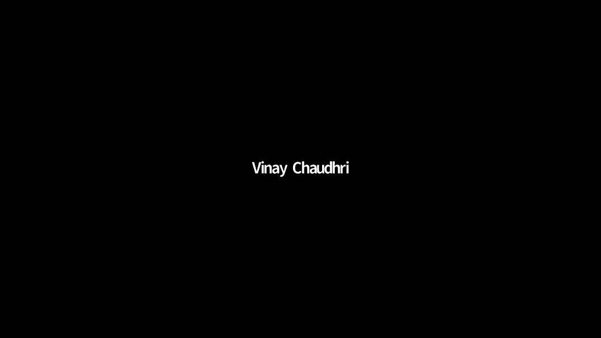
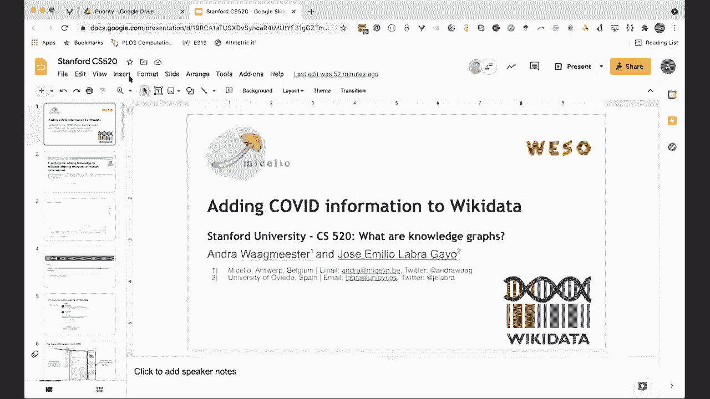
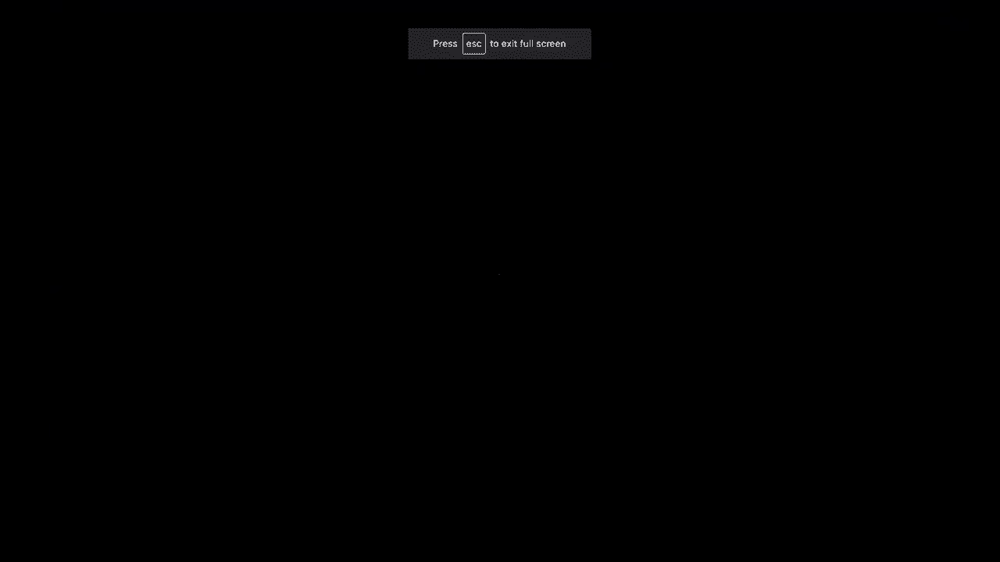
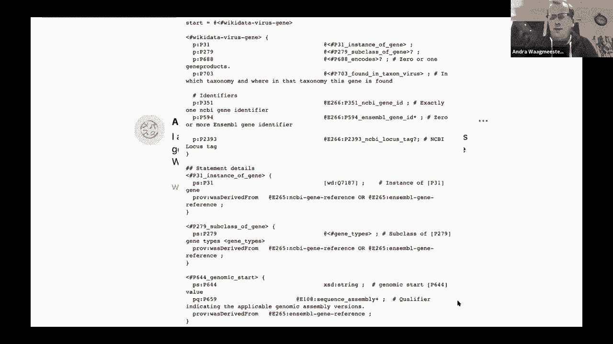

# P8：L6.2- 给维基数据添加Convid信息 - ShowMeAI - BV1hb4y1r7fF

何塞或安德烈，啊，你们想分享你们的幻灯片吗，是呀。

所以接下来就交给你们了。

所以让我先说，谢谢你给我机会谈谈我们的工作，特别是在Wiki数据中添加令人垂涎的信息，我在做这个报告，和呃一起，Huelabra和我会，我将亲自在，何塞将在形状表达式中投入更多，我们将讨论。

我也要感谢彼得给，在那里搭建舞台来解释，对Wiki数据进行了很好的描述，但是让我们开始，所以这个原因，我们最近发表了一篇论文，请随时打开你的视频，如果你喜欢，你不必，但是，我需要找到，给我一秒钟。

所以你现在可以看到你，是啊，是啊，因为你会看到我的屏幕，是呀，我想是的，是的，这个演讲是我们将要讨论的用例，是我们最近发布的一个协议，用于将数据添加到Wiki数据中，机会是，当然啦。

当前正在进行的流行病，但是专业人士，该文件的注意力也是为了创建一个协议，或可用于调整资源的步骤，我们为什么要这么做，在这里你看到了，例如，呃，论文数量，我只是随机选择了图表，呃有些话题。

所以我服用了埃博拉病毒，你可以看到它可以在2014年激增，这个，这是这是Pubmat中的引文，这是一个，这是一个非常好的表面，这是在线的，所以你看到你有埃博拉病毒，在第二次世界大战刚结束时，疟疾激增。

这里我们有艾滋病毒，我们有八个，然后突然我们看到Covid 19和Sarov，所以我们收到了大量的知识和科学论文，以及如何理解即将发生的一切，这里也有错误内容泄露的风险，或者被拒绝，呃，在这个过程中。

那么我们如何才能找到资源，我们怎样才能找出什么，什么是，什么是真的，什么不是真的，或者我们能回到证实的数据，文献中提出的所有主张，那么早在三月十九日，我看到一条推特说这个。

这条推特实际上开始了这篇论文的写作过程，这是Egon Wilask的推特，谁问，我问安德拉，如果他们的机器人可以用来做这件事，那么外面有什么，在这条推特上讨论的是嗯试图添加嗯。

Egon在说什么所以当他说，如果你如果我们能用机器人，他指的是基因维基项目，基因维基项目是一个始于2008年的项目，旨在为存在的每一个人类基因创建一篇维基百科文章，它捕捉，呃。

来自各种数据库的数据结构数据，例如标识符，它通过众包捕捉和总结知识，所以在维基百科为每一个基因创建页面的时候，有一个限制，这只是英文维基百科，很难把数据恢复成结构化的格式。

所以在2012年维基数据出现了，基因维基项目向前推进，将基因和基因信息，蛋白质，疾病和药物在Wikidata而不是维基百科上，为什么维基数据，所以维基数据类似于维基百科，从某种意义上说。

维基数据或维基百科是文本，Wiki数据就是数据，它使用了一个类似的项目，它使用类似的um基础设施，就像维基百科一样，它实际上是对媒体的延伸，我们保留驱动维基百科的框架，它是完全免费的，就像维基百科一样。

任何人都可以做出贡献，它涵盖了所有知识领域，它有广泛的项目，历史，谈话页，等，它附带了查询语言的强大功能，也不重要，不重要的是它是稳定的，它超过了相当多的资助周期，所以研究数据经常得到的地方，呃，腐烂。

因为缺乏资金，它可以依靠维基数据生存，所以随着维基数据的沉浸，基因维基项目从维基百科切换到，呃，到维基数据，这就是目前的情况，基因维基项目正在维护一组机器人，它正在寻找各种公共数据来源，关于基因。

化合物，蛋白质，文学，代谢途径，生物途径，并维护这些资源，嗯，和维基数据，并定期检查那些，那么这意味着什么，它是什么是公共数据库的选定来源，第一步是丢失模式协调，如果你有基因，你如何寻找基因。

彼得已经说过了，你有这样的例子，如果你想谈谈基因，你想对齐，以及要在Wiki数据中使用的语句或属性是什么，那是做那件事的第一步，你如何识别，在当前时间内，您可以去，嗯嗯，看类似的项目。

您检查已经存在的G，只需列出可以转到Wiki项目的语句，它们是通过在Wikidata中对特定主题的社区进行排序的专用项目，或者你用一个何塞会，呃，稍后讨论，它提取模式，然后一旦您编写了这个模式集。

您编写一个机器人来检查和更新其中存在的数据，要么在他们的标签上，共享标识符，或iri映射，所以两天后，这条推特出去了，说我们实际上得到了第一个，病毒基因维基数据的第一个模式，看起来有点像这样。

所以这是一种机器可读的格式，称为形状表达，表明每个病毒基因都应该是，应该接受一些微妙的信息，这些都是Wiki数据中的属性，我想请何塞发言，深入了解模式，变成这个形状，我们在这里描述的表达式。

我应该用幻灯片吗，或者你想分享何塞，但我们听不到你，你可能是静音的，也许我可以试着分享我的屏幕，还是可以，我会停下来，那么是的。

