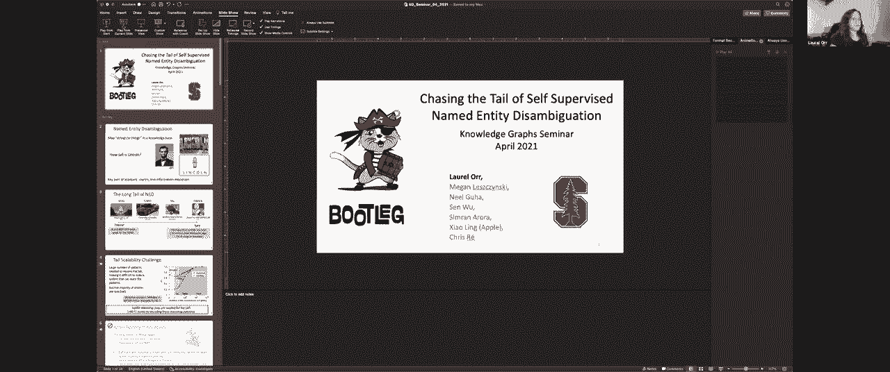
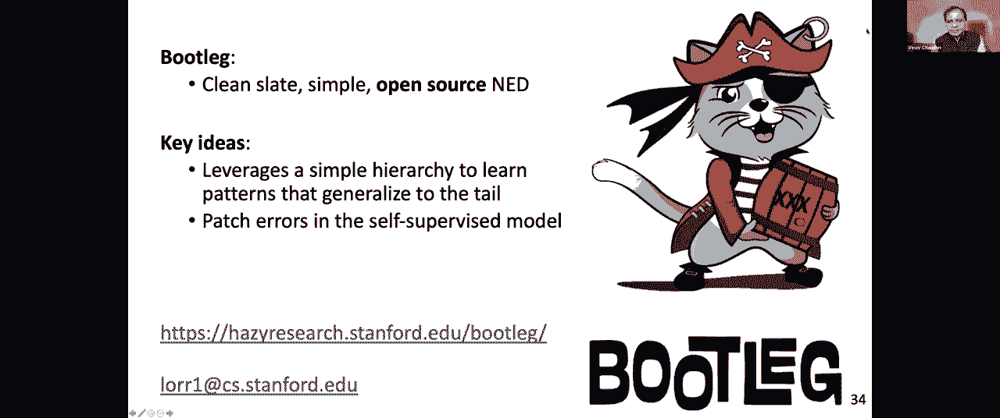

# 【双语字幕+资料下载】斯坦福CS520 ｜ 知识图谱(2021最新·全20讲) - P11：L8.1- 自监督实体识别与消歧 - ShowMeAI - BV1hb4y1r7fF

欢迎来到今天的知识图研讨会，我们在课程的第四周，我们的重点是如何从结构化数据中创建知识图，星期二，我们讨论了在这个过程中出现的一些问题，包括模式映射，今天的记录链接和数据清理。

我们很幸运有两位这方面的专家，劳伦或者她是斯坦福大学的博士后，这可以进一步减少我们必须投入的人力，在数据集成过程中，玛雅·凯杰里瓦尔，呃，他也是一本关于知识图的教科书的合著者。

麻省理工学院出版社最近发布了，他将告诉我们网络规模知识图中的实体分辨率，他的演讲快结束了，他还将提出一个知识图的大图景，以及这些不同的步骤如何适应整个过程，所以我们要从劳伦开始。

嗯真棒，非常感谢你的介绍，我来确认一下，嗯真棒。

我能让每个人都看到幻灯片吗，好的，是呀，太厉害了，太好了好吧，每个人都是如此，呃是的，呃，劳雷尔·奥伦，我是博士后，嗯，显然在斯坦福大学，我要说的是，呃是的，我的工作，是啊，是啊，实体消歧，我们的系统。

我们称之为盗版，这是一个有趣的故事，这个名字是怎么来的，很乐意以后再聊更多，作为底漆，我来解释一下这个任务是什么，嗯，所以这是从字符串映射到知识库中的东西的过程，例如，如果你有问题，林肯怎么样了，嗯。

私人助理，否则系统将不得不返回，提到的是亚伯拉罕，林肯，不是汽车公司或内布拉斯加州的城市来正确回答这个问题，现在，确定参与的实体的这一过程，文本是下游应用程序的关键部分，比如私人助理搜索。

因为我将谈论后面的关系提取，嗯，它们每天被数百万人使用，所以这真的是许多下游系统的核心预处理步骤，你一直在用的，好的，向前推进，好的，开始了，好的，所以实体，呃实际上躺在这里的光谱上。

我们把它分成了四个子组，对呀，非常受欢迎的实体是我们所说的头部实体，这些经常出现在你的训练数据中，嗯，像华盛顿特区，例如，是一个非常受欢迎的实体，大家对此都很熟悉，你有很多文本数据，你可以训练来了解。

华盛顿特区是什么，这意味着现有的信息检索方法，像呃或者像伯特模特，现在实际上能够很好地消除这些实体的歧义，在光谱的另一端，我们有我们所说的尾巴，和很少看到或根本看不到的看不见的实体。

在您的标准训练数据集中，我稍后会讲到，例如，这首歌是由一位艺术家创作的，我不会尝试发音，嗯，甚至不在Wiki数据知识图中，虽然它在某种歌曲数据库中，是你，它可以在Spotify上播放，人们会想说。

请你的私人助理演奏这首歌，所以训练数据的稀缺性使这变得非常困难，而是因为您没有很多可以使用的文本上下文，来解决这个实体是什么样的，实体酱是什么，嗯，为什么这如此重要是因为在工业环境中。

大多数用户查询实际上是通过这些罕见的实体进行的，即使你看维基维基数据作为一个标准的知识库，然后你有维基百科，它有关于实体的文本信息，只有大约13%的Wikidata实体，甚至出现在维基百科的维基中。

你可以，你可以，您有关于，甚至不到音乐辫子中所有歌曲的1%，甚至在维基数据中，对呀，所以你会看到实体的巨大尾部分布，现在没有很多文本数据可以使用，为什么这是一个挑战，你不能真正训练传统系统。

消除这些罕见实体的歧义，所以标准基线模型，嗯对于任何，经常使用像bert这样的语言模型来进行消歧，这些模型基本上会记住很多文本线索，关于一个实体，为了知道正确的答案是什么，现在你看到右边有一个情节。

它是查看一个实体在训练数据中大约出现的次数，总体来说，模型的总体精度为1，我们有这条蓝线，这是一个基于标准语言模型的基线，你在这里可以很清楚地看到，一旦你开始在训练中看到一个实体一百次。

当基线语言模型能够排序，做得很好，超过60华氏度，它真的在这些罕见的事情上开始挣扎，现在，这意味着，让我们假设你采取了一种方法，我想用这个基线模型，我希望它在所有实体上至少做60%。

这意味着你必须缩放你的训练数据，所以现在每个实体都被看到了大约一百次，Wikidata和缩放中大约有9000万个实体，那个，每个实体有一百次出现是，是不可行的数据量来训练。

所以你真的不能扩大你的训练数据来获得尾巴上的高覆盖，那真的不是一个选择，现在我们将向您展示如何使用，嗯，我们在我们的模型盗版中，我们如何能够在这些罕见的实体上实现高性能，通过使用这些微妙的推理模式。

你可以在尾巴上使用，不依赖文本记忆的，你如何获得大约40英尺一点的提升，这就是，正如你将要看到的，在那里知识，图关系和类型信息将帮助我们解析尾部的实体，太厉害了，好的，所以现在最大的问题是，你怎么。

你如何使用这些推理模式来消除尾巴的歧义，所以我要给你一点入门知识，以及任何D系统如何工作的高级概述，只是为了让你明白，嗯，我接下来要讲的事情，对呀，所以标准输入输出，你有一个输入，这是一个句子。

比如洛根县的林肯在哪里，然后你的模型的输出将是参与文本的实体，所以在这种情况下，你将有林肯伊利诺伊，和伊利诺伊州的洛根县，而不是林肯内布拉斯加州或其他林肯。

所以这个过程的第一步是我们实际上提取候选人或候选人一代，我不打算详细地谈论这个，但这样做的总体动机是很难，出于各种原因，对知识库中的所有实体进行排序解析，所以通常这个管道有一个检索解析部分，在这里。

你将候选项的集合限制在与句子相当相关的范围内，很有可能是答案，嗯，这些候选人，然后我们提取我们所说的实体配置文件，这基本上是存储在数据库中的信息，也就是，呃，像实体类型这样的东西，唯一标识符，重要的是。

您拥有的任何结构元数据，与该实体相关联的，例如实体类型，或者该实体与之关联的知识图关系，我稍后会提到，所以这些有效载荷，或者对不起，嗯，这些配置文件被转换为实体有效负载，基本上被输入我们的神经模型。

然后我们的模型是输出的，我们在句子中提取的每一个提到的最有可能的实体，所以在高水平上，这是一种输入，AND系统的输出和数据流，所以现在我们准备潜入，这次谈话中最有趣的部分是什么。

这就是我前面暗示的微妙的推理线索，所以消歧需要关于单个实体的信息，关系和类型，现在我将用几个例子来进一步解释这一点，所以如果我问你，林肯在内布拉斯加州的哪里，或者史蒂文·斯皮尔伯格是哪一年制造林肯的。

你就能知道第一个林肯指的是林肯，内布拉斯加州，城市，后者指的是，史蒂文的电影《林肯》，作者：史蒂文·斯皮尔伯格，你这么做的原因其实很简单，是因为那里的文本模式，嗯，史蒂文·斯皮尔伯格的电影将与。

显然是和导演在一起，或者和史蒂文·斯皮尔伯格在一起，文本短语本身，林肯也是如此，林肯将与内布拉斯加这个词联系在一起，现在这些是可以在实体级别记忆的模式，有与独特实体相关联的文本短语。

现在这些模式的挑战是它们不能概括，我的意思是，就因为我了解到电影中的这种联系是高度共同发生的，史蒂文·斯皮尔伯格没有给我任何信息，任何其他电影或任何其他与林肯或史蒂文·斯皮尔伯格有关的东西，对呀。

它是那个实体本身独有的，所以这是一个非常有用和高度判别的信号，这意味着它帮助你真正识别独特的实体，但不能一概而论，这意味着它不会帮助我们克服这些罕见的实体，我们没有看到很多，另一种模式是这些知识图关系。

所以大卫·米切尔和维多利亚·米切尔的判决为他们的婚姻增添了情趣，嗯，在这里，我们实际上知道维基百科中有两个维多利亚·米切尔，其中一个是扑克玩家，其中一个是跑步者，然而。

只有一个维多利亚·米切尔嫁给了一个大卫，这是一个喜剧演员，戴维，戴维·米切尔，现在，你知道什么的唯一方法，正确的答案是，是通过推理，事实上，这两个维多利亚·米切尔和大卫，米切尔结婚了。

这将帮助你在这句话中找到正确的大卫，现在，这里的关键是你在，关于什么是知识图关系的信息知识，这意味着实体之间实际上是一个可推广的信号，如果我知道两个实体结婚意味着什么。

我实际上可以用这些知识来解决罕见的已婚实体，即使我从未见过他们，在训练数据中也见过他们，这就是为什么对这些结构模式的推理会帮助我们，现在另一个模式是我们所说的类型模式，所以说，比如说，如果你有判决。

林肯有多高，很明显，这是指那个人，什么是最便宜的林肯将指的是汽车公司，林肯有多少人是指位置对吗，这是因为不同的文本信号是相关联的，实际使用实体的类型，人是有高度的，不是汽车公司或地点对吧。

汽车公司有价格，但不是人或城市，所以这些类型模式也将帮助我们理解，句子中正确的实体是什么，一次又一次，这是另一个概括的模式，如果我知道作为一个人意味着什么，人是有高度的。

我也可以用这个来解决一个罕见的人，即使我以前从未在训练数据中见过它，所以再一次，这些知识的信号，图形和类型模式将帮助我们推广，而且不一定需要所有这些文本记忆来理解尾巴，所以这些，呃。

这些信号将生活在一个层次结构中，就歧视和普遍性而言，正如我前面提到的，这种文本记忆模式具有很强的判别力，它真的帮助你缩小实体，很多才是正确的答案，但现在一点也不普遍。

激励kg关系和类型之间的层次结构的其余部分，嗯，我们对维基百科做了一点检查，发现大约2%的实体，嗯，有一个关系，大约有126个这样的关系现在发生了100多次，这对一个人来说意味着什么。

我们实际上会在标准的维基百科数据中看到足够多的这些关系，为了在它们身上学习模式，它也给了我们一种感觉，这种模式有多普遍，因为它只发生两次，与出现频率更高的类型模式相比，有2%的时间。

公斤关系在等级制度的中间，类型模式在顶部的类型上，现在，最后一个小部分的关键是，我们理解和消除歧义的方式，尾巴是通过教一个模型如何推理类型模式和知识图关系，所以下一个问题是你如何教一个模特做到这一点。

我们的答案实际上是通过嵌入，还有一些我们做的一些很好的小把戏来实现这一点，好的，所以这也是我们模型的总体输入输出，我真的要把注意力集中在这里的这篇文章上，实体有效载荷以及我们的实体是如何的。

然后我们的神经神经模型如何使用这些实体来消除歧义，所以我将回顾一下单个实体候选人的情况，在我们的模型中，这将有助于理解我们是如何，我们怎么做，使用类型和关系消除歧义，所以拿候选人洛根来说。

伊利诺伊州及其相关有效载荷，第一步还是对不起，关联实体配置文件，所以生成这个实体有效负载的第一步，它是一个实体的表示，我们真的要继续吗，我们为每个实体提取唯一的嵌入，在一个简单的嵌入矩阵中。

您可以将其视为键值存储，所以这里的关键是唯一的实体ID，价值将是它的嵌入，或者是它的嵌入表示，所以您首先为每个实体提取这个，嗯，对于每一个唯一的实体，然后我们对它的关系重复这个过程。

所以在这里你可以看到洛根县有一个关系之都，和一个以关系命名的，所以我用这些查询，在关系上的类似嵌入矩阵，并将其添加到有效载荷中，这是每一个有关系资本的实体，将获得相同的嵌入表示添加到其有效负载中。

这是如何，我们能够在训练中允许信号从受欢迎的实体转移到罕见的实体，我要去看很多受欢迎的实体，其中一些受欢迎的实体将拥有这种关系资本，我要学习与这段关系相关的这些受欢迎的实体的信号，通过这个嵌入。

它将允许它转移到罕见的实体，这也是关键的洞察力，这有助于我们的模型学习这些其他信号，我也对类型重复该过程，对呀，所以县得到了一种类型，地理位置得到了一种类型，每个县都会得到完全相同的类型。

现在这些只是被投射下来，形成什么，我们称之为实体表示或实体有效负载，这里的关键是，我对信号层次结构的每一层都有一个嵌入，这将允许我们的模型学习每一个信号的模式，并将它们存储在这些嵌入中，好的。

那么现在这些实际上是如何用于训练模型的，所以我要讲一点，呃，这里有一点细节，特别关注这些公斤的图案，因为，我们还有另一个把戏，允许模型利用知识图关系，所以我们确实保持了我们的模型的标准。

因为我们使用变压器积木，上面有一个特殊的公斤模块，所以基本的工作流程是你有这些实体有效负载表示，在左边你可以看到负载再次产生，这些表示被输入我们的模型，以及一个标准的基于bert的句子嵌入。

这些通过两个变压器架构馈电，嗯，其中一个只是帮助你了解实体之间的共存模式，另一个帮助你学习实体和句子之间的文本模式，现在这些输出表示被合并在一起，然后我们有一个非常特殊的公斤模块，这就是它就是它。

它允许实体转移表示，如果它们在知识图中直接相连，嗯，然后这些表示将被打分，然后我们现在预测最有可能的一个，为什么这真的很有趣和重要是因为如果你有一个句子，所以接受判决，海蒂和海豹住在拉斯维加斯。

这实际上是一个基准的句子，我们花了很多时间思考，所以在这句话中，你有两个人住在拉斯维加斯，印章实际上是一个相当明确的实体，在知识库里叫海豹的人不多，它实际上是指海豹，歌手海蒂，然而要模棱两可得多。

在Wikidata和维基百科中有很多著名的Heis，所以对于一个模特来说，它将学习一个表示，对于得分很高的实体来说，是的是的，它相当有信心，给出的判决是，这是密封的一个人。

如果这个得分很高的代表能转移到他的妻子海蒂身上，这会让海蒂也得分很高，因为这两者在知识图中是相连的，这就是kg模块的作用，它允许模型对这样一个事实进行推理，如果我相当肯定其中一个实体是正确的答案。

共享知识图的另一个实体也很有可能，代表或与该实体的关系也将是正确的答案，嗯，这是我们的，是啊，是啊，这是我们的神经模型，它再次允许我们对所有模式进行推理，又有了这个特殊的公斤模块扭转。

它允许我们进一步利用知识图关系，嗯好吧，所以这是一种输入输出，我们的有效载荷和神经模型，现在我要谈谈，我们如何做几个花哨的训练技巧，以及我们如何训练我们的模型，嗯，这个有两个部分，呃。

其中一个将是一个花哨的正规化技巧，另一个是关于我们的训练数据，以及我们如何鼓励模型学习这些信号，嗯，使用一种我们称之为训练集细化的技术，所以当你在现实世界中训练这些东西时，实际上会发生什么，是你吗。

你会喜欢模特，能够自己适当地平衡这些信号，现在记住，就像我之前说的，这些信号是有层次结构的，实体信号，那个，在我的模型中嵌入的蓝色，将是最具鉴别性的信号，现在在训练期间模拟趋势。

实际上是依靠这个高度辨别的信号，这意味着如果你不做任何事情来防止它，模型基本上将最依赖于这个实体嵌入，它实际上不会从关系和类型中学到很多，嗯再次，这只是自然的倾向，就是做一些帮助它降低损失的事情。

最关注的是实体嵌入，所以我们真的想加入一种花哨的东西，在这里转，我们希望在模型中有一个归纳偏差，推动它学习关系中的信息，并通过这个实体表示来学习类型，因为重点是更好地学习。

就是让模特在尾巴上学到更好的东西，但是，我们不希望它完全忽略这个实体嵌入，它将编码许多有用的信息，尤其是对于它看到很多的非常受欢迎的实体，所以我们要做的是，这相当简单，我们实际上是在规范，嗯。

与反流行度成正比的实体嵌入，现在，我的意思是它的受欢迎程度与它的受欢迎程度成反比，这意味着实体越受欢迎，定期正规化的可能性就越小，当我们把它正规化的时候，我们基本上将嵌入中的所有值设置为零。

这阻止了模型使用任何信息，或在该嵌入中存储任何信息，因为它都设置为零，所以对于非常受欢迎的实体，这种事并不经常发生，模型将在实体嵌入中存储更多信息，也可以，这就是我们现在想要的，对于稀有实体。

这很可能会被设置为零，它将迫使模型使用关系和类型，进行消歧，现在这个简单的技巧只是正则化实体嵌入，嗯，哦，它给了我们大约13点，在这些看不见的实体上的六个f一点。

所以这对这些罕见的实体来说是一个巨大的提升，强制模型将模式存储在正确的位置，这个是，是啊，是啊，这些都是你要再做一次的小技巧，鼓励模型做一些它，这对它的整体损失来说会更糟糕一点，但很好。

它现在会帮你越过尾巴，我最后想说的是我们是如何进行训练的，我们实际上训练的是什么，这是我们非常强烈的，我想用我们的模型来维护，是因为它更多的是把手，我的意思是你不必有工程师，有点手工策划。

整理特征或标记数据，我们希望它是非常自动的或尽可能自动的，所以我们必须，我们必须找到训练数据，这些数据基本上是为我们标记的，这样我们就可以自动贴上标签，所以事实证明，这是任何系统都做的标准事情。

维基百科里有很多有用的信息，重要的是，维基百科有这些叫做互链接的东西，所以如果你在维基百科页面上，你看到这个文本是蓝色的，你点击它，你转到另一个维基百科页面，这是一个手动注释的用户。

它实际上形成了训练数据，我们可以用来消歧，所以在维基百科的这句话中，我们有，嗯，虽然他们一起巡回演出，林肯的名字并不是，他们可能是巨人，专辑林肯，所以在维基百科上，林肯被联系在一起，它指向乐队中的林肯。

现在这将作为我们训练的标签，所以基本上我们通过阅读维基百科来训练，这是相当令人兴奋的，我们还使用标准的Wiki数据来，提取结构元数据，形成我前面谈到的那些实体配置文件。

所以我们通过刮维基百科自动预处理所有数据，嗯，收集标签，然后从Wikidata收集结构化数据，都是自动存储的，有点像一个点击过程，所以没有手动手动交互，一次又一次，这里最大的收获是，我们不仅很容易做到。

但这只是，这是一个，这是一个更简单的，更直接的管道，当你训练这些系统时，工程师不必手动修改东西，它很容易扩展到其他语言，我只需要指出我的处理，嗯到维基百科的另一种语言，它确实会导致一些问题。

因为有时语言资源贫乏，但现在那是单独的谈话了，我也提到了我们也可以使用一些技巧，关于训练数据，帮助我们的模型学习这些罕见的模式或这些结构模式，更多的是，现在事实证明，维基百科实际上被标记得相当稀疏。

和失踪的提及，在我之前给你们看的关于林肯的那句话中，你真的看到他们，他们在相册中有链接的引用，在句子的底部，它清楚地指向那个实体，但提到的标签实际上在维基百科上没有标记。

这在很大程度上要归功于维基百科的一个人工制品，以及用户采取的标准，当他们贴标签的时候，当他们在维基百科中标记互链接时，然而，维基百科也是高度结构化的，大多数时候，当你在维基百科页面上。

很多关于这一点的提及，关于该实体的引用页面，你在自己身上，所以我们实际上可以用它来做一些基于弱监督的技术，嗯，自动标记我们的数据，以增加我们的标签覆盖面，所以这里，比如说。

这意味着我们可以使用一些标准的周供应方法来标记，第二次提到林肯是指专辑中的林克，现在这个简单的启发式又是它的全部，它的监督很弱，所以再一次，我们必须写一些启发式标记函数，但在那之后，一切都是自动的。

现在我们通过这项技术将训练数据增加了大约1。7倍，我们也看到了这些看不见的实体的一点点提升，这是因为当我们添加这些额外的标签时，你也会更多地增强这些信号，所以如果我再有一句话。

那是关于海蒂和海豹住在拉斯维加斯的事，只有海蒂或海豹中的一个被贴上了标签，如果我的弱标记方法标记了另一个，那么这将使我的模型更多地访问这些知识图形信号，比如说，又是这样，这是一种非常简单的技术。

这也有助于我们的模型提高对这些罕见实体的性能，好的，所以我们要在这里讨论几个实验，嗯，第一个是标准的最先进的基准实验，现在所有的报纸都有，只是展示我们的模型呃，表现得很好，某种标准，呃，任何基准，呃。

但让我们像，那其实没那么有趣，尾巴才是真正有趣的地方，所以这里我们有这个维基百科数据集，我们将我们的模型盗版与基于标准语言模型的基线进行比较，也是在相同的数据上训练的，我们看到所有的实体。

这个基线模型距离盗版大约五分，我想说清楚，我们在这里没有做很多调音，我们只是点击了又点击，跑了，有点跟着结果走了，所以再一次，性能可能会提高一点，通过一点参数调整，然而，在尾巴上。

你会看到性能上的巨大差异，在这些看不见的实体上，这个语言模型比我们的盗版模型低40个点，这只是因为这些结构信号，对呀，就像，此语言模型基线，只是使用文本记忆来消除歧义，它真的会在这些罕见的实体上挣扎。

现在这里的另一个微妙的点，这是我们的团队也在努力的很多事情，这个f-1的总体um评估集，这里设置的所有评估是相当误导性的，嗯，在标准的开发测试集中，有时也会被流行实体偏见。

这意味着你没有真正看到你的模型的真实性能，使用标准评估指标，现在来了解我们的表现清单，了解我们的收益来自哪里，我们最后做了一点基于子种群切片的评估，所以我们在数据中挖掘了不同的亚群。

我们认为不同的推理模式存在，例如，如果您有两个共享知识图关系的实体，他们是句子中的正确实体，我们会继续把它放在我们的公斤子种群桶里，我们对类型做了类似的事情。

在那里我们观察了具有共同发生的文本模式的实体，与其实体类型相关联，例如，与人一起出现的高度这个词，我们把它放在我们的类型桶里，然后我们的实体桶是任何基本上不在类型中的东西，或者一公斤的桶，在这里。

我们再次看到盗版表演，嗯明显比尾巴好，也在这些推理模式切片上，嗯，我们在这里再次看到，对于类型，还有公斤桶，嗯，盗版比这个烧毁的基线模型要好得多，嗯，大约60分，尤其是尾巴上这个重达1公斤的。

这再次证明了我们的模型，在这些推理模式中，我们现在能够提高性能，最后一个跳过这个的，嗯，我想说的最后一个，我认为这是一个非常有趣的，我们探索的有趣的下游任务是我们也想了解，正如我所说。

早期的实体嵌入非常有用，因为，因为你可以在下游系统中使用它们，所以我们所做的是我们采用了一个标准的关系提取基准，给你一个句子，就像你在幻灯片上看到的，还有一个主语和宾语，目标是预测它们之间的关系。

所以在这种情况下，玉米是媒体企业的员工，你希望模型能够预测，我们所做的是我们采取了一个标准，um基线模型，嗯，呃，嗯，当时它是一种最先进的模型叫做跨度鸟，我们将其与一个模型进行了比较。

该模型中也包含了一些实体知识，不叫伯特，然后我们还在Spanbert模型中添加了我们自己的盗版嵌入，和这里的比较比较比较，我们在这种关系上设置了一个新的艺术状态，摘录到基准，只需添加盗版嵌入。

但真正有趣的是为什么，所以当你真的分解并尝试看看我们的模型是正确的，另一个模型错了，就是，你开始看到这些知识图形和类型线索以及实体线索，真的很有帮助，所以在这里。

我们实际上我们的模型能够正确地预测这两个实体，嗯有关系死因，因为它们实际上是在我们的知识图表盗版中联系在一起的，预言了这两个实体，并向我们表明这是他们之间的关系，我们能够得到正确的，因为它。

我们也能把事情做对，因为我们实际上能够正确地进行消歧并解析相同的实体，我们能够捕捉关系，比如交替的名字，是啊，是啊，所以这是一件非常令人兴奋的事情，这里的另一个微妙之处在于。

你实际上可以想象用盗版来挖掘更多的关系，可以进入你的知识图，所以它实际上可以形成一个信息循环，嗯，因为你在提取关系，也就是提取知识图中的其他三元组，所以一个很好的小，呃，一个小小的闭环循环，所有的权利。

所以这是盗版的概述，我们的目标是让它成为一种尾部聚焦，任何系统，而且它也是开源的，所以请查看我们的，嗯，我们下面的链接和我们的网站了解更多信息，嗯和嗯，是啊，是啊，看一下。

关键的想法是利用这些模式而不是类型和知识图关系，提高尾部的性能，我们在一家报纸上也有一些工作，它讨论的是修补错误，这就是为什么最后一条评论，嗯是的，所以所以非常感谢你让我，做了一点演讲，然后呃，是啊。

是啊，我现在或以后或最后什么时候回答问题，是啊，是啊，最后我们有二十分钟左右的时间提问，太厉害了，太厉害了，完美，是啊，是啊，是啊，是啊，谢谢。非常感谢，我是说，你的工作很有趣。

但我也喜欢你的标志，是啊，是啊，是啊，是啊，是啊，是啊，否，那是嗯，我和一个朋友坐在办公室里，我甚至不说话，所以说，鸡尾酒实际上是一种很常见的东西，你很难消除歧义，因为你会喝香槟一样的鸡尾酒，曼哈顿。

a波士顿，你知道像这样的东西通常以位置命名，所以我们有一个鸡尾酒主题，然后说到一个私酒贩子，也就是可以走私的人，比如，呃，呃，就像酒精，反正变成了一些走私东西的猫，所以是的，有点像加勒比海盗，感觉是的。

是啊，是啊，绝对，绝对，我们很享受，所有的权利，所以我们将继续我们的第二个演示，呃，我叔叔公开好吧。