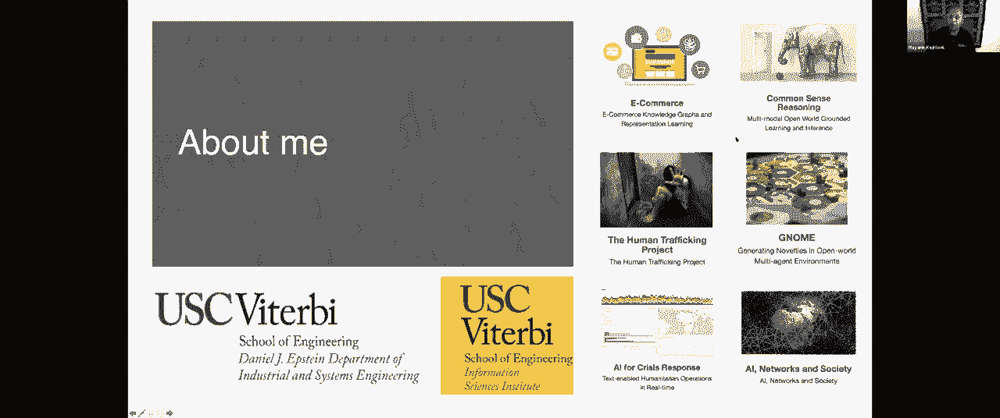
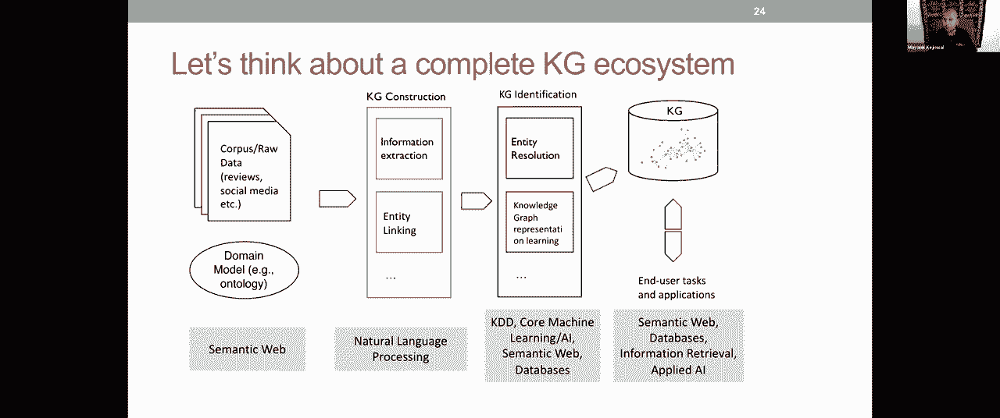
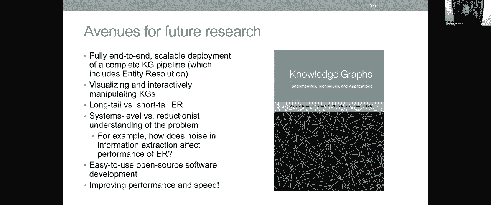

# 【双语字幕+资料下载】斯坦福CS520 ｜ 知识图谱(2021最新·全20讲) - P12：L8.2- 网络知识图谱中的指代消解 - ShowMeAI - BV1hb4y1r7fF

所有的权利，你还能看到我的屏幕对吧，我去筛选一下。

所有的权利，我会确保我保持一个盖子的时间，嗯好吧，所以呃，嗯嗯，所以我是Mayank，今天我很高兴来到这里，谢谢你，呃谢谢你邀请我，今天我想谈谈，嗯，你知道什么是真正的愿景。

我认为在过去的15年里这一直是一个社区层面的愿景，你知道如何在Web知识图上进行实体解析，我会说一点为什么这是一个愿景，尤其是对于Web，为什么事实证明这很难。

我们现在在哪里，下一步要去哪里，嗯，所以关于我的一点，嗯，嗯嗯，在工业与系统工程系，嗯，并在信息科学研究所获得联合任命，嗯，我们做了很多不同的项目，这是我的一些项目的快照。

所以我在人工智能方面做了很多工作来造福社会，几乎所有这些知识图都被大量应用，所以呃，它是，看到这样的课程总是很棒的，事实上，关于这个项目的推理常识，我们与斯坦福CS的Ylecoveover合作，所以呃。

我们在这里有一个小联系给你们，这些都是知识图非常令人兴奋的应用。

嗯，好的，所以你知道，顺便说一句，如果你对这些项目感兴趣，您想了解更多关于这些项目的信息，请随时问我或向我伸出援手，我喜欢通过它们联系，所有的权利，所以让我从一个观察开始，在我真正进入问题之前。

我总是喜欢从观察开始，你知道，如果你仔细想想，我们正在从一个链接文档的网络，所以这就是你所知道的，我们认为网络是，呃传统上是对的，您有这些超链接文档，嗯，你知道在html页面上等等。

但我们实际上正在从它转移到一个链接数据的网络，这并不意味着这正在取代文档网络，你知道这是与文档网络一起存在的，但我们是，um数据精细，很多，网上的信息，谷歌知识图，当然是一个很好的例子。

但甚至在2011年谷歌知识图表之前，嗯，我们已经有一个运动正在进行中，称为链接开放数据，所以这只是链接开放数据的可视化，嗯在中间，二千和十在二千和七链接开放数据，刚开始，呃，你知道十二个RTF数据集。

我将稍微介绍一下rdf是什么，但你可以把它看作是一个知识图模型，它在短短十年内发展得很快，它从12个小数据集，相对较小的数据集，你知道一千多个数据集，它们之间有数百万个节点，你知道它与文件有关，嗯。

有实际的数据，有尿道，和，你知道很多很多不同的事情，许多不同的领域，也是，所以从媒体到出版物，我们所说的跨域数据集，比如dbpedia，呃是从维基百科摘录的，自由基，它被谷歌收购，并为谷歌建立，知识图。

社交网络，生命科学，嗯和许多其他人，但如果你真的对此感兴趣，我强烈推荐一篇2001年发表在《科学美国人》上的论文，作者：蒂姆·伯纳斯·李，万维网的发明者，在那里他为他所说的语义网络提出了一个愿景。

你知道的，这是语义网络中的一个非常中心的运动，所以非常鼓励阅读这篇关于愿景的非常容易理解的文章，从文档网到数据网，一直追溯到2001年，那么什么是链接数据，嗯，事实证明这实际上不是数据，链接数据。

是在Web上发布和连接结构化数据的一组四个最佳实践，所以这是一个非常简单的定义，嗯，当然还有，我们使用这些原理实际发布的数据集是，有时也称为链接数据或链接开放数据，正如我在上一张幻灯片中所示。

我不会去所有最好的实践，但最好的做法之一是，每当您在Web上发布数据时，您必须将其连接到现有的数据集，这似乎是常识，对嗯，如果你在网上发布一些东西，您实际上应该提供到其他东西的链接，但事实证明，如果你。

你知道有很多人喜欢从他们的数据集中提取，我们把它发布在网上，他们忘记把它链接到网上现有的数据，所以你必须非常努力地将你的，您的数据集转换为Web上的其他数据集，这就是为什么，这是最好的做法。

这就是链接到链接数据的来源，现在我还想介绍我的跑步示例，我将在整个演讲中使用，你知道在左手边，你有橙色的自由基，这是一个非常直观的例子，你知道你有微软，微软是由保罗艾伦共同创立的，联合创始人之一，嗯。

你知道微软是一家公司，公司是一种组织形式，以此类推，等等，在另一边，您有dbpedia，你还有保罗·艾伦，但是你可以看到这两个知识图之间有差异，有些差异似乎非常明显，但你知道其他人更微妙，就像你有，嗯。

你知道，呃，发明家这边企业家这边，你在这里有一个非营利组织，但是没有，这里什么都没有，这似乎是一个非营利组织，对和嗯，你知道的，所以记住这个例子，我们将详细讨论它，您将看到该示例表达了很多。

我们在网上经常看到的问题，在我深入了解这有什么问题之前，嗯，我确实想介绍RDF，因为它是一个非常重要的模型，尤其是在我们的社区，语义网，和，嗯，你知道一个RDF，它代表资源描述框架，嗯。

这是一个非常简单的模型，从定义上来说，数据集的概念是一组残废，嗯，瘸子可以可视化为有向标记图，你知道，所以这个图中的每条边都是三重右，所以你有头部实体关系实体，我们已经看到这个概念被引入了。

但有你知道的，并不是每个三元组都能真正满足IDF三元组的定义，所以你必须遵守一个非常具体的格式，当你有一个想法图，然后呃，这种格式是主题，我们所说的主体或头部实体，uh必须是URI或统一资源标识符。

属性也必须是URI，对象可以是URI或文字，文字是基元数据类型，可能是一根绳子，可能是一个数字，它可能，你知道这是这是，呃，就这么想吧，有一个更正式的定义，但重要的是主语和属性或谓语必须是uri。

对象现在可以是URI或文字，因为这个数据模型是，uh是为网络设计的，嗯，事实上W三C，网络，全球网络联盟，这是一个非常有影响力的机构，它为Web提供了建议和用于Web的规范，嗯。

uh有一个关于RDF的完整规范，嗯，因为这是一个数据模型，它实际上是为了在Web上发布KGS而设计的，在实践中，许多URI或URL，因此当您单击资源时，单击主题或属性时，它将带您到一个描述URL的网页。

所以您现在可以看到连接是如何开始的，在知识图和知识图下的文档之间变得更加明确，事实上，链接数据实践之一，您应该尝试以标准格式发布您的公斤，例如RDF，嗯，所以我想给它一点背景知识，你知道的，嗯。

为什么这个符号在这里，嗯，这里是免费的，当你看到这样的符号时，当你有自由基和冒号，然后呃，你知道，一种非常特殊的弹簧，这通常是前缀，你知道，所以它可能代表自由基，com和冒号是斜杠，你知道的。

所以这一切，它的意思是，这就像是表示URL的速记方式，你知道的，我鼓励你阅读很多关于rdf和w three dot org的信息，尤其是如果您在Web上使用KGS，你会发现它对，呃。

用于了解Web规模下的KGS，那么什么是实体解析，简单地说，是连接引用相同底层实体的实体对的算法问题，我们已经在这里看到了一些例子，对呀，所以你有微软，也就是，呃，与DBpedia中的微软公司相同。

我们有保罗·G·艾伦，这与保罗·艾伦和DBpedia相同，语义网的一个好处是你知道，我们可以有一个谓词，叫做，也有一些类似的东西，但与谓语相同，呃，你知道你可以在两个资源之间声明一个三元组。

所以你有像自由基微软主题，与dbpedia相同，微软公司，那是个瘸子，当你定义相同时，它是对称的，这是可以理解的，所以当我什么时候这个微软和这个微软是一样的，那么从对称性上来说，微软公司和微软是一样的。

所以这就是推理引擎中发生的事情，你知道在哪里，呃，你知道如果你有一个，你知道如果你找得意门生，它是由斯坦福大学的另一个小组创建的，我非常鼓励你也去查一下，这是一个开放源码，嗯，这是一个。

它是一个可以用于处理本体的包，有了这些蒸汽作为海洋，等等，它有推理，它有推理的支持，再次内置，一个非常有用的工具，在语义Web中很突出，并与斯坦福大学的一个团体有着深厚的联系，但这里的想法是，这个模型。

RDF模型，可以用来表示不同数据集之间的链接，您也可以在同一数据集中出现此问题，所以很多时候，当你有一个非常嘈杂的数据集时，在单个数据集中可能会发生同样的问题，同样的理论也适用于，你知道的。

尤其是当您有一个简单的模型，如RDF，但正如我们将看到的，当我们有两个不同的数据集时，这就是我们在网上看到的，当你试图将所有这些不同的数据集以不同的方式描述在一起时，问题确实变得比。

当您只处理一个数据集时，你试图在一个数据集中链接东西，现在关于实体解析的一个讽刺是，当你查看文献时，名称实体解析本身存在实体解析问题，因此，您将看到引用解析的实例匹配实体匹配。

这实际上更像是问题的NLP版本，合并航程UM记录连接，更多的是数据库级别，问题重复数据删除，我是说外面有一大堆术语，嗯，它们不是不同的问题，它们非常相似，他们只是有稍微不同的亚社区，出版地点略有不同。

但他们真的都是一体的，同样的问题在一个非常基本的层面上，它连接了引用相同底层实体的对实体，我们为什么要这么做，所以这是你在书中找不到的东西，所以我想把这个问题介绍给大家，这样你就可以把这件事想得很大。

如果你现在尝试为那些熟悉互联网的人这样做，对呀，我们有一个叫做DNS的东西，这是一个真正的互联网寻址系统，它是使互联网成为可能的事情之一，对呀，我们作为一个社区想做什么，作为一名研究员。

我非常感兴趣的是，是一个更高级别的概念，叫做E，所以实体名称系统试图做的，对于在Web上发布的实体，无论是通过像wikidata和dvp dms这样的知识图表，你知道很多其他知识图。

但我们想填充一个AS，灵感来自DNS，对呀，所以想象一下，与其有这么多不同的保罗·艾伦，你只有一个保罗·艾伦对吧，一个保罗·艾伦与所有不同的保罗群岛联系在一起，遍布网络，想象一下。

如果我们能有一个这样的网络，现在我们不会摆脱其他保罗群岛，我们鼓励你出版你自己的保罗·艾伦，也许你有保罗·艾伦的额外信息，保罗·艾伦可能有一个社交，有一个社交网站，在那里你放推文等等，你知道。

所以你仍然，个别出版商仍然有很多控制和权力下放，但我们真正想做的是，把所有这些都与保罗·艾伦在，这样您就可以真正开始将Web视为一个全局数据库，好吧，如果我们能做到这一点，这就是蒂姆·伯纳斯·李的愿景。

也有它只是解锁各种应用程序，对呀，所以这就是，这就是伟大的愿景，你知道如果你能做到这一点，然后你就可以开始解锁各种应用程序了，有点像亚马逊现在为电子商务做的，当然，这就引出了一个问题。

我们如何正确地做到这一点，所以如果我们想这么做，这只是天上掉馅饼的想法吗，或者我们能确定具体的要求，如果我们能满足这些要求，我们可以开始做这个，这也很重要，因为它给了我们一个路线图。

你知道如果我们能确定这些要求，然后我们就可以开始衡量这些需求的进展，这有助于我们更接近愿景，所以这是我开始思考的问题，当我开始攻读博士学位时，那是在2010年初，所以你知道。

我的导师告诉我你知道我真的应该从这样的问题开始，只是出去，阅读数百篇论文，看看大家都在努力做什么，然后你知道，试着分析和综合所有这些，几乎像苏联人民一样弄清楚要求是什么，然后向社区推销，向社区争辩。

然后开始解决它，也许你最终不会在你的博士学位中解决这个问题，但你会解决足够多的问题，其他人可以在你的基础上建立，然后你可以继续你的学术生涯，并在此基础上开始建设，所以我你知道对于博士生来说。

我认为从一个大问题开始是有帮助的，然后从大问题进入更狭隘的问题，可行的，呃片段，你知道这可能会引发一个大问题，让我们回到我们的例子，开始思考我是如何提出这些要求的，我想简要介绍一下我的思考过程。

我在这个例子中看到的，我注意到的第一件事是，呃，您知道这两个数据集在元数据级别上非常异构，对呀，所以我发现了两种不同的异质性，其中之一是类型异质性对吧，所以在一个数据集中，你有公司、组织和非营利组织。

另一个你有同伴，发明人和人，对呀，这是一个图文并茂的例子，但现在你知道了，如果您考虑一个完整的本体，其中包含所有类型和子类型，嗯，使用的许多本体和模式之间存在不匹配，在未来的一次会谈中。

希望您能听到模式匹配，所以你会学到更多关于是什么让这个问题变得具有挑战性，但我们需要在某些方面匹配这些类型对吧，它的东西，这不是一对一的比赛，它更像是子集或超集匹配，所以我们必须记住这一点。

另一种异质性是财产异质性权，所以我们有这里的联合创始人，但在这里，我们有组织之类的东西，对吧，所以保罗艾伦通过组织属性属于微软，但这里有我们的联合创始人，你很清楚这两者之间有某种语义匹配。

即使它们可能不完全相同，嗯，我的意思是我们需要看到更多的例子之前，我们知道这到底意味着什么，这是否意味着你属于该组织，因此，即使是员工也可以通过这个谓词连接到Microsoft Core。

还是说你是联合创始人，这才是真正的意义，即使它不在春天出现，意思是权利，那么属性的实际语义是什么呢，所以我们现在也需要对此有某种理解，即使我们那样做，还有另外两个问题只有当你看到更高级的图片时才会遇到。

如果你想在Web规模上做到这一点，其中一个问题是域独立性，对呀，所以我们这里有这么多不同的域，你知道，很容易认为跨域实际上提供了，你知道一些你可以用来训练一切的东西，原来有很多域。

在那里几乎没有关于跨域数据集的文字，比如维基百科或dbpedia，我认为最简单的例子是出版物数据集，对嗯，你知道你有这些大的出版物数据集，就像谷歌学者拥有的一样，你有瞄准镜。

你有艾伦研究所维护的语义学者等等，一些有影响力的论文可能与维基百科有关，但不是全部，我们有数以百万计的文件，不是每篇论文都有维基百科的链接，不是每个科学家都有维基百科，我没有维基百科页面，我没那么出名。

你知道等等等等，所以有很多很多事情你没有一个实体，在其中一些知识图中，对了，长尾问题也存在，就像我们之前看到的那样，所以你知道你你，您想对任何域的任何对执行此操作，你知道你不想为一个领域训练一些东西。

甚至只是为了跨域，但是你想要域独立性，这就引出了第二个问题，也就是自动化，你希望事情相对自动化，我想告诉你的故事之一是不是真正的故事，但事实证明，许多计算机科学以外的人经常问一个问题，嗯。

你为什么要自动化一切，这是一个很好的问题，对吧，我们似乎认为这是理所当然的，一切都应该自动化，但事实证明，这现在受到了很大的抵制，从AI内部和I外部，在思想很好的地方。

你知道如果我能创建一个足够大的数据集，呃，你知道一套足够大的标签，我可以训练，我可以得到一个看似自动化的系统，对呀，但我们把它移到另一个领域，我们可能会有问题，嗯，还有谁会给我们这些标签，对呀。

就像我们所做的一切，做，我们使用远程监督，从网上得到一些东西，我们需要使用众包工作人员吗，我们是否使用一家为您提供数据标签的初创公司，就像，我们做什么数据标记是手工的对吧。

尽管它可能会导致我们所说的自动化系统，所以我们需要自动化，因为我们当然不能把所有的东西都贴在这里，对，我们不想花太多时间给任何东西贴标签，如果我们能帮上忙，嗯我们，你知道我们想尽量减少手工劳动，最终。

如果你想大规模地这样做，如果有人想这么做，我们在这里发布数据集和到所有其他数据集或大多数数据集的链接，它必须是自动化的，否则是不可行的，它不会与Web一起伸缩，换句话说。

你知道假设是如果你想填充一个链接的数据，因为你需要同时，同时这个词很重要，这里，满足四个破折号要求，我们称这些为域独立性的破折号要求，自动化，可扩展性，我认为的两种异质性，类型和属性，现在同时很重要。

因为，即使在这次谈话中我没有时间详细讨论，事实证明，当你看文献时，我将在我的论文中深入研究这一点，该书于二十六年出版，你可以找到许多满足一个要求的论文，有时两个，但我们找不到一篇，我在处理其中三个。

更不用说他们四个了，我们定义它的方式，我们给出了非常精确的定义，就像我刚才告诉你的那样，但很难找到一个能处理这四个问题的系统，你知道，它们是非常真实的权衡，如果你想处理自动化。

域独立性和可伸缩性可能是一个问题，因为许多自动化系统非常复杂，你知道他们有一个复杂的优化函数，他们要迭代很多，嗯，我们怎么做，如果我们试图像。

我们可以在MapReduce架构或Spark架构中做到这一点吗，当我们处理数以百万计的节点时，对呀，因此，Web规模的可伸缩性可能很难与自动化等东西相协调，我们也想用一种方式来做到这一点。

这样我们就可以处理噪音了，因为没有什么是无声的，对呀，那么我们要怎么做呢我们有可接受的质量而不是完美的，但可以接受，所以你知道，让我告诉你我们需要采取的一些步骤来处理这个问题，第一步是做类型对齐，对呀。

所以我们需要匹配企业家和发明家，公司和公司，会有很多，很多类型，如果你跨域，你可能有生物类型，你可能有，你知道的，所有我们在常识上无法理解的其他类型，时尚，但我们需要这么做，不知何故。

事实证明有一些无人监督的方法来做到这一点，它们基于类型所涵盖的实体，你知道你可以，你可以想想，您可以使用基于嵌入的方法，您可以使用嵌入的聚类，找出哪些类型实际上是相同的，即使字符串语义可能不相同。

但这是第一步我们首先需要确定哪些类型，因为这是最高的粒度，这就是课程的粒度，接下来需要进行匹配，在每对匹配类型中，我们需要识别现在匹配的谓词，我不放和这里一样的，通知，我不把同样的。

因为它们可能与我们能做的最好的不一样，是说这两个谓词之间有某种关系，但我们看不到相同的，有时他们是，但在其他时候，一个可能是子集，或者一个和另一个重叠，所以在更高级别的系统中，你不仅要把它们对齐。

但您还希望为对齐分配语义，只是重叠了吗，是子集吗，它是超级设置的吗，什么是什么，所以事实证明这是一个很难的问题，还没有被探索得那么多，嗯，现在在公斤社区，假设我们做了所有这些，所有的权利。

仅仅计算节点集就足够了吗，嗯，有某种类型，它是具有某种类型的节点集，然后做一个两两比较，事实证明，如果你想要可伸缩，你就不能这么做，原因是如果这里有n个节点，这里有M个节点，那么你看到的是N个比较。

你进入成千上万，现在突然之间，我们谈论了数亿个比较，但这显然是不可行的，我们处理的是比一万个节点大得多的公斤，你知道，嗯等等，所以我们需要做更多的事情，还有更多的东西叫做阻塞，这是一个非常古老的技术。

它已经存在了几十年，特别是在数据库社区中，这意味着你应用一个函数，把它想象成一个哈希，有一个哈希，嗯，你知道的，比如说，假设您在客户数据集中标记姓氏，基于此，您现在可以将事情哈希到这些块，嗯。

可能重叠的，因为我的姓可能有两个名字，我可能有喜欢，你知道我姓氏的双重标记，所以我可能会把哈希带到两个街区，那很好，然后我们只链接，呃，我们只计算昂贵的，相似度函数，这可能是任何昂贵的，它可能非常昂贵。

并使用各种字符串相似性，以及属于同一块的节点之间的各种昂贵的东西，对，所以你可以看到，即使在这个非常简单的例子中，我们的宠物数量从24只增加到了7到8只，通常你知道，嗯。

我们可以从m中的o到n加n中的o，你知道的，如此突然地变得可行，你可以处理数以百万计的节点知识图，因为你不再处理数万亿的比较了，但是你如何得到一个好的阻塞键，如何得到一个好的相似度函数。

所以这些都是有趣的问题，最后你知道你的最终输出是，你做了所有这些，然后你得到的和链接一样，然后你把它们放在，你有实体分辨率和Web尺度，对呀，所以这就是愿景，至少，嗯，但事实证明，当我们进入这个领域时。

我们真正发现的是这个，所以有一种监督的方式来处理这些问题，没有人把一切都放在一起，所以我们必须先把所有的东西放在一起，甚至只是为了拼凑一个基线，这个想法是，好的，你给出一组重复和非重复的训练，嗯。

您可以学习属性对齐，我们不是在处理类对齐，有一个单独的算法，然后你学习阻塞键，你学会了相似函数，你得到两个知识图，您执行阻塞和相似性，你得到的和，但是它需要这个训练集，这可能会有问题，对嗯。

更改数据集的那一刻，更不用说之后的域名了，当我们前进的时候，你知道我们所做的是我们试图一步一步地创新，你知道的，同时仍然保持四个要求，我们想首先向四个同时的需求迈进，从这个基线开始，然后逐渐向上移动。

例如，我们现在可以取消训练集的要求了，需要一套攻城训练，所以这将是很少的样本，你知道的，嗯，数十个样本，而不是数百或数千个样本，我们将再次学习属性对齐，学习阻塞键，这些可能没有那么好，但他们足够好。

当我们到了这个阶段，我们给了一些说不，然后我们有一个自我监督的循环，你知道当我们接收到这些信号时，然后我们试着重新学习相似函数，然后我们得到，呃，你知道和链接一样，然后你知道我们在一些循环中这样做。

然后我们得到了最后一对同样的链接，效果很好，这就是直觉，你知道这个问题，我可以说得更详细，但我们有一篇关于这个的论文，描述过程的，最后你知道我们把它提升得更高了，当你喜欢的时候。

让我们试着让这个无人监督，因为种子是从哪里来的，对呀，我只想说一下为什么种子集有问题，为什么会这样，那不是人为的问题，原因是你有N个节点和N个节点，对呀，如果你随机抽取这个包，N你有垫子。

你随机抽取一些对，你给它们贴上标签，问题是有一个很大的歪斜，大部分样本和所有的NN都将是阴性的，对，它们不会是重复的，如果我给你一千家公司和一个数据集，和另一个数据集中的一千家公司，你随机抽取一对。

你会得到一个非重复的，对呀，嗯，你不会得到一个副本，所以随机抽样对此不起作用，不像许多其他标签问题，所以即使是得到一个种子集也可能是有问题的，如果你尝试用一种非随机的方式来做这件事，你可能会有偏见。

你可能会拿起简单的样本，对呀，所以这本身就是一个更难的问题，结果发现，播种是一个更难的问题，我们的建议是我们应该有一个自动清洁发电机，所以你的想法是给我两个数据集的想法，我有一个特殊的东西叫清洁发电机。

我们正试图想出自己嘈杂的围攻训练，一套重复和非重复，每个人都认为如果是一个嘈杂的座位设置，我是说首先，它很小，这是一套座椅，然后就很吵，因为这不能保证是完美的，这是无人监督的权利，这怎么可能行得通。

噪音在某个时候占主导地位的是什么，但那是你知道的地方，我们提出的系统真的能够围绕这个循环，消除噪音，所以这些算法中有很多细节，你知道会出版多年，但你能找到消除噪音的方法，得到很多信号。

我们在很多很多领域尝试了它，你知道它在2015年发表的一篇期刊文章中，然后在后来的几年里建立起来，我们在六七个不同的领域进行了尝试，呃，这并不容易，有一个，呃，许多实体没有维基百科的链接，一点都没有。

它们都是长尾实体，然后嗯，你知道的，我们从近地天体上得到了很好的信号，在它结束时监督性能，所以这很有希望，然后最后，我们甚至能够证明我们可以将许多这些算法转移到地图审查中。

所以你可以在非常便宜的商品硬件上运行这个，你不需要gpus之类的东西，所以嗯，虽然你可以，如果你想在嵌入空间中做相似性，你可以应用GPU，学习嵌入等等，所以你也可以在那里得到刻度，但你知道，总的来说。

这个两两问题，我们可以把它移到地图还原，然后我们发现你可以得到这些链接，嗯，你知道，只要运行一个标准的云架构，非常低的成本，因为地图审查，这真的很令人鼓舞，然后我们在DVpedia上评估。

它包含维基百科中的所有实体及其针对Freebase的属性，它的一个版本是可用的，这就是我们如何进行可伸缩性评估，每个知识图中都有数百万个节点，它跑得很快，嗯，你知道的。

总共不到5200美元的成本来获得这些链接，所以工业界对此非常兴奋，即使在今天，我是，我建议几个想为他们的域名这样做的初创公司，你知道这是，没有一个可用的系统可以做到这一点，但这种架构是有效的。

你可以把它应用到许多领域和初创企业，以低于一百美元的价格获得链接，如果你能成功，所以我还有几张幻灯片，然后我知道我们有一个小组即将到来，但我想以一个高水平的视野结束，当我一开始提到，这是实体分辨率足够。

事实证明这真的不够，这是你知道的幻灯片，我希望我能，我可以给你，然后嗯，你知道也许会告诉你公斤生态系统是什么样子的，因为我们通常不谈论单个组件以及它们是如何正确地联系在一起的，我想指出这一点。

因为它不仅告诉你不同的问题是什么，它们是按什么顺序发生的，也是社区的权利，在那里，论文和所有这些问题都倾向于大体上发表，所以你知道，如果你想设计一个本体，假设我有一个不寻常的数据集，嗯，假设你试图破解。

黑钱在金融生态系统中流动，这是一个非常现实的问题，您想为此设计一个域，一个本体论，这种东西荣耀来自语义网，你有像Web本体语言或abdul um这样的东西，如果你有IDF，如果它建立在IDF之上。

我之前介绍过，所有这些都是在语义Web中开发的，规格有了，语言模型，Wiki数据模型，是一个罕见的例子，它不是在语义网络中开发的，但是语义网络中有很大一部分是处理Wiki数据的，这也是另一种模式。

但是你，如果你经常下载域模型，也是你知道的，或者你可能不需要，它可能已经存在了，但你知道，这些并不都是强制性的步骤，你知道这只是如果你真的从头开始，但是有一个域模型，你也有原始数据，可能是社交媒体评论。

文本文章，你有什么权利，这是你的原始数据，那可能是桌子，我们还看到了可以转换成知识图的表，在这一点上，你有公斤结构，你需要提取信息，对呀，所以提取关系，提取实体，提取事件。

您需要将这些链接到Wiki数据，到DVP钻石，这是连接的实体，你需要把代词和回指联系起来，那是核心参考分辨率，它也倾向于落在这里，在这一点上，你有一公斤的权利，这是一个粗糙的公斤。

如果你在规模上做kg结构，它可能是不完整的，逐文件，您将从许多文档中提取相同的实体，这就是实体解析问题，对呀，有时您希望链接到预先存在的知识图，就像我们刚才看到的，您还希望训练知识图上的嵌入。

您可能需要使用概率软逻辑来推断，缺失关系等，但是你想完成知识图，您要标识知识图，这是很多工作发生的地方，机器学习或机器学习表示中的KDD，学习，最近也在NLP中，最后还有一个非常重要的组成部分。

也就是知识图访问，其中存储知识图，你如何为你们这些人查询知识图，他们可能在这个行业工作，或者希望进入工业，亚马逊海王星，可以用于此的伟大云产品，但还有其他几个，NEO四J以此类推。

然后你知道你所有的最终用户应用程序都将使用这个知识图，然后你知道你可能会有可视化和其他东西在上面，所以这是一个完整的生态系统。

这是一个非常大的生态系统，这是我最后一张幻灯片，但我只是想给你一些未来研究的途径，尤其是对博士生来说，我认为最大的途径是，我们仍然没有真正的，除了在非常大的公司，完全首尾相连，完整kg管道的可伸缩部署。

在那里你有最先进的算法，i e代表r代表知识图表示，学习单个算法的存在，我们如何把它们放在一起得到最终的产品，它是，我想我们真的需要，我们现在没有，嗯，我们如何可视化KGS并交互式地操作和添加信息。

删除信息，我们仍然没有很好的视觉工具，我们在上一次演讲中看到的许多步骤，长尾和短尾，这个问题存在于整个光谱中，嗯，包括ER系统级别与还原论权利，我们可以尝试在一个问题上提高性能，你如何全面提高性能。

所以我可以说你进步了，我正在提取与10%以上的关系，这很好，那是不是多了百分之十，给我10%的性能好吗，还是它给了我2%的性能，它能让我的性能提高20%吗，我们不知道，因为噪音不是随机的，对呀。

所以我们不知道，没有人真正在系统级别进行评估，这是个大问题，易于使用的开放源码软件开发，我们作为一个社区取得了巨大的进步，我们还没到，然而，我们需要更多的开源工具，然后最终提高性能和速度。

我是说这永远是一个目标，对吧，我们想不断进步，但我想说这些是更大的问题，你知道我们已经有了很好的性能和速度，但我们需要解决这些更大的问题，现在，我们不能只是等待得到一个百分之百的性能之前。

我们谈到了更大的问题，所以我将结束并期待更多的讨论。

谢谢。谢谢马克的精彩演讲，我们还有十分钟，讨论还剩11分钟，嗯，不是哪些问题，你想先去吗？所以我的和很多都是很好的谈话，非常实用，劳雷尔有两个问题，嗯，在变焦上，所以月桂，我们怎么，呃。

我们如何找到相似的长尾实体，能通过推理来完成吗，还是需要一些，nlp任务或技术，你介意类似的吗，像实体解析，匹配类型，或，呃，那是什么进去类似，相似，是呀，我想这是…的语义，是啊，是啊，嗯。

这其实是个很有趣的问题，因为就目前而言，你必须有相似之处，将主要基于，比如类型和知识图关系，如果你有足够的，我认为知识图表关系可以非常独特地识别一个实体，我想你可以逍遥法外，但那实际上是，是啊，是啊。

会有点难，我觉得那个盗版是被设计出来的，这类实体编码方法最近有一个趋势，实际上在bert中使用了更多的NLP方法，虽然他们有点鬼鬼祟祟的，它们实际上输入到文本中的内容。

所以我认为他们依赖于实体描述之类的东西，仍然有类型和东西，um通过转换器对实体进行编码，我想这可能会做得更好一点，但又一次，这完全取决于你有什么可用的结构资源，如果你有一个非常稀疏的知识图。

或者你没有描述，那你就是，那你的日子就不好过了，好的，谢谢。还有一个问题要问你，嗯，对所需知识的表达能力和数量的任何见解，用于推理或模式，获得高精度、低手工劳动的最佳状态，耶不，但这是另一个很好的问题。

消歧有一个微妙的部分，也就是，嗯，关于这些的一切，这些候选人名单，我谈到了你，什么，是啊，是啊，为了提及，您可以消除哪些可能的实体的歧义，以及相关性如何，你的结构模式的重要性，你的非类型和知识图。

他们在候选人名单中的辨别能力，所以如果你所有的候选人都有完全相同的类型，它实际上将是一个不那么有用的资源，嗯，所以你需要一些细微差别，当你审查候选人的种类时，你在那里拥有的资源。

我们发现对于英语和维基数据实际上是非常有用的，这实际上是一个相当高质量的知识，比如知识库，它们的关系和类型非常适合我们的用例，我们一直在做一些医学文本方面的工作，那完全是另一回事，他们的类型不是很有用。

他们很像，他们有一种类型，这就是所谓的发现，哪个合适，你基本上知道知识中的每一个实体，但你知道，所以这是一场非常不同的球赛，嗯，我们一直在努力做的一些事情。

实际上是试图将维基数据知识库转移到这个医学领域，在相关子集上，嗯，因为它是一个更高质量的知识库，所以这是一个非常，这是一个公开的问题，我想嗯，其中一些是手动理解你的数据，了解你可以从其他来源获得什么。

所有人都试图让它成为一种，呃，呃少，或者尽可能不手动，谢谢。现在我叔叔有一个关于他对EMS的看法的问题，挺吸引人的，是啊，是啊，我是说问题，好还是对不起，你想不不，拜托了，请走吧，好的，是啊，是啊。

我想我要说的最多，呃，这是最好的，我发现的应用程序是一个电子商务，所以我有财富，有幸与几家大公司合作进行电子商务，和亚马逊的产品图，我想这真的很像一个NS，因为他们有很多不同的，呃产品。

你知道在产品图里面，你知道有第三方，嗯，不是只有一个人在卖这种产品，对呀，所以如果你在某些情况下，但如果你知道产品可能是一样的，但你可能会有多个卖家亚马逊本身可能会出售，然后有一个更高的层次。

哪个是产品类别权，所以带有产品编号的特定产品可能是特定的，就像，你知道的，我没说，嗯，产品序列号，它是唯一标识产品的单个实例，但在亚马逊产品图中，嗯，从技术上来说，他们是产品类别，对呀，可能有很多例子。

你知道吗，比如一千个单位，用你所知道的术语，嗯，所以这是一个很大的用例，你知道他们称之为亚马逊产品图，他们不喜欢称之为知识图，我想是因为他们，他们有更广阔的视野，嗯，我没有看到术语流行起来很多。

但定义非常类似于，呃，呃，你知道吗，对我求婚的那个人，它有点像数据仓库的知识图版本，嗯，也在其他几个领域，你知道和人有关的，你知道那里有很多顾客，嗯，他们还试图将这些数据库本体化。

并使其更像是一个知识图，在某些情况下我知道他们试图将他们与，呃，像社交媒体档案这样的东西，你知道这有点像链接到维基数据，但它略有不同，对因为嗯，你知道的，这个人通常不是名人，但它们遍布网络，对呀。

他们在网上有所有这些不同的东西，有时你明确地给他们信息，你给他们LinkedIn个人资料和社交媒体个人资料，或者你用LinkedIn登录，但在其他情况下，你知道你可能在网上的其他地方，你不给他们机会。

或者你没有明确地说明，他们仍然想链接到它，他们想试着更好地理解你，所以我有个问题要问你们两个，因为你的无人监督和自我监督技术真的很依赖，维基数据或维基百科，有人手工策划的，是呀，如果您进入一个域。

其中您正在处理的实体，他们不在维基百科里，那你的超人，我当然可以先走，嗯所以在嗯，在我展示的建筑中，我们使用的自我监督技术实际上是基于弱监督，而不是远程监督，所以你看到的训练集生成器只使用两个端点。

它实际上并不使用Wiki数据，或者嗯，你知道外部知识图，虽然我们可以集成，但两者都可以使用，你知道在同一个架构中，但是我们试图生成我们的训练样本，只是从端点，不是来自维基百科或维基数据，外部排序。

所以理论上我们已经证明了它在，甚至是实践，我们已经证明它确实适用于知识图，呃，未链接到维基百科或维基数据的，但我们是我们在知识图之间联系，你知道的，所以我们不是试图链接到网络。

我们在两个知识图之间建立联系，也许区别在于，好的，劳伦，是啊，是啊，否，那是嗯，是啊，是啊，这是个棘手的问题，尤其是当你和非英语的消息来源打交道时，嗯是的，弱，我是说，弱标签是一种常见的方法。

我认为有些人采取，我要说的是，为实体定义了很多标签函数，就像实体解析一样，可能会有点棘手，因为你不是在处理，像二进制分类任务，或者这是一个非常，这是一项复杂的任务，我认为一些成功，嗯。

我们所看到的实际上一直在寻找更多的依赖，你如何利用你从维基百科数据中学到的知识，做一些更多的迁移学习方法，所以也许你确实需要一些手动标签，但在一个小得多的数据子集上，例如，如果你是一家公司。

并希望训练一个模型来消除产品实体的歧义，可以想象，您可以标记一小部分数据，然后从我们的维基百科模型中转移一些知识，帮助你克服有限的标签，嗯，自由标签制度，我也认为一些方法和增强也是有用的。

在那里你综合生成数据，虽然这是一个悬而未决的问题，我只是在这里和那里稍微思考了一下，但是是的，否，它是，这是一个，这是一个，这是一个相关的问题，尤其是在工业上，有这个问题是一个字段名，实体。

我想说没有字段名是谓词，对呀，因为我们的数据模型是主题，谓词对象，对呀，所以没有，让我试着，其实这是个很好的问题，即使它是，呃，你知道的，这似乎是一个简单的问题，但事实证明这是一个如此，我对你的回答是。

至少在语义网中，我们回答这个问题的方式是，在本体论中定义为um，作为一个字面上的或不是这样的，比如说，如果我有约会，你知道的，如果日期定义为文字，那就不是一个实体，这就是，我们会考虑文字或属性。

有时那是另一个词，但如果你有一个人的名字，这个人在本体论中有一个类型，然后我们会考虑这个人，它是作为一个实体发生在主体还是客体中，所以至少在RDF世界里，你知道吗，你的眼睛通常用来指代实体。

和电子是用来指，嗯，至，呃，你知道，非实体，到字段，或辅助信息，到属性，所以它可以依赖于你的本体论，如果你以某种方式定义你的本体论，然后URI突然变成了字面上的或反之亦然，所以那是，它是，它是，是啊。

是啊，这取决于本体，这是我想说的，好的，好的，你有什么要说的吗，然后这里，否，好的，所以呃，呃，我觉得用类型来传播，高度发生的实体到不太频繁发生的实体，我是说，我觉得我觉得这很酷，我的一部分在想，哦。

你知道的，这就是经典的基于知识的系统，动物园，这就是他们，这就是推理的工作原理，但有趣的是，在你的架构中，一些，像自动嵌入这样的嵌入，但你仍然需要有人告诉你什么是正确的国家是正确的。

所以我的意思是那部分还是，我不知道你从哪里得到你的亲戚，它们是人工设计的吗，还是自动设计的，或者是的，所以这些也来自Wikidata，所以我们自动提取它们，嗯，我们做了一点过滤。

所以如果你有一段存在的关系，你知道在我们的数据集中有一次，对我们没什么帮助，嗯所以所以是的，我们嗯，然后我们就把它们扔出去，基本上把它们，你把它们扔向模特，我们给他们，嗯，所有的关系，嗯。

希望我能学会推理，哪些是，从句子的上下文来看是最好的，但它并不总是完美的，对呀，是啊，是啊，是啊，是啊，我想我想如果你从维基数据得到你的关系，那么他们是工程师，因为维基，哦当然，在这种情况下，因为是的。

是啊，是啊，是啊，是啊，是啊，是啊，它是在一个真正的好吧，这么快，对不起，你没时间了吗，是呀，我们在一分钟内，我稍后会跟进，所以说，嗯，是啊，是啊，我真的很感谢我和劳雷尔的加入，并与我们分享他们的观点。

嗯是的，和这个全球实体系统的一个非常棒的愿景，而这份爱，顺便说一句，我很高兴，你，你，你，你结束了会议，嗯在这里，因为我，我想我不想批评，pbm，是啊，是啊，我是说，我想那是最近有人在聊天中发布的评论。

我想有点正式，呃，我们在这里讨论的实质和技术问题，我认为我们在课程中努力保持专注，解决真正的问题我觉得，你们呈现的东西，他们实际上是在解决真正的问题，是的那些伟大的愿景你知道它们会发生或不会发生。

你知道的，时间是最好的考验，所有的权利，你知道我们无法预测任何事情，但不管怎样，我真的很感激，你们从百忙之中抽出时间来这里，非常感谢，我们会保持联系，谢谢你，谢谢。谢谢你能来，你很感激，是啊，是啊。

就课程而言，我们下周继续，下周我们的重点是，如何从非结构化文本创建知识图，所以我们下周见，谢谢你，再见，拜拜。

