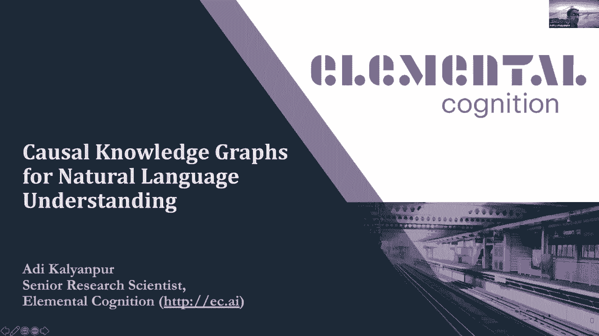
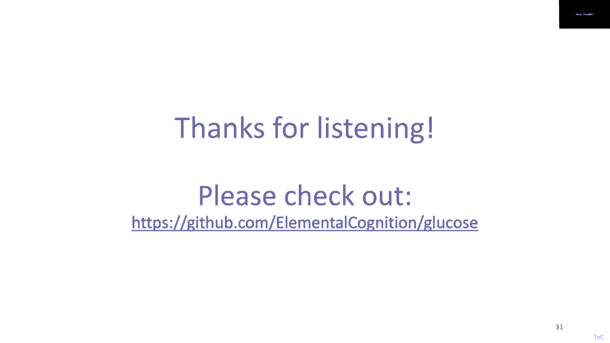

# 【双语字幕+资料下载】斯坦福CS520 ｜ 知识图谱(2021最新·全20讲) - P14：L10.1- 构建用于语言理解的因果知识图谱 - ShowMeAI - BV1hb4y1r7fF

欢迎来到今天的知识图研讨会，我们在课程的第五周，我们的重点是如何从非结构化输入中创建知识图，我们有两位杰出的演讲者和我们一起讨论这个话题，呃，Aditya Kalyanpur博士目前与元素认知。

他以前在IBM研究公司的角色，他帮助创建了在危险游戏中击败人类的计算机程序，他会告诉我们，呃，他是如何使用知识图来理解自然语言的，兰杰·克里希纳博士，他是个刚毕业的博士，他上周刚进行了论文答辩。

他在计算机视觉领域创造了许多有影响力的数据集，包括视觉基因组和行动基因组，他会告诉我们他是如何使用场景图的，呃为了呃，理解图像，呃，所以添加剂，我们将从你开始，所以交给你，非常感谢，谢谢你邀请我。

我只是要分享我的屏幕。

你们能看看幻灯片吗，是呀，好的，我将讨论自然语言理解的因果知识图，然后呃，亚马，元素认知高级研究科学家，这是一家人工智能初创公司，致力于自然语言理解领域。

嗯，让我从NLP中一个非常流行的问题开始，呃，呃，社区，这是叙事理解任务，它的一个特殊变体叫做故事结束，呃，这是2016年发布的岩石故事数据集，所以我不知道你们中有多少人熟悉这个。

但是故事结束的任务很简单，你被赋予了一个特定的故事，比如一个短篇小说，呃，你被要求，你给了这个故事两个潜在的结局，任务是选择什么样的结局，你觉得有道理，鉴于故事的背景，所以这是一项需要常识知识的任务。

因为你必须明白故事中发生了什么情况，然后预测你认为最有可能发生的事情，所以在这个特殊的例子中，你知道吗，吉姆在大学里得到了他的第一张信用卡，他没有工作，所以他用信用卡买了所有的东西，他毕业后。

他欠了一万美元的债，吉姆意识到他真傻，花了那么多钱，所以考虑到这个故事，你觉得接下来会发生什么，吉姆决定设计一个还款计划，或者他决定再开一张信用卡，呃，大多数人，你知道，谁来选这个，这是最有可能的，呃。

似是而非的结局，鉴于这个故事，人类在这项任务中做得非常好，当他们创建这个数据集时，呃，他们确保这两个选择没有任何歧义，百分之百，呃，呃，人类在这项任务上是百分之百准确的。

就像他们都同意什么是正确的结局一样，嗯，然而，对于人工智能系统的机器来说，呃，完成这项任务很有挑战性，当这个出来的时候，准确率大约是百分之六十五，这是一个简单的选择题，有两个选择。

所以随机基线是50%正确的，所以有一个巨大的差距，至少当人工智能系统和人类的能力之间出现时，这是在2016年，从那以后发生了很多事情，所以嗯，你们中那些参与过NLP社区的人都知道这一点，呃。

事情在2017年底和2018年初变得非常有趣，其中一件大事是，呃，这个呃，谷歌研究公司的一篇论文，你只需要注意，它引入了一种叫做变压器的新神经模型，这些又是模型，处理序列的神经模型，嗯。

并与早期的基于序列的模型如递归模型进行比较，神经网络，rnn或lstm，呃，变压器的主要特点是它们的非递归性，所以他们在一个镜头中处理整个文本序列或代币，正因为如此，他们可以更有效地学习。

你可以训练他们，呃，比早期的顺序和递归模型更有效，它有一个围绕注意力的整体特征，这是关于呃的财产，周围的注意力，所以这个想法是所有这些神经模型，他们所做的是，他们正在学习单词或代币的嵌入。

这就是他们如何捕捉这些代币的含义，这个想法是你在为一个特定的任务学习嵌入，我马上就会讨论那个任务是什么，但这里的关键想法是，注意是当您学习令牌的嵌入时，你计算出在那句话中对附近的代币要注意多少。

所以这完全有道理，就像我们分配词义的方式，这完全取决于上下文吗，对呀，你从，呃，从相邻的单词，所以这些模型学到的是，在上下文中给出一个特定的词，我应该对你旁边的话注意多少，嗯，这就是你知道的。

这个基于注意力的功能，你训练它的任务是语言建模任务，所以你的标准语言建模任务是给你一个文本序列，你预测接下来会发生什么，接下来是什么词，这就是这台GPT的训练内容，嗯，还有其他的变体叫做大众语言建模。

其中的想法是给你一个序列，你掩盖一些单词，你拿出一些字，你被要求预测这些词是什么样的，就像填空任务，这就是鸟所做的，所以Bird和GPT One是基于变压器架构的系统。

他们接受了这些语言建模任务或大规模语言建模任务的培训，因为这个架构在学习方面更有效，他们训练得非常，超大数据集，关于Web大小的语料库，这就是我们所说的预先训练的变压器模型，他们受过训练，嗯。

这些大网站为这个LM任务Coruses，他们展示的很酷的事情是一旦你把这些预先训练和转换的模型，然后您可以在其他NLP任务上微调它们，在下游NLP任务上，这些任务可能是任何问题，对常识的回答。

像这样推理，从岩石故事到情感检测，至摘要，暗含，就像你的任何NLP任务一样，只要你有一些训练数据，你可以微调这些基于变压器的模型，实现工匠的状态，嗯，这就像他们展示的食谱，很好地解决了一大堆NLP问题。

尤其是回到摇滚故事，那个呃，使用GPT One，这个模型的精确度，gpt one，微调摇滚故事是86，所以已经比一年前好多了，从那以后发生的事情是，你知道，在各种变压器中充分爆炸，变压器模型。

不同的公司，大学都发布了，嗯，你知道，这些变压器型号的变体，嗯，他们都是基于相似的，关于相似的体系结构和变压器体系结构，它们在几个有趣的方面有所不同，一个是他们在训练前的数据集上训练了什么数据集。

实际的培训前任务是什么，就像，它们都是语言模型的不同变体，通常像Excel Net，嗯，无论如何，重点是他们有不同的架构，就像它们会有不同的层数，呃，向量维数的大小，的，正在学习的向量嵌入。

尺寸不一样等等，嗯，但总的来说，嗯，从概念上来说，他们都非常，你知道相关的，它们都在各种NLP基准上给出了出色的结果，但尽管如此，也发生了，人们开始思考，好的，精细，这些在这些数据集上做得很好。

他们取得了接近人类水平的表现，在一堆不同的NLP数据集上，但他们的弱点是什么，你知道，他们在哪里，这个的极限是什么，特别是，大多数人的两个主要问题，呃找到了，一个是他们，你知道它们本质上是黑匣子。

很难调试出发生了什么，很难解释一个预测，嗯，有一项有趣的研究正在进行，在引擎盖下想象，喜欢关注，地图什么的，但离得到一个，你知道，就像一个合乎逻辑的解释，这些模型不是这样的，这些模型不是这样工作的。

很多时候，当您开始调试它们时，你意识到他们的答案是对的，但出于一个非常错误的原因，好像这真的没有意义，好像捡到了，训练数据中的一些怪癖和训练数据中的某种模式，并且只要测试分布相似，效果很好。

但当你穿越域的那一刻，就像你有一个根据维基百科数据训练的问答系统，你试着把它应用到儿童故事中，他们做得很糟糕，所以他们并不真正理解语言，人类的方式，因为如果人类能，你知道的，理解概念，复杂的概念。

你知道在维基百科中，语言和语义的复杂性，他们应该能在儿童故事上做得很好，对吧，但这些东西根本不是这样工作的，当然，在任务中，他们甚至更，呃，它们一点都不好用，比如如果你有一个QA系统。

你试图将其应用于情绪检测，像这样，你知道它做得不好，这是我们在EC发表的论文之一，我们质疑了，基准是否正确，我们是否测试了正确的指标，所以我们定义了语言理解，呃，我们定义了一组更具挑战性的度量标准。

在某种程度上，这表明了对故事的更深刻理解，我们发现所有这些最先进的，它们非常不需要基于变压器的模型，所以我们在EC的目标是我们想建立，我们想超越这些，我想说浅层文本理解系统，建立一个系统通过构建明确的。

这是关键点，文本背后意义的显式逻辑概念模型，所以就像人类一样，当我们读到一些东西，我们你知道，我们建立一个心智模型，我们把它映射到我们的世界内部模型，我们不断更新，当我们阅读文本时。

所以拥有丰富的内部结构是我们认为需要的，嗯，来解释你是怎么想出一些东西的，我们也认为这是一个合作的过程，就像这样人工智能和人类一起工作来实现共同的理解，所有的交流都是这样运作的，你也知道人与人之间。

所以这就是我们要拍摄的，嗯，所以回到这个，呃，摇滚故事，封闭式测试题，让我们再看看这个，呃，摇滚故事中的另一个例子，让我们想想，你知道，当我们读对这些故事时，人类会做什么，所以这里有一个摇滚故事，其实。

我们在故事里改了名字，我们做了一只佩帕猪只是为了好玩，原来的故事有一个不同的角色名字，但假设这是你的故事，你知道吗，佩帕在骑自行车，一辆车在她前面转弯，她把自行车急转弯，她从自行车上摔下来，擦伤了膝盖。

所以当你读这个故事的时候，你脑子里发生的是，你知道的，你总是，你在构建这个场景的丰富表现，你从你的背景知识中提取信息来丰富这个场景，你一直在问自己，就像，故事中发生了什么，主要人物是什么，嗯。

他们在做什么，他们的动机是什么，为什么事情会发生，你知道丰富的理解是这些模型，这些神经模型有点缺失，比如明确地捕捉它，所以说，比如说，我们可以下意识地做的事情，我们做得很好。

我们可以在故事中形成一个因果链，你知道吗，一辆车在佩帕前面转弯，这可能是她把自行车急转弯的原因，可能导致她从自行车上摔下来，导致她剥了蜂蜜的皮，这可能导致她寻求帮助，对吧。

这是一个在故事中甚至不存在的推论，但我们可以从你知道的，基于常识知识，对呀，我们还可以做的另一件事是跟踪角色，贯穿整个故事的情感和状态，你知道佩珀在摔倒之前最初是在自行车上的，然后她就在地下了。

所以我们也在跟踪位置信息，然后像我说的那样激动，好像你不知道她以前怎么样，但是你，你可能，她可能在摔倒后没有付钱或心烦意乱，所以我们人类很擅长建立这些丰富的情景心智模型，从呃，当我们阅读或处理信息时。

但是人工智能系统在这方面做得很差，为什么会这样，有两个主要原因，一个是他们只是缺乏这种常识知识，你知道的，他们没有，他们甚至没有任何有效的方法来大规模地获得这些常识知识，嗯。

其中大部分都是非常含蓄的东西，这不是你会在语料库中找到的信息，这是我们面临的主要问题之一，如果我们有在书面文本上训练的神经模型，但这些信息是隐含的，信号甚至不在那里让这些模型学习，第二个问题是。

假设你甚至有一些神奇的方法来获得所有这些常识，你有这个问题，你如何有效地将这些知识引入推理系统，嗯，你如何计算出大量常识知识的哪一个子集，与了解特定情况有关，所以有一个，有那种效率，你知道。

可伸缩性问题，从推理的角度来看，所以呃，来解决这个问题，这是工作，我们做了，呃，这是我们想出的这个数据集，叫做葡萄糖，广义的和语境化的故事解释，呃，这是去年在EMNLP发表的一篇论文。

一次最佳论文荣誉奖，目标是解决，你知道吗，这两个问题都是大规模的，我们所有人都做出了巨大的集体努力，在EC和Nasin是这方面的主要作者，那么我们在这里用葡萄糖代替葡萄糖做什么，所以这里的想法是，呃。

我们说过，让我们定义以下问题，你有一个故事，你在那个故事里有一个特别的句子，它通常映射到故事中的一个事件，我们想捕捉因果解释，与X相关的十个不同维度的常识性因果解释，所以前五个维度如下。

比如什么事件直接导致X，这就是因果关系，直接，呃，什么情绪或基本的人类动力激励，所以我们要去，你知道，人类动机信息，呃，知识，呃，什么位置或者这是空间信息，什么位置状态启用x，呃，什么财产使X。

x中涉及的实体是否有其他属性使它成为可能，如需要和要求，等等，然后呃，这是前五个维度，六到十只是这五个的对偶，例如，维度一是事件导致x的原因，六维是由x引起的，所以你可以想到一到五个。

这些维度是在事件发生前暂时发生的，六到十个是暂时的，我们得出了这些尺寸，你知道，通过阅读认知心理学，文学，也是通过，当我谈论这个的时候，通过与用户交谈并找出，因为我们想获得这些知识。

我们想提出外行用户可以轻松理解的维度，所以不能太混乱，这就是为什么我们结合原因和支持，因为最初我们有两个独立的关系，但这似乎让很多用户感到困惑，所以我们就把它们组合起来，这里有一个收集葡萄糖数据的例子。

这些因果规则又回到了胡椒的故事，这就是我们的故事，你知道五句话的故事，这是我们想要收集的信息的句子和焦点，我们想收集这些因果规则，它们有一些结构，你知道，规则有一个前件和一个后件，维度是连接两者的东西。

呃，也通过收集当我们说非结构化的时候，我们在收集你，前件和后件，使用非常简单的句法，呃，主语动词介词短语或主语动词宾语等模板，所以在这个特殊的情况下，对于一维，问题是什么事件导致佩珀把她的自行车。

你知道有人可能会说，在她前面转弯的汽车是导致她骑自行车的原因，所以这就像一个非常简单的半结构化，因为你知道这里有语法信息，在这个故事的背景下，这个维度的因果规则，所以这个背景化的和非常具体的规则同时。

我们也在收集一般规则，所以我们想超越这个特定规则中的特定实体，像汽车，胡椒和自行车，我们想要一些稍微一般的东西，比如，如果有人，如果某物在某物前面转弯，那是一辆车，那么也许这会导致有人远离它。

一次又一次，这些规则不一定要完美，它们是高度语境化的，一个稍微好一点的一般规则是针对第二维度的，在哪里，如果有人想要安全，可能会让它们远离危险的东西，嗯，所以是的。

所以我们沿着这些不同的维度收集这些特定的和一般的规则，这里有一个有趣的，如果某人接近某物，使某人能够远离某物，所以这是如此含蓄的东西，你不会在Corus中找到这个，对呀，人们不会写这样的东西，就像。

为了远离某件事，你需要靠近它，嗯，我们说的是身体上的移动，你知道，所以这里也有感觉信息，嗯，你知道，在本例中的剩余维度中，什么占有信息，呃，使这口井，她拥有一辆自行车的事实，允许她把它。

在你把一个物体变成一个物体之前，你需要拥有它，呃，在对对象执行操作之前，在这个特殊的情况下，第五维度是不适用的，嗯，所以这里的重点是，呃，如果你退一步想想我们在做什么，呃。

葡萄糖是什么抓住了这些微小的因果理论，关于一个给定的故事和故事中发生的事件，这些因果理论在跟踪状态，动机，嗯等等，受到你知道的启发，人类心理学，如果你能大规模收集这些，现在你就有了一个，你知道的。

这些迷你因果理论的图书馆，也许你可以做一些有趣的常识，用推理，现在问题是好的，我们已经定义了这个问题，收集数据会很好，呃，正如我们所知道的，正如我们所定义的，这些基于特定背景的具体规则和一般规则。

问题是我们如何大规模地收集这些数据，所以我们所做的是，我们想出了一个非常有效的多阶段众包平台，呃，我们把这个部署在机械扭矩上，我们做了我想了六轮试点研究来想出一个用户界面，人群圈很容易接近的。

和三个主要步骤，首先是获得资格，ui，所以这里我们有同样的任务，我们给了他们一个故事和一个突出的句子，我们问他们，呃，这些因果解释，除了这里我们是多项选择，所以我们没有这个开放式的，因为我们必须。

你知道的，确保我们知道正确答案是什么，这样我们就可以，这就像是资格考试，只有他们在资格考试中的成绩超过90%，或者他们甚至选择了主要任务，所以这是你实际上收集的主要任务，你知道的，开放式解释，嗯。

你又知道了，同样的问题故事，呃问题，然后你有十个不同的维度，我们正在收集这些具体的和一般的规则，最后，在我们收集到这些信息后，我们有了一个审查审查仪表板，所以我们有自己的审稿人，呃，呃，我们的一个，呃。

ec，内部，呃，乡亲们是一个评论者，他会给这些中的每一个打分，嗯，呃，按从零到三的比例提交的报告，也给托罗斯反馈，他们会用它来变得更好，因此，通过众包和运行实验的过程，我们有一个专门的出口Toko的池。

非常精通这项任务，它可以为这项任务提供非常高质量的注释，然后你有一些我们得到的东西的例子，比如数据，我们收集了某人给某人的东西，它导致有人再次拥有它，非常基本的内隐知识，嗯，下面是一些其他的例子。

如果有人不小心，然后他们忘记了一些东西，呃，如果你忘了什么，它可能会导致一些东西被留在某个地方，如果你累了，你知道你可能会感到困倦，等等，嗯，我们收集了大约62万条推理规则，你知道四千七百个故事。

你知道，但是372名参与者，嗯，他们又花了，你知道平均每次任务不到五分钟，呃，还不错，考虑到这项任务在认知上的挑战性，嗯，据我们所知，你知道，这是少数几个真正具有认知挑战性的任务之一，在这个尺度上。

然后我们收集这些数据后做的另一件事，就像我们说的，好的，你知道，我们想确保我们想把它与其他现有的常识进行比较，呃，知识库，我们的两个，呃，公开提供的，一个是概念网，另一个是原子的，在论文中。

我们有详细的细节，我们是如何测量这种重叠的，我们绘制了关系图，我们将十个葡萄糖维度映射到原子的概念关系，然后我们有一个非常宽松的模糊文本匹配功能来寻找相似的，嗯，这些关系或规则的实例，尽管如此。

我们发现像葡萄糖这样的重叠很少，真的捕捉到了很多新的信息，而这些信息是在这些退出的来源中没有的，所以好吧，我们已经收集了数据，但是现在我们如何将这些纳入这些数据，将这一知识转化为最先进的系统，AI系统。

这里的景色是，我们不想要一个静态的规则知识库，我们想要更有活力的东西，所以我们所做的是，我们说过，让我们用，你知道这些神经模型，基于变压器的模型，让我们把这个问题框定为一个机器学习问题。

它给出了一个故事和一个句子，这十个维度中的一个预测了特定和一般的规则，这是我们设置的一个任务，对于测试集，我们基于看不见的故事创建了一个W测试集，那个，呃，你知道的，我们拿了前三名的注释器，我们有。

只有在他们达成高度一致的情况下，我们是不是，你知道，把这个包括在测试集中，因此，由于这种精心设计，这个测试我有大约500个葡萄糖故事句子对，每一个都有一到五个维度，回答并注意并非所有维度都必须回答。

就像他们中的一些人，只是不适用于故事的上下文，我们有两个不同的评估指标，一个是呃，自动，我们用蓝色，呃或神圣，蓝色的，嗯，呃，这个呃，你知道的，只是文本相似性的函数，但是因为这项任务有太多的差异。

你知道你总是可以产生一个规则，意思是同样的事情，但是用了不同的词，最后我们说我们还必须进行人类评估，因此，我们有三位人类专家，对模型的结果进行评分，然后我们取三个的平均值，然后耶，所以对于人类的评价。

我们给他们，你知道的，这个的UI，呃和喜欢，我说，我们收集了零到三利克特等级的收视率，所以零是完全不正确的，规则真的很糟糕，几乎不正确是一个，几乎正确是两个，完全正确的是三个，所以现在是结果，所以呃。

我们有两个基线，A K N模型，K最近邻模型，所以在这个模型中，基本上你有你的火车集只是存储在内存或数据库中，然后在测试时间给出一个故事，一个句子和一个维度，你发现你有一个相似函数。

在那个维度上找到那个故事中最相似的故事和事件，然后你预测火车集合中存在的任何规则，这只对一般规则有意义，基于方法的具体规则是没有意义的，嗯，它做得很差，所以你知道，三分之五，一次又一次。

这些分数是三个人类注释器，根据我们对土耳其人的评分，我们有最好的注释者，然后三个收视率的平均值，gpt do模型是这里的标准基线，所以你拿一个像GPT 2这样的语言模型，我们把它作为输入，这个故事。

我们重复了这句话，然后我们为关系添加了一些触发词，所以如果是因果关系，你可以加一个填充物之类的词，例如：由于……，等等，然后我们提示模型正确地填写其余的内容，预测规则的其余部分，同样。

我们这样做只是为了特定的规则，所以这是相反的，我们对这个一般规则没有意义，因为GPT 2没有接受过训练，有一些人X和人Y的规则，所以公平地说，GPT二，我们只评估了特定的规则，但它做得很差。

然后火车模型，所以这是把GPT带到完整的地方LM是把GPT带到第二个地方，现在为葡萄糖任务调整它，如此美好，根据葡萄糖训练数据调整它，这个模型做得更好，一个更好的变体实际上是不使用语言建模架构。

我们使用编码器解码器体系结构，所以我们使用谷歌的T5模型，我们相信我们的假设这更适合这个问题，因为在这里你有，你知道的，在这个架构中，您有一个清晰的输入序列和输出序列的分离，这里的输入是，你知道。

您的上下文，你的故事，你的句子和你的维度，输出是规则，你知道一般规则的具体规则，我们有两个独立的模型，嗯，结果非常好实际上在这个测试中，这还是很少的数据，很接近人类的表演，嗯，你知道的，很明显。

这是一个小测试集，它是，你知道，双重变化，所以嗯，这是非常干净的测试集，嗯，但令人惊讶的是，这些模型可以很好地工作，即使是在这个非常有挑战性的任务中，生产，你知道的，飞行中的常识规则。

这是在看不见的故事上，对吧，测试装置与列车没有重叠，所以结论是，你知道，CNN模型表现最差，呃，这有点道理，你知道吗，它强调了超越训练集的泛化的重要性，这也不足为奇，因为你知道这些模特是怎么训练的。

这些预先训练的语言模型，所以就从盒子里出来，GPT二号，我们甚至试了五号，他们只是做得很差，因为这项任务，他们没有，你知道的，仅仅因为他们缺乏这些常识知识，这些知识是非常含蓄的，在，你知道在语料库里。

但是呃，当你拿着这些预先训练的模型，你在高质量的常识规则上微调它，那么即使对于这项极具挑战性的常识推理任务，你仍然可以在看不见的数据上得到很好的结果，所以这是一个很好的结果，嗯。

所以一些使用各种模型的例子预测，所以这里有一个故事，这其实是一个摇滚摇滚的故事，呃，凯伦做了一个面板千层面，她把它带到派对上，把它带到派对上，没人想吃千层面，凯伦，吃一个星期，她厌倦了千层面。

不是最有趣的故事，但是呃，所以就预测而言，呃，我们记得这里的维度是三，那么启用了什么位置，X和X是故事的第一句，所以呃，返回一个模型，你知道她在电视机前，使凯伦做了一个面板千层面，1。

你能猜出是哪一位吗？这是这是GPT 2，这是有道理的，如果你给出了这些模型是如何训练的，就像耶，这是高度相关的，我肯定我有短信提到，嗯，你知道，在电视旁做食物或吃食物，但这不是真正正确的因果原因。

或者使它不能使如何烹饪，语言模型，完整的LM，基本上是GPT二，在葡萄糖数据上训练得更好，你知道吗，凯伦在家，使她能够做一个千层面，编码器解码器已经得到了正确的，在这种情况下，你知道她在厨房，呃。

人类也是这么说的，对，如果你在，这就是你能做食物的原因，就是在厨房里，呃，那是实现这一点的位置，嗯，另一个例子是六维，呃，那么这是什么原因呢，这样做的后遗症是什么，然后编码器解码器模型也不太远。

就像你知道的，她做了SaaS的一部分，可能是她吃了一个星期的原因，那是在故事里，嗯，一般规则稍微好一点，如果你做食物，你知道它能让你吃它，人类是，你知道，这里稍微好一点，有人准备了一些东西，呃。

是她带着它去参加活动的原因，呃，这里有另一个故事，这其实是一个幼儿园的故事，这不是岩石上的，但只是给你一个例子，呃，你可以从这些模型中获得的知识，汤姆上课时饿了，他从背包里拿出一个苹果，他吃了一些。

味道不好等等，嗯，这里的焦点句子是，他从背包里拿出一个苹果，如果你运行我们最好的模型，编码器解码器模型，UM对葡萄糖数据进行了训练，如果你现在把它应用在这里，这不是摇滚故事，这是，呃。

你知道一个不同的故事，呃，你得到这样的预测，所以之前的尺寸，一至四，汤姆上课时很饿，这可能就是，呃导致他得到了一个苹果，呃，他觉得饿了，这就是他在背包附近的感觉，是什么让他从背包里拿起苹果。

他必须拥有背包才能得到它，然后他吃了一些，呃，你知道吗，因为这就是他得到的，他想吃，可能会很高兴他的位置可能在学校里，现在他拥有了苹果，因为你知道这是他从背包里拿的，所以再一次，你知道的。

非常基本的常识，含蓄的东西，但很好，你有一个模型可以在飞行中生产这个，在一个甚至不是来自同一发行版的故事上，就像火车一样，就是摇滚故事，好的，所以这是一个假设，我们验证了我是如何按时完成的，差不多了。

好的，嗯，就是呃，你知道的，给机器常识的一个有希望的食谱是首先收集高质量的，来自人群的知识，我们证明了有办法做到这一点，然后将其用作种子数据，找到你的神经模型，所以新奇并不好，其他人也是这么做的，只是。

事实是，我们表明，即使是一个开放的任务，与常识推理一样多的差异，并在上下文中产生常识性规则，你可以让这些神经模型做得很好，如果您收集高质量的数据并对其进行微调，有趣的是，从知识表示和推理的角度来看。

这种观点的变化，所以我最初的背景实际上是形式逻辑，我搬到了NLP，但回到形式逻辑空间，您对知识库有一个非常静态的视图，你知道的，您的知识库是一组固定的规则，您必须对其进行编码，在交给你之前。

把它交给你的推理引擎，你知道我们有一个非常不同的观点，你有一个动态的知识库，你知道你有一个，您有一个函数或模型可以为您动态生成规则，问题是你能把它插入推理引擎吗，这是这里的最后一部分。

就是给大家看完整的一块，好的，我们有这个，嗯，可以为您生成规则的模型，呃，在飞行中，并为您提供具体的和一般的规则，问题是你如何使用它，嗯，在欧共体，我们建立了自己的神经象征性原因，不叫辫子和品种，呃。

你知道它有基础和逻辑编程，开场白和答案集编程，asp，你们中的一些人知道，你知道雷达的主要特征，就像所有其他逻辑推理系统一样，它可以为你的答案提供一个证明或解释，它可以根据各种指标对这些解释进行排名。

就像这有多可信，其中一个关键呃，显著的特点是，统计函数与符号推理器的集成，做统一或匹配之类的事情，呃，所以我们可以做模糊或弱统一，然后呃，与这次谈话有关，它有一种方法可以动态地插入规则。

所以动态规则生成，嗯，它有支持，还有很多其他功能有向前和向后，链或约束，软件等，嗯和他们在这篇论文中的细节，如果你想了解更多，但这次演讲的重点是，当推理者在寻找答案时，它正在探索它的证明空间，呃。

这是搜索空间，嗯，它是通过查阅规则的静态知识库来做到这一点的，这是大多数推理者的工作方式，而且还通过查阅动态规则生成模型，我们可以这样插进去，这个基于葡萄糖数据训练的模型，现在它会为你生成规则，嗯。

在推理过程中填补空白，这里有一个我们使用这个的例子，嗯，这是另一个幼儿园的故事，呃，费尔南多去卖植物，他喜欢树叶的薄荷味，他买了一株植物，把它放在窗边，问题是费尔南多为什么要买薄荷植物。

这是一个非常简单的问题，但是许多最先进的QA系统，就像小队制度一样，当我们试图问这个问题时，它做得真的很糟糕，嗯，这些是我们从故事中提取的事实，现在使用我们的NLP系统已经完成了。

我们在DC有一个最先进的语义解析系统，所以这就引出了这些事实，但有很长的，故事中这些明确的事实之间有很大的差距，最重要的目标是费尔南多购买植物的动机，我们连接点的方式是我们有规则。

其中一些规则是手动编码的，但极其笼统，适用于所有领域的高度基本的规则，所以我们称之为核心理论规则，比如，如果一个对象有一个部分，而该部分有一个属性，那么对象可能有一个属性，所以在这种情况下，植物有叶子。

然后呃，在这种情况下，植物有叶子，叶子有薄荷味，所以呃，你可能会推断这些植物有薄荷味，然后我们从动态规则生成模型中得到这个规则，所以这来自对葡萄糖数据训练的模型，呃，你知道吗。

如果一个代理人喜欢某物的属性，他们可能会再次喜欢这件事本身，非常含蓄的规则，呃，所以在这种情况下植物有薄荷味，费尔南多喜欢树叶的薄荷味，所以也许这就是他喜欢这种植物的原因，最后。

完成整个链的另一个动态生成的规则是，如果一个人喜欢某样东西，他们就会有购买的动机，所以也许我们知道他买了植物，故事是这么说的，所以我们可以利用这一点，也许这就是为什么他，嗯，你知道吗，他喜欢这种植物。

也许这就是他买它的动机，所以我们对这个答案做出了丰富的解释，呃，我们可以，嗯，呃，你知道的，我们可以提供不像，你知道的，端到端深度学习系统，这些规则不需要事先编码，嗯甚至这个规则，尽管它被编码为。

我说这是非常笼统的，它跨越，嗯，大多数域，但我们也可以考虑在葡萄糖中获得这种知识的规则，只是碰巧，这不是我们现在在葡萄糖中的维度之一，但你可以看到这样的技术的潜力，你真的可以超越，嗯，你知道的。

具有静态知识库，并在符号原因中插入统计规则生成函数，否，最后像那样持续下去，我们只有几分钟，好的，所以我要跳过这个，就像论文上的结果一样，回到摇滚故事，我们将编织与UM动态规则生成模型一起使用。

我们得到了最接近艺术状态的表演，所以现在记住我告诉过你65，四年前，已经是九十年代了，现在是九十，我们很接近了，但与其他不同的是，你知道，基于黑盒的DL解决方案，我们也可以给你一个基于框架的解释。

细节在报纸上，所以总结一下，我们基本上展示了三件事，一个，从人群中收集高质量的常识和因果知识是可能的，嗯从人群工作人员，呃，如果你设计，你知道合适的型号，呃，工具和UIS第二。

动态规则生成的一个有趣的食谱，就是收集这个半结构化的推理规则，然后微调你的模型，现在你有了一个不再是静态规则的KB，您有一个动态规则模型，最后，您可以将这些动态生成的规则，把它们插进神经符号，拜托了。

否，嗯，或者做，你知道回答问题，现在你要解决的是，两种传统KR系统的缺点，你有一个非常精确的问题，脆脆的，呃他们呃，你有知识获取的问题，你将从那里获得规则，端到端模型的众所周知的缺点是。

你不能像这样解释自己，你如何得出这个答案的合乎逻辑的解释是什么？所以这种地址，两个都是就是这样，谢谢很好很好，呃。

当天的介绍，所以不要再拖延了，让我们呃，继续呃。