# 【双语字幕+资料下载】斯坦福CS520 ｜ 知识图谱(2021最新·全20讲) - P15：L10.2- 可用于图像理解的场景图谱 - ShowMeAI - BV1hb4y1r7fF

耐心，这样我们在最后还有时间提问，兰杰，请交给你，给我一秒钟，好的，只是检查一下，每个人都可以看到我的幻灯片，是的，看起来不错，好的，伟大，所以谢谢你邀请我，我在这里告诉你我们如何设计计算机视觉模型。

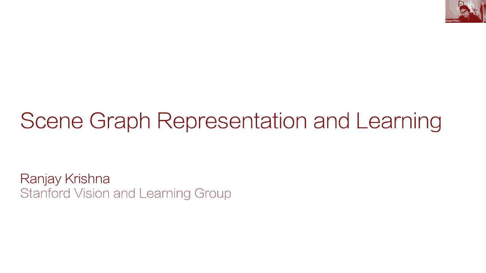

使用类似知识图的表示，所以尽管计算机视觉在识别物体方面做得很好，你一定通过imagenet听说了所有的改进，我们的世界不仅仅是这些物体的集合，我们的世界是丰富的，它生机勃勃。

人们不断地用新的表演给我们惊喜，它们为新的用例重新使用项目，他们发现自己陷入了困境。

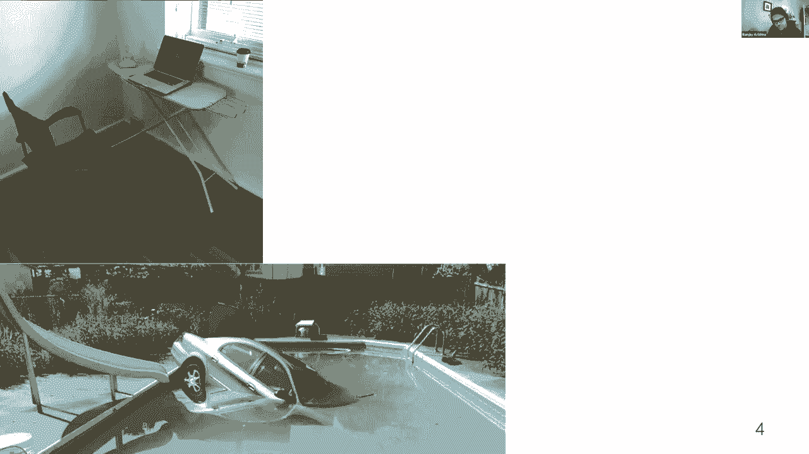

他们从没想过他们会，他们甚至开始以我们从未见过的方式使用设备，以一种我们可能从未想象过的方式，甚至动物的时尚感也让我们惊讶，以及他们意想不到的代理，现在我们在世界上遇到的这些新情况，它们很平常，呃。

我们可以对这些进行解释和推理，呃，相对轻松，一点问题都没有，然而，尽管十年来取得了惊人的进步，为当今视觉技术提供动力的深度学习模型，他们真的很难理解视觉世界，和以前的工作已经注意到很多次。

当视觉模型看到新奇的构图时，他们很难概括，他们可能已经单独看到的概念，比如说，即使他们见过消防栓和人的例子，这些模型最终学会了如何欺骗和忽略图像的整个区域，在做预测的时候，他们最终预测这里的一个人。

比如说，是坐在椅子上而不是坐在消防栓上，他们犯这些错误是因为他们继承了数据中的偏见，因为大多数人坐着的例子都是，呃，坐在椅子上，嗯。

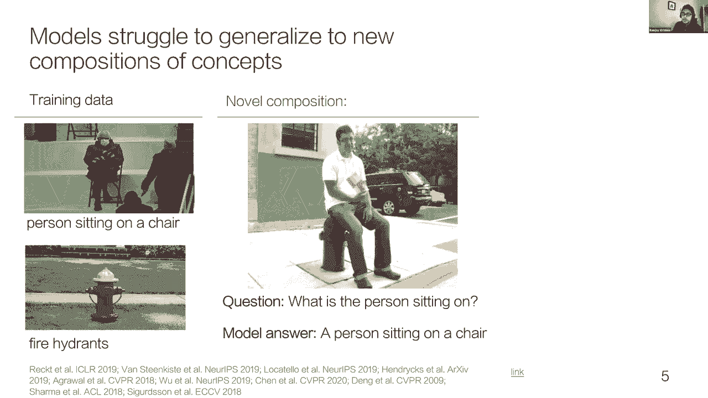

事实上，甚至OpenAI发布的最新的120亿个参数模型，一月早些时候，这些你最终使用超过4亿个训练数据点，这些模型仍然一般，呃，不能概括为这些新颖的作品，所以这整个问题更多的是一个代表性问题。

不一定只是数据问题，现在我们知道，相比之下，人类认知可以构造无限多的，从先前看到的有限概念集合中产生的无限多的表示，人类利用他们过去的经验归纳地发展了这个世界的组成模型。

这让我们能够欣赏新情况快速学习新任务，所以让人类拥有视觉智能是一个具有挑战性的问题，它将要求我们从根本上修改，计算机视觉对，对大多数任务只使用对象表示，如此受人类学习的启发。

今天我要告诉你们我的一些研究，嗯正试图远离，思考物体并开发视觉智能或计算机视觉模型，嗯，利用人类认知的思想，现在，我在这里的主要目标是向你展示我们可以让特工，推广到新颖的作品。

在他们的训练数据中完全没有，所以在今天的谈话中，我将探索如何设计这些模型，呃，推广到新颖的作品，我要开始了，我将从比德曼种子感知模型开始，杰里米·沃尔夫的视觉记忆与认知科学模型，设计一种新的视觉表示。

然后我会用正确的表示给你看，我现在的研究，使之成为可能，让模型从训练数据中概述的有限一组情况中学习，并允许这些模型推广和识别全新的情况，作为这些以前看到的概念的组成，所以今天我首先介绍场景图。

就是这种密集的构图通用视觉智能表示，然后用场景图，我会设计更善于识别新奇作品的模型，最后我们用这些，呃，场景图，以实现整个下游计算机视觉任务，只有五个训练例子，好的，所以让我们开始吧。

所以占主导地位的范式，呃，今天训练计算机视觉模型的方法是预先训练这些大型，大量Web脚本数据上的潜在表示，或在ImageNet的大数据集上预先训练对象表示，然后后来。

将这些学习到的表示应用于您可能想要的任何类型的下游任务，呃，比如图像字幕或视觉问答，或者你现在有什么，不幸的是，这些潜在的或对象的表示往往难以概括，他们喜欢，我说。

学习这些快捷方式并忽略视觉输入的整个区域，呃，如果他们能在数据集上最大化性能，因为这些习得的表征最终变得不完整，最终使用这些表示的下游模型需要更多的数据，呃，实现任何合理的性能，所以我们的主要见解，呃。

将是一种新的表示，我们将称之为场景图，我会证明，场景图上预先训练的模型将帮助模型推广到完全新颖的构图，就像一个人坐在消防栓上，比如说，因为这种表示以构图的方式捕捉了更多的信息。

下游模型将需要更少的训练示例，以便获得任何合理的性能。

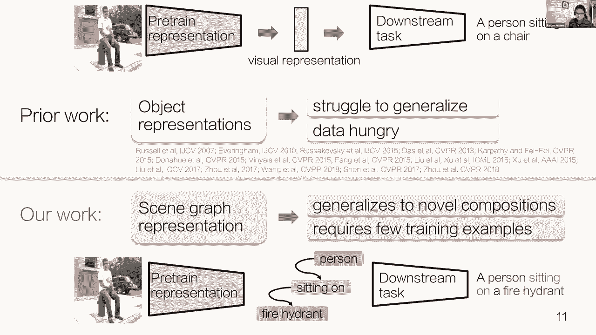

好的，所以首先，让我们开始思考我们如何设计以查看图形表示，所以让我先把背景化，为什么对象表示是计算机视觉中最常见的预训练形式，不足以完成各种下游任务，现在，让我们看看这两张图片。

物体特征或物体检测会告诉你这些图像中有两个人，它甚至会告诉你他们现在在哪里，知道这些信息，可能会让我们相信这两个图像可能包含相似的语义内容，但有时相同的目标检测特征，呃可能会有非常不同的解释，比如说。

在一张照片中，我们看到一个人愤怒地对另一个人大喊大叫，在另一张照片中我们看到一个人在关注另一个人，因此，当我们将这些对象表示用于下游任务时，难怪这些模型很难概括，为什么他们需要这么多的数据，呃。

启用字幕等任务，但这就引出了一个后续问题，什么是好的视觉表现，现在，我们从人类的视觉中知道，呃，人们真的适应了新奇的作品，所以为了建立视觉智能的表示，嗯，我们转向计算，神经科学与心理学。

希望为人们如何处理视觉刺激找到灵感，现在回到80年代，欧文·比德曼，后来在90年代又是杰里米·沃尔夫，他们在探索这个问题，当然还有，他们绝不是唯一探索这个问题的人，呃。

biederman从他的实验中得出结论，除了对物体和场景进行分类之外，人们同时处理属性，然后呃，它们是对象的属性，以及，嗯，同时处理这些对象之间的关系，这些关系就像，就像人们的互动，呃，周围有物体。

现在将违规行为归因于第一个图像中的人是透明的，或者违反关系，比如邮箱顶部的消防栓，这些侵犯行为减缓了，他的测试对象对物体进行分类的能力，他从实验中得出结论，物体处理的减慢。

可能意味着我们正在并行处理与对象的属性和关系，从而干扰了我们理解图像中存在哪些物体的能力。

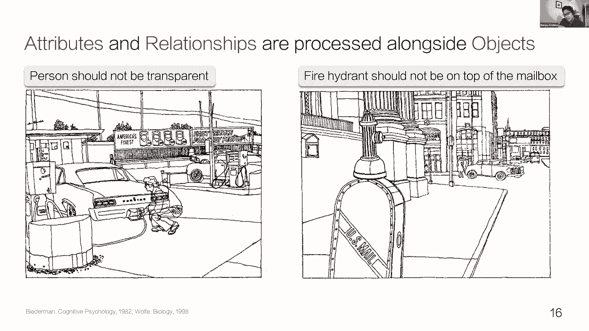

和一组类似的人类记忆实验，再次，来自杰里米，沃尔夫还得出结论，物体不足以解释人类的视觉表征，他还说了一些非常相似的话，我们必须编码这些对象之间的关系或相互作用，呃，与物体识别并行。

现在通过几十年的多项研究注意到了人类认知的基础，我们设计了一种新的视觉表示，我们称之为场景图，场景图表示对每一张图像进行编码，作为一组作为边界框接地的对象，这些框中的每一个都与属性相关联，呃。

对于每一个单独的物体，描述了这些物体的不同类型的特征，它们也通过关系相互联系，这只是一个小图表，解释了图像的一小部分，并真正研究场景图的效果，我们开始了一个叫做视觉基因组项目的项目。

它旨在用种子图绘制视觉世界，这是视觉基因组计划的真实场景图，呃，我们最终注释了一个相当大的数据集，呃，研究在各种计算机视觉测试中使用种子图的效用。

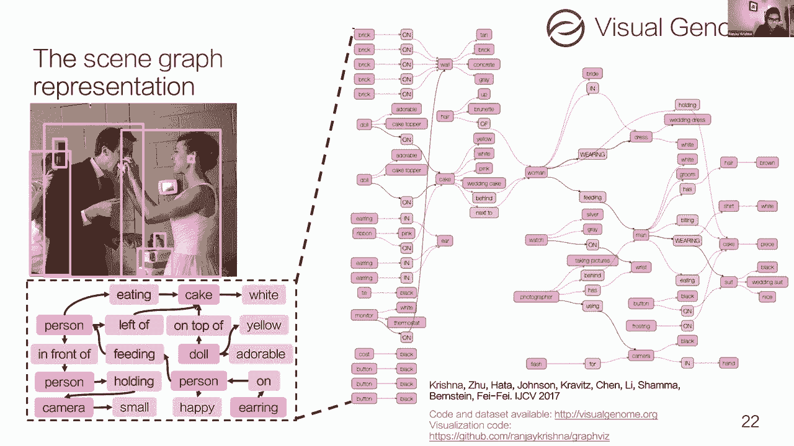

好的，所以我们已经看到了图表设计和收集的数据集，我们开始训练模型来预测场景图，当我们发现这些场景图是，事实上，更善于概括新颖的作品，然而用这些模型来预测这些场景图是一个相当困难的挑战。

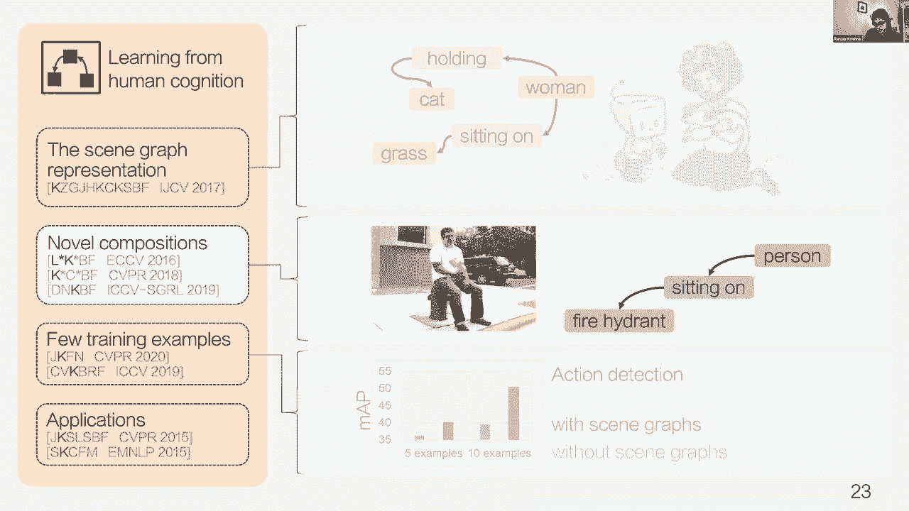

呃，所以让我如此正式地解释一下这个挑战是什么，我们可以训练场景图模型，嗯，期望图像作为输入，并使用图像中检测到的对象生成图形结构，具有与每个单个对象相关联的属性以及成对对象之间的关系，在我剩下的演讲中。

我会，呃，我将忽略属性，因为它们可以与对象非常相似地建模，嗯，相反，我将专注于对象和关系之间的结构化预测任务，所以在这里我们想检测这个人，帽子，田野，马，作为图像中不同种类的物体。

我们希望能够分类成对物体之间的关系，比如说，我们可能想说，人和马之间的关系是站在，因为那个人站在马上。

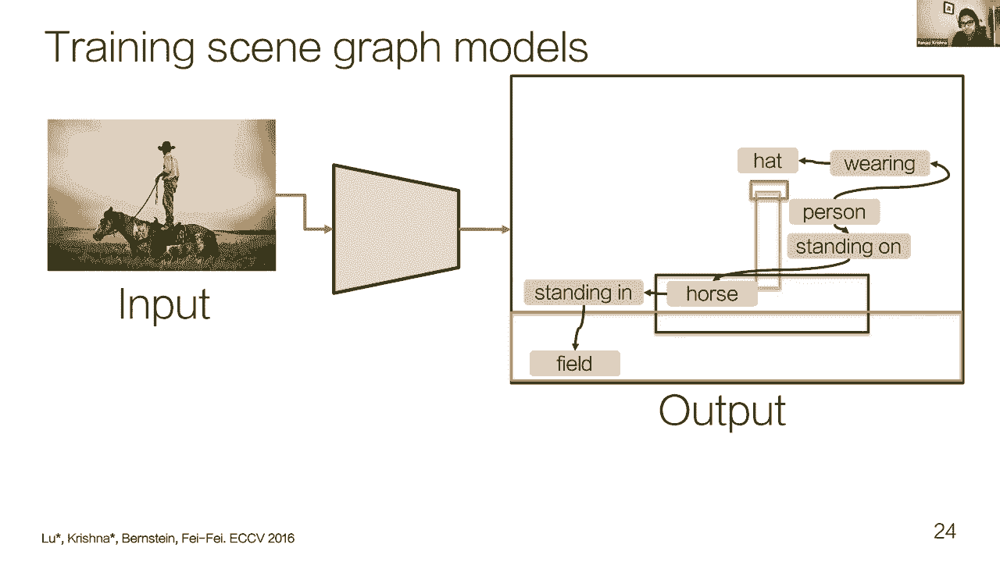

现在，是什么让场景图预测如此困难，是它的长尾分布，即使是一对物体之间的关系，现在有十几种方式可以让人和马互动，嗯，一些互动，比如骑马，只是更常见，嗯比那些像站在马上。

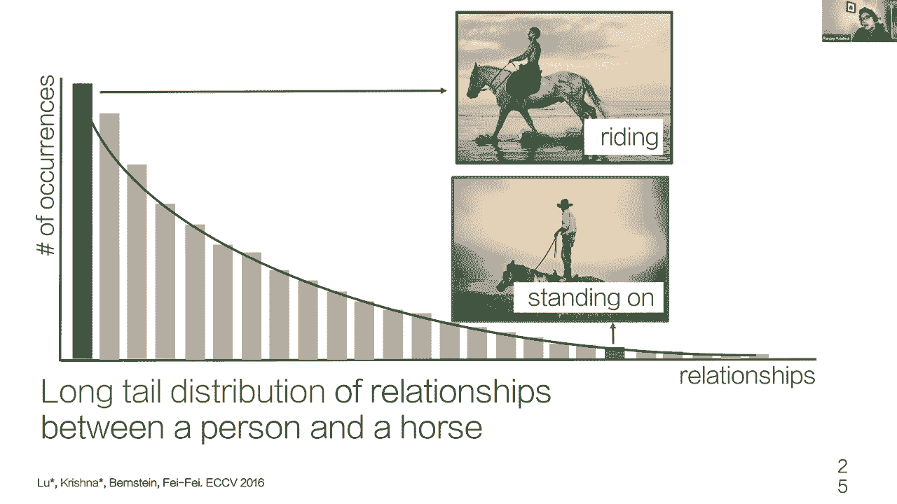

所以把这两个物体在它们的关系中的每一个组合作为一个单独的范畴，更精确地导致可能类别数量的二次增加，如果我们有n个对象类别和k个关系类型，我们需要建立n的平方，k产出类别数。

因为这些组合中的大多数只有几个训练例子，这些模型最终预测了最常见的组合，也就是骑马的人忽略了那些不太频繁的人，就像站在马上的人，所以为了防止这种过度拟合，我们分解问题，而不是预测物体和关系在一起。

我们预测的对象独立于关系，所以这些关系现在直接从图像特征中预测出来，不与物体一起预测，现在，我们的分解是一个，是比德曼结论的结果，即人类的视觉，呃，可视化处理与对象并行处理关系，同样地。

我们的模型现在也使用一个单独的分支来处理独立于对象的关系，除了认知基础，这种分解也缓解了我们的长尾问题，因为即使一个人站在马上，它在我们的数据集中很少发生，物体探测器会看到足够多的人的例子。

在各种不同的背景下看到了足够多的马的例子，在那里他们可以理解和识别这些物体，同样地关系探测器也会看到足够多的物体站在其他物体上的例子，这样它也可以适当地预测正确的关系，一旦这些关系和对象被独立预测。

我们可以用叉积把这些单独的预测组合起来，通过做一个天真的贝叶斯假设，并产生这种n平方乘以k的预测数，但现在我们只需要n加k个类别数。

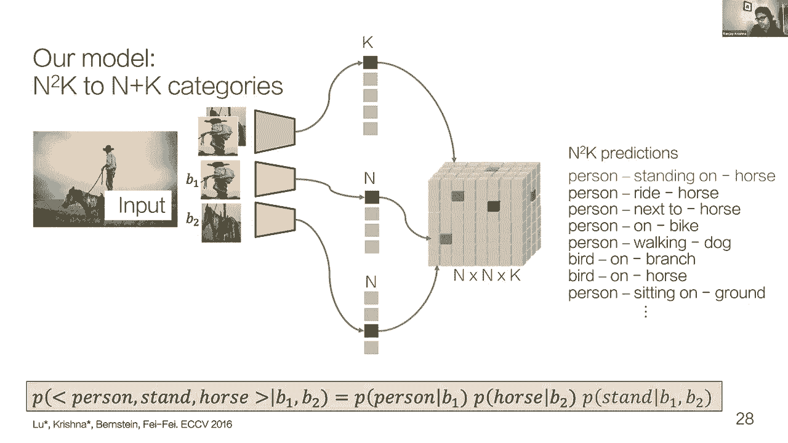

呃，训练我们的模型，所以有了这个新的配方，将视觉处理分解为其单独的对象和关系分支，这现在允许我们的模型推广到完全新颖的组合，呃，他们可能单独看到的概念，例如，通过看骑马的人和戴帽子的人的例子。

我们现在可以把这些单独的碎片放在一起，我们的模型现在可以概括和预测马什么时候戴帽子，这是一个组合的例子，在它的训练数据中完全没有，同样，当然啦，回到示例，我们从呃开始。

通过观察人们坐在椅子上和地上消防栓上的例子。

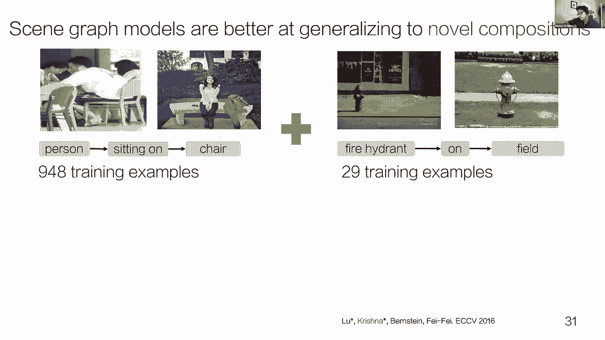

我们现在可以再次从这些其他训练例子中提取这些单独的片段，然后将它们结合起来预测一个人何时再次坐在消防栓上，其训练数据中完全缺失的示例，但我们的模型现在可以预测，我们的模型能够改善呃，平均精度超过，呃。

通过大约三个x来检测对象和关系，与使用对象特征训练的变体相比，相似的关系，虽然这个结果令人鼓舞，我们想看看我们是否能把这场表演推得更远，所以我们开始分析常见的错误来源。

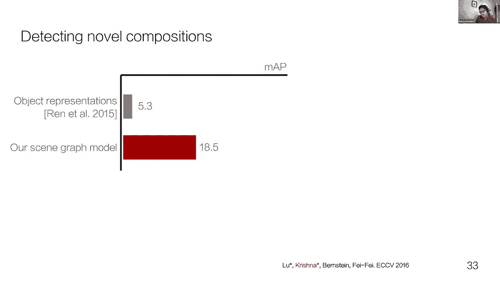

我们发现了一种不断出现的错误，所以让我们考虑一下这个图像，所以我们的模型看着这张图像，并预测两个人都在扔飞盘，它没有任何更高阶的推理，呃，如果一个人在扔飞盘，那么第二个人不可能扔出同样的自由速度，而是。

第二个人一定是想抓住飞盘，或者伸手去拿飞盘什么的，发生此错误是因为关系预测是以前馈方式进行的，和所有其他的，呃，它现在试图做出的预测，再次形成对比，我们从人类的视觉中知道，我们的处理充满了反馈联系。

在那里我们分享信息并纠正这些不正确的预测，嗯，并做出更全面连贯的预测，所以同样，我们可以改进这些，呃，使用类似机制的模型。

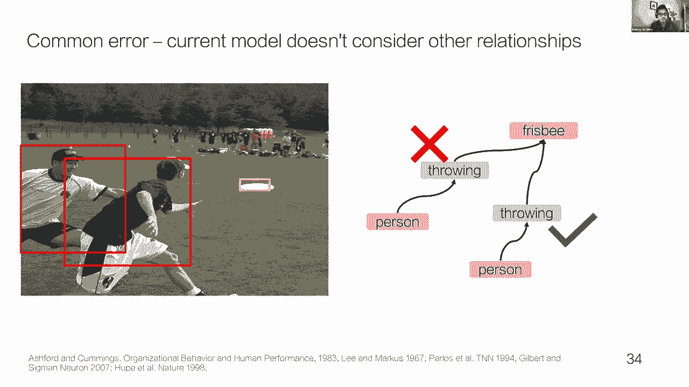

我们开始探索我们可以做到这一点的方法，我们开发了一种方法，嗯，做这种更高层次的推理，我们用一个新的图卷积层扩展了我们的原始模型，在我们的工作中，我们将传统的图卷积公式扩展到三维可视化表示上。

在两种特殊的节点上，对象节点和关系节点，现在对象节点，他们学习一个我们参数化的函数，使用小型卷积神经网络，从它所连接的关系中传递信息，同样，关系节点也在学习合并信息，从它连接到的两个对象节点，和。

通过迭代更新对象节点和关系节点，经过多次迭代，我们可以有效地在整个图形中传递信息，最后，当我们的模型从这些单独的节点做出预测时，关系，它现在可以拥有所有必要的信息来做出正确的预测。

第二个人不是也在扔飞盘，和图的卷积，我们能够在我们的表演中增加另外五个平均精度点，现在，除了数量上的改进，将这些关系建模为这些类型的函数，这些函数转换我们对对象和关系的表示。

这也允许我们开发上下文对象表示，就像自然语言处理中的上下文词表示已经变得非常非常流行，就像你可以对这些单词表示进行地震操作一样，我们现在可以使用上下文化的对象表示来执行相同类型的表示，不像单词表示。

转换可以是算术的，我们的操作是由关系在这些对象上执行的转换定义的，比如说，我们现在可以应用饮食转变，嗯，人集群上的关系，通过应用这种转变，我们可以，我们现在到了食物，像披萨和冰淇淋这样的商品的分类位置。

和面条共存，你也可以在左上角看到，有一堆东西可以写作，不像语义编码会把马和滑雪板分开很远，而是因为这两种类型的对象提供了相同的关系，即写作，他们现在靠得更近了，在某些维度上，这允许我们使用书写转换。

并得到这些基于启示的表示，有这种上下文化的对象表示的好处是什么，我们现在可以训练，用很少的训练示例识别新关系和新对象的模型，比如说，仅举一个从图像中提取关系的例子，一个人拿起汉堡。

这个模型现在可以了解到妇女和儿童也可以选择其他食物，因为它知道汉堡是可以拿起来的东西，所以说，因此，其他食物也可以拿起，因为一个男人可以把它捡起来，一个女人和一个孩子也可以把它捡起来。

所以它正在学习使这些联想，因为这种上下文化的表示是建立在，没有图的卷积，当然啦，只是我们可以使用的许多潜在框架之一，对图像中的关系产生这种高阶推理，计算机视觉社区一直在建立在我们最初的框架上。

开发了数百个场景图生成模型和这些方法，呃，到最近很多基于变压器的模型，但在他们所有人中，有一件事保持了相当一致，呃，这是我们引入的原始分解，这是受维他命曼工作的启发，唯一真正改变的是，在这数百个模型中。

我们是如何设计这些反馈连接的，就像我提到的，人们一直在使用所有这些不同种类的新方法来设计这些反馈，连接类型，所以最后，让我来谈谈我们如何利用这些场景图，我们现在可以从图像中预测并推广到新颖的构图。

我们如何利用这些来实现整个核心计算机视觉主机，呃，任务，所以下游的任务，比如说，像动作检测，我们发现非常渴望数据，比如说，这些模型真的很难在视频中找到任何有意义的信号，因为这些视频可以有数百帧。

很难找到正确的信号，对实际发生的行动做出任何正确的预测，但是如果你有一个场景图模型，你现在可以做的是将这些帧中的每一帧表示为场景图，现在你可以学习动作检测或动作识别。

作为跨越这些不同框架的对象之间关系的转换，呃，比如说，我们的模型，可以了解到在床上醒来的动作，由于人和床之间关系的改变，呃，最初这个人躺在床上，后来坐在床上，暗示他们现在正在执行动作维基腰带。

如果你现在有这样的数据来创建这些表示，我们最近会看到什么，你可以使用五到十个交易例子，并增加，呃，场景图模型预训练动作检测的均值精度，只需要五到十个你想要检测的物体的例子，并改进，呃。

与预先训练的模型相比，性能提高了大约五个平均位置点，现在除了动作检测，我们还利用了场景图，作为连接语言和视觉的中间表示，这使我们能够分解各种不同的语言视觉任务，通过在两者之间诱导一种图形表示，比如说。

我们很早就展示了当我们玩场景图的时候，我们可以改进图像检索，先分解，分解，这些你可能在场景图中寻找的东西的长查询，然后后来，使用场景图并将其与从图像中提取的场景图进行匹配，这样做。

这个图形匹配过程允许我们检索可能，你在找什么，这是最好的匹配的种类，呃，作为查询提供的语言描述，和视觉社区的其他人也有，同样地，我一直在使用场景图来改进各种各样的其他任务，比如说，图像字幕。

有各种各样不同的模型已经出来了，利用场景图来改进字幕，我们看到的一种常见模式是，在将图像转换为标题的过程中，呃，有一个诱导场景图层，在这两者之间，第一次将您的图像转换为C图表示形式。

我们现在可以从中产生标题，这个诱导层的好处是，一旦我们产生了一个标题，我们可以再现场景图并创建循环一致性，某种损失，它允许我们验证我们生成的标题是，事实上，与我们从这些图像中生成或提取的场景图一致。

所以它提供了额外的训练信号，也提供了这种很好的结构，还允许人们在提取的场景图中提取子图，并生成各种不同类型的标题，聚焦于图像中的不同区域，现在另一个真正令人兴奋的领域是思考我们如何利用，嗯。

将图形视为外部知识的一种形式，在回答关于图像的问题时，所以我们最近看到人们做的是拿图像的例子，从这些图像中转换和提取关系，现在利用这些关系，好像，你得到了一个关于图像中可能发生的事情的外部知识库。

现在你可以推理不仅仅是原始像素，但在回答问题时，也要通过这种提取的关系集，所以现在这类模型被用来使用问题来参加，不仅仅是像素，但在回答时，通过这种提取的关系，呃，回答问题，最后。

我们也看到了很多人们利用场景图的例子，作为一种构建创意工具来生成图像的方式，所以说，我们可以显式地指定不同类型的对象应该如何相互关联，当我们生成图像时，这使得我们可以创造足够多的信号，模型可以识别。

图像的哪些区域应该包含，他们应该满足什么样的对象和什么样的关系，然后我们现在可以从非常指定的输入生成图像，所以呃，把它包起来，社区一直在利用场景图来完成各种各样的任务，从我提到的图像生成。

首先将文本转换成这个结构化的场景图，他们也在改进视觉导航，利用场景图先验的三维理解，甚至扩展场景图，在整个三个D区域、房间和房子上操作，等，我们也看到了场景图可以用来回答问题的例子。

通过在这些图形结构上使用符号方法，与我之前谈到的一些想法非常相似，然后呃，当然啦，我们已经开始在HCI社区看到例子，场景图表对创造创造力非常有用，像素描这样的创意工具。

在那里您可以定义您希望能够绘制的草图，然后模型把它转换成场景图，然后转换成笔画，所以总结一下我今天讲的是，场景图，这是基于人类认知的表现，以及如何利用它来设计各种构图，呃。

可以很容易地推广到新颖构图的模型，最后我们谈到了住房图表，可用于各种下游任务，这些任务对计算机视觉非常核心，并且是通用表示，那是任务不可知论，好的，所以谢谢你，那是，这就是我今天的全部。

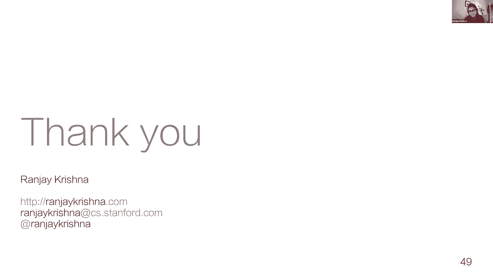

谢谢桑杰，呃，这些真的很棒，呃，专题介绍，他们两个，呃，非常想，挑衅，非常，呃，我会说，嗯，所以考虑到观众没有问题，所以也许我们应该从自己的问题开始，嗯麦克风，你想先走吗？当然，呃，阿迪蒂亚。

那是一次很棒的谈话，还有呃拉尼亚，哇太神奇了，第一个问题，我有一堆问题要问你们两个，嗯，所以首先是那些你通过机械标记产生的关系，还是可以免费下载给社区，等，绝对，是啊，是啊，是的，我想，呃是的。

我可以告诉你，就是这个网址，这是什么，这是最后一个给你。

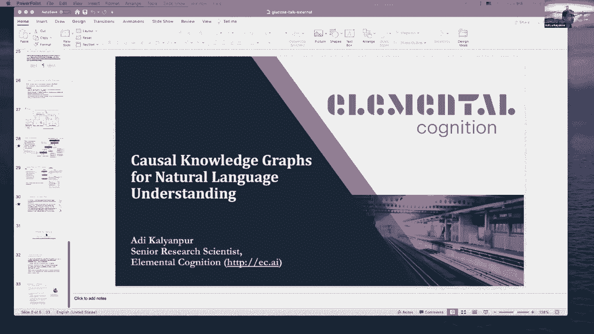

所以如果我们只是，哎呀，在GitHub中，基本认知，葡萄糖，好的，该数据集可用，我相信即使是众包的代码也是可用的，好的，那很好，这些规则与另一个规则相比如何，可比项目，就像，也许是一个框架网概念网。

开放的心态，是啊，是啊，我是说，所以他们都不一样，嗯，它比框架网丰富得多，对呀，framnet并没有这样的规则，它有一个这些帧的库，我们实际上使用了框架网，但目的不同，它就像一本字典，您映射到关系。

但那里没有规则，um概念网和原子是可比的资源，这就是为什么在论文中我们展示了葡萄糖是如何映射到那些，你知道葡萄糖比里面的东西有更多的知识，我想主要的是，我们受到了原子的启发，所以我们真的很喜欢，呃。

原子，主持人来到欧共体，给了一个谈话代理，我们喜欢这项工作，嗯，但我们有一个问题，这就是规则不是上下文的，你有一个规则，就像嗯，你知道如果一个人把手放在某人身上，那他们就开心了，嗯，这取决于上下文。

对呀，好像他们也会心烦意乱，你知道，这取决于上下文，所以我们想把这些规则建立在一个特定的背景下，我们想在两个不同的层次上捕捉规则，具体的，具体的，这是我们对原子的两个增强，但是嗯，否则，从概念上讲。

它与原子有关，只是我们有更多的数据，他们被接地气了，谢谢。所以我们在这个面板上有一个问题，所以我让我们看看，让我们读一下，我们能用Wiki数据丰富场景图嵌入吗，或者其他一些特定领域的知识图。

你都试过了吗，你们都试过查看特定领域的图表吗，是啊，是啊，这是个好问题，嗯，所以是和不是，嗯，它的是和不是，因为我们正在做这件事，嗯，我们最近想了很多，我们想要挖掘的不同种类的常识知识库是什么。

并开始使用和结合我们拥有的图形数据，理想情况下，我们希望能够实现的是计算机视觉模型，它可以推理，不仅仅是场景中发生的事情，但同样也是可能发生或将要发生的事情的原因，所以说，而不是从文本中这样做。

你可能已经内置了这种结构，嗯，甚至只是文字本身，我们试着直接从视频中做，所以我们试图建造，呃，基准和模型，在那里你可以回答关于未来或过去的推理问题，通过将视频块作为输入，所以它仍在进行中。

我们实际上试图使用原子作为框架，但我也应该查一下葡萄糖，谢谢。还有一个问题刚刚出现，如何在场景图嵌入中捕捉情感，是啊，是啊，那是，呃，这是个有趣的问题，因为我们，我们担心类似的事情，在那里。

想出一个关系或属性的词汇表真的很难，所以每当你想出这些词汇的时候，你在自动限制，你收集的东西的效用，所以我们最终做的是一个妥协，我们允许人们在一个图像中谈论他们想谈论的任何事情。

然后我们把他们所说的提取到这些图形表示中，所以我们确实有人在谈论，呃，情绪和人们的感受，所以在某些情况下，我们确实有，关于主观推断的UM数据，关于人们的情绪状态，甚至动物，情绪状态。

我们有相当多的猫被描述为哑巴，比如说，在我们的数据集中，令人惊讶的是，狗从来没有被描述为哑巴，但猫是我想知道是否有一些期望，呃，我们有的对猫来说更高，但不管怎样，也有很多情感方面的数据可用。

我们还没有真正看到人们利用这些数据，就像我们看到的那样，人们利用更多的空间和动词，数据集中的类似关系，但它是可用的，呃，我们只是没有看到人们使用它，所以我有一个建筑问题要问你们两个，嗯，比如听你的演讲。

有一件事让我印象深刻，好的，我们拿着这些，呃，细则，然后我们用它们来训练这些黑匣子，意味着然后我们正在评估这些黑匣子的结果，这真的符合目的吗，因为我们不知道黑匣子实际上在学习什么。

尽管我们给美联储提供了规则，它产生了更好的结果，但我们不确定它是真的学会了这些规则还是学到了其他东西，所以我想我们是建筑问题，我是说，我想如果你在建立人工智能系统，什么应该坐在顶部。

它应该是某种基于规则的知识图模型，它调用A黑匣子或黑匣子，它使用规则作为输入来学习它在做什么，是啊，是啊，我是说，这是个好问题，呃，你知道，我们看到的方式，我认为这是一个经验问题，哪个系统会更好用。

它的核心是象征性的，有神经功能插入，这就是我们对辫子采取的方法，权利或其他，许多其他人已经采取了神经系统的方法，在它的核心端对端神经，但你可以插上一些，呃逻辑或者一些符号技术。

也许它们在解码过程中被表示为约束之类的东西，你知道的，老实说，我不知道工作的哪一部分，我想这两部分都是，你知道的，从科学的角度来看，我们探索了两者，呃，我们喜欢我们的原因是因为你知道它是，它更容易调试。

它是，它更容易解释，因为它已经完全转移了，你可以看到解释是什么，然后呃，这些统计函数，你可以用一种非常干净和单独的方式为他们获取数据，你可以训练，你可以得到数据，就像，如果我回到，呃，再次撞车。

我可以告诉你一件事，嗯，这个设计有什么有趣的方面，你知道，我们怎么用这个，就像我们可能向用户显示一个解释一样，现在用户可能会来告诉我们，1。这种解释是错误的，这条规则在这种情况下是没有意义的。

或者这个事实是不正确的，你，你的NLP，从文本中提取这个事实的是语义分析中的一个错误，所以我们可以从用户那里得到关于解释元素的细粒度反馈，反馈变成交易数据来改进这些统计模型，对呀，因此。

您可以根据反馈独立地改进语义解析器，或者改进规则生成，基于规则反馈的动态规则生成模型，他们可以这样做，因为我们在他们身上暴露了完整的解释，因为我们设计的方式是新的帮助。

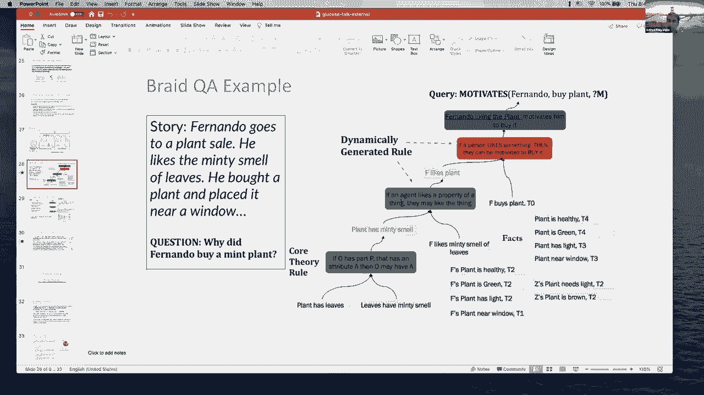

是的，是的，所以所以所以拉贾，你对此有什么看法吗，我不知道我是否能更好地回答这个问题，那是，呃，呃，也是我的看法，呃，我们要做的是诱导这些，这些约束，我们现在可以进去评估，模型是否能够排序，嗯。

满足我们设置的约束，这些约束的好处是什么，在我的许多工作中，我们正在完全远离这些黑匣子模型，我们试图在这些单独的组件中构建，所有这些都被拉在一起产生你的最终输出，所以当呃。

当这些单独的模块中的任何一个出现错误时，我们知道错误是从哪里来的，我们可以修复这些错误，就像我刚才提供的例子一样，嗯，我们能做的另一件事，呃，通过这种结构化的表示，即使我们决定，好的，我们我们。

我们不想有这样的模特，我们只想要一个简单的黑匣子端到端的模型，我们现在至少可以测试这些模型，使用我们建造的这些结构，呃，因为我们可以使用这些结构作为基准数据，以确保，即使我们的模型本身是不可解释的。

他们应该仍然能够概括为，你知道的，新颖的作品，或更多的推理组成步骤，或者我们在模型中可能关心的任何其他类型的特征，好的，呃，这里有另一个高级问题要问你们两个，在做这项工作的过程中，你有没有发展出。

或者遇到设计好的知识图的原则，作为一个具体的例子，拉贾在你的演讲中，你在展示，拿着东西的人，你有作为关系的持有权，我在知识图上工作了很长时间，我很高兴，你知道吗，为什么保持一段关系，这不是关系。

应该是一个事件，那个人要去，应该再次成为那次活动的参与者，我没有任何理由来批评你的知识图表，说着，哦，这可不好，但还有一个问题是我们如何决定，什么是好的知识图，是啊，是啊，让我批评一下我的一些工作，嗯。

这真是令人困惑，有时提出代表权，嗯，当我们为视觉基因组设计场景图时，我们采取了一种非常任务不可知论的方法，我们允许人们为我们注释任何东西，然后我们从那里提取关系，嗯，所以它导致了两个有趣的现象，首先。

它导致了，呃，一般适用于各种不同类型的任务，这很有用，因为现在人们可以使用这些种子图来完成不同的任务，但同时，还不清楚，如果他们真的要在这些特定的任务中推动最先进的技术。

因为它们不是为特定的任务而设计的，所以当我们设计行动基因组时，它更专注于动作检测，我们设计了一个更具体的任务，所以我们没有注释每一段关系，我们只注释了那些我们知道非常，对于我们想要检测的事件非常重要。

我们发现它能很好地工作并为这项任务带来更多的改进，但是呃，缺点是现在，现在表示不那么普遍，所以不那么有用，动作检测之外，一种设置，所以这里有两个相互竞争的方向，你把这些陈述变得更笼统了吗。

还是让他们更有任务针对性，嗯，我真的不知道我现在的立场，我想这就是为什么我们在尝试并试图弄清楚，但是如果你试图在构建表示中最大化性能，通过深入思考，是什么使它具有特定的任务。

对这项任务来说真正重要的是一个更好的，所以抱着对你来说可能不重要，如果你不在乎，好的，你对此有看法吗，这是一个很好的问题，我的感觉是没有完美的知识表示，你永远不会做对，嗯，你知道他们所做的一切。

不同的视角，呃，你知道一个建模师可能有，你知道就像我说的，我从KR和R社区开始很多年了，主要在推理方面，在代表方面没有那么多，其中一部分正是这样，如果你去一个非常狭窄的领域，你可以定义。

你可以花时间思考一个，你知道一个干净的，正式有效，精确逻辑模型，但是当你谈到自然语言和自然语言理解时，很难得到那个，因为它本质上是非常混乱和模棱两可的，这些术语，这些概念，这些关系。

你和我在我们的脑海中可能有非常不同的含义，为了同一个词，所以想出一个干净的，定义良好的语言概念本体论，我认为是棘手的，所以无论我们的哲学是什么解决方案，不管我们有什么解决方案，它必须灵活，它必须能够。

你知道，减，我们担心，关于实际KR的信息较少，更多关于推理的算法，他们应该允许模糊匹配，他们应该考虑到，表示的变化，我是说，那只是我的约会对象，好的，否，这很公平，呃，看来我们又有一个观众问题。

你在减少场景图识别中的偏差方面有什么考虑，关于那个的问题是个好问题，嗯，所以我们过去做了一些事情，嗯，所以有很多偏见，因为有些关系比其他关系更常见，呃，我们通常做的是，我们添加了各种，你知道的。

正规化和训练技巧让它变得更好，但我们也增加了语言限制，我们将从语言数据中提取这些类似的关系，也会给我们看到的人们谈论的事情带来更高的权重，嗯，关于语言，呃，现有的基准。

所以这些都是我们试图减少偏见的方法，它们通常是有效的，让我们可以预测新的或新奇的事情，嗯，但我们还没有完全不带偏见，肯定有很多，呃，来自数据集的噪声，或来自数据集的偏见，这有点渗透到我们模型的预测中。

所以它仍然是一个活跃的研究领域，嗯，我们通常只使用，就像，我说，训练嗯训练技巧或语言，作为额外的数据来源听起来不错，在某种程度上，你的工作确实从根本上解决了减少偏见的问题，对这个，是呀，是啊，是啊。

所以在某种意义上，我们明确地试图减少偏见，因为我们把东西分解成各个组成部分，但又一次，即使如此，仍然有相当多的CIN因为，你可以想象，嗯，模型看到一个人，只是假设这个人会做这些活动，而不是别人。

只是因为他们更有可能，所以我们确实试图采取额外的方法来改善它，所以我们还剩一分钟，呃，也许呃，你们每个人都可以给我们你的，呃，对你下一步的愿景，每个人都在30秒内，然后我们就可以结束今天的会议了。

你想先做的事情，你很安静，对不起，是啊，是啊，所以嗯，你知道的，我们无论如何都没有解决自然语言理解的问题，我想我们所展示的是有一个新的食谱，um和nlu推理，在那里你可以结合基于面条变压器的模型。

不一定是变压器，但是训练的神经功能，呃，知识啊，制作呃，细则，呃，然后将其与一个符号推理引擎结合起来，用于为做而做，你知道的，可伸缩推理，我认为还有很多挑战，比如我们想做的一件事是将文本和图像结合起来。

并做，你知道的，视觉数据集问答，这有点关系到工作，呃，谈到了嗯，然后有很多悬而未决的问题，呃，你知道我们的模型还不能很好地工作，在某些领域，我们还有域适应问题，你知道吗。

将知识从一个领域转移到另一个领域，并表明我们可以用很少的数据有效地学习，我们做的其中一件事就是收集了60万条葡萄糖规则，我们需要这么多像我们一样的人，我们还得做实验才能看到，我们能训练更好的模型。

用更少的数据学习吗，所以我认为从某种意义上说我们采取了简单的方法通过微调，你知道的，五个或两个对吗，对我个人来说，这些都是现有的架构，我想写小说，呃，能够更有效地学习逻辑和符号数据的模型非常有趣，是啊。

是啊，嗯，有很多不同的方向，我对一个感兴趣，嗯，真正深入作曲，时空类表示与推理问题，嗯，将它们与常识知识库相结合，我也对积极追求不同类型行动的活性剂感兴趣，以及这是如何导致世界的不同变化的。

因为他们自己的行为，我也对很多多代理类型的框架感兴趣，以及这些表示是如何不同的，取决于每个代理人单独观察到的程度，以及他们如何共享这些信息来完成协作任务，所以这就是我的研究方向，那太好了，听起来真棒。

声音，呃，非常令人兴奋，人工智能非常迷人的前沿，嗯，我们差不多快下课了，所以我要感谢你们两位抽出时间，并与我们分享您的工作，这真的是一次迷人的会议，我们希望与您保持联系，跟踪下一个前沿是什么，你晋级。

就我们班而言，我们下周二继续，和我们的主题，呃，下周开始，我们如何用知识图进行推理，所以非常感谢大家，我们下周见，谢谢。谢谢。谢谢你邀请我们。

