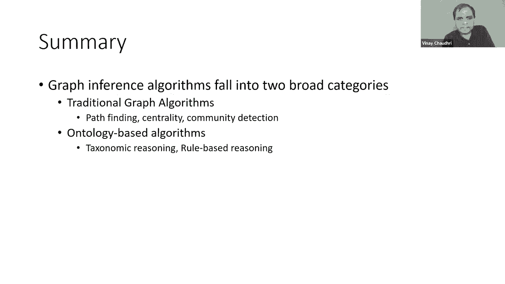

# 【双语字幕+资料下载】斯坦福CS520 ｜ 知识图谱(2021最新·全20讲) - P16：L11.1- 知识图谱知识推理算法介绍 - ShowMeAI - BV1hb4y1r7fF

欢迎参加知识图研讨会，呃，今天我们在课程的第六周，呃，到目前为止在课程中，我们已经定义了什么是知识图，我们花了几周时间讨论如何创建一个知识图，从结构化数据，来自非结构化数据。

现在我们进入了课程的下一个部分，本周我们将研究如何利用知识图表进行推理和访问，我们的重点将是推理算法，在接下来的几周里，我们将讨论，呃，用户如何与知识图交互，以及知识图在一段时间内是如何变化的。

所以今天的演讲将分为两个独立的部分，呃，第一个将是理论上的，或者演示文稿的算法部分，在那里我将描述，呃，各种知识图推理算法，在第二部分，我将举例说明其中一些算法是如何用于解决实际问题的。

在实际业务用例中的分析设置中，好的，呃，最初我希望讲座的第二部分，我会在第八周给，但是呃，在第八周我们找到了一些非常激动人心的演讲者，所以我决定把这两节课合二为一，我认为这样会更有效。

因为在应用程序上下文中理解这些算法更有趣，好的，好的，所以有了这个，呃，我们开始吧，呃，我们讨论了哪些知识图推理算法，早期，在课程中，我介绍了呃，作为查询语言的Sparkle和密码。

我给出的这两种查询语言的示例，它们相当简单，非常初步，这些例子主要说明了我们如何检索信息，或者查找知识图中已经存在的信息，用知识图推理，我们感兴趣的，呃，得出知识图中没有明确说明的新结论。

有很多不同的方法来做这件事，我们将在最高级别上研究这种推理算法的族，我将考虑两大类算法，呃，基于图的推理算法和基于本体的推理算法，基于图的算法它们主要源于图，纯抽象图算法和基于本体的推理算法。

他们来自呃，知识表示与推理，有各种各样的图算法可以用于图结构化数据，事实上，为了我们的讲座，有一些专门讨论图算法的书，我选择专注于三个系列的图算法，寻路，我会详细介绍每一个，呃，算法。

寻路是对图的基本操作，呃，给出一个我们在这里看到的图表，其中边用数字标记，其中数字表示从一个边缘到一个节点再到另一个节点的成本，所以给出这样的图，路径查找问题是要弄清楚。

从一个节点到另一个节点最便宜的方式是什么，呃所以，比如说，如果我们在节点A，我们想计算，呃，我们要去节点C的最短路径，我们可以直接从A到C，它的成本是五英镑，或者我们可以从A到D，D到C。

它的成本是四个，呃，所以在这种情况下，我们更喜欢从a到d，从d到c，这种计算在交通规划等应用中有明显的应用，当你呃导航的时候，你想找出从A地出发的最短路，替换b，路径查找问题可以用，很多不同的方式，呃。

一种说法是，您会得到一个单一的起始节点，从那个单一的节点，您想要找出到图中所有其他节点的最短路径，所以这被称为单一来源，最短路径问题，所以在这个例子中，我说明了我们的起始节点是一个。

我们想找到从A到B的最短路径，a至c，a至d和a至b，寻路问题的另一个变体是，呃，最小生成树，它有时也被称为呃，旅行计划或旅行推销员问题，我们想从一个节点开始，我们想访问其他节点，使总成本最小。

和旅行推销员的关系是推销员必须访问一定数量的城市，他们希望用一种他们的总成本最低的方式来做这件事，所以有很多呃，寻找路径的方法，但我将介绍一个解决路径查找问题的经典算法，这是呃，被称为星型算法。

这是一个非常基本的算法，最初是在人工智能规划的背景下发展起来的，但它显然适用于在图中寻路，所以最基本的，该算法采用的方法是维护从起始节点开始的路径树，这些路径树被延伸到满足终止标准，延期是基于。

路径的长度，如果你穿过一个特定的边缘计算的方式是，如果FN是达到最终目标的成本，GNN是我们到目前为止已经发生的成本，h n是对成本的估计，如果我们沿着一个特定的边缘在这里显然是一个估计。

因为我们还没有到达我们的呃结束状态，所以我们不知道确切的费用是多少，嗯嗯只是一个估计，这就是为什么，它被称为启发式，好的，这是一个启发式的，特别是我们对某类启发式感兴趣，这被称为可容许启发式。

可容许启发式是一种从不高估成本的启发式，呃，它可能会低估成本，但它从不高估成本，有证据表明，这表明只要我们的启发式是可以接受的，我们将在搜索过程结束时得到一个最佳路径，因为这个算法的启发式性质。

有很多工作要做，有写在上面的书，只是，你知道的，搜索算法或星型算法，要不是我们在这里讨论，呃，我将用一个非常简单的例子来说明算法的工作原理，我们假设，呃，我们的呃，启发式就是零，对呀，呃，很明显。

如果我们，如果我们假设达到目标状态的成本为零，这显然不是一个不高估的估计，对呀，是啊，是啊，这显然不是高估，当我们把启发式设置为零时，搜索算法也退化或缩小到，更广为人知的是早餐优先算法。

为了说明这个算法的工作原理，我们就会，呃，演示过程，当我们试图计算从节点A到节点E的最短路径时，所以当我们从节点A开始，我们首先列举所有可能的选择，我们可以从A到B，a到c和a到d，在这三个选择中。

最短的路径是嗯，或者最小的成本是，如果我们遍历节点，我们从A到D，所以在第一步我们会，呃选择，呃，从A到D然后在D我们将探索所有的选择，我们可以从D到C，或者我们可以从D到E。

即使在本例中e是我们的目标状态，但是从D到C的成本是4，比从D到E的费用还少，所以在这种情况下我们仍然想探索，因为很有可能如果你去C，然后从C到E，总成本不到五个，我们不知道对不对，所以在这种情况下。

我们必须去探索C，我们意识到如果我们沿着这条路从C到E，成本实际上是6英镑，然后呃，因此，我们已经找到的从a到d，从d到e的路径，这是最短的路径，从A到E，好的，这是对星形算法如何工作的快速演练。

对于启发式设置为零的情况，就像我一样，呃之前提到过算法，这是一个非常著名的寻路算法，它有大量的应用程序，最初是在人工智能规划的背景下引入的，但现在它的应用远远超出了人工智能的规划，现在我们来谈谈呃。

中心性检测，中心性检测算法背后的基本思想是它们帮助我们理解，呃，网络中节点的重要性，所以给定一个图形或图形的结构，我们想弄清楚哪些节点最重要，或者什么节点在某种程度上是桥梁，使它们突出，从某种意义上说。

它们连接了很多很多其他节点，这些分析或洞察力在识别瓶颈方面非常有用，复杂图形结构中的脆弱性，为了说明检查中心度的不同方法，嗯，一个简单的方法是简单地计算节点的度数。

我们的意思是一个给定的节点连接到多少其他节点，所以在我们看到的这张图表中，节点A连接到最多的其他节点，因此，在这个网络中，有一个基于度中心度度量的中心节点，在中心性之间是计算呃的另一种方法。

图结构中的中心性，节点被认为在中心性之间有很高的，如果它有最多的最短路径穿过它，所以在这个呃，完整的网络结构，呃，节点b在一点上，这样很多最短的路径就会穿过它，我们知道在呃。

显示在左上角和右下角的节点集群，还有其他节点，就穿过它的最短路径而言，这可能是中心，但如果你把整个图表，b有这个独特的位置，在那里嗯，如果要计算所有不同节点之间的最短路径，最短路径的最大数将是通过b。

在这种情况下，b有一个，中心性之间的最高，呃，根据那个指标，那么计算中心性的另一个度量称为接近中心性，与网络中所有节点最近的节点，好了，现在，在本例中，来说明亲密中心性，我们将只考虑图的那个片段。

也就是幻灯片的最右边，你没有考虑整个图表，你只是在考虑右边的这个小片段，在那碎片中，节点C具有最高的接近中心性，因为它最接近图中的所有节点，显然又是潜在的，您必须计算最短路径。

然后你必须找出哪个节点最接近最多的节点，在最高级别，定义是C是一个节点，它离网络中的所有节点最近，第四个也是最后一个用于中心性检测的度量称为pagerank。

现在这个pagerank最初是在信息检索的背景下开发的，谷歌是这个页面最大的用户，这里实际上代表拉里·佩奇，那是他的姓，然后呃，最初，它被用来计算哪些网页在网络上最突出。

鉴于Internet上的文档Web定义了一个图形结构，这种秩可以应用于任何图结构，这个算法的好处是它被设计成，考虑节点的重要性，例如，如果一个节点连接到许多有影响力的节点，那么它可能比节点更中心。

即使它连接到许多其他节点，但它连接到所有这些琐碎的节点，对呀，那种事情其实很有道理，用这个很有意义，呃，在Web搜索的上下文中，所以给呃，呃的重要性，这个算法，我想这可能是有意义的，再多看一点，嗯，呃。

密切的，呃，就像我之前说的，这里的基本思想是考虑到，呃，其他节点对给定节点的影响，呃，在网络内，算法是迭代的，它是围绕着你在屏幕上看到的这个公式建立的，我会教你怎么做，在方程的左手边。

我们有一个节点u的pagerank，我们正在计算一个节点u的分贝，一些呃，一减d加d乘以这个更大的表达式，这里是呃，被称为阻尼因子，这实际上是在Web上下文中可能的，它是访问节点的可能性。

嗯直接访问它与通过以下链接到其他页面，通常它的值设置为零点，八五，呃，让我们看看我们看到的表情，呃，括号内，所以从第一到第二，它们是节点t到t的分页，从一个到一个，是每个节点连接到的其他节点数。

所以这个算法的工作方式是，我们将从设置寻呼机开始，对于所有节点到某个任意值，它甚至可以是网络中节点总数的1除以，在每一步，我们都会更新值，我们会一直这样做，直到，算法稳定并再次，这是一个迭代算法。

但它似乎对呃很有效，网络搜索，它也被用来识别呃，复杂图结构中的中心节点，所有的权利，呃，现在让我们继续讨论第三类用于社区检测的图算法，所以基本的想法，或社区检测的要求，就是识别图中作为一个组的节点。

根据一些标准，它们是密切相关的，一般来说，呃，在同一个社区中的节点之间会有更多的关系，到不在社区中的节点，很多时候，社区检测也被用作两阶段分析过程的第一步，所以你要做的是给出一个图表，首先找出社区。

这是你的第一步，一旦你确定了社区，然后你只想把分析集中在每个节点上，就是在社区里，深入了解社区内部发生的事情，所以我们现在来看看一些算法技术，用于社区和检测，社区检测有两大类算法，有标准的图算法。

然后是自下而上的算法，作为一个标准图算法的例子，我们就拿这个，呃，我们在这里看到的示例网络，我们可以做的一件基本的事情是识别连接的组件，有向图的连通分量本质上是一组节点，这样，在底层的无向图中。

您可以从每个节点到其他节点，好的，和一个非常简单的基本措施来识别呃，图算法中的社区，对不起，在一个复杂的图表中，第二个非常常见的标准图算法是强连通分量，强连接元件，当然啦，是相对于有向图计算的。

有向图中的一组节点强连通，如果有可能从A到B，对于每对节点，你可以从一个到另一个，再回到另一个，在这里显示的图片中，我们可以看到有两个，呃，彼此强连接的节点集，在这种情况下，我们可以说。

这个图有这两组节点作为社区，呃，让我们呃，谈论，呃，自下而上算法，甚至在自下而上的算法中，有两种常见的方法被称为标签，传播展开，我会给你一个这些算法的快速草图，这样你就能感觉到它们是如何工作的。

所以在标签传播算法中，我们首先将图中的每个节点分配给不同的社区，然后我们确定订单，其中我们将检查所有的节点，并更新他们属于哪个社区，当我们检查给定固定中的所有节点时，呃，呃，订单，我们检查呃。

一次一个节点，我们更新它社区的方式是，我们会检查它的邻居所属的社区，好的，在某些情况下，呃，呃，可能有两个，可能会有一个平局，就像，比如说，如果节点有，只有两个邻居，其中一个属于社区A。

另一个属于社区B，所以没有什么地方可以优先考虑其中一个，在这种情况下，我们随机打破轮胎，我们将更新该节点的社区，到它的一个邻居的社区，我们会不断重复这个过程，直到我们达到一个条件。

当每个节点都在一个社区中，该社区又被它的大多数邻居共享时，有一个自下而上的过程，这是一种沉浸式算法，因为当我们开始的时候，我们不知道我们最终会有什么社区，和，这就是为什么。

这种算法对于进行图分析是非常有吸引力的，因为它倾向于揭示模式，我们可能在同一个算法家族中都没有想到，还有另一种非常流行的技术，叫做展开算法，有些人也称之为卢万算法，这是最初介绍它的人的名字。

介绍它就像呃，先前的算法，呃，我们初始化这个算法的第一步中的第一步，我们初始化了每个节点都将在一个单独的社区中，然后我们要，呃，检查每个节点及其邻居以测试，模块化会有一个整体的增益。

把它和邻居放在同一个社区，所以在这里你知道，我们不是在自动改变社区，我们是根据一个公式做出决定的，有许多不同的方法来定义总体模块化得分，如果我们做出改变，但这里有一个我展示的示例公式。

用于计算图的总体模块化，我们可以简单地看看这个表达式是如何，呃计算，呃，所以我们有K个社区，所以我们在计算，每个社区的模块化得分，我们将它们相加，我们计算每个社区模块化得分的方式是，在第一学期。

我们取社区中节点的数量，我们把它除以边的总数，然后在第二个，呃，在这里，我们取社区中所有节点的总度数，我们把它除以边的总数，所以这是一种衡量模块化程度的方法，呃，图形是，并通过在。

在节点对其邻居的社区设置中，如果图的总体模块化得分会提高，然后我们进行切换，如果模块化得分不会提高，我们不会做切换，所以我们一直做这个过程，直到它稳定下来，然后是算法的第二阶段。

其中我们将创建一个新的图形，其中，这个新图表中的每个节点都代表第一阶段的一个社区，好的，如果在第一阶段图中两个社区的节点之间有边，我们将其表示为一个自循环，如果有一个优势从一个社区到另一个社区。

那么在第二阶段的图中就会有边缘来捕捉，所以基本上在第二阶段，我们有一个图表的浓缩版本，我们最初从一次开始，我们有这个图形的压缩版本，然后我们将重复第一阶段的过程，呃，压缩图，我们将继续这样做，直到。

所有的权利，这是一次基于图的算法的旋风之旅，接下来我要谈谈基于本体的推理算法，我喜欢这样想，一般图系统与知识图系统的关键区别，实际上是基于本体的入口，因为我和你谈过的所有算法，到目前为止。

它们甚至可以应用于抽象图，对呀，不一定要在引号内，一个知识图，让我们使用这些算法，嗯当它，一般图开始变成知识图，当我们开始添加语义时，应用程序域的语义，通常我们添加应用程序域的语义，呃呃。

与图的关系是通过将类关联，或者呃，定义，呃，节点如何相互连接的语义，并定义关系的语义属性，所以当你开始向图中添加这种语义知识或领域知识时，有一些，嗯，有一些算法可以给它贴上标签，你喜欢哪种方式。

但我选择给它贴上标签，呃，基于本体的推理，在这一点上，我进一步区分了两个，呃一个是呃，基于类的推理，或者你可以把它看作是分类学推理，第二个是基于规则的推理，你开车的地方，您将对数据应用的一组规则，现在。

基于类的推理和基于规则的推理之间的区别不是很明显，嗯，有时这主要是一个实现选择的问题，呃，有人会说，嗯，你知道你可以做各种各样的，使用规则的基于类的推理，你知道在某些情况下这可能是正确的，嗯。

但有一点我想指出的是，在多类推理系统的实现中，他们倾向于更直接地使用基于图的算法，我在前一段谈到过，例如，如果你在做一些，呃，分类学推理，你知道你会做图遍历，你知道的，当然还有。

您可以使用规则进行图遍历，而是在本体中，或者在基于分类学的系统中，或者在基于类的系统中，他们会更直接地利用图表算法，好的，呃，现在让我们来看看这两种推理中的每一种，更详细一点，呃，分类学推理是，呃。

当将知识组织成一组类是有用的时，适用的或有用的，对呀，我是说，有一些，把事情组织成类可能没有意义，就像你知道的，假设你有一个表示Internet上节点的图，这就是你所关心的，你知道那里几乎没有课，对呀。

另一方面，如果你想建立关系图的模型，在维基百科或维基数据中说，突然间，你知道把你的事实组织成一组类变得更有趣，而课堂只不过是，呃，单位关系或类型，当你上课的时候，我们可以定义，呃，班级成员资格。

我们可以把课程专业化，我们将查看这些中的每一个，呃，更详细的特性，这样你就对如何做到这一点有了更多的感觉，现在看来呃，属性图数据模型和RDF数据模型，他们支持上课，嗯。

在我们前面讨论过的属性图数据模型中，节点类型本质上的功能与类的功能相同，在RDF数据模型中，它们有一个RDF模式层，允许您在其中定义类，它们还可以让你在你的关系中定义领域和范围限制，正如我以前指出的。

rdf，呃，是一系列语言中最低的表示层，他们，他们原则上，可以扩展它们的基本表示，使其具有成熟的本体语言或规则语言，但为了，呃，本讲座的讨论，我选择把讨论独立于这些模型，对呀，我要去，呃，呈现嗯。

不引用rdf或属性图的推理的基本原理，呃，他们是独立的你知道的，哪个数据模型，你用，显然当你进入模型的细节时可能会有一些具体的差异，但为了课程的目的，我觉得进入这些差异并不重要，好的，所以让我们呃。

举一个很好的例子，一个简单的例子，我们有人的地方，呃，呃，我们有，呃，呃，呃，男性和两种人，男性和女性，我们有艺术的男性，鲍勃的男性，呃，我们可以用两种不同的方式来表示它们。

我们可以把它们表示为统一关系，比如内心的男性，我们可以说，呃，男性是艺术的一个阶级和实例，男性，对，你可以，两者是等价的，逻辑上，你知道他们，它们的意思是一样的，好的，如此给予，呃。

给出了这种非常简单的例子，呃，我们可以把我们的知识组织成一个层次结构，所以我们可以做出断言，比如呃，女性是人的一个亚类，男性是人的一个亚类，所以当我们在知识图中有这些剩余关系时，我们可以做，嗯。

我们能做的第一个非常简单的推理是传递性推理，所以说，比如说，如果A是B的子加，B是C的子加，我们可以得出呃是c的盈余，然后剩余和实例也是相互关联的，接下来显示的规则捕获了这种关系，它本质上说。

如果a是b和um的子类，是加号会是我是，那么i也必须是b的一个实例，所以这个推论很自然地从子类的定义中得出，我们可以的例子，呃宣布呃，类是不相交的，嗯，例如，我们可以说男性和女性是分离的，如果嗯。

两个类是不相交的，那么呃，他们不能有任何共同点，这可以用于知识图中的各种推断，但最基本的形式，你可以用这个做的推断是嗯，确保事物被适当地定义，这样我们就不会把同样的东西放在两个不同的班级里。

那碰巧是Disjo，对于这些课程，我们可以介绍，类定义，类定义通常有两个组件，类有必要的性质，然后一个类有足够的性质，类的必要性质，类的实例共享的所有属性，例如，我们可以说，如果我们有一个棕色头发的人。

那么该类的所有实例的头发颜色都是棕色的，所以在使用我们在屏幕上看到的规则时，我们正在指定棕发人类的所有实例的属性，类的充分性质让我们得出结论，得出一个特定实例是该类权利的成员的结论，例如。

如果我们有一堂课，呃，棕色头发的人，我们可以说任何棕色头发的人一定是，或者必须是该类的实例，大家可以看到，呃，在现在显示的规则中，从这些规则的逻辑句法结构中，主要的区别是在必要的财产中。

你会在规则的正文中有一个对等的例子，在充分的性质中，您将有一个规则，其中的实例出现在规则的头部，因为有了足够的财产，你就结束了班级成员资格，并且使用一个必要的属性。

您正在使用类成员资格来导出一个新的结论，现在，我们之前讨论过定义知识图中关系的语义，要为这些关系定义的基本语义是，呃，对第一个参数和第二个参数的约束，因此，对第一个参数的约束通常称为domain。

对第二个参数的约束是，呃，被称为范围，所以说，比如说，如果我们有父母关系，嗯，我们可以，呃，声明如果x是y的父，不碰巧是班上的人的例子，然而呃，该类父级的域是person，那是违法的，类似地。

我们可以在第二个参数上定义约束，这通常被称为关系的范围，除了这些类型约束之外，我们也可以嗯，基数与关系的数字限制，呃，因此，基数限制限制了一个关系可以取的值的数量，例如，我们可以有一个限制。

即一个人可以有两个父母，他们不能有更多，呃，双亲，呃，然后我们也可以把，呃，对…的限制，呃，数值，呃，我们可以说，嗯，一个人，一个人的年龄不能超过一二五，这个推理，在分类学系统中被大量使用的叫做遗传。

这基本上意味着一旦你定义了类层次结构，我们定义这些关系，关系值被称为继承到类权利的实例，我们以前见过一些这样的例子，其中一个例子是，如果艺术是棕色阶级的一个例子，有头发的人，那么我们就可以得出结论。

棕色头发，不管我们的数据中是否明确说明，呃，但更广泛地说，呃，在分类学系统中，有四类推论，呃，就执行它们的复杂性而言，每一种都有不同的困难，嗯，其中最困难的是，嗯，第一个被赋予两个类和B。

弄清楚A是不是B的子类，这里我们主要是从类描述开始工作的，我们必须在呃的水平上进行推理，第二个推论中的类描述，即所谓的呃，也称为分类，实际上，第一个通常被称为假设，第二个推论被称为呃分类。

在那里我们得到了一个例子I，我们想弄清楚i是不是A类的一个实例，所以说，这里的主要区别是和第一个不同的是，在这种情况下，我们得到了一个具体的例子，然后我们试图将它与类的描述进行比较，在第三个中，我们是。

我们得到了一个理由，亚当，呃，这将是非常简单的事情，就像艺术是否有棕色的头发，我们想检查它是真的还是假的，最后，第四个推论也被称为查询处理或查询回答，我们得到了一个查询。

我们想弄清楚查询中变量的不同值是什么，这将使，呃，呃，做一个，使查询为真，所以再一次，这是一次旋风式的旅行，呃，嗯，正如我和前面提到的，分类推理和基于规则的推理之间的界限不是很清晰，对呀，我我有，呃。

我在这节课中做了区分，主要用于教学目的，但如果你要出去建立一个系统，那么你知道你可以走很多不同的路，你可以选择也可以不选择，呃选择做出这种区分，好的，所以要解释基于规则的推理，我要举个例子，嗯。

我选择这个例子的原因只是为了，嗯，捕捉，复杂性，它本质上比仅仅，嗯，只是能够定义分类法，然后呃，关系和制约，在这个呃，在这张幻灯片上，您看到了一个属性图，域的表示，我要先给你读这个，我会读幻灯片的顶部。

我们说我们有一个节点，类型的人，那个人参与了一项研究，这项研究是关于化学物质的，现在让我们阅读这个属性图的下半部分，我们说的是一家公司生产一种产品，而这种产品，然后是一个优势，从公司到一个人。

它被贴上了由OK资助的标签，这是给定域的一个非常简单的属性图模型，给出这个模型，或者我们会有实例来填充这个属性图模型，我们想弄清楚，我们想结束利益冲突，那又怎样，那些是什么，参与其中有利益冲突的人，嗯。

在某些研究中，所以为了捕捉，捕捉利益冲突，规则是一个很好的装置，我在这里展示，um示例规则，呃，用哪个呃，我们可以做到，这里的第一条规则，公司对某一特定产品的兴趣，这条规则本质上是在说什么。

公司X对产品Z的兴趣，如果公司x产生y，那么y包含z，所以我实际上说错了一个公司X，对化学Z的兴趣，如果x公司生产产品y，而该产品y含有化学物质z，然后在下一个规则中我们是，呃，实际界定利益冲突的含义。

实际上利益冲突是什么，平均嗯，他们说，参与学习Y的人X与Z公司有利益冲突，在研究中，x与y有关，坚固的y是关于化学p的，那个人X是由Z资助的，Z碰巧对P感兴趣，所以它是一个，你知道的，相当复杂的，嗯。

呃，之间的关系呃，在这个图中的这些不同的节点来计算，呃，利益冲突，规则提供了一种自然的抽象或自然的方法来捕获这些，嗯，呃，这些关系，一个例子，如果你，如果您使用基于规则的方法来进行推理。

我们会产生的利益冲突，他们不会生活在知识图上，但不一定要那样，你知道有些人会说，嗯，你知道的，我希望我的查询结果也是一个知识图，我想计算结果，然后我想把结果放在我的知识图中，对于那些经历过这件事的人。

呃，呃当然，你知道我做了多大的交易，呃，在知识图中，你的关系必须是二进制的，在这种情况下，规则的头部不是二元关系，所以你你必须以某种方式，如果你要捕捉你的利益冲突，呃，知识图，你得想出，在多次讲座中。

我们谈到了物化的概念，好吧如果我们想把利益冲突纳入图表，我们必须具体化这种利益冲突，关系与物化，我们也可以用图表捕捉，如你所知，物化的基本思想是，对于任何非二元关系，我们必须创建一个新的对象。

在这种情况下，我们通过在规则的头部放置一个存在式来引入这个对象，这里我们介绍一个新的对象C，这代表了利益冲突，然后对于那个新对象，我们引入了一组关系，这些关系捕获了关系的不同组成部分。

在这里我们介绍关系，冲突原因，冲突和呃，我们说c的冲突是x，冲突原因是Y，然后呃，为什么这里碰巧是研究和冲突是Z，恰好是公司，所以呃，所以这是，呃，一种方法呃，定义复杂的推论。

我们想在知识图中的数据上执行，并用规则来表达它们，如果你想在图中表示结论，然后还使用类似于存在规则的东西指定知识图的加法，现在这只是我们如何实际应用规则的一张幻灯片概述，嗯，一般来说。

有两种策略来应用针对知识图的规则，有一个自下而上的策略，在自下而上的策略中有一个自上而下的策略，我们对数据应用规则，我们会得到新的事实，我们将把这些新的事实添加到我们的数据库中，我们一直这样做。

直到我们不能得到更多的粉丝，显然，这种方法会出现的一个复杂问题是，我们必须确保我们的计算结束，我们应该在某个时候终止，有一些方法可以确保有时通过对语言的限制，有时通过对算法的限制，以确保我们的计算，呃。

停止自下而上策略的好处是，一旦我们应用了所有的规则，现在我们都有了更多的事实，然后我们可以对派生数据使用传统的查询处理算法，回答自顶向下策略中的查询，呃，我们从查询开始，我们只应用那些需要的规则。

我们不能得出所有的结论，你知道的，我们只得出那些我们在回答问题时可能实际需要的东西，在这种情况下，我们确实需要在规则引擎和查询评估引擎之间进行更紧密的集成，在前面的方法中，你知道的。

一旦我们应用了所有的规则，查询引擎可以单独工作，但在这里两者必须密切合作，自上而下策略的好处是，呃，我们显然需要更少的空间，因为我们不会推导出所有的东西，我们将只导出。

现在做这个基于规则的推理所需要的东西，呃，今天有许多高效和可伸缩的规则引擎可用，事实上，我们周四的讲座，我们有一个来自关系人工智能公司的嘉宾演讲，他们一直在建造，基于规则的推理引擎。

我们将从他们那里听到很多关于他们是如何进行的细节，呃，建造他们的引擎，以及他们的引擎如何帮助支持知识图的推理，所有的权利，呃，在最高水平上总结推理算法的知识，它们分为两大类，呃，传统的图算法，比如寻路。

中心性检测，社区检测，以及基于本体的算法或语义算法，既可以是分类推理算法，也可以是基于规则的推理算法，所以我的结论是，呃，演示文稿的第一部分。

