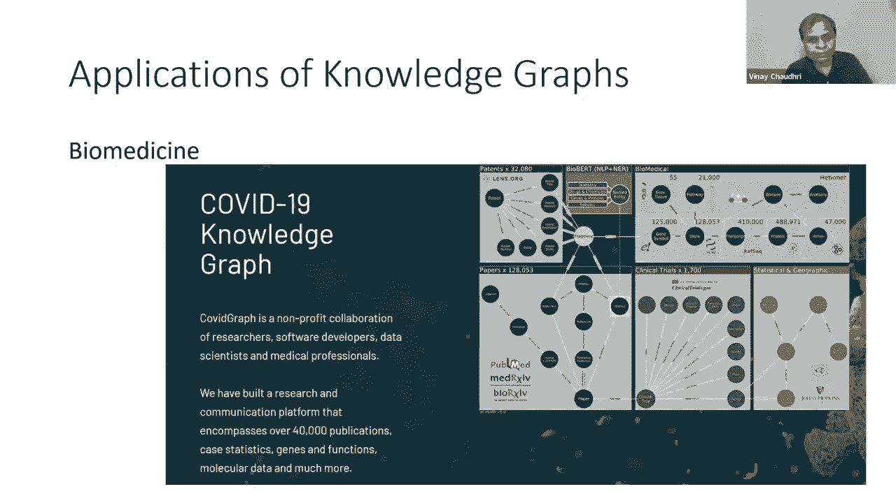
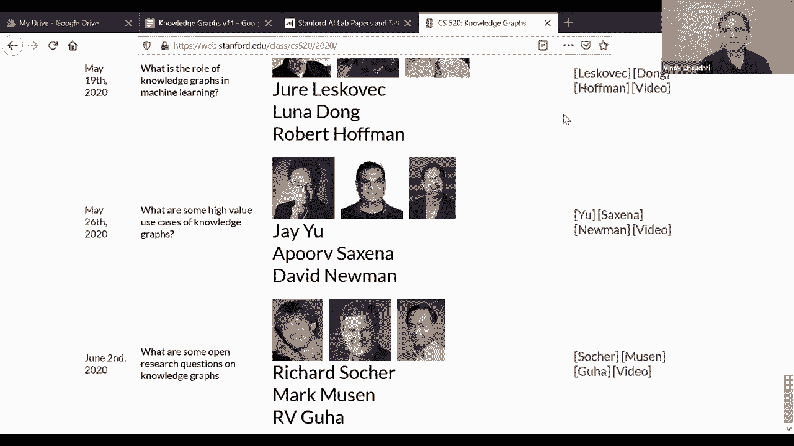

# P17：L11.2- 知识图谱的高价值应用案例介绍 - ShowMeAI - BV1hb4y1r7fF

嗯。Should we look at the question or should we just go。Right into the second part。

There's one question from Suhir in description logics， domain and range are not constraints。

 any thoughts on the pros and cons of the domain range semantics of UKGs versus adding DLs？Well， so。

I mean， my short answer to that question is that I。

Prefer the logic programming style definition of constraints as compared to the description logic style semantics and as you know description logic semantics are based on Tcan semantics and it requires you to think of possible words and。

I'm not sure if that's the most appropriate way to think about the world in logic programming。

 we are advocating the use of hardware and semantics there。

Semantics are defined in relation to the data that you have。

And and then defining them domain and range as constraints that seem to make more sense and that's the kind of approach I personally prefer and advocate。

 so I hope that satisfies。So he question。All right。

 so I'm now ready to launch into the second part we have plenty of time left to go through this and hopefully still we'll have time at the end for more discussion。

So knowledge graphs have a lot of applications and these days they are being used in all kinds of domains and one interesting example that I recently stumbled into was Marvel comics。

 they have tried to create a knowledge graph for Marvel's cinematic universe。

And basically each node is can be a character or a particular movie and then they have edges which have semantics like whether two characters appeared in a particular movie together and whether two characters appear in a particular scene together and theyre using this graph of。

the characters and movies to better understand their current movies as well as to help design new movies。

 like to think or look for connections that are currently missing in their knowledge craft to figure out what new movies they could come up with。

There is International Association ofInvestigation，Investigative Journal。

They built a very interesting knowledge graph from the。

News that were leaked and they gave this knowledge draft to their journalists to look for links that nobody or look for links or connections or shady behavior of different actors involved。

Based on what was in those papers as a way to。Drill down into interesting details faster。

And since the last year when the pandemic hit us all。

 there have been multiple efforts focused on creating knowledge graphs for CoVD 19 be it。

Taking the publications， be it taking the infection data。

 there are many kinds of COVID motivated applications。

 knowledge graph applications that have been built just in last 12 months。

。But for the purpose of next 10 or 15 minutes that discussion。

 I have chosen to focus on applications of knowledge graphs in finance。

And the discussion that we are going to have now is。

A synthesis of what we heard from the speakers who came to our series last year。

 so I'm going to just summarize and give it to you in a very concise manner how knowledge graphs are being currently used in finance and basically we'll talk about three broad categories of applications。

 the analytics， the financial calculations and financial reporting。

Analytics will show the application of graph algorithms。

 financial calculation will show the application of rule based inference and financial reporting is going to show the ontology based inference okay。

So here's a set of questions， analytics questions which are of great value to financial institutions。

 for example， which of our clients are suppliers of company of a particular company or in financial trouble in a supply chain network is there a single company that connects a group of companies which startups are attracting very influential investors。

 etc。And I'm going to step through some of these questions and also connect the dots on how some of the algorithms we considered in the first part are applicable to answering these questions。

So let's take this question， which of our clients are suppliers of company X that is in financial trouble？

So to answer this question， we first of all， would need information about the suppliers。

And in this case， it turns out that fact set is a commercial data vendor。

Who curates the supply chain relationships？You know they are in the business of doing that and they sell that supply chain data to a lot of other companies。

 you can purchase that data and then using the techniques we considered in lecture four like how to create a knowledge draft from structured data you can take the facta data and you can integrate that data with the internal company data that you have。

Complete information about your customers right and once you've integrated that data then to answer this question。

 you would use pathfind right you would basically do a pathfin over your supply chain network to a certain distance to figure out which。

Companies and suppliers are connected to each other。

Let's take this question in a supply chain network is there a single company that connects a group of companies this is a textbook example of between this centrality right if you have your supply chain network and there is one node which has very high degree of between this centrality it sort of indicates that this particular company is supplying to lots of other other organizations and if anything good or bad happens to that company。

You would want to know about that you would want to stay upfront on what's going on with that particular company。

Let's now consider the question，B startups have attracted most influential investors。Now。

 to answer this question， we would need data for。Which VC firm or which angel investor or private investor is funding which company。

And it turns out that there is another commercial data provider known as pitchitchbook。

 who is in the business of curating this information and they sell this information to third parties。

And just like in the case of Fat， we could purchase that data and we could bring it and integrate it with the structured data within the company and we could create a knowledge graph and within that knowledge graph。

 if we wanted to see who are the most influential investors。

 we would use something like Pagerack right we would in that network。

 we would figure out which nodes happen to be most influential。Okay。

 and another related question you could ask is which group of investors tend to co invest and to answer that question you would you could use community detection algorithms because they would take into account multiple ways these venture capital or investment companies are connected to。

They fund is。All right， then on that list， we also had questions like which companies are most like a given company and which company might be a good future client for us。

So to answer these questions。People are using algorithms which I have not covered until now。

The typical algorithms which are used for answering questions like this。

 they are based on graph neural networks， which are a combination of knowledge trialss with。

Neutural network algorithms。So in our Thursdays lecture。

 the second talk we are going to have will be focused on graph neural networks where they are going to cover the techniques which are used for answering the questions that you're seeing on this slide。

All right。So with that， let's move on to the next application， which is financial calculations。

And this synthesis is based on the work that is currently being done at Intuit Intuit as you all know。

 is the maker of the tuurboTax software， which many millions of people use to prepare their income tax every year they have this herculean job that they。

Have to codify the relevant portions of the tax law， thousands of forms into abuable product。

That is accurate and compliant and。It can be kept that way from year to year。

And their job has not become easier as the time has gone along because their tax code just keep growing。

 right？And so they are using a rule based system to co the tax law。

 but within that rule based system， they are making very interesting use of graphs or knowledge graphs。

And the。Basic idea in their application is to leverage the graph structure。

 which is within the rules。To automatically generate user interviews and dialogues。

And then use those rules to perform the tax calculations。In know that。

Calculation part is interesting and it could be discussed。

 but I just sort of thought of pulling one very simple example from their presentation。

 which shows how they are using the graph structure to generate the interviews and dialogues so let's consider a very simple example a person is qualified for a tax benefit if the person is a resident of California and the age of the person is greater than 18 years so given a rule like this。

In English we could code that in a rule language， and from that they would generate a graph which you're seeing here。

And from this graph， we can。Make conclusions such as if。A person's age is less than 18 years。

 There is no way to。For them to be eligible for this benefit， so if。

If we know that their age is less than 18， we don't even have to bother asking them about their residence Okay now this is a very toy and very simple example limited to a single rule。

 but imagine。Then you don't have one rule， but you have thousands and thousands of rules which are connected in many different ways。

Then using this graph kind of connection， how these rules are connected with each other。

 you can figure out which interview questions you should be asking from a user。Now。

 I should say that some people would argue and debate whether what you're seeing on this screen is actually in knowledge graph。

IMake sure it is a directed level graph， but in terms of capturing the semantics of the application。

 it is actually capturing the execution of a set of rules right it's not。

Capturing the data graph or it's not capturing the。Tonomic structure of the application。

But they sort of presented it as a knowledge of approach for doing tax calculations。呃。Okay。

 and as I previously noted， you know， they're using this technology as part of their products。

 which is in the core and heart of the tuotax line of products。With that。

 I'll just move on to the third and the final application I was going to consider。

And this application is in the domain of financial reporting。All these financial institutions。

 they have certain reporting requirements， so take the example of derivative contracts。

There are all kinds of derivative contracts like options and futures and forwards。

 and there is a complicated body of law that governs how these contracts can be entered into and how they are executed。

 what should happen in the case of default。And there are also fairly stringent reporting requirements。

 you have to do the reporting to the regulatory agencies。

 you also have to do the reporting to different traders who are in the business of buying and selling these contracts。

So if a financial institution starts reporting information about these derivative contracts in many different formats。

 the job of the regulatory agencies and different trading organizations， it'll become a nightmare。

So therefore， there has been a effort within the financial industry to see if there is a way they could standardize these reports and the community has gotten together and they have developed this shared ontology known as FiIO or financial industry business ontology。

And it's a joint community effort of multiple stakeholders and their goal is to see if they could agree agree on and specify the semantics of the data。

 which is going to appear in these derivative contract reports。

On this slide I'm showing you like a snapshot from a FiO and in this snapshot they are giving the semantics or the definition of a call option buyer。

 and they are defining that a call option buyer could be either an autonomous agent or it could be an independent party or it could be a legal person。

 exactly the kind of domain and range constraints that I was describing in the taxonomic reasoning portion of the presentation。

So derivative contracts， they are just one use case for FiIO。

 they have many other use cases which are under development and the hope is that in the future。

 this kind of standardization for data exchange is going to be more and more important。

So with that I like to conclude this part two of the presentation。

 we talked about how different kinds of knowledge graph inferences could be used in the financial sector。

 we talked about analytics operations， we talked about use of graphs for calculations and the use of ontologies for exchanging financial report data。

So i'm at the end of what I had planned to say today this is a quick advertisement for Thursday on Thursday we will have two great presentation the first one from Martin Drivenboer who will be telling us about。

About how they went about efficiently implementing some of the knowledge graph reasoning algorithms on top of air relational systems。

 and we'll have J you， he would be telling us or he'll be introducing us to graphph neural networks。

So I'll stop here and happy to。Take any questions or engage in any discussion we have。

A few minutes left。We have no questions from the audience， Mike Naraine Martin。

 unless you had something you wanted to comment on。

It was a very nice description of the inference and。

I think I'm going to refer back to it again and again， it was pretty good。Also nice。

Characterization of a variety of algorithms of applications so that was kind of cool。Yeah。

 the page rank was very interesting。And an interesting thing about Page rank is。The。

 the importance of the nodes turn out to be。Eigenvalues of the adency matrix。

 so students who are taking other courses might be able to have a connection there。

Looking forward to Barton's talk。So somebody is asking where can they get more information about financial application so Nareine has a paper in the innovative applications of AI conference。

This year where you can read about the finance application that he has been building。

 so JU from Intuit gave an excellent presentation of their tax calculation presentation。

Dax calculation work in our series last year and his video is linked from our web page please check it out and then we also have。

Plans to bring two new speakers who will talk about financial vertical they'll come up they've come up with different applications in the finance sector。

 so that I think is in our week nine。So check out our schedule and make sure that you show up for their presentation。

So we do have one question here on the Q&A， which is whether you have any thoughts on how these kinds of graph algorithms perform in huge graphs。

 billions of triples， is how scalable are they？So I think Martin is the right person to that。

Thank you。 Well like it totally so this depends， of course。

 like all these different graph algorithms and different complexity there isnt one of the pages I really like is it page on one of our competitor。

 there's tiger graph they have a page where there's a description of all the algorithms that they implement and all the ones thats been mentioned are included in that you can see the complexity of of the algorithm explained there and then besides the complexity dominates it all basically but then after that there are some systems that distribute and paralyze these algorithms really well there are some systems that call out to native procedures to implement these algorithms and then paralyze so there are some as we like to say like we want to address the bras as well as the bronze and so you need to of course meet the complexity bound of the algorithm you don't want to make it worse and it actually is and then you need to be able to distribute and paralyze the algorithm well。

So yeah， so it depends on the algorithm yeah so Martin are you planning to address that in more detail on Thursday I I'll show a few examples of algorithms。

 but it's not going to be very deep about any particular complexity you want offer yeah。I what。

I'm really glad you guys are working on that I look forward to hearing more about it and I think it's a critical question so thanks for Serio asking that question I just wanted to voice a contrarian point of view。

Not that that is not important and so forth， but or maybe a complementary point of view。

 which is we keep talking about scaling for large amounts of data。

 but I'm also quite interested in the world the small data and how much you can squeeze out of a very small amount of data by having a very large amount of knowledge and how does one build very large knowledge base that are consistent and allow to answer questions with falling into inconsistencies and missing information and so forth and I think one of the things we don't spend enough time talking about is how to grow these very large knowledge base that can be a lot of intelligence at a little data。

 so I think we really need to look at both dimensions of scaling and not be totally exclusively concerned with the size of the data。

Yeah， that's very true， in fact， like at least our customers are usually more interested in scalingating the computational complexity than the actual data size like that's where most of the complications are。

 they're just not able to implement the complexity of the computation needs to be done in different systems as that is absolutely true。

 yeah， it's very important。Right。So when there are a few more questions that turned up。 Okay。

 so first a clarification on where the intu paper that you mentioned is。

Well into it we don't have paper but it's on our course website so mean I can share that I can just okay for the last year's website yeah so i'll quickly just show that just give me a second。

Share screen。

So you're seeing my screen right， you're seeing my web page， right？You close that page。

And on the course webage， if you go to the seminar was also offered during spring 2020。

 click on that。And then if you go down。You'll see。May 20th， Jju and the video is linked right there。

Okay。So everything is available online。

， so there's one comment from。From an audience。If someone is interested in the Fi ontology。

 I can get them invited to audit the next meeting of the OMG Fin Tra force task force。

Where this is being worked on， it will be the week of June 14 to 17th。

And then they have the person's email。Clude at og。torg。That's great。Yeah。

 that would be very exciting to see what goes on there。Yeah， thanks， thanks Claude。

 for attending the seminar。So again， the。Email address is Clade C A UDE@ og。g。That's great。

And then there is a question on implementation， maybe Martin。But either of you could address mean。

 Naraine your company has been building a knowledge graph。

 so they're asking about how much does it cost to build a knowledge graph。So I mean， you've built it。

 right？😊，I think Martin probably also has some data on the how much does it cost to build so it I'll give you the standard answer。

 it depends。あ。A small knowledge graph you can just run on one computer。

 The problem is when you have large knowledge graphs。How do you distribute it horizontally。

 vertically。Do you manage it yourself， do you get AWS or some cloud provider to manage it？

So there are all these different options。 Do you want something which is。L latency。

And very rich in features。Or do you want something that is？Very very quick to react。

 but does not have all the data mining features。So lots of if and buds。And。Yeah。

 there's a whole range， so。We need to be more specific about。我追望着都。Martin， any thoughts。

Yeah well can't really be answered in general I do know that almost every big company that we talk with is working on moles graphs it's really buzzing in the industry and almost every company feel like they're potentially missing out if they're not doing in moles graph of customers or whatever and then I think typically the scope of the moles graph is kind of what determines how big of a project it is like let's say it could be that an isolated department is building up a moles graph for some problem。

 let's say and there's already a database that is fairly coherent。

 let's say that they just want to log into a moles graph to do more interesting reason over so that is maybe not very expensive but like imagine that in a big company it's going to try to integrate all kinds of different data sources that are all inconsistence and from different systems。

 a lot of integration issues that's going to be very expensive it really depends on the skill and ambition like on the Panama papers let's say like there are you probably have seen that。

is that are Ne4j databases that have loaded those kind of data sets and like these kind of cort are not very expensive。

 like you can do that fairly quickly to load something like that。

 so it really depends on the quality of data and scope of the lo graph。Okay。Good。😊。

There are no other questions。No， I think we're all done with questions。Okay。

 well then maybe this is a good time to conclude today's session。

Thank you all very much for showing up and please be sure to sign in this Thursday to listen to Martin and Yorkshire。

By， thank you。 bye for now。