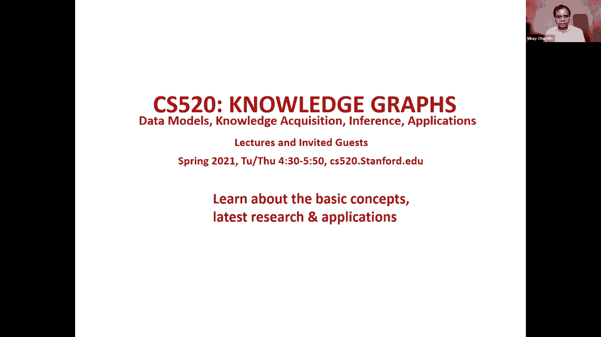
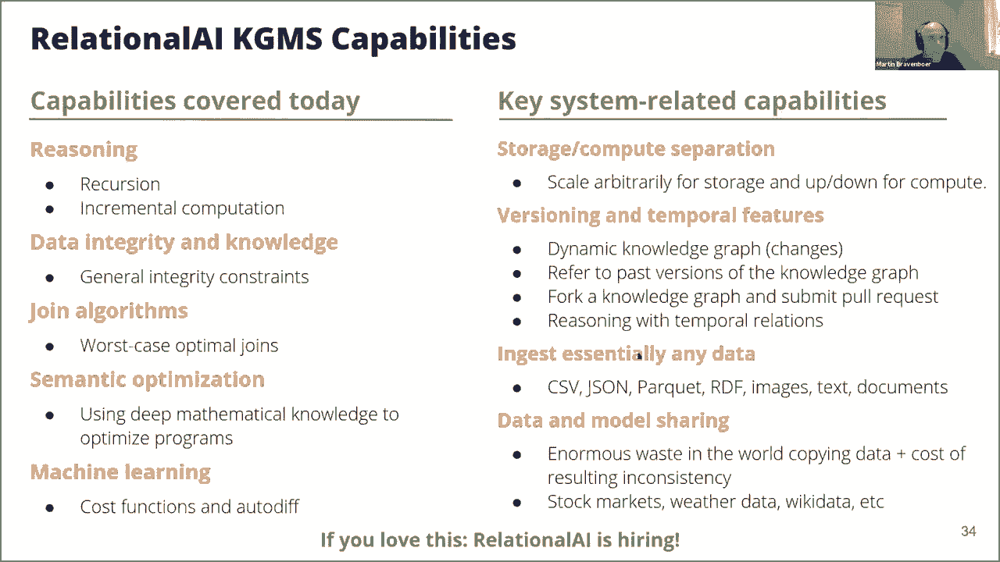

# P18：L12.1- 图谱关系学习与管理 - ShowMeAI - BV1hb4y1r7fF

欢迎来到今天的知识工艺研讨会，我们在课程的第六周，我们的，重点是上周，知识爱好者的一些推理算法，我概述了通用，我概述了通用，图推理算法分类，推理和基于规则 推理，今天我们有两个优秀的演讲，者和我们一起。

推进这个对话 martin，breven，bohr 当存储层恰好是一个关系系统时，他将告诉我们，bohr 当存储层恰好是一个关系系统时，他将告诉我们，关于知识图谱的高效推理算法，而 jochen。

u 将向我们介绍如何 我们可以将，知识图与，神经网络结合使用 我们。

将从马丁开始 呃马丁交给。

你 好的谢谢你 我会分享我的屏幕，[音乐]，就在这里 我们来做这个，coco 是的 是的 好的 欢迎大家，谢谢 你加入，我的名字是马丁布兰芬博格，我为，呃关系人工智能工作，我将谈论关系。

知识图谱管理系统，好吧 好吧 所以这里有一点，关于关系 AI 所以关系 AI，开发了我们所说，的关系知识云管理，系统或 kgms 这是我们，试图，创造的术语 kgms 是数据库管理系统的一个旋转。

创造的术语 kgms 是数据库管理系统的一个旋转，它基本上强调 我们的，系统是，为知识图谱设计的，但是已经，测试了一个成熟的，数据库管理系统。

的功能 kgms 使用了一种我们命名为 rel 的声明性语言，的功能 kgms 使用了一种我们命名为 rel 的声明性语言，这种语言现在是，专门为知识图谱应用程序设计的，专门为知识图谱应用程序设计的。

所以遗憾的是我只有 30 分钟 我，没有时间真正定期，深入研究 rel 的设计，所以我将在这里使用一些示例，然后我将依靠，您的直觉，希望您，理解这些示例的，作用是的，所以我 将花时间，研究。

为什么这个系统是相关的，这，对于目前的地面系统来说肯定是不寻常的，对于目前的地面系统来说肯定是不寻常的，呃我们如何定义知识以及，它是什么意思，在某种意义上管理知识图谱，就像我们有许多。

与 kgms 系统相关的功能，但这并不是演讲的重点，所以我只会偶尔，提到，好吧，我们也这样做，但这，可能更适合系统观众，可能更适合系统观众，在某些时候，好吧，首先我想简要回顾一下，关系模型，嗯。

所以关系模型使用关系，来表示所有数据，关系模型的目的，是将所有物理数据，表示和，索引选择与应用程序分开 逻辑，所以这个想法是应用程序，逻辑完全独立，于系统本身正在做什么，并且系统可以最大限度地。

并且系统可以最大限度地，以任何可能的最佳方式执行应用程序逻辑，是的，至少对我来说非常重要，意识到这一点 sql 只是，关系模型的一种查询语言，您今天看到的是另一种语言，您今天看到的是另一种语言。

尤其是 rel um 和激光球，不应该，不应该，因为现代应用程序的 sql 挑战而被忽视，我经常看到人们，像一个 sql 示例一样拉起来，好吧，这很难表达，续集，他们用它，来倡导完全，不同的数据模型。

所以我们是 尝试做的是，坚持数据模型，但改进，创意语言，好吧，所以马丁我收到了某人的评论，好吧，所以马丁我收到了某人的评论，说音量太低我可以听到你的声音，但是如果有任何调整你，可以在你的最后。

做 我会把我的鼠标靠近麦克风，是的，这已经更好了，是的我也听到你的声音也很好，所以，好吧好吧让你知道谢谢你嗯，是的在这里调整任何东西有点棘手，所以，我会 继续前进是，的好吧好吧好吧所以让我们。

开始看一个非常简单的有，向图所以有向，图可以用，图可以用，我们称之为广告的二元关系表示它基本上，包含一个元组每个 s 在，图，中，例如这个 ad ca 在这里，表示为 hca，希望这是相当简单的。

希望这是相当简单的，所以属性图也可以表示为，关系，所以笔记的属性是二元，关系，就像我在，这里有一个电影笔记，我是，将扩展 uh 的标题是，127 小时，你会看到这里表示为。

与 m 和 127 小时的二元关系，好吧，像电影，这是一部电影这样的注释的标签，是一元关系，这就是你，在这里看到的，好吧 所以现在我们稍微扩展一下这个图，我们在图中引入了两个额外的注释。

我们在图中引入了两个额外的注释，它们都有两个标签，比如呃，丹尼·，博伊尔，既是导演又是制片人，他导演了这部电影 127 小时，而詹姆斯·弗兰科既是演员又是制片人，一个画家，他在这部电影中，表演是的。

所以这就是你在这里看到，的导演d制片人d，呃这个人d他的名字是danny boyle他，导演的电影，杰伊是演员画家是演员而，杰伊有他的n ame james franco 好的，所以边上的属性。

例如让我们说，james franco 扮演，了 aaron ralston 的角色，它们变成了三元关系，也称为，它们变成了三元关系，也称为，图术语中的超边，所以例如，你在这里看到这是一个三元。

关系 是的，所以在属性图模型中，所以在属性图模型中，笔记上也有属性，这些属性将集合作为值，就像这里的值 显然，james franco 在关系模型中有，他的昵称 ted，和 teddy um，这些。

被很好地统一处理为，关系，就像你会看到的那样，关系，就像你会看到的那样，对于 j 的昵称，这里是单独的事实，但，j 的昵称也是 10。好吧，所以 rdf，也可以用关系表示，也可以用关系表示。

所以每个三元组都变成了一个元组，谓词作为关系的名称，例如 呃这幅画的名字，是蒙娜丽莎所以，类型是画，所以你在这里看到我们把，谓词放在这个元组的名字位置，谓词放在这个元组的名字位置，然后有 它的关系类型。

表明这个 p，有类型画，画的名字，是蒙娜丽莎，是的，同样的，它是，这个的创造者是 呃 leonardo da，vinci，呃，他的名字在那里，类型，是 person，好吧，呃。

所以最后一个呃 sql 表也可以，用关系来表示，最好多花一点，时间在它上面，因为你做的，与，有时它呈现的有点不同，所以我们，喜欢看到 sql 循环数据没有，本质上的不同 从，知识图中。

所以 sql 表通常表示为一个，单一的关系，这就是你在这里看到的这个，因素，这是一个包含客户数据的订单表，因素，这是一个包含客户数据的订单表，订单和价格可能是一个单一的，关系，但它看起来。

不太像一个图表 这与，不太像一个图表 这与，我们在之前的幻灯片中看到的非常不同，嗯，所以我们喜欢，把表格形状更像一个，知识图，在那里你有，订单的注释，然后，是 d 的属性 它的不同属性，并。

是 d 的属性 它的不同属性，并，在我们的关系系统中以与我们，在前一张幻灯片中所做的基本相同的方式表示，是的，所以，将有，一个键 a one 和一个客户 500 以及，此订单的日期和价格。

我稍后会提到的改进，我稍后会提到的改进，是我们使用表名顺序作为，分组构造，稍后我将解释，我们如何处理，这正是您在此处看到的内容，这正是您在此处看到的内容，一个快速提示，好吧，到目前为止。

我们希望看到的是，我们证明了，关系基本上可以用于，所有数据模型，并且它们对图形非常有用，嗯，我想强调的是，我没有提出，这个来强调我们是 对于，表或 rdf 或属性图，它们，都是，非常有用的建模学科。

我们，只是想指出，关系模型捕获了所有这些，因此如果我们构建一个基于关系模型的系统，那么我们可以，处理 所有这些不同的，模型作为进口是的，所以接下来我们要，讨论我们如何为我们的小组定义知识。

讨论我们如何为我们的小组定义知识，如此推理，因为 vinay 已经，在周一和图形，输入中进行了大量解释，基本上意味着我们使用逻辑，来定义如何 导出新的边标签，和注释，因此作为第一个示例，让我们看。

一下这个三角形查询，它也将，在其他示例中的其他地方重复使用，因此我们正在寻找的查询，可能最好通过查看，这里的图表来理解 然后这，是rel um的第一个小片段，所以我们正在寻找导演这部电影的导演。

所以我们正在寻找导演这部电影的导演，并且同一导演有一个孩子，在同一部电影中演出，好吧嗯，这肯定会是一个，有趣的情况，显然它，发生了，呃不 所以实际上你基本上，以同样的方式编写它。

它与 sparkle 实际上非常相似，以同样的方式编写它，它与 sparkle 实际上非常相似，至少在这个例子中是你，只写了，图形模式的属性 就像，d 已经导演了 m uh a 是 d 的孩子。

并且 um a 已经在 m 中扮演了角色，好吧，好吧，所以再举几个推理的例子，呃，只是为了给你一种我，不想花太多时间的感觉，这是因为 finna 已经很好地，解释了这一点，我们所做的是呃。

与那里已经涵盖的内容没有太大不同，与那里已经涵盖的内容没有太大不同，但我将简要举一些例子，例如，在这里你可以，使配偶对称，所以假设它是，同样早些时候，研讨会上 wikidata 的人进行了一次演讲。

他指出关键，数据图现在有多不，数据图现在有多不，完整，你可以用这种定义来完成它，你可以假设，配偶是对称的，你真的想，确保那些 x 的，在图中是对称的，您可以像这样定义它，您还可以导出新的标签注释，因此。

您还可以导出新的标签注释，因此，假设您有一个国家的国家代码，即荷兰，您可以明确地将其标记为，您可以明确地将其标记为，荷兰，现在如果您知道 如果你，知道某人，是该国的公民，也就是，荷兰，你也可以说那。

个人是这样的，我有一个标签，你可以方便地在查询中使用它，好吧，所以我们也支持聚合，所以，这个例子在这里 计算，图中，的边数并计算图中的所有边，下一个示例对每个节点执行此操作，即出度，因此它计算，即出度。

因此它计算，从节点 x um 发出的轴的数量，然后最后一个，示例，是 我认为最复杂的一个，是 我认为最复杂的一个，是聚合组，对于所有事情，你总结了所有团队成员的工资，对于所有事情。

你总结了所有团队成员的工资，嗯，好吧，所以希望你可能对，所以希望你可能对，这里使用，的精确语法有很多问题，我无法真正解释，希望我们会在某个时候跟进，希望我们会在某个时候跟进，但我希望措辞，清晰。

并且您可以直观，地了解这些查询所说的内容，好吧，所以对于 kg 方法，版本，我 非常重要，因为现在许多图，播放器实际上是递归的，通常你好世界这个例子，是图可达性，也称为，传递闭包。

所以你在这里看到这个例子，所以注释是，可达的，有一个添加，如果有 x 和 um，它也是可达的，如果有 x 和 um，它也是可达的，嗯，从中间，节点到 b 是合理的，所以这是一个非常简单的例子，就像。

大多数 uh 喜欢 sql 支持者以及，在某种程度上加密那些和，其他语言现在 rel，支持任意用户定义的相互，递归，uh 所以你可以定义任何 一组，你想要的相互递归规则，递归也可以涉及，聚合。

所以这里的这个例子是，短点，它需要最少的间接广告，比如让我们说，嗯，比如让我们说从 x 到 y，例如，um 或者在较短的点到，中间 注意，剩下的，长度可以到达 y，好吧，第二部分例如。

这里你从 x 到 t 到 y，就像这条路径实际上比，那个 p 短 艺术所以你需要考虑，是的，所以现在从系统的角度来看，有一些像我想真正提到，这个但不解释太多的是，我们实际上，也可以缓存和增量。

维护这些结果，这样当你更新 知识，图实际上导入了新数据，所以我们，基本上支持动态图，这个计算也是，增量维护的，所以我们为此使用了一种称为，差分数据流的，方法，如果你愿意，你可以找到，关于它的论文。

其他人也发布了，所以是的，所以我们到目前为止所做的是我们使用，可用于派生，新边的约束，但通常实际上解决，问题实际上并不是适当的，解决方案，您实际上想要拥有数据，完整性 在统计数据中报告违规。

完整性 在统计数据中报告违规，因此我们支持完整性约束，因为它们用此 ic 指示，并且这些不会，像约束那样修复问题 在前面的，幻灯片中，但它们会阻止任何，违反约束的更改，嗯，所以这里的例子是每个。

演员都需要是一个人，所以如果你真的这样做，我们将给你一个违规，而不是让每个演员都成为一个，人，人，是的，你也可以用代数的方式更简洁地写出来，这样你就可以，说演员是人的一个子集。

这将强制执行与此完全相同的，事情，你也可以，说，让我们对父母说 x，和 y 都必须 作为一个人，它，类似于使用女性的例子，类似于使用女性的例子，嗯，你可以说一个，人应该只有一个生日，而函数是，库。

中的一个抽象，它确保它的参数有一个，函数依赖，所以你也可以 定义，像这样的更深层次的知识，这些知识，像这样的更深层次的知识，这些知识，通常在某种程度上被模式语言捕获，现在您还可以定义。

实际上将被强制执行的任意逻辑信息，的东西 mple 你可以指定配偶，必须是对称的，所以不是修复它，我们，说它必须是对称的，如果出现问题，这将被违反，并且位于必须是可传递的。

稍后我将指出我们如何 使用这种，深厚的知识也可以优化程序，好吧，所以图语言与 sql 的一个关键区别，所以图语言与 sql 的一个关键区别，是，它具有，通过模式和数据，编写查询的内在能力。

这有点像一口口水，我将尝试解释我的，意思 这对于，知识图应用程序非常重要，因为您，想，探索存在哪些关系，您不一定，探索存在哪些关系，您不一定，预先知道架构，或者您将，架构作为参考，您，完全知道您想探索。

实际发生的事情是的，所以在 sql 中，您，可以 当然创建目录，但您不能立即使用，目录查询的输出，来同时创建它清楚的，其他东西，就像，只是清除目录不是，标准 非常，优雅，现在很难做到，在。

闪耀中这很容易，因此您可以清楚地了解，因此您可以清楚地了解，从丹尼·博伊尔到 circa 之间存在的所有联系，这，恰好是，他们在电影史蒂夫·乔布斯（Steve Jobs），中的合作 模式级查询。

因为存在的关系类型，通常被认为是模式让我们说，是的，所以，这实际上是一个非常重要的，功能，接下来我将向您展示我们如何处理，它，这也是，为什么它是关键原因，为什么它是关键原因。

除了用于 sql 数据库之外，很难编写诸如通用页面排名或相似性之类的东西，因为您需要能够对此进行，一般遍历访问，并且 sql 模式没有叠加图，并且 sql 模式没有叠加图，可以反映并，执行算法 同时。

好的，我们确实支持，所以在 rel 中，你可以做的，是将关系分组到，模块中 呃它有点类似于命名，子图，嗯 所以这就是电影画面 h 在这里，和使用总点数，这意味着将所有，存在于电影图形中的关系带入范围。

然后可以，为它们实际定义的关系自行创建模块，以便您可以反映它们，所以这是 rel 变体，之前的 sparkle 查询，我们为这两个人之间存在的边类型创建了，我们为这两个人之间存在的边类型创建了，是的。

所以，l1 和 l2 是关系的类型，l1 和 l2 是关系的类型，b 是中间注释，在这种情况下它将是史蒂夫·乔布斯的电影，因此，由于通用图形算法，我们也可以使用模块作为，参数，就像，我刚刚解释的那样。

假设，有一个通用库功能，页面排名，你给它整个电影图形，它会计算该电影的基本排名，电影图表和，电影图表和，没有相似性的相同，你也可以做，你也可以抽象你的，推理规则，比如假设，它们对你的规则非常糟糕。

那么你可以抽象 在，你的逻辑中，比如如果，你有信息，比如，某个国家的公民被称为某个国家，的公民，比如荷兰公民，被称为荷兰人，那么你可以，像我之前手动编写的规则一样自动标记。

像我之前手动编写的规则一样自动标记，每个人都一样，英国人也一样，等等，所以你可以想象一下，如果你，参考之前的大数据，呃呃谈话，这个人正在，解释以这种，方式定义所有这些不同的，约束需要多少工作 你可以。

约束需要多少工作 你可以，用代谢组抽象出其中的一些约束，好吧，所以我们强调了，好吧，所以我们强调了，在无法无天的，图系统中进行表达推理所需的一些成分，如递归，模式级别的特征和技术，优势。

现在一个关键问题是我们如何实际，制作 这表现，得很好，就像你肯定，会观察到，如果你提供知识图，sql 系统就，不会执行，应用程序或，图形问题，事实证明我们，实际上需要新的，连接算法，我们一直在。

发明这些连接算法，嗯，所以当前基于 sql 的系统他们使用，二进制连接，它总是一次连接两个表，但问题是知识，但问题是知识，您实际上同时连接了许多关系的图形，您选择的任何二元连接顺序，都会有非常大的中间。

中间结果，所以让我尝试解释一下这，意味着我们将回到我们的，三角形查询，这是确切的，和我之前，展示的相同的问题，现在这里有三个关系，现在选择两个，基本上你，可以选择的所有选项都不好。

就像如果你选择导演和孩子，然后你首先加入，那么你会有更多 结果比董事人数多，因为大多数，董事都有孩子，而且，很多人可能不止一个，如果您选择董事，您必须，以任何特定方式缩小搜索范围，和扮演呃。

这也有点糟糕，因为唯一的共同点是 m 并且，每个推动者都有导演和演员，所以，你会得到乘法效应，这也不是一个选择性的查询，嗯，如果你加入孩子并参与，其中 也不是很好，因为每个，演员都有父母假设，地面。

在一定程度上完整并且也，在一定程度上完整并且也，只会让它变得更大所以这个问题，是，这些从业者经常抱怨，关节不好的原因之一，因为他们根本不这样做' t，在许多现有系统中为人们执行。

在许多现有系统中为人们执行，所以我们现在尝试使它们更好以，解释呃这些联合，算法如何工作我将从，一个稍微简单的，例子开始加入一元关系所以，与一个参数的关系，和这些可能是标签 呃，属性图中的标签。

所以我们要做的是我们，要寻找你正在寻找，一位获得奥斯卡奖的女性亚洲导演它，恰好就是其中之一，今年被授予的一个，我们现在，将尝试在传统系统的数据集中找到那个人，结果，结果，是你会选择其中一个。

你会遍历所有值，然后检查其他值 如果，这，是一个存在与否的值，那么这样，做的代价是昂贵的，因为您实际上可以，很好地利用稀疏模式，就像，假设在这个领域没有奥斯卡赢家，所以你不必检查。

这个领域的任何这些人 除非他们是这个领域的，奥斯卡奖得主，否则没有导演，所以你们，也可以忽略所有这个领域，好吧，所以我们使用了一种叫做，brisket 最佳联合算法的东西，呃已经证明这。

基本上是一个联合算法类，被证明是 更糟糕的是最优的，所以没有更好的联合，算法，至少在最坏的情况下是可能的，至少在最坏的情况下是可能的，嗯，好吧，所以我不能真正详细，说明这是如何工作的，就像我会发布。

幻灯片一样 并且我会，提供一些关于它的论文参考，但你可以看到的一件事是，在，七个步骤中，我们设法找到了我们的奥斯卡奖得主呃，克洛伊的方法，而在其他任何连接，算法值中，它是一种关系的比率。

它将 现在采取更多的，步骤，好吧，这很令人兴奋，但是，对于单一情况，最坏情况下的最佳，联合实际上与，您之前在数据库类中可能听说过的合并联合非常相似，您之前在数据库类中可能听说过的合并联合非常相似，现在。

这些助学金最佳，联合算法的有趣创新，是 他们，在连接所有区域的关系时连续使用这种方法，在连接所有区域的关系时连续使用这种方法，所以让我们调查它的样子，所以让我们回到我们的三角形示例。

所以如果我们首先连接变量 d，然后而不是计算 child 的完全，连接并指导，我们实际上只 寻找，导演了一些电影，并有一些孩子我们还，没有寻找特定孩子的特定电影，没有寻找特定孩子的特定电影。

所以我们只绑定d 我们将，它绑定到董事的一个子集，因为哦可能有一些，董事我们没有孩子，我们没有绑定任何其他东西 所以，这比现有的董事数量，这比现有的董事数量，少 所以现在我们有广告 我们正在解决。

这个问题，所以我们要搜索已知的 ds，现在我们要找到 ace，嗯，所以现在我们必须找到呃，孩子，他们在某部电影中表演，呃，这很有趣，我们正在 仍然，没有在寻找特定的电影我们。

只是在寻找一个现在是演员的孩子，这，实际上是一个很好的问题 因为，可能没有那么多呃导演，的孩子表现得很好 他们，可能是少数但他们是 不是，他们没有那么多嗯所以这是一个非常，有选择性的理论所以这是好的它。

比前面的右边更好，然后最后我们，通过启动 m 的开关来连接三角形，通过启动 m 的开关来连接三角形，um 现在我们基本上是给定的，d，我们正在寻找嗯一部，具体涉及的电影 那个。

呃演员 a 和导演 呃所以是的，所以我们是，这样的 这些与最佳关节，算法 三角形理论，是可能的最佳关节的最好例子，他们非常擅长这一点 总的来说，这种，方法，对知识非常有用，涉及许多重音和。

标签的图形查询，是的，所以我们使用，是的，所以我们使用，这些算法的即时编译变体，称为 doctal Joint，现在有什么影响，所以，让我们说我们在我们的库中，有一个定义 三角形，计数 这里有一个，呃。

它是一个通用抽象，你可以为给定的图实例化，现在在其他系统中，比如在 cypher，中，例如，有一个名为 uh gds 的库，它定义了所有这些图算法，但实际实现 实际上是在 java 中，所以它实现。

了一个特定的算法，呃，如果你，使用三角形创建密码，因为你不知道这一点，或者假设，你不承认你是 crea，准确地说是一个三角形查询，那么你的性能会差很多，因为它们没有实现这些类型，的连接算法，是的。

现在在老虎图中类似，呃你，有一种叫做 d sql 呃的语言，它至少不是 java javascript，它更好，它是一些，它有点 声明性的，但你，仍然在编写更多的算法，这使得系统。

对于那些没有高级算法知识的人来说当然不太容易使用，对于那些没有高级算法知识的人来说当然不太容易使用，好吧好吧，所以这里有一些参考资料，我不会花太多时间，有了这个，但我们将获得切片紫色，列表，如果您。

希望前两个是由我们的同事编写的，您可以使用它作为参考，呃第二个是，现在成为一个非常有名的算法，呃它甚至正在找到它的方式 进入，教科书，这是很棒的，在这种情况下，后两个很有趣，因为，这些人一直在。

研究使用这些算法来实现，闪光，人们甚至实施 为珍娜 嗯 ed，并且有非常有希望的结果，可能会从那个 um 中产生所以，我们将发布这个和幻灯片，然后希望你能成为其中的一些，非常有趣的人，所以我们希望在。

某种程度上证明是为什么，最坏情况下的最优联合算法，对图，查询以及推理和知识图，系统都有好处，所以现在我们，甚至可以利用用户定义的知识，来使系统实际工作，得更好，所以我们要研究一下，所以没有。

我 已经讨厌，通常我们的目标是让用户，编写非常高级的声明性，规范而不是算法，我们不希望人们拥有算法，专业知识，然后我们的系统使用所有定义的，知识或语义，来使这些程序更，有效地运行 所以这方面的例子是。

一般数学模型，例如，关联性和居中属性，关联性和居中属性，还有用户指定，的信息 自己喜欢函数依赖，或其他交互约束，现在来介绍这意味着什么 我，将举几个非常简单的例子，我们将看看更有趣的东西，嗯。

在第一个例子中，水泥优化器能够，确定 f 和 g 是独立的，因为，它们由不同的变量索引，i 和 j 之间没有联系，是的，嗯，所以它也知道，在这种情况下最小分布超过加法，这意味着我们可以推，东西。

我们可以把它们放入推最小值，呃，进入加法，突然在第二个例子中现在，要计算的要少得多，这没有，应用，因为它们不是，独立的，所以它们都有相同的，索引，所以优化器知道它，不能在那里和那里应用它的优化。

第三个例子语义，优化器知道计数，分布在，我们在这里做的笛卡尔积上，然后我们可以计算这些 e，分开，然后将结果相乘，这避免，了对巨大的笛卡尔积计算迭代，所以这就是我们，对这个基本 id 的意思。

所以让我们看看，它在一个更有趣的例子中，做了什么，假设我们写了一个 计算，图中所有路径的长度，因此我们在两个节点之间指定了一个长度关系，因此我们在两个节点之间指定了一个长度关系，我们递归地定义了如何。

计算，长度 uh 任意两个音符之间的路径长度，可以，然后最后我们计算最短的，路径通过采取，该计算的最小值现在看起来，很棒对它很容易理解，嗯但是评估当然非常，昂贵因为我们不仅。

要计算最短路径而且要计算所有，路径然后进行主要聚合，所以 我们，所以 我们，在我们的语义优化器中使用这种数学知识，包括，在这里的递归中，它知道我们可以在递归中推入，最小值。

并且 um 分布 i t 加法，然后它实际上将逻辑优化，到 dijkstra 算法中，现在这非常酷，当然，我们基本上是在应用，一般数学知识来推导出，一个算法，该算法在某个时候，实际上是由某人发明的。

所以只是为了 下一张幻灯片注意，这，定义了所有对的最短路径，我们将改变它，好吧，所以明年嗯嗯嗯，只是一个小小的解释我们如何，将这些，用作抽象，就像现在这里有这种，长度关系一样，当然，我们实际上不想将。

当然，我们实际上不想将，我们的算法或我们的规范与，我们实际上想要对其进行抽象的非常具体的模式联系，起来，因此我们支持高阶参数，我们只是，用我们想要应用它的加权边来替换长度。

用我们想要应用它的加权边来替换长度，和 然后我们以这种方式实例化算法，我将向您展示我们如何使用，下一个，好的 嗯 所以，接下来使用那个想象你想要，计算培根数，对于知识图谱中的所有演员，嗯。

所以如果你不知道为什么要，所以如果你不知道为什么要，搜索 kevin bacon 的 6 度，嗯，那是在某个时候的事情，因为 kevin bacon 出现在很多电影，中 就像鄂尔多斯数字一样。

你离那个数字有多远，所以我们所做的是我们使用最短，路径，我们给它一个联合星图 uh，将所有边的长度设置为 1，因为我们需要分配一个，x 和一个长度 对它当然是对的，然后我们计算最短路径。

但是然后我们只询问 kevin bacon 的结果，但是然后我们只询问 kevin bacon 的结果，好吧，所以现在要做的是它是，最短路径，记住它不是所有的，对都，正确，所以它会计算。

所有参与者之间的最短路径，然后它将只选择，kevin bacon 的那些，所以这不是很好，所以我们的，优化器可以做到这一点 水泥，理解这一点，它在语义上，理解我们只是在寻找，特定的结果并且它使用 这个。

过程称为 挂载，转换与 metic 集有点相关，转换与 metic 集有点相关，然后它将这个旧的对，算法转换为单一源算法，所以你在这里看到的是，输出，所以这是专门的，它将，中间，聚合推入递归，它。

变成了 一个单一来源的地方，好的，现在这是非常有趣的工作，我们有一些关于这方面的论文，前两个是关于这些 uh，使用居中属性，来优化查询，最后一个是，关于需求转换，再次。

uh uh you 稍后可以从幻灯片中查看这个，uh uh you 稍后可以从幻灯片中查看这个，好的 所以嗯 所以我们，现在已经介绍了一些直觉 呃我们如何，使用，应用程序逻辑的深入知识从债权人规范中。

推导出，本质上有效的算法，本质上有效的算法，现在当然每个数据，应用程序都在那里 实际上使用，了机器学习的某些方面，所以我们如何支持它，所以结果至少 rel 是如此，马丁我们有大约五分钟的时间，好的。

谢谢，嗯，所以 rel 是一种很棒，的特征转换语言，就像你现在可能已经得到，它一样，它不仅仅是一种 graphql 语言，它，实际上更像是一种数学符号语言，实际上更像是一种数学符号语言。

并且 rel 的标准库已经，包含 许多标准转换，包含 许多标准转换，例如三角形计数和，搜索部分不存在，但也有类似 z-score，归一化的东西，它定义，了人们经常用来，获得更好的机器。

学习算法输入的归一化，现在很酷，的是这些特征 转换，它们受益于我们刚刚解释的完全相同的，语义优化，语义优化，和增量维护，因此您可以，定义您的转换，然后如果您，稍微编辑您的输入，它只会。

增量地重新计算现在需要重新计算的内容，增量地重新计算现在需要重新计算的内容，该库还定义了预测，和成本函数，例如 mse 和，rmse 所以它们是在语言本身中定义的，如您所见 在这里，如果你有点眯眼。

你可以，识别出这个数学，公式，因为整个成本函数是，声明式数学定义的，我们，可以很容易地，取它的导数，然后，以更大的下降训练它，这就是，我们所做的，是的 所以我们在这里看到我们，用一个非常。

简单的线性回归，预测函数的例子来实例化成本函数 带有一些特征，集，我们给它 ex 在这种情况下它是，关于生活满意度 所以我们给它，关于生活满意度 所以我们给它，生活满意度预期值，然后我们 实际上可以。

训练回归模型并得到权重，训练回归模型并得到权重，我们可以使用是的现在这是呃，这里有一些有趣的工作，他们今天绝对没有时间解释它，他们今天绝对没有时间解释它，但是我们实际上并没有。

通过创建设计矩阵来做到这一点 但相反，我们实际上直接对，关系结构进行操作，并利用，我刚刚提到的这些语义优化，我真的有一些，下一个很好的链接，所以我，只想，单独讨论一下，所以，如果你对此感兴趣。

我会向你推荐那个，是的，嗯，所以我们也可以在某种程度上，是的，嗯，所以我们也可以在某种程度上，在深度学习上加倍嗯 所以，我们当然已经在我们公司使用，图形横幅和图形神经，网络，但目前这种情况发生在外部。

工具中，与您，使用任何其他现有图形数据库（，如 neo4j 和 micrograph）所做的非常相似，但是该语言实际上在，原则上具有足够的表达能力 实际上，甚至描述了神经网络。

所以我们的目标实际上是在某个，时候我们将与那些，在，数学，上定义的神经网络训练工具具有竞争力，所以我们支持，定义的激活函数，你，在这里看到，我们支持计算激活，我们可以 支持，我们支持对它的培训 挑战。

只是目前，我们主要关注稀疏数据，特别是图 ion，multiple 为此进行了集成，这始终是密集数据，这，不是我们目前正在优化的内容，但很酷的是，这实际上，正是关系模型，打算做的事情，就像它。

声称应用程序逻辑应该，独立于 物理，表征，所以如果我们在评估这，一点方面做得更好，那么在某个时候这将，有望在性能上具有竞争力，有望在性能上具有竞争力，因此这些是我参考的参考资料，因此这里有一些视频。

其中有一些，特别酷的事情是，愚蠢的 psc 学生 那是，这项工作的主要贡献者，他在 jim，gray uh，博士论文奖中获得了荣誉奖，这是非常，令人兴奋的，并且在数据库社区中对这项工作有相当多的认可。

并且在数据库社区中对这项工作有相当多的认可，好吧，就是这样，呃，能力 的曲线在这个，区域，现在还有很多其他东西，也很酷关于我们，所做的更多系统 相关的呃，比如版本控制和时间，能力以及数据摄取。

和与其他人共享你的模型，但，如果你喜欢所有的东西，如果你喜欢所有的东西，比如，首先我提供的东西，也许，还有系统功能 您正在，招聘，所以如果您，对任何感兴趣，请随时与我们联系，谢谢马丁，那是。

一个很棒的演讲，所以我们，将转移到下一个演讲者。