# 【双语字幕+资料下载】斯坦福CS520 ｜ 知识图谱(2021最新·全20讲) - P19：L12.2- 知识图谱介绍 - ShowMeAI - BV1hb4y1r7fF

大家能看到我的屏幕吗，是呀，我们可以看到你的屏幕，好的。

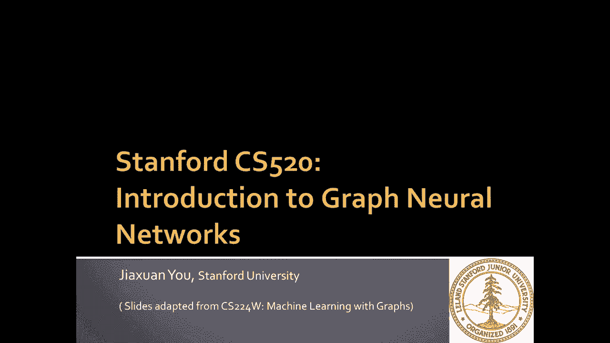

让我。

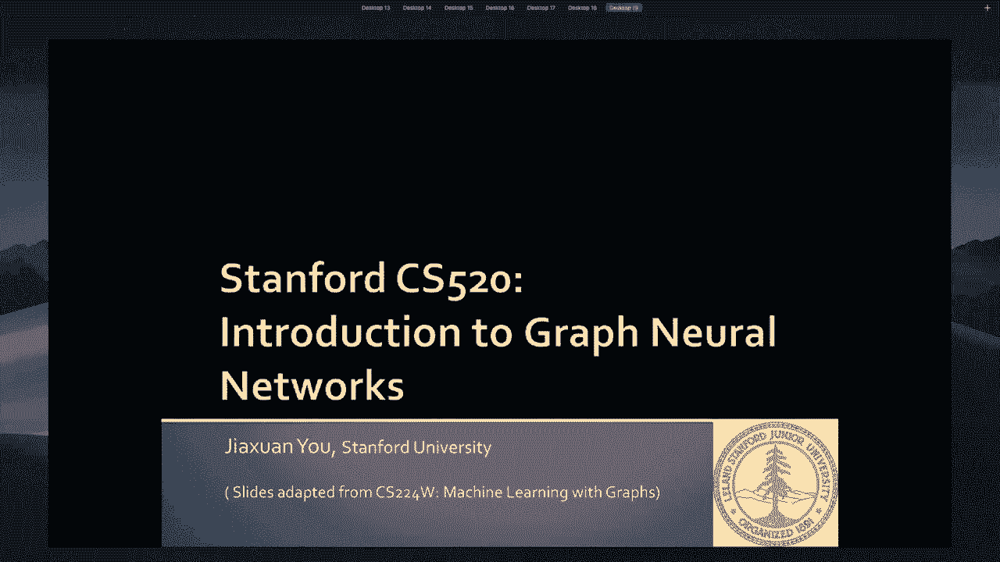

谢谢韦恩向我介绍这个讲座，所以我的名字叫燕瑶，今天我是斯坦福大学四年级的博士生，所以我会谈谈，为什么我们需要图神经网络，呃，什么是图神经网络，及其应用，我所展示的幻灯片是根据CS 2改编的。

我当然是个首席助教，如果你想了解更多，欢迎选修那门课程。

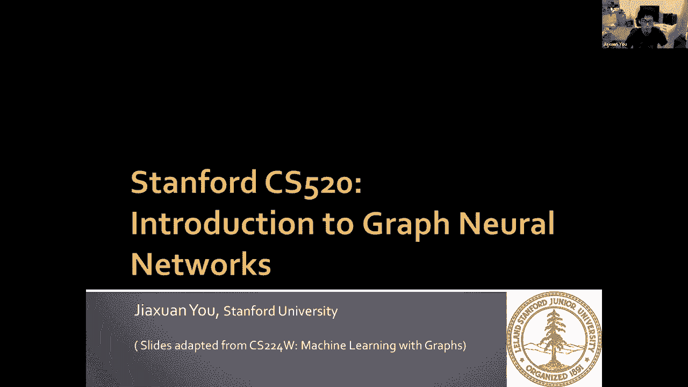

所以我们都知道，在整个研讨会中，许多类型的数据都是图表，你可能见过很多知识图的例子，还有其他现实世界的数据可以用残羹剩饭来表示，例如生物监管网络，相同的图形，呃，代码图，分子，呃。

其中原子边界是节点和边，或者三个D形，呃，其中有一个三维网格，呃，由图定义，我们想问的主要问题是我们如何利用结构，可以帮助我们做出更好的预测，所以我们将通过机器学习的语言来讨论这个问题。

所以我们知道这些复杂的域可以表示为关系图，然后我们将显式地建模这些关系，并且为了实现更好的性能。

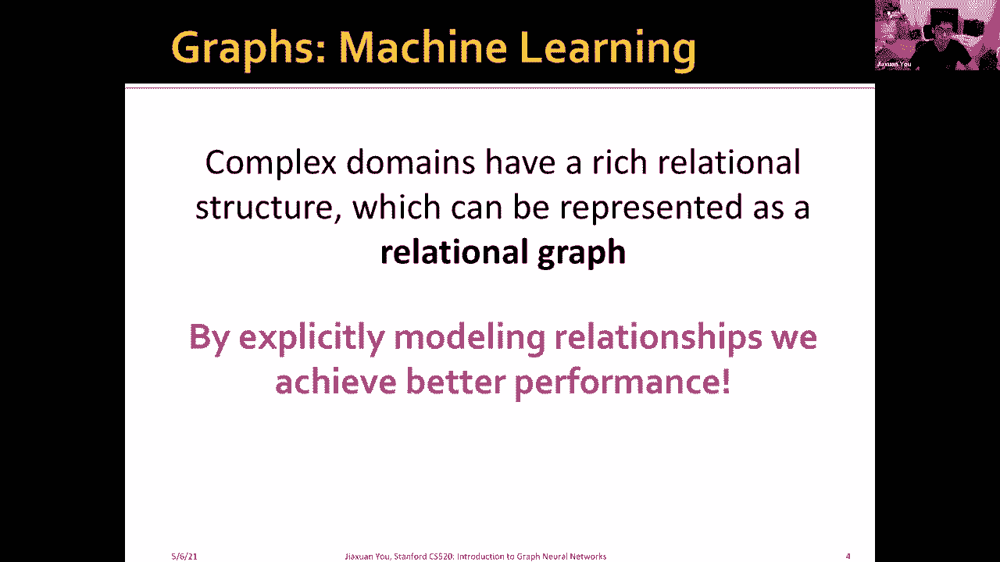

所以我们知道不止不同的工具箱是为简单的序列或网格设计的，例如，呃，我们可以用这个卷积神经网络来处理图像数据，呃，可以应用于人脸检测，我们可以有一些呃，文本或语音数据的递归神经网络或转换器。

它们看起来像序列。

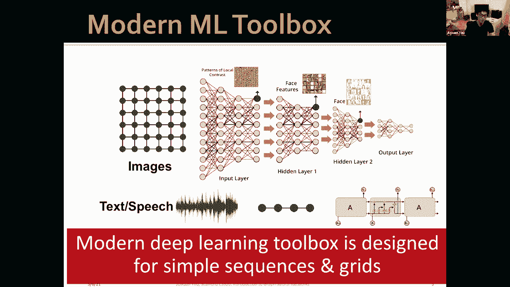

但是更复杂的网络或图形，因此，具体地说，图可以具有任意大小和复杂的拓扑结构，和，呃，它真的没有任何空间局部性，像网格或者序列，我们将讨论的关键概念是嵌入，是节点嵌入，直觉是我们可以映射节点，呃。

到D维嵌入空间，这样图中相似的节点就会更紧密地嵌入在一起，在嵌入空间中，所以更具体地说，我们会有一个输入图，我们想学习嵌入，函数f，这样我们就可以把图嵌入到一些低维节点嵌入空间中。

稍后我们将讨论如何学习这个映射函数f，所以更具体地说，我们的目标是定义两件事，首先，我们将定义一个编码器，它可以将输入网络编码成一些D，维嵌入空间，然后我们定义一些相似性，呃，在输入网络上定义。

这样我们就可以训练嵌入来近似这样的节点相似性，就像我们刚才讨论的那样，有两个关键部件，第一个是将每个节点映射到低维向量的编码器，输入将是输入图中的一个节点，输出将是D维向量嵌入，第二个概念是相似函数。

它指定向量空间中的关系，可以映射到原始网络空间中的关系，所以相似性可能，比如说，就像点积一样简单，编码器的一个简单例子是所谓的浅嵌入，或浅编码器，所以这里的编码器只是一个嵌入循环帽。

假设我们有一个嵌入矩阵，z和每一行将对应于嵌入的一维，每列将对应一个节点，所以让我们说，如果我们想嵌入图中的第五个节点，我们只看这个嵌入矩阵的第五列，该向量将是该特定节点的节点嵌入，我在这里想说的是。

知识图通常只是一个阴影编码器，加上一些相似解码器，所以知识图中的边像一些三胞胎一样猖獗，因此，学习知识图嵌入具有头尾关系，人们通常首先想定义一个浅编码器，基本上他们想，呃，嵌入空间中的模型实体和关系。

这真的完成了，我们正在嵌入查看，因此，每个实体和每个关系都与一个浅嵌入相关联，然后不得不做这个浅编码器，人们会做基于相似性的解码器，所以给一个真正的呃，三连头关系尾。

这里的目标是我们想使用头部关系的嵌入，接近尾巴的嵌入，所以一个著名的例子是Trans e模型，所以这里人们使用翻译直觉，呃，hrt，它们在嵌入空间中，我们想要h加r，呃约等于t，如果给定的效果为真。

如果事实并非如此，呃不存在于知识图中，他们不会平等，我们如何学习这样的关系，这通常是通过评分功能来完成的，所以我们想最小化头部加关系和尾部之间的距离，例如，如果我们从一个节点开始，说奥巴马。

我们将朝着嵌入国籍的方向前进，最终我们可以读取另一个节点，那是美国人，所以这种浅层编码器真的很适合知识图应用，但它确实有一些局限性，所以首先呃，这里我们需要节点数参数的顺序，原因是呃。

节点之间没有参数的权重共享，所以我们需要为每个节点分配一个唯一的嵌入，其次，呃，它本质上是可转换的，所以这意味着它不能为节点生成嵌入，训练中看不到的，想象一下你有一个知识图。

然后有一些新的实体和新的关系，通常你必须重新训练你的系统来学习它们的嵌入，最后呃，此方法不能合并节点特性，所以通常节点和边总是用ID表示，不清楚如何直接使用节点或边缘功能，然而在现实生活中。

许多图确实有一些特性，比如一些用户配置文件功能或一些关系功能，所以今天我要介绍一些深图编码器，然后我们展示了事实上，这种基于图神经网络的方法可以克服这些局限性，越具体，我们将介绍这种节点编码器的一类。

它由基于图结构的多层非线性变换组成，然后呃，一个节点，所有这些深度编码器实际上可以组合在一起，结合知识图方法中定义的节点相似函数，从视觉上看，这是，呃，发生了什么事，所以我们会有一个非常复杂的输入图。

这个图会经过不同的图卷积层，然后输出将是节点嵌入，同时，我们也可以在同样的过程中嵌入子图。

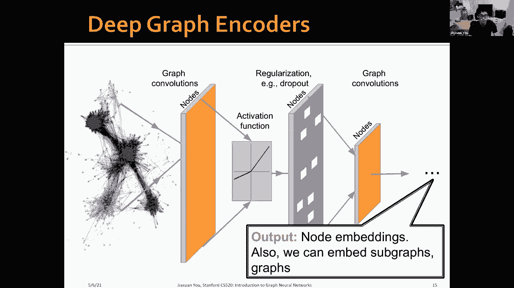

所以我们刚刚谈到了，为什么我们需要图神经网络，现在我介绍什么是图神经网络。

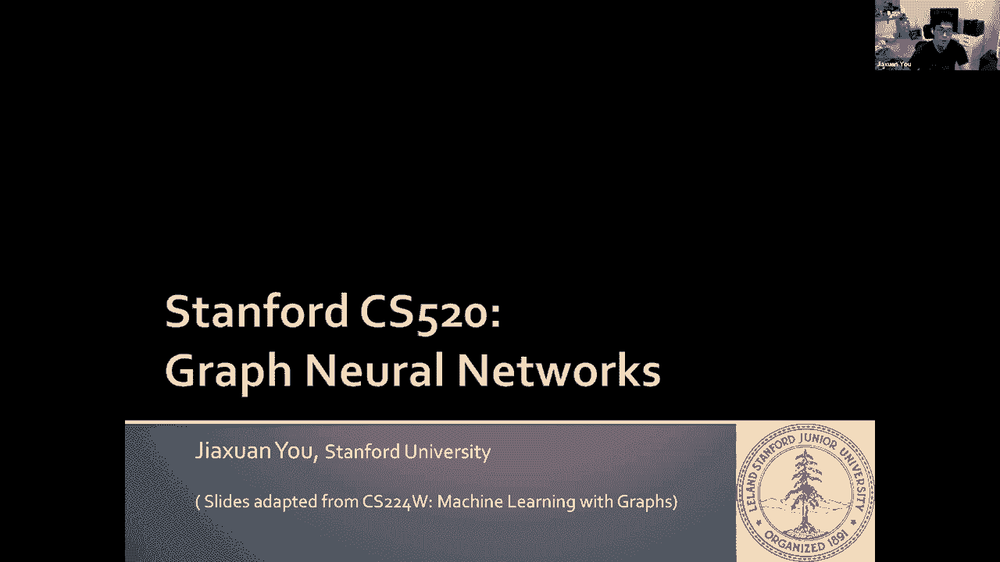

这是我们的设置，假设我们有一个输入图g，其中v是顶点集，A是邻接矩阵，通常只是一个零的二进制矩阵，一个将是节点特征的矩阵，V是图中节点中的一个特定节点，其中nv定义给定节点的邻居集。

所以这里我们假设节点可能有一些特性，例如在社交网络中，呃，用户配置文件将是一些有用的特性，用户图像，比如说，然后说我们的生物网络，我们可以有一些基因表达图谱或基因功能信息，但这些是一些有用的节点特性。

有些情况下我们没有任何节点功能，呃，在那里我们可以使用一些简单的替代方案，比如说，指示向量，所以我们对每个节点都有一个热编码，或者我们只是为所有节点分配一些常数向量，所以这里一个天真的方法真的只是串联。

这个邻接矩阵和这个节点特征矩阵，正如我在这里所展示的，然后我们可以把这样的组合，呃，在表示中转化为深度神经网络，这样一个非常简单的线性多层感知器，比如说，这个想法的问题，这将需要许多参数。

其顺序为节点数，不适用于不同大小的图，它对节点排序也很敏感，所以图神经网络的想法真的是受到了这个流行的，呃，卷积神经网络，想象一下这就是人们如何将CNN应用于图像，所以人们会定义一些卷积滤波器，呃。

然后我们将卷积滤波器在整个图像中卷积，我们在这里的目标是推广这一点，由图像定义的卷积到一些更一般的设置中，同时，我们希望利用节点的特性和属性，所以我们的图表看起来和图像很不一样。

看起来只是一个非常复杂的形状，而且在图上没有固定的局部性或滑动窗口的概念，与从格子图像中学习相比，它有点难定义，以下是我们的关键观察，它可以帮助我们将图像转化为图形，这里我展示了一个卷积神经网络的例子。

用三乘三的过滤器，所以你可以看到输出像素实际上取决于邻居，周围的像素，呃，像素，所以这种直觉也可以推广到图，因此，如果您想学习给定节点的嵌入，我们可以利用它当地的社区，因此使用其相邻的相邻节点。

这里的想法是我们可以在邻居处转换信息，然后组合它，这样我们就可以得到节点嵌入，所以更具体地说，我们先传递信息，h i从节点邻居到，比如说，一些线性变换，然后我们把它们加起来，然后这将是最后的节点嵌入。

我们本可以，现在我要介绍具体的图卷积神经网络，或者图神经网络，它实际上只包括两个步骤，所以首先我们要确定节点计算图，基于节点节点邻域，然后根据计算图，我们将在整个图形中传播和转换信息。

这里有一个更具体的例子，假设我们有这个输入图，我们的目标是学习这个目标节点的嵌入，我们将首先生成早期嵌入，基于本地名称和网络邻居，所以A有邻居，呃，b c和d我们把它们写在这里，c和d。

然后对于每个节点，我们将查看它们的邻居，比如说，b将有邻居a和c，以此类推，所以我们在这里的直觉，我们想在这个聚合过程中应用一些神经网络，这样我们就可以计算嵌入，这里有一个非常有趣的观察是。

您可以看到每个节点都将定义一个不同的计算图，基于自己的街区，比如说，一个的计算图，b，c，d，等，他们很不一样，这样我们就可以学习不同节点的不同嵌入，这种计算确实发生在许多层。

因此节点可以在每一层都有嵌入，一开始，0层，节点特性将只是它的输入特性，x u，然后我们将应用几轮消息传递进行聚合，所以根据零层，特性将通过一跳聚合获得第一个，然后我们将继续进行这个聚合。

最终我们可以得到这个，呃，我们要学习的节点a的嵌入，然后呢，您可以看到，案例层嵌入实际上从节点获得信息，离K半远的，所以A通过一层A能够从一个跳跃的邻居那里获得他的信息，通过两层计算。

你可以从他的两个集线器邻居那里获得信息，接下来我要谈谈我们如何真正定义这个黑匣子，所以这里的一个基本方法是我们将邻居的信息平均，然后应用神经网络，所以你可以看到第一步是平均来自邻居的消息。

然后使用平均信息将应用一些神经网络，这是正在发生的质量，所以首先，我们将使用输入的原始节点特性初始化零层嵌入，十五，然后每一层，输入将嵌入上一层的节点，l，我们把邻居平均一下。

以前的层嵌入以计算此层的消息，在计算之后，我们将应用一些矩阵变换w和b，其中w和b是图神经网络的加权矩阵，他们是可以训练的，经过计算这些信息最终会应用一些非线性来改善，增加GNN的表达能力。

我们将重复这个过程进行L轮，其中L是层的总数，最终我们会得到节点V的最终节点嵌入，这是通过这些L级计算的，gnn层，定义了这个GNN，下一个问题是我们如何训练GNN。

所以我们知道这个gm为我们提供了节点嵌入，cv，呃，训练GNN有两个一般设置，第一个是监督设置，所以我们想把这之间的损失降到最低，呃，节点嵌入和一些目标，呃y，我们想要优化设置的参数。

这是在这个图中定义的神经网络，那么什么是可能的，呃，惠特的可能性可能有一些，呃，可能是一些节点级标签，边级标签和图级标签，这个标签通常来自一些外部来源，我将在下一节给出一些具体的例子。

损失函数是相当标准的，所以如果y是实数，我们会用一些L来损失，如果y是绝对的，会使用一些交叉熵分类损失，另一个设置是，呃，毫不意外，呃，学习环境，而不是使用一些外部源监督标签。

我们将使用图形结构本身作为监督，比如说，我们可以在随机WAL的基础上定义一些节点相似性，或者我们甚至可以使用一些知识图目标定义，比如反转e或旋转e，等，所以这里是我们已经讨论过的概述和总结。

这就是图神经网络的工作原理，所以首先我们将定义邻域聚合函数，然后我们将在嵌入上定义一个损失函数，我们将基于一组节点训练这些嵌入，比如说，一批计算图，然后在测试时得到一个训练有素的模型。

将根据需要为节点生成嵌入，这里很酷的是，我们甚至可以生成我们从未训练过的节点，所以这真的解决了呃，非归纳性。

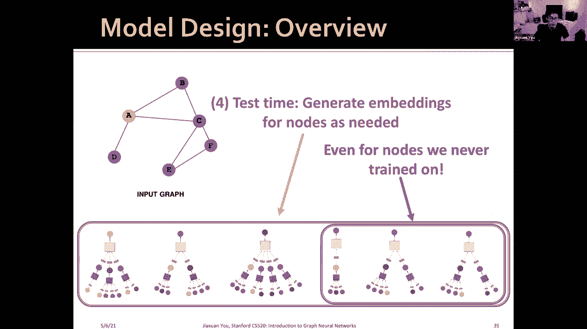

所以现在我在最后一节介绍了什么是图神经网络，我将谈谈图神经网络的一些很酷的应用。

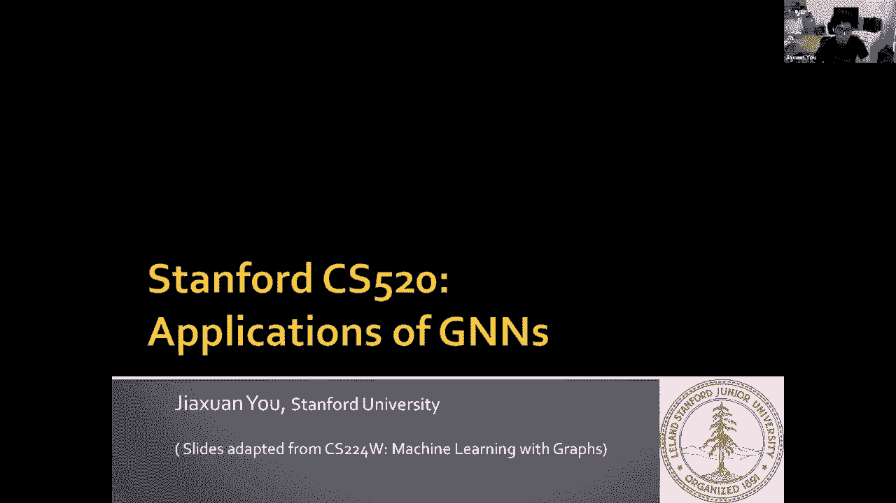

所以有几个重要的任务可以在网络上定义，所以使用图神经网络，我们将能够，所以说，目标是预测的节点分类，呃，类型是给定节点的一些标签，我们可以定义一些链接预测任务。

其中的目标是预测两个节点是否会在图中链接在一起，我们可以做一些社区检测任务，我们得到一个输入图，我们想定义一些有趣的，呃，图中的群落结构，最后我们可以做一些图分类任务，我们的目标是对不同的图进行分类。

比如说，对不同的分子进行分类。

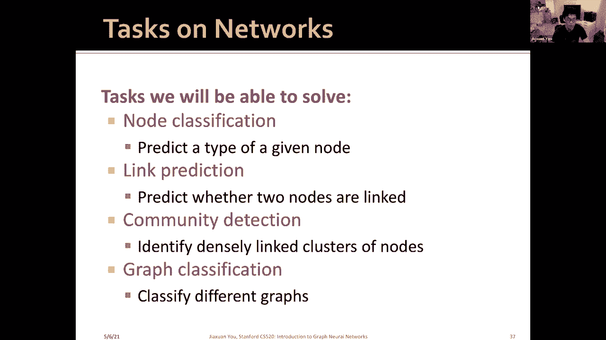

所以我将首先介绍使用图神经的节点级机器学习任务。

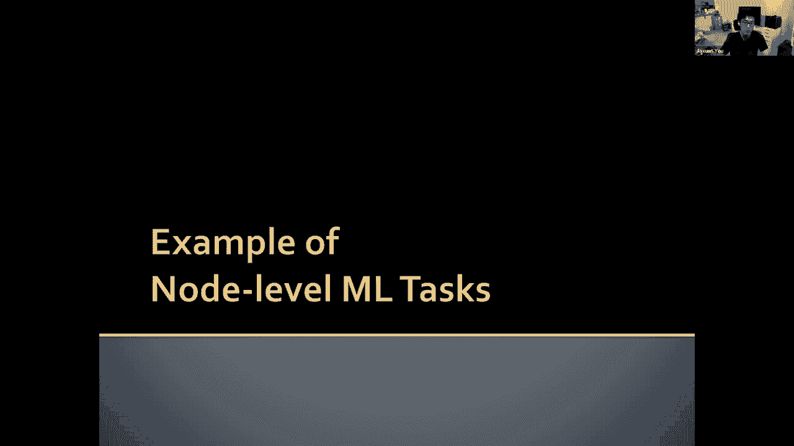

所以第一个例子是做蛋白质折叠，所以蛋白质链从氨基酸序列中获得了天然的三维结构，所以我们有一系列氨基酸资产的信息，最后它会折叠成一个三维结构，蛋白质折叠的问题是，我们想通过计算预测蛋白质的三维结构。

完全基于IS氨基酸序列，所以这里有一些非常酷的预测是由一个完整的团队的深刻头脑做出的，所以你可以看到他们的预测非常接近三个，d结构，他们是怎么做到的，所以他们真的，呃，利用图神经网络技术。

所以他们的主要想法是建立一个空间图，其中节点是蛋白质序列中的氨基酸，边缘是氨基酸之间的接近，这是呃，在三维空间中测量，所以定义了这样一个空间图，他们将应用一些类似于图神经网络的技术来做出预测。

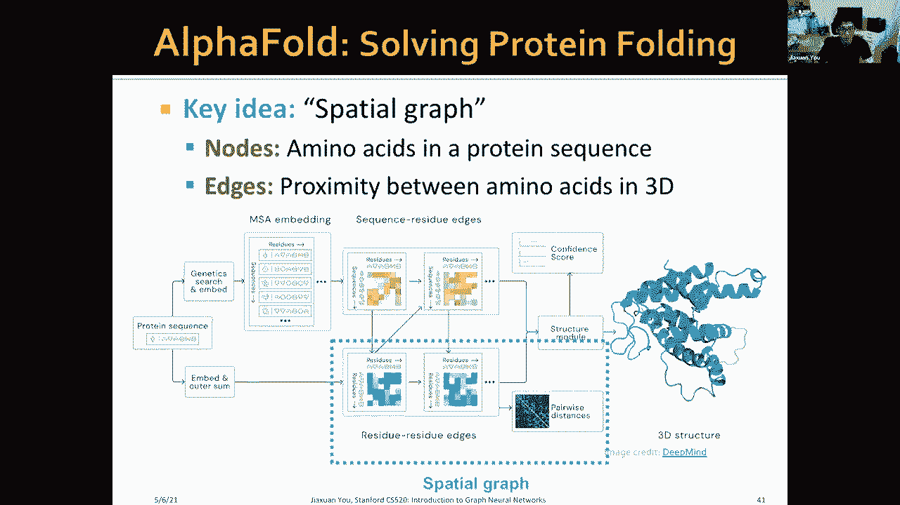

所以我们已经看到了接下来的节点级任务，我将介绍使用图神经网络的边缘级机器学习任务。

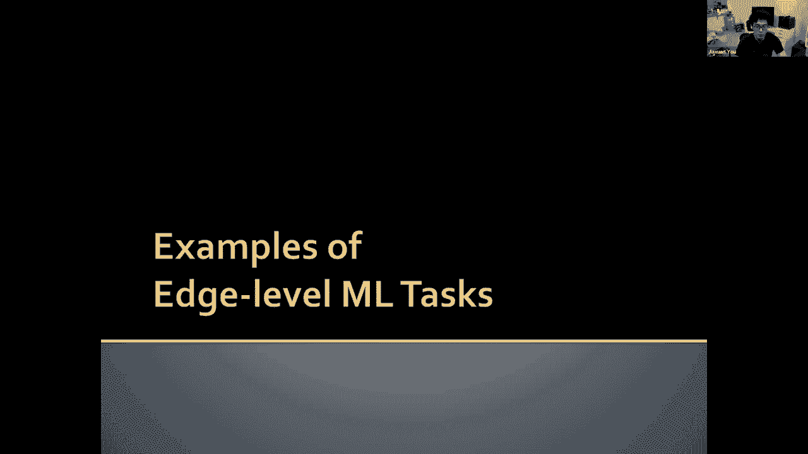

所以这里一个非常重要的应用是推荐系统，所以可以考虑建立一个推荐系统，呃，对于用户项交互图，例如，用户可以看一些电影，买一些商品，听音乐，等，其中节点是用户和项，边缘是它们的用户项交互。

我们这里的目标是推荐用户可能喜欢的项目，比如说，我们有这个用户节点和这个项目否，我们知道用户可能会点击或与某些项目交互，目标是预测未来，就像呃，你可能也会喜欢这件T恤，诸如此类的事情，所以说。

这里一个非常成功的方法叫做PC，使用图神经网络建立一个成功的推荐系统，这里的任务是向用户推荐相关的引脚，例如，我们可以有一个腐肉，这是一个蛋糕和一个成功的信息，成功的推荐将推荐另一次拍摄。

一个糟糕的识别会说，推荐这件有袖子的T恤，我们在这里的目标是我们想在，呃，两个蛋糕靠近蛋糕和毛衣之间的嵌入物，如果我们用边缘水平预测任务训练图神经网络，模型将能够预测图中的两个节点是否相关。

这是推荐系统的核心组成部分。

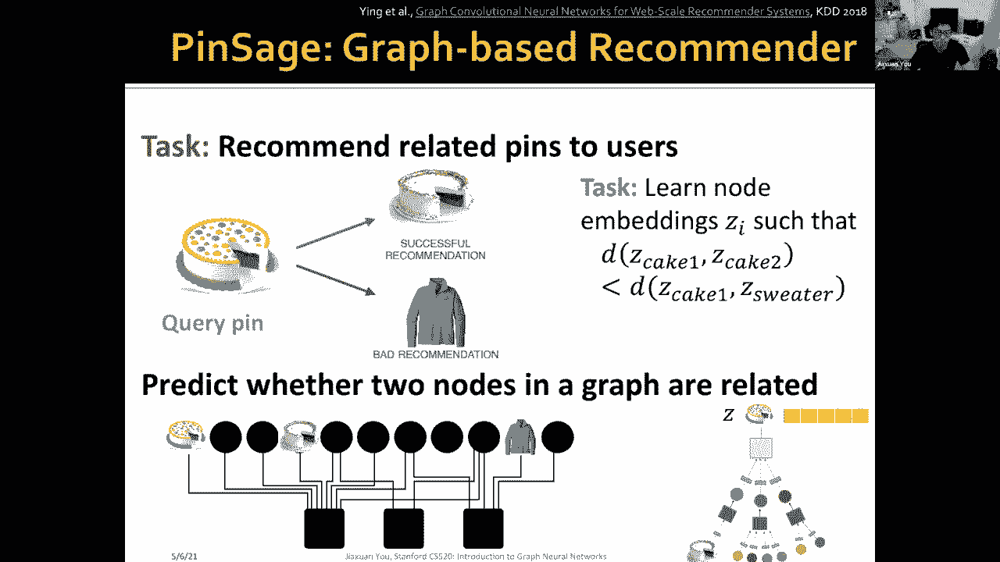

下一个，另一个成功的应用将是将gns应用于子图级机器学习任务。

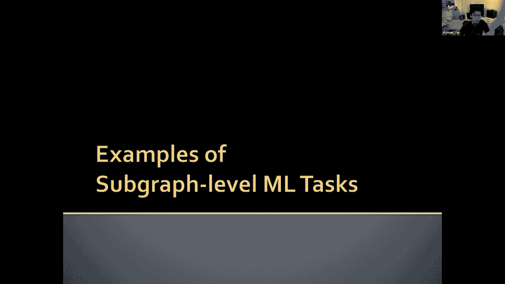

所以这里的例子是做一些交通预测，假设如果你打开一张谷歌地图，你想从比如说，斯坦福大学到呃，UC，伯克利。

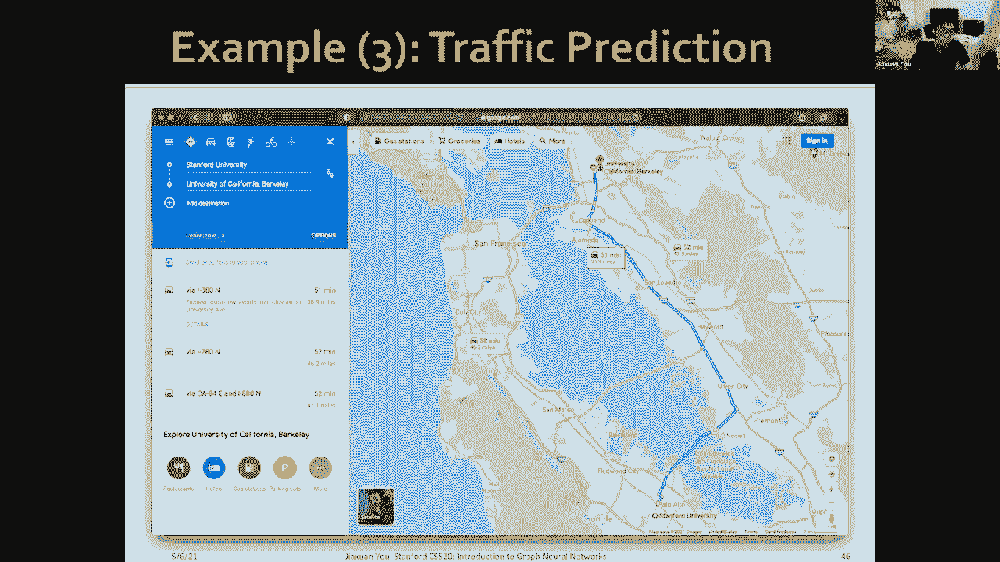

所以这里，底层表示也是一个图，因为你可以把道路网络看作一个图表，其中节点是路段，边缘是这些路段之间的连接性，人们将能够根据道路网络进行交通预测，这里的技术也是图神经网络，这项技术已经部署在谷歌地图上。

看起来呃，它表现得很好。

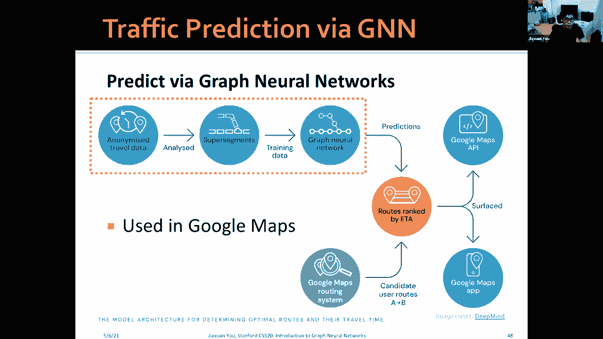

呃，最终，我将谈谈图形学习任务的最后几个例子，即使用GNS进行图级机器学习任务。

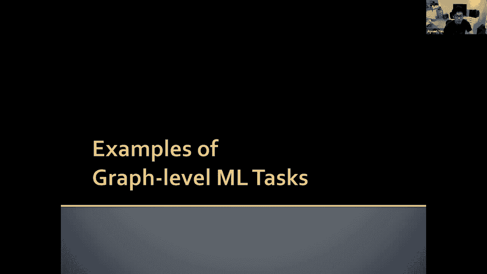

这里的例子是，药物发现，实际上一些小图和边是化学键，所以在这里我展示了一些例子。

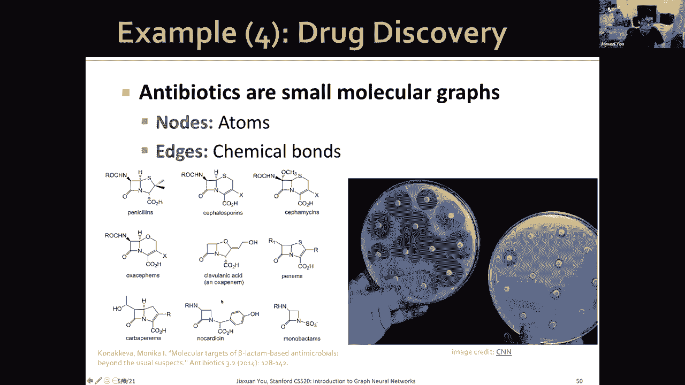

呃，分子，呃，这里的图形，人们已经成功地使用图神经网络来发现抗生素，用这个图，所以这是一篇非常有影响力的论文，去年发表在销售中，所以他们把这个问题表述为一个图分类任务，目标是预测那些有希望的分子。

来自现有候选药物池的药物分子，另一个有趣的呃，这个问题的观点是做分子或图形生成，我们将生成正常的分子，这些新分子有可能用于药物，会有一些非常酷的用例，比如说，呃，我们可以产生正常的分子。

可以有非常高的龙的相似性，或者我们可以优化一些现有的分子，使其具有一些理想的性质，这里的底层模型都是图神经网络，今天总结一下，我已经谈到了神经网络的动机，它们具有表现力和可伸缩性。

我已经谈到了什么是图神经网络，所以这里要定义的关键是一个节点邻域聚合函数，然后我们还需要定义一些损失和训练程序，最后，我讨论了gns的一些很酷的应用，它们真的在不同的层面上发生，它们可以是节点级的。

边缘水平，子图级别或图形级别，正如我以前所说的，我们在课程中有更多的材料，斯坦福系列二，这里是资源，呃，谢谢。

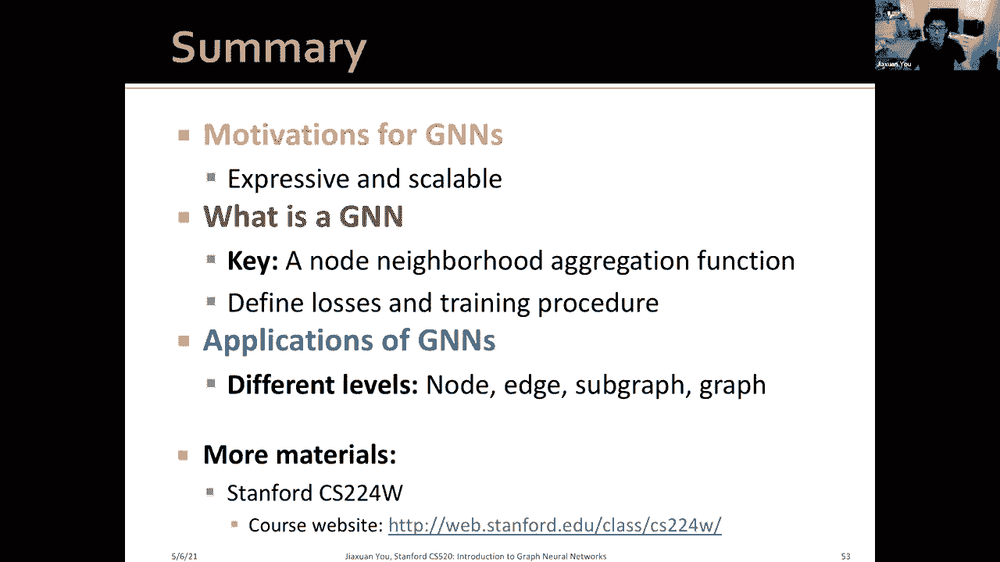

谢谢。肖杜克为图神经网络概述，呃，我们现在有大约二十分钟的时间讨论，嗯，所以看起来班上没有人问过问题，所以也许我会先问一个问题，呃，马丁，呃，我很想知道，你实际上是如何实现最短路径算法的。

所以在周二的课程中，我们讨论了这个，寻找恒星，呃，计算最短路径，你展示了你可以制定最短路径查询，使用查询语言，那么当你使用联合算法时会发生什么，或者下面到底发生了什么，是啊，是啊，它是，是啊，是啊。

是啊，是啊，所以嗯，它有几个不同的方面，好处是，呃，就像它显示的例子一样，从路径计算，计算最短路径，所以这很合乎逻辑，因此，计算的实际评估将发生在关节中，假设这个关系和较短的响应关系是关节。

所以我们正在研究它的一些特殊方面，其中您需要以某种方式计算递归，它实际上具有税务I算法的精确复杂性，当我在那个节目的一篇论文上工作的时候，嗯就是这样，那是即将到来的，所以有一种，有逻辑方面，然后是关节。

在这家伙的诗句中，通过最佳关节，然后是你实际上是怎么做的，计算递归，我在当前没有真正讨论，说话，嗯所以是的，所以再一次，我不太懂你的回答，我是说，您的实现是否等同于星型搜索，或者没有，它会是，是啊。

是啊，我想是的，是啊，是啊，是啊，是啊，是啊，是啊，好的，但现在不是因为递归的事情，是啊，是啊，这就是我所理解的，至少我是，我不喜欢，我是PL数据库的人，我是一个人，我有一个团队，Hong。

是算法的复杂性，呃人，所以他告诉我，这方面仍然需要完全达到，嗯所以是的，是的但是好的一面是，也就是说递归将被实现，基本上适用于任何类型的递归，因此，我们将实施的任何其他问题都将有同样的好处。

基本上所以是的，好的，嗯，嗯，我有个问题，呃，那么你有什么，任何，所以首先你展示了一组非常好的应用程序，或者来自图神经网络，任何申请，呃，在自然语言处理中，弄清楚单词的语义，你做过的等等，呃，是啊。

是啊，谢谢你的问题，所以你是在问，呃，有些，呃，图神经网络良好的自然语言处理应用，所以我个人还没有在这方面工作过，但我在那里听到了很多非常有趣的作品，所以通常人们可以把这个结合起来，呃，知识知识表示。

一些结构，呃，带有一些基础结构数据的自然语言数据集，呃，比如一些，呃，呃鸟或者像那种模特在一起，他们可能会首尾相接地训练，呃，等，所以我想，呃，我的收获是，只要你能够定义这些实体和关系，你就可以申请。

呃，在它之上的图形神经网络，好的，谢谢。是啊，是啊，没问题，好的，所以我们有一个观众问题，呃，图形神经网络能很好地映射到大脑的其他部分吗，或其他奇怪的或系统，是啊，是啊，我觉得这是个很有趣的问题。

所以看起来呃，呃，那个呃，那个呃，观众在问，就像，我们如何在大脑和图神经网络之间进行类比，嗯是的，所以我呃，一个典型的呃，深度学习的家伙，所以我对神经科学了解不多，呃但是我呃，我的理解是，一些相似的呃。

模式也可能发生在大脑中，所以我得谈谈呃的核心，图神经网络是进行消息传递的，我们知道也许在大脑中神经元也传递信息，那里会有一些聚集和转化，所以我认为在这方面我们也受到了大脑工作方式的启发。

我希望我能回答这个问题，酷，谢谢。所以还有其他几个问题突然出现了，嗯，当你处理这些问题的时候，我有个问题要问杰夫，最近，michael janesa得到了亚马逊的推荐，他应该买这本教科书，叫做逻辑导论。

他碰巧是那本书的作者，我自己也是个很好的推荐，但这是一个很好的推荐，但我不认为这会给亚马逊带来销售，我不知道，你对如何，这些推荐系统实际上可以更聪明地了解现实世界的知识，嗯嗯，是啊，是啊。

我想这是个很普遍的问题，我想现在，大多数推荐的系统并不是真正基于图形的，所以人们可能仍然使用那些传统的系统，比如，呃，那些协作过滤，那些矩阵分解，一种呃技术，所以图神经网络在这方面真的很新，呃方向，呃。

但根据我的经验，我觉得呃，这种深度学习方法，他们在这里确实有一些潜在的好处，因为你可以用，那里有更多功能，例如，好的，我想是的，好的，所以我的意思是，在这种情况下，我们想给系统的特性或附加知识。

如果一个人是这本书的作者，那就不要给他们推荐，或者这不是一个好的建议，对呀，那么你如何将其纳入图神经网络，是啊，是啊，嗯，我想，呃，我的理解是，呃，对于深度学习类型的模型，人们会做更少的手工工程，因此。

我们可能不能直接将这些规则注入模型中，但如果我们有丰富的，呃，那些购买活动数据的人，如果我们知道，迈克尔是作者，他不会买这本书，这种训练数据可以通知节点模型，下次如果你想提出这样的建议，好的。

所以你的答案是给出训练数据，对呀，呃，是啊，是啊，我想通常是的，深度学习模型确实需要大量数据才能工作，好的，我们可以增加，所以我们和小溪上的人一起工作，他也一直在这个领域工作。

所以基本上把神经网络和它的逻辑扩展结合起来，这样你就可以在里面有一些推理成分，我个人不是这方面的专家，但如果我想读到它，我会去那里，可能是，呃，所以基本上把神经网络和，就像一些逻辑上的理智。

比如为什么你可以买一些小册子，谢谢，所以有一个关于可伸缩性的问题，GNN，你能对此发表评论吗，所以说G的一般可伸缩性，嗯，所以在报纸上，我谈到的一篇报纸叫别针鼠尾草，嗯，人们真的部署这个。

Pinterest产品图中的甘斯，它包括，我不知道，可能有数十亿个节点和边缘，所以我认为这是一个非常大规模的应用，嗯，所以我想没有，就像算法挑战一样，这真的取决于你想要多少资源，呃，放在那里，好的。

谢谢。还有一个关于监督和非监督技术的问题，在GNS中，您将看到性能上的任何差异，嗯嗯，是啊，是啊，我认为这也是机器学习的一个非常普遍的问题，呃，我觉得，根据我的经验，通常只要你有一些信号。

你很可能会得到更好的性能，因为你可以得到一些特定任务的预测，但实际上是为了让一个系统发挥作用，呃，某种不足为奇的正规化也很有帮助，因为那样你就不会太合身了，尤其是在一些，高赌注，呃，应用程序。

因为训练数据真的很少，所以你可能会从，呃，使用一些无监督的目标预训练模型，然后呃，使用预先训练的模型来微调监督学习任务，所以Martin回到之前关于可伸缩性的问题，你们都有一些关于。

如何使用引擎可伸缩地实现神经网络计算，是啊，是啊，这是个有趣的问题，我很高兴地问，因为我真的在想那个问题，所以我们这样做是为了关系机器学习，如非，呃不，呃，深度学习，所以说，假设你训练一个。

一个肤浅的模特，然后我们可以逐渐地保持，培训以及，呃，在它之前所做的特性转换，所以效果很好，就像丹·奥蒂亚诺，和我们一起工作的人也写了很多关于这个的论文，所以对于深度学习，我们还没有这样做，但会很有趣。

就像在，原则上，我们的系统支持它，因为我们描述了端到端管道，所以来源完全清楚，我们有通常适用的增量维护，应该逐渐保持对吧，就像它总是取决于确切的问题，它实际上是如何增量的，如果有一点依赖。

所有的东西都分散在各处，呃，那就不是增量对吧，所以这取决于实际问题，我们还没有完整的经验，对于神经网络，但原则上在这里探索会很有趣，好的，所以当你处理问题的时候，我可以问Yasean另一个问题，呃。

你觉得呃，我是说，以图形的形式向它提供领域知识实际上是有害的吗，还是它它，它恶化了性能，是啊，是啊，呃，这是个棘手的问题，我会说，嗯，我想从这个意义上说，呃，您可能希望很好地指定您的管道或模型，例如。

你可以考虑，嗯，将两者都添加，呃，通过来做出你的预测，例如，One Pass是不使用图神经网络的模型，另一个路径是使用图结构，如果你能把这当成一个投票系统，或者那里发生的一些注意力机制。

所以如果图形组件是有害的，没有用的，模型可以选择不使用该信息，如此如此，希望，至少通过向系统中添加图形，它不应该做一个，可能会让性能变差，嗯，但我同意，在某些情况下，图形结构可能没有太大帮助，酷。

所以马丁有一个问题，一个很长的问题，所以马丁，使用语义数据结构的优点之一，关系数据结构的弱点之一，前者可以容纳更丰富的谓词调色板，比后者，呃，因为关系数据库是基于集合论的，他们真的只处理关系。

您的数据库如何处理和适应，呃，具有更丰富的谓词选择，它们是否存储在数据库中的某种谓词列中，所以一些实现有人要求一些实现，是啊，是啊，是啊，是啊，所以我把第一部分和第二部分分开理解，但不一定是组合。

所以我会试着一起评论一下，呃所以嗯，所以嗯，所以我们专注于制造极具可扩展性的系统，所以让我们假设当然有像开槽解决方案，假设你可以基于非常一般的逻辑证明非常强的性质，但这不能扩展到非常大的数据集。

我们想我们确实想建立一个杀死，所以设置数据，所以这是一个选择，总有喝茶的空间证明，当然对，嗯嗯我们嗯，我们第二，我们的语言是为了支持更多，推理语言中的某种元编程，我展示了一个简短的例子，这样你就可以。

的确，呃，实际上元程序结束，嗯关系，但最终，嗯，它只是写逻辑墙的速记，基本上是这样的，这并没有增强，增强表现力，它只是允许您快速定义大量的逻辑，如果你必须定义它，因此，可伸缩性变得更加。

你要生成多少逻辑，这仍然可以有效地推理出来，所以是的，如果我们真的支持这种元程序，你可以退出，你可以用它走得很远，嗯，但我们必须看看你在想的具体事情，这是否真的技能到这种方法，嗯是的，听起来不错。

这里有一个问题可能会连接你们的谈话，所以在你完成整个计算之后，嗯，GNN的持久层是什么，它是一个图DB还是一个RDBMS，或者只是一个文件系统，所以也许马丁，马丁或者呃俊，i，我是说。

它的GNN目前可能只使用一个文件系统，对呀，所以在我们的情况下，它将在数据库中，就像在关系关系中一样，包括图神经网络模型，嗯，但这不是目前的做法，是啊，是啊，我喜欢这样，但那是什么，我们就是这么做的。

是啊，是啊，是呀，所以我认为它可以存储在一个键值对中，那么我想你需要更先进的结构来进行快速的近邻搜索，像一棵KD树，实现KD树的系统，嗯哈希，所以我想，嗯，根据您的应用程序有很多不同。

我认为有很多不同的后端数据库或存储系统你可以使用，也许你可以，可能是一个有趣的或者以后像，我其实不确定，如果我明白这个问题，如果他问关于理解模型的问题，或者如果它是一种工具。

您实际上会存储您正在操作的图形，所以了解这些图形系统中常用的工具可能会很有趣，也许是的，嗯，所以我是说这些深度学习模型中的一些，模型本身就像千兆字节的数据对吧，它存储在文件系统中，这就是我所见过的。

马丁可能会说不，我们可以把它存储在数据库里，但这肯定不是现在的做法，对于单词嵌入，我们有应用程序，我们只是存储东西，就像哈希表，然后我们需要快速计算，最近的邻居，um技术。

我们用各种不同的方式来做到这一点，一个就像蛮力，还是有一些，然后我们用KD树，是啊，是啊，所以有一个关于硬件优化扮演什么角色的问题，gnn类型应用程序，Jeon，你对此有什么看法吗，嗯是的。

我也不是一个真正的硬件家伙，但我确实知道这里正在取得一些进展或尝试，因为你知道图形是一种稀疏的数据结构，所以如果你有能提高效率的硬件，稀疏矩阵乘法，这真的很有帮助，所以比起呃，使用通用的GPU。

你的呃算法是相当并行的，对呀，它可以计算不同的东西，因为你可以晶石，你可以把它分发到所有的嗯，有用的GPU，所以它是高度并行的，是啊，是啊，是啊，是啊，这是一个非常可并行的。

所以你可以在鼻子上瘫痪你的计算，想象一下你有一百万个节点，你可以，呃，计算它们的嵌入，呃在平行中，是啊，是啊，在那群人中很好地利用了GPU结构，是啊，是啊，是啊，是啊。

所以我实际上有一个问题要问迈克在看了马丁的演示后，你认为三元组是一种更可行的存储数据的技术吗，那个问题，问题是充满了，呃，一些内涵，这表明我事先并不这么想，我肯定不会在那里。

因为我建立的许多系统都是基于三重的系统已经有一段时间了，现在我批评了三元组系统，理由是它们更昂贵，因为它们要求进行联接，有一定数量的成本访问数据，一个人支付的接入费用，但是从三重系统中获得的灵活性是。

呃，挺好的，当我们有一个好的算法，就像马丁说的处理这些关节的那些，它改善了问题，在某种程度上，我还是会这么说，如果我在一张宽桌子和一堆三人组之间做出选择，也没有其他考虑，我还是要Y桌，只是更便宜。

我当然想要，我喜欢三基系统的灵活性，所以如果我希望我的回答已经足够模糊，没有人知道是什么，我其实觉得，是啊，是啊，我是说，我是说，我想一个有趣的呃，马丁在他的幻灯片中有一个例子当你有三元系统时。

查询架构本身更容易，如果你有一张白色的桌子，您可能需要一些方法来将模式信息放在表本身中，这样你就可以查询了，或者您或您将不得不提供不同的操作，你可能会在下面的比特和等等，我是说。

显然每个SQL数据库都有一个，也有一个模式数据库，您可以查询，您可以在模式数据库和海湾州级数据库之间进行连接，我也是，只是，它不像它那样方便和统一，在马丁的系统中，所以我同意那很好，不是因为做不到。

但我确实喜欢，均匀性，基于三重的方法的简单性，这两个三元组都很容易思考，也很容易扩展，你想有另一个专栏，你不必把你的桌子弄得更宽，你只要再加上一个，另一个，另一种关系，毫无疑问那很好。

但这并不是什么不能做的事，另一边，只是，这是我不会做的事，如果没有必要，我宁愿不做，好的，所以我们差不多快下课了，嗯，所以有了这个，我真的要感谢马丁和拍卖公司抽出时间，感谢你对我们班的演讲，呃。

告诉我们他们的工作和推断，既使用联合算法，又使用图和神经网络，所以真的很有见地，所以非常感谢你们两位，嗯，今天的会议到此结束，就全班而言，我们下星期二继续，我们下周讨论的重点是，用户如何与知识图交互。

非常感谢大家，我们下周见，好吗？多亏了很好的会谈。