# 【双语字幕+资料下载】斯坦福CS520 ｜ 知识图谱(2021最新·全20讲) - P1：L1- 知识图谱简介 - ShowMeAI - BV1hb4y1r7fF

欢迎来到春季双十一知识图研讨会。

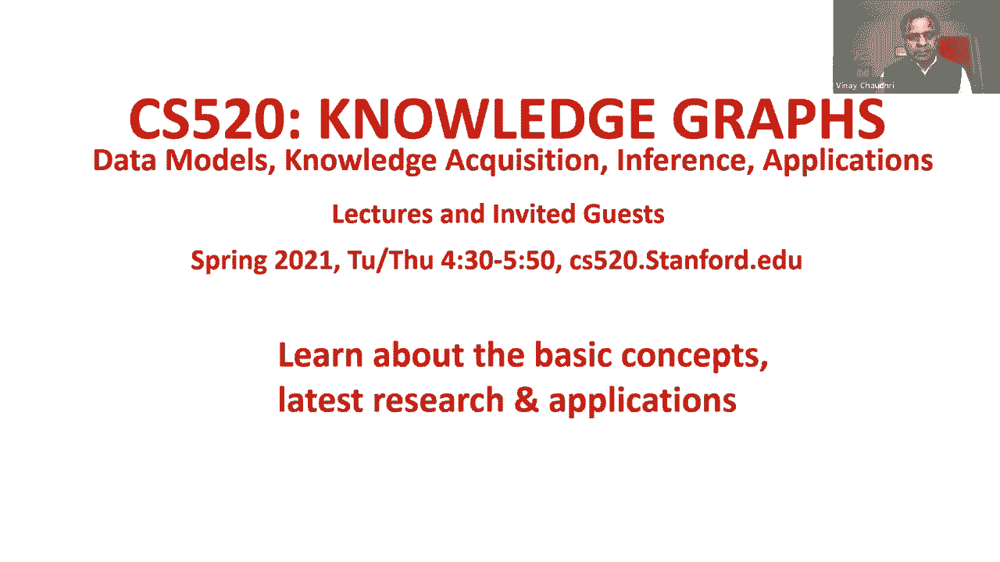

这个研讨会是由我自己共同组织的，纳伦和迈克。

我们组织这次研讨会的动机是我们看到了知识图表，用于许多不同的应用，包括网络搜索，问答，和数据集成，如果你去参加NLP和Vision的许多领先会议，您可以看到知识交叉作为NLP和视觉算法输出的选择表示。

以及机器学习算法的输出，所以我们希望通过这次研讨会传达基本的思想，概念，知识图的理论与应用，这个题目的重要性去年也得到了国家自然科学基金会的承认。他们资助了大约20个不同的知识工艺项目。

作为他们收敛加速器计划的一部分，我们会听到呃，一月，下周巴鲁，他们会告诉我们他们资助的一些项目。

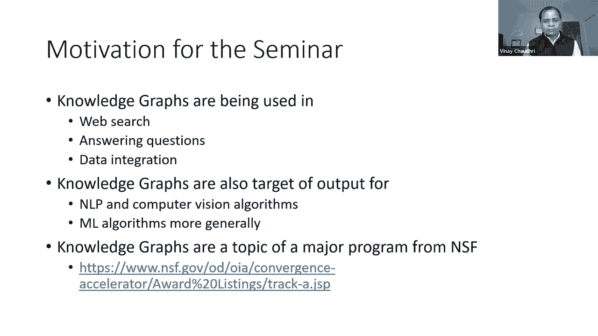

尽管这是一个研讨会系列，它有一个结构，前几节课的重点是，什么是知识图，它的数据模型是什么，那我们就来谈谈呃，我们如何创建知识图，知识获取的不同技术，一旦知识图被创建，我们怎么跟它讲道理。

以及它如何与现代人工智能算法一起使用，在系列快结束的时候，我们会谈谈呃，应用程序，当前知识图研究的前沿在哪里，今年的课程设计有点不同，而不是做一个，呃，每周两小时，我们在星期二和星期四进行两分钟的训练。

星期二的课程是基于二十系列要点的综合，如果你去我们的网站，看去年的系列，你会注意到呃，有呃，三十位特邀演讲者，所以我们仔细地看了演讲者说的一切，而我们，呃，合成的，呃，这把钥匙，带回家留言。

我们把它们写成了一组笔记，呃，也可在课程网站上查阅，一些周二的会议可能邀请了客人，但周二的大部分材料都是基于合成的，从去年的系列，星期四的特邀会议将邀请来自学术界和工业界的嘉宾参加，呃。

每个星期四的会议将有两个30分钟，呃，专题介绍，呃，有时他们可能有一个或三个主持人，但大多数情况下，他们会有两次30分钟的演讲，每次都是问答环节，我们将对会议进行录音，录音将在网站上提供。

对于那些为了学分而选修这门课程的斯坦福大学学生来说，嗯，他们将被要求完成周二所有十节课的小测验，并为十个星期四的会议中的任何八个提交书面摘要，考虑到这是一个单元课程，这是一个相当轻的要求。

有了那个简短的介绍，让我们进入今天的话题，什么是知识图，我们将首先定义一个知识图，然后讨论为什么人们对这个话题重新产生了兴趣，为了讨论我们将考虑三种不同的应用，搜索引擎，这个过程中的数据集成和人工智能。

我也想向你传达什么是新的和不同的，关于知识图，我们可以把知识图定义为有向标记图，其中节点和边具有明确定义的含义，有向标签图是一个很好理解的数学概念，我们会在离散数学入门课程中教它。

我们在那里教的东西和课程和知识图表应该涵盖的内容之间的主要区别，是特别注意定义节点和边的含义，我们将在这节课中讨论定义意义的不同方法，以及整个系列，有许多数据模型使用有向标签图作为核心数学表示。

他们可能会，呃，用不同的名称引用节点和边，我们将讨论数据模型，下周的讲座，但现在我只想传达的是，在一些数据模型中，他们指的是，呃，节点和边作为主语谓语宾语的三倍，在其他一些数据模型中。

他们将其称为实体关系，实体三倍，你们中的许多人可能已经看到了，呃，类层次结构，在类层次结构中，节点是类，边由子类或子集关系标记，在这三个例子中的每一个，有向标记图是底层表示的数学表征。

与节点和边相关联的名称，它们依赖于数据模型，预期用途，或应用程序上下文，现在让我们举一个有向标签图的具体示例，我们在其中捕捉到了阿特和鲍勃之间的友谊，这个小知识图说艺术是鲍勃的朋友，现在。

出现的第一个问题是，我们如何将意义与这些节点和边缘联系起来，关于节点，我们可以说，呃，阿特和鲍勃，他们代表现实世界中的人，对呀，关于朋友关系，我们可以通过简单的描述来描述英语中朋友关系的含义。

或者我们也可以说我们将把艺术和鲍勃之间的朋友联系联系起来，如果在Facebook等社交网络上，阿特向鲍勃发送了一个好友请求鲍勃接受了这个请求，如果这发生在现实世界中。

我们将把艺术和鲍勃之间的朋友联系作为定义意义的一种方式，所以这个，呃，呃，在…的情况下，呃，子类，呃，关系，节点是抽象概念，他们不是现实世界中的个体，但它们是抽象概念，在这些情况下，大多数情况下。

含义是使用文档定义的，如果你更老练，你想走得更远，您可以指定，或者您将使用某种，呃，逻辑语言，您可能对这些节点中的每个节点的含义有逻辑规范，以及它们之间的关系，这里的要点是。

有许多不同的方法来定义节点和边的含义，含义可以根据现实世界中发生的事情来定义，它们可以被定义或捕捉在用人类可理解的语言写的解释中，比如说，有语言资源或Wordnet，其中单词的含义是用英语简单地定义的。

意思可以定义，呃，使用一组公理或规则作为，作为逻辑专用规范，我们还可以用一组例子来定义意义，所以让我们说，在我们的知识图中，我们有一个叫做猫的概念，我们想定义它的含义。

我们可以把很多猫的图像和那个节点联系起来，我们可以说这个概念的意义，猫是这些图像中传达的东西，最近，人们对捕捉意义很感兴趣，使用嵌入，是根据，呃，语料库统计，我们将在稍后的讲座中讨论嵌入，呃。

但我想在这里传达的主要是，有许多不同的方法来捕捉意义，事实上，计算捕捉意义的不同方法，是计算机科学许多领域的问题的一部分，包括人工智能和数据库系统，和许多其他相关的子学科。

我在这里列出的每一种方法都是不同的捕捉意义的方法，它们有一定的用途，它们在某些情况下是有用的，这些方法是不完整的，他们不能完全理解，所有这些加在一起并不能完全理解，毫不奇怪。

在计算机科学中有丰富的工作历史，以不同的方法来捕捉含义，特别是在知识表示和数据库系统中，特别是在知识表示方面，最早的方法是使用一种叫做语义网络的符号，它本质上是一个有向劳动图，语义网络，呃。

进一步演变成描述逻辑，他们也是一种叫做概念图的表示技术的平行发展，在数据库系统中的并行轨道上，呃，早期的数据库系统，呃，他们有一个网络结构，你知道的，它们有一个一般的图形结构，最终演变成关系数据库系统。

今天很流行的，但也许与知识图最相关的工作是关于三重存储的工作，当数据模型本质上是一组三元组时，人们试图研究技术，对呀，所以这里的重点是嗯，这个企业，捕捉意义，或将信息存储为三重的企业，它有着丰富的历史。

嗯，呃，靠自己，这里面没有什么新鲜事，我希望下一个，我希望接下来是解释这个领域的新情况，为什么人们的兴趣死灰复燃，我将举三个例子来做到这一点，搜索引擎是数据集成和人工智能，解释知识图在搜索引擎中的应用。

我举一个由丹尼·雷奇介绍的例子，他在去年的演讲中使用了这个例子，这是该系列的开场演示，如果你想从他的话中听到这个例子，你可以去去年的网站，你可以直接从他那里听到，但是对于今年的课程网站。

我还链接了这个例子的两个寻呼机书面描述，用丹妮的话来说，这其实挺有趣的，我鼓励你，看一下，但我要做的是，呃，现在这里将是我的版本，你知道吗，我听丹尼描述过，我要，嗯，呃，给你讲这个故事，呃用我的话来说。

我称之为冬季旅游的例子。

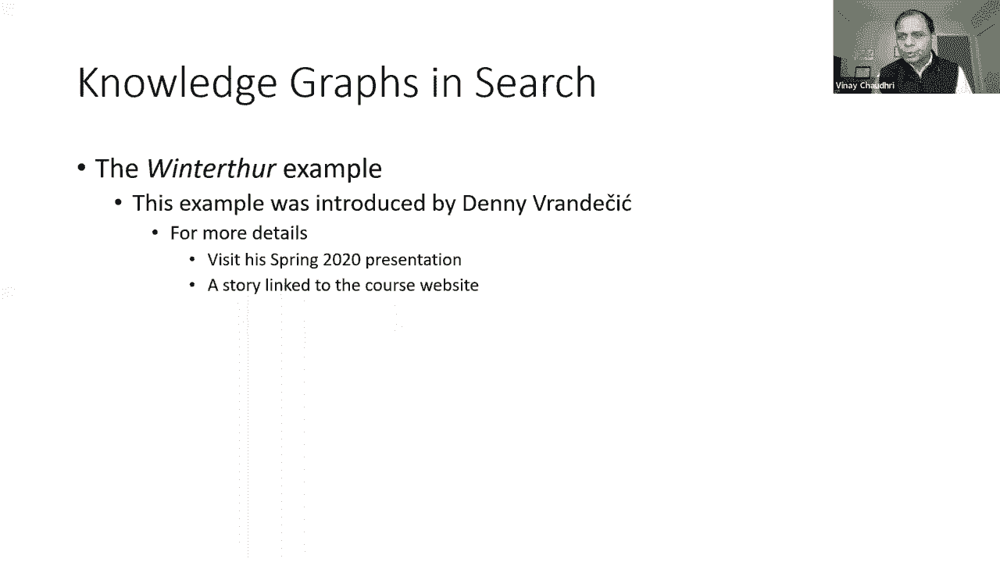

所以我们去呃，我们最喜欢的搜索引擎之一，我们键入苏黎世冬季之旅，我们得到一组结果，这里的第一个结果碰巧是一个维基百科页面，然后有一组图像，我们可以点击第一个结果，这将把我们带到呃。

冬季之旅的实际维基百科页面，现在，搜索结果有什么有趣的地方，在某个区域，他们也展示了一些事实，事实证明这些事实是从，维基百科，如果你去呃，冬季之旅的维基百科页面，你将能够看到这些事实直接来自。

维基百科中所谓的信息框，所以在这种情况下，搜索引擎现在足够聪明，意识到这，此数据或结构化信息可在，这类信息是人们感兴趣的，它能够提取这些信息，它能够在那里显示它作为搜索结果的一部分，所以用这种方式。

搜索结果正在使用维基百科中可用的结构化数据进行增强，这个例子，然而，只是使用结构化数据实际可能发生的事情的冰山一角，现在让我们来看看冰山。

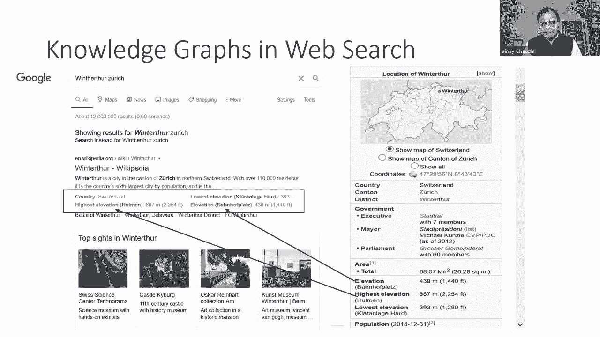

呃，让我们在维基百科页面向下滚动冬季之旅，在这一页的底部有一个部分他们提到了双子镇，他们列出了四个双子镇，两个在瑞士，一个在捷克共和国，一个在奥地利，现在与冬季旅游完全无关，如果你在维基百科搜索。

有一个叫加州安大略的小镇，好的，如果我们向下滚动页面，在加州安大略省的页面上，我们看到这个地区被称为友好城市，在这个区域，他们看到一个名为，这就是为什么我们在看，呃，加州安大略省的页面。

现在到底发生了什么，如果我们理解友好城市和双城的含义，我们知道它们是相同的概念，他们指的是同一件事，但是安大略省页面上提到的冬季之旅，它没有来自冬季工具页面本身的后退指针，对。

没有简单的方法来自动解决这个差异，理想情况下，我们希望这个参考资料，呃，对称，现在这是个问题，那是个大问题，解决这个问题的一个可能的方法是Wikidata，这是一个巨大的公共策划的知识图。

让我们看看Wikidata是如何在Wikidata中解决这个问题的，如果我们搜索冬季旅游的信息，我们得到这样的页面，如果我们向下滚动，他们会发现，称为孪生管理机构的关系名称，其中提到了安大略省的权利。

另一方面，如果你去维基百科页面，呃的维基数据页面，安大略省，有一个类似的部分，孪生行政机构，这表明冬天到现在的关系是系统的，现在到底发生了什么，到底是什么让这一切发生的，下面有一个有向标签图表示。

其中冬季之旅和安大略省是节点，两者之间有与行政机构的联系，好的，现在它本身并不那么有趣，但更有趣的事实是，冬季之旅和安大略省都与许多其他事情联系在一起，比如说，它是苏黎世大都市区的一部分，它在瑞士。

安大略省在美国，它是北美的一部分，等，但冰山不止于此，原来网上还有很多其他人，Web上许多其他使用Wikidata标识符发布数据的组织，其中一个碰巧是国会图书馆，他们发布了很多关于维克多·图尔的信息。

呃，在网上，因为他们使用相同的标识符，我们很容易把这些信息联系起来，Wiki数据中可用的信息，现在它本身也是故事的一部分，事实证明，网上还有很多其他来源。

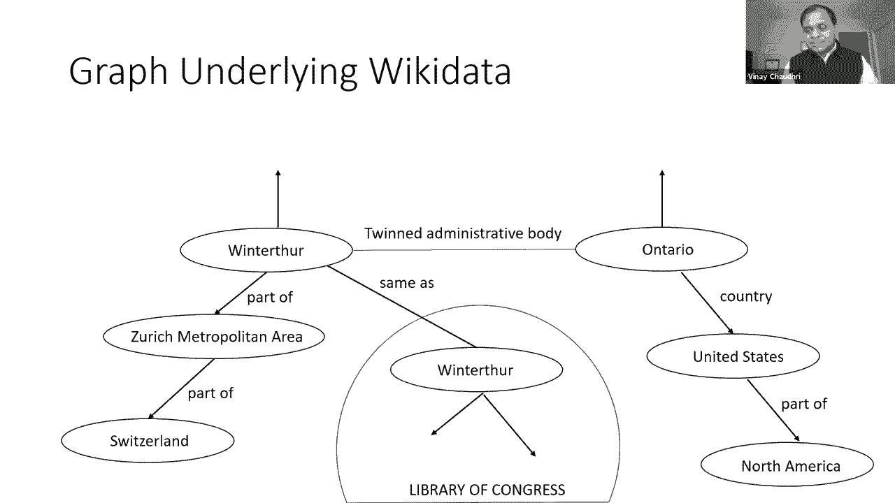

呃，他们在做同样的事情，你知道的，他们链接到维基数据，他们之间正在建立联系，等，这是一个日益增长的运动，现在真正强大的是，结构化数据是，可以对其运行查询，例如，如果你有一个查询，比如呃，在地图上显示。

在冬季旅游中死去的人的出生城市，只使用一个地方的可用信息运行此查询并不容易，它要求我们在Web上查询多个数据源，它要求我们理解他们的模式，为理解模式所做的一种努力被称为模式点，www。icj-cij。

org，呃，是努力创建一个，可用于在Web上发布数据的共享词汇表，借助来自模式点的共享词汇表，www。icj-cij。org，在网上查询这些来源的信息要容易得多，并将。

将结果作为呃搜索的一部分呈现在网上，这在今天是不可能的，但这个例子的全部意义是，如果我们能够利用知识图，他们将能够提高问题或搜索的质量，出现在Web上的搜索结果，现在你可能会问这有多真实。

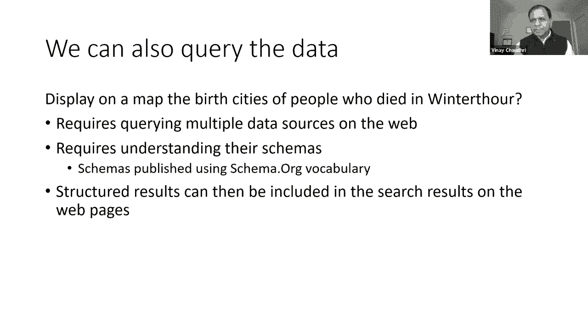

这个有多大，我没有关于Wikidata的确切最新数据，这个数据大概有一年左右了，一年前，它有超过8000万个物体，超过十亿的关系，它链接到超过4800个不同的，呃，公共目录，我提到过，呃，那个呃。

国会图书馆目录，那只是其中之一，呃，这四千八百本左右的目录，维基数据是，呃，当前链接到，所以在给出这个例子后，让我退后一步，然后呃，强调这个知识图的一些独特之处，也把新的东西拿出来。

今天可用的这些知识图有什么新的，首先呢，呃，这是一张规模空前的知识图表，你知道人们致力于知识图或有向标签图表示，但我们从来没有交涉过，呃，Wikidata中存在的有向标签图表示，第二次，呃。

这个图表不是由一个人创建的，呃，它是通过社区努力创建的，Wiki Data有一个帮助创建这些数据的策展人社区，还有其他组织，如国会图书馆，正在出版，呃，连接到Wiki数据的数据，维基数据中的数据。

很多都是手工制作的，你知道，实际上是人们坐下来输入它，Wiki数据中有很多数据，这些数据也是自动创建的，也许其中一些来自维基百科的解析，其中一些是通过其他提取工具来的，也许其中一些只是通过众包，呃。

但是有多种方法可以使用，呃，Wiki数据中的数据正在被放入，然后是对意义的明确关注，通过模式组织，有一项明确的努力正在进行中，以确保正在使用的标签，它们有明确的含义，当然啦，我很肯定有一些，呃，呃。

正在使用的关系，没有明确的含义，但是我们必须认识到，呃，我们必须能够理解，同意并指定我们正在使用的关系的含义，这样我们就可以用它们来推断，最后，呃，这个知识图中的数据有一个明确的引人注目的用例。

在这种情况下，碰巧是，呃，网络搜索，呃，拥有数十亿用户和数十亿，数十亿次查询，这本身就足以证明，呃，它的存在，的进一步发展，但是Wikidata还有其他用例。

有一些组织正在将Wikidata中的信息用于多种目的，接下来，我将讨论知识图在数据集成上下文中的使用，我举一个例子，用例，呃，我称之为360度的顾客视角，有很多组织有成千上万的客户。

许多公司拥有数百万客户，并有效地管理这些关系，他们想有一个完整的能见度，的完整视图，呃，他们的客户和关于他们客户的信息，其中一些在他们内部的IT系统中，但其中一些存在于外面，现在有很多。

以商业方式出售此信息的数据提供者，对呀，它不在公共领域，但也许他们是从公共领域提取这些信息的，但因为这是一项增值服务，他们卖它，所以这里有一个例子，呃，Pitch Book是一种数据提供商服务。

它整理关于谁在资助的信息，谁喜欢哪个风投在资助，哪个特定的启动，他们资助了多少钱，等，呃，事实集是另一个数据源，它管理关于呃的信息，供应链网络，比如谁，呃，哪个供应商是，呃，向哪个客户供货，反之亦然。

现在考虑一个应用程序，例如风险分析，在那里你正在做出一些贷款决定，对一家公司来说，知道如何，呃，呃，特定公司的客户或供应商的情况如何，他们是否会遇到一些麻烦对吧，这种信息可能非常有用，但是呃。

有效利用这些信息，他们必须能够，呃，相关事实，行动信息与他们内部现有的信息，类似地用于商业智能目的，如果他们想进行定向营销，最近筹集了大量资金的初创企业，他们需要宣传册上的信息。

但他们必须能够将它与他们对内部客户的了解结合起来，所以解决这个问题需要进行数据集成，他们必须能够结合来自这些不同来源的信息。

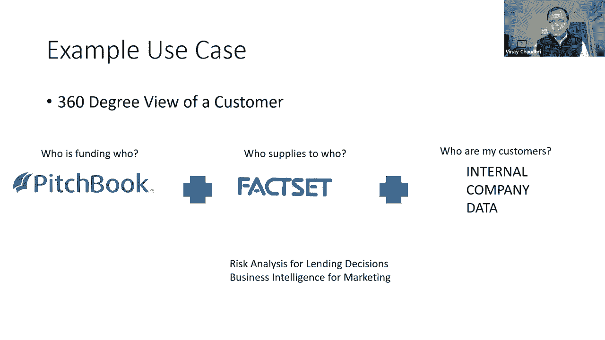

现在数据集成是一个，呃，一个已经存在很长时间的问题，呃，人们已经在这方面工作了几十年，解决数据集成问题的核心挑战是，我们必须在这些多个来源之间进行数据转换，我们必须能够，呃。

找出一个模式的哪些元素映射到，不同模式中的哪些元素，我们必须能够定义那些，呃，映射，或者我们必须有一个共享的模式，所有这些源都被映射到其中，这些问题已经存在很长时间了，人们一直在努力，有很多技术。

但是为什么知识图因成为数据集成而变得流行或有趣，他们变得呃的一个原因，有趣的是，它们提供了一种无模式的数据集成方法，所以你要做的就是，呃，您可以从多个源获取关系数据，你可以把它转换成三个三。

您可以将其存储在图形数据库中，您就有了集成的第一个版本，对呀，呃，有些人甚至把这种简单的翻译称为知识图，但严格地说，这意味着你还没有真正解决这个问题，您只是将数据从一种格式转换为另一种格式，但有趣的是。

在本例中，定义延迟映射的艰苦工作，直到你真正需要它，这是更普遍的主张，即付即用的基础数据集成，当你有一个特定的商业问题时，你去你的三联店看看你需要什么新的联系，让你经历建立这些联系的痛苦和代价。

然后他们一旦你建立了这些联系，你有即时价值对吧，那么，知识图或无模式的数据集成方法所做的，它是不是降低了进入的门槛，你可以很快开始，现在，有些人会说嗯，你知道的，当您使用知识图进行数据集成时。

数据可视化更容易，它是呃，为图反转优化，你知道这些论点有一些可取之处，我们在本系列的后面有会议，我们将寻找的地方，在哪里，我们将更深入地研究这些方面，看看到了什么程度，他们在多大程度上更适合，呃。

支持图形版本，但现在重要的是要明白，呃，知识图已经成为数据集成的一种流行方法，因为它们减少了进入的障碍，我们不谈，嗯，知识图是如何使用的，呃，用人工智能，我将把它分解为使用知识图来表示输出。

以及将知识作业用于机器学习的输入，首先我们将以自然语言处理为例，简单的句子，爱因斯坦是德国出生的理论物理学家，他发展了相对论，给出这样的句子，呃。

我们可以在上面运行实体提取任务并识别像阿尔伯特·爱因斯坦这样的实体，相对论，等，当然啦，实体提取比这更普遍，因为，在某些情况下，它可以提取呃数字，它可以提取日期，它可以提取时间间隔，但在大多数情况下。

你知道实体提取，最常见的情况和提取是你提取呃，名词短语，显然我们不仅想做实体提取，我们还提取了，想要提取实体之间的关系，所以给了这样一句话，我们可以提取关系，例如爱因斯坦出生于德国，职业是理论物理学家。

物理学家，他发展了相对论，考虑到这些关系，将提取的信息表示为知识图是很自然的，现在我们不想只是，构建这个知识图，我们想用它来推断，我们想把意义和，标签是什么，这样我们就可以，呃做问题回答。

我们可以做常识性推理并得出结论，比如阿尔伯特·爱因斯坦是物理学家阿尔伯特·爱因斯坦，呃呃，开发一些呃，物理学新知识，等，我知道有些人，呃呃，在NLP谁说，哦，我们不需要呃，指定这些标签的含义。

但真正的问题是，你想用它们来做推理所以不管怎样，你必须描述这些标签的含义，以及使用图形表示可以或不能得出什么结论。

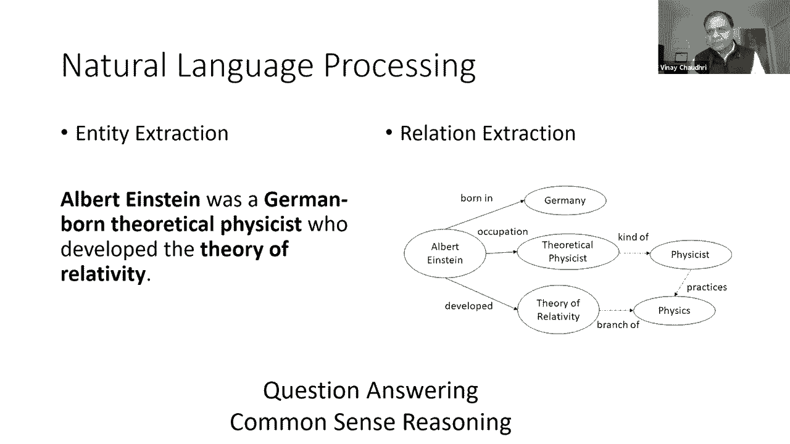

像这样，下一个点赞，让我们来看看计算机视觉问题，他们得到了这样的照片，我们想看看这张图片中存在什么对象，这是标准，呃，呃，对象中的任务，呃，检测，接下来我们想看看这些物体是如何相互关联的。

所以在这张照片中我们可以看到一个男人戴着眼镜，一个人在喂马，马正在桶里吃东西，等，对呀，计算机视觉在识别像这样的关系方面越来越好，但就像在NLP案例中一样，我们对仅仅用这样的图表示这些信息不感兴趣。

我们希望能够用它来进行推理或视觉问答，对我们来说，能够进行系统的视觉问答，我们要担心什么的含义，这些标签的含义是什么，以及我们可以或不能用它们得出什么推论。

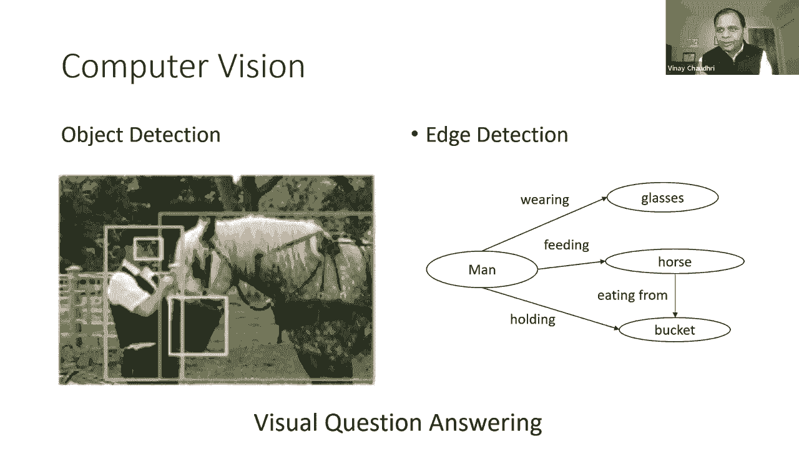

现在让我们把注意力转向知识图是如何用于输入的，到机器学习，呃，最，呃，当前的机器学习算法，呃，它们需要数字输入，例如，你把某些数据输入回归模型或神经网络，你需要给它一组数字，但如果你要做。

使用这些模型中的任何一个进行实体提取或关系提取，呃，我们得给他们数字，但我们有文字对吧，所以我们需要想出一些方法把我们的符号词转换成数字，这样它们就可以喂进这些，呃，学习模型，所以单词嵌入和图形嵌入。

它们是流行的技术已经变得非常流行，呃，呃，转换符号，呃，呃，将表示转化为数值表示，用于机器学习模型的输入，我会试着给你这些的直觉，最初嵌入这个词是呃，发展到呃，提供计算单词相似性的工具，例如。

如果你想看喜欢是相似的享受，我们需要一些方法来自动计算这个，但在一段时间内，人们发现这些单词嵌入通常是有用的，用于各种语言理解任务，嗯，单词嵌入背后的关键思想是捕捉单词的含义，通过计数。

它出现在其他单词旁边的频率，好的，让我们把它具体化，假设我们有一个呃语料库，只有这三句话，我喜欢知识图，我喜欢数据库，我喜欢跑步，好的，从这个呃语料库，我可以像这样计算数字，例如，在第一行，这里。

在第二列，这个数字是2，因为like在i旁边出现了两次，"享受"这个数字是1因为"享受"只出现在"我"旁边一次，我可以类似地计算其他位置的数字，并创建您在这里看到的表单的矩阵，给定这样的矩阵。

我们通常把它叫做，共发生计数，我们说一个词的意思是由向量捕获的，对应于每一行共发生计数，所以在这种情况下呃的意思，我是用这个捕获的，这第一行数字，如果你想计算两个单词之间的相似性。

我们简单地计算两个向量之间的距离，所以在这种情况下我们会，呃，如果你想看看，如果喜欢和享受是相似的，我们会看到你知道，距离有多远？呃，在两者之间，这里的关键洞察力是我们已经采取了，呃，我们的文字是符号。

我们把它们变成了数字，现在我们有了数字，我们可以输入我们的学习算法，现实，当然啦，比故事复杂得多，我刚给你，因为呃，我们的文本语料库不会只有三个句子，它将有数十亿，十亿多字，如果你用天真的方法，呃。

我刚解释过储存需求会激增，在实践中，你必须进行降维，呃，典型，呃，字向量表示，它们是，呃，这些天正在使用，它们的大小通常在两百，还有其他技术，比如线性代数，从线性代数，类奇异值分解，以及自动学习的技术。

如何选择我们要去的那200个数字，使用，我们将代表一个词，在右边有一整条航线，如果你参加NLP课程，它主要致力于如何很好地完成不同形式的单词嵌入，你，呃，看到在实践中大量使用的嵌入这个词，例如。

如果你进入搜索引擎，开始打字，它开始预测什么，呃很可能，接下来你可以键入的东西，它本质上是使用，呃，一种由单词嵌入驱动的语言模型。

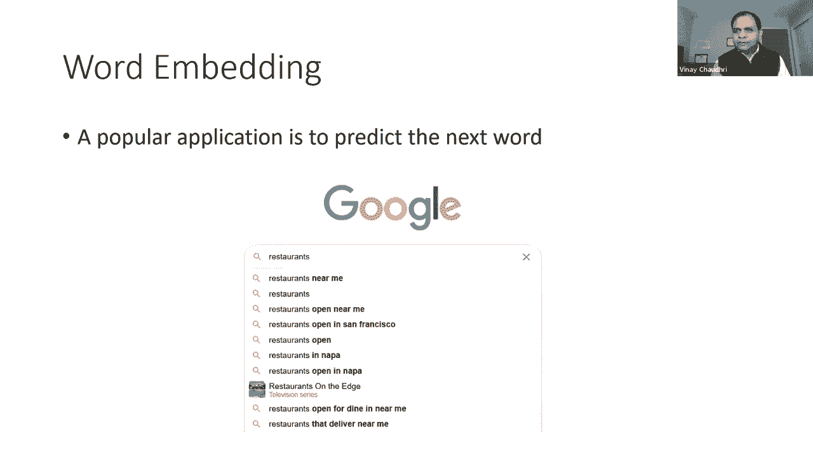

呃，我刚解释过了，下一个，现在让我们把注意力转向，呃，图，化妆品，图嵌入的流行应用领域是推荐，所以如果你在电子商务网站上，这些公司对，呃，向顾客推荐他们应该买的其他东西。

他们有很多类似客户购买的历史数据，呃，在过去，这些数据以图形形式存在，在这个图中，每个节点都是一个乘积，两个乘积之间有一条边，如果这些产品往往是，但要么是互相追逐，要么是一起购买。

但本质上这是一个象征性的结构，对，机器学习非常擅长预测事情，但你必须给它数字输入，但如果你想满足这种历史趋势，这种趋势存在于呃，符号形式，我们想用机器学习来做预测，我们得把它转换成某种数字形式。

所以这里的问题和目标与我们的，nlp案例，呃，我们必须能够把这个离散的符号结构，我们必须把它转换成向量，这样我们就可以计算节点相似性，我们可以计算节点之间的差异，我们可以把它们作为输入。

进入机器学习算法。

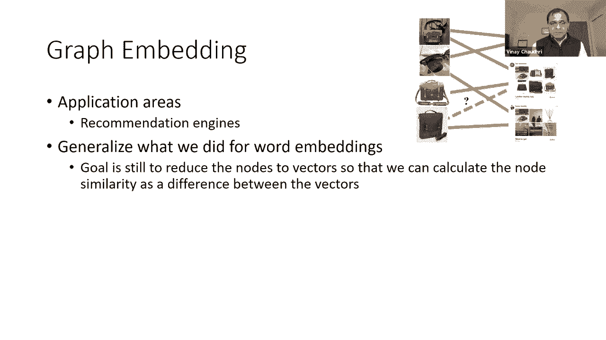

现在要明白这一点，呃，我要打个比方，既然我们已经明白了我们是如何计算的，呃，呃，单词嵌入，我们可以这么说，你知道的，呃，我们处理的句子可以看作是一个线性图，其中每个节点是一个词。

他们的每一句话之间都有一个边缘，对呀，我向你展示的单词嵌入计算可以被视为一个图表，在这个线性图上嵌入，所以这个类比真的很有帮助，因为，嗯，它帮助我们立即看到如何将离散图，我们会把它变成一条线性路径。

我们所要做的就是随机地把图向右走，每次我们随机走图表，我们会得到一个线性路径，然后在线性路径上，我们可以数出哪些节点，哪些节点彼此共存的频率，我们可以建立一个共现计数矩阵，就像我们做的那样。

鉴于这种方法，呃，我们可以计算呃图嵌入和一次，实际上是节点的嵌入，它们被称为节点嵌入，给定这些节点嵌入，呃，呃，我们可以很容易的计算出，节点相似性以及它们之间的接近程度，正如我提到的图形嵌入这个词。

图嵌入通常指，呃，到整个图的嵌入，如果你，如果要计算整个图的嵌入，一个微不足道的方法是，只需取单个节点嵌入的总和，它给出了整个图的嵌入，现在，我应该说，我呈现给你的是一幅天真简单的画面。

因为我想在这里传达，呃，直觉，我试着解释，你知道这些知识图是如何与机器学习相关的，为什么和如何使用它们，就像单词嵌入一样，关于如何计算这些图嵌入，有一个完整的单独课程，以及你是如何做到有效的，呃推论。

呃，使用它们，但我希望我给你的解释，您对这些嵌入是如何计算的有基本的直觉，以及它们的目的是什么，所以总结一下，嗯，呃，知识图与人工智能的关系，知识图被用作自然语言处理和计算机视觉的输出表示。

它们也被用作机器学习的输入，呃，只要我们有任何领域的知识或背景知识，它可以作为知识图，的，呃，嵌入方法，使我们有可能将这些知识输入到这些数字模型中，这样机器学习就可以做出更好的预测。

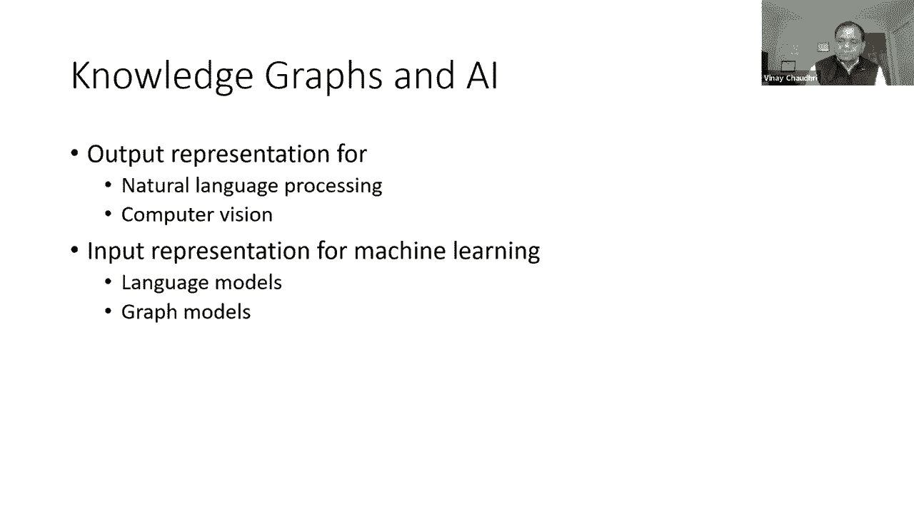

有了那个呃，我想总结一下，呃，今天是呃，什么是知识图的主题，我认为呃，图是离散数学中的一个基本构造，呃，知识图增加的主要价值，图定义了意义，这才是问题的关键，为了呃，知识图。

我们想用我们的程序可以理解的方式定义含义，他们可以以一种主要的方式与意义合作，显然，多年来在这个问题上已经做了很多工作，几十年来，有一个丰富的历史呃，关于这个主题的工作。

在知识表示和数据库以及计算机科学的许多其他领域，包括NLP，最近兴趣激增，呃，在知识图中主要是由Web搜索的用例驱动的，因为在网络搜索中，我们希望能够使结果更好，呃，搜索有数十亿用户。

这些数据似乎有助于改进搜索，因此，在这种情况下，人们对使用知识图的兴趣肯定越来越大，在NLP和视觉方面有了很大的进步，呃，直到许多年前，人们只是在努力识别图像中的物体，没有必要用它来构建知识图，呃。

但考虑到最近有很多进展，呃，边缘检测与呃的关系，萃取，所有这些技术都在改进，所以有必要更好地组织这些知识，知识图似乎是实现这一目的的一个很好的起点，同样，机器学习也变得更好，因为众所周知的原因，呃。

计算能力提高，提高数据可用性的计算能力，在这些机器学习模型中，我们希望能够使这成为一个领域知识，对，如果领域知识是以图的形式结构的，现在有可用的技术，可以使用领域知识，呃，输入到，呃，到机器学习。

所以最后一点，有什么新鲜事，这一切有什么新的，我想总结三个要点，呃和规模，发展的底部，以及按规模划分的多种建设模式，我是说呃，尽管有向标签图已经使用了很长时间，但是它们正在建造的规模，现建造，比如说。

就像在Wikidata或许多新的NLP视觉任务中一样，我是说，我们还没有在那个尺度水平上使用的表示或有向图表示的知识，第二次，呃，是呃，发展的底部。

你知道知识表示和数据库的经典工作是由自上而下的设计驱动的，您知道您正在构建一个新的应用程序，你坐下来仔细思考你的领域模型，定义类和关系，然后你构建一个软件，所以它是由自上而下的方法驱动的。

但我们在最近的过去看到的是，知识图开发发生的开发底部，根据现有数据，有人把什么数据放出去了，你可以在市场上买到什么数据，我们能提取的，我们实际上可以学到什么，所以所有这些都驱使着，自下而上的方法创造呃。

这些知识图工件，我觉得这是新的，对呀，这并不意味着自上而下的设计不重要，我认为在某个时候仍然需要自顶向下的设计，因为，正如我所说，你知道，问题的关键是意义正确，即使你以自下而上的方式收集信息。

你还得能和它讲道理，所以你必须在周围设定一些意义的界限，你以自下而上的方式提取的东西，现在我们终于有了多种建设模式，呃，知识表示方面的经典工作，主要是由，嗯，呃，手工知识工程，人工方法。

知识工程仍在发生，你知道很多知识图的创建工作都是手工完成的，有人在输入，但我们也看到自动化提取方法的更多使用，如NLP和视觉方法，我们也看到了很多众包的方法。

所有这些方法都聚集在一起创建这些大型知识图工件，有些人可能会说这都是自动化的，但我不认为那是真的，我是说任何知识图，呃，任何重要质量的建筑，肯定有一些手工的努力，即使是在，呃。

做数据标签或数据验证或其他什么，但手工工作仍然是组件的一部分，但是呃，这里的要点是，我们现在能够混合这些方法来创建这些，呃，大型综合体，呃，知识图，这是不可能的，直到说之前，我想，呃，结束我的演讲。

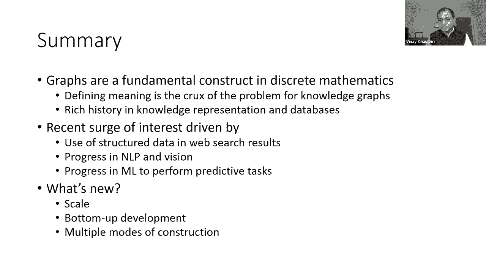

然后呃，给你预览我们的会议，呃，这个星期四，它将建立在此基础上，呃，的主题，呃，什么是知识图，为什么我们需要他们，呃，我们的演讲者将是，呃，国家科学基金会的查坦纳瓦罗教授，他会在哪里，嗯。

概述此主题领域，也告诉我们呃，一些有趣的项目，他们目前资助的项目，今天的会议到此结束，我期待着星期四见到你。

