# 【双语字幕+资料下载】斯坦福CS520 ｜ 知识图谱(2021最新·全20讲) - P22：L14.1- 逻辑语言(英语)计算 - ShowMeAI - BV1hb4y1r7fF

欢迎参加今天的知识工艺研讨会，我们在课程的第七周，我们一直在讨论用户如何与知识图交互，在星期二的会议上，我介绍了不同的交互范例，在这些范例下，用户消费知识图的内容。

我们讨论了一些可以用于设计用户界面的可视化原则，我还概述了两种具体的技术，结构化查询和自然语言查询应答，它可以用来访问今天的知识图，我们很幸运有两位专家和我们一起研究这两种特定的技术，呃。

鲍勃·科瓦尔斯基教授，他是著名的计算机科学家和逻辑学家，他的职业生涯致力于开发人类思维的计算模型，为此，他获得了海凯研究优秀奖，他也是整个计算法领域的奠基人，为此，他最近被授予斯坦福法典奖。

他会和我们谈论如何，我们可以用逻辑英语来访问知识图，呃，michiharu yasu naga，他是斯坦福大学的博士生，他与珀西·梁合作，他的博士论文和博士研究是关于，呃，自然语言查询，知识图的编制。

所以我们先从，呃，第一科瓦尔斯基教授告诉我们逻辑英语，呃，还有三十分钟，然后三十分钟我们会听到，呃，Michiharrow，最后我们讨论二十分钟。

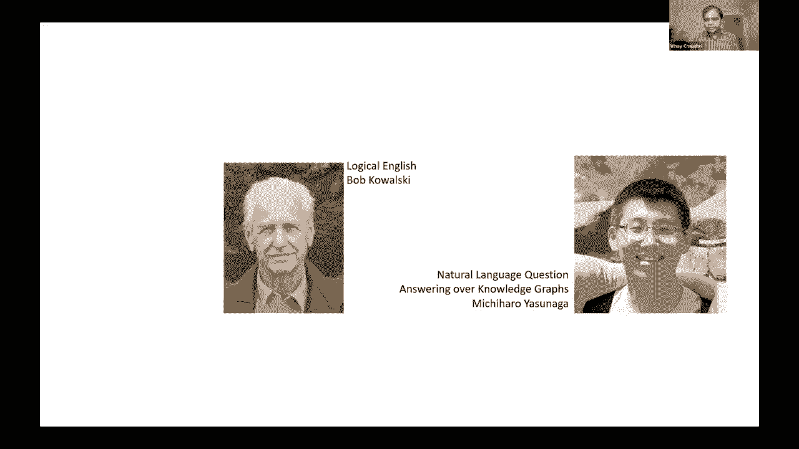

所以交给你，好的，非常感谢，我想我可以选择分享我的屏幕，我想这是我的屏幕，我想我们准备好了，所以非常感谢，感谢Vinay邀请我做这个小演讲，这是一种极大的乐趣，原因有很多，其中一个是，在某种程度上。

这是一个回到斯坦福的机会，在那里当学生，呃，几年前，我在那里学习逻辑，呃，像达纳·斯科特和其他人，所以被邀请回到斯坦福大学是一种莫大的荣幸，虽然以这种方式遥不可及，所以我分享我的屏幕。

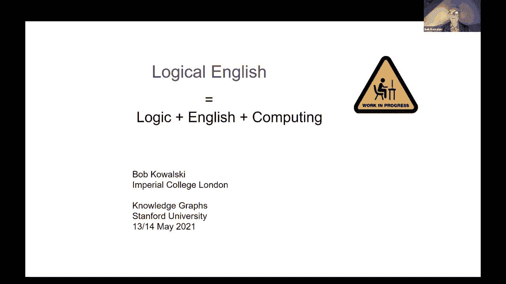

我想这个演讲有三个部分，我会很好地运用逻辑英语。我以前所知道的语义网络，希望，我以前知道的语义网络之间有足够的关系，和你今天关心的知识图表，我演讲的那一部分仍然相关。

然后我将继续讨论一个特别有趣的技术主题，存在量词，然后用一个相当具有挑战性的例子来结束。

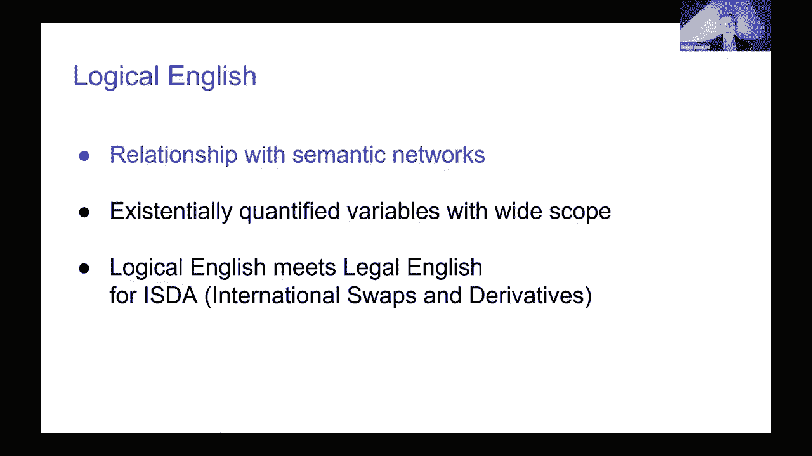

呃，法律领域，嗯，首先，逻辑英语被视为一种计算机语言，只是逻辑程序的语法糖，它非常接近逻辑程序，它很容易翻译成逻辑程序，另一方面，它在很大程度上受到法律文件语言的启发，你会看到最后一个节目的例子。

我不太确定，如果可以的话，你可以，你看到角落里的这些了吗，等一下，我想那样更好，所以你会看到，我的最后一个例子是一个翻译成逻辑英语的法律文件的例子，现在，逻辑英语的大优点和大卖点。

它可以在没有任何数学训练的情况下阅读，计算或逻辑，可能没那么容易读，如果你对…的主题没有知识，呃，问题域的，比如说，在国际掉期和衍生工具的例子中，你可能会觉得我的例子很难，但不是因为英语。

也不是因为逻辑，这是因为掉期和衍生品的领域是，不是我们大多数人都熟悉的，另一方面，在某种程度上，逻辑程序已经是相对通用的，嗯逻辑英语，这是逻辑程序的语法糖，可能有潜力成为未来的通用计算机语言，因此。

它的好处是被理解的人理解，呃，受计算机程序影响，它使他们能够理解计算机程序在实现什么，所以我愿意相信逻辑英语是有前途的，呃，它可能会使现有的计算机语言，呃，可能过于面向机器，而不是人类。

而不是我们未来所需要的。

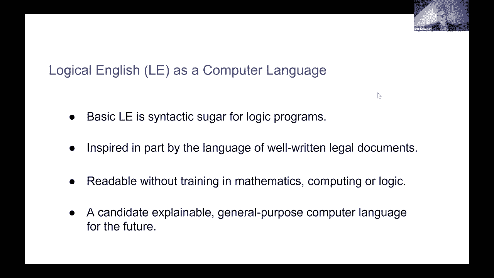

逻辑英语已经有了几种实现，从Jacinto de Villa的一个实现开始，它是在线的，可以玩，在某种程度上，呃，然后是帝国理工学院硕士生的另外两个实现，其中一个第一个是由汽车点杰夫，嗯。

研究了国际掉期和衍生品，第二个是福，看了一份简化的贷款协议，但工作进展缓慢，我们希望在年底之前，我们会在网上有一些东西，那个，呃，更多的人可以玩得很好。

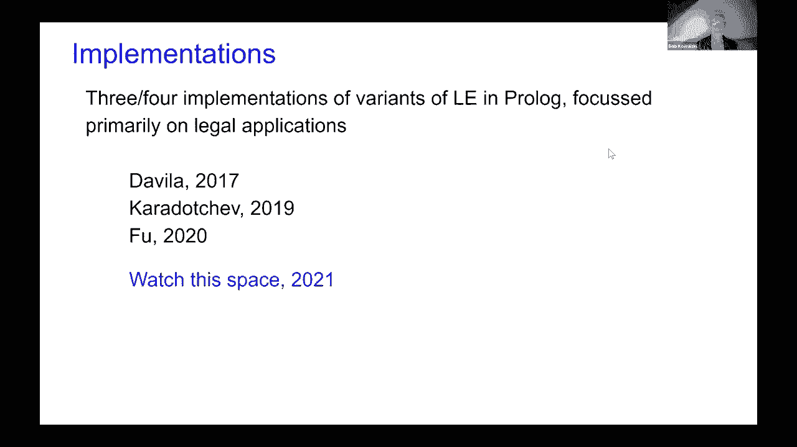

背景是什么，除了逻辑编程，还有相关的工作，当然啦，在受控自然语言领域，特别是，王牌试图控制，呃，诺伯特英语，富克斯和彭，都是沿着前体的路线，在某种程度上，我在这里展示的作品，最近。

有许多专门建立在逻辑编程基础上的发展，呃，用一种加糖的语法，但重点不是作为通用语言，而是作为一种领域特定的语言，呃，尤其是阻止了杰森·莫里斯开发的呃语言，呃是呃，面向所谓的规则代码，而词典，另一方面。

被呃，标题日技巧面向智能合约，呃，在区块链上运行，这两个都是在过去一两年内开发的，然后呃，但它们都是逻辑编程的加糖语法形式，但最接近我今天展示的作品是Roe，庞阿·斯普的施维特。

它是逻辑编程语言应答集编程asp的语法糖，在我看来，它使ASP，呃，其常规语法完全冗余，因为谁会想用一段时期的符号语言，可读性强的英文版本随处可得。

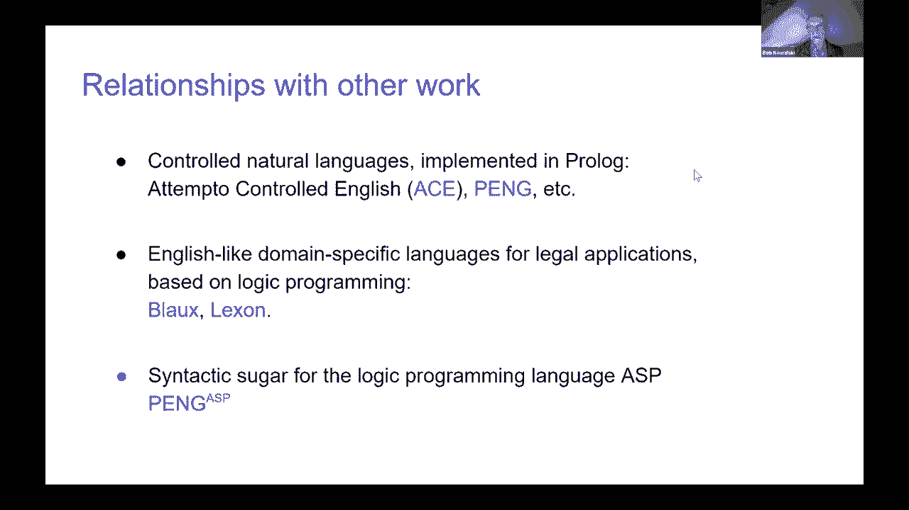

逻辑英语的研究在某种程度上可以追溯到1982年，嗯，当我发表论文报告我一直在和孩子们一起做的工作时，从我自己的孩子开始，呃，在他们当地的学校里把逻辑作为计算机语言来教授，我们从语义网络开始。

这是一个很好的知识图形表示，并展示了如何扩展语义网络以包括规则，所以这里，比如说，如果你有，嗯，比如说某物的两部分，比如说一辆自行车，在x之间有一个传递性关系，y和z，你可以得出结论。

如果x是y的一部分，y是z的一部分，那么x本身是set的一部分，我们有语义网络表示，你可以在这里看到的类似英语的表示，所以逻辑英语是一种，呃，我们在1982年开始的儿童工作的进一步扩展。

逻辑英语的基本形式是从句的使用，就像在逻辑编程中一样，有一个单一的结论和多个，我们用中缀、前缀或后缀的形式写这些，我们有声明表明嗯，他们长什么样，所以我们有，比如说，嗯，而不是写X。

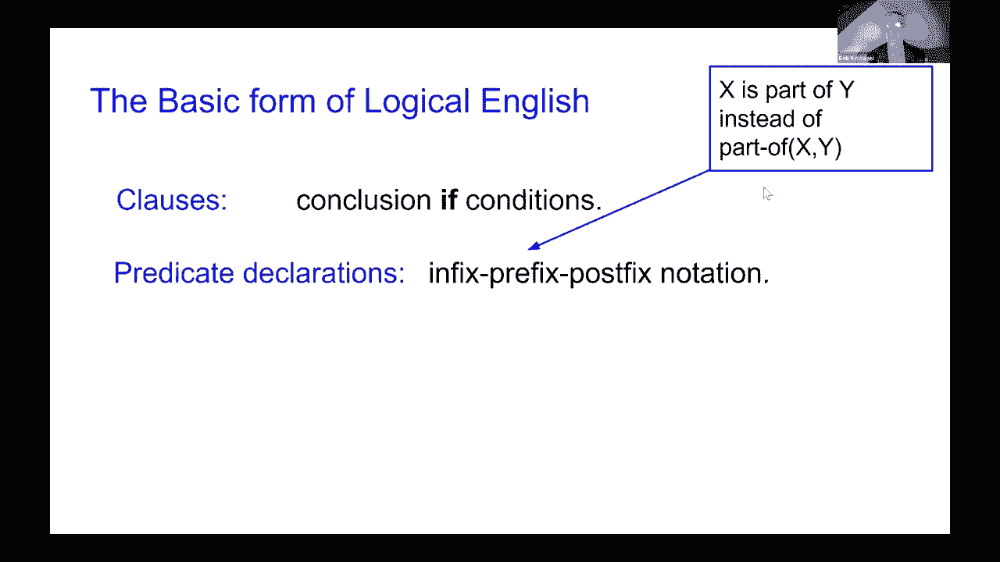

括号的一部分，x，逗号y括号，我们写x是y的一部分，所以它的可读性很强，它不需要训练，为了理解其中的象征意义，所以我们有中缀的谓词，前缀，或和或后缀，逻辑英语的一个有趣的特点是它利用了这样一个事实：

在逻辑程序中，变量的量化是隐式的，没有必要说对于所有的x对于所有的，为什么我们简单地使用变量x和y，现在逻辑英语在此基础上使用不确定的呃，引入变量的第a条和第n条，它使用呃，参考前面介绍的变量。

后面依次是一个普通名词，例如零件，和普通名词部分或帐户，呃给出了变量的类型，所以这在某种程度上扩展了逻辑编程，通过引入类型，因为所有的变量，呃是由呃限定词介绍的，后面跟着普通名词，给出变量的类型，呃。

所以在这个例子中，of的一部分是介词，这给了我们谓词的角色，你会看到其他介词的例子，它们表示其他角色，这也是传统逻辑编程的一种扩展，那么逻辑英语有哪些与众不同的特点呢？比如说，从呃。

计算中使用的其他受控自然语言，嗯，首先呢，没有代词，比如他，她或它，嗯王牌，最著名的受控自然语言确实允许呃，这样的代词，它确实以一种特殊的方式消除了它们的歧义，呃，但有时消歧是不直观的。

而不是正常人会做的，呃，通常在，呃，你明白什么，当阅读这样的代词和代词时，是一个巨大的，可能是普通语言中最大的歧义来源，逻辑英语的另一个特点是，所有名词和动词都是单数，没有复数名词或动词，可以说。

我可以争辩说，如果有更多的时间，单数更精确，呃，呃，比呃，复数，在大多数情况下，比如说，男孩喜欢女孩是一个相当不精确的说法，但如果你说男孩喜欢女孩，也许你越来越接近一些不那么模棱两可的东西，呃。

所有动词也都是现在时，这也许是相当令人惊讶的，因为学习一门语言的复杂性很大程度上是学习所有不同的，这些时态的，因为时间被具体化了，你就会明白我的意思了，一会儿，嗯，我们只是指时间，如果时间是在未来。

就这样就这样，那么它允许我们在现在，倾向于谈论未来的时间，如果时间在过去，然后它让我们再次谈论过去。

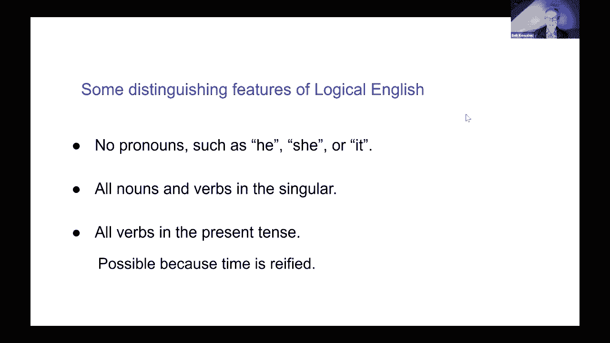

使用现在时，逻辑英语到，呃，你以前看过的讲座，给出了一个，个人和公司之间的利益冲突，从逻辑英语的角度看化学。

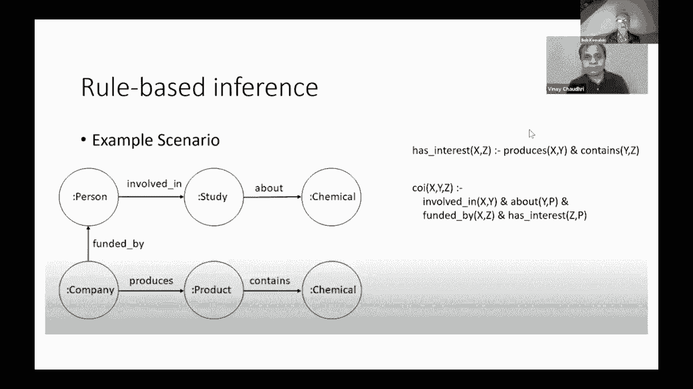

我们将用类似英语的方式表示这个图，通过给出谓词声明，由于缺乏更好的术语，在开始时，让我们称它为程序，所以在一个逻辑英语程序的开始，我们将声明我们的谓词，所以说，比如说，我们可以说一个人参与了一项研究。

这代表了你在这里看到的知识图的一点，我们就会，呃，同样地，又说一项研究是关于一种化学物质的，使用不定冠词是，呃，我们在展示什么类型的呃，我们在我们的语言中，呃，它可以，反过来，用于变量或这些变量的实例。

公司基金，一个人，这表明了我们对现在时态的偏好，我们我们，我们适合过去的主动声音，呃，在抱歉中，主动语态对被动语态，但不一定是公司生产产品的所有时间，产品中含有化学物质。

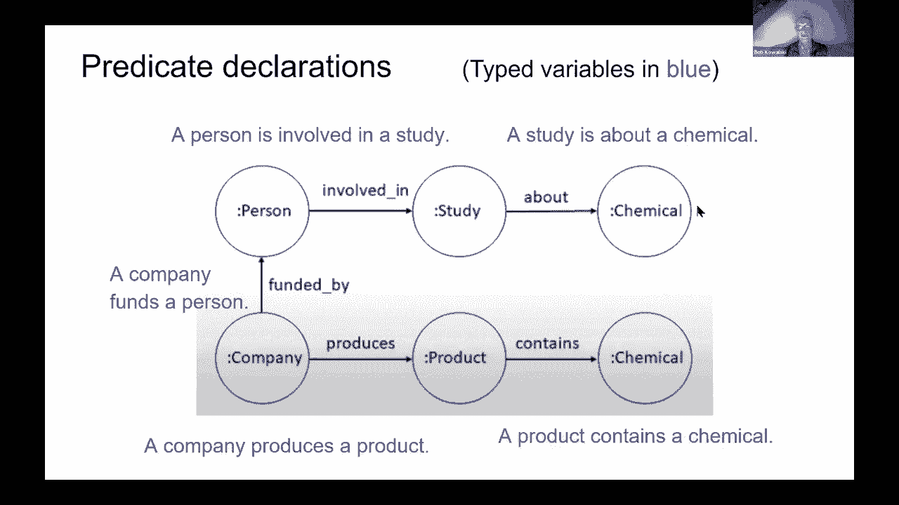

所以说，让我们看看我们玩的语义网络是如何，一九八二年，uh可能适用于这样一个用逻辑英语表示的知识图，例如，假设我们有一家公司生产一种产品，该产品含有一种化学物质，我们可能会得出结论。

该公司对这种化学品有兴趣，当然还有逻辑英语，我们会这样写，先总结一下，该公司对一种化学品有兴趣，你会解释为什么和兴趣是红色的，某公司对该公司的一种化学品有兴趣，看到我第二次提到公司，我用定冠词，的。

我第一次使用不定冠词a，呃，这是一般规则，每当引入变量时，它伴随着不定r或n，当它在同一句话中再次被提及时，呃，它是由，所以一家公司对一种化学品感兴趣，如果公司生产的产品含有化学物质，什么呃。

为什么对红色感兴趣，嗯，自然的英语阅读没有兴趣的变量，但它被引入，这是一个词，事实上，它是一种物体，呃，在那里由n引入，我在片场会争论什么，在，呃，今天的小讲座，我会争辩说，嗯。

兴趣是一个隐藏的存在量词。

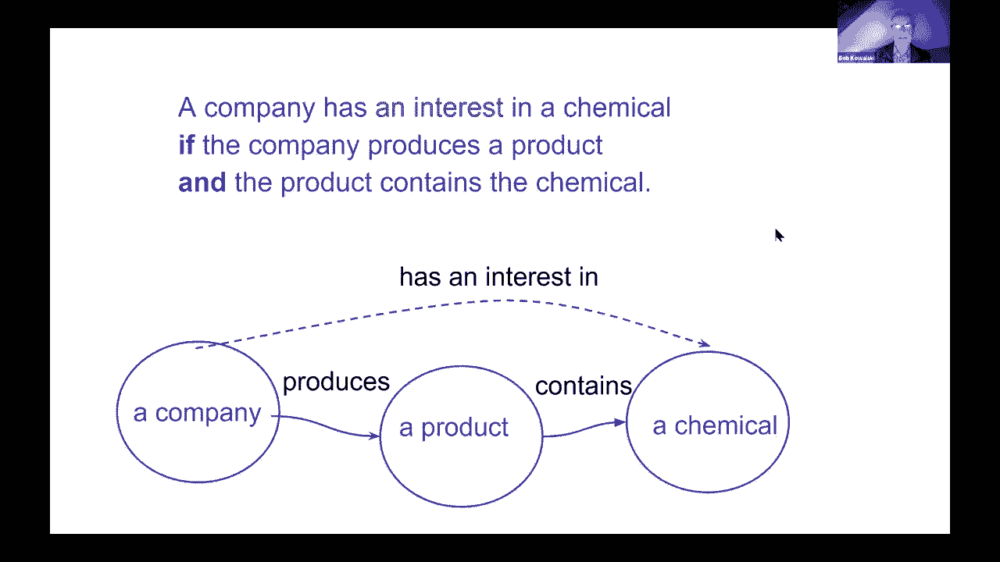

但除此之外，所有的变量和条件都是普遍量化的，它们的范围是它们发生的句子，我已经提到过这个常见的名词。

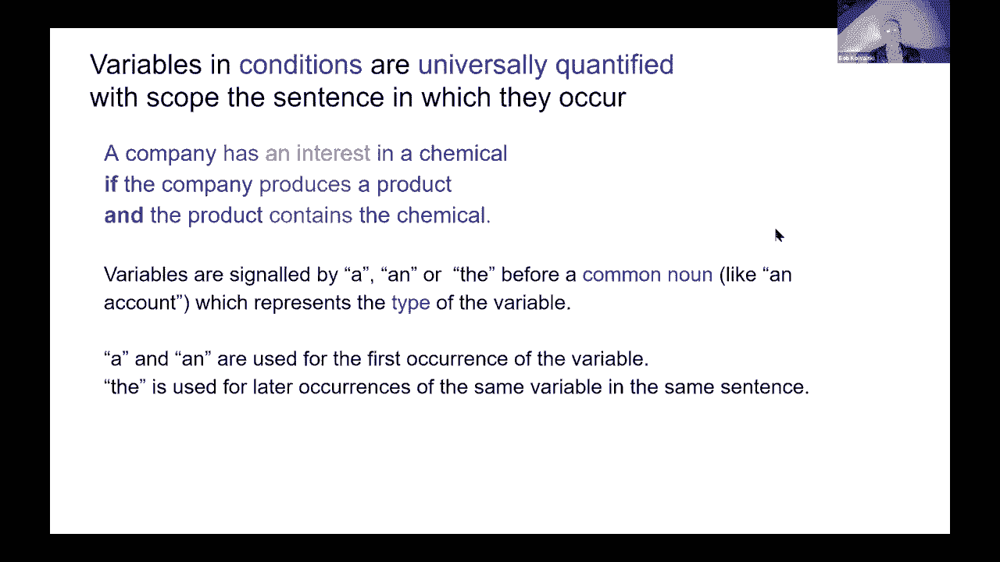

表示类型，和第一次发生时使用的，因此用于以后的事件。

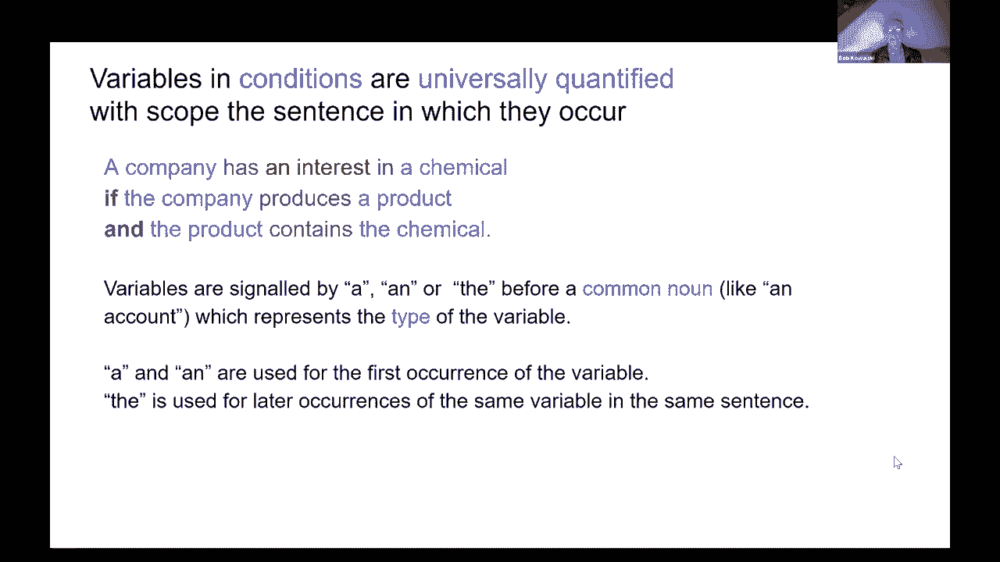

我们可以看看更多涉及的例子，这里有另一个例子，呃，第二条，我们也可以用图形的方式来表示，正如他在那里的演讲中指出的那样，如果您想用二进制谓词表示这一点，你需要给大家介绍一下，你需要做具体化。

在这里我们具体化了冲突本身，然后我们有二元关系，注意到物化，我已经用红色突出显示了，因为它是存在主义的。

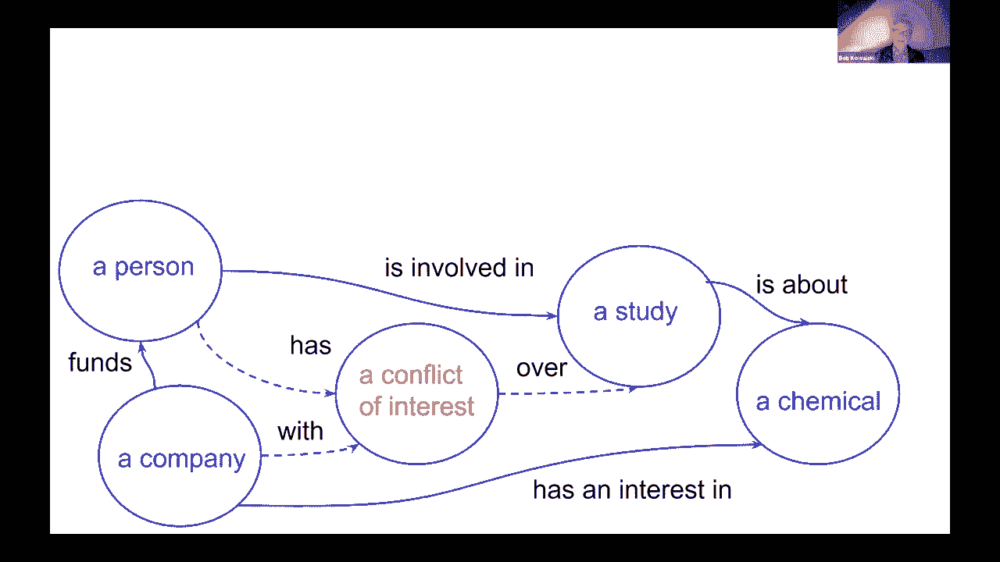

废话，废话，废话，废话，呃，红色的，我得到了存在量化变量。

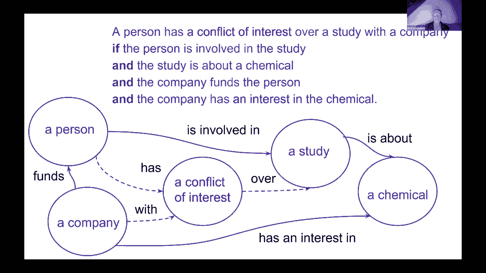

让我指出变量也可以用符号命名，所以没有必要总是提到，简单使用英语的两种类型的对象，我们可以把英语和象征主义结合起来，只要象征，只要象征意义，是一个小学年龄的孩子听不懂的。

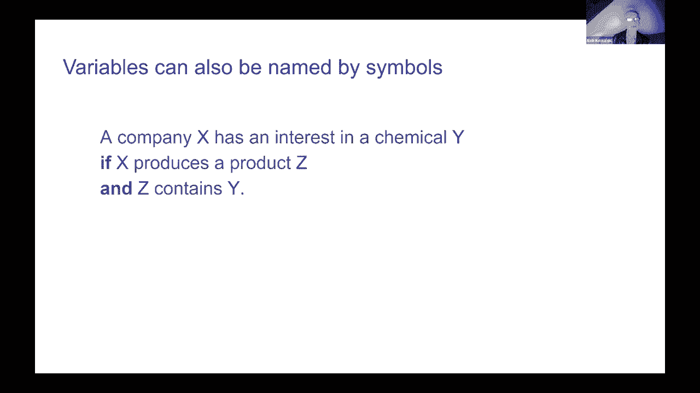

这里有一个更有趣的例子，因为它展示了时间的具体化，允许动词用现在时表示，它还允许逻辑比呃简单得多，涉及模式和可能的世界语义的相关逻辑，很多人发现这超出了他们的教育水平，所以在这个例子中。

我们看到结论是账户上的余额是以一个数额为单位的，一次c t 2，如果一笔金额A在较早的时间从另一个账户转入账户，没有一个，事实上，更早的时间是在T 2之前，和账户余额，呃是早些时候的b量g 1。

新的额是a加b之和，所以这在某种程度上表明了它是如何，我们能够把自己限制在现在时态，通过引用时间或使用时间变量，但我们可以在没有变量的情况下重述，然后我想你会发现这并不罕见，我们彼此交谈，3。

我会在你有空的时候来找你，我们可以用英语说，即使呃，这对一些人来说可能是有争议的，时代真的不像你在现实世界中看到的那样存在。

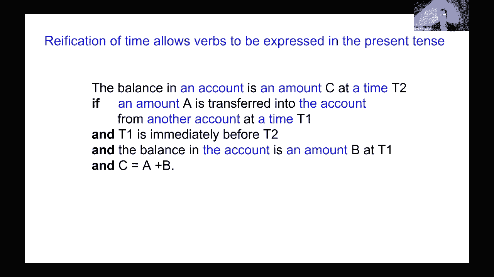

现在，计划是发展和提高逻辑英语，通过一系列明确的扩展，它可以反过来转化为基本形式，只是嗯，与在某种程度上普及的转换语法的思想非常相似，在乔姆斯基抛弃他们之前，在一个这样的扩展形式中。

我们也许可以说一些简单的事情，就像账户中的余额变得，当a和b的和，而不是明确地说明金额A转入账户的时间，账户余额为b，所以有可能有更自然的，呃，表达式，但我们我们，我们是什么，我们是。

我们不顾一切地维持，呃，语言保持明确，我们不想引入歧义，部分，因为这意味着可以直接执行这些。

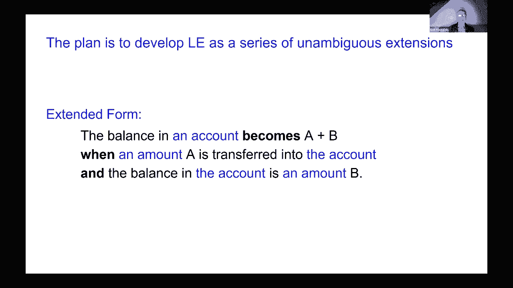

通过将它们转化为逻辑英语扩展中的基本逻辑程序，省略规则是可能的，呃，对不起，省略以介词开头的角色，通常通过添加额外的介词来添加额外的角色，它给出了其他特性，嗯，并写下这些角色在任何顺序。

所以我们可能会开始，比如说，用一个句子说一个数额是，呃，数额的百分比，A在当天从鲍勃的账户转入玛丽的账户，如果嗯，A转入鲍勃账户的金额，从前一天的其他账户，换句话说，鲍勃，呃，慷慨地，呃，转让，呃。

给玛丽，呃，他所收到的任何东西的百分之十，呃，这是前一天，呃，这表明我想得很清楚，嗯，介词如何指示角色，所以转入玛丽的账户意味着她是转账的收件人，从鲍勃的帐户，表明Bob是转移的捐赠者，然后呃。

金额是转让的对象，这就是为什么我用被动语态，所以使用主动语态而不是被动语态并没有什么宗教意义，但这里有一个迹象表明这可能是如何解释的，有，我们没有理由不能重写同一个句子，意思相同，呃，指的是呃，鲍勃。

她是捐献者玛丽是受赠者，把这个呃，不相关点，这笔钱已从…的另一个账户转入鲍勃的账户，在像序言这样的语言中，需要有一个匿名变量，而在这里，匿名变量被简单地删除，因为角色不相关。

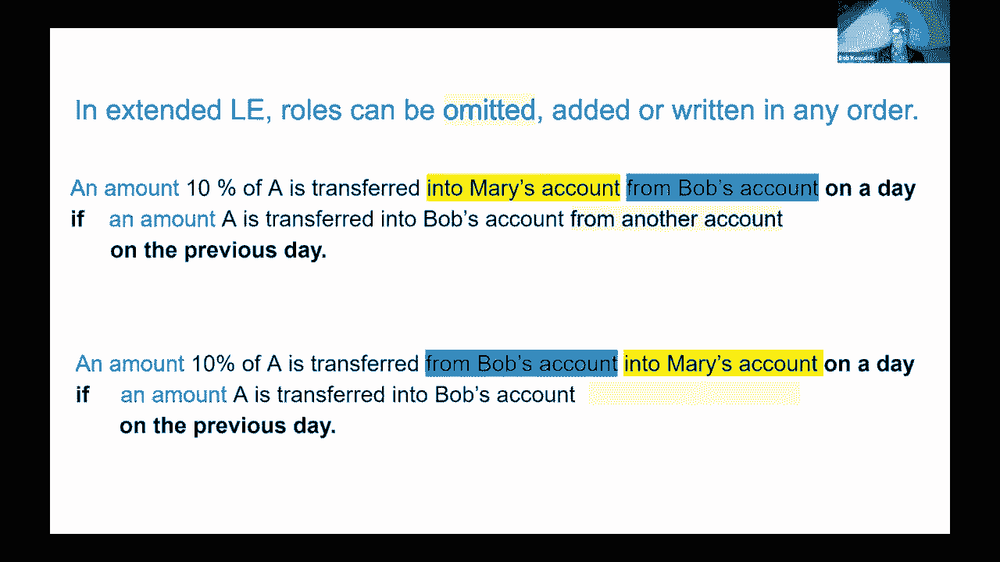

好吧，我，我和往常一样看到了，我是，我是呃，占用的时间比我想象的要多，这是一个好奇心，我想呃，引起你的注意。

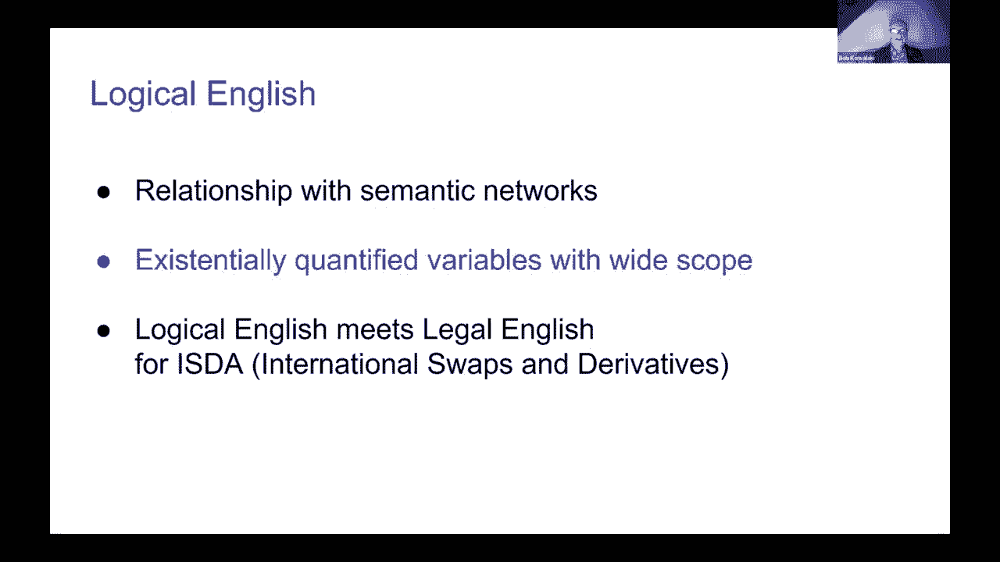

所以如果我们有一个原子句子，有时被称为事实，呃，它有一个以不定冠词开头的变量，呃或n，而我们，比如说，这笔钱从鲍勃的账户转入玛丽的账户，11月2日至3日，不应被理解为所有金额，这并不是普遍量化的。

我们并不是说所有的钱都转到玛丽的帐户上，我们的意思是有些钱转入玛丽的帐户，这表明，如果一个变量在一个原子句子中，那么很自然地将该变量解释为存在量化的，具有广泛范围的存在量化。

这意味着我们可以在引入它的句子之外引用相同的变量，我们可以用另一句话说，比如说，转账的金额大于或等于十英镑，对于普遍量化的变量来说，这并不是真的，普遍量化变量纯粹局限于引入它们的句子。

它们可以在其他句子中重复使用，而它们之间没有任何关系，对于出现在原子句子中的这些存在量化变量不是正确的，请注意，但是，这些变量可以被命名，就像我们可以为全称量化变量命名符号一样，比如T一和T二。

我们也可以有名字，这实际上是所谓的殖民的结果，例如，数额，一个零，零一七被转移，和一个零，零一七比呃大。

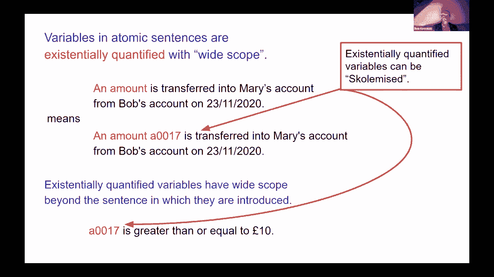

现在十磅，这不仅适用于原子句子，具有规定条件的条款的结论也是如此，虽然，对于不在条件下的任何变量，所以任何不在条件下的变量，但在结论中也是存在量化的，它们也有广泛的范围，可以在那个句子之外重用，例如。

如果我说有一笔钱转入玛丽的账户，从鲍勃的帐户，今天是本月的第一天，我不是说，每一笔款项都被转移，我是说某些特定的，转移一些特定的金额，而且，这个具体数额是一个月中某一天的函数。

我可以在其他句子中广泛地提到这个数额，我可以说转移的金额，无论什么月份，它大于，或者等于，十磅，所以量本身就是，月份的函数，或者换个说法，这里有一个适用于所有月份的通用量词。

这并不是说所有月份都有一个金额，这不一样，呃，每月金额，情况正好相反，每个月，存在于数量上，所以这是一般的，呃，每当我们在句子的结尾有一个变量时，呃，那么它是一个函数，所以说任何普遍量化的变量在呃。

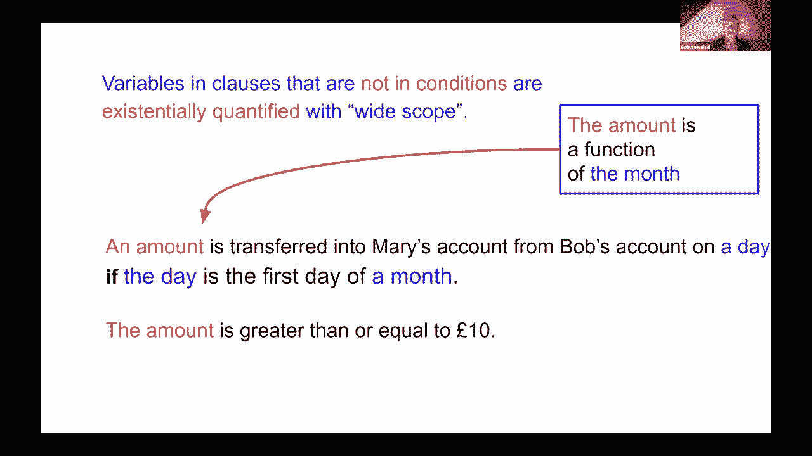

判刑条件，我想我可能会设法合身，呃，我在时段内的演讲，呃，最后，我想提一个非常具有挑战性的例子，有趣，如果你这么倾向于。

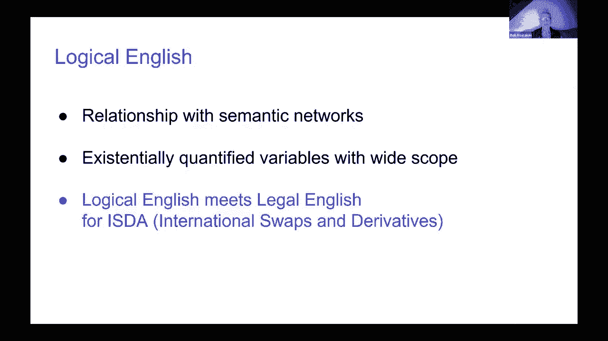

这项工作还在呃，订正，虽然最新的修订版非常接近出版标准。

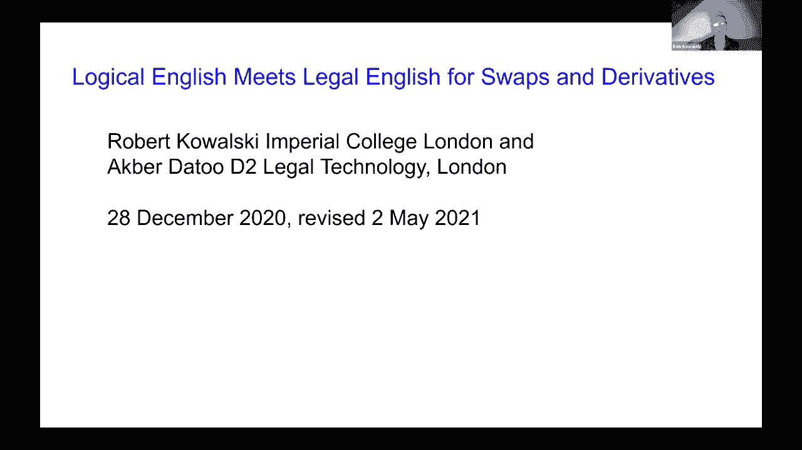

我明白了，我做了一些有趣的事，所以这里是这里是嗯，复杂的从句，这是典型的国际掉期和衍生品协会主协议，其中涉及提前终止合同，在一方违约后，呃，如果其中一方违约，所以这是第一个案例，如果其中一方违约。

那么另一个非违约方有权利或权力，呃指定提前终止日期，呃，但是呃，时间上有限制和限制，然而，然后这个是，然而，那个呃，当事人无权，呃这样做，如果呃，协议的时间表，uh规定自动提前终止适用，在这种情况下。

在这种情况下，提前终止日期将自动发生，呃，在呃的这个时候，违约事件，发生违约事件，比如说，当违约方破产时，或违约方，呃没有表演一些，呃必要的活动。

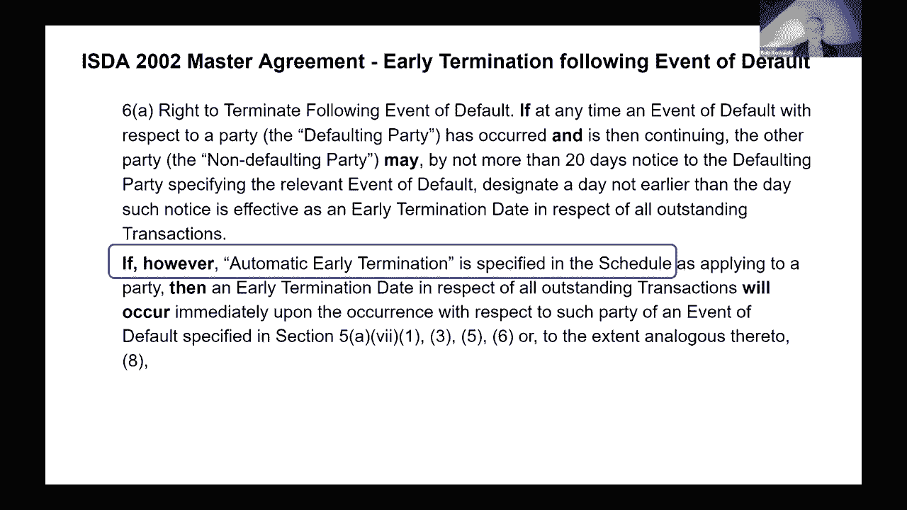

另一方面，有一种特殊的情况与破产形式有关，这意味着自动的，在有关的法庭上出示，呃，法律依据，很明显，我不想让你试图理解这一点，但我我有，呃，我想让你注意到这是，呃，非常符合。

我以前介绍过的逻辑英语的严格形式，这里的每个句子都有一个结论和一个条件，呃，所以我们有第一句话，它谈到了，嗯，当事人指定的权利，嗯，提前终止日期，我们有，嗯另一个，呃，说提前终止的句子，另一方面。

第一句是一个规则的事实，另外两句话是例外是以一种方式处理的，这是相当呃，逻辑编程中的标准，呃，就是加入一个呃，第一句的否定条件，所以呃里面的话，呃，然而，这个词，然而，翻译成。

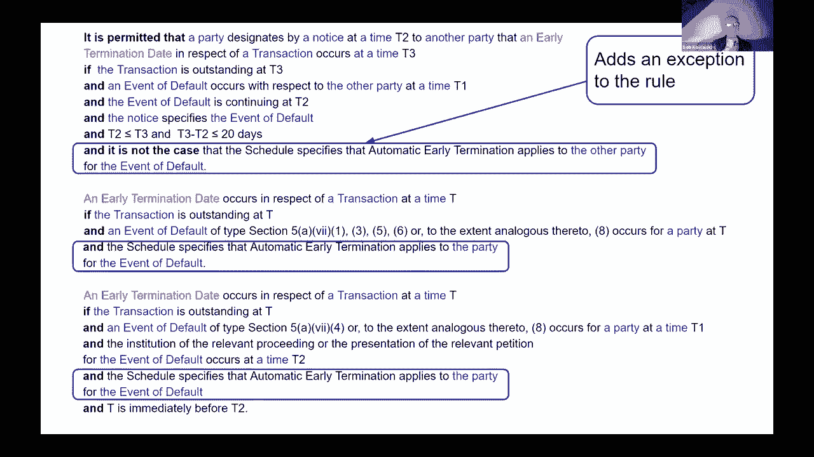

事实并不是，自动提前终止被指定为适用，你不想详细了解这一点，你首先想看的是，嗯，你想看到它有逻辑，它有合乎逻辑的英语形式，它基本上是逻辑程序的语法糖，它有通用的量化变量和类型，呃有角色。

它在结论中也有一个存在量化的变量，因为它们不是在这种情况下发生的。

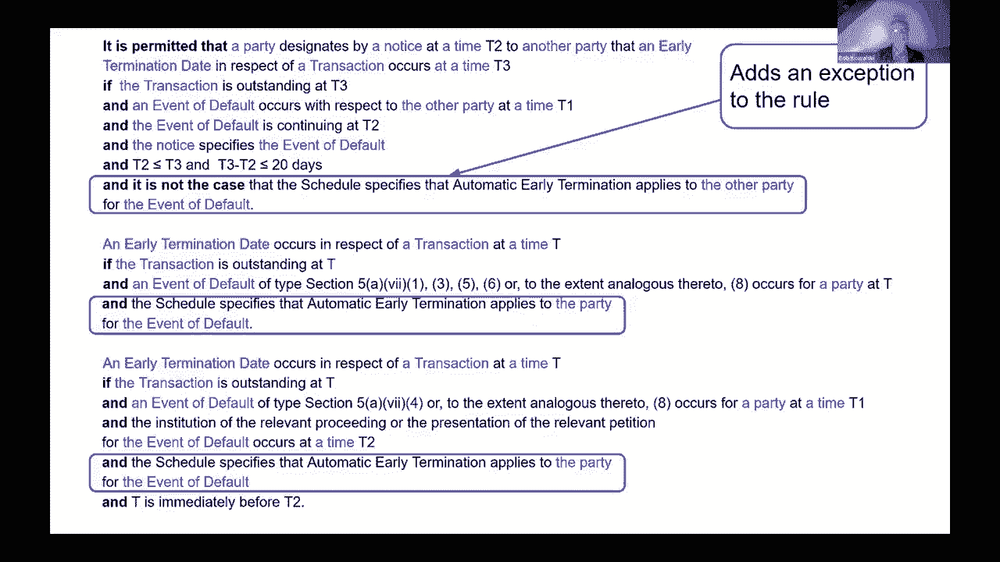

所以提前终止日期发生，我们不是说每一个提前终止日期，因为我们说的是某个特定的提前终止日期，它是一个函数，而且它是一个，它是违约事件和违约一方的函数，可能还有交易，但这适用于所有事务。

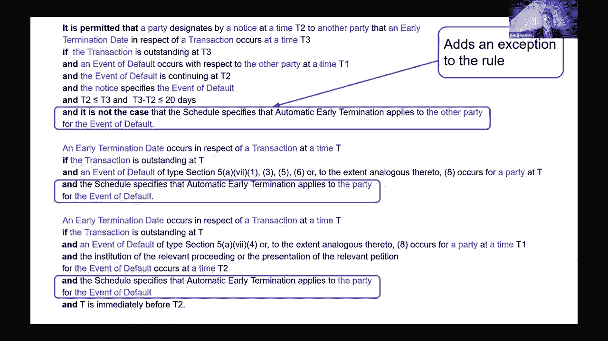

所以我就不多说了，所以我想我已经花了必要的时间来展示逻辑英语，在一些总结细节中，最后，请允许我说，呃，逻辑英语，首先是一个逻辑，这是一个比它的许多竞争对手简单得多的逻辑，包括呃，涉及模态逻辑的竞争者。

具有可能的世界语义，用，希望你们中的许多人不需要担心，最重要的是，它还有许多实际应用，它也是英语的一种形式，这可以说是值得教的，只是为了教英语句子可以有意义，让它们有意义。

我们需要确定它们明确的意图解释，呃，我想很多孩子知道这一点会很惊讶，就是这样，所以它可以作为英语的一种形式来教，它也是，我觉得，嗯，计算机语言在未来的潜力，不是的计算机语言，嗯，不是人质，呃对呃。

技术呃，只有受过良好教育的软件工程师才能理解的术语，但可以被利益相关者理解，呃，而且可以是，呃，争论、解释和辩论，所以我喜欢认为有一些未来，未来是光明的，所以谢谢你给我这个机会。

今天与大家分享我的希望和抱负，谢谢。是啊，是啊，谢谢鲍勃对逻辑英语的精彩概述。

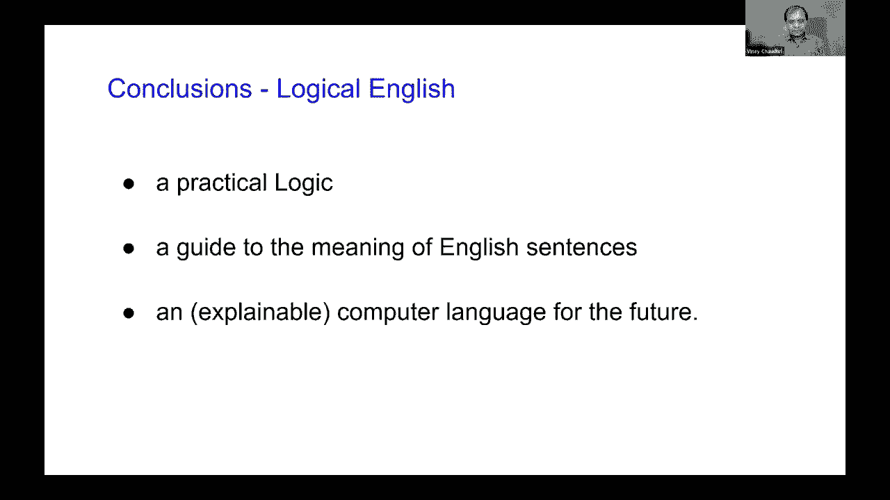

呃，我们知道在你的世界里已经很晚了，如果你能再呆15分钟左右太好了，否则你知道，非常感谢你抽出时间和我们分享，呃，你的工作，呃。

