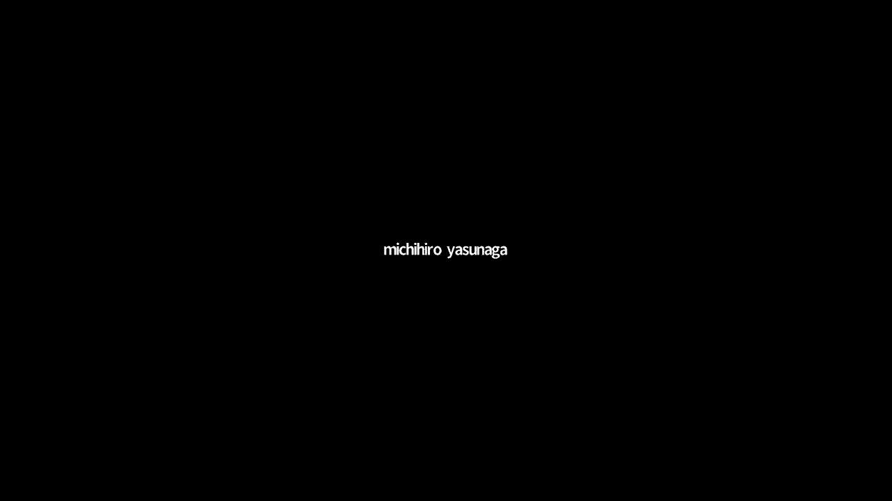
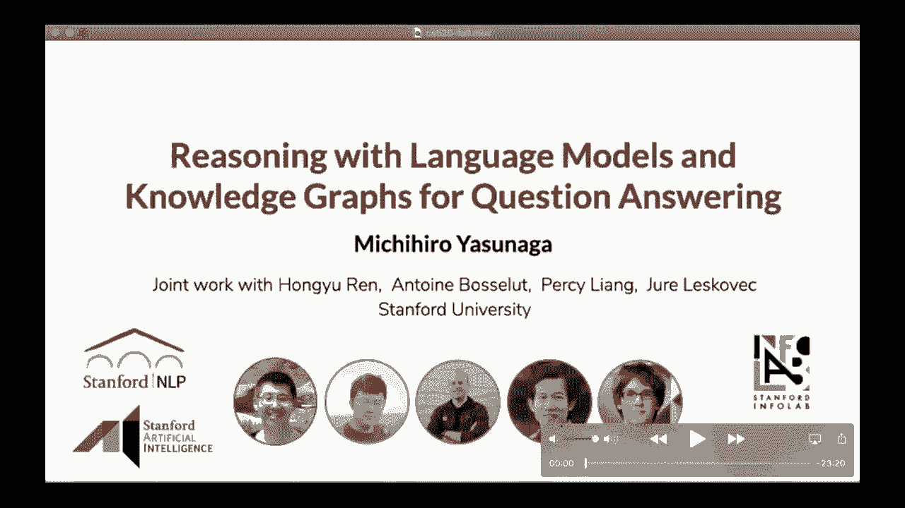
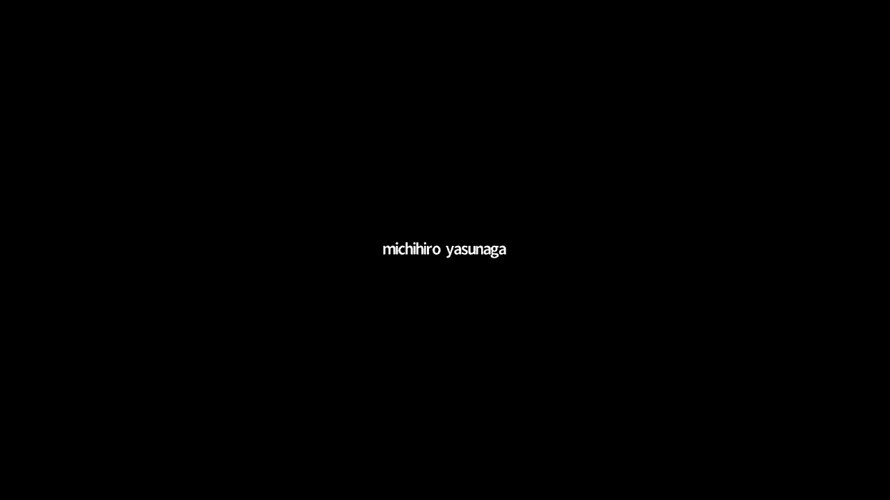
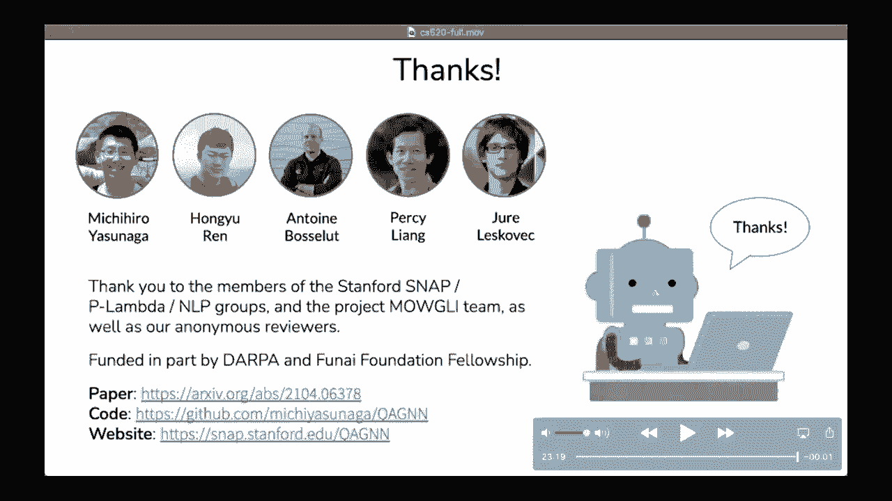

# 【双语字幕+资料下载】斯坦福CS520 ｜ 知识图谱(2021最新·全20讲) - P23：L14.2- 问答系统中基于语言模型和知识图谱的知识推理 - ShowMeAI - BV1hb4y1r7fF

交给你，呃，是啊，是啊，当然呃，让我分享一下我的屏幕。

对不起，我知道。

呃，大家看到我的屏幕了吗，是呀，我们可以看到你的屏幕，好的，当然，然后他们开始感谢你邀请我做演讲，我叫道，在计算机科学系研究自然语言处理的博士生，我将谈谈我们最近就这个问题所做的工作。

使用预先训练的语言模型和知识图进行回答，这是我和合作者的合著，洪宇安托万和我的顾问们，珀西和乌里，在投入主要工作之前，让我先简要介绍一下语言模型和图神经网络，因为在这次演讲中，除了知识图之外。

它们是重要的构建块，理想语言模型给出文本的部分序列，我们让模型学会预测文本的其余部分，有两种类型的语言模型，一种是自回归语言模型，在那里你预测下一个词，给定前面的一系列单词，比如说。

考虑到你想预测下一个词的狗追逐，比如飞盘，另一种类型的语言模型被屏蔽，其中你在一个序列单词中预测掩码单词，在本例中，你想在这里预测面具词，这可能是一场追逐，事实证明，这种语言模型需要各种语言技能。

世界知识，常识知识和领域知识做好，比如说，在句子中斯坦福大学位于面具加利福尼亚，模型需要了解地理或事实知识，在句子中，女人穿过马路，从面具的肩膀上看过去，我们想让模型预测她，模特需要知道代词等语法。

在这种情况下，模型需要知道常识性知识，比如与鱼和海龟的单词联想，最后，在课程描述中的句子中，模型需要有一个世界知识，预测CS五二十课程是一个类似的，以研究人员和行业从业者为特色，这几天。

语言模型架构通常是大型神经网络，如变压器，研究人员在大量文本集合上训练语言模型，比如维基百科和书籍，让模型获得知识，伯特，罗贝拉，gpt，三个，等等都是突出的例子，训练的语言模型，或者更准确地说。

训练过的表示，然后可以适应各种感兴趣的应用，例如回答问题，那么我们通常如何进行这种适应，假设我们给候选人一个问答，我们可以把一个问题和每个答案连接起来组成一个句子，将其拟合到语言模型中。

通过线性层得到每个选择的概率得分，我们可以使用标记的问答数据集微调这个模型，语言模型的字符串是它们有广泛的知识覆盖，多亏了大语料库的广泛预培训，他们可以处理各种质量保证问题，包括常见的基本问题，如本例。

这不容易表示为Sparkle查询，可以直接在知识图上执行，或者使用预先训练的语言模型作为稍后进行问题回答的构建块，在这次谈话中，接下来让我简单介绍一下图神经网络gnns，DNA的基本思想是更新表征。

图的每个节点的嵌入，通过让相邻节点相互发送消息向量，假设我们在节点V上，它的当前表示是hv k减去一，发出的每个节点的更新规则，取邻居节点u的表示，并聚合它们以获得总消息，比如求和。

然后我们通过组合h和a来更新节点v的表示形式，这个组合函数可以是线性变换，比如说，这样我们就可以让GNN学习更好的节点表示，我们将使用图神经网络来诱导表示或知识图，在这次演讲的后面。

也许我会在这里暂停一下，查看是否有关于语言模型和GNN的问题，是啊，是啊，我觉得很明显，我没有看到任何问题张贴到聊天，所以我想我们可以继续前进，听起来不错，问答是自然语言处理中的一个基本问题，并做好。

系统需要获取相关知识及其原因，通常，知识可以编码在大型语言模型中，预训练或非结构化文本，如bert，或者用结构化知识图来表示，如Freebase和Concept Net，其中实体表示为节点。

它们之间的关系表示为边，两种知识来源优势互补，预先训练的语言模型在许多质量保证任务中表现出了巨大的成功，由于其广泛的知识覆盖，但与此同时，它们可能不能很好地用于可解释或逻辑推理，比如一百个否定。

另一方面，KGS被更明确地表示，并被结构化和可解释的推理，但是知识图可能缺乏覆盖面，而且很吵，所以在这个作品中，我们的目标是利用这两种知识来源，在问题回答方面做得更好，那么为什么这个问题又难又有趣呢。

假设系统被给出一个常识性问题，问这里有没有用，圆刷就是一个例子，以及一些答案选择，如发刷和艺术用品，我们把这样的问答选项集叫做，给定QA上下文的QA上下文，并可能用语言模型对其进行编码。

模型需要首先从大的，呃公斤，比如这个绿色的盒子，然后模型需要捕捉问题的含义，在问题中包括否定，以及知识图的结构，就像实体之间的关系来执行联合推理，所以这里列出的这两点是这个问题中有趣的研究挑战。

在这部作品中，我们呈现的是QA GNN，一种新的语言模型和知识图的混合模型来解决这些挑战，让我先概述一下QA GNN，首先呢，给定QA上下文，我们将使用语言模型将其编码为向量表示。

然后使用标准方法检索知识图子集，比如连接实体，让它们的邻居出现在知识图上，那么QA GNN是基于两个核心理念，首先，为了更好地识别哪些知识图节点与当前问题相关，我们提出语言条件kg节点评分。

我们使用pre，训练语言模型，以当前问题为条件计算每个公斤实体的概率，与语言模型和知识图联合推理，我们将问题文本和kg连接起来形成一个联合图，我们称之为工作图，然后通过图神经网络相互更新它们的表示。

cnns，终于，我们结合语言模型和kg的表示来预测最终的答案，在下面的内容中，我将更详细地介绍这两个想法，我们提出公斤节点评分的动机是为了更好地从公斤中识别相关知识，给出一个问题，假设我们有这个问题。

问旋转门方便双向出行，但也是一种安全措施，在什么和答案选择，如银行，现实世界的知识图是巨大的，有一百万个实体，提取千克子集的现有方法是识别试剂盒中的实体，在QA上下文中，比如旅行，门，安全和银行。

我们称之为主题实体，然后从知识图中检索它们的一个半邻居，这可能会引入许多实体节点，与QA上下文语义上无关的，特别是当主题实体或跳数增加时，所以在这个例子中，一跳邻居可能包括假日等节点，河岸，人与地方。

但它们偏离了主题或过于笼统，无法提供信息，应对这一挑战，我们建议使用pre，训练语言模型对问题上每个公斤节点条件的相关性进行评分，特别是，我们连接qa上下文和kg中的每个实体，并将其输入语言模型。

以计算每个实体的概率，公斤中的所有节点关于问题的分数，就像在图表中，深绿色表示得分较高，比如说，像抢劫和安全这样的实体现在有更高的相关性得分，而像河岸这样的实体可能得分较低。

下一个自然的问题是如何使用这个相关的分数，一种选择是使用它们来修剪kg节点，这样喂入模型的公斤就可以更小，有助于提高时空效率，另一个选择是使用分数作为kg注释的附加功能，它提供了千克重量信息的一般方法。

我们将在图神经网络架构中追求这个方向，我们接下来介绍，所以下一个模型组件是联合推理，为两个知识来源设计一个联合推理空间，我们以一个公共的图结构显式地将它们连接起来，我们引入一个qa上下文节点z。

并连接到kg中的每个主题实体，因为这个联合图直观地提供了推理的工作记忆，我们称之为工作图，工作图中的每个节点都与四种类型中的一种相关联，紫色是qa上下文节点，蓝色是有问题的实体，橙色是答案选择中的实体。

灰色是其他实体，qa上下文节点的初始节点表示是语言模型编码，其他的没有表示，这些是预先训练的实体嵌入，工作图基本上将两种模式--文本和公斤--统一为一个图，对工作图进行推理。

我们设计了基于注意的图神经网络方法，gnn的基本思想是更新每个节点的表示，通过让相邻节点为多层相互发送消息向量，具体而言，在我们的模型中，我们在这里用这个规则更新每个点T的表示。

其中m是来自邻居节点的消息向量，s alpha是当前节点之间的张力权重，t，源节点的查询向量Q和目标节点的键向量K，我们让键和查询向量以节点相关分数为参数，然后使用查询和键向量来计算他们的注意力权重。

使用内积，好的，所以这是我们整体方法的概述，我们已经讨论了这里提出的两个核心思想，现在我想谈谈我们的方法作为实验设置的评估，我们使用两个流行的QA基准，它们需要用知识进行推理，一个是常识QA。

它有多项选择题测试常识知识，另一个数据集是开卷QA，它有多项选择题测试基础科学知识，用于知识图，我们使用概念网，这是一个开放域kg，有近一百万个实体，在该领域的先前工作之后。

我们将每个问题中的实体链接到概念网，并提取两个热路径的子图作为我们的输入kg，我们的KJ节点评分思想是在这个预处理之后执行的，我们比较的主要系统是微调的语言模型，如Roberta，和以前的语言模型。

关系网等加公斤模型，在我们提出的QA中，它们之间的主要区别是，GNN是我们估计kg节点与权重问题的相关性，公斤信息，我们的模型相互更新语言，关节图上的模型和千克表示。

我们对这里显示的所有系统使用相同的预先训练的语言模型Roberta，以下是实验结果，我们发现QA GNN比以前的系统实现了更好的性能，在两个QA基准上，看看我们提出的两个主要想法的效果。

我们还进行了应用研究，我们发现如果我们不形成文本和kg的联合图，和相互更新的表示，性能下降了大约2%，它现在接近于以前的LM加公斤型号，我们还发现去掉公斤级的相关分数会降低大约百分之一的性能。

我们也发现，笼子节点评分往往有助于，当问题中的实体数量较大时，或者回收的公斤大小很大，另一方面，当问题有否定时，联合图表示和消息传递往往会有所帮助，接下来我想在这里分享一些瓶子的案例研究。

我们最近试图解释这个模型，给定QA上下文，我们试图追踪QA GNN计算的张力流，从qa上下文节点，紫色节点来质疑这个，和其他两个以公斤为单位的实体，在本例中，我们发现qa上下文节点关注电梯和地下室。

他们负责你的大楼，大楼负责办公楼，这就是答案，这有助于我们从模型中找到一个推理过程，在第二个例子中，我们试图追踪从qa上下文节点到两个问题实体的注意力流，回答是，在这种情况下，左边是大便，右边是盐水。

我们能够在公斤上找到桥接实体，例如海洋和海洋，我们还发现QA GNN可以处理一些稳健的推理，比如百否定和实体替换，比如说，如果这个问题在这里没有用，请考虑它，圆刷就是一个例子，因为这个问题有一个否定。

2。正确答案是我们的货源，而不是发刷，在这个最初的否定问题中，模型关注正确答案圆刷，然后我们现在在问题中翻转这个否定，模型关注这里的实体并正确预测发刷，在第二个例子中，我们改变了原来问题中的实体。

在这里变成艺术，我们发现模型根据头发调整了答案，刷子，在这里，我展示了更多测试这种稳健推理的例子，比如更改否定和实体名称，我们发现像Roberta这样的语言模型在这些测试中失败了。

但是Qagn似乎正确地处理了其中的一些，我想分享我们对知识图何时有助于回答问题的分析，当语言模型有帮助时，相比之下，我们调查了QAGN成功回答问题的案例，但是罗伯塔语言模型失败了。

一种倾向是当具体的知识，如事实，反义词，否定在这个图中提供了答案的关键，我们有个问题，如果你有推迟工作的倾向，为了按时完成，你必须做些什么？这里的蓝色节点是问题概念，红色节点是答案概念，在这个问题中。

我们基本上想找到问题概念的反义词，公斤为您提供了从延迟到加速的明确路径，这就是答案，另一个特点是当kg路径可以为推理提供支持时，在这个问题中，黄鼠狼成了一个问题，它一直钻进鸡蛋里。

我们发现公斤提供了从像黄鼠狼这样的问题概念的多种路径，鸡肉和鸡蛋到答案概念栏，另一方面，我们还发现了Roberta语言模型成功回答问题的例子，但是在这种情况下，QA GNN公斤感知方法是失败的。

这个问题通常需要微妙的语言细微差别和常识，简单地依赖知识图路径可能会导致错误的答案或无法决定，例如，在这个问题中，詹姆斯抬起头来，看见那颗星在那边的黑暗中闪烁，他对他们的数量感到惊讶。

正确答案是宇宙的大小，但是千克感知方法预测夜空，因为它更好地与知识图上的闪烁和黑色等问题概念联系在一起，但对人的眼睛来说，我们明白，与夜空相比，语言的细微差别使宇宙成为一个更好的选择。

这里有另一个类似的例子，问题是，如果是混合的，你会在液体餐中加入盐和胡椒粉，千克感知方法预测水是因为，可能是因为它们更好地与问题概念联系在一起，但是语言模型正确地预测了汤，根据我们的常识。

这也是一个更好的选择，因此，从这些例子中我们发现知识图和语言模型具有互补的字符串，所以我们也进行了一个甲骨文实验，其中，如果语言模型或kg感知方法中的任何一个答案正确，我们把它算作成功。

我们发现这个甲骨文可以实现比Roberta和QA高得多的性能，gnn，这个结果可能暗示了一个潜在的有趣的呃，未来研究方向，比如学习弄清楚要依赖哪些知识来源语言模型kg，最后，我想总结一下这次演讲的要点。

我们的动机是将两种知识来源结合起来，预先训练的语言模型和kg在问题回答中做得更好来解决这个问题，我们推出了一种新的型号，Qa gnn，它有两个创新，我们使用语言模型对问题的节点相关性条件进行评分。

这是一个关于公斤重量信息的一般框架，比如软检索或招聘，然后提出了语言模型和kg的联合推理，其中我们将文本和知识图连接起来，形成一个联合图，并相互更新他们的表示，我们还发现了有趣的见解。

当检索到的kg很大或有噪声时，kg节点评分往往会有所帮助，和关节，当问题需要丰富的推理时，语言模型或kg消息传递往往会有所帮助，比如否定，所以对于案例研究，我们还发现语言模型和kg有互补的弦，谢谢！

我很乐意回答任何问题。

是啊，是啊，我只有这些。

所有的权利，非常感谢，谢谢小道，所有的权利，所以我们现在的问题是，回答，呃，我们大约有四十分钟，有两个问题要问鲍勃，第一个问题是写合同用的是逻辑英语吗？逻辑英语能识别现有合同中的缺陷吗，好的，嗯。

这是个很有趣的问题，因为当我们看国际掉期和衍生品合约时，英语很复杂的地方，呃，我们发现，嗯，我想说，从我的角度来看，英语很差，嗯，与你在立法语言中找到的那种英语相比。

所以立法者通常是法律专业人士中的佼佼者，呃，但他们对语言的掌握并不是不是那么充分，我想说无论如何，呃在和，呃，我们看过的合同，我们发现了很多瑕疵，事实上，呃，大多数情况下。

英语是为了让律师听得懂而设计的，客户听不懂，我觉得，我想几乎是有意识地努力让英语变得难以理解，呃，以便为，为了法律，呃，呃，专业人士嗯，嗯，错误比你实际可能犯的要少，呃预期，但总的来说，我认为，嗯好吧。

让我们换个说法，在立法领域，有一个很大的运动走向平实的语言和清晰的语言，在合同法领域，几乎有相反的动作，移动动作晦涩难懂使用晦涩难懂的语言，呃，需要翻译，我们发现了很多案例，合同状态不同于普通法的解释。

在这种情况下，普通法的解释优先于实际记录的内容，所以是的，有一个，呃，意图和实际写的之间有很大的差异，谢谢。鲍勃还有一个问题，呃，谢谢你提供非法知识通常涉及，复杂的时间约束，涉及诸如while直到。

在不久的将来任何时候包括这些的计划，或者任何关于如何建模的想法，是啊，是啊，所以我想我确实举了例子，呃，就在前面，为什么，什么时候，什么时候意味着x，当y表示x在，嗯，如果y在同一时间，所以是的。

我们我们做，并一直致力于纯自然语言，沿着模态逻辑中找到的线表示时间，但事实上，模态逻辑，用了"直到"和"同时"之类的词，有一个非常复杂的语义，其次，有时我们想抽象地谈论时间，当我们想更具体地谈论时间时。

所以我们不总是希望过于简化，当谈到那个的时候，但确实，这项工作中最大的挑战之一是试图使，尽可能简单地谈论时间，但同时你不知道过于简化了，谢谢。这是个好问题，谢谢。还有一个问题，美一郎美一郎请你比较，呃。

你的QA GNN与GPT三正确，这是个很好的问题，所以在我们做这个项目的时候，我们没有访问PS的权限，三三需要那种你需要许可才能使用它，当时我们没有，所以我们没有真正运行它。

但我认为这是一个非常有趣的实验，无论你想做什么，有一点需要注意的是GPT 3是一种很少的学习，呃，和GB 3可以得到的范例，比如说，就像它的上下文中的两千个类似的代币，你用QA喂一些夫妇。

就像在里面的例子一样，作为一开始的一种提示文本，然后你让GPS三到呃，预测下一个词，下面的句子作为你的答案，所以我想在GPU三的自然范式中，它可能会用，是啊，是啊，那些像很少设置的。

然后与我们的QN进行比较，但是QA是经过训练的，呃，使用基准测试的all label数据变量，所以是的，这里有些出入，嗯，但是是的，谢谢你问这个，我认为这是一个非常有趣的探索方向，谢谢。那么我呃。

有一个问题，我觉得你可能真的，在逻辑英语空间里感到兴奋，关于人性，等，你想问清楚吗，其实，嗯，我得到了答案，在昨天迈克的课上，这个问题回答得很好，我觉得我能回答这个问题，但是呃，所以问题是，你知道的。

在法律合同中，有时模棱两可是可取的，如果你用逻辑英语，它使合同非常不人道和不灵活，我在昨天的讲座上得到的答案很好，任何时候我们需要在合同中引入灵活性，我们可以显式地编程，就像我们可以有这样，假设你知道。

有一个，有一个地方，人类需要行使谨慎，所以你还是可以，你的合同精确，在这个精度范围内你可以在任何需要的地方提供灵活性的空间，但你是有意识地这样做的，你不只是，你知道，让它变得如此不透明，以至于你不是。

你不清楚这是否故意模棱两可，相反，它在设计上是模棱两可的，所以我不知道，你会怎么做你会怎么做，你对此有不同的看法，或者我我很好，我当然同意一切，你已经说过了，所以我当然同意这一点，但这是，嗯。

我很惊讶这种困惑仍然存在，人们无法区分模糊和含糊，所以呃，甚至我已经和法律谈过了，嗯，我已经和联盟谈过了，我能叫他什么呢？律师们，我们该说，它们没有对歧义和歧义之间的本质区别，模糊的开放纹理。

所以有一些词比如品行端正或者做出合理的努力，根据定义，几乎无法定义，它们在法律上是必不可少的，它们在生活中是必不可少的，另一方面，歧义是完全不同的东西，至少当术语被精确使用时，歧义和歧义是有区别的。

嗯和和开放的纹理或模糊，所以逻辑英语的作用是，它完全包容了开放的纹理和模糊，绝对没有理由不，呃，开放纹理概念，例如品行端正或作出合理的努力，但另一方面，我们不想再说她不喜欢她了，这种性质的事情。

我们完全不知道，不管她是玛丽还是爱丽丝，她是玛丽或爱丽丝，或者完全不同的人，所以如果你从纯粹的句法角度来看，歧义与不同的句法分析器有关，如果你超越这一点，即使句法部分可以有不同的语义解释。

但它们是不同的，通常无论如何，但我想敦促的是更大的教育，区分歧义，模糊和开放的纹理，你知道它就是不，只是看起来阴云密布，的，对整个领域的理解，它是，令人震惊，我想说你知道这样一个基本的区别是没有的。

你知道的，应该每天做，最高法院，比如说，你谈论美国最高法院，最高法院没有消除歧义，最高法院就如何解释模糊的概念做出裁决，随着时间的变化打开纹理概念，有两种不同的思想流派，你会解释一个模糊的概念吗。

就十八世纪或十七世纪最初所理解的而言，还是照今天的意思去解释呢，我是说这和歧义无关，和开放纹理有关的一切，好的，那是咆哮，和我，这是正确的，我看到迈克尔，我看见迈克尔在摇头，我想请迈克尔。

你能就同上提出你的意见吗？就像你可以说的，不止这些来吧，我完全同意，我想你和Vinay一样捕捉到了它，呃，这是其中一个，你应该从这个特定的问题和事件中吸取的东西，是在课堂上发生的吗。

我们试图确保学生们做到这一点，我们为他们把它挑开，在那里我们消除误解，当为了用逻辑说某事时，你必须完全消除一切歧义，这根本不是案例逻辑，逻辑之美，它允许一个人表达完整的信息，它给你分离，它给你存在感。

这样你就能准确地捕捉到你的意思，像你喜欢的那样精确或模棱两可，而不引起无意的歧义等等，所以是的，我是，我完全同意你的看法，这是一个，不幸的是，这是一个我需要一次又一次地说出来的副歌，因为常见的误解。

因为不是每个人都学会了，另一个咆哮，我可以持续很长一段时间，我来介绍一下，我学过逻辑，我学过逻辑，不是在我的数理逻辑课程中，不是在任何哲学中，我在芝加哥大学学的是逻辑学，在英语课程中，我英语得了D。

因为我用的代词没有参照物，因为我是这样的，我想我应该是一个诗人，你知道这不是由我来决定我的意思，是给翻译的，你知道我在写诗，我写的东西没有任何意义，是我，对读者来说，挑战是发现我，我的天啊，好的。

所以所以我想，在我们课的背景下，我们有兴趣向知识图提出问题，有一种方法是以某种合乎逻辑的方式提出问题，英语对呃，使用语言模型，或者更灵活的自然语言方法，你知道我们描述问题的方式，你知道的。

如果你使用结构化英语，你必须在你的规格上工作，你必须在语法上下功夫，它将接受，这将定义你将接受的家庭，如果你要使用语言模型，那么你就把一些负担转嫁给了统计数据，你会从课文中得到正确的。

你不会做所有这些的，我是说，我想真正的问题是，当我们为知识图设计查询接口时，我们应该如何思考这两种不同的方法，我是说一个总是比另一个好吗，它们是相互排斥的吗，他们应该一起用吗？嗯，那又怎样。

你对此有什么看法，好吧，好吧，逻辑英语不是设计的，呃，呃，成为查询语言，逻辑英语被设计成一种读者能理解的编程语言，所以目前我们在计算方面遇到了危机，用，你知道的，数以千计的计算机语言。

每个都有自己的语法，每一个都有自己面向计算机的操作语义，与操纵计算机中的内存位置有关，对于一个你认识的普通人而不是计算机专家来说，这些程序完全听不懂，所以计划是有一个单一的。

表示各种计算机程序的统一方式，使其具有可读性，还是很难，这可能是你问题的要点，还是很难写，用同样的方式，写好很难，首先要讲清楚英语，作为查询语言，写起来并不那么容易，严格逻辑英语句子。

所以我写普通英语没有问题，然后通过呃来消除它的歧义，返回，你知道吗，精确逻辑英语，对用户试图实际查询的内容的潜在解释，嗯是的，所以读和写有很大的区别，你知道吗，莎士比亚是可以读的。

但我们中没有多少人能像莎士比亚那样写作，我只是不想，让它完全过去，我认为逻辑英语逻辑是一种很好的查询语言，如果我想从我的知识图或数据库中准确地找到我想要的信息，那么对我来说，能够定义结果集就很棒了。

我想要的是一种英镑语言，那是清楚的，干脆利落的，毫不含糊的，我可以依靠给我这些答案，所以其实，这是一种奇妙的查询语言，也就是说，目的不是作为查询语言，它是一种捕捉定义和知识的语言。

包括它来增加知识图中的内容，给出定义，赋予知识图中的概念以意义，这绝对是它的全部，但我不想说它不是一种好的查询语言，这是一种很棒的查询语言，米切尔，你想把你的观点放在这里吗，是啊，是啊。

所以我想我可以从问题的回答中提供更多的视角，呃，方面，我认为就绝对结合而言，你知道的，语言模型和知识图是一个很好的未来，就像呃，我想我应该有一个像我们所有实验一样的经历，语言模型的集合，知识与知识图。

这就实现了比仅仅使用，你知道的，只有一个是对的，所以我认为这是一个很好的方法，我觉得我今天展示的作品，第一次尝试把知识图和语言模型结合起来，就像一个联合图一样，让模型从数据中学习，在它们之间进行交互。

我认为这是一种非常初步的方法，在未来我们可能想设计更多模块化的方式，用于语言模型和知识图之间的交互，例如，语言模型可以主要关注，就像一种语言，你知道更像是一种语言，知识和知识图可以集中在像事实知识等等。

然后模型可以，你知道的，给你一个问题，这些是一些元级模块，那个时候他们说，或者你依赖哪些等等，我认为在模块架构设计中更多的Crispin将是一个有趣的，呃，未来要做的研究，是啊，是啊，那是。

这就是我现在的观点，好的，是啊，是啊，我是说，我想从那里合成，我想上一节课，我试着提出我们不应该被挂在上面的论点，只使用一种方法访问知识图，你知道我不认为这个问题真的应该是，这是合乎逻辑的，英语。

要走的路与要走的路，是语言模型，要走的路，我是说，我认为我们可以结合使用技术和一个设计模板，我赞成，那么好吗，你知道的，当您访问知识图时，也许你想从一些，对图表中的信息进行概述。

然后也许用户可以执行一些搜索，他们可以进一步缩小他们要找的东西，然后也许他们可以提出一个更精确的查询，这真的缩小了，这给了他们想要的东西，你知道吗，所以我是认真的，有可能想出这些方法的组合。

试图最好地适合，用户试图正确地获得什么，我不认为这一定是一个对另一个，好的，迈克对这个答案不满意，否，我对知识图不满意，那是我的问题，知识图是一个语义网，链接没有任何意义，它们只是连接在弧线上的字符串。

直到你告诉我他们的意思，这对我来说毫无意义，逻辑所做的是，允许你赋予这些关系意义，并将这些与其他事情联系起来，我很高兴把它们写在序言中，我很高兴用合乎逻辑的英语写它们，但只要写下来。

所以我明白他们的意思，这才是我关心的，所以只是一个图表，不给我任何东西就画出来，而是一串附加在弧线和节点上的字符串，不会很有意义，我不知道那是什么意思，文件在哪里？文件也应该在系统中，它需要了解知识。

不仅仅是这些链接中的数据，这就是逻辑带来的，我想我们还没有充分讨论这方面的问题，尽管值得称赞的是，维奈，我想你花了一些时间在多个讲座上，谈论如何定义这些关系的含义，无论如何，所以我才摇头，是啊，是啊。

所以我又说了一遍，我想它说的是，你在这里采取的观点是，有一个光谱，对，有一个想法是，嗯，是啊，是啊，我是说，有一种昂贵的方法来理解意义，然后有一些近似和廉价的方法来获得意思，和。

我想我们要考虑到所有的可能性，所以我想让机器有更多的智能，而不是依靠人类，他们使用机器来补充它们，为机器提供除了一堆无法解释的数据之外什么也不提供，所以是的，我想那是一个搜索模型，对呀。

所以搜索和信息检索在很大程度上依赖于这一点，它看起来像是一个杀手级的应用程序，你知道它对人们非常有用，我不是不同意，它很有用，它没有，它不会让我快乐，但因为我通常有一个要求，因为我们过去讨论过。

我在找可靠的数据，我很容易指定，在哪里，我很清楚他们在说什么，我不想猜测，我不想填补和说，下一个词是什么，而不知道它之前的单词实际上是什么意思，我想这部分是，什么是，上一位发言人实际上是在说。

我们也需要有，所以我想知道这些概念的含义是什么，然后你利用它，我不我对那个更感兴趣，知识，这些关系的定义比我更好，这些关系被捕获的数据，你知道我们经常谈论不是大数据，但是小数据。

我真正想要的是一个拥有如此多知识的系统，你可以挤出每一点结论，从少量的数据中，对我来说就是智慧，我想在我们的系统中看到更多这样的东西，更多的知识是建立在那里的，这使得我们可以从很少的数据中挤出很多。

而不是从大量数据中挤出一点，是啊，是啊，我是说，我想就像我说的，你知道有一系列的应用，对吧，所以我不是不同意这一点，但你问我为什么，为什么我，我代表了光谱的另一面，在光谱的尽头。

并确保我们没有忘记光谱的尽头，是啊，是啊，所以我想我们已经到了下课时了，所以我真的要感谢，呃，科瓦尔斯基教授、道治和鲍勃，尤其是你知道你熬夜到很晚，就像夜里两点，你对这个话题的执着令人惊讶，对呀。

非常感谢非常感谢小道抽出时间，呃来了，和我们班说话，我真的很喜欢你的演讲，呃用这个，今天的会议到此结束，我们的课将在下周和下周继续，我们将关注如何进化一个知识问题。

