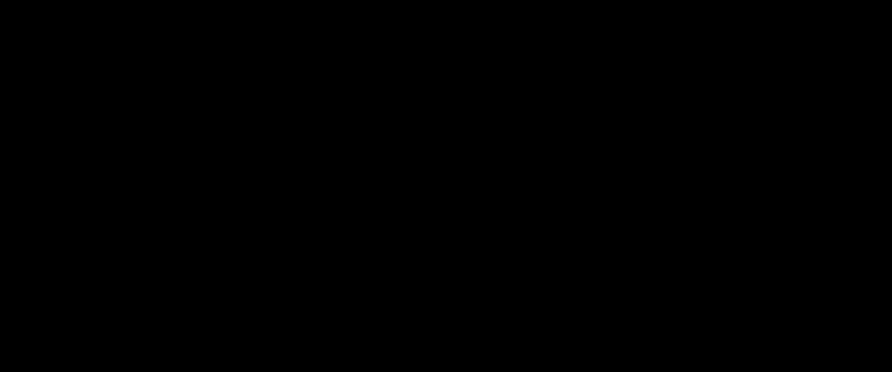

# P24：L15.1- 从0到亿的Rich Product图谱构建之路 - ShowMeAI - BV1hb4y1r7fF

欢迎来到今天的知识图研讨会，我们在课程的第八周，我们的重点是如何进化一个知识图，今天的讨论将集中在那个问题的一个方面，也就是，我们如何应对创建大型知识图的挑战，将在系列中持续很长一段时间。

星期二直到现在，通常我一直在做综合讲座，但这周我的综合讲座将在周四进行，但就今天而言，我们不可能指望有更好的演讲者，比卢娜·董博士和黛博拉·麦金尼斯教授，卢娜在亚马逊，她是亚马逊产品知识图表的幕后黑手。

她将告诉我们他们解决的一些问题，在这个过程中，和麦金尼斯教授，呃，她是网络本体语言的发明者，这几天到处都在用，这是她在，她多年前曾在斯坦福大学，所以这真的是一个神奇的时刻，对我个人来说。

你们两个都在这里，所以我会把它交给卢娜。

否，请把它拿走，谢谢。好的，所以让我分享一下我的屏幕。

你能看到我的屏幕吗，嗯，是呀，我们就可以，对呀，是啊，是啊，非常感谢你的介绍，大家好，我是来自亚马逊的露娜，我很荣幸在这里发言，向您介绍我们为构建丰富的产品图表所做的努力，我称之为零到十亿，呃。

你们中的一些人可能听过或读过这本书，从零到一，零到一，所以有一个初创公司是非常令人兴奋的，但让我告诉你，建立一个巨大的知识图表更令人兴奋，好的，所以呃，我们已经，呃，课程进行到一半。

你们都很了解这里的知识图，我想举一个例子，给你看两个例子，通用知识图有什么区别，你心目中的，当你观察谷歌，什么是产品知识图，所以这里是两首歌的通用知识图，所以它是一个图形，所以我们有节点和边缘。

每个节点表示一个实体，该实体可以属于一个或多个不同的类型，比如说，这是一段录音，而这个实体，这个实体，另一方面是一个流派实体，边代表它们之间的关系，这张唱片有这种特殊的流派。

那个流派的名字是乡村流行音乐，同样这个呃，录音有同一个艺术家和词曲作者，他的名字叫泰勒·斯威夫特，所以这是一个我们都熟悉的知识图，下面是一个产品知识图的示例。

在中心这里我们有两个棕色的气泡代表两种消耗品，呃，或洗涤剂产品，然后那些绿色的气泡代表了它们的变化，呃，其他不同尺寸的紧致洗涤剂，不同的气味，然后我们有它们的产品特性，比如品牌，函数，表格，都是液态的。

这两种效率都不高，对于其中一个，我们有一个额外的功能，订单去除器，好的，所以有了这样权威的产品知识图，呃，我们希望回答世界上任何关于产品和相关知识的问题，我们希望用它来改进亚马逊搜索。

推荐和语音购物更具体一点，所以让我向您展示一些用例，我们使用这种结构化的知识来提供信息，使其更容易理解产品，我们用它来提供选择，比如说，你可以看到不同的风格，不同的口味，所以做出你的购物选择。

我们用它来改进搜索，当你寻找蛋糕杯的时候，邓金，深色甜甜圈，我们知道你在要求，呃，深色烘烤，所以中等烘烤的东西是不对的，即使你要甜甜圈，甜甜圈店不是合适的品牌。

所以我们想用你正在寻找的合适的产品来代替它们，最后，我们还想用它来改进推荐，所以当你试图买一些搅拌机作为一个例子，我可以给你看其他容量更大的搅拌机和更多的附件，不同的品牌等等，等等，好的，所以现在。

测验时间你看到了一个产品图表，你见过一个知识图，他们之间是什么关系，是一个产品图，泛型知识图的一小块，我看不到你的答案，你可以写下你的答案，那么它是子集吗，但不是那么小的一块，但更大的一块。

它实际上是重叠的，所以泛型知识图的某些部分，对不起，这不是产品图，反之亦然，所以我不知道你写的是B还是C，如果你还没有写下来的话，我知道你的答案一定是D，所以如果杰夫·贝佐斯不把它卖对。

什么都不应该存在，好的，所以正确的答案是C，代表很多泛型知识，像电影一样，音乐和书籍，有一部分产品，反之亦然，呃，为产品道歉，另一方面，我们有很多家具电子产品，我们称之为强硬派，我们有衣服，鞋子，钱包。

我们叫它软线，消耗品是你放在厨房里的那些产品，在你的浴室里，到目前为止，这些产品不一定包括在谷歌的通用知识图表中，在必应，所以这对于产品领域来说是非常具体的，让我向你描述一下，我们的呃。

产品知识收集管道外部名称称为自动知道，我们去年在KBD发表了一篇论文，所以呃，它采用分类法，作为输入的产品类型分类树，所以在亚马逊，我们已经有了一些分类法，在亚马逊，我们已经为每种产品提供了一些目录。

我们知道这种类型，我们知道一些属性值，比如味道和颜色，绿色值是正确的，红色值表示错误的值，对于一些呃，某些产品可能缺少的值，此外，当他们进行搜索时，我们有客户行为锁，当他们点击呃，遵循建议等。

使用我们的管道，我们想生成一个像这样的产品知识图，我们仍然有这个分类树，但我们添加了新的类型，比如说，我们发现椒盐卷饼是另一种产品类型，那是零食的一个亚型，回填新值以便，例如，对于产品二。

我们发现味道对它来说也是有意义的，我们发现这个产品的味道，我们修复错误的值，樱桃不是产品一的正确口味，而是，呃，正确的值是巧克力，我们还找到了同义词，这只是巧克力的两种不同说法。

这就是我们在构建这个产品知识图时所做的，所以在我们的系统中，直到去年的原型，我们在消耗品领域增加了三个X的类型数量，降低因数据丢失或不正确而造成的缺陷率，高达68%，好的。

这让你对我们正在做的事情有了一个大致的了解，此时此刻你可能在考虑，好的，这个问题真的难多了吗，我们知道如何为通用知识图收集知识，我们从必应看到了谷歌的成功，等。

我们是否只是在这次日食中应用同样的技术来收集关于产品的信息，没那么容易，在产品领域有几个独特的挑战，第一个是在产品领域，数据通常由零售商提供，它的结构化数据是非常非常稀疏和非常嘈杂的。

所以这里我给你看一张亚马逊的截图，你看这就像一个糖果盒，你得到的结构化信息非常少，这真的只是更多的标题，一切都埋在标题里，描述等等，在右边，我们确实看到了一些结构化的信息，如味道和大小，但另一方面。

你可能不会把红玫瑰盒称为你最喜欢的巧克力的味道，你可能不会把深蓝色箔片称为尺寸，所以这些信息可能非常非常嘈杂，第二个挑战是我们有极其复杂的领域，我们有许多不同的产品类型，实际上我可以给你号码。

有数以百万计的不同产品类型，所以我们想了解这些产品类型和子类型之间的关系，换句话说，如何将它们组织成分类树，所以以刀为例，如果你和卖家谈谈，他们的想法是他们有一只小猫和一个餐饮部门。

他们有一个体育和健身部，在厨房和餐厅，他们有一个分部，就是餐具和刀配件，在那下面我们有小伙子，刀展开刀，在体育和健身方面，我们有一个分部门，从那里我们有刀套，猎刀等，作为顾客，我们要买的其实只是一把刀。

这是买家的观点，我们如何调整卖方的观点，和买方的观点，建立这个分类法，当我们有数以百万计的产品类型，我们实际上有各种各样的，然后嗯，首先是所有这些不同的产品类型，我们实际上有不同的属性。

如果你不明白你可能会犯错误，比如说，这里有一个很可爱的呃，女孩的衣服，如果你真的不明白，然后如果你非常努力，嗯，这是我们所做的，我们说，好的，这个是蔓越莓的味道，配料是向日葵。

另一件事是针对不同的产品类型，对于相同属性，价值可能非常不同，我们在不同的上下文模式中看到它们，所以在这里我给你看一台电视机和一个T盒大小信息，我们看到词汇非常不同，如果您阅读围绕此值的上下文。

也很不一样，现在你可能会说OK T和电视，这是如此不同，我明白，但我敢肯定有很多，我是说，我们可以把这一百万种产品分成几个类别，在每个类别中都相当相似，让我再举一个例子，也就是咖啡，茶和咖啡是两种，呃。

兄弟节点，所以这两种都是饮料的亚型，所以他们非常接近对方，但是如果你看看茶盒的大小和咖啡的大小，呃又是非常不同的，语言完全不同，所以这种巨大的多样性使它非常不同，对你来说很难管理所有不同的领域。

所以即使我们能够建立一个好的模型，呃，我们还需要扩大规模，我们需要将其扩展到数千个属性，我们需要把它扩展到数百万个类别，我们需要把它扩展到数百种语言，这一切都很难，因为有很多模特，有很多空间要照顾。

同时关键的挑战是对于如此丰富多样的数据我们只有有限的训练标签，所以说了这么多，我记得五年前，将近五年前，当我们给我们的SVP做演示时，显示知识图的力量，他问我们，呃，我们如何收集知识，那个时候。

我们只有很紧的洗涤剂，所以我们告诉了他细节，然后他说，哇哦，这是一个百年工程，所以现在的问题是我们需要交付这个数据业务，我们想覆盖所有的数据，但是我们怎样才能完成这项百年大计呢？这里我用十亿作为象征。

说很多数据，然后收集这么多数据来完成这个百年项目，当然我们能做的就是努力锻炼，我们试着多活一百年，那不是我们擅长的，所以我们要做的是分步进行，达到10亿，我们需要从零到一的第一件事，在这里。

我们需要的是高精度的模型，给我们准确的知识，这是关键的第一步，即使你在这里看到很多零，这意味着你有一个大规模的数据，但如果你没有这个高精度，呃，你得到的第一件事，那么你得到的只是一堆零，换句话说。

你什么也得不到，即使我们有90%的准确率，意思是你提供的每十个数据项，呃，一个是错的，这几乎是，工业上可接受的真实环境，所以百分之九十几乎是最低限度，然后从一个到一千，呃，我是说你有你漂亮的模特。

你为此感到非常自豪，如果你在写论文，你可能完蛋了，但在实践中，这只是第一小步，因为你想做很多数据，你可能需要训练相当多不同的模型，你可能需要应用它，多次应用该模型，所以你肯定需要一些端到端的管道。

你也想有自动ml来降低建模成本，之后如何从一千到一百万，回想一下，呃，我们这里有，我已经缩小了一点，我们希望处理至少数千个类别，数百种属性和数十种语言，如果我们开发它来开发模型，对于每个类别属性语言。

这意味着我们需要训练和维护数以百万计的模型，所以如果我们真的想扩大规模，我们需要减少型号的数量，我们需要训练和维护，这就是我们使用迁移学习的地方，我们希望一刀切，这就是我们真正需要创造性的地方，最后。

我们不仅要覆盖每个细胞的所有空间，我们想传递很多数据，我们想要高召回率，到目前为止，你还没有听说过我说回忆，我们想从一百万到十亿的那个，这就是召回开始的地方，我们希望有高产量和高召回率。

在这里我们当然想改进模型，我们还想探索所有不同的来源，不仅仅是文本，还有图像，这就是多模态模型，呃，踢，我们还想从网上获取数据，现在让我们看看我们对这些步骤中的每一个都做了什么，所以从零到一。

正如我所说，我们需要高质量的数据，这需要高精度的模型，让我用，呃，的例子，填充缺少的值，呃，作为一个例子，向你展示我们开发的一个模型，它可以提取正确的知识，所以这里的问题是对于一大堆产品来说，呃。

我们想从中提取的标题，属性值，如洗涤剂形式的液体或粉末，洗涤剂设置成这样，比如说，从这个我们知道形式是液体的，味道是苹果味，蒙古人从这个只是从标题本身，我们不知道，所以说。

这就是我们要做的问题这是一个知识提取问题，好的，我们用填充来解决这个问题，这是VIE标签，你们中的很多人可能从NR um命名实体解析中听说过它，我们所做的是把输入牛肉粉和牧场，养羊肉食谱。

然后假设我们试图弄清楚味道，第一个味道是牛肉粉，所以牛肉被标记为B开头，mu被标记为e结尾，第二个味道是牧场养的土地，第一个，呃是呃，扳手标签在里面升起，所以标记为I和羔羊标记为E，然后这一端和食谱。

这不是，呃，这个味道，所以它是标签，仅此而已，所以我们在模型中做了一个四层，呃，其中我们将单词嵌入作为输入，然后我们通过LSTM来处理输入的顺序，然后我们把注意力，然后我们应用CRF，呃，条件随机场。

所以我们输出i，e，模型并处理好它们之间的相关性，比如说，e应出现在b之后，所以这给了我们第一个模型，我们看到添加CRS和添加注意力会给我们最好的结果，在精确回忆方面。

这里的好处是这个模型被称为开放标签，因为我们可以从训练数据中识别出我们没有看到的新值，所以这里的灰色条代表我们从未见过的值，和暗条表示所有的值，我们看到对于未知值，即使质量稍低但还不错。

到目前为止我们有一些合理的模型给出了合理的结果，看，现在的程序不是90%，回想一下，我说过我们需要百分之九十的时间才能把它带到，呃，生产，我们需要做很多事情，所以我们首先需要生成训练数据。

深度学习模型通常非常渴望数据，所以我们需要很多人了解这个领域，属性生成大量训练数据，和训练数据，一些科学家可以进来训练和微调模型以获得好的结果，之后呢，3。如果质量不行，还不到90%，然而。

我们需要一些人来查看数据，看看结果，做一些海报处理，这通常是基于规则的，然后进一步提高数据质量，去除噪声，最后，我们有一大堆提取的数据来发布到目录中，等等等等，知识图，呃，我们需要做一些预发布的评估。

作为看门人，这又需要很多人来做评估，基本上我们取样并做注释，说好，正确与否，请记住这仍然是我们三维空间的原点，好的，所以这是我们的起点，从一千到一千，我们需要降低这个建模成本，这是嗯。

我们需要用太多的人来交付模型，这里我们需要一些管道可以帮助我们减少手工工作，让我们看看怎么做，我们首先要做的是，而不是手动生成大量训练数据，我们可以应用弱学习，所以我们使用距离监控和数据编程。

这使得我们可以自动生成训练数据，并不是所有的训练数据都可以，呃，自动，我们肯定可以把人们排除在外，我们仍然需要一些基准数据来了解资源的质量，可能会对超参数做一些微调，我们能做的就是这个。

所以我们开发了一些深度学习数据清理模型，识别我们的模型提取的错误值，和后处理，呃对不起，用这个，呃，深度学习，um清洗，我们能够消除很多噪音，可能不是所有的噪音，所以我们还需要做海报处理。

但现在我们需要的人少得多，最后，呃，用于评价，我们也试图扩大规模，所以我们可以呃，对每一个属性进行排序计算，然后呃，样品较少的产品类别，但具有相同的统计意义，在所有这些中，我们添加了自动ml。

现在不是让科学家训练模型，我们可以有一些像数据助理，端到端管道，包括训练和推理，使我们能够扩大规模，在这里，我想再为这个深度学习模型说几句话，呃，你可能会好奇，我们正在做什么来识别错误。

基本上我们想做的是看看标题，呃，描述并决定一个值是否正确，例如粉红色是否是一种味道，如果我们看到标题，说薄荷巧克力，也看到了，从描述中，我们会觉得这可能是一个错误的值，所以我们输入数据，包括标题描述。

并将目标属性值输入转换器，然后我们基本上输出是或否，我确实想指出，在这里我们也把这个产品的产品类型，作为变压器输入的一部分，这给了我们更好的结果，呃，我在这里提到了清洗用的变压器，但通过LSTM提取。

这主要是因为在我们发表那篇论文的时候，这是几年前我们用DM，后来我们尝试了变形金刚，这并没有给我们更好的结果，直到最近，我们才将转换器模型用于多语言，呃，萃取，好的，所以这里有一些我们认为是错误的值。

比如说，粉色口味，颜色，一种口味，呃，这两个包裹，这有助于我们，识别出180万个不正确的味道和气味值，只有这两个属性，我们识别出这么多不正确的值，程序是90%，意味着每十个我们认为不正确的值，嗯。

其中九个确实是不正确的，好的，从一千到一百万，我们如何扩大规模，让我谈谈我们如何减少这个模型的数量，这使得我们可以训练一个模型，希望适用于数百甚至数千个不同的类别，并回忆使用尺寸的例子，不同的，呃类别。

他们使用不同的模式和词汇，我们还看到，对于一些长尾巴，我们只有很少的训练数据，即使我们希望我们，我们希望像训练数以百万计的模特一样训练它，我们没有它的训练数据，这就是我们所做的，在左边。

我们有开放的标签，因为我们只是它，这里我们所做的是把类别作为输入，并利用它来引起注意，呃对呃，对于我们模型的结果，第二件事是我们做多任务学习，所以除了提取值，我们还试图预测产品的类别。

这允许我们识别标题中的关键令牌，它告诉我们产品的类别，所以在类别表示上有了这个注意条件，我们能够将提取的F度量提高10个百分点，在一些例子中，比如，呃，为了这个，呃，这是，呃，如果使用我们以前的模型。

我们无法预测味道，但是用我们的新模型，它是分类学意识的，我们可以说嘿，味道是紫色柠檬水，另一个例子是这个眼影，呃，我们可以说调色板就是气味，但一旦我们知道嘿，这是眼影，那我们就不会提取任何气味。

所以我们所做的第二维度是，我们也尝试训练，这里有一个例子，它向你展示了从描述和标题，我们实际上看到的不仅仅是一个单一的属性，但是多种不同的属性，在我们的模型中，这是同样的方式来展示四层模型，呃。

我们天真的方法是为了每一个属性，我们需要训练一个模特，然后型号的数量就会一样最好，与属性数相同，我们所做的是添加一个属性嵌入层，我们获取属性名并为其生成嵌入。

然后我们使用专家和超高速网络的混合来生成参数，对于CRF层，我不会去所有的细节，但你可以想到，呃，不同的专家，呃，照顾不同的属性，然后我们查看新属性，并查看其与现有属性的相似性。

然后试着得到参数的加权组合，所以大约还有五分钟，好的，当然可以，所以有了这个，我们可以训练一个模型的三个两个属性，你可以看到这是基线结果，其中我们每个属性训练一个模型，使用我们的模型。

我们甚至可以击败这个结果，好的，如何从一百万到十亿，这里我们需要更高的产量，我会告诉你一些关于我们如何进行多模态提取的知识，所以这是最近的一篇论文，刚刚在KDD接受，所以基本上用这个产品，呃，1。

我们想从商品名称中了解一下商品名称，你看棍子，你看奶油，你看到粉末，你可能会很困惑，但如果你看产品形象，你会看到嘿，这里，上面写着棍子，在文字里同时形状像牛排，我们所做的是多模态变压器。

我不想详述所有的细节，它需要，呃，来自OCR的文本输入，图像上的结果，也是从图像嵌入，然后训练生成的模型，其中，它从occ中获取输出文本或从产品中获取文本，呃，说明，以及从动态，的词汇，呃，值。

然后得到结果，所以我们将跳过细节，只是为了给你一个感觉，它的表现有多好，所以如果它和打开标签相比，我们只看文本，它将F度量提高了11%，我们可以删除文本、图像或OCR，他们都给我们更低的，f措施。

贡献了最多的下降，它会给我们最低的f度量，图像贡献列表，因为大多数信息实际上已经在OCR文本中了，我还想提一件事，呃，网页提取，所以我不会告诉你所有的细节，但从这里你可以看到这些来自不同的网页，网站。

我们也可以得到所有的气味，呃，项目形式等，当我们从整个网络中获得数据时，我们有，呃，我们可以丰富我们可以提取的数据，所以我们已经做这个项目四年多了，到目前为止，零售领域大约需要两年时间，我想说的一件事。

知识图有很多很多子域吗，什么是成功的，呃在工业上，正如我所观察到的，什么不那么成功，所以我看到了很多实体链接的成功，决定这是否是用于知识提取的相同产品，我们已经谈了很多，呃，提取知识，用于知识清洗。

试图识别错误，和基于知识的，呃，问答，等，为了一些领域的成功，通常有两件事可以让它发生，第一个是你不能没有它，你有数十亿的产品，您不能手动满足，说嘿，这两种产品是一样的，那两种不一样。

必须有一些自动的方法，第二是技术已经准备好了，再次用于数据业务，这通常意味着你有相当好的精确度和合理的回忆，在另一边，我看到了我还没有看到太多成功的子领域，作为一个例子，模式映射在未来可能会取得成功。

如果你想决定，呃，导演是同一个呃，关系，这似乎是任务的一个重要部分，然而，我一直在观察手工工作，呃，对于小规模本体，一旦它是大规模的，你需要去网上，而不是呃，进行模式映射。

人们只是用封闭的信息提取来代替它，我是，呃，另一个是开着的，ie，这是一个非常热的，呃，十年前的概念，你提取知识而不调整它，到目前为止，我们还没有在工业上看到真正的实践，更重要的是。

它更多地被阅读理解所取代，知识融合是另一个从不同来源获取数据的领域，你试图解决冲突，到目前为止，人们还不是很成功，从网络上获得所有的知识来把它放在一起，这只是起点，呃还是那么，这就是为什么这个。

有很多研究，但还没有完全需要，另一个例子是知识推理，呃，您使用知识嵌入来推断新的三元组，就我所见，希望我们能取得更好的成绩，尤其是对于那些需要的东西，而不是那种被取代的东西，呃还没有，呃。

希望我们能改进技术，看到这一切真正的成功，我想结束我的演讲，我们正在为数以百万计的品类构建权威的产品知识图，数以千计的属性和数百种语言，为了完成第一步我们需要一些高精度的模型这样我们就可以计算。

我们可以收集准确的知识，然后当我们想丰富知识和扩大规模时，我们需要端到端，可能还有自动ML管道，我们需要一些转移，我们需要多模态模型来从所有可用的来源获取数据，好的，非常感谢太棒了，谢谢卢娜的精彩概述。

嗯，黛博拉交给你，谢谢。最后我们有时间讨论。

好的，所以我要试试莎伦的屏幕。

