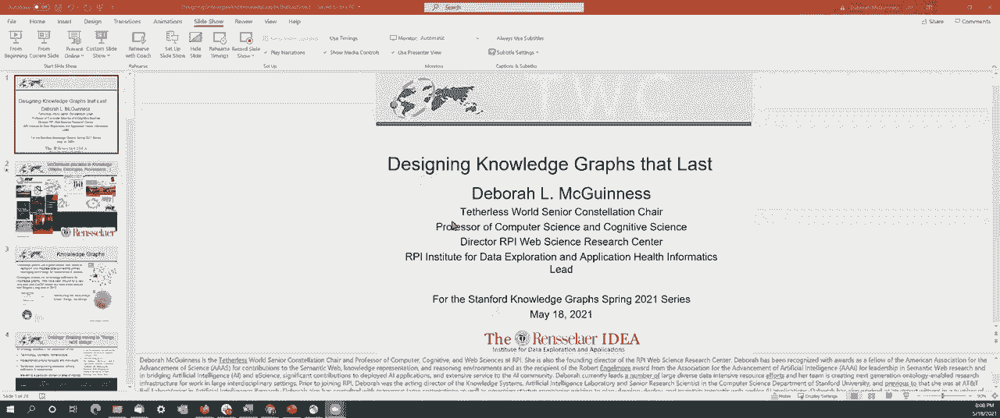
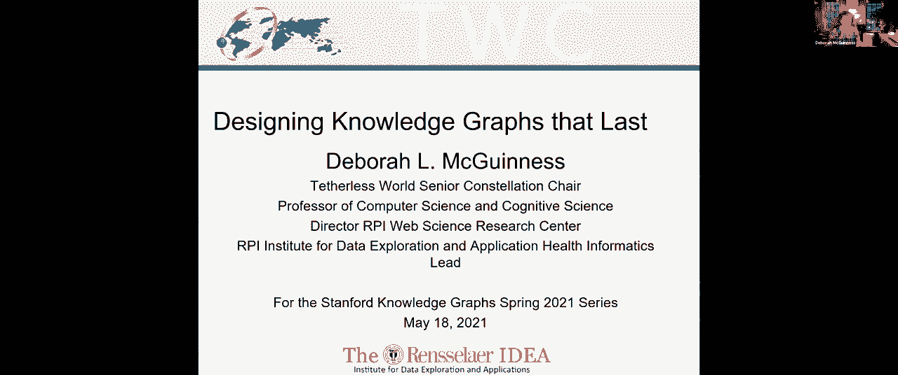
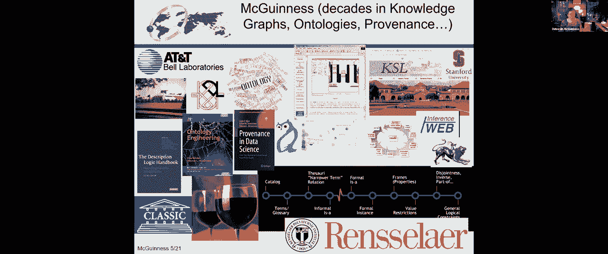
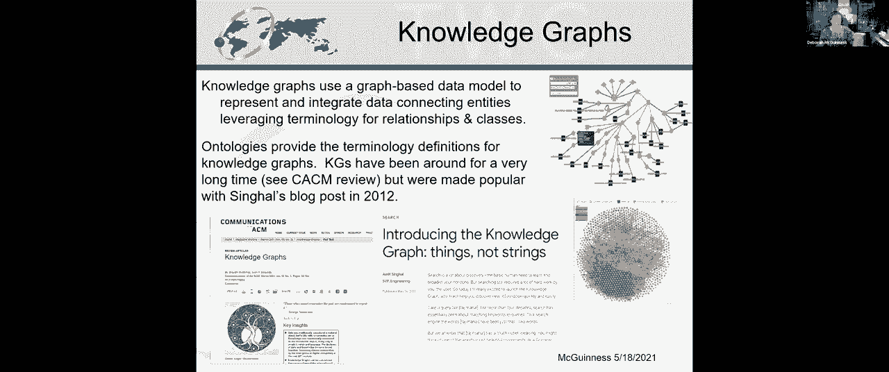
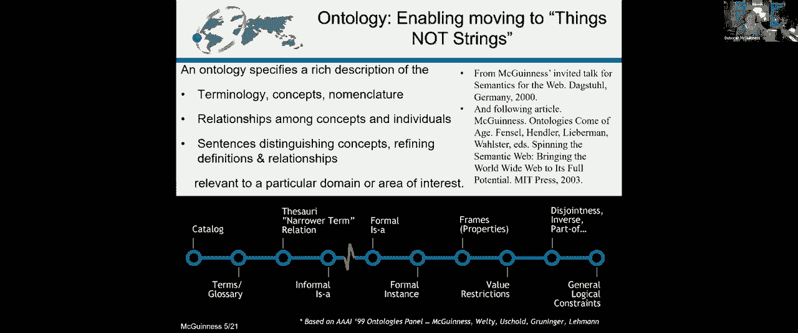

# P25：L15.2- 构建知识图谱 - ShowMeAI - BV1hb4y1r7fF

所以你看到了吗，是呀，是我的电子邮件地址吗。

好的，所以我要从头开始，所有的权利，所以现在你看到了完整的显示，是呀，好的，你没有看到下一张幻灯片，不不不，好的，因为我看到了好吧，所以我真的很兴奋今天能做演讲，非常感谢组织者邀请我。

这种感觉就像回家的一周，因为我在盖茨大楼里坐了十二年，或者类似的东西在来RPI之前，今天我将讨论设计持续的知识图，事实上，这是一个很好的赞美，我想卢娜刚才的演讲。

只是为了给你一点关于我的背景，我一直在知识图表上闲逛，几十年来的本体和出处，嗯，主要是作为一个学者，我的头18年是在T Bell实验室，在那里我做了更多关于描述逻辑的基础工作，有点像。

本体Web语言的正式基础，呃，之前提到的Vinay，或者只是一般的本体语言，但我也做了一些数字，尽管事实上我坐在纯粹的研究部门，我做了一些大的申请，其中一些在我们安装14年后仍在运行，当我离开的时候。

我不知道他们在那之后工作了多久，他们配置了大件的传输设备，但本质上使用知识图和本体技术，在引擎盖下创建完整和正确的零件清单，嗯，所以在我的十八个T天，我做了一些长期存在的本体论和知识图的工作。

那里有葡萄酒的照片，因为奇怪的是，我寿命最长的系统，呃，本体与应用是一个葡萄酒与食品配对系统，我最初在研究生班上做的揭露，1984年我多大了，当我在罗格斯大学上专家系统课时，当我在贝尔实验室工作的时候。

嗯，试图找出一些东西，我可以，嗯，假扮成一个专家，我是酒，美食鉴赏家，后来成为本体论的一组规则，这后来成为本体论的基础，我在斯坦福时写的零一篇论文，实际上是20年前的今天，并且是许多示例系统的基础。

包括一些全球网络联盟文件，关于如何使用本体语言，所以我做的这件事，就像一个二年级的研究生一样活了几十年，嗯，我要反思一些财产，关于这一点，我想我们可以复制，就像我今天试图复制这些属性一样，嗯。

我也有点出名，哦其实，我不知道你是否看到了我的本体论光谱指针，3。我和另外四个人合伙经营一家三口，a，我再次展示了我十九岁的年龄，嗯，我们在一个关于本体论的小组里，他们只是，呃，专家系统。

所以我们一些本体论专家，嗯，前一天晚上见了大约四个小时说，我们所说的本体论到底是什么意思，我们只是指一个受控的词汇吗，我们是指一种逻辑上更精确、更有表现力的语言吗，还是我们只是指介于两者之间的东西。

所以我们将讨论什么构成本体论，然后是什么构成了本体论，我们可能可以用很长时间，嗯，所以这些只是我花时间做的几件事，它试图给你一点关于，你可能会问我什么。

既然你在第八周，你们都知道知识图基本上是连接实体的，嗯，他们有链接，希望贴上，希望一些计算机和一些人类能理解的术语，所以我们不仅要建立高质量的知识图，但我们也想建立术语，允许知识图发挥作用。

为了它们的设计目的，也是为了生存，也是为了激励其他人使用它们，所以知识图真的存在很长时间了，有很多关于它们存在多久的文件，有一个，一个来自CACM的文档，给出了一些历史。

但当Amitengal在谷歌写了一个博客时，它们真的变得很受欢迎，嗯，关于引入东西而不是字符串，从我的角度来看，我承认这有点偏颇，因为我喜欢生活和呼吸本体论，我喜欢语义，我喜欢教电脑和人类。

术语是什么意思，以及如何使用它们，但如果你要从一根绳子上移开，所以只是一组字符到实际上是一个对象的东西，可能与其他东西有关，你可能会明白，它是如何与其他东西联系在一起的，有。

我不知道有什么比本体论更好的灵丹妙药了，所以我们需要。

当我们设计这些知识图时，我们还需要设计这些术语，所以本体论真的可以移动到事物上，而不是字符串上，它可以是任何东西，从一组术语和定义，对于这些条款，结构化知识，我通常用猫头鹰写我的本体。

万维网联盟对Web上本体的推荐标准，但我真的会接受的，任何能向我描述的语言，让人类能够理解，计算机也能理解，我撒了，嗯，一路上的引用，如果你想回去查一下，实际上。

我在这里提到的这篇论文把光谱上的每一个点，并说你如何使用词汇或选集，以那种表达能力。

那么构建一个其他人会使用的知识图到底需要什么呢，更重要的是，其他人保持，所以从我在人工智能领域工作的早期开始，我总是试图让自己失业，离开目前的工作，这样我就可以继续下一件事了，嗯。

我实际上不仅想建立一个知识图和本体，这将符合我正在努力做的事情的要求，但我也想做一些我的人可以用的东西，不管是我还是我的团队，但其他人也可以用，更好的是其他人可以保持，因为通常情况下像我这样的人。

引入知识表示专家来构建模式，建立正式的基础，这些术语的含义，我们在各种领域都这样做，所以我发表在流行病学等领域，而且还有无线频谱，而且，就这样就这样，它涵盖了很多我开始不太了解的话题。

但后来我帮助领域专家，真正懂语言的人，以满足…需要的方式对术语进行编码的区域，嗯问答系统，最终你需要真正了解这个领域的人，就像，我想让那些火山学家保持我帮助他们的本体论，写火山，你不会想让我那么做的。

因为我知道一些，但不是很多，那么到底需要什么，嗯，弄清楚需要什么，制作一个知识图，让某人使用，所以最好，至少解决项目需求，回答某人认为重要的问题，因此，它也可能以有用的方式集成内容，所以如果我能自己做。

好吧，也许我会自己做，但如果别人做了一个大项目，就像卢娜建立这些巨大的知识图表，我不想花时间去建造那个，如果她有，呃，满足我需要的知识图，但我也想真正了解什么是知识图，它包含了什么。

以及这些内容是如何进入那里的，然后我当然想有正确的访问，权利权利许可，嗯，这些只是我使用知识图所需的一些类别，但对我来说，维护知识图到底需要什么，因为我一直，我将在一个项目中举例说明。

我想我们现在是七年级了，嗯，由国家环境健康科学研究所资助，我们有曝光率的地方，专家、流行病学家和毒理学家实际上维护了知识图，尽管我和我的团队帮助设计了它的原始基础，为什么会有人把它保养得很好。

我的项目就靠它了，嗯，也许我有领域知识，这对策展和评估很有用，就像那些领域的人，对这些领域的了解比我多得多，也许我的工具从中受益，所以在我的其他一些项目中，我的一些学习朋友正在用这些知识图来训练。

这样他们就可以训练他们的方法，测试他们的方法，嗯，也许我需要一些知识图的作者不支持的扩展，例如，嗯，我用Kebby，具有生物意义的化学实体，我不是化学家，我不是生物学家，但我需要它，呃。

这个暴露和健康项目，从我的角度来看，周期性地有一些术语应该在里面，实际上从化学家和生物学家的角度来看，但他们不在那里，所以我必须把他们放在我的知识图表里直到他们得到它，嗯，所以我可能会和他们一起参加。

实际上我和他们一起扩展他们的知识图表，以便更好地支持我的需求，然后我也可能需要更高的质量或不同的质量或更频繁的更新，所以说，我们真正想做的是建立那些高质量的知识图表，但是有质量知识图意味着什么。

所以有很多标准，嗯，我只是挑了，呃两个参考文献，但你可以找到一吨，嗯，但实际上当我为这次演讲做作业的时候，我不相信有一个权威的评估来源，知识图的标准，部分原因是质量评估的目的是为了，所以嗯。

这个知识图到底需要什么才能符合我的目的，那么这到底意味着什么，这实际上意味着它满足了一些需求，所以从现在开始，我要谈谈一些方法，以及构建知识图的一些示例，以及构建这些知识图所依赖的基本术语。

然后举例说明这些方法和更新方法，因为如果你不考虑更新，你只会有陈腐的内容，所以我们有了这个本体和知识图的开发过程，我们已经用于很多应用程序，我要举例说明，欢呼儿童健康暴露分析库，在那里我是一个科皮。

一些流行病学家、毒理学家和环境健康科学家，我开设数据科学课程，所以我的工作是建立术语，这将允许一个系统支持大量内容的集成，关于暴露和健康结果的实验，启用元分析，将多项研究的内容放在一起，试图找出，说。

母亲怀孕时镉暴露于镉，或者在孩子生命中的某个时候，这是否影响发展，我们该怎么开始，一切都从一个用例开始，你想问什么问题？嗯，回答这些问题有什么难的，你需要什么信息来回答这些问题。

然后我可以用什么样的词汇表作为起点，我一直在做本体论，自从他们开始以来就没有了，但因为他们，我想我一直在做，因为它们刚刚开始在计算机科学中变得非常受欢迎，在过去，你知道的，几十年前。

事实并不是已经有一百个好的本体了，或计算机可访问的词汇表，别人坚持的，所以必须建造自己的并不罕见，但今天你几乎总是犯错，如果你不出去寻找现有的词汇，通常其他真正与内容有利害关系的人认为，然后嗯。

你通常可以得到很好的起点，所以出去寻找现有的词汇表，词汇表不仅仅是在生物门户之类的东西里，这实际上是斯坦福大学维护的收藏，一开始是以生物学为导向的词汇表的集合，但是扩展成了许多不同本体的集合。

关于许多不同主题的本体，这只是本体论和术语集合的一个资源，但是还有很多其他地方你可以得到这些术语，比如数据报告，模板或数据字典和码本，如果你和做实验的人一起工作，他们通常会给你Excel电子表格，嗯。

当你幸运的时候，这些Excel电子表格具有列标题，这些列标题具有与它们相关联的一些定义，有时他们有这些类别的代码，如果你幸运的话，你会得到一本代码书，告诉你代码的含义。

所以有很多不同的地方你可以得到你的词汇表，那么像我这样的人，语义导向的人，我们有很多自己的工具来提取这些内容，把它放在一起，整合起来，但是有很多商业工具可以做到这一点，我们有很多学术工具，有一堆。

当我在斯坦福的时候，我们有一堆，嗯，然后我们生成呃，利用现有内容和粘合在一起的本体，因为我们需要解决用例，用例将包括能力问题，所以需要回答的问题，呃，申请成功，然后在这个例子中。

我们还将其放入一个人类感知的数据采集框架中，然后我们创建了知识图，所以他们有访问控制，因此，如果人们还没有公布他们的结果，那么数据就不公开，但是一旦他们公布了结果，数据对任何人都是公开的，在那之前。

数据只对拥有这些权利的人公开，所以一切都从用例开始，我教一个班，或者我教一门本体工程课，第一张幻灯片上有一本书，它也有指向这个用例模板的指针，所以这个用例模板有很多来自NIST的输入。

它有很多来自国家标准和技术研究所的投入，来自USGS的大量输入，和许多地球物理用例的人，和我的合著者的很多投入，Elisa Kendall，来自OMG，对象建模组和，E E E，M企业数据管理组，嗯。

才能进去，1。你想干什么，你想回答什么样的问题，你的目标是什么，有什么要求，还有一件事非常重要，把这些能力问题写下来，因为我喜欢建立本体，我可能会在我余下的职业生涯中建造它们。

但你真的想有一些方法来范围，你怎么知道，当你做完，你怎么知道，要达到什么粒度级别，嗯，你怎么知道你的起点是什么，所以我们这里有很多链接，而且在这个班上，也有为用例填写模板的链接，所以你从那个用例开始。

然后用例帮助我们试图弄清楚我们需要什么样的术语，在这种情况下，嗯，我们重用了很多现有的，呃本体论，我们所做的是，我们上菜了，我们仔细查看了所有的用例，我们试图理解他们问的问题。

我们弄清楚了我们需要的内容的广度和深度，然后我们发现了本体，它涵盖了我们所需的很大一部分，我们想进口的，所以我们想把它们拉进词汇本身，然后我们还确定了许多大型本体，比如基，具有生物意义的化学实体，嗯。

所以我在这个项目中看起来只需要，我需要这个的百分之五，而且它很大，所以我不想把整件事都拉进去，构建这个巨大的术语，我只想带我需要的东西进来，所以我用这个方法，引用外部本体术语的最小信息，或无数TT。

所以这是你在这些大的外部本体上通常要做的，所以我们真的想重用我们可能的地方，然后我们真的想有一个重用的策略，我们真的想交流它，所以这次演讲的底线之一是，对所有事情都有一个策略对所有事情都有文档。

这样其他人就可以遵循这些过程，这样你就可以一致地使用这些过程，所以我们有这种电子表格，具有越来越多本体的大型电子表格，我们认为有某种重叠，然后我们有了一点描述，然后我们给出了使用这些本体时的优先级。

我们把它给了试图绘制地图的人类，其实很有趣，Luna提到了这个图式匹配，我同意，它还没有准备好自动完成，但它已经准备好半自动完成了，所以我们有建议映射的工具，然后我们在这个电子表格中提供给工具。

这些工具建议哪些本体，以更高的优先级首先查看，我们也把它给人类，这样他们就可以弄清楚用什么来映射，然后我们也有一个过程，我们将改进术语，所以当我们开始这个项目的时候，我们说太好了。

我们必须做所有的人类健康和所有的暴露，我可能会忙很长时间，但我能做到，然后我和首席流行病学家谈了这个项目，她说你知道我看着呃，雪人，你知道标准的医学术语，我不需要大约80%的钱，我看着另一件事。

我不需要那个，所以我们决定做的是一种经验驱动的方法，所以当研究出来的时候，如果他们有词汇表，我们不知道的术语，直到那时我们才开始尝试把这些条款，所以我们识别出我们以前没见过的术语，我们确定如何映射它。

所以我们有这个过程，实际上这个过程是由流行病学家产生的，它由利益相关者和那些利益相关者审查，我为国家环境卫生科学研究所管理数据结构和标准工作组，但是做决定的人是环境健康科学家，毒理学家和流行病学家。

所以他们不是真正的本体论者，我们只是确保一切都有意义的人，因为你最终需要做的是你需要把这些电子表格，你用这些专栏标题得到的，然后说，好的，嗯，我要测量的是出生时的胎龄，嗯，但你知道，我可能不知道。

但我需要绘制它的地图，这样我就得到了这个连贯的集成知识图，我们使用这种语义数据字典方法，帮助人类和计算机进行这种映射，然后它为这个系统提供动力，你可以看到研究的数量，你可以搜索研究。

说有成对的母亲和孩子，认知发育迟缓的儿童，和接触过三种重金属的母亲说我可能会感兴趣，这样我就可以检索研究，或者我可以自己找回个人，这样我就可以做一个统计分析。

所以这是一个生物统计学家给我们的能力问题之一，所以我们想找，嗯，生育子女，我们有出生体重的数据，性别，出生时的胎龄，关于母亲的信息，然后曝光，你可以做一个聪明的搜索，这是本体论启用的。

检索内容的分面搜索，维奈，有多少时间，我只有五分钟，好的，所以我举了一些关于暴露和健康的例子，但这只是一个例子，嗯，我们这样做也是为了，IBM的AI Horizons努力尝试做精准医疗，增强权能。

这是一个高跟鞋项目，健康赋权，使用分析，学习与语义学，中间是知识图和本体，通过提取，我们对它做了各种各样不同的推理，然后人们可以问问题，比如我的1分C是糖尿病的标志上升了20%，嗯，我有以下特点。

你知道我的下一步是什么吗，我们还咨询像一家大型保险公司，我们在无线电频谱中做，想知道我什么时候可以用频谱，我们支持金融业，业务本体和其他各种领域，我不打算讨论这个，因为时间。

但是一个重要的信息是记录你所有的过程，我认为电子舞曲理事会做得很好，我提供了链接，你知道他们给了你很多关于如何开发你的用例的信息，如何构建术语，他们做的一件事是包括卫生测试。

所以你的本体论应该遵循很多原则，然后有工具自动支持，我和EDM和OMG一起工作，所以现在我所有的本体也运行，还有那些卫生测试，它们还记录了如何做出贡献，比如如何参与，所以这是为了他们的纤维。

那是一种金融工具，业务本体，它获得了很大的吸引力，已经有一段时间了，所以我不知道有多少人为此做出了贡献，但贡献是有规则的，注释你的内容是有规则的，有规则的，嗯，如何确定您的成熟度级别，然后嗯。

和你的联系方式，所以有很多过程建议，所以在剩下的三分钟里，我将给出一些建议，嗯，发展与长寿，所以获得好的用例并针对它们进行设计，你这样做可能最重要的是为了范围和评估标准，然后不要忽略更新需求。

在您的初始用例中获得这些需求，并在您进行模式构建和数据采集时考虑它们，请记住，您可能需要更新您的模式，但您可能还需要更新数据，嗯，然后可能你的应用程序，所以我的很多应用程序都运行在Sparkle查询上。

这些闪亮的查询使用的是底层词汇表，所以我可能也需要更新这些查询，所以我需要这三个实体的基本更新计划，然后有风格指南真的很有帮助，因为你真的是，我认为引导我的葡萄酒本体论的秘密，长命百岁，是一个，很简单。

它作为一个教学工具真的很有用，而且非常一致，所以很容易理解，所以我说，力求一致，嗯，然后在可能的情况下重用，但请记住，如果你重复使用别人的作品，你可能会与自己的一致性发生冲突。

因为我可能需要把选项一和选项二放在一起，但他们可能有不同的建模规则，所以我可能要做一些权衡，在简单方面犯错，一开始就模块化，把一切都记录下来，然后当你设计你的本体和模式时，首先满足你的要求。

还要从一开始就考虑重用，就像我花了几十年做的一件事，正在摆脱我核心本体论中的限制，因为如果我有太多的限制，那就限制了我的重用，所以我通常做的是取消限制，我把它们放在一个单独的模块里。

我认为这些模块是一种质量检查，例如，而不是在像有年龄这样的属性上有一个范围，就像人类可能有一个更高的范围，说一百二十或者一百三十，但如果我有家猫的年龄，你知道一百三十太高了，所以它会更低。

所以当我在类上使用该属性时，我会把这些范围，而不仅仅是在财产上，然后利用所有的评估环境，所以在笔记里，我有奇美拉的链接，它实际上是一个本体和知识图进化环境，我在斯坦福的时候做的，哎呦哎呦。

来自马德里和企业数据管理人员，他们的卫生测试，然后肯定会想到意想不到的使用，就这样，我会回答问题，有很多人对此做出了贡献，有一些关于构建本体的书籍可供参考，和，哦，关于出处我没说那么多。

但一定要跟踪你从哪里得到的内容，嗯，因为这通常会决定或破坏您的重用，这一切都在那里，非常好，谢谢。谢谢。黛博拉对这门学科的整个领域进行了如此有启发性的概述，建筑选集，为了长寿和再利用，是的，是的。

那太好了，所以我们有15分钟左右的时间，讨论和问题。

卢娜很擅长回答聊天中输入的问题。

所以我想先问你一个问题来开始讨论，您的产品知识图中有任何本体吗，是呀，我们有，你能给我们讲讲这些吗，是呀，所以我记得当我谈到自动OE系统时，我们从输入开始，我们有分类法。

这是关于实体类型或产品类型的本体论的一部分，我们也有一个现有的目录，亚马逊目录，上面说每种产品，有这些属性，在某种意义上，这些描述了实体之间的关系，所以这些是我们开始的本体论，然后我们可以从，产品标题。

等，来自查询，然后我们可以决定亚型关系，这些用于丰富分类法部分，然后关系部分，我们查看客户行为日志，尤其是他们的搜索查询，决定每一个动作，对于每种产品类型的产品，适用于它的属性是什么。

然后我们可以确保我们在关系中添加某种限制，是啊，是啊，所以我，看来你刚才描述的本体论可能在，呃，黛博拉光谱左下角，对呀，它显然很有用，但是嗯，呃，它非常接近数据和用法，对呀，我首先觉得它很有用。

因为那有点，呃我是说，这是数据的模式，对于没有架构的数据库，你不能拥有这个数据库，对于没有主干的知识图也是如此，你基本上不知道怎么放闪光灯，所以它很有用，第二件事是对于许多领域，幸运的是，呃。

我们可以手动为一些超级复杂的领域开发本体，产品领域绝对是其中之一，只是手动开发整个道歉，这是难以置信的困难，工作量很大，另外，它是随着时间的推移而演变的，所以我们需要有创造力地结合。

哪一部分才是真正的核心，我真的很喜欢，嗯什么，呃，黛博拉说，呃，我们需要给它更少的约束，使其易于扩展，我们可能需要确保它是绝对正确的，没什么不对的，然后当我们把它延伸到周围的部分或外环时。

我们想让它自动化，所以我们可以很容易地捕捉到现实世界的变化，好的，所以我想给黛博拉一个翻转的问题是，如果他来找你，征求你的意见，我们想从零到十亿，我们应该怎么做呢？呃，你对此有何建议？

或者你会如何处理它，我可能会去找卢娜，但实际上，呃，你知道吗，我的一个学生在一家公司实习，我不会，我不会说出名字，但他们不是亚马逊，嗯，他们还想建立一个产品目录，所以他们嗯。

他们做了一种轻量级的实体提取，他们基本上得到了一组属性，你知道和课程，其实，它让我想起了垂直网络的日子，嗯，所以也许我会谈谈，因为实际上当我还是斯坦福大学的时候，我咨询了垂直网，它试图建立许多垂直的。

就像他们做钻头一样，我想我们的钻头本体中有两万个术语，但NIST有一个很好的起点，当我们这么做的时候，我们实际上有很多词汇是起点，然后有一种本体论，沙皇，实际上我在选集里咨询过，AR如何帮助。

把那些东西放在一起，所以他们更多的是手工做的，但他们寻找起点，当我的学生去和这个说话的时候，UM创业公司，他们在找，我想他们在找，和世界上的亚马逊竞争，嗯，对于要使用的属性，弄清楚如何指定你要买什么。

嗯，那么喜欢的属性是什么，如果我要买一台电视，我关心对角线，也许我关心制造商，也许我在乎价格，嗯，你知道的，也许我不在乎其他一些功能，所以他们研究了使用实体提取来获得感兴趣的属性的方法。

他们没有做太多的工作来限制这些属性的范围，他们在数字上做了一点，嗯，实际上他们有惊人的好效果，只是为了商业产品，实际上我在另一个项目中，我在DARPA机器常识程序中，嗯，语言模型正在这个领域扼杀它。

所以我对那个节目很失望，因为语言模型在回答什么方面做得很好，DARPA和心理学，嗯和艾伦研究所认为是一个常识领域的合理问题，但我不认为他们会这样做，卢娜想做什么，或者我的学生想做什么。

一张垂直的网试图做，我不认为他们在做精确搜索，他们只是在做一些常识问题，就像大象能穿过你的前门，海军麦克风，你们有什么，你们想问或者投稿，我记得在eBay的日子里，嗯，我们激励卖家选择一些地图。

他们的项目到目录，这是一些激励，就像，呃，搜索排名会好一点，他们可以支付更少的上市费，或者类似的东西，所以我记得这些事情你做吗，你得到了卢娜的问题，你是否使用类似的技术来激励卖家做类似的事情，是啊。

是啊，所以我不得不说，呃，首先，亚马逊正在尝试，第二个亚马逊在这方面还不是非常成功，所以呃，对于零售商来说，卖家为其产品输入信息，他们确实有一大堆信息要填写，我是说，就像所有适用的属性一样，他们。

他们可以填补，但另一方面，亚马逊意识到，如果他们要求他们填写，太多不太友好的信息，卖家真的不想这么做，我经常强调这一点，我是说对卖家来说，他们的目标是销售他们的产品，他们的目标不是帮助亚马逊保持最好的。

呃，世界上最好的目录，所以他们真的试着尽可能多地跳过，我们要求几个，呃，他们绝对需要的领域，大多数卖家都不会再有感觉了，所以那是呃，我们得到了什么，我们试图表明嘿，用结构化的信息。

我们可以给你更好的结果，我们可以改进搜索，我们可以展示更好的选择，嗯，但到目前为止我们在吸引他们方面并不是非常成功，我们试图让他们参与的另一件事是，如果我们发现错误，他们给我们错误的信息，另一方面。

如果我们发现错误，我们会把他们送回去，我们会要求他们修复到目前为止，这仍在进行中，呃，如果因为一些严重的错误，只要他们没有响应，我们就会覆盖，对于不那么严重的错误，我们基本上会等他们。

所以这些仍在进行中，谢谢。谢谢。我的耳朵静音了，你的电脑静音了，是呀，我对几件事很感兴趣，所以我会谈谈一般知识图和，产品图，我听黛博拉说过，他们是一样的吗，他们不一样吗，我在想。

如果我能从你们中的一个或两个那里得到一个明确的陈述，关于这种区别，首先是在选集和知识图之间，然后我有第二个关于相关产品的问题，取决于你说什么，但不管怎样，我还有第二个问题，那么有什么区别呢。

本体论和知识图有什么区别，是啊，是啊，你知道没有，我不认为对此有一个简洁的答案，因为这和，本体和知识库有什么区别，或者T盒子和A盒子有什么区别，但你在那个房间里遇到了，那个旅馆房间，你演讲的前一天晚上。

所以你没有，你得到答案了吗，嗯，你知道吗，基本上，啊，你只能真正拥有本体论中的术语，实际上，嗯，但我采取了更进步或更通融的立场，我这么做的原因之一是因为在几乎所有好的本体中，有一些特别的人，嗯。

它们被使用得如此频繁，以至于它们真的属于你的术语，所以一旦你在你的本体论中得到了几个个体，那我就不知道那个缺口在哪里了，所以你知道，很明显，知识图有实例，很多例子，通常，很明显，本体有类定义和属性定义。

通常有几个，我刚刚参加了一本书，所以我的合著者想采取这些立场之一，我说你知道我会允许这个频谱，有人说知识图包括了整个本体，有些人认为术语定义的本体论在这里，你可以在知识图中根据需要使用这些术语。

通常有些情况下会很抱歉，不是克里斯，所以说，但你之前确实说过，我呃，你刚才谈到了定义，你知道知识图是，当然是链接和节点集，呃，但我没有看到那里的猫头鹰或那里的数据日志，正如Vinay前几天所说的那样。

本体论的一部分，或者不是本体论的一部分，这似乎不像是知识图表的一部分，在某种程度上，这是对它的一种注释，是啊，是啊，你知道的，所以我们也有一个知识图基础设施，我们基本上在一个知识图中有本体。

然后是知识图，它有所有的例子，使用来自本体和另一个本体的术语的数据，但你可以把它们放在一起，是啊，是啊，所以我呃，我想在知识图中支持这一点，在图表中，您可以同时拥有数据和本体，我是说一种类型，实体类型。

这是本体论的一部分，这可以是图形的一部分，实际上在，在我的第一个例子中，这两首歌，我们看到一个节点表示一个流派，我们看到一个节点表示记录，这些实际上是在本体节点上，我可以为他们大声疾呼。

我在谷歌观察到的，在亚马逊，所以对我来说，对于知识图，它包含两个部分，一个是本体论，一个是真实的数据，本体描述了什么是实体类型，实体类型之间的关系是什么，以及制约因素。

数据部分给出了所有的实体实例和所有的关系实例，我们可以说嘿电子产品，这是一种类型，这是本体论的一部分，然后是像iPhone这样的特定电子产品，呃，那是嗯，这是数据的一部分，我不知道黛博拉，呃同意，是啊。

是啊，我我喜欢那样，实际上，嗯，你知道，回到迈克和那个房间，如果你回到本体论光谱，有一个红色的大条，有正式的东西是一个限制，每个人都同意，大红条是一个本体，呃好吧，那很好，我还有一个问题，这是嗯知识图。

所以这个可以，它可能在某人的知识图上，它是365制造的，全食销售，亚马逊，所以这可能是某人知识图中的一个节点，但是等一下，不是这个，但有些实际上有一个数字，每个罐头都有自己的编号，所以问题是，在知识中。

这将是一个知识图，或者仅仅是因为如果你的编号在m x和y之间，你有某些特性是在这个特定的地方制造的，等等，等等，如何处理实例，真实实例，是啊，是啊，所以对于呃，亚马逊知识图，产品图。

我们不区分这和所有这些产品，除了ID不同，其他一切都一样，我们的目标是告诉，嗯，呃，顾客，如果你想买这个，嘿嘿，这是一个品牌，这就像，呃，的材料，呃，一种持有者，等等等等，我们不需要在数字层面上区分。

这真的适用于，呃，有点，呃，取决于，我们可以更上一层楼的应用程序是什么，我们说，嘿嘿，这些都是，我是说，我们是否应该为所有人拥有一个实体，或者我们想有一个不同的鼻子，为不同的人，通常我们会这样做。

因为我们是如此不同，听到这个消息我很高兴，也许那是个总结的好时机，因为我们差不多到了最后一次，因此，我真的要感谢我们的两位嘉宾演讲者，尤其是黛博拉，因为她在度假，她抽出了时间，从她的假期，和我们在一起。

当然，听到卢娜的声音总是鼓舞人心的，谈谈亚马逊的产品知识图，因为这是真的，你知道的，人们用它，我一天中用很多时间，嗯，所以，所以你知道，非常感谢你在百忙之中抽出时间，这对我很有教育意义。

我相信同学们真的很感激，所以有了这个，呃，我们就可以总结出，然后呃，这门课将在星期四继续，星期四我们有另一位特邀演讲者，呃弗兰克·麦克雪利，谁会告诉我们，呃，增量视图维护，弗兰克是腰带奖的得主。

所以应该是一个有趣的，呃会议，非常感谢大家，我们回头见，谢谢。谢谢。谢谢很高兴见到你们。