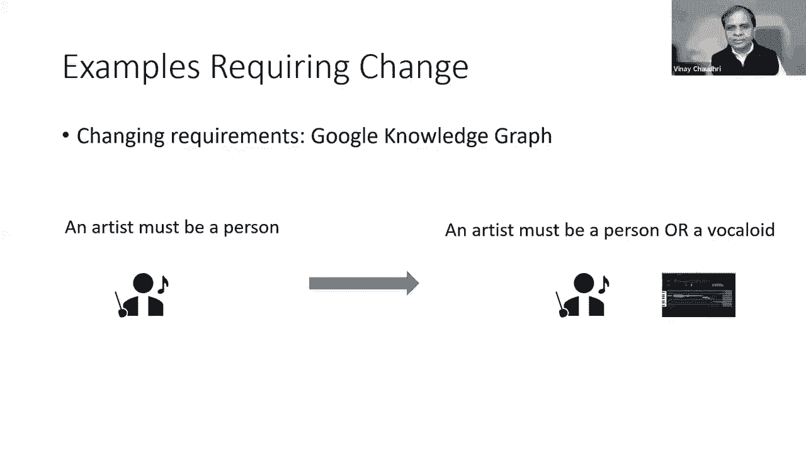

# 【双语字幕+资料下载】斯坦福CS520 ｜ 知识图谱(2021最新·全20讲) - P26：L16.1- 如何拓展知识图谱 - ShowMeAI - BV1hb4y1r7fF

欢迎来到今天的知识手工艺研讨会，我们在课程的第八周，我们的重点是如何发展一个知识图。

星期二我们听到呃，月球董和黛博拉·麦金尼斯，他主要关注的是，我们在创建大型知识图时应该记住的技术，将持续一段时间，今天我们的计划分为两部分。

第一部分是我将给出我的综合，呃，关于如何演化知识图的问题，我今天的综合不是很长，在演讲的第二部分，我们将有，呃，呃，弗兰克·麦克雪里，他会告诉我们增量。

呃，适当维修，所有的权利，所以我会，首先概述一下在发展知识图时的问题，然后我会看一些现实世界中需要改变知识图的例子，我将列出变更管理技术，我把它分为三个部分，模式进化，视图维护和真相维护。

我有一些关于图式进化的材料，我将与你分享，我希望弗兰克能给出一个坚实的观点概述，维护和真理维护是我们为未来几年保留的东西。

所以生命中唯一不变的就是变化，嗯，我们总是看到变化，呃，现实世界的变化，呃，业务需求不断变化，当这些变化发生时，我们必须改变我们的软件工件，因为知识图是一个软件人工制品，我们必须改变它，随着生活的变化。

随着事情的变化，呃，我们可以，呃，呃，2。我们的需求可能会因两种不同的方式而受到影响，一个是我们正在修改图式，另一个是我们正在修改我们知识图中的基本事实，所以对于知识旅行来说。

模式更改可能涉及更改关系的语义，或引入新关系或重命名关系，我们将看看其中一些变化的例子，当我们应对这些变化时，我们必须，呃，记住，都是，呃，技术问题以及社会问题，但技术问题，我是说。

我们需要一些算法技术，使用这些技术我们可以将变化应用到知识图上，IS是一个软件，它被最终用户和软件开发人员使用，也有社会问题，所以我们必须确保当我们做出改变时，我们不嗯，打破东西，代码不会被破坏。

和依赖某些东西的人，出现或不出现在知识图中不会受到不利影响，我是说，社会问题和进程显然非常重要，在某种程度上，我们听说了，呃，那些呃，星期二，呃，来自黛布拉，我认为今天我们主要关注技术或算法挑战或方法。

所以在我演讲的第一部分，我要举几个例子，呃，这些是我们去年系列中综合的例子，嗯，主要来自赫克托的陈述，他们谈到了他们在。

他们的谷歌知识图的开发和部署，嗯，所以为了激励一个不断变化的世界的例子，我在这里举亚马逊产品图的例子，同样的例子也适用于谷歌知识图，但在亚马逊产品图的背景下，卢娜星期二说的那种，世界在不断变化。

我们有新产品，我们有新的产品类别，我们有，呃，制造商正在引入的新功能，有些产品停产了，当这些不断变化的变化发生在现实世界中时，我们必须使我们的知识图与这些变化保持同步。

然后有一个不断变化的需求，这是赫克托在去年的演讲中举的例子，呃，所以在谷歌知识图中，在某一点上，他们有这样的限制，一个艺术家必须永远是一个人，然后他们开始看到，呃，数据提要中的示例，人们指定一个声素。

作为一个如此直言不讳的艺术家，如果你不知道实际上是一个计算机程序，现在计算机程序可以制作音乐，在这种情况下，人们会说艺术家是一本书，现在，随着这样的数据开始出现在谷歌的数据提要中，他们必须做点什么。

因为他们不控制数据源，因为这是第三方数据提要，他们没有这么做，他们希望这些数据显示在他们的知识图中，所以他们必须回到过去改变对谁能成为艺术家的限制，他们被迫更新限制，甚至允许计算机程序成为艺术家。

在音乐领域，在谷歌知识图中，包括，呃，一张专辑的艺术家，和赫克托尔，告诉我们通常，他们无法从一个单一的来源获得一张专辑中的所有艺术家，他们最终不得不融合来自多个来源的信息，获得一个结果的权威艺术家名单。

他们得到的数据不断变化，当它们改变格式时，他们必须，嗯，改变他们的，呃，他们将数据纳入知识图的程序。

然后有一些例子，你必须，您已经根据知识图的某些属性计算了一些推论，不再有效，所以说，比如说，您可能有一个限制，电影院只放映电影，但在特定情况下，嗯，可能是人们开始放歌剧了，如果你看看现代背景。

人们在做什么，呃，体育场馆疫苗接种中心，正确的体育场不仅仅是为了运动，但他们是治疗中心，如果基于这些限制，呃，在你的知识图中缓存了一些信息，现在现实世界的约束改变了正在发生的不同事情。

你必须回去修改你以前缓存的所有信息。

有时您必须更改架构，呃，例如，你可能有一个知识图，你说，嗯，你知道我们会有公司公司会有一个没有财产的人，首席执行官通常会更换，你可以说不不不不，我们希望有一个CEO作为一个单独的对象，对于该对象。

我们将具有诸如name之类的属性，开始日期和结束日期，现在你的模式突然改变了，你首先修改模式，如果在你的知识图中，您有一些与旧模式相对应的数据。

你也得更新一下好吧，所以这是一个光谱，呃，呃改变了，嗯，我们可能会面对，嗯，这是一种动机，也是一种背景，呃，我们现在讨论的关系数据库的技术，除了，你知道的，在表中添加或删除元组或项，嗯，您可以进行更改。

如添加或删除列，或者您可以重命名一个属性，在数据库中，这种变化称为数据库重组，因为您可能已经在磁盘上存储了大量数据，如果您要添加和删除列，您必须，您可能必须重新组织数据，以确保事情保持高效。

但在知识图中，模式可以稍微复杂一点，您可以进行更改，如添加或删除眼镜，添加一个，移除超类，添加属性，添加删除约束，其中的一些例子，我们之前看到的，他们已经研究了许多这些变化，呃，在面向对象数据库领域。

在模式进化的标题下，我要给你一个旋风式的旅行，对于人们尝试过的一些事情，所使用的技术的一般原理是保持某些不变量，呃，所以我们假设系统一定有，或者我们的模式必须有一些属性，在某些情况下。

我们最终不得不做出特定于系统的决定。

往往是武断的，我会试着给你每种口味的，例如，如果你，呃删除或重命名属性，呃，如果你有很多很多的三元组存储在你的知识图中，然后您必须通过图传播属性的重命名，在某些情况下，您可能想告诉用户有多少。

你做了多少改变，通常人们会通过生成所有变化的摘要来做到这一点，呃，应用于知识图，如果添加新类，呃，到系统，所以人们的一个不变量，呃通常遵循的是，呃，每个类都是系统定义的根类的子类。

所以如果您添加一个新类，你没有指定它应该去哪里，不变量是把它放在系统定义的根类下，现在当你移除一个类会发生什么，呃，删除类时，事情往往更复杂一点，当您删除一个类时，可能会出现这种情况。

该类的直接子类有其他超类，所以在这种情况下，你要移除B，它的直接子类是c而c恰好有另一个超级加d，所以这是一个简单的案例，解决办法是去掉B，你什么都不用做，对呀，结果很简单，但在某些情况下。

直接子类可能没有任何其他超类，你有一个系统不变量，虽然您知道在类层次结构中不能有孤儿类，所以在这种情况下，你必须决定你要做什么，一个明显的，呃事情是，使C成为系统定义的超类的剩余，你知道这将保持不变。

你的类层次结构保持连接，更极端的解决方案可能是删除所有子类，就像如果你删除B，然后删除C，我的意思是这更极端，更激烈，大多数系统不愿意这样做，当然没有，用户的明确方向，呃，当您添加新的超级类时，呃。

有一个问题是你应该如何处理多余的链接，所以在这种情况下，你知道你有一个从C到B和B到A的链接，假设您添加了一个从C到A的链接，我是说这里有些冗余，因为呃，我们可以推断她是一个过剩的，从T是B的一个加。

B是A的一个加的事实来看，我们真的不需要有人添加的额外链接，呃，人们对如何处理这种变化采取了不同的立场，呃，一些系统会不允许这样的冗余链接，有些系统不会关心你是否有这样的冗余链接。

一个相关的问题是如何处理周期，因为类层次结构的语义是，它必须是一个循环，如果有人引入循环，大多数系统会拒绝，然后系统可以在给用户什么样的帮助上有所不同。

解决冲突。

所有的权利，这是一个快速的概述，模式进化技术，因为它与类层次结构或面向对象的表示类型有关。

现在视图维护是一种技术，数据库系统视图本身，它们是一种用于命名某个查询的技术，我们可以使用视图命名查询，如果你愿意，我们可以存储我们从中计算的查询数据的结果，查询称为基础数据和存储的结果。

它们现在被称为物化视图，如果基础数据发生变化，我们必须更新我们的视图，即使我是在数据库系统的上下文中解释这一点，它非常适用于知识图，因为您可以通过从多个数据库中提取信息来创建知识图。

创建这个统一的三视图，如果您的基本数据发生变化，然后您必须更新从基本数据合成的this视图，这就是我在这个话题上要说的，因为这真的是弗兰克今天的话题，我是说，我看不出视图维护有什么问题。

在文学知识的背景下被谈论了很多，但我认为这真的很重要，呃，许多正在建立知识工作的人，他们将通过简单地重新计算他们的知识图来解决这个问题，源信息，在某些情况下是可以的，但我认为当你的数据，呃。

体型巨大，呃，你想做比那更好的事吗，真相维护是一种相关的技术，这是一种机制，呃，从基于规则的系统，它跟踪我们如何使用不同的推理规则来得出新的结论，和一个流行的实现真理在系统中被称为基于理由的系统。

工作方式是，每次你得出一个新的结论，它记录了你在得出这个结论时使用了哪些事实和规则，然后任何时候你改变任何效果，任何规则，并使用此论证结构，你可以弄清楚你还需要做什么改变，呃，在你的系统里，因此。

在知识图的上下文中，真理维护就更少被谈论了，我在想你知道，也许我们应该对此进行一次讲座，呃，在这个今年系列中，但我决定在未来几年保持开放。

我将以此结束我的部分。

