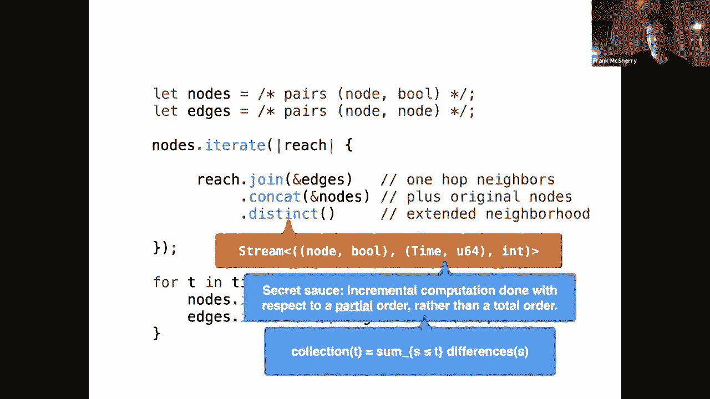
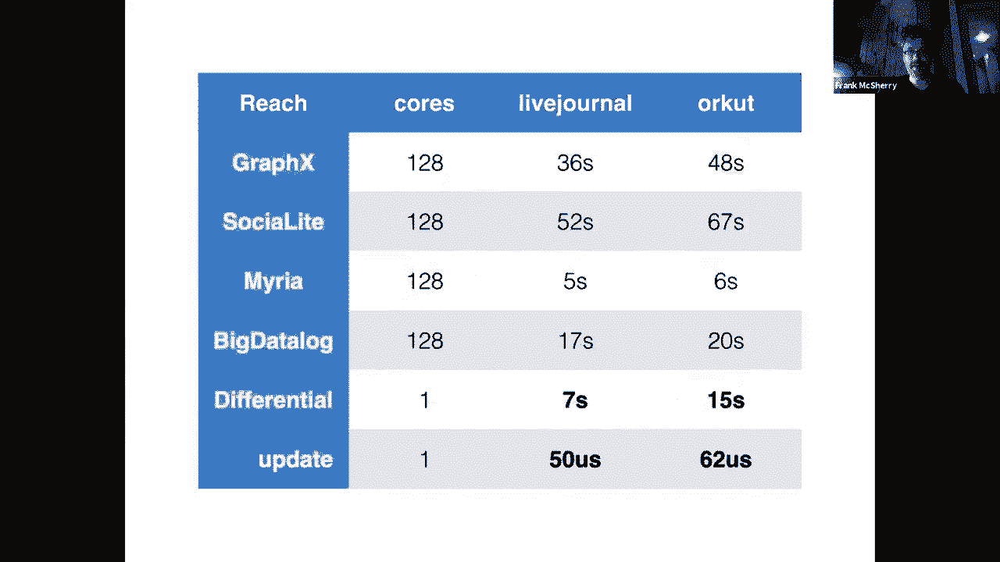
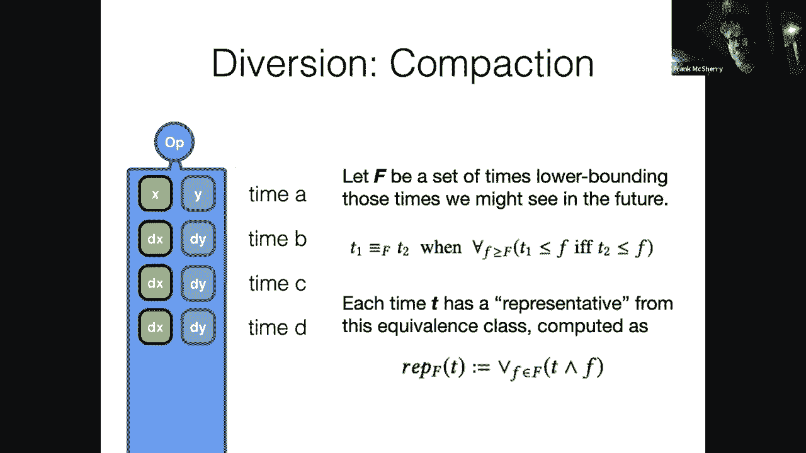
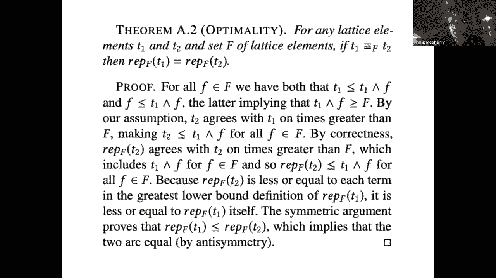
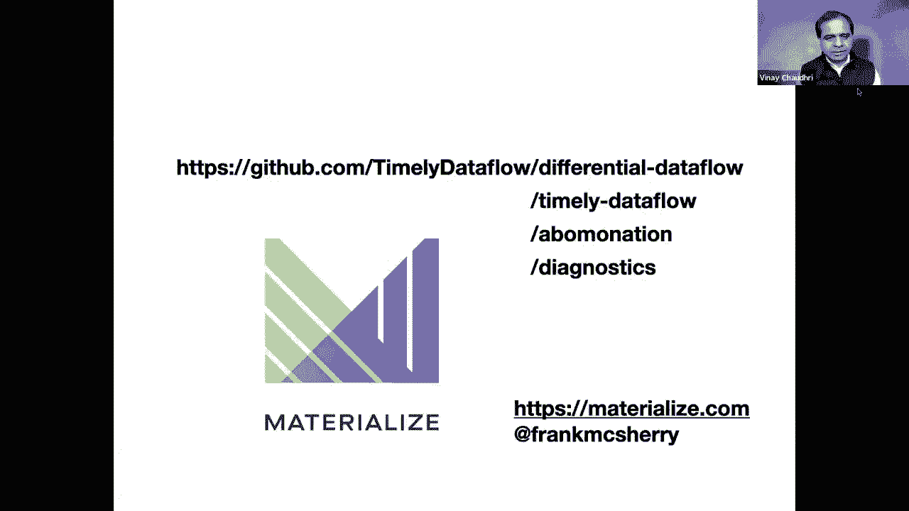

# 【双语字幕+资料下载】斯坦福CS520 ｜ 知识图谱(2021最新·全20讲) - P27：L16.2- 针对递归查询的增量视图维护 - ShowMeAI - BV1hb4y1r7fF

弗兰克将和我们谈谈增量视图维护，呃，他目前也在竞选，呃，他创办的一家公司，其主要技术是增量视图维护，弗兰克是个有成就的研究员，在计算机安全方面作出了基础性贡献，他的贡献也得到了认可通过授予他腰带奖。

这实际上是非常非常令人印象深刻的，所以弗兰克，我把它交给你了，请把它拿走。

非常好，非常感谢，嗯，让我先整理一下屏幕共享的情况，嗯，等一下，我要点击各种东西，我们看看这是否有效，所有的权利，你看到全屏了吗，嗯，是啊，是啊，有一个滑梯，奇妙，所有的权利，嗯。

人们应该感到非常欢迎提出问题，呃，因为他们有他们，我有一个警告，每个人，他们就像我看到你们所有人的能力，我做报告的时间有限，呃，所以你知道，不管我们有什么机制让我停下来重申一件事，嗯。

非常欢迎向我们援引这一点，我其实不知道是什么，这就是网络研讨会的形式，但是呃，拜托了，请做一个欢迎，所以说，呃，是啊，是啊，嗯，这只是一个初学者幻灯片，我现在正在工作，这就像文提到的那样。

一家主要围绕增量视图理念建立的公司，维修，并试图让人们更容易接受，他们不想去拿博士学位，在计算机科学的任何方面，你需要了解这类事情，我以后会有一些链接，在最后，我主要要说的是实际情况。

就像一个真实存在的计算机科学项目，所以你可以去试试这些东西，如果你认为这可能与你正在做的事情有联系，和技术把它们放在一起会很酷看看，如果他们为你做了一件事，所以嗯，从一个激励问题开始，呃。

这将是相当相当简单的，但希望这里会有一些知识图的回声，我会尽量保持简单，虽然，也许更原始一点，所以让我们从，嗯，这是这是时间箭头，从左到右，世事难料，随着时间的推移，我们有活动，我要依靠的那个。

此刻只是从，呃，外面的社交网络，所以你知道，人们可能会在推特上谈论事情，推特上有内容，你知道他们引用主题，可能与特定推文相关联的，他们还提到个人，所以人们对，人们都发布推文，他们也可能会提到，呃，人。

同时也提到了，同时，这是一个相当酷的数据集，我无法访问它，但是你可以想象，嗯，你知道这些信息存在于外面，而且很值钱，从某种意义上说，它反映了许多关于世界的非常酷的信息，它可能不像知识图那样具有规定性。

但我们也许能拓展一下思路，想象类似的概念如何应用，所以让我们从一个简单的问题开始，嗯，什么是最流行的标签在那里，这就是问题的类型，你可以询问数据，是啊，是啊，你也许可以拿出一些，一些续集或映射。

甚至只是Excel或shell脚本，并计算事情，你可能很快就完成了，但你们中的一些人让你的生活变得更加艰难，并说，呃，不是很有趣，呃，在那里计算流行的标签，我们都知道那将是防弹少年团或类似的东西。

如果呃，如果相反呢，我们要求人们确定最受欢迎的标签，通过这个图的连通分量，所以不同的人提到其他人，你可能会说，这听起来像是一个新兴的社会结构，就像人与人之间的小联系一样，你认识的人。

如果我们跟踪A人在B人发推特的路径，在这些连接的组件中积累，标签，那里最受欢迎的是什么，这可能有点难，这是我倾向于，拿出一个图形处理系统，开始思考如何形成连接的组件。

或者描述标识组件并以这种方式聚合的规则，你的生活可能会因为某人而变得更加艰难，说他们实际上想要的，这是实时的，以便随着数据的变化，大家想看的，实时更新这些，这些统计数据既是，呃，标签在账户更改中被发布。

当然啦，而且随着这些社会结构的变化和进化，嗯，你知道的，作为越来越多链接的人，比如说，通过推文，希望在这一点上，这有点吓人，你可能会认为这可能真的真的很难，呃，前两个已经是，你知道，有点累人，而现在。

如果你想让我不断更新这个，定期重新运行查询的想法有点不切实际，但希望这能激励人，希望你能理解，就像知识图中出现的相同类型的图形数据，让我们说，这是不断更新的所有地方。

你可能会对这些数据有很多非常有趣的看法，告诉你事情，或者让你了解，承担世界上各种各样的事情，人和产品，以及各种其他新闻，比如说，嗯，保持新鲜是非常有价值的。

了解一条特定的新闻和了解一条特定的新闻之间有很大的区别，比方说现在得到了一群信誉良好的新闻机构的支持，而不是24小时后那种事情，所以我要用这个激励的例子，试着，呃，让你兴奋一点并向你展示一个人如何做到。

增量视图维护是保持查询，就像前两行一样，描述数据变化的最新情况，我要具体说的是，是一个编程框架，我一直负责，我是一个超级粉丝，但我会用这个主要作为一个，作为一个特定的工件来谈论，但这些想法概括了，嗯。

而是一个编程的框架框架，用于询问关于数据的问题，的，我相信它更新计算的令人信服的性质，更新其输出，当您更新它的输入时，所以输入，在这种情况下可能是，你知道输入到知识图中的事实。

您在各种形式的查询中描述的计算，你们有兴趣发行，而且随着数据的变化而维护，所以那是，呃对不起，只是随机的，比尔来了，差分数据流就是这个的名字，这个框架有一个回购，它是，都是开源的，所以你可以去抓它。

玩那种东西，它是基于一些工作，最早出现在2013年的苹果酒中，从那以后，它有一些独特的特点，我会叫出来，嗯，主要是说，它可能是最适合增量视图的之一，的递归或遍历路径的查询的维护，你会正确地定义长度。

我们通常会在图表中完成，那么嗯什么是什么是什么这里的故事，我要去投球一点点的框架，但希望这能引起通常处理数据的人的共鸣，所以我们要实现的一个目标是，我们很乐意给人们一个体验，查询经验，编程语言经验。

他们认为他们是在针对静态数据集合进行写入，对呀，在任何地方的增量视图维护系统中，这通常都是正确的，也就是说，你想让这个人描述一个视图，或者跨某些数据的计算，而不必考虑数据改变它，系统将处理视图。

为您维护正确，自动处理，因为人们真的不擅长思考编写程序，根据更改的数据，考虑编写程序要容易得多，针对静态数据集合，然后让系统处理当数据本身发生变化时该做什么，所以这是预期的体验，呃跨越所有系统，老实说。

只是为了画一些可爱的画，嗯，我们会考虑你写一个程序，你的探针在这里，一方面，它从一些数据集合中映射出来，另一方面，一些结果的集合，就像我之前说的，这可能是知识图，这些可能是实体属性值的三元组，可能是。

你知道的，关系数据，各种各样的东西，您喜欢的构建信息的方式，以及我们将试图提供给用户的体验，坐下来并兴奋地使用该系统的人，随着时间的推移，所以喜欢为T，所有的时候我们都想给体验，就像我们在。

无论输入数据在某个时候碰巧是什么，所以输入数据会改变，我们不知道它们是如何变化的，你不知道他们是怎么变的，嗯，但我们希望我们能给你有效地重新运行你的程序的经验，在不断变化的数据上。

用这些时间的输出呈现出来，嗯，这是个坏主意，我们实际上不会在每个，每个输入集合，这些可能是巨大的，正如我想象的那样，想象一下，你知道的，这些知识图只是，因此，即使重新考虑整个输入也是非常昂贵的，因此。

几乎所有这些增量视图维护技术的要点，就是想想这些收藏，输入和输出的变化，不像呃，数据的整个快照，但随着变化的到来，呃，变化描述，生效，和以前有什么不同，呃，我们刚才看的输入，我们要想这些，呃。

尤其是在这个系统中，作为这些变化的一个流，在那里，更改碰巧被写成三倍，在本例中，三元组描述为这个数据时间，如果他们描述了是什么改变了它的位置，什么，我们谈论的事实是什么，你会去哪里看看乐趣，看看变化。

对不起，这种变化是什么时候发生的？这本质上是，这是这个循环中的T对吧，所以呃，当我们走过这些时候，我们想非常清楚它是什么时候发生的变化，这是正确的一个重要部分，差异上的第三个组件描述了变化的性质。

这是一个简单的想法，可能是加一，也可能是减一，表明事实数据，从收藏中添加或删除的任何内容，你可能不会，呃一定会觉得超级舒服，他们做了知识图表，删除了事实，嗯，这是，呃，这很好，这是常有的事，嗯，你知道。

一般事实，你喜欢认为它们是真的，但出于各种原因，您可能会将信息片段退役，它们可能会到期，它们只在一定时间内被认为是正确的，之后你就不再对他们有信心了，你让他们退休，在世界末日的时候，就像有一次一样。

是负数，我们已经引出了你的问题，你喜欢的程序，我们要在变化流上运行它，这就是目的，我们将以类似的格式给您输出，对呀，我们将提供您要求的结果，如果你要求，比如说，通过连接标签的组件来计算这些计数。

向您报告这些特定计数的变化，因此，与其一遍又一遍地向您展示整个输出集合，这些方块的输出，当然也可以是巨大的，我们当然可以要求，你从知识图中的每一个特定事实中知道，呃，关于局部可导出信息的一些信息。

或者我们的父母和某些等级制度，所以我们不想再次向您展示整个输出集合，它可能是巨大的，但是一个系统可以完全想象向你展示变化，我可以告诉你啊，你知道的，我们刚才同意的输出，让我们让我们调整一下。

用下面的方法，让我们从该特定集合中添加或删除一些结果，所以这里的类型是一样的，数据是一些，一些特定的有效载荷，你知道你开车的事实，时间又到了，t，正是这个逻辑时间被用来关联，输入的变化对输出的变化。

然后倾角是正负，一种东西告诉你是否添加了东西，移除，或，或者有多少，很多情况下，所以说，嗯，这是增量视图的抽象，维修，和这种形式的程序，你必须，对于其中的一些事情。

你得把你的头稍微转一下才能把它放进框架里，你熟悉的，嗯，但你知道，你的程序可能是，比如说，一堆密码查询，可能是其他数据日志，或者类似的东西，如果，你想用那个，用于描述如何通过链接的数据反转搜索，酷。

所以让我举一个例子，嗯，这是我的语言，呃，我说的是差分数据流，这并不复杂，但我会试着谈谈这里的一些事情，试图获得它所拥有的原语的感觉，原语将有助于我们以后理解一些技术，在这里我们讨论如何维护某些查询。

一般技术，所以这不是一个惊喜，我们会做得更好，维护对数据的基本操作，并将这些拼凑在一起，呃，将这些简单的数据元素操作实现为更大的有意义的计算，所以嗯，是啊，是啊，所以这是一个超级简单的例子。

它会变成一个图表，看一下计算，现在请原谅我，所以这些，呃，这些程序通常看起来是你从定义一些，嗯，一些输入，这些是表格，嗯，这些会和我们在一起一段时间，和，嗯，可能会改变，但我们要从他们开始。

本质上认为它们是空的集合最初可能第一个变化引入了大量的数据，但是他们的名字将在整个查询过程中持续存在，所以我们想先把这些固定下来，不管我们要做什么，它将是指这些不断变化的收藏，嗯嗯。

接下来我们要做的事情是描述某种查询，我认为这是一个程序，但这是一件很合理的事情，但作为查询，也是你想做的事情，在这种情况下，节点和边将导致一些，哦，希望不是微不足道的，喜欢有意义的结果出来，另一端。

这个特殊的示例执行节点和边之间的连接关系连接，上面写的是，你知道的，对于外面的每个节点，去找一个以相同标识符开头的边，所以它本质上是试图做一个，沿着这些边缘跳，从每个节点n说，找到我所有的X。

这样他们在我的边集合中有一个n逗号x，这很容易，你知道的，一个知识图，跟随任何其他类型的标记边，你有，你可能会通过你正在寻找的特定关系来限制边缘，然后跟着它找到你知道的，认识其他人的人，比如说。

这个计算，所以我们做了，我们做了加入，它将连接到原始节点集中，出于对我宽容的原因，这基本上是说我们想从音符中跳出来，或或零，所以离我们原来的位置只有一步之遥，然后我们应用这个不同的运算符，好的。

也许我们到达了同一个目的地，两三种不同的方式对我来说并不重要，让我们跟踪我们可以沿着边缘到达的一组地方，从一跳后的节点开始，呃，我们，呃，然后进入现在定义我们的查询，我们进入了一种更具互动性的。

计算的增量部分，我们开始推进时间，我们开始玩这些节点和边缘集合，到目前为止，我们可以在这个例子中考虑，我们可能会在节点中添加一大堆数据，在边缘中添加一堆数据，所以我们用感兴趣的初始节点填充它们。

无论我们最初的边缘是什么，在我们的图表中碰巧是，然后呃，的，这种系统的承诺是，这个特定查询的结果将被更新，当我们执行所有这些插入时，所以我们可以告诉啊，可到达的节点集已经增长，呃，改为：按下列节点。

可能是因为我们向节点集添加了一个新的开始，或者我们添加了一个新的边，连接一个已经存在的开始节点，在别的地方找到我们，好了现在，呃，在这里你可以做更多的事情，呃，插边很好玩，呃，移除它们也很有趣。

所以这是我认为常见的情况，很多人认为增量视图维护，事物之间联系的边缘在变化，人们添加边缘移除边缘，从某种意义上说，这是你的数据，如果你相信我告诉你的，呃，到目前为止这种类型的系统，我们是。

我们希望它能让事情与时俱进，当我们添加和删除东西时，嗯，顺便说一句，这都是承诺的，目前我们还没有真正看到它的机制，所以只要嗯，如果我不在几张幻灯片中谈到它，你生气是很受欢迎的，但是呃，但是是的，插边。

去除边缘，更改数据，同时也很有趣，您还可以完全将东西添加和删除到节点中，这在某种程度上就像在你的知识图表中植入稍微不同的查询，如果您有兴趣从感兴趣的点开始查询，你也可以去，并更新该设置，添加问题。

删除问题，我印象深刻的是，因为也许最重要的是，你可以两个都做，同时，事情保持一致，所以这是相当重要的，我们正在向您显示查询的正确答案，在某个时间碰巧在任何节点和边上，如果你更新他们两个，这不仅仅是，哦。

我一个也不知道，然后做另一个，让我们看看会发生什么，很明显，我们应该提供一个正确的答案，所以如果你，比如说，移除一个节点并移除它的一些事件边，音符另一端可到达的东西应该消失，不应该花一点时间。

或者类似的事情让他们完成，有一个非常明确的正确答案，我们应该看到，好的，所以这我不知道，我是说，这里的一切都可以在关系数据库中完成，在过去的二三十年里，所以我们要让这个更有趣一点，和更多的图形相关。

所以让我们来缩进，呃，粗略地谈论一种不同的操作，您可能想要递增，这是呃，希望，你可以，你可以想象这可能是什么，这是一个迭代运算符，它使用了一点逻辑片段，在这种情况下，我们谈过的一模一样的事情。

它出去零步或一步，但重复地将其应用于某个初始集合，所以这个计算实际上要描述，从节点重复描述的一组节点开始，做，我会走一步或零步，在那里形成一组结果，基本上无限期地这样做，那个，如果你熟悉，将形成从，呃。

种子集，里面的节点，这突然更有趣了，这在传统的数据库系统中表达起来要复杂得多，它更符合图形处理系统的精神，你可能会在知识图上问的各种问题，其中各种效应之间存在潜在的无界互连，你可能想探索以得出一些结论。

呃这个凹痕我刚刚在这里，嗯真的让增量视图维护很难所以直到嗯，你知道的，十年前左右，人们真的没有一个很好的故事来讲述如何做我的拍摄，至少，人们对如何进行增量视图维护没有一个很好的故事，关于这些计算。

因为迭代只是嗯，有点让你大吃一惊，这是呃，它摧毁了许多先前存在的技术，太可惜了，幸运的是我们会看到，呃，在整个演讲过程中，如何恢复，怎么回去，一个能够维护，这些通过图遍历潜在的深远连接的计算。

现在我要给你一些提示，现在你不应该，你知道的，完全把你的头放在这些事情上，但我确实想挑逗一下，我们要去的地方，就像以前我们会有这些三倍的数据流，时间和差异，我之前说过差值是整数，加一减去一。

这将保持为真，在本例中，数据的节点和公牛，它是它是一对，也许我应该把它叫做数据，但有趣的是，会让我们的生活变得更好的事情，我们以前认为的时间，不管那是什么，你知道可能是一个整数，毫秒，或者类似的东西。

我们要改变，我们将把时间看作是一个更复杂的物体，这就是所有这些技术的秘诀，我们做增量计算，不再是关于一条线，这不仅仅是以前的，然后下一个和后面的描述是这样不同的，非常标准的增量计算技术，当然啦，嗯。

但是，我们将介绍关于偏序进行计算的思想，在这种情况下，时间与一轮迭代配对，我们一会儿会在一些图片中看到，但这是一种，对应于在二维网格上进行增量计算，因为某种原因，那将会，愉快地在迭代计算上进行增量计算。

高效实用，非常欢迎你想知道到底发生了什么，这是否意味着，我会试着展示一大堆色彩鲜艳的图片，为了帮助这个，嗯，我有点喜欢的方式，也许它对人们有效，也许不是，嗯，思考无处不在的增量计算的一种方法。

我们一直在跟踪这个，在任何时间点收集数据的规则，t应该等于和，总的来说少，或等于差值的t，时机成熟时的变化，在我们之前的幻灯片上，这是真的，我们正在谈论的地方，一次又一次地移动，呃，你知道吗。

在某个时刻找到任何特定的收藏，会积累所有的变化，所以这个，你知道的，这个方程在直觉上可能是有意义的，令人惊讶的是，这确实很有意义，你看到的不平等标志，较小的等号不需要只用于整数，它可以更一般。

它可以是偏序，而不是全部订单，当你放松并重新推导所有的数学时，很多很酷的事情都有意义，好吧对不起，你知道的，几年后它们就有意义了你会有一段时间头痛，但最终事情会走到一起，你会得到一个很酷的计算机系统。

我只是想举几个例子，因为在这一点上你可能会怀疑，这是很多理论上的月份，呃，所以我要扔掉一些，一些本应模拟的数字，我们只是在看一个图的可达性计算，对还有这个，你知道作为一个计算，您可以应用于大型数据集。

非常原始，当然，它只是字面上的，我可以到达其他节点，但这有点，大量大规模图形处理和图挖掘的本质，所以这里是呃，一些数字，这是西格玛216，所以这不是最近的，我给你看的数字是同一时间的，虽然。

但是这些是各种各样的图处理系统，他们中的一些人，我想社交名媛，例如，来自斯坦福大学，嗯，一些计算机核心和一些数据集，这些在社区中是众所周知的，我们可以在这里拉出差分数据流，你刚才在单个核心上看到的计算。

这是一台真正的笔记本电脑，它运行得相对较快，这不是最快的东西，呃这里，米莉亚肯定会更快一点，但真正酷的是，整个计算可以增量更新，所以如果你通过并开始删除事实，移除碰巧是触手可及的难做的事情。

添加能力查询很容易，但如果你开始移除东西，更新平均，呃，几十微秒，微秒是小于毫秒的东西，所以这真的挺快的，您可以想象一个潜在的非常高吞吐量的系统，在这一点上，他们可以处理很多很多的变化。

与您所经历的变化数量成正比的时间，而不是数据量，所以你可能坐在数十亿的影响上，但只要变化率不太高，你可以跟上它，保持你所有的，你所有的结果，酷，所以我要扔一张小照片，只是为了给你一些直觉，几分钟的感觉。

嗯，这是一个互补累积频率函数，我想这就像CDF在旋转，它从零到一千，而不是零比一，但它基本上告诉我们从我们采集的一千个样本中，每个随机更新花了多长时间，一些微秒，它实际上在右手边大约20秒的地方结束。

从一个角度来看，嗯，你知道很多时候你对数据进行更改，什么都没发生，的，您添加或删除的事实不会导致任何新的信息派生，你需要检查它是否重要，但这通常是相当快的，你说，嗯，我们结束了，什么都没发生，轻松时光。

嗯，但也不是很有趣，呃，在这种情况下，呃，大约60%的时间，发生了一些事，你知道不是，呃，不一定是超级复杂的东西，但我们必须去寻找一个新的事实，它导致了什么，也许再去一次，嗯，那种事情。

然后把这个叫出来，事情会改变，就像你知道的，你可以拥有，呃，实质性改变结果的事件，呃，你知道的，如果在图的核心位置添加或删除边，比如说，呃，我们可能会戏剧性地改变我们的结果，你知道的，如果呃，你知道的。

所以一些非常著名的防弹少年团在推特上关注一个人，呃，呃，我，这么说吧，这将极大地改变我周围的一大堆可达性，那里没有魔法，如果真是这样的话，如果很多数据发生了变化，现在得有人去做所有的工作。

希望我们在工作，这只与，计算发生了变化，所以改变的结果，而不是重新扫描整个东西，但没有魔法，不能保证输入的微小变化，导致输出的微小变化，它可能不会，这是我认为图形令人兴奋的事情之一，呃，计算是，是啊。

是啊，一个微小的变化就可能导致新信息的大规模爆炸，这很有趣。

我只是要弹回这个，向您展示对此的一些小修改，只是为了试着，如果你对可达性不着迷，你可以在这里做一些其他的变体，这是一个例子，所以如果不是跟踪你可以到达的节点，我们稍微调整一下，说在每个节点。

我们有一个整数附加到节点，所以它有一个标签，这种情况下的标签完全是人为的，也许你可以用节点自己的名字开始，比如说，而不仅仅是看你能在整个图表中接触到谁，相反，我们传播节点的名称，特别是我们传播每个节点。

反复，传播到目前为止所看到的最小的命名节点，最小标签的节点，这是计算连通分量的经典算法，就像我们无向图的每周连通分量一样强，突然新奇有趣，不仅仅是，你知道吗，一个节点能到达还是一些节点能到达一个集合。

但我们实际上已经了解了数据的结构特性，我们发现哪些社区可以接触到其他社区，哪些社区与其他社区隔离，而且很相似，就像相同的算法具有相同的增量执行属性，当我们去探索的时候，呃，和它一起玩，你对介绍反应很好。

删除所有这些数据位，所以这个这个框架，至少意图，差分数据流提供了这些元素运算符，允许您探索图，你需要描述计算，当然啦，但如果你有，比如说，你想探索的某些模式，这通常是一个迭代算法。

将反复地将边连接在一起，它有正确的标签或标签，一遍又一遍地匹配某些特定的模式，呃，你知道的，只要它们继续匹配，就会展开路径，嗯，你当然可以把它融入这个框架，它是否做得很好是一个很好的问题。

这在很大程度上取决于你的查询，但是呃，但很合身，所以说，嗯，是啊，是啊，所以这是，这是，呃，我们要从什么开始工作，就是，呃，在这个世界里，我们有这些元素运算符，比如将两位数据连接在一起，嗯，一些集合。

所以不同的运算符和in运算符都是聚合，你知道的，对于与一个节点相关联的一堆事实，也许，或，或，你知道的，任何其他钥匙，喜欢标签，减少数据，然后迭代是一种表达这一点或路径遵循的方式。

或者像重复应用各种规则，这到底是什么样子的，当我们试图建立一个围绕，就像如果我们想实现这个，既能有效地计算答案，但也要有效地维护它们，那是怎么工作的，当然，有几种方法可以做到这一点，传统数据库。

不要采取这种方法，我将要描述传统数据库，当您更新节点和边缘时，请尝试，他们试图用同一种语言形成一个新的查询，说啊好吧，如果有增量节点集合，查询是什么，我应该用同样的语言发布以找到变化，而且。

在这些迭代计算中，它变得相当困难，所以我们不打算这么做，我们要做些不同的事，所以我们要研究的方法是，数据流是它的名称，大致的想法是我们要把我们的节目，我们之前描述过的，看起来像什么，命令式代码权。

上面说，拿一些收藏，对他们做一些事情，然后你就完成了，或者可能重复它们，我们要把它重写成一个图表，我们重写了一个有向图，它描述了通过计算的数据流，本质上就像关于节点和边的信息到达一样。

我们要把它们路由到一些逻辑上，这些逻辑说，我该怎么处理那个，有了这些信息，你可以在这里看到，节点和边首先连接起来，我们确实在这些和边缘之间有一个连接，由此得出的结果是匹配信息的结果。

关于从它发出的节点和边，我们确实有一个串联，对呀，我们在节点中连接回结果集合，然后有一个不同的运算符，我们，我们应用到最后，你可能会说嗯，这并没有根本的不同，是吗？你没有错，它是。

它意味着同样的表达能力，尽管这里重要的区别是，我们已经非常明确地，如果我提供的唯一东西是对数据的更改，我如何驱动我的计算，而不是认为我可能需要重新运行任何相当好的程序，但我们基本上已经锁定了程序，对呀。

我们说过连接可以用这些箭头分开，程序就是这样，这就是查询，这就是我们要做的事情，现在可以自由地沿着这些节点和边缘弧流动尽可能多的信息，随你喜欢随你喜欢，的确，那正是我们要做的。

我们要处理这些节点和边缘中的每一个，随着时间的推移，这些更新流告诉我们，数据收集如何变化，随着节点的添加和删除，我们会在这里看到相应的更新，当边缘被添加和移除时，我们会在那里看到相应的更新。

我们现在必须以一种正确响应这些变化的方式实现这些运算符，有时这很容易，我觉得猫操作员超级容易，我们只需要获取大部分输入流，把它们放在输出中，只要合并任何，那里有更新吗，但是其他运营商。

连接和区分有点复杂，如果您熟悉关系数据库连接，对嗯，每次在节点中获得新条目时，你得检查一下，有什么边缘和它匹配吗，所以你可能得在某个地方保留一份边缘的副本，同样，当新的边缘到达时，或部分。

您需要签出节点以查看，他们有匹配的东西吗，我需要在输出中添加一个新的匹配结果，或者可能收回我以前发出的类似明显的，需要保持一些状态，我也是，它需要记住它以前发出的是什么，这样它就可以知道抑制重复。

比如说，我们在这个州要看到的大部分，这些累积的变化，这些数据时差的三倍，基本上我们主要在做什么，操作员正在记录我们到目前为止所看到的，就像，流入的累积输入，操作员，现在这里有一些不错的房产，呃。

让我们来谈谈其中的几个，其中一个很酷的属性之一，这项工作在很大程度上是数据并行的，呃，这是一个术语，本质上意味着运算符的描述，比如说，连接可以分解成许多独立的工作位，所有的权利。

这些联合运算符中的每一个，所以它是，你知道的，我要对每一个可能匹配的键做同样的事情，与其他键发生的事情无关，对嗯，我要去，你知道吗，几个人从节点n零下发出匹配，那真是太好了，我要去做那个逻辑。

如果发生了什么事，其他一些节点，我不在乎，我是说，他们可以独立于我做他们的工作，这真的很酷，它给了我们一些，呃，能力，其中一个比较流行的功能是，您可以在系统中的多个工作者之间划分此工作。

所以如果你有一个多线程系统或多个进程，多个机架的计算机，诸如此类的事情，你可以扩展很多工作，但更重要的是，我觉得，尤其是这次演讲，这些是什么，呃，这种平行状态真正描述的是独立，对呀。

它说这些操作员可以被描述为功单位，彼此独立的，这意味着我们有了一个非常坚实的基础来增量实现这些，对呀，所以如果节点n的情况发生变化，我们知道我们不需要改变任何关于N次1的事情，不管那边发生了什么。

你知道我们可以等N次1直到它改变，这对于分解这些较大的计算非常有帮助，变成一堆独立的动作，这些动作也可以独立更新，所以为了更清楚地了解这一点，嗯，我觉得这东西很有趣，希望，呃，很抱歉。

多线程和工作者之类的东西，嗯，当我们沿着这些数据流移动数据时，如果我们把我们的州划分给不同的工人，我们可能需要做一些沟通，比如说，进入这些联合运营商，我们需要洗牌，进去的边缘，它也在洗牌音符，记住。

他们是独立的，只有在你去并确定，你知道的，关节的钥匙，比如说，对呀，他们在零度以下的节点进行匹配，我们必须把所有n个零下数据，所有n个零下的边都在一个地方，然后我们才能真正做这个工作，嗯。

洗牌本质上是为什么我们不能，你知道的，如果其中一个节点发生更改，我们不能只说很好，我们会，我们将在n个零下解决整个问题，变化对我们的计算有什么影响，你知道的，不幸的是，这些变化可能，呃传播到另外两个键。

这就是这个呃，交换引起问题，本质上是，它是一个洗牌一点信息周围，并说，不管你的变化是什么，我们可能得进去把它们弹进，其他一些没有改变厄运的人，把他们叫出来，理解你的这些时刻，这绝对是美妙的。

在您的数据流中，我们还没有另一个，嗯，在一个明显的，呃，与众不同的你，你可能会期待一个，如果我们想知道有多少不同的副本或者对不起，并确保我们只生成某个节点的一个不同副本，因此为零。

我们可能应该把零事件的所有副本放在同一个地方，即使它们是从，呃，你知道作为其他节点的邻居，所以这是一个粗略的结构，了解如何对这个片段进行增量计算，我们刚刚谈到了变化，数据时差变化中的流。

它们流经这些操作员，连接和猫和区别，最终从另一端流出，你得相信我，我们将在下一张幻灯片中深入讨论这个问题，但你必须相信我，这些运算符中的每一个都可以正确地实现，好消息是他们每个人都有一个。

我想一个很清楚的规格，就他们应该生产什么而言，但我们已经说过，它们应该产生产出变化，累加到应用于输入更改累加的函数，所以我们有一些非常具体的指导，关于我们需要生产什么作为输出，并成为一项工程任务。

以弄清楚我们如何有效地，我们执行那个逻辑，什么是好的，我觉得与其费尽心思去想一个复杂的问题，我们只需要将查询分解成这些元素操作，呃，希望，你知道的，我们欺骗了你，当你编写程序的时候，首先。

你已经向我们解释了这些不同的，呃，你要应用的操作，只要我们把它们每一个都递增，我们只要把它们粘在一起，然后我们有一个端到端的管道，呃，本质上是递增的，接下来的几张幻灯片。

我们将经历一个非常激动人心的建设，我想呃，通过其中一个运算符进行对话，这是令人惊讶的，更复杂的运算符之一，它真的唤起了一些复杂性，大部分的复杂性，增量计算，特别是迭代增量计算。

所以我们要把它作为一个例子，而且几乎所有其他的运算符都比它简单，所以让我们只看一个一般运算符，我要和第一个增量数据流谈谈，这不是，嗯，还不是差异数据流，呃，我们会得到什么，但这只是想象一下。

我们有一个运算符，它得到对其输入的更改，这就是发生的一切，全序变化第一次变化，第二个变化，有变化，他们涌进来，这是一些初始数据，呃，这里的数据时间和差异时间，假设它是零，这是第一次，呃。

我们收藏的一堆零钱，本质上告诉我们，我们的收藏，操作员能够计算出输出应该是正确的，我们只在x上运行运算符，它有一些逻辑，我们将产生一些输出数据，这与以前的空集合不同，它基本上只是宣布输出y。

在这种情况下，那太好了，呃，一些更多的数据显示，一些变化，我应该说出现一些DX，说我们现在该做什么是合理的，但我们真的束手无策，如果有人带着DX出现，现在输入是dx和x的累加。

我们唯一能在输出中产生的是，呃，解决方案本质上是为了，让我们考虑将我们的运算符应用于累积的输入，减去我们以前输出的，这就是我们需要在输出中产生的变化，希望我们不必这样计算，但我们知道我们需要生产什么。

至少就现在的产量而言，这个可以重复，我们立即对我们的输入进行更多的更改，还有一个相应的变化，我们需要在我们束手无策的每一刻生产我们的产品，我们需要产生一个非常具体的结果，我们只是继续做正确的事情。

就像没有，没有真正的自由度，没有嗯，那是增量数据流，你可以，你知道的，如果您有这样一个运算符，它只接收对其输入的更改，它对输出的变化效果很好，你可以建立一个很好的大数据流。

所有这些东西的定向非循环数据流，不用担心，你可以做的其他事情，呃，这并不意味着令人满意，呃，嗯，我一会儿就把这个不满意的表现出来，但另一件你可以做的事情，人们已经做了一段时间，特别是在数据日志中，因此。

半自底向上的数据日志评估采用非常相似的原语，只是说你知道吗，让我们在这里放一个圈，基本上，他们在这里有更复杂的数据流图，但是从道德上来说，我们会做一些数据流计算，派生。

想象一下这个运算符或它们的一些集合导出了一些事实，有一些输入事实在x上，和一些导出的表示为y的输出事实，和这些系统，图的类推导，一般说，嗯，我将开始得出一些事实，好像我有一些基本的事实。

你给了我一些规则来获得更多的信息，我将开始获取额外的信息，在那之后我可能会得到更多的事实，就像那些，如果我把这些事实折叠回我的输入中，我可以继续，本质上他们所做的是，他们继续下去。

直到没有新的事实可以推导出来，对呀，所以你可以从你的传真开始，产生输出x y，也许这反馈了周围，你知道，我们可能，我们可以取y，取x，这样我们就不会引入多余的事实，我们已经知道的。

但这个过程基本上会继续下去，直到它平静下来，嗯，所以这是一个很好的方法来描述迭代计算，图的高效迭代计算，数据排序，但是一个静态的图形，数据，所以是的，对不起，这基本上是自底向上的数据日志。

如果您熟悉这一点或其他各种图遍历方法，图挖掘，现在的区别将来自如果什么，如果你想同时做这两件事，这就是差异数据流出现的地方，我们会看到一堆照片，试着大声喊出来，如果你想同时做这两件事。

会发生一件很酷的事情，那就是有一个迭代计算，你递增地更新，你不能只使用以前的技术，或者如果你有你的事实推导循环，比如说，然后你只是撤回了一个输入事实，比如说，这不一定会收回导出的事实，你知道我们可能。

我们可以得出结论，A连接到B连接到C连接回A，如果我们删除A连接到B的信息，我们可能忘了我们是怎么知道的，我们仍然认为A与C有关，再多的继续只是派生，新的积极事实，将修复这样一个事实，不幸的是。

与B相连的A是，呃，所有这些的内核，这就是导致这些的原因，这些推导，我们本质上需要找到一些方法来展开和解开，我们所有的推导都可能非常复杂，我将展示一些图片，可能表明它并不那么复杂，我是说，它是。

这很复杂，你不相信我，但这些照片至少看起来不错，有明亮的原色，如此坦率，所以你在做什么，是啊，是啊，是啊，是啊，做一个时间检查，呃，还有多少，是啊，是啊，是啊，是啊，我想大概有五到十分钟，嗯，太完美了。

太完美了，酷，酷，做这个幻灯片是那种有力的有力的幻灯片，如果我们能挺过去，这是一个希望每个人都很好的，我不知道，对世界上发生的变化有直觉，这使得维护增量计算变得更加容易，所以嗯，所以这里有一个，呃。

让我们想象这是一个迭代计算，输入的变化与输出的变化相匹配，他们离开了屏幕，现在有人想再次改变我们的输入，所以想改变x，我刚说过我们不能简单地增加一些绿色的盒子，因为那样做是不对的，但我们可以。

我们可以做一件事，我们可以朝着不同的方向改变，本质上是对的，我们可以说我有零钱给你，算子，这会改变你的，你的第一轮推导，我只是要去视觉上抵消它在这里，我们可以应用同样的规则，对呀。

我们应该把x和dx相加，产生一些新的输出，你可能会说嗯，呃，我们把什么，你知道的，如果我们被允许在输入中可视化地偏移东西，我们也可以直观地偏移他们的输出，我们可以将输出变化描述为第一轮迭代，但一秒钟。

你知道的，将一轮更改改为输入，比如说，在空间上，它是，它是，呃，索引有点不同，我们像以前一样填充它，呃，你知道吗，应用算子减去y，所以这有点道理，接下来的事情是真正令人兴奋的。

就像人们以前没有做过的事情，我们可以继续这个过程，不是直接下去，对呀，我们可以想象继续向下说，嗯，我们可以一遍又一遍地改变第一件事，但是让我们想想如果我们在这里引入一个新的变化会发生什么，呃。

这意味着改变，到第二轮推导死亡，呃，本质上是从这个新改变的输入，所以这是一种改变，一个变化量，在这些方向中的每一个，我们可以做同样的数学，我们画一个盒子，哇这有点，我想有点惊讶。

至少包括第一次迭代计算的两个更改，以及对第一轮迭代的初步更改，我们看到一个新的变化出现在这种填满广场的地方，我们做同样的数学，我们绝对做了，把多余的绿色物质积累起来，并想出如何解决紫色的东西。

我们现在所做的是我们以前会有的总和，只有整数索引的，我们只是这样把事情加起来，我们在做一些看起来更公平的事情，就像在这一点上的二维积分，这最终是非常有价值和非常重要的，可能就像幻灯片最重要的地方。

如果你看绿色的DXbox不包括在橙色中，嗯，橙色区域，这是肯定发生的信息变化，但我们表现出克制，我们没有把它们包括在我们的计算中，我们知道它们还不相关，即使我们知道它们最终会通过阻止它们而发生。

我们能够更新计算的正确部分，第二轮推导，而不让它被真正不属于那里的事实所污染，只会让我们困惑，所以在视觉上，这是，我想说主要的根本性变化，这是为了迭代计算而进行的增量视图维护，你可以重复这个过程。

基本上是向下的，无限期地保持最新，所有这些迭代计算，其中的关键是，当更改发生时，您可以使用两个维度来索引它们，而不仅仅是一个维度，那就是，呃，从根本上说，这里的关键洞察力是确保，每次我们有这样的变化。

但除了输出的输入，我们明确地记录下一个时间，不仅仅是，哦它，事情发生了，让我们让我们应用它并完成它，我们希望显式地记录用，随着它们发生的时间，这里有一大堆有趣的类比，我觉得他们很有趣，离散偏序微分，嗯。

如果你喜欢数学，这与莫比乌斯反转有关，莫比乌斯反演定理也是如此，这与偏序积分有关，关于那件事我要说的就这些，嗯，现在我以前画了一些这样的东西，但只是为了放松一下，这一切，这是如何工作的。

数据并行运算符有一个非常令人愉快的特性，你可以独立地做它们，当然啦，但是由于更改只发生在记录的子集上，我们只是不需要做那么多的工作，我们不需要更新没有改变的东西，这是一个非常有吸引力的财产。

使所有这些都变得高效，基本上它让这是什么让这需要时间，与变化成比例，变化的数量，而不是整个收藏，第二次，你可能会问，你如何实现所有这些东西，真的，内部并不超级复杂，我们基本上为每一个保留历史。

对于这些钥匙中的每一个，我们在每一个时间都有一段历史，输入输出变化，当我们得到新的输入时，我们在相关的时间重新组装收藏，找出答案并发送结果，把它折进历史，这当然是一个素描，事情比这复杂一点。

但是你可以想象在这一点上，它在很大程度上是工程，故事无拘无束地成长，我要吐的东西，有一些定理说，呃，如果我们聪明地知道，我们将来可能需要做什么工作。

我们可以把这些都压实，这些结果很简洁，保留所有相关历史细节的表示，但不要说得太多，我们需要有，这些是，这些都在报纸上，请随时询问，如果你对这些有疑问，我也可以扔传票，都比较简单，他们也会出现在幻灯片上。

我很乐意分享。

那是字面上的，这就是整个定理的陈述和证明，他们是，他们很矮，其实，所以在视觉上，这只是把事情提起来了好吧，所以我要关闭，只是用一些数字，我在推特上谈了很多关于连接组件的问题，提到了图表。

它以前在微软研究中心，我们确实可以访问一些推特数据，然后呃，这是一些关于连接组件样式的信息，我们从各种各样的人身上溢出来，人们在推特上攻击其他人的图表，所以这描述了一个图。

在这个图中我们可以找到连接的组件，这正是我们在这个计算中所做的，几种不同的方式，所以黑线，例如，我们遇到的记录数量，如果我们重新评估，呃，完整的计算，每一次，你知道的，从零开始。

基本上每次我们做这个迭代过程都需要两三次迭代，原来，如果我们每次通过迭代计算重新运行逻辑，是啊，是啊，这是一条平坦的线，呃，有一条红线，它描述了该权利的增量实现，就是上面写着坚持住坚持住，让我们。

让我们想想相对于以前的时刻的差异，当我们传播时，这会说，比如说，我们前面描述的那些标签，这只会谈论已经改变的标签，大家可以看到，实际上，它高于无国籍，因为有些时候变化比从头开始要复杂得多。

这是肯定会发生的事情，如果您的数据更改太多，增量的东西实际上比从头开始更糟糕，有一条很酷的优先线，关于那件事我不打算说太多，这基本上就像你可以开始做一些聪明的东西在这个，在这个空间里。

但当我们真正进入差异更新时，并想重新更新我们的，以前，是啊，是啊，我们要么从头开始，做无国籍的事情，从头开始，从头开始运行增量计算，或者你可以在这里看到，这个。

这种微分技术让我们在整个计算中得到了大量的更新，它转化为实际的性能效益，因此，这些图结构是在，呃，毫秒，基本上随着数据的变化，用一毫秒对一秒钟做出反应，变化很酷，我想我想我们有整整一秒钟可以利用。

但它给了我们一些空闲时间做，也做额外的工作，同时运行一些其他查询，差不多就是这样，嗯，我想我应该，有一些悬而未决的问题，我要把这些扔了，如果人们愿意，我非常乐意回答关于这些事情的问题，这些更像是。

到底是什么导致你的头受伤，当你需要去建立一个真正的系统，它基本上就像一点点关于变化的现实，变化不仅仅是，他们的世界是这样的，然后它稍微变了一点，世界不幸地，比如说，不管你愿不愿意，都在不断地变化。

你不能让它慢下来停下来，你必须想出如何应对这种情况下的超载这很糟糕，但让我用一大堆链接来结束，把这个扔过来，这些地方，及时的数据流是一种，这个项目是很多工作的基础，有一个差异化的数据流回购。

及时的数据流回购，和其他一些相关的东西，呃附属于这个项目，都是开源的，有文件，在那里，你写过一些学术论文，你也可以向我伸出援手，你想实现，呃，我也在弗兰克的推特上，我敢肯定我现在也在这里。

所以人们有问题，1。谈话到此结束，我很乐意回答人们的任何问题，或者让你去做你的事，如果你筋疲力尽，是啊，是啊，所以谢谢谢谢弗兰克，我们有十分钟的时间提问，所以谢谢你，给出概述，在我们之前的课程中。

我们已经讨论过图形计算，和连接组件绝对是一个核心计算，你想用知识图和，所以从这个意义上说我认为你展示的显然是相关的，假设你有大量的知识，巨大的图形和你的计算机连接组件，图形会有一点变化。

如何获得更新的连接组件，好吧，我想你说得很好，你知道吗，而不是从头开始计算，您将使用这些数据流进行增量计算，你展示的，是的，不确定，是啊，是啊，有一些，呃，以防万一，我是说，几乎可以肯定的是。

它没有被明确地喊出来，但是嗯，这当然是最简单的例子之一，呃，我在那里呆了几年，他们首先感兴趣的是医学本体论，他们拥有的描述各种诊断的数据集，然后呃，你知道的，症状和潜在的原因等等，他们对。

我正在进行一些规则挖掘，弄清楚什么是，在某些情况下你可以找到，这将描述糟糕的数据，本质上，这对某些事情来说是不可能的，类似的东西，如果他们能找到某些循环，或者你有什么，它基本上只是一个非常大的。

这是本体论，而是它背后的知识图，他们的目标是反复识别和移除这些，呃，错误的事实，然后呃，他们基本上处于，它更复杂，连接组件，但他们能够用数据日志规则来描述它，这让他们大开眼界，至少是对的，是啊，是啊。

我想在某种程度上，呃，高级应用，比如分类学推理，所以在分类学推理中，我们有这样的操作，给我该类的所有子类，通常你想做什么，你想在类图上计算一个传递闭包，弄清楚该类的子类是什么，如果您的分类法更改。

你应该做对什么，所以说，我是说，通常分类法不是很大，人们也很好，只是重新计算整件事，但问题是一样的，对你，您必须逐步更新您的传递闭包，比如说，你是绝对正确的，会有很多这样的情况，嗯，对不起。

我不知道我的生活在这里如此光明，嗯，可能会有很多这样的情况，也许数据甚至没有那么大，为什么问题是真的有问题吗，我认为这是一个很好的问题，你在考虑解决问题，你真的需要这项技术来解决问题吗。

这是一个非常大的权衡，在拥有新的数据有多有价值之间，每个人都想要一些新的数据，当然啦，但它到底有多有价值，建立一个复杂的系统足够重要吗，相对于它有多大，从头开始有多容易，那么你对，呃。

在增量计算有用之前，数据必须有多大，真的没必要那么大，呃，又要看情况了，这取决于这个价值权衡，所以我们有一些人在和，我想说甚至不是很，你知道数以百万计的唱片，嗯，但他们有非常严重的限制，呃。

他们有一些复杂的计算和非常严重的限制，呃，基本上他们没有反应的每一毫秒，数据的变化是失去了一些机会，嗯，冒着听起来有点太低级的风险，就像外面有很大的行业，如果你能打败你旁边的人，一毫秒你。

你带走了所有的钱，比如说，呃，这对一些人来说是非常令人兴奋的，如果你能做一些复杂的事情并保持快速，那也很令人兴奋，嗯，所以它不需要，这不仅仅是我有太字节的数据，我希望能在周末之前处理好任何变化，嗯。

肯定有，拥有少量数据的一大群人，但又想保持下去，到毫秒一毫秒，所以有一个来自荣誉的问题因为阿南德是今天的评委，你想直接问，问题是在那里，有没有办法只从Wiki数据中轻松获得这个。

保持kg与Wikidata同步的最佳实践是什么，我想他基本上是在说，呃，您的用例，通过从，说多个来源，这些来源正在改变，以及如何使集成版本与不断变化的基于源保持同步，是啊，是啊，这是个好问题，嗯。

不幸的是，这在很大程度上取决于数据源是否完成了，确保他们的数据以可下沉的形式可用的工作，像很多像维基百科，比如说，你可以你可以告诉一个变化日志，你可以转到一个URL，它会反复告诉你什么。

维基百科目前正在进行哪些变化，嗯，那太好了，它没有告诉你我们可以从什么开始，不幸的是，所以找第一个收集有点尴尬，您知道要从哪个快照开始，然后看到接下来的变化，可能有一个相关的问题，可能不是我们要找的。

有一个数据库区域，关于更改数据捕获的子字段，你怎么，呃，记录数据在，明确无误的方式，做你需要做的一切，你喜欢，它跟踪您从，然后是数据和更有趣的东西的不断发展，绝对会包括模式变化和其他类似的事情来描述。

你知道为什么你的数据现在看起来和一开始不一样了吗，我想说这正在进行中，没有很好的最佳实践，当然，各种来源真的很难，维基数据，我想给你一张快照，每当你要求有人出现并说，我想看看你的变化。

但首先请让我下载你的全部数据，所以有点所以，简短的回答是，为了让这种技术在Wiki数据上工作，我们首先必须从，更改如下的Wiki数据，如果他们只给我们垃圾场，那就没事了，它没有以正确的格式给我们信息。

这是一个很好的观点，我完全忘了提，是啊，是啊，你知道首先你必须有一些人甚至同意，变化是一件重要的事情的想法浮出水面，嗯好消息是，我觉得现在很多人都开始往那个方向走了，因为他们意识到改变要有效率得多。

当人们询问信息时，所以如果你每次问他们都要给你拉屎，这耗尽了他们所有的带宽，或者更快乐一点，突然向您提供有关更改的信息，所以只是出于经济原因，一群数据提供商已经开始考虑向那个方向发展，但还需要一段时间。

我想在我们让大家真正加入之前，这就是提供清晰简洁的历史信息和未来变化的标准，是的所以如果有人没有向你提供差异，然后如果你被迫自己计算差异，这是个有趣的问题，所以这听起来像是一个非常不幸的情况。

如果您必须自己计算更改，虽然，有时我们可以希望地同意，如果您有一个旧数据和一个新输入数据，你可能会做一个不同，找出变化是什么，有时通过计算来推动这些变化仍然是有价值的。

只是为了看看输出中的更改是什么样子的，所以如果你有一个比仅仅读取输入更复杂的计算，或者如果你要做一些复杂的图形反转，其实刚才在评论页面提到的排名就是一个很好的例子，在那里嗯，你最终会做更多的工作。

而不仅仅是看一次输入图，所以如果你有一个增量计算，你可以先做差异，然后推动更改通过，像另一个，我不知道，增量算法还有其他一些很好的定性性质，其中之一是当有变化时，你会被告知，否则你就闭嘴好吗。

这对许多试图构建数据基础设施的人非常有帮助，比如说，在那里，而不是不断地重新拉东西，不断地到处重新运行，您的系统可以等待被告知发生了令人兴奋的事情，所以如果你在建立一个欺诈系统，比如说，很高兴能够。

而不是一秒钟一秒钟地不停地问，有欺诈吗有，欺诈是存在的，欺诈，你可以等着被告知，哇喔，你知道的，现在有了变化，突然有一个以前没有赢过的欺诈记录，它使下游系统的设计更加容易处理和合理，因此。

考虑转换信息也有一些质量上的好处，到这种增量形式中，允许您构建反应性系统，而不是投票系统，所以我主要在机器学习领域工作，我们正在尝试做的类似的事情是当数据发生变化时，数据变化了多少。

它真的会影响足够的统计数据来改变模型吗，你在那个空间里做什么吗，你知道这是一个，这是个很好的问题，不幸的是答案是否定的，嗯，有，我把它们叫做两派思想，但是人们使用两种不同的技术。

我们最终要做的是增量计算，其中的变化是非常离散的，在不同的地方，它们要么是变化，要么不是变化，我想说很多机器学习，增量更新的数学，多依靠连续数学，他们通常会说，就像对分布的某个部分的微小变化。

呃可能会影响，你知道什么，你要支持单向向量或梯度，另一种方式，有一些联系到一些更离散的，机器学习的um形式，所以呃，随机森林，比如说，或者你知道，像ID3这样的东西，做出非常组合的决策。

产生本质上非常组合的结构，你可以描述这些和这些类型的框架，他们会做出这样的反应，你会希望在哪里，如果您添加更多标记的示例，如果他们不改变任何阈值，关于你认为哪些属性最令人兴奋，是啊，是啊，什么都没变。

我是说，你知道，的，算法基本上保持不变，尽管有大量基于连续数学的机器学习算法，如果你改变一个记录，是啊，是啊，这么大的变化，但是梯度已经改变了一些ε和每一个坐标，我工作的系统通常会说很好，那太糟糕了。

现在整个事情都不一样了，嗯，我想我们得重新评估，加上这个新的浮点数，因为我们不知道一个浮点数加上一个小的变化，和给出输出中的一个小变化，这不是一个概念，我们有我们的头脑，嗯，好的，好的，所以是的。

对不起，呃，你的任何评论都不谢谢，所有的权利，所以我们差不多快下课了，所以谢谢弗兰克，感谢你来给我们做了很好的陈述，呃容易理解，非常直观，而且相当独特，你知道没有多少人真正在做这个。

但我对仪器算法感兴趣很久了，很高兴看到你们真的把技术做得很好，我应该在最后一刻随意喊出来，然后你之前提到过，呃，真相维护也是一件复杂的事情，人们正在考虑，有一份非常酷的报纸，人们应该在那里阅读，呃。

为凡人调试数据日志，它使用规则系统，就像，利用这些系统得出自己的出处和血统，好的，如果你想在差分数据流中，你实际上可以这样做，这意味着它们将作为您的，当数据更改时，一些很酷的东西，如果人们想调查。

我很乐意在旁边给你一些链接，你可以用它们恐吓人们，但是呃，那里有一些很酷的故事，是啊，是啊，是啊，是啊，我知道，我肯定会查的，你知道吗，也许你知道，差分数据流可能是核心技术，既可用于人类维护。

也可用于真相维护，是啊，是啊，那可能真的很酷，是啊，是啊，链接是链接现在在聊天中，这是呃，马拉卡斯是呃，和其他一些人引用纸，超级易读，我也是，顺便介绍一下如何使用数据日志进行种源和谱系，好的，好的。

所有的权利，所以呃，是啊，是啊，再次感谢，我很高兴我们见到了你，全班同学没有听到你的消息，非常感谢，是啊，是啊，很高兴有机会，是呀，是呀，非常感谢。

就我们班而言，我们下周二和下周二继续，我们的重点是，呃，知识图有哪些高价值用例，所以非常感谢。