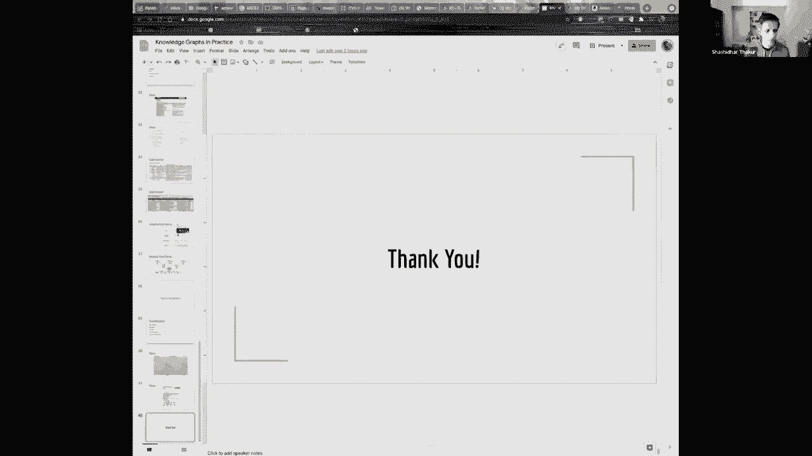
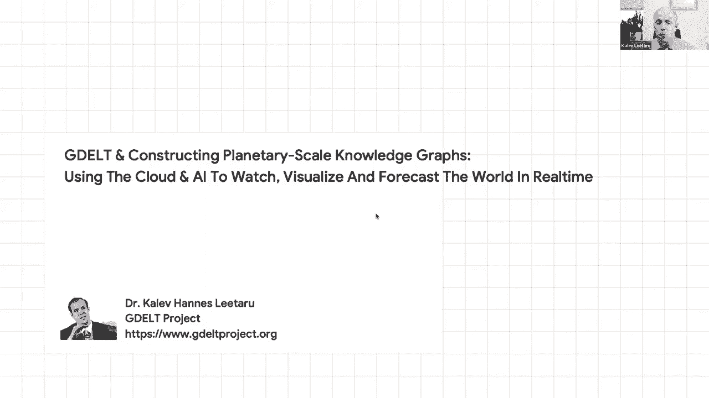
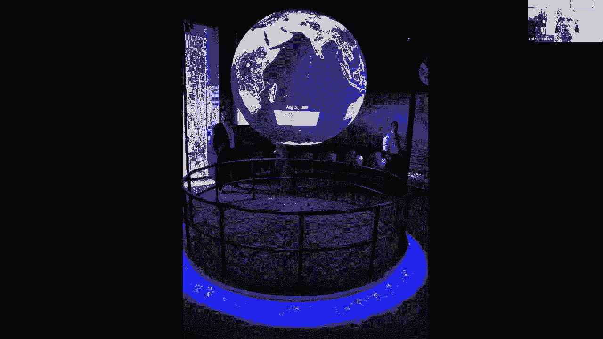

# 【双语字幕+资料下载】斯坦福CS520 ｜ 知识图谱(2021最新·全20讲) - P28：L17.1- 知识图谱工业实践应用 - ShowMeAI - BV1hb4y1r7fF

欢迎来到今天的知识图研讨会，我们在课程的第九周我们的主题是，知识图有哪些高价值用例，我们很幸运有，两位非凡的演讲者，Shaita Talker和Caleb Liaro Shashi在谷歌。

他就是那个开始，他是发起这场运动的绅士之一，所有的首字母，谷歌发布的知识工艺宣传视频，呃，我当然在那里面，他向世界其他地方解释这些知识图是什么，所以我们很幸运他能和我们在一起，然后呃。

Caleb是一个非常有影响力和精力充沛的人，他一直在单枪匹马地运行这个名为GTA的非常令人兴奋的项目，他在计算机科学之外产生了很大的影响，所以我对今天的会议真的很兴奋，这将是嗯。

对我来说真的很有教育意义，也是为了上课，我敢肯定，所以我们将从沙希开始，沙希30分钟凯拉30分钟，最后我们再讨论，如果你想分享你的东西，是呀，我来吧，这对你来说意味着什么，是啊，是啊，它确实出现了。

但它有点小，我不知道它为什么这么小，那是吗，然后它，是呀，是呀，好的，所以希望这样更好，是呀，好的，好的，好的，伟大，所以让我们开始吧，呃，谢谢你的介绍，我知道你们都听过很多关于知识图的技术细节。

你在里面，来谈谈亚马逊是如何构建知识图的，通过Web规模技术等，所以我将在这里更多地关注产品方面，比如知识图是什么，并在实践中，我当然来自我的谷歌经验，我会谈论我洒在里面的那些东西，一些技术问题。

这样你就可以把技术问题和产品问题联系起来，这样你就能感受到全世界的知识是如何在实践中发生的，在大规模系统中，所以你有上下文，我的大部分工作都集中在搜索上，并在搜索中带来结构化的知识体验。

但作为技术方面的一部分，构建表示，构建跨越搜索的知识图，本地地理，购物媒体，在我看来的各种事情，所以我会从那次经历中走出来，所以我开始，我们将讨论一些知识图的上下文，顺便说一句，我会用公斤。

某种简短的形式，呃，希望各位这是标准术语，所以kg的上下文是启用的，从产品的角度来看，还有呃，呃，理解的观点，我们会谈谈的，嗯，需要什么规模，这些事情在实践中和一些实际的考虑，我们会好好谈谈的。

所以让我们从上下文开始，就在我们开始知识图的时候，我认为大多数研究都是这样，大多数产品都是在知识图上工作的，人们开始说嘿，让我们来看看世界上所有的知识，让我们建立一个它的存储库。

让我们建立一个它的存储库，在图书馆的意义上，但这里有更多，呃，具体原则，对呀，如果人类的知识学到了什么，那我们就不用再学了，我们应该能把它编码，呃，我们应该能够强制执行一些事情。

我们将更多地讨论从我们所学到的可以推断出什么，所以我们应该可以分享它，我们应该可以谈论它，我们应该可以查询它，所以这就是松散的原则，你看到的著名的亚历山大的照片，亚历山大图书馆，这是一个愿景。

我们开始建立一个结构化的亚历山大图书馆，捕捉人类的学习，当然，首先我要说，我们谁也没有任何幻想，认为一切都可以用知识来捕捉，也许一切都可以结构化，当然啦，人类有各种各样的东西，呃创造了，在知识方面。

不能结构化的，我们知道呃，以下是激励我们的具体例子，安吉拉·默克尔应该在查理，查普曼和电影应该是，我应该在这里，基本原则是，它不仅仅是工厂的集合，它应该用机器来表示，可读的形式在比例和推断应该是可能的。

然后你比较一下，显而易见的联系是更好地等待，我们不是有整个网络，其中包含数万亿，基本上是人类知识为所有实际目的或视频所写的一切，因此，在结构化知识和广泛开放的网络之间进行对比的方法，结构化知识更离散。

而出现在网络上的散文形式更连续，对呀，它没有那么多的限制，但结构化知识是对它的约束，嗯，优点和文本通常非常依赖于上下文，而结构化知识一般倾向于与上下文无关，然后您可以在使用上下文时从中得出推论，然后呃。

它被非常期望是非常客观和普遍的，一路走来，呃，我们将讨论一些角落的案例，在这些案例中，它可能不像一件事那样普遍，总的来说，你对这些事情做得很好，文本知识和关于同一主题的非常主观的东西。

你可能会在不同的html页面上写下四分之四的意见，对于非结构化知识来说，这一切都很好，所以让我们跳入一些，呃，让我们首先从产品的角度来处理这个问题，让我们来谈谈，好的，想象一下。

你必须建立一个结构化的知识图，你能用它做什么，我会从谷歌搜索的角度再次探讨这个问题，不同的搜索引擎在过去的一段时间里开发了类似的技术，所以这是第一件事，这是一个重要的考虑因素，想象一下。

想象一下一个用户查询了，这个周末圣何塞有什么活动，想象一下，这是多年前的演讲，当然那时你们有音乐会，当时市中心有一场Lady Gaga音乐会，在旧金山，所以你可以想象，呃。

以某种方式增加的事件的结构化列表，嗯，特别是有一个Lady Gaga的概念，你会受到启发，你可以说，好的，我想听lady gaga的这首歌，我想看她最新的电影。然后从那里你很快就分开了。

然后其他需要接管，就像好的，当它是万圣节，这是十月，当它是万圣节，我需要弄清楚，呃，然后其他团队，他们在哪里玩，依此类推，诸如此类对吧，所以当你查看搜索查询时，你看着一个会话，也许你看了几天的会议。

很多知识领域，好的，你只能专注于事件，并已经完成了，当你谈论事件时，你有Lady Gaga和Lady Gaga作为电影和歌曲，所以知识领域是联系在一起的，那是，这是这张幻灯片的主要收获，一旦你开始。

好的，知识领域是相互联系的，那么您想要什么样的产品呢？所以确切的会议，我已经用截图映射了它，在左边，这是关于Lady Gaga的更百科全书式的东西，然后从那里你可以进入，好的，什么是，呃。

附近有什么活动，和Lady Gaga或者呃，呃，呃，Lady Gaga主演的电影，然后你跳进一部电影，关于这部电影的信息，它在哪里播放，这家电影院里有什么餐馆，或者你沿着事件的路径，有什么活动。

这个特殊的事件在哪里，告诉我更多关于体育场或剧院的事情，这个事件又在哪里，这表明知识领域是相互联系的，并创造良好的用户体验，您必须能够对连接性进行编码，以便，你可以创造这些体验。

然后这就像是一张非常高级的知识图，与实体和实体之间的联系，它创造了这些交叉域，我想说的另一点是，这不仅仅是从谷歌的角度搜索它，呃，你有跨表面的经验，就像你看Lady Gaga的事件一样，在一个表面上。

喜欢搜索，你想知道滑冰者在哪里进入地图，你想看电影吗，你可以把它放在电视上或任何其他显示设备上，呃，你想用同样的东西听一首歌，所以再一次，它是用户跨越知识领域的整个旅程的体验，也有不同的表面。

我特别想说出来，我真的很自豪，呃，呃，这项令人惊讶的工作，当你有一个伟大的知识代表，我可以拍一张iPhone塔的照片，然后说，这是什么，通过各种中间推理和训练，呃，视觉模型。

它可以将视觉映射到知识结构中，你可以说，哦，这是正确的，或者你可以指着一个，呃，在在在一张海报上，一张电影海报，并提供关于电影的信息等等，所以各种神奇的体验都得以实现，因为你们绑在一起。

中间的结构化知识，以及世界上各种各样的非结构化知识，就像他，这些文件是，呃，那些可能是，那些应该是视频，或者这些可能是图片，然后砰的一声，你会得到像这样有趣的东西。

所以让我们仔细看看这些产品背后的一些东西，所以第一组事情，对不起，不是建造它背后的原因，但是让我们仔细看看一些子功能，所以我要调用的子功能之一就是信息，问题是告诉我关于沙尚克救赎的电影，对。

用户在这样的电影周围有很多子实体，他们可能想知道谁在里面扮演角色，给我看看它的照片，给我看预告片，我在哪里看，是在剧院里吗，评论是什么，诸如此类，对呀，你把不同的知识拼凑在一起。

你可以创建一个关于沙沙保留的总结视图，或者类似的Pascal是一家餐馆，它是一种产品，所以第一件事是，呃，一个汇总视图，它将来自不同来源的信息排列在一起，并创建如下所示的摘要视图。

使用谷歌助手和语音界面，我认为语音界面是次要的，我只是想说明交叉表面的体验，我可以问关于储蓄的问题，而不是现在总结，我在问谁在《肖申克的救赎》和《繁荣》中扮演安迪，就像通过各种语言理解和映射到知识。

你得到了，你可以说，城堡餐厅什么时候开门，或者你可以问一下这台佳能打印机的规格，所以你可以做Q非结构化知识，呃，对我来说真正有趣的是什么，又是令人惊讶的联系部分，这就是所显示的，呃，在这张幻灯片上。

就是勘探和推荐，对用户来说，理解百科全书不仅仅是有趣的，如果你可以提供关于海岸线赎回的信息并采取一些行动，比如去看或者去买张电影票，这里和这里有什么相似的东西，结构化的。

一个世界的示意图可以让你建立一些令人愉快的联系，你可以从那部电影到漫威电影，男人，电影或电影，呃，他们的故事是由Stefan R写的如此相似，来自阿斯卡尔，到其他西班牙餐馆，或者夫妻，餐馆等等。

或其他打印机，所以对我来说，这是另一件事，以及，所以让我们从产品转向技术，让我们了解至少几个构建块，构建这样的产品有很多很多的构建块，让我们来了解几个积木，所以首先，您需要了解用户查询是关于什么的。

然后结构是如何，理解与知识图与理解中的语言，所以假设您的任务是一个用户将发出一个查询，比如给我看看书房里的歌，因为研究中的歌曲与音轨结合在一起，你的工作就是在过去的三周内通过测试。

你说明星配乐中的歌曲诞生了，它故意在外面大胆，就像我在用大胆的术语说，这些是结构化的量，但是歌曲的概念，声音的概念，A星作为一个实体诞生，我们不知何故认识到了这一点，我们代表了这一点。

你可以把这看作是一个翻译问题，从自然语言文本到其他更严格的文本，表示自然语言文本意义的更结构化的形式，这是一个翻译问题，所以你可以把它想象成编码器，解码器框架，使用的问题，所以想象一下你有一堆莱恩，呃。

像这样的例子，呃，有人给这些问题贴上了标签，说它们实际上都是同一件事，也就是电影配乐中的歌曲，对与不同的电影，不同的表面形式，也许甚至不同的语言都被标记为，通常您构建，呃在一个。

如果你用神经网络来解决这类问题，您再次构建编码器解码器体系结构，非常类似于翻译机器翻译，你说我要训练一个机器学习模型，它翻译了现在用特定电影抽象出来的表面形式，意识到已经取代了，在雨中唱歌什么的。

我只是用它作为某种权利的象征，但是电影，有些，所以我想把所有这些曲面形式转换成部分表示，对呀，所以这就成了一个标准的训练问题，现在当我得到一个新的查询，也许Start是今天刚刚发布的一个，对，没有人。

从来没有人问过关于那部电影的问题，在我能够解析它之前，因为我知道我可以在Star上做命名实体识别，呃认识到作为一个特定的实体，碰巧是一部电影，然后我可以应用这个模型说，好的。

我可以用不同的电影名字以不同的表面形式通过这个，也许用不同的语言，但我可以把它翻译成同样的，呃，理解规范理解表示，这是深刻理解的一个例子，结构化表示和KGS可以实现的，在它的最后，你可以吐出答案。

这就是名字，这部电影里的歌，我想再次使用的另一个接地表示的例子，导致某种理解，但首先我们谈谈语言，让我们来谈谈用户，我们如何理解用户偏好，例如，对所以，所以呃，现在，首先，您可能想要对许多事情进行建模。

您可能想要对角色的兴趣进行建模，或者呃，呃，比如这个用户关心的服务，因此，您已经跨越了许多不同的知识领域来建模这个用户，想象一下，你的输出必须是这种形式的向量，对呀，也就是。

这里有一堆这个用户感兴趣的主题或实体，并有一些休息时间，然后查看用户的所有活动，输出是一个过程形式，这就像是兴趣的低维表示，它看起来有点像这样，你可以把它投射到知识图中，好吧，首先你需要名字。

名称和实体识别，以便从用户活动中了解，这是用户感兴趣的向量，现在你把这个投射到知识图上，您可以将所有这些分层，你可以说《绝命毒师》是一部电影或娱乐，勇士、湖人或运动队，等等，诸如此类。

所以你可以把这些分成层次形式，这又是，呃，分类法可以让你做，现在你可以开始对此施加影响了，下面是一个基于推理的协作过滤示例，就是嘿，这个用户对中断感兴趣，也许他们对更好的电话感兴趣，也就是说如果你。

如果你，如果你还记得我展示的幻灯片，呃，有关实体和勘探的报告，其他电影，类似于肖申克的救赎，这是一个非常相似的问题，你拿着绝命毒师说，好的，机会有多大，用户对更好的感兴趣。

你把所有的线索放在一起进行合作，或者你可以带着团队，这个用户感兴趣并说，哦，这个用户可能对恐惧症品牌感兴趣，或者他们对这些政客感兴趣，也许他们对更有趣的感兴趣，他也碰巧是同一年的总统候选人，如此粗略地。

这是协作过滤如何工作的一个非常高级的视图，你知道这两个实体，您知道如何在文本上注释它们，并进行命名实体识别，从知识图中你知道，这两个人在这两个节目中都有表演或导演的角色，现在你看到一条短信。

就在这种情况下，我从维基百科上挑选的，你的一篇文章提到了所有这些人和这些电影，然后你创建一个协会说嘿，如果有人对一个感兴趣，有一定的机会，他们对另一个感兴趣，然后你从人们谈论它的方式中挑选这些线索。

人们是怎么写的，人们是如何应对事情的，然后你做协同过滤说，好的，对一个感兴趣的人可能对另一个感兴趣，因此，文本理解和结构化表示的结合，那么这就是这两种理解形式的混合体，然后你就可以，您可以创建推荐。

因为您还可以将用户的兴趣上下文化，只是呃，下面是两个不同用户的示例，他们似乎都对迈阿密感兴趣，因为他们做了同样的事情，对迈阿密的查询，他们读到迈阿密，但你看看他们阅读或观看视频的背景。

或者关于迈阿密的任何事情，非常不同，对呀，其中一个，呃，他们对新闻更感兴趣，呃，也许他们对迈阿密的投资者感兴趣，嗯，第二个好像是本地人，他们是，他们对当地的报纸很感兴趣，他们对搭档感兴趣。

市场和送货之类的，因此，围绕某人对实体的兴趣的细微差别和背景是很重要的，所以实体最终是肤浅的，作为，当你谈论兴趣和上下文问题时，但又在，上下文也可以从用户的活动中提取出来，我只是举了几个其他的例子。

喜欢好的，对Netflix感兴趣的人可能会再次对它感兴趣，从投资的角度来看，不是网飞的电影，但很好，所以那个例子，所以向前跳，然后呢，所以我们讨论了什么是产品，我们讨论了一些构建块技术。

你必须在原始知识的基础上构建这些产品，让我们在这里讨论一下缩放，这让你对我们处理的技能有了一种感觉，所以常识就像，我包括电影和音乐，你所说的人有五亿个实体和五千亿个联系，对呀。

可以为实体连接提供100个连接，事实，就像人与人之间联系的高度可能是在一个实体和另一个实体之间，像配偶一样支持，呃，但是总共有五亿个连接，对呀，你可以把它们大致想象成，在我们探索世界地图的过程中。

我不是，呃这里，我只是在粗略地使用商业，比如餐馆，旅馆，纪念碑，呃喜欢的兴趣点，我甚至没有计算我们绘制的每条街道上的每一个点，这甚至不包括在这里，但即使那样，你又在说像，少量的就在那里。

我们必须绘制世界上的商业地图，然后购物，如果你看看，呃，我们正在处理的数据类型，数百亿个实体，对呀，跨越不同商家的报价，提供这些产品的产品，所代表的品牌，等等，以此类推对，他们在谈论数百亿实体的订单。

你说的是，让我们说，当你把所有这些放在一起时，命令数万亿的连接，这就是您在构建这些应用程序时所谈论的规模，那么你怎么做对呢，你从哪里得到的第一个问题是，呃，你从哪里得到这些信息的。

你从哪里得到这些知识的，我列出了一个子集，无论如何，这还不是全部，但我们可以从多个来源获得这些知识，就从呃，呃，我们购买的数据源，有聚合器在辛迪加这些数据，所以我们把这个预算作为一个例子来汇总。

或者人们用模式注释网页的模式，不同形式提取的V，我甚至不是在这里谈论我们在世界各地行驶的汽车，试图从本质上爬行世界并理解其中的结构，呃，策展，你可以想象，当你说到，呃，呃，百亿实体。

数万亿的连接只会带你走这么远，但我想说的一件事是，不要低估策展的价值，真的打磨了这里的一些边缘，所以它很有价值，我不打算谈论所有这些，但只是为了给你一个感觉，对呀，呃，让我们来谈谈。

我将谈谈几种不同的机制，这里一个是模式，所以有，呃，呃，呃，模式点，一切都是跨公司行业的发起者，这基本上使呃，人们可以叠加在非结构化内容之上的结构，例如html文档，举个例子。

想象一下你有一个来自LinkedIn或其他网站的招聘启事，呃，通常是带有很多x的html，其中的结构可以使用，呃，嵌入式标记，这是嵌入Marko的模式，在这里，我将向您展示一个职位的具体示例。

我从一个网站上拿出来的，它是一个WordPress开发人员，呃，这是上一张幻灯片上模式的实例，那么组织是谁，薪水是多少？这份工作在哪里，呃，这份工作的内容是什么？有效期是多少？作业的范围、日期范围等。

是全职吗，是兼职吗，所有这些都编码在这里，Web开发人员所说的是，并使这种结构化编码可用于搜索引擎或其他索引引擎，创建允许那些，所以说，所以这是一个例子，当然，不同领域有数百种模式，一次又一次。

这是一项跨行业的倡议，许多公司使用这些模式，呃嵌入网页，呃布景，呃，我说的另一个缩放知识的例子是提取，所以这里有一张桌子，这是维基百科页面上的一张表格，讲述了各种木制过山车，对呀，你如何理解这个权利。

以及如何提取结构化知识，这里和这里有点像是一个非常抽象的观点，你坐同一张桌子，你已经完成了命名实体识别，斜杠和斜杠是规范ID，对于知识图中的一个实体，所以你会看到一堆斜线和斜线，无论你有什么。

其中一个意味着你认出了实体，你意识到左边粉红色的两个实体，那些我们不认识的，几乎所有的东西都没有认识到，这是理解姓名识别的第一个层次，但也有暗示，例如，避雷针之旅在好莱坞公园，它碰巧在美国。

以给定的速度运行，所以骑行意味着，部分暗示国家，所以你对空间的理解有一个等级制度，然后所有这些都可以作为一个分层指令提取出来，作为一个例子，那个呃，最后一部分我将指出如何大规模地创造这种知识。

在这里跨源创作，您并不是要从模式中获得所有内容，否则你不会把所有的东西都从提取中取出来，或从购买来源，这里有一个例子，这是一部电影，甚至在这里构建信息面板，你从演播室得到预告片视频链接。

许多流媒体提供商有办法将迪士尼视为一个，呃，也许在这种情况下，这是唯一一个，但总的来说，它可能是多个网络标记了这部电影的评论，维基百科作为描述，你把所有这些都涂在一起，创建一个全面的表示。

您创建这个全面表示的方式是，这是一种抽象的展示，想象一下你有人们的数据源，和另一个数据源，井的另一组数据源，他们没有再被孤立，我在这次演讲中说的第一件事，人们与电影联系在一起，电影与公司有联系。

公司是有联系的，他们这样说，这样说，你从一个来源获得的关于人的知识实际上可能包含对电影的引用，所以你需要把它们联系在一起，一个叫做重新考虑的过程，当你和解，你把所有这些知识组合在一起。

你得到一个作曲家图，这是你可以从这个产品开始的最后一个，呃，作为最后一分钟的最后一个，我将介绍的是你工作中的一些有趣的事情，当您尝试构建这些可伸缩的应用程序时，非结构化知识。

我刚刚提到了几个实际考虑因素，正如我之前所说的，不要低估手工操作的价值，不是所有的东西都可以是算法或自动的，呃，学习这个在一段时间内学习这个，当然，数据标签可以训练你的机器学习模型，你需要。

你需要某种形状或形式的人类评估，你在度量方面做得有多好，目标度量管理，我们谈到了早期的来源，什么都没有，所以你有你的规范观点，我们有我们内部的规范模式，源可能有不同的模式，然后我们购买一个提要。

我们从他们页面上标记的模式中提取出来，它们有一个不同的源模式，因此，必须有人对所需的目标模式进行映射和规范化，你需要，人类是一个很好的方法来大规模地做到这一点，所以这些都是手动操作非常可变的例子。

在实践中，你必须处理的另一件棘手的事情是政策，记住，最初，我说，结构化知识是普遍的，但并不完全如此，这里有一个例子，印度地图，如果你从印度查询，相对于，你看起来不一样，因为有争议地区。

不同的司法管辖区都有当地的政策，说你不能，或者你可以这样展示东西，没有普遍真理，因此有争议，所以你不遵守规模产品，你遵守当地的政策，所以你本质上需要生长的变体，呃能够支持这些产品。

你需要政策的原因非常不同，所以这里有一个真正的例子，它在媒体上长大，呃，我们一度做了一些提取，然后呃，当然，在关键页面上有一些破坏，我们很快就把它捡起来了，维基百科去修复了破坏行为，但在短暂的时间里。

我们坚持了这一点，你可以想象，这太尴尬了，这显然不是不是很棒，对用户来说是一个很好的体验，但你需要政策来处理这样的情况，你什么时候可以把网上的事实拿出来，比如说，这就是我准备的材料，谢谢！

我知道我们会回到你身边，期待着以后有更多的谈话，哦，谢谢沙希，呃，迦勒，下一个是你，非常好，我可以分享我的屏幕吗，是啊，是啊，你将不得不停止分享，是呀，我来吧，我只是想知道，这阻止了它吗，呃，否。

它仍然说有人在分享，好的，让我，让我离开然后回来。

因为这不允许我开始，好的，好的，所有的权利。

所有的权利，伟大，你能看到吗，是呀，是呀，我们可以很好地，所有的权利。

我要和你谈的是，所以GDL项目是一个开放的数据项目。

就是这种收集世界信息的想法，并试图将世界上的事件编目。

