# P29：L17.2- 工业大规模知识图谱：实时观察与预估 - ShowMeAI - BV1hb4y1r7fF

情绪，呃，实时图像和跨文本查看，它仍然是图像，口语，音频和视频，基本上是用这些，这些基本上是实时地拍摄地球上的一些消防水管，实际上生成了一个关于地球周围发生的事情的开放数据目录。

这实际上是一个真实的图像，顺便说一句，实际上没有科学领域，上面有我的数据集。

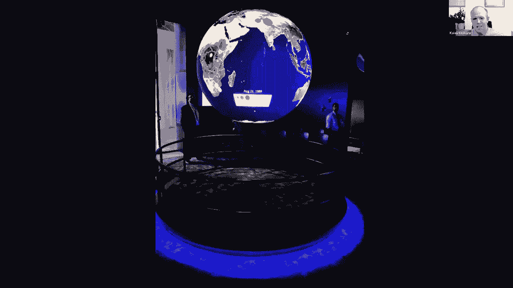

嗯所以所以本质上，我们从新闻开始，所以Geno项目实际上是关于新闻的，因为新闻真的是那种，社会的实时目录，它也可以穿越时间，所以它让我们了解这里发生了什么，现在是不寻常的，比如说，如果我们看它，嗯。

所以我们从新的开始。

所以本质上，嗯，这实际上是一个图像，嗯，吉尔监视的所有地点，呃，关于过去X年的事件或事情，有趣的是我们通常看到这样的地图，我们说哇，你知道那看起来很有趣，但令人着迷的是，你知道吗，又是细节新闻。

我们试图从不同的星球上，我们想获得地球上的局部视角，这意味着我们必须理解世界上的语言，多语种的作品非常非常困难，这又一次只是触及新闻的表面，但就数字访问的新闻而言，不管是通过广播，呃。

不管是通过网络还是什么，或者嗯，这构成了，九十七点的那种，到九十九点的东西，一个百分比范围，嗯，我们为我们生活的152种语言所做的翻译，其中65个，所以我们在这65种语言中观察到的一切，我们实时翻译。

这是真的因为在2014年之后，埃博拉病毒爆发我们实际上是从一个广播合作伙伴那里收到的，实际上，呃，几内亚森林地区的无线电广播，他们是用法语写的，虽然，所以我们在那个时期无法在规模上翻译，嗯和所以呃。

我们现在实际上翻译技能，这变得有趣，实际上在加拿大蓝点有一家公司，它实际上发出了第一批全球范围内的Covid警报之一，十九大流行病，我们的数据显示它是在12月30日。嗯，你知道他们让他们的人通过验证。

验证，看东西，然后在12月31日，把它发出去，再发出去，当时没有人在关注武汉的力量，嗯，你知道吗，看本地语言媒体，寻找重大疾病爆发，所以再一次，机器翻译的力量，嗯，这样我们就可以放眼世界。

这对我们来说真的很重要，当世界各地的某个地方发生了一些事情，我们希望能够看到当地对那里发生的事情的报道，但也再次，取决于这是否是一个有争议的情况，也许这是一个专制的国家，我们希望能够，你知道的，收集。

你知道的，对那里发生的事情进行三角定位，但看看世界对此的反应，所以我们想，我们想从本质上消除语言作为障碍，能够看到世界各地的当地观点，嗯，所以这增加了额外的复杂性，我们有大量的机器翻译，嗯，比如这里。

嗯，这其实说明了翻译的重要性，这里是也门，你可以看到蓝色，也门的位置在内战期间被讨论吗，用英语读还是用阿拉伯语读，再按一次，真正证明了跨语言查看的重要性。

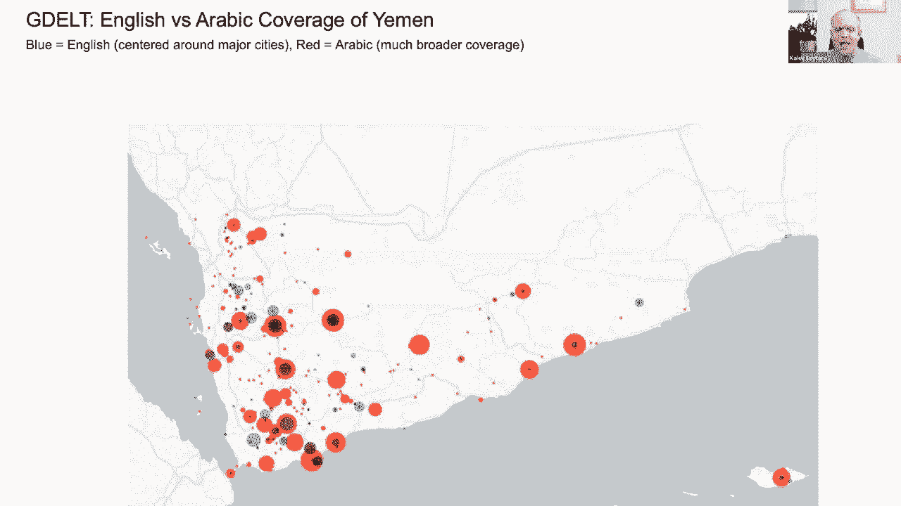

我会回来的，我马上就要上知识图表课程了，我只是想谈谈GDL的一些使用方式，所以再一次，乔所做的是，基本上，我们有消防水管的消息进来，我们用机器翻译65种语言，但我们那里有152种语言，嗯。

与互联网档案馆合作，我们有电视和收音机，嗯，我们你知道，做我们自己的网站，我们有所有这些材料进来，我们创建了一大堆不同的数据集，试图从社会上，试图实时编目社会，嗯。

所以我们有事件数据集试图观察世界各地的物理事件，嗯所以那是呃，基本上像BBVA这样的团体，用那个，嗯，实时绘制，像难民的流入和流出，我们可以看叙事，所以简单地看共同发生的事情，你知道，一旦我们知道。

这里有每一个参考文献要说，嗯，你知道吗，乔·拜登，这里有所有关于弗拉基米尔·普京的资料，这些共同发生的频率有多高，它们在什么背景下同时发生，是消极的还是积极的情绪，是焦虑情绪，是对未来的恐惧情绪。

每个连接的不同维度是什么，然后我们可以抽象那些，在更大的尺度上做这样的可视化，实际上有兴趣，所以谷歌有一个叫做BigQuery的东西，这是他们的一个大型数据库平台，我们实际上已经建立了CO。

BigQuery中超过万亿条边的出现图，但对我来说，这实际上是最重要的事情之一，你知道我们已经到了你知道的地步，我来自NSF超级计算世界，所以你知道我曾经，你知道的，用地图工作。

我是使用每台新机器的友好用户之一，把他们推向了极限，嗯，但你知道，在高性能计算机的世界里，你是负责试图，你知道试着做图形分析，这个秤对我来说，云的神奇之处之一，我们已经到了像BigQuery这样的地步。

它不是为了图形数据库而设计的，嗯，我可以加载，我基本上可以拿一个数据集，在此基础上构造一个图，然后基本上建立火车边缘图，向下折叠并输出，实际上是一个文件，实际上在这种情况下。

可视化geffy或graph是，嗯，所以再次，只是简单的事情，比如共现图，这里实际上是CCS，你可以看到里面提到的所有人都在那些。

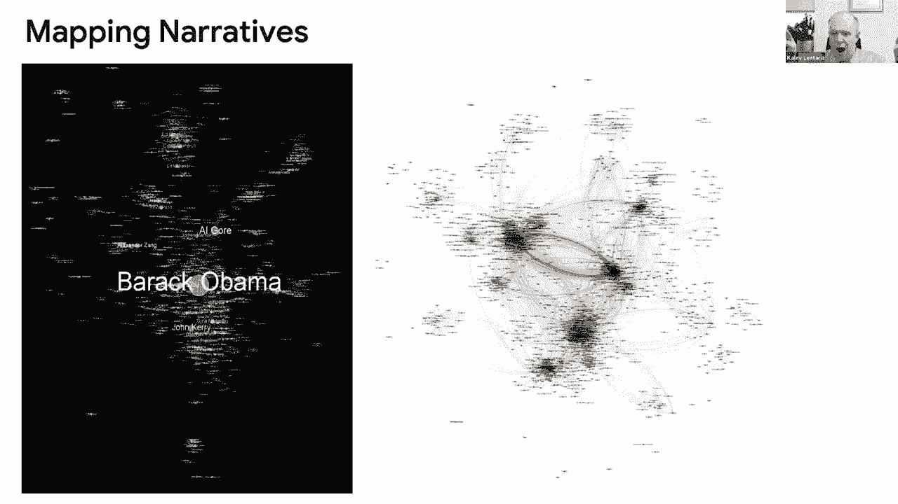

其实所有的记者都在那里，我们可以做地图之类的事情，喜欢地图，全球幸福，透过媒体的镜头，所以这不是你知道的，某个地区的人是快乐还是悲伤，这是如果你拿什么世界，就像巴黎一样，法国巴黎，嗯，在某一天看。

我们在世界各地的新闻报道是什么，说巴黎，他们的形象是好是坏，嗯，这变得非常强大，就思考而言，你知道吗，有点情绪化，就像世界各地的事物是如何被框定的，我们现在可以，铸造与预测，你知道吗，思考一些事件，嗯。

你知道吗，我们真正要去的地方，然后是数据集，所以你知道本质上是开放数据集的巨大集合，我们有一个事件数据集，我们有我们的主要全球知识图，我会来，我们有视觉知识图，我们有各种各样不同的数据集。

实际上我忘了在这里添加的两个数据集，嗯那么嗯，就像它一样，你知道的，前面提到的模式组织，所以我们确实有一个数据集，我们监控的世界各地的每一篇新闻文章，我们扫描它的任何元，文章中嵌入的任何html元标记。

我们把那些提取出来，以及其中的任何模式组织块，今天真的很有趣，因为现代新闻网站会有一个模式组织块，将页面描述为一个整体，也许新闻文章，每个嵌入的部分，如视频或图像，通常会有自己的模式点组织来描述它，嗯。

你最终也真的很有趣，你知道吗，当你试图处理这种材料时，你知道模式组织，你知道他们在那里，这是一个，这是一个，我是说，这是一个，这是一个定义良好的模式，你知道，比如说，上面写着这篇文章，此字段应为数字。

呃，或者此字段应该是日期，你在现实生活中得到的东西真的很有趣，所以我们实际上做了很多工作，你知道在我们的博客上描述，大家可以看到，所以我们实际上提取，那个架构组织，所以你可以直接处理。

我们现在也有一个数字图，嗯，我没有，我忘了在这里加，在那里我们提取出这152种语言中对数字的任何引用，所以一篇新闻文章，例如缅甸语，他们有兴趣看，嗯，你知道有多少，呃，你可以扫描缅甸语出版社。

实际上把所有这些数字都拿出来，这变得非常有趣，假设你有地面知识，你可以用这些数据来实际观察，嗯，你知道它有多大，你知道当地媒体，形容它是，地区性媒体呢，所以你可以看看这些差异，我知道有多少人在场。

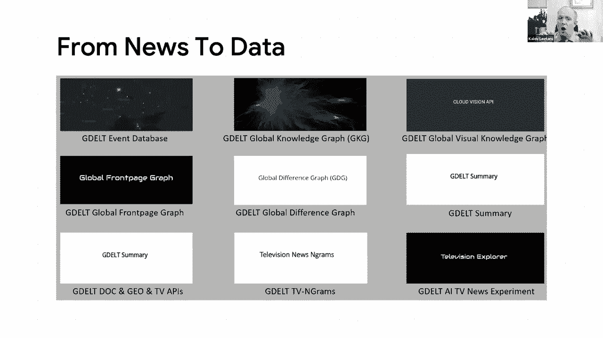

嗯，其他媒体描述它有多大，所以再一次，这些非常迷人的表现方式。

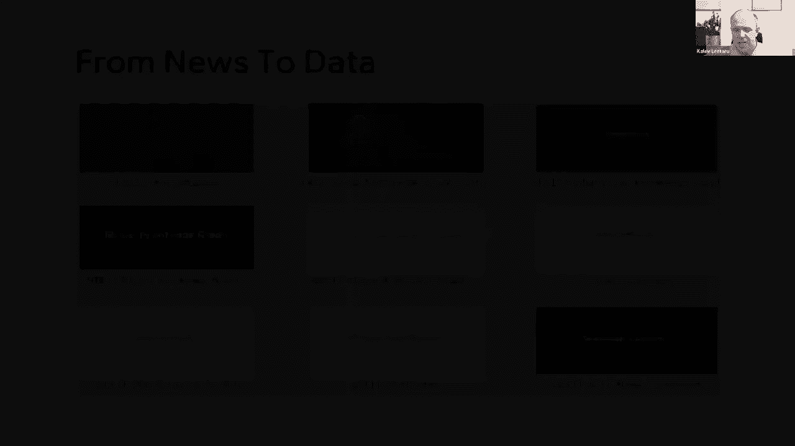

所以GL是一个开放的数据集，完全生活在谷歌云中的一系列数据集，尤其是在右下角，我们使用了所有不同的GCP。

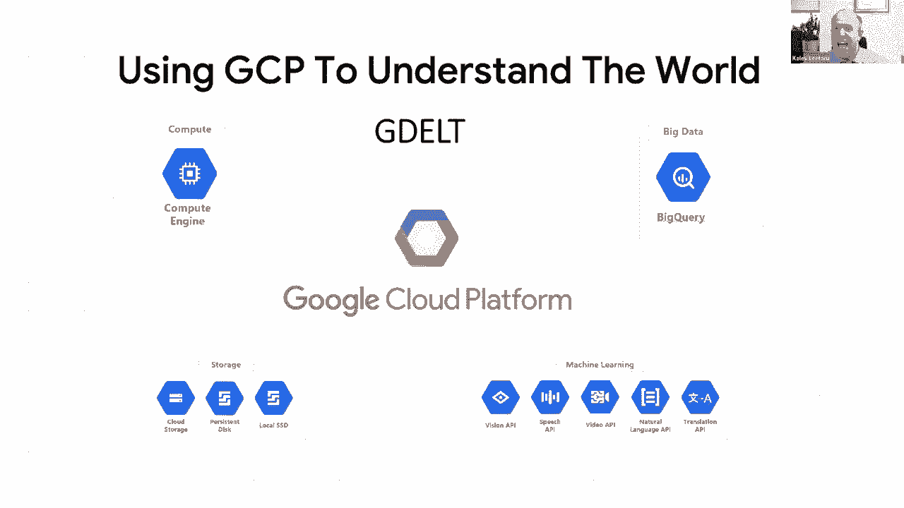

我试着浏览所有这些新闻，并尝试以不同的方式对其进行编目。

嗯，所以一个是文本，当我们想到纳瓦格拉斯的时候，我们想到编码草，你知道就像，比如说，某某的父母是某某，或者你知道某某人乔·拜登是美国总统，我们看到的一件事，我们实际上把图看得更宽泛一点，嗯。

所以我们的一个数据集是引号图，所以我们扫描每一篇新闻文章，寻找文章中出现的任何引用声明，然后我们提取，所以我们会说这里有一篇你知道的文章，CNN今天的文章包括了这三个声明，说，福奇博士，嗯。

所以我们把它们看作节点，那些引号是节点，嗯，一次又一次，不同的部分，然后我们有它发生的背景，所以我们有它的扬声器，我们有发生在，所以这个人，你知道的，谴责，说着，看看这个可怕的声明，这个人做的还是哇。

这个人真的很懂事情，嗯，所以当我们开始把一切都看作一个图表时，这真的很快，变得非常强大，我们认为这种能力，你知道把语句与人和地方联系起来，你知道在哪里发布的声明，是国家颁发的。

所以你有一个人在一个地方发表声明，也许是个会议，呃，可能是参考了其他地方，所以再一次。

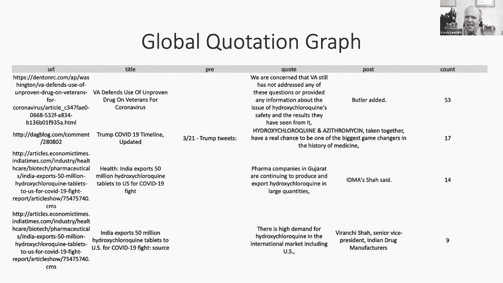

这变得非常迷人，我们思考所有存在于其中的隐藏联系，我们有这样的东西。

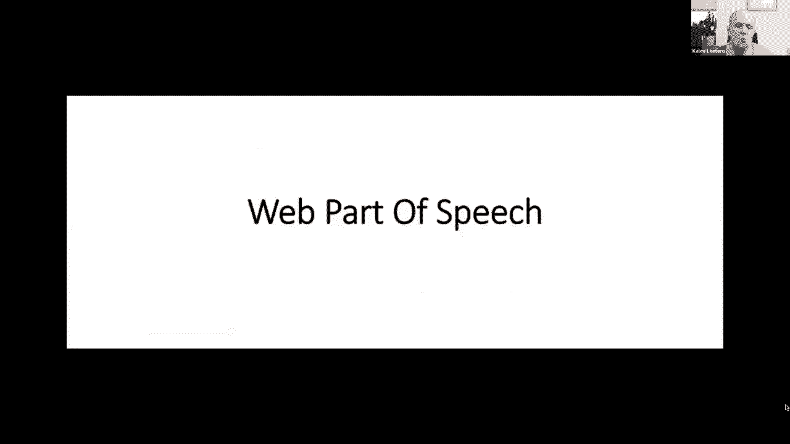

比如说，我们每天通过谷歌的自然语言API对这些文章进行随机抽样，所以这做了很多事情，比如说，依赖项解析提取，他们现在支持的11种语言的所有实体，各实体，每个实体都被编码在谷歌知识图中。

我知道早些时候有一个关于，那里的代码，嗯，所以就像你知道的那样，至少从我们再次看到的，你确实有传统的，你知道传统的身份代码，但你做谷歌本身，你会注意到你会看到一个斜杠，哪个更多的是，你知道自由基。

其他代码就像斜杠G，更像是谷歌创建的代码，它实际上真的很迷人，因为，比如说，当巴黎圣母院火灾发生在火灾发生后的一个小时左右，现在有了一个新的代码，法国巴黎圣母院大火，所以现在那个实体。

您实际上看到的任何描述作为该事件的唯一标识符，这变得非常强大，所以我们的一件事是我们从中提取出所有的实体，也是所有的词类，你可以做各种各样的禁食事情。

你知道在这种情况下动词和名词联系在一起的频率有多高吗，相反，这是一种进化，所以我们和语言学家合作了很多，嗯，去真正理解，所以上下文，如果你再想想，语言作为，作为一个图形，关于某些词出现的角色，比如说。

影响不是动词，它现在被用作动词，所以你知道事情是如何随着时间的推移而变化的，我们可以看看，比如说，你知道，看一下，基本上代表了，你知道所有这些所有这些文件。

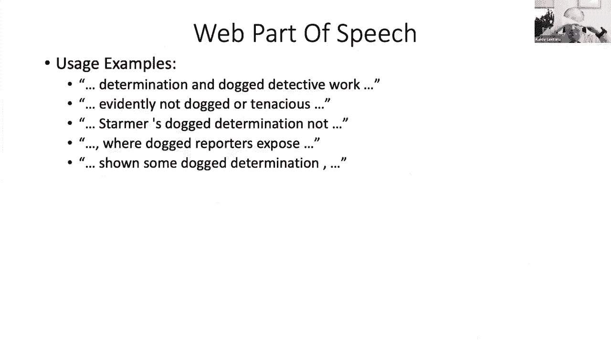

海量图，看看单词的作用，我们有我们的全球知识图。

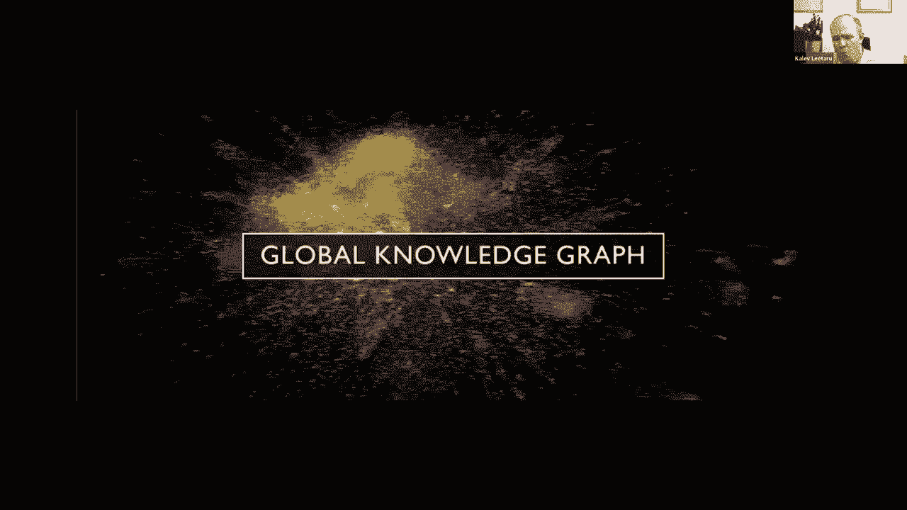

我们的全球知识图是我们的核心数据集之一，所以本质上我们所做的，我们把人抽出来，组织，地点，嗯，大约两百万左右的话题，大约四千种情绪和情绪真的很有趣，因为你对这些图表的看法，你知道如果我说你知道。

福奇博士在这里发表了这样的声明，嗯，你知道那是代表，那是不，你知道这是一个链接，但我可以告诉你，比如说，讨论那句话的文章是什么语气的，所以你知道这句话是复制了一篇文章吗，这是一种谴责。

一篇文章与一篇非常赞美或赞扬的文章，所以再一次，不仅能够建立联系，但确定这些链接的上下文，以及这种联系是如何随着时间的推移而变化的，比如说，这变得非常非常强大，嗯，我们有一个不同的图表，这很有趣。

我们抓取的每一篇新闻文章，我们爬过去，在24小时和一周后我把所有的变化都列在目录里，这样你就可以看到，你知道的，想想新闻，不仅仅是源源不断的信息，但你知道新闻文章正在被悄悄地改写，已删除。

一个政府不喜欢一篇批评它的文章，所以它被移除，所以即使想到那丰富的风景，我们不是在想，你知道吗，想想新闻，这不仅仅是一个附加物，只有消防水龙带，穿越时间前进，我们在前进，但是文章正在消失。

它们正在被大规模重写，变化，所以如果我们引用并提取一个事实并这样说，所以说这个嗯，我们和那口井联系在一起，你知道几个小时后，政府可能会说你知道这不好，然后重写文章，命令新闻媒体重写那篇文章。

删除任何语句，或者完全重写那句话，所以现在突然间我们回到了，所以对我们来说，我们还得编目，所以我们实际上每一条新闻或每一篇在线新闻文章，我们发现我们实际上发送了一份副本，实际上，我们使用互联网档案。

他们把副本吞进回程机，这样我们就可以说，嗯，你知道这是一个特定的时间戳，当我们看到它的时候，这不在这里，它现在可能不在那里，所以这实际上变得非常有趣，我也是，就网络世界的流动性而言。

当我们谈论在维基百科或其他东西上构建知识图时，你知道我们意识到，是啊，是啊，维基百科随时间变化，但你知道，如果维基百科说你知道，乔·拜登在某一天出生，嗯，你知道，那个日期是正确的。

我们不假设这个日期会随着时间的推移而改变，因为你又知道了，可能是恶意活动，但又一次，有一种假设，即恶意的变化将在我们的世界中恢复，当你试图在全世界收集，不是这样的，嗯，你知道的。

那里的风景真的真的很迷人，所以看看这些图表，比如说，这些图的小节内的不稳定性，告诉我们很多关于敏感性的事情，我们还有一张地理图，所以我们在65种翻译语言中执行全文地理编码，所以我们可以做一些事情。

告诉我所有提到的关于安吉拉的地点，默克尔，嗯，我们实际上可以看到，你知道的事情，找到我与加州所有地点相关的所有地点，与检疫有关，并制定时间表，嗯，我们有电视探险家，所以这也是一个有趣的，嗯。

所以这是与互联网档案馆的合作，我们实际上把他们的电视新闻档案，我们允许您全文搜索，那里的封闭字幕，这变得非常有趣的是，嗯，一旦你把它看作一个图表，我们可以说，比如说，取关键字，所以盐酸皇后，我都说不准。

嗯，所以你想想，好的，我们做了一个关键字，你知道，所以我们在搜索这个关键字，你知道，传统上你会做一个时间表，你知道它出现的频率，嗯，但我们不认为这是一个图表，作为关键字搜索，不是图表，嗯，它可能。

你知道的，经常作为记者或研究员，你关心的是谁在谈论那个关键字，所以这里，如果我们考虑那个关键字，我们想到它出现在所有电视节目中，所以这实际上是一个图表，这实际上是一张图表，显示了涵盖它的顶级电视节目。

现在，突然间，我们可以开始用一个图表来思考，所以每个词都与某些电视频道联系在一起，与某些电视节目有关，所以现在我们可以开始把它作为一个图表来考虑，比如说，如果我看个性不同的节目，查找与。

更多个性驱动的节目跨越任何频道，与硬新闻节目相比，所以这些词往往是更有争议或党派色彩的词，也许嗯所以我们可以再次思考上下文，不仅仅是时间表，但这些发生的背景。

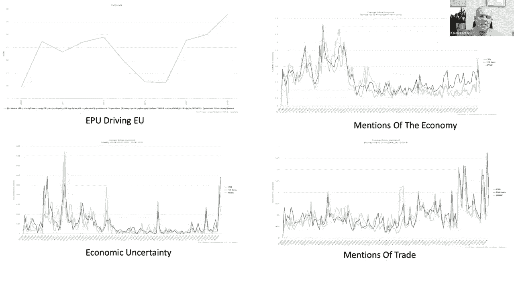

非常非常强大，嗯，我们还有实体图。

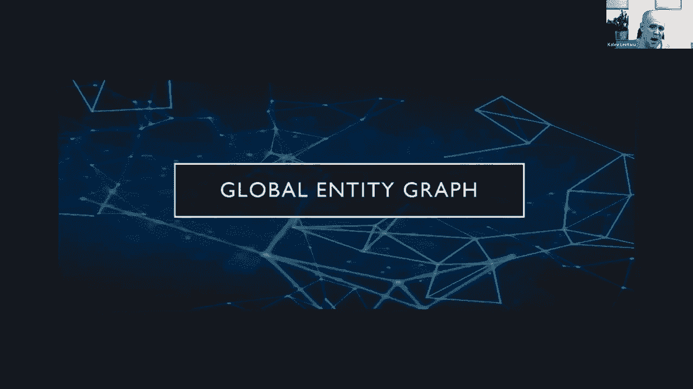

所以这更多的是，你知道我们传统上认为的知识图，嗯，这就是我们要带两台电视的地方，呃，封闭字幕和在线新闻文章，我们在谷歌上运行它们。

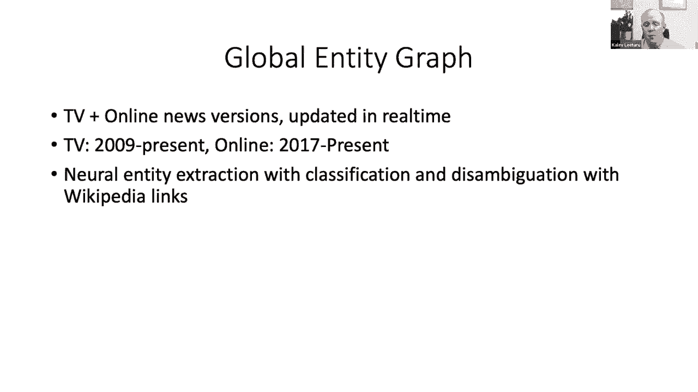

我们通过谷歌的自然语言API运行它们，提取所有实体引用，嗯，所以它做的事情像co-raf，你知道实体解析吗，所以我们看共生图等等，你知道的，然后我们就可以，你知道的，看看这些的子集，用不同的方式画它们。

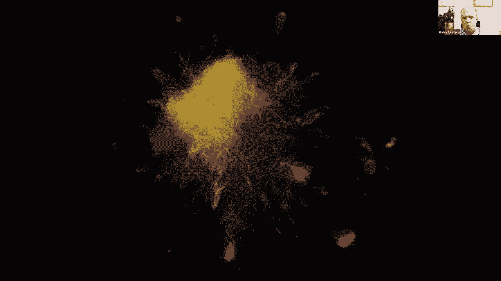

嗯，我们也可以再做一次，因为我们有来自自然语言API的依赖解析，我们可以做Q和A这样的事情，某某又遇见了某某，我们只要把图表，我们发现这两个实体，我们看着那里所有的十字架痕迹，你知道的。

有什么联系基本上是通过一个动词的动词来表示满足嗯，我们可以做非常有趣的事情，所以这是一个气候变化导致澳大利亚野火的问题，所以我们又做了什么，气候变化澳大利亚野火，我们寻找一些动词来表示贡献。

变得非常有趣的是，我们看到了三条主要的路径，一个这很有趣，我们看到只有一个新闻媒体，我们扔了三条路，一个是肯定的，一个是不，一个可能又是这样，这种能力一旦你想到这些图，就可以使用传统的图，你知道图形嗯。

你知道的，基本上呃，通过一个图表来做一些非常有趣的事情，现在你真的很有趣，所以谷歌有一个叫做推理API的东西，可以让你，比如说，看统计数据，本质上说你知道什么更像这样。

所以我们可以带罗伯特·穆勒这样的人，我们可以说谁比你知道的更多地出现在罗伯特·穆勒，他们，他们和他在一起比没有他发生得更多，这变得非常非常有趣，所以你可以看到这些，你可以用日期，事件，人，艺术品。

所有不同的分类，所以和LP API实际上将实体分类为事件，日期，艺术作品，各种不同的分类，然后我们可以做各种非常非常迷人的推论，所以这变得非常有趣，因为我们可以诱导事物之间的联系，所以你又知道了。

即使我们没有一篇文章说，Space X是由埃隆·马斯克创建的，我们可以看到这两者本质上是不可分割的，所以我们现在可以推断这两者之间有某种很强的联系。

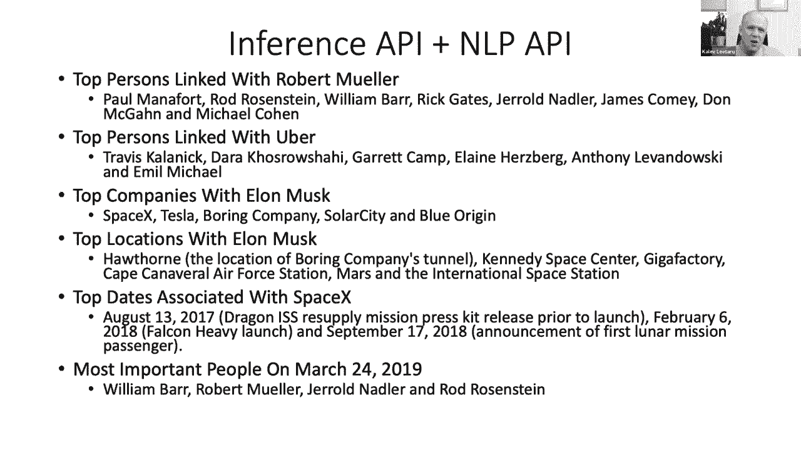

当然文本只是其中的一部分，图像是难以置信的强大。

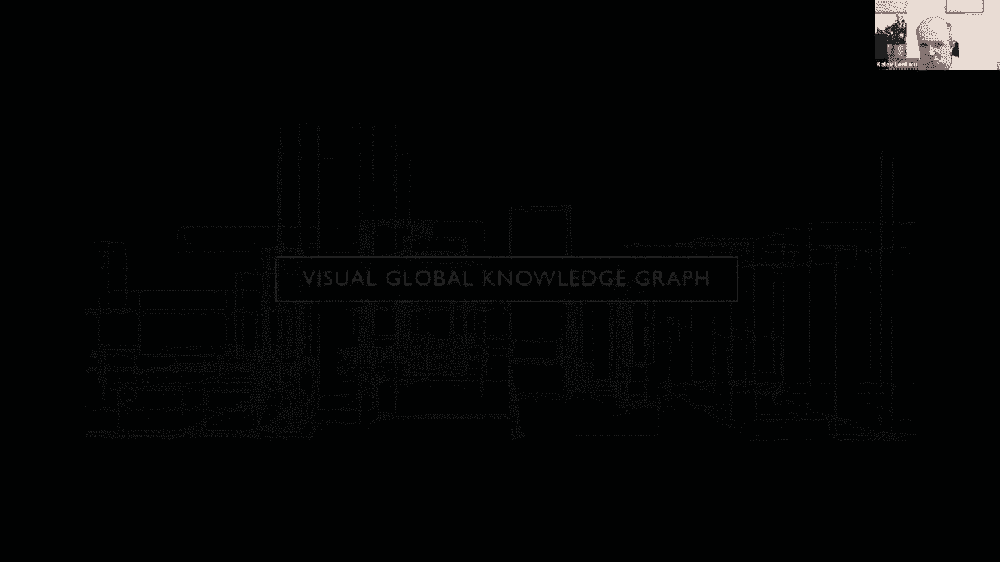

嗯，所以我们做的一件事是，我们每天大约跑一半，我们对我们在网上遇到的所有新闻图像进行随机抽样，关于新闻报道，我们通过谷歌的云视觉API运行它，也就是他们的机器视觉API，嗯。

所以你现在已经运行了大约5亿张图像，我们使OCR地理位置，嗯，你知道，呃前菲，如果我们也把它，提取任何EX I，在那里找到的f元数据，我们做一个反向图像搜索，嗯，再次谷歌不做面部识别。

或者我们当然不使用面部识别，现在你能做的，虽然你可以说，比如找到我所有以某种方式标题的图像。

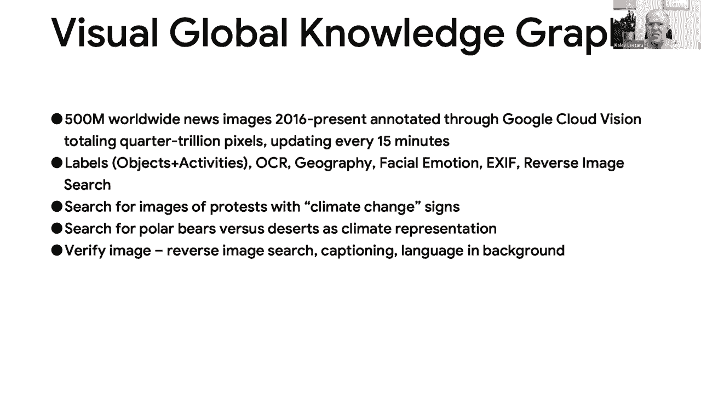

所以你可以做非常非常有趣的事情，像反向图像搜索等等，例如，我们可以说找到世界各地洪水或自然灾害的图像，我们可以随着时间的推移实时创建这些地图，嗯，我们可以在背景中寻找垃圾的图像，比如说。

所以我实际上你知道测量世界污染现在又在那里了。

思考图形，我们有的是一组图像，对于每一个图像，基本上是标签列表和其他一切，所以再一次，这是啊，这实际上是一个SQL和BigQuery。

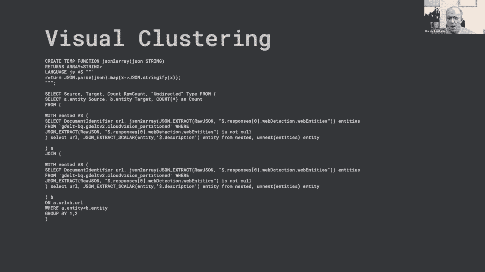

嗯，所以再次，一个简单的SQL小块，我们现在可以做一个共现图，嗯，在所有这些标签上，然后说，现在更常见的视觉标签类型是什么，其中一些是诱导的，呃，你知道模型本身诱导的事情。

但实际上你会看到很多意想不到的事情，这样我们就可以缩小范围，例如，商业媒体可能与主流媒体不同地将某些实体联系起来，你知道什么是公共汽车，比如那就变得很有趣啊，你知道什么是环游世界的公共汽车吗。

你可以看到他们在世界各地有多不同，我们可以再看看不同的决议。

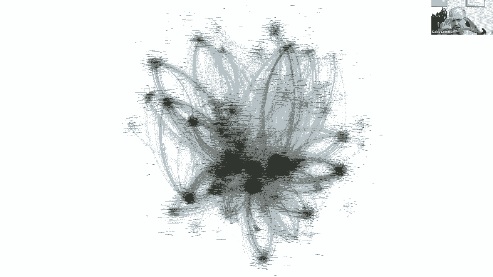

所以我们可以我们基本上可以，嗯，你知道，在这里构建不同的密度，视频，当然真的很有趣。

所以再一次，你知道，想想看，你从静止图像开始，我们最终会得到什么，这又是所有这些实体，所有这些都在谷歌知识图中，这真的很有趣，因为谷歌的知识图，是你知道的，本质上，你有一个巨大的多模态图。

使图形存在于文本之上，静止图像和视频，所以它变得非常强大，因为，例如，我可以使用一个代码，我可以用，例如狗的代码，我或者我们说一只金毛猎犬，我可以识别出一个关于金毛猎犬的文本引用，我可以识别一个视频。

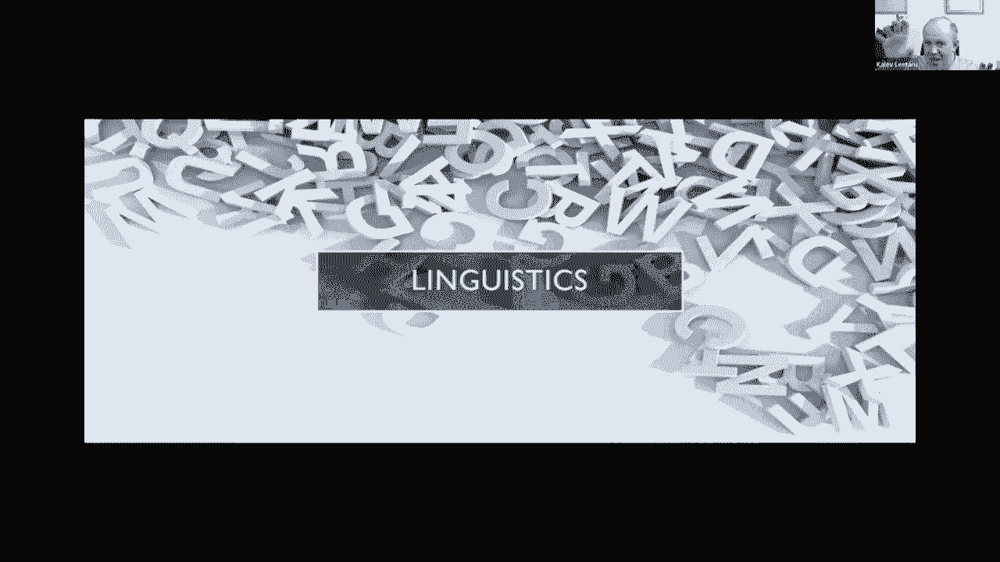

金毛猎犬和金毛猎犬的形象，跨模式使用相同的代码。

嗯等视频，我们做两件事，我们确实看文本，我们使用封闭字幕，我们喜欢在封闭字幕上做有趣的事情，但事情变得真正有趣的是，你知道消除封闭字幕，因为很多视频没有关闭标题，我们做了几件事。

一个是我们做自动语音识别，我想指出谷歌的视频模式，这是他们视频的一部分，um系统，视频模型只适用于英语，现在它比人类转录更准确，这是这是巨大的，这是一个巨大的变化，我们做的是电视新闻。

人类真的坐在那里输入你在电视上看到的封闭字幕，所以我们有人工生成的字幕，我们可以回顾十年来的镜头，然后比较十年的视频，并将其与ASR进行比较，并实际表明机器实际上做得更好，它实际上更准确，嗯，例如。

让事情变得更正确，当人类累了，机器不会疲倦，所以即使有人开得很快，使用非常技术性的术语。

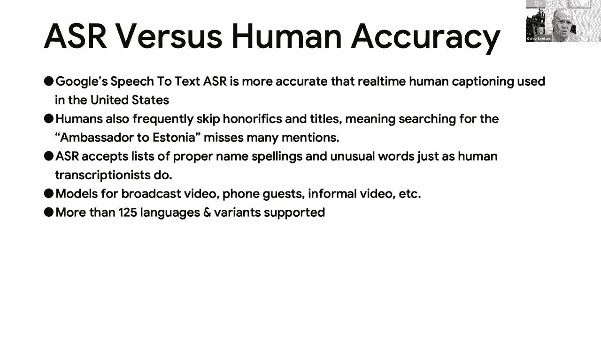

机器打败了它，这是一个巨大的变化，但通常我们更感兴趣的是它的视觉部分，你又知道了，ASR，你又知道了，如果我已经有人类捕捉，我不需要，ASR，我所需要的，虽然，就是说像，屏幕上随时都有什么。

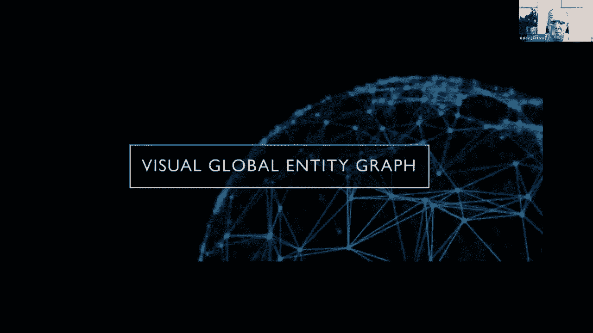

嗯，所以我们与互联网档案馆进行了一些合作，我们已经跑了，伦敦，msnbc，福克斯新闻，不停实际上现在是不停，从去年一月到现在，一天二十四小时，谷歌的云视频，看着那些，它在燃烧。

屏幕上的一切都用大约300种语言，所有的标签，里面看到的所有实体，NBC，晚间新闻，又回到十年前，所有这些都是可用的，你现在就可以下载这些数据并对其进行实验，呃，所以你可以用它做很多不同的事情。

所以我们有一个交互式搜索引擎，我们可以关键字搜索，或者你可以在BigQuery中使用它，或者如果你想下载几百TB的JSON，你可以下载。

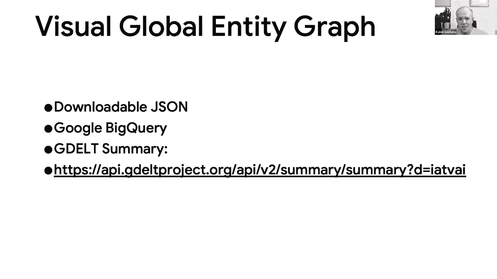

你可以去争取，所以你可以看到，就像，云视频做什么，你知道的，如果我运行一个最先进的视频，广播视频上的注释工具，就像，那看起来像什么，嗯好吧，你现在就可以下载并实验，嗯，一个是什么。

这里非常有趣的事情之一是云视频是帧级的，它在一帧一帧地注释镜头，人类，另一方面，往往认为广播时间是以秒或小数秒为单位的，你知道我们不是在找，我们不是在看每一帧，所以这变得很有趣，其实。

当您平衡人工注释器和机器注释时，因为人类喜欢，如果你说目录，你知道你在第二个镜头中看到的所有东西，嗯，这其实是一个广告商，这是为了一部特定的电影，在一秒钟的广播时间里，有五个独立的场景。

在一秒钟的广播时间里，因为再一次，再次快速切割机器，一帧一帧，附加说明，所有这些，所以作为一个人，你看看这个，你说好，一架直升机、一个金属和一个人在天空中，好像没有办法，这些都可能是，你知道的。

在一秒钟的广播时间里，嗯，所以这变得很有趣，因为我们在方法论上认为机器生成的知识图是如此精确，你怎么，你知道吗，你们怎么结合，然后用人类生成的图形，就像人类雷达信息，嗯，像总结之类的东西。

我们非常感兴趣的一件事是看，你知道所寻求的更改之间的区别，所以说，比如说，CNN可能在谈论一个故事，新闻编辑室的人谈论，然后他们切到了一个记者的现场直播，然后把它们放回去，同样的故事。

只是不同的相机变化。

所以你不能用摄像机的变化来分裂一个故事，你得做更多的事情，所以我们做了很多，嗯，所以谷歌，顺便说一句，如果你没有玩过谷歌的人工智能研讨会，只需寻找谷歌的人工智能研讨会，他们有一个令人难以置信的工具清单。

其中一些地址知识图，您可以注册，并尝试已经，我们做的一件事就是，我们在语义相似性方面做了很多工作，实际上允许我们分割。

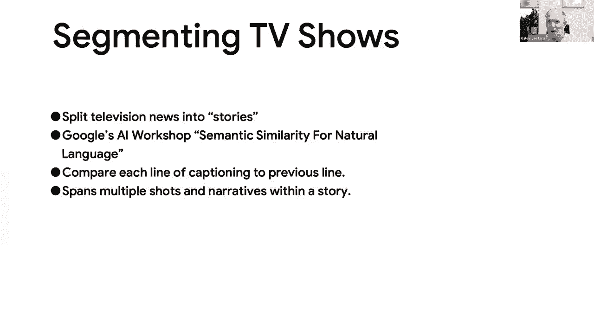

现在分割东西，一旦你有了，你知道电视，你从一个，你知道一拍字节，或者更多-很多很多拍字节的视频，你从拍字节和拍字节的视频开始，您最终得到的基本上是JSON注释，基本上是一个图形，OCR标签的本质。

镜头文字，所有这些不同属性的变化，嗯超过那个，现在我们可以做很多不同的事情，我们可以说，找到我的录像，比如说，啊，现在真正有趣的是，我们问的问题之一是，嗯，我们说什么不一样，所以我们把知识图。

我们说了Covid时代知识图有什么不同，从标签上构建的Covid前空气中的知识图，在视觉标签上，出来的第一件事，最大的区别是电视上到处都是书柜，流行病开始时是书架，因为人们从家里展示。

每个人身后都像一个书架，嗯，所以再次，这种做或发短信的能力，我们可以看到WebEx，呃上，呃，因为他们是一部分，他们用它来做那个，乌姆·奥克雷，所以又是OCR，我忘了有多少，三百多，一些语言。

现在我们没想到会看到，乌尔都语是乌尔都语，阿拉伯文，我忘了是哪一个，嗯，有一次广播，这是塔利班的广播员，再次，它转录了云视频，完美地转录了这一点，为我们，然后我们看到所有的OCR文本给我们一个图表，嗯。

哪些词同时出现，还有什么标签，所以你想每一个词，它本质上是一个图形，你知道它出现在这一秒钟的广播时间里，以下是其他的话，它出现在屏幕上的视觉标签中，当这个词出现在，节目开始了，通道，啊时间。

一切本质上都是一个巨大的图表，让我们可以问，比如说，某些单词只出现在，或者他们最强烈地出现在屏幕上，当某些标签出现在屏幕上时，比如说，然后我们可以再做各种各样的事情，运动OCR，我们可以看到不同的东西。

然后我们可以看这个说，比如说，CNN的Covid仪表板，我们可以用OCR来查看。

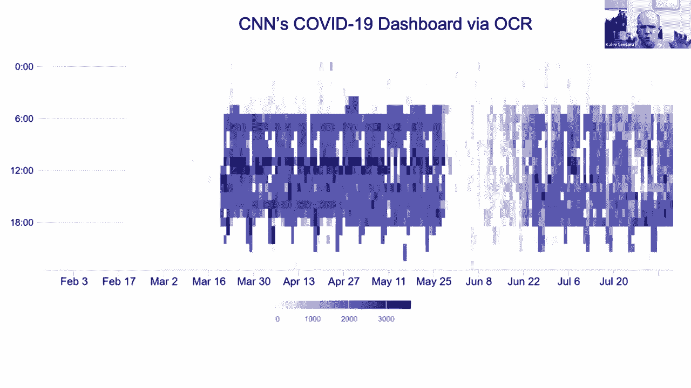

你知道，那是哪里，那不是在哪里，我们可以做有趣的事情，所以我们扫描了屏幕上的文本，唐纳德·特朗普的所有推特，所以这是一个有趣的问题，一个有趣的情态例子，所以我们想看看唐纳德·特朗普的推文。

他们多久在电视新闻上重复一次，所以我们把屏幕上的文字，我们把推特的所有56个档案，我想他发了成千上万条推特，我们拿走了嗯，任何地方，我们在真正的唐纳德·特朗普屏幕上看到的任何文本，我们把它放在屏幕上。

我们合并了我们对推特档案进行了模糊匹配，把它们合并在一起，所以现在每一秒的广播时间，我们说在这一秒钟的播出时间里有一条唐纳德·特朗普的推特，我们将其连接到实际tweet的实际ID。

然后我们连接到其他属性，比如说，这些都是手工收集的，你知道那是那条被标记为错误信息的推特，是吗，你知道删除，等等，所以现在你有了这个丰富的，我们采取了一种方式，我们把它连接到另一个模态。

让我们可以在那里问非常非常有趣的问题，我们也可以用。

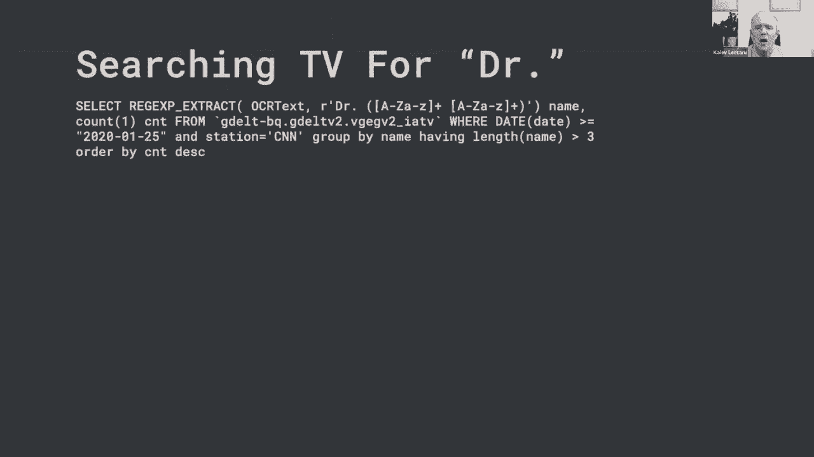

比如说，讲述Covid-19故事的医生，所以这真的很有趣，事实核查人员，嗯，谁出现在电视上讲述那个故事，所以我们可以再次扫描Chiron，所以这是底部的文本，上面写着是谁在说话，我们可以扫描。

然后把那个，和实际库存，你知道这些架子上都有谁在说话吗，这些免疫学家也是，这些是，你知道疫苗专家，等等，嗯。

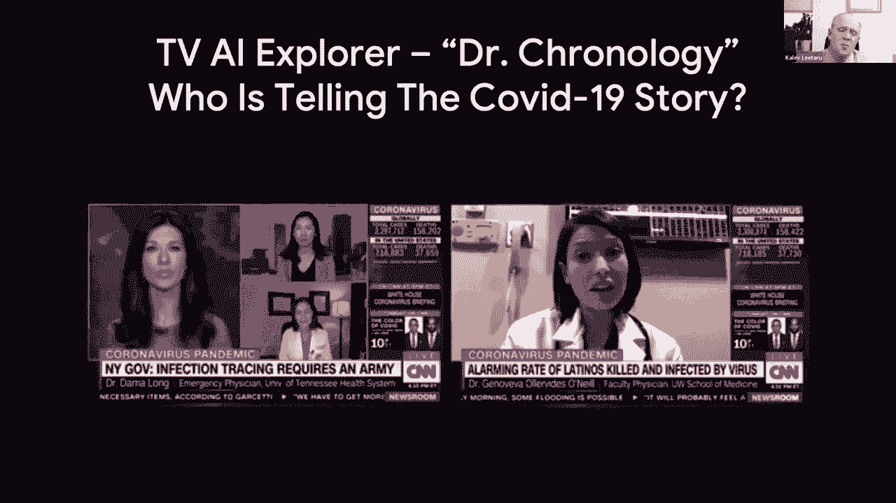

这让我们可以再次连接，创造知识，越来越高的抽象层次的工艺品，然后我们可以通过广播的解剖来观察，我们可以看一些东西，比如视觉相似性，你可以在右边看到。

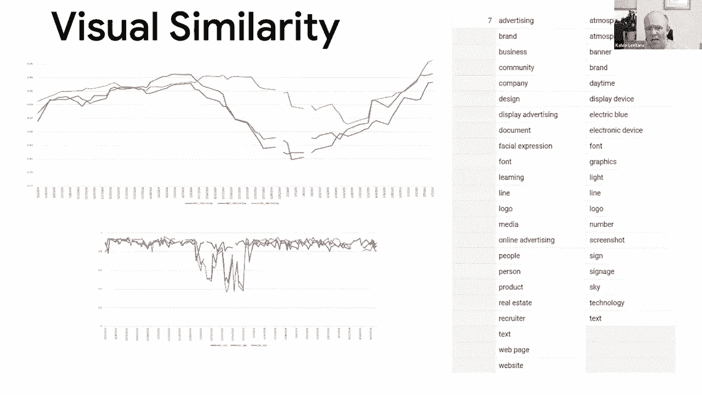

嗯，你知道从中构建的一些标签，嗯，在那里看到的，我们也为无线电做这个。

所以无线电上的语音识别，再处理一次，就像这里的文字图一样，最后我想谈谈，特别是Covid-19，嗯，所以呃，互联网档案的一个分支，我们与之密切合作的媒体数据研究联盟，嗯，所以他们实际上有谷歌云研究资助。

通过电视和广播新闻分析量化Covid-19公共卫生媒体叙事，所以这实际上是一笔赠款，本质上是目录，广播电视新闻，嗯，并由此生成更丰富的数据，所以这实际上是我们有广播电视网，嗯，所有这些差异。

所以又是在线图像，我们有所有这些注释，这项研究，比如说，疾病，所以我们有所有这些不同的主要疾病爆发，我们试图理解的一件事是，疾病是如何随着时间的推移而不同地编目的，那么Covid的故事是如何被讲述的。

寨卡病毒的故事还是埃博拉病毒的故事，从公共卫生的角度来看，这变得非常有趣，我们再一次把这些看作是每个实体的图，不仅仅是你知道像模式组织这样的图，但一切都是图表，你知道吗，某物在某一时间片段中的出现。

本质上是那个实体和时间上的那个时刻之间的图形连接。

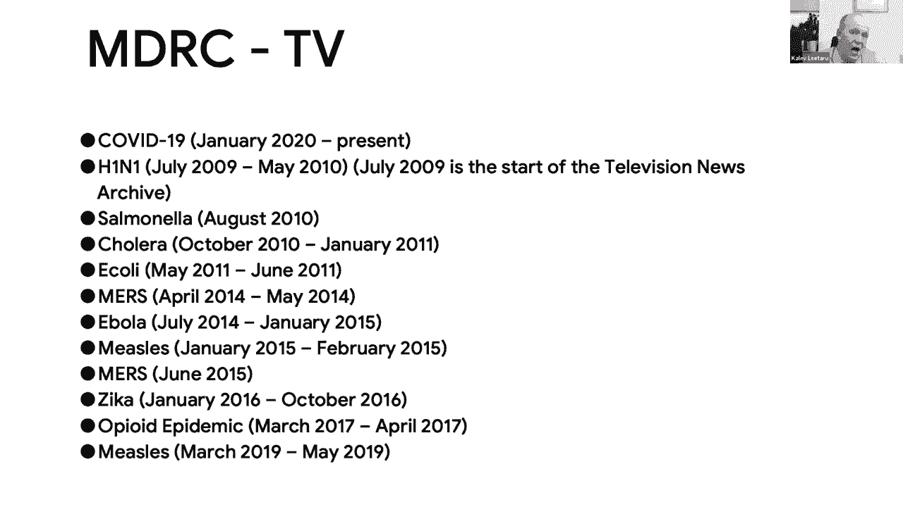

当我们想到你知道的时候，这变得非常强大。

这些非常丰富的图表，最后是关系图，所以这是我们再次推动的事情，你知道的，我们想做的一件事就是阅读新闻媒体，每天，提取出所有的事实主张，并查看，例如，对于有争议的叙述，嗯，所以我们喜欢的是能够说。

你知道吗，在Covid大流行的早期，欧洲媒体说，你知道吗，欧洲领导人说在美国公众中戴口罩，卫生当局说，不要穿麻布，嗯，现在，现在再来一次，那已经够大的了，每个人都注意到我们希望能够做的。

就是有一台可以自主检测的机器，说嘿，我们在这里看到了很多关于穿它的声明，很多声明说不要在这里穿，再次识别，你不是谁知道什么，正确的答案是，这台机器当然不会，但为了能够提醒事实核查人员，记者。

公共卫生当局和其他，我肯定我们在那里做了很多工作，嗯，试图看到像，这些类型的图表会是什么，就像，那会是什么样子，嗯，你知道，尤其是在一切都争论不休的混乱中，嗯。

你知道在这个世界上很少有事情是每个人都同意的，所以你最终得到的是非常有趣的，当你在实时网络上做事时，就像维基百科是一个有趣的例子，当一些东西进入维基百科时，嗯，你知道你认为任何人都可以编辑维基百科。

但是你有这些编辑强制这种形式的常态，如果有太多的分歧，就像，有一场编辑大战，编辑们进来了，他们锁定页面，他们想出了什么，他们认为正确的答案应该是，只有一个答案，所以它被锁住了，你没有看到编辑战争。

因为我们把新闻看成是火，Howe实时看到那些编辑警告，所以对我们来说，你知道在某个地方，嗯，你知道，嗯，你知道根据政府的说法，那里没有人，根据这个群体，虽然那里有一千万，所以你知道你实时看到这个。

你真的看到了这些战斗，所以这变得非常非常有趣，再次对我们。

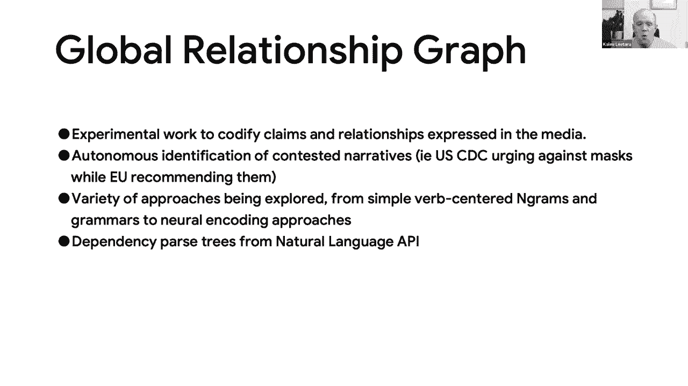

这实际上是有趣的部分是识别，那里有什么东西，所以又来了，嗯，你知道吗，你又知道了，我所展示的一切，你是公共数据，嗯，这是一个庞大的公共数据集，你有文本图像，音频视频嗯，你有模式点组织，你知道提取，你有。

你知道我们的知识图，地理分析，所有这些不同的碎片，嗯，所以它是巨大的，巨大的，又一次，只需转到GDL项目，点组织，去我们的博客，你可以下载今天所有的数据集来实验，非常感谢，我知道我已经走了很多路。

但希望这能激励你看起来更多，谢谢。谢谢。凯勒布，那是，呃，一个鼓舞人心的井风之旅，展示了一系列的应用和可能性。

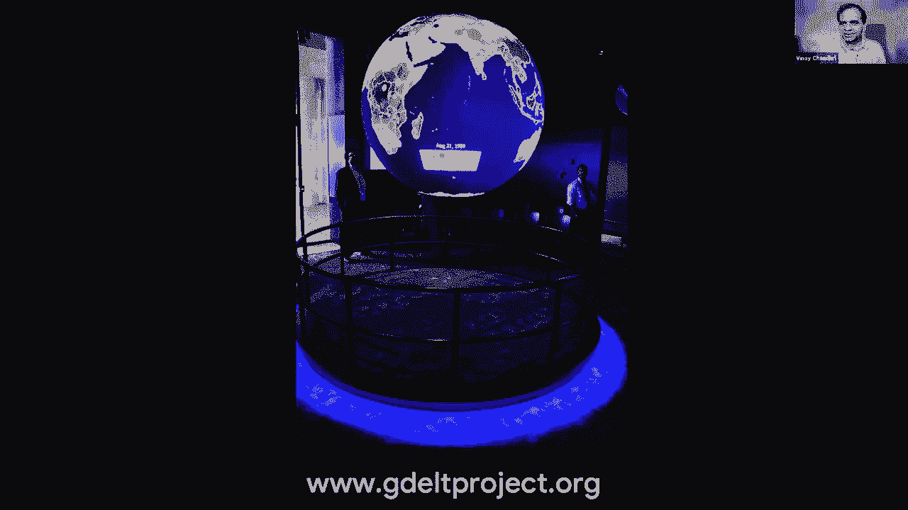

这可能是你在促成你的工作在促成，我们在问答中有很多问题，呃，那你要不要拔出来，所以我认为今天的讲座很受欢迎，所以多亏了你们两个，有很多问题，所以也许我们可以从萨希开始，嗯，沙希是知识图，一个好的范例。

呃，所以就是现在，建模和存储事实的良好范例，但是储存不同种类的东西，比如毕达哥拉斯的证明，怎么样，交通法规，已经有很多尝试，呃，就像他们在谈论概率信息一样，比如说，问题是协同过滤信息，怎么。

对一个实体感兴趣的人对另一个实体感兴趣的可能性有多大，这完全是一个如何定义抽象的问题，就像内部一样，我们定义了具有纯粹性的知识，然后在知识图的顶部有层，在上面进行计算，例如。

协作信息可能停留在知识图的更高层，呃，你所说的其他一些例子，呃，呃，其他因素，呃就像，例如，非结构化数据，当您在视频上命名实体识别时，或在文本或图像上，知识图的那一部分，或者不是，之间的联系。

我感觉到了我们的画面，我感觉到了实体，这只是我们内部保留的术语问题，我们对知识图的定义最终更多，示意图和结构化信息，我们将一些与非结构化信息的关联保留在不同的层中，它是，这只是现在的问题。

可以把整件事称为一个知识图，它融合在一起，非结构化和结构化信息，所以从这个意义上说，即使在今天，我们也超越了，呃，因素或非常结构化的事实信息，好的，谢谢你这么加州，有一大堆问题要问你。

但我会把它们都放在一起，他们到处都是，好的，你是如何设计你的系统的，有无数的时间服务吗，您的基础结构是什么，看起来像工具，等，所以总的来说，如果你能给呃，有关实现的信息，您也可以随意指向任何文档。

学生们可以看看，即使那样也很好，是啊，是啊，所以嗯，在博客上，呃，你会看到一大堆视频，如果你在博客中寻找ML Summit，所以谷歌的谷歌云，ml峰会，嗯，我实际上说了很多关于核心基础设施的事情。

还有嗯，GDS上的括号之间是什么，在博客上的括号之间，你会看到那些，所以简单的答案是我们有许多不同的架构，取决于，你知道内容，所以对于广播和电视来说，嗯，你知道吗，与互联网档案馆有合作，嗯，例如。

因为那些很简单，我们基本上只是有一个，事实上在那里，它是，它实际上只是一组简单的脚本，他们拿走了视频文件，把它们放进去，流过云彩，流式输出注释，稍微重新格式化注释，嗯，例如，我们生成像我们有原始文件。

我们生成一个摘要文件，我们生成几个摘要文件，然后像那些苏高，我想人们想要一些答案，您正在使用RDF吗，你在用新的J吗，你用的是三重存储吗，您使用关系数据库吗，比如在软件层面，是啊，是啊，好的，所以耶。

所以在软件层面，嗯，一切本质上都取决于数据集，所以我们不，你知道吗，大多数人，他们试图再次拿出某种主数据，在科学计算界这么多年，我们倾向于试着想出一个大师，你知道，做任何事情的数据格式，嗯对我们来说。

我们没有，因为，嗯，特别是，因为我们的数据集非常不同，所以一个人试图提取模式组织，嗯，你知道的，一个是查看地理数据，一个在看这个，嗯，所以内部，我们倾向于以最丰富的形式表示数据，所以说，例如。

用于模式组织，它实际上是我们提取出一个模式，org块，我们为您将其编码为json，我们基本上把它作为一个JSON BLOB放在JSON文件中，就这样，在计算时间，然后是我们真正解析出来的时候。

然后对其进行分析，嗯，同样的说法，图像，所以对于图像，我们拍一张照片，我们把这个，你知道，我们通过云视觉运行它，我们有，你知道，它输出一个巨大的JSON，我们在上面加一堆。

这就是我们如何储存它作为巨大的，所以本质上我们故事，他说他是生的，因为，然后呢，假设我们对标签的协同图感兴趣，很容易把它提取出来，与我们发现的相反，最初我们试着想出一些主文件。

全球知识图实际上是那个巨大的庞然大物文件，你知道的，表示一切的图形，但后来我们发现这不起作用，当我们开始添加不同的模式和不同的东西，嗯，所有的崩溃，所以我们内部，我们基本上是在一次构造图。

因为我们需要它们，这在今天是可行的，因为像BigQuery和其他工具这样的东西，嗯，你知道他们用蛮力穿过它，所以这本身没有额外的真正影响，好的，所以是的，所以简短的答案是，我们实时开始，好的，嗯。

我要补充的一部分是，因为我们最感兴趣的图表，通常是这些巨大的图表，就像我们想知道焦虑，你知道的，这个核心诅咒，在这在这在这，用图表来表示所有这些是不可能的，作为一个作为一个显示图，存储将是。

所以有趣的是，因为对我们来说，今天真正的计算，存储仍然是你的瓶颈，计算机不再是GPU、TPU和内存之间的仿生CK，图的构造并不是瓶颈，把它弄下来，所以对我们来说，通过储存它，它最紧凑的形式。

实时构造这些图，让我们处理这些的侧步，这些真正令人惊叹的大图表，好的，谢谢。所以这对沙希来说是一个非常具体的问题，呃，你的那些链接，呃，你展示了斜线，x斜杠y x x废话，废话，废话。

谷歌CAG还在使用这个组织进行ID吗，这个斜线，m斜线空间是由Freebase发明的，M和代表它，这就是我们的天性，我们有，呃，我们确实建立在此基础上，就像我们对知识图的许多遗产来自元网络。

谷歌所做的基本调查，但我们已经以许多其他方式扩展了这一点，喜欢和你，你可能在我的一张幻灯片上发现了一个G斜杠ID，这些就像其他内部的，数据类型和实体，所以它延伸到了斜线之外，m。

你可以粗略地想到斜线和空格，与免费开放的网络上可用的内容相对应，就像，例如维基百科实体，但有一个很大的超集，呃存在于知识图中，好的，谢谢。当我麦克风，你有什么问题吗？这里有很多问题。

但你为什么不继续你脑海中的一些问题，嗯，有一个问题我认为对两位小组成员都适用，呃，我想有人向沙希提出了一个问题，你能告诉我们更多关于策展过程有多复杂吗，有多少人参与其中，但我想同样的问题也可以问凯勒。

你怎么知道你正在做的所有这些巨大的处理实际上有什么好处，对呀，我们知道，它真的能产生有用的东西吗，还是在制造垃圾，或者你知道我们怎么知道，所以我想先走，是啊，是啊，我可以先走，是啊，是啊，所以呃。

我想详细说明一下我们在这方面的确切数量，但我们只能说它是成千上万的，呃，所以策展人相当多，如果你还记得幻灯片上的内容，我分享了，策展不仅仅是人们写下因素，这是关于削减模式，它是关于映射模式的。

跨越不同的来源等等，等等，任何数量的不同活动或训练机器学习模型，所有这些，这就是这东西的作用，我们有一个相当复杂的工具机械，以及输入到持续时间管道的优先级排序过程，例如，我们会有工具来理解进来的查询。

探测世界的潜在变化，就像在这个国家，也许一个新的先例可能会当选，并保持领先，然后可能会创建一个策展任务，说，好的，去弄清楚，如果这个国家选出了新总统，所以为了保持知识图的新鲜，这是一个精密机械的例子。

另一件事是我们想确保我们的策展人，比如从某人的网站上获取专有知识，所以我们必须确保他们把来源，呃，可访问的，在那里，他们被允许拥有资源，其次，这些都是经证实的消息来源，所以在多个来源中寻找。

这不仅仅是你在挑选某人的私人信息，这些都是我们所做的事情的例子，通往策展人的机器，这确保了我们在过程中有完整性，最后我们得到了最新的准确数据，是啊，是啊，然后你知道对我们来说，我是说再来一次。

这是一个有趣的事情，GL是，你知道我们都在试图记录现实，但往往比现实越来越重要，所以这实际上是这里有趣的事情之一，你知道用谷歌，它试图编目现实，你知道它试图尽可能接近真相，为了我们。

我们最大的兴趣是编目现实，但也记录了世界各地人们生活的许多平行现实，例如，嗯，你知道，处理发生的任何问题，这可能是有争议的，比如说，这是如何在世界各地被框定的，所以对我们来说，你知道我们有很多新闻媒体。

你知道吗，也许我们的党派渠道，也许不是每个人都会争论，这是一个新闻媒体，嗯，我们的目标是让你再次，如果你是，你知道这样这样，我想简单的答案是我们的图表，我们试图编码现实，然后所有不同的形式。

或者类似的引用，人们对真理的引用版本，耶不，是啊，是啊，我认为这个问题的精神略有不同，万一谷歌，有搜索用户的验证，我是说有人在找，如果谷歌没有给他们好的结果，你会得到愤怒的顾客。

那么您正在构建的图形的验证是什么，你怎么知道图表，所以这实际上是如此，这也是一个很好的观点，所以技术精度，所以柔道关注的一件事是它试图创造，所以对于我们的许多数据集，在那里你知道没有。

这个问题还没有解决，嗯，因此，即使是从文本中提取实体也远非，你知道这不是一个解决，没有什么是完美无缺的，所以我们要做的是，我们提供了许多不同的版本，所以说，例如实体，嗯，对于英语语言。

我们提供一个简单的东西，它有它是一个，你知道的，传统的，嗯哼，你知道的，基本上所有的名词短语，然后我们还通过谷歌的云注释了一大堆，自然语言API um，这样你就可以看到，你知道吗。

以下是它对这些情绪的作用，我们大约有4000个这样的维度，其中许多重叠，这样你就可以比较，比如说，这是一个很好的观点，实际上，某些算法或某些工具包是建立在某些领域上的，所以也许有些东西更适合说，嗯。

你知道吗，也许是一般新闻，也许是政治新闻，所以我们经常会应用这些中的每一个，嗯，所以简单的答案是，我们会给你很多不同的工具，然后你可以试验并决定在你的领域中哪一个是最准确的，根据你的需要。

或者你已经建立了一些可以工作的东西，某种工具的特性，所以这本质上是我们看待它的方式，你又知道了，这里很少有问题得到解决的领域，对我们来说也是如此，本质上我们所做的是，我们给你很多不同的镜头。

这样你就可以，你知道吗，实际上支持该领域的奖学金，那很好，呃迈克，你对评委有什么问题吗，呃不，我很好，我只想听听，我不知道，但我想聊天中还有很多其他问题，所以我们应该试着掩盖其中的一些声音，所以沙希。

做了一大堆问题，我会试着把他们都联系在一起，嗯他们的问题，呃，好的，知识图的下一步是什么，任何呃，对初创企业的建议，谁是企业家，他们在思考想法，关于发明什么，从什么开始，等，关于那个话题的任何事情。

我提到了一个相当技术性的话题，肯定是一个广阔的开放空间问题，所以以我在演讲中给出的语言理解为例，也可以，你试图建立一个机器学习模型来识别，将不同语言的表面形式翻译成一种意义，呃。

从SQL或某种形式对意义的结构化表示，同时你会看到这种不可思议的爆炸，呃，分布式模型，在神经网络中，就像我们上周为关注谷歌的人准备的，i，o，我们谈到了一种叫做妈妈的技术，呃，它创造了一个很大的，呃。

参数，呃，像数千亿参数模型这样的模型，我认为到目前为止，这些领域的研究有些分裂，建造大型建筑的人，呃，语言的模型大多在世界空间中工作，当然因为大量的训练投入，就像整个网络来训练你，你学到了很多。

然后是结构化的知识部分，我只是认为是人类，想出了如何正确地将某些事情封为圣徒，就像你说拜登总统还是乔总统，拜登，或者选民，或现任总统，在当前时间意味着同样的事情，所以它的规范化是一个结束，所以呃。

我想没有人完全明白，如何将这两种技术结合在一起，嗯，你可以想象从这里开始真的很简单，像拿代币这样的事情，它们在字符串或语言空间中，并将其规范化为额外的圆顶，想象你加了一个斜线，m斜线，乔，拜登到词汇。

现在你可以申请了，你在你的训练模型中使用它，但你能为他们做些什么，比如联系，如何从结构化表示中的连接中学习，学习您的语言模型，我想有一个广阔的空间关于如何结合对我来说，那是超级令人兴奋的，太酷了。

太酷了，凯勒布，我想知道在您与我们分享的各种用例中，在你看来，你最引以为豪的是哪一个，或者你认为哪一个，呃，现实世界的影响，它是什么，是啊，是啊，你知道这是不可思议的，我是说，JL今天很有力量。

你知道从你知道胆汁监测，或者观察疾病爆发，你知道，世界各地的粮食不稳定，你知道，我是说这太不可思议了，所有的应用程序，所有的区域，我是说对我来说，最鼓舞人心的故事之一是在2014年。

我们发现我们实际上看到了早期的微光，埃博拉的微光，呃，但当时我们没有机器翻译能力来做到这一点，所以这就是我们，然后说，你知道这是值得的，你知道，当我们和人们交谈时，大多数人，我们谈过说不值得翻译世界。

嗯，你知道吗，看看英语就知道了，用英语出现很重要，这是来自学术界的，你知道我们说看这是这是，你知道，我认为这里有真正的价值，所以这导致了这个巨大的，我是说，巨大的基础设施。

因为我们又一次把一切都翻译得如此之快，到1919年12月，你知道六年或五年后你知道那是什么，你知道实际上，实际上起作用了，你知道这家生物监测公司，在加拿大被炸毁的圆点，他们建造了。

基本上他们建立了一个机器学习模型，将我们的开放数据提要，每十五分钟处理一次，然后它标记了它早期的微光，当时它被称为呃，非典，如不明原因的病毒性肺炎，它标志着他们的人，你知道他们的人类审稿人，呃确认了。

他们打电话来，得到了一些额外的细节，他们在12月发出了全球警报，三十一，二千零一九年，喜欢我，就像这样展示了这个的力量，你知道说，你看嗯，这也再次显示了翻译的力量，放眼世界的力量，这些意想不到的事情。

对我来说，这只是总结，说，就像，你知道的，这是最早的警报之一，这实际上是第一个外部警报之一，它是在政府警报后几个小时内出现的，内部警报的um，我想说你知道这奏效了，我认为这是一个很有力量的故事，好的。

是啊，是啊，那是个很棒的故事，迦勒，所以我们的课快结束了，也许呃，你知道吗，你们每人可以花30秒告诉我们，嗯，你的下一步是什么，还是什么，知识图的下一步应该是什么，呃，所以我想先走，是啊，是啊。

所以对我个人来说，我已经从一般搜索转向搜索更多，所以我目前专注于电子商务和建设，基本上，我谈到了两个40亿购物相关的实体，构建应用程序并在谷歌中构建引人注目的电子商务应用程序，呃真的很兴奋，呃，在哪里。

呃，呃，就知识图会再次走向何方而言，就像我之前的回答一样，我觉得自己像结构化的知识，以及你在网上找到的表单的非结构化知识，我认为我认为我认为这里有一个真正的机会把他们聚集在一起，在类似的平台上，在这里。

必须有人找出正确的抽象，我想我们还没有完全弄明白，呃，语义网，这基本上是带有语义覆盖的非结构化文档，还有比这更深刻的吗，我想我们没有答案，但我认为我认为我们现在有工具开始回答这些问题，好。

这是个很好的答案，K耶，我是说，我想对我们来说，你又知道真实了，圣杯是可以阅读新闻的东西，当我们在世界各地监测时，这可以编目其中的事实主张，嗯再次，今天有这么多的方法，你知道没有人真正解决这个问题。

再喜欢一次，有这么多不同的工具，你知道它们是语法、新词还是嵌入，人们尝试的所有这些不同的方式，但今天没有什么能有力地阅读一篇新闻文章，甚至只在英语中出版，并以一种强有力的方式编纂它，使我们能够。

你知道不只是做简单的，q和a，我是说再来一次，q a，我是说今天又来了，Q和A对类似的句子有约束力，它仍然依赖于一个人类，我们想直奔主题，在那里，它被编成这样一种方式，机器可以对它进行推理，你知道识别。

你知道的，识别有争议的叙述，识别您知道的冲突，一个事实核查人员已经，你知道的，确定了这一点，所以这里有一些与之相反的新闻封面，这是不正确的信息吗，还是你知道的这些新信息可能需要调整一下。

对我们来说是圣杯，你又知道了，我们的目标之一是产生越来越多的数据集，试图在那个领域进行研究，创建一些基本的开放数据集，一次又一次，你知道这是谷歌云开放数据集计划的一部分，嗯，所以所有这些数据都是可用的。

你知道我们很高兴看到，比如我们能启用什么，比如什么关于知识和工艺的新东西，我甚至无法想象，嗯，人们能够用这些数据做的好吧，是啊，是啊，谢谢大家，所以是的，我们在上课时间结束的时候。

我很感谢你们两位给了我们时间，我觉得你们两个显然都对，你正在研究知识图核心的非常令人兴奋的问题，所以我们从你身上学到了很多，就全班而言，我们星期四继续讨论，我们周四的重点。

将在金融行业中对知识图的高价值应用，所以非常感谢大家，我们星期四见，非常感谢你邀请我们。