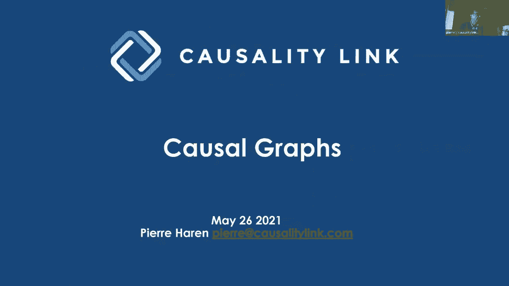
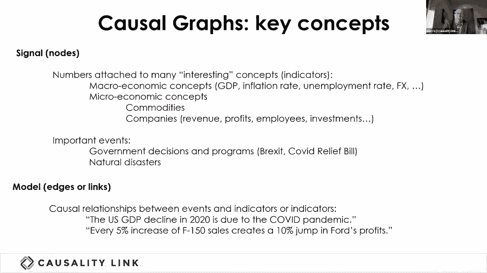
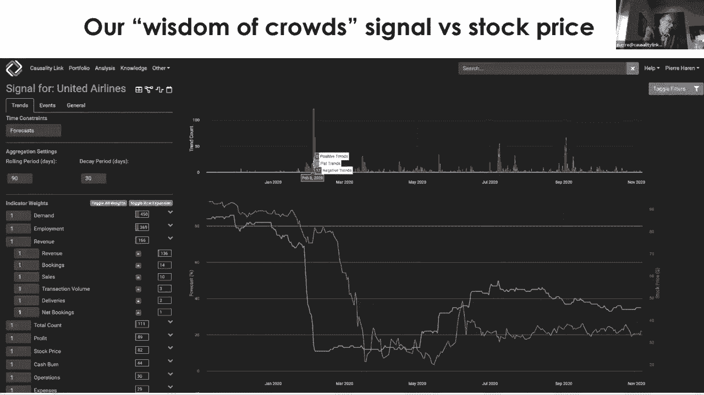
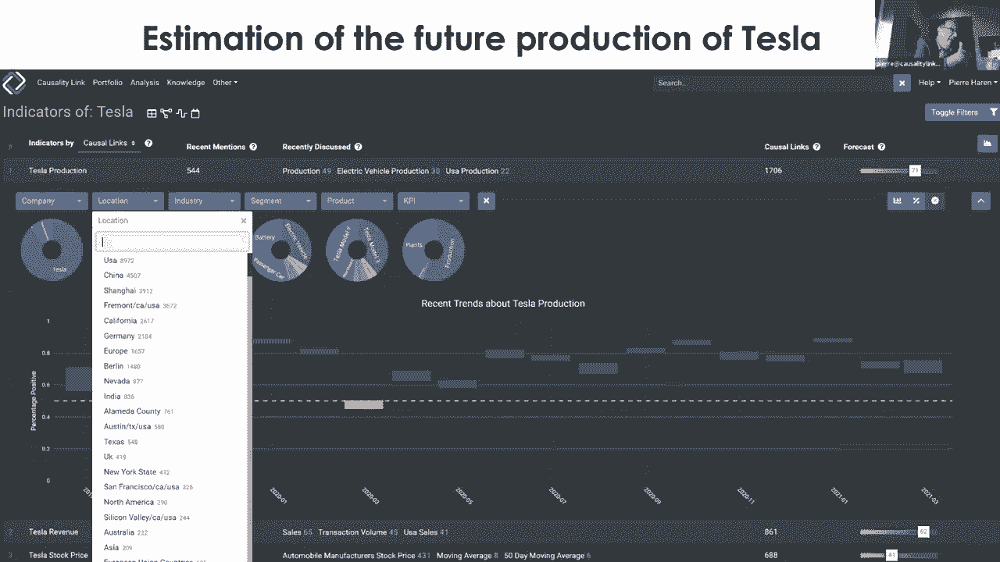
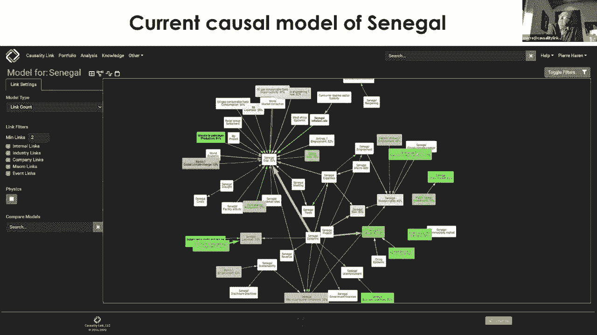
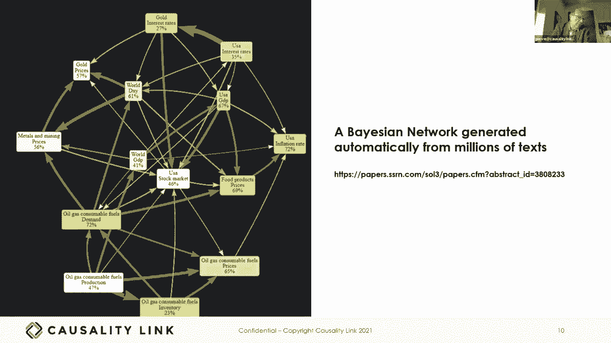
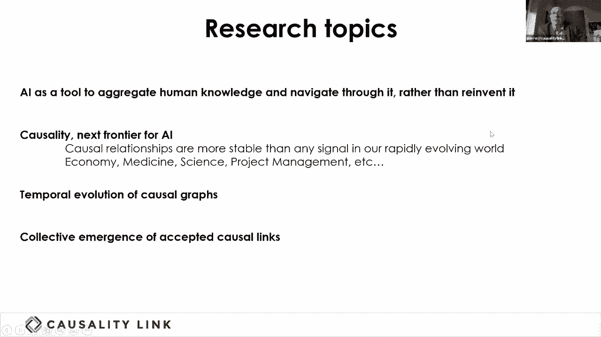

# P30：L18.1- 因果图 - ShowMeAI - BV1hb4y1r7fF

欢迎参加今天的知识人群研讨会，我们在课程的第九周，我们的重点是，知识图有哪些高价值用例，今天我们有两个精彩的演讲，关于知识图是如何在金融业中发挥作用的，皮埃尔会告诉我们因果知识图亚历克斯和娜塔莉亚。

他们将告诉我们如何将本体论用于破产预测，我们将从这里开始我们的会议，你谢谢你，我会分享我的屏幕，这是第一次，呃，现在我移动了一点，确保我那样做。

所有的权利，我们也是耶，完美现在，太完美了，好的，所以呃，下午好早上好，出席伦敦会议，呃，我要谈谈这个，我一直在研究的一种特殊类型的知识图，过去五年，它被称为因果图。

在我的轨迹上说几句话，因为我一直喜欢站在，呃，研究和工业，我在AI已经很长时间了，在麻省理工学院发现的，七十年代末，我在React做了一些研究后创建了一家名为对话的公司，我们在纳斯达克推出的。

卖给IBM，我喜欢规则和运筹学，所以有两种推理系统，我们在卖通用技术，但在90年代末，我们建造了一个现在看起来有点像得意门生的东西，它是从文本中提取知识的工具，我一直很着迷，呃，通过了解专家的想法。

所以我们五年前创办了这家公司，所谓因果联系，然后呃，我会的，呃，谈论什么，我们正在做的，然后呃，怎么呃，我认为这表明了知识图的一些未来趋势，所以首先我要尽量说清楚，今天早上五点受到了创伤。

诺贝尔奖的人倾倒信息的速度太快了，呃，是的，是的，所以呃，符号AI聚焦于现有的人类知识，建立未来的统计模型是非常不同的，正在建立一个明确的未来模型，我们会花时间在因果图上，好的，第二个想法是集体智慧。

对呀，所以集体智慧已经用数据很好地解释了，在人群的智慧中，还有很多统计证明，它的工作，小组，呃智商，一个群体的智商高于任何个人的智商，但它今天并没有很好地应用于知识，因果知识，这就是我们应用的。

但更广泛地说，不是事实的东西是主动推理元素，所以我想，人工智能的未来很大一部分就是这样，这是关于利用群体的集体知识来建立明确的模型，不是显式模型，仅仅来自几个专家，专家系统的构建方式，呃，在八九十岁。

但是呃，呃，呃，你知道的，以一种更自动化、更集体的方式，最后一部分是因果知识的重要性，我想关于为什么这本书的讨论越来越多，朱丽叶·珀尔的推理，这是因果知识的一个非常部分的要素，这是一个数学上纯粹的。

因果知识的基本解释，但我认为总的来说，当我看我所有的法律历史时，随着时间的推移，人类为了成为专家而获得的知识的很大一部分，是知识的原因是对原因的解释，当然还有，通过集体敲击来应用人群的智慧，呃。

我们的知识事业是一项迷人的努力，我将展示我们所能做到的，通过在金融市场上大规模应用它，所以我强烈推荐两本书，如果你有兴趣，他们是上帝的智慧，是一本比为什么的书更容易读的书，但他们今天，我觉得要追踪的书。

并创建一个基础，我要透露，去因果图，我觉得很简单，很容易把它分成两个概念，我们在模型中称之为信号，信号，它是所有与一个数字相连的时间序列的东西，附加在上面的数值时间序列，它们可以是不同国家的GDP。

通货膨胀率，外汇，各种各样的，呃，呃，不断变化的商品价格，这些商品的供应情况，以及所有与公司相关的参数，其中一些每季度才知道，但其中一些一直为人所知，比如潜在的需求和市场的积极情绪之类的，就因果图而言。

这使得节点相当复杂，就知识图而言，因为没有一个非常基本的节点，我们必须有一些东西来代表那个时间序列的独特定义，如果你说我对特斯拉的收入感兴趣，它必须是，呃，特斯拉公司很清楚。

但你可以说特斯拉Model3在中国的收入，然后你必须跟踪节点的非常精确的定义，所以其中一个，我们一直在努力，已经加强了描述的大小，呃，呃，描述什么是节点的本体，呃，在因果图中。

在很大程度上是为了能够实现聚合，例如，如果你对一切都有地理维度，你可以汇总所有电动汽车的销量，中国汽车，然后有一个时间序列，或者你可以汇总特斯拉的所有销售额。

或者你可以聚合世界各地免费的所有模式或任何权利，所以聚合作为节点上非常重要的推理元素的想法，呃是非常重要的，我将在几分钟内更详细地描述这一点，相反，因果图中的边更简单，比在常规知识图中。

因为与其被任何东西贴上标签，你知道一直是，呃出生在，它只是在说，呃，它只是在一个单一的，呃，推理标签，即驾驶员信号的演变对，可以看作是对目标信号的弹性，因此。

像美国国内生产总值这样的声明在2020年下降了，由于Covid大流行，意味着该事件，Covid-19大流行对美国国内生产总值产生了负面影响，当你试图解释影响金融市场的所有力量时。

聚合所有这些不同的语句成为手边自动构建的任务，这个非常大的因果图，在某些情况下，顺便说一句，弹性是显性的，大多数时候来自一个模型，所以这个，第二个陈述，销售额每增加5%利润就会增加10%。

来自摩根士丹利，呃，财务分析，我敢肯定这来自一个数值模型，他们有，那是，呃，使他们能够生成这个，呃，弹性，当然，我们的自然语言处理系统必须理解所有这些，为了理解在两者之间的影响中有一个因素二，呃。

五十细胞的进化，福特最畅销的卡车是哪一款，呃，他们最近刚刚生产了一种叫做闪电的电动版本，这就为它的利润创造了一个跃升，所以现在你有了关键的概念，呃，我可以，呃，去呃演示，好的，现在我的。

如果我能让那东西做到这一点。

好的，不知何故，我有一个冰冻的，所以说，我不太确定，你是说是吗，好的，所以这是一个信号，比如说，我们在20年为联合航空公司生产的，呃，橙色的，你有股票市场价格，我们刚刚得到的，呃，它不是，呃，非常，呃。

复杂，呃，从提要，在蓝色中，我们得到了一个合成信号，需求的组成部分，就业收入，我只是展示了收入本身，很多子组件，就是收入，预订，销售交易量交付量，我们所有的一千七百，呃，基本关键业绩指标，例如预订。

它们是聚合器，那是呃，中级，例如收入，然后我们从所有这些不同的地方得到的一系列信号，呃参数聚合，嗯在一个单一的蓝色信号，所以这里非常迷人的是蓝色信号，呃在股市上涨前一个月就下跌了，信号只被驱动。

但是红色元素的顶峰，如果你点击，我可以做一个演示，但是如果你一直点击红色的条，你会有所有与，这些负面趋势的存在，正如呃所说，我们正在解析的记者，我们正在用27种语言实时分析8000份报纸，呃。

自动翻译成英语，用英语解析，呃实时，所以这里发生的事情，呃，令人着迷的是，仅仅是信号，呃，似乎表明对需求有非常强烈的负面意见，在那个时候，美国开始关闭边境，与亚洲在一月和二月，在…开始的时候，呃。

二十二年二月，当股票市场，呃，合理地忘记了需求和收入之间的密切联系，然后这个水滴，也就是红条的第二个小峰，呃，基本上与航空公司暴露的所有担忧相对应，包括联合航空公司，关于他们自己的收入。

所以这是说这里有一个方法来为每个节点，呃，在这个，呃，在这个图中被聚合成一种超级节点，然后看时间序列的演变，呃的，呃的，呃，呃，成千上万的作者在自然语言处理中做出的陈述。

这有时会聚集成一个非常有趣的信号。

呃，方式，呃，它是聚合的，我们可以把它展示出来，例如在特斯拉上，如果我们看更多，我们更专注于特斯拉生产，所以你可以每月报告所有的时刻，一直在谈论特斯拉生产的地方，呃，呃，每个月和特斯拉的产量是，呃。

谈论植物，用谈论产品来制作，例如，谈论所有的位置，如果你点击美国，你只看到人们谈论的案例，特斯拉在美国生产的未来，然后你当然会看到三月份的下降，呃，呃，两千二，当加利福尼亚州和埃伦·马斯克之间的辩论。

关于弗里蒙特工厂的生产，所以这表明跨多维的聚合，那就是公司，位置，行业，这些片段，产品，KPI是因果图中的一个基本要素，否则德国三型车工厂之间的联系将会非常分散，呃，然后呃，那个呃，上海，呃，型号三。

什么型号的宽厂房，你希望能够在某种程度上聚合，因此，因为生产和收入之间的因果关系，比如说，不在乎，生产汽车的地方，这些是节点和对图中节点的解释。

这是非常迷人的，我们可以产生呃，具有这种意义的因果图，呃，有影响力的人，呃，在过去的七年里，在四万家公司的规模上积极或消极地瞄准B，所以在这个例子中，这是一个最近的Naio因果模型，呃。

所以Nayo是特斯拉的竞争对手，呃离开中国，呃，你可以看到文本中有一组非常强的声明，我们从，NIO收入对现在你的股价的积极影响，你现在的收入，呃，成为，呃，预测增长，现在你明白了这个小块。

现在你的收入是，事实上，我之前向你们展示了一个非常复杂的集合，比如说，特斯拉的产量和NAO的收入应该会增长，这是一个积极的影响，但现在你的股价正在下跌，因为它有，比如说，呃，底片，呃，的影响，呃，呃。

的短缺，呃，薯条之类的东西，所以理解一家公司在金融领域的动态本质上就是理解所有作用于，一点点，所有不同的节点，然后能够决定哪种力量会产生最大的影响，为了了解你是否知道，我不知道天气预报。

对niincome的积极预测比其短期更重要，负面预测和生产，同样的事情也可以对国家做，呃，也挺有意思的，因为你可以看到随着时间的推移，因果模型的演变，出现的四个国家，例如在塞内加尔，它是一个西非国家。

呃，国内生产总值，呃，一直是负面的，受到这一流行病的严重负面影响，但还有许多其他因素可能会产生看跌，对塞内加尔国内生产总值的积极影响，人权和所有因素，正如我们所认为的，这给出了一个非常有趣的，呃。

从来没有做过，作用于所有不同参数的所有因果力的模型，呃，为世界上所有的国家，正如我们在我们的，呃，在我们的，所以现在如果我们研究一下这些因果图，你能做什么，除了呃，教育，点击并访问所有提供最基本的。

我们从中导出这个聚合图的信息，这是可能的，我已经在抽象中提出了一个指针。

呃到我们的呃，科学论文，生成贝叶斯网络是可能的，所以贝叶斯网络，两种相反的性质，它们是非常纯数学的人工制品，可以用来，呃，创建模拟以传播概率分布，但是存在DAG有向无环图，因此。

我们的因果模型经常在金融学中表现出来，A均衡，你知道吗，石油价格对所有需求的影响，所有的需求都对石油价格有影响，你不能这么做，所以你必须从根本上选择类型，呃最强的一环，为了呃从我们的呃，因果关系，呃。

知识图生成贝叶斯网络，我们和亚历克斯·安·F合作过，他是一个写了几本书的人，关于亚洲网络在金融中的应用，他是德勤人工智能的负责人，为了生成，我们有一篇科学论文被下载了很多次，我鼓励你检查一下。

如果您对我们如何通过亚洲网络自动生成这些感兴趣，这是一个相当大的壮举，因为通常生成这么大的网络需要几天的时间，呃，多个专家在同一个房间，讨论条件概率或所有这些节点之间的条件概率，我们能够完全自动地生成。

然后我们甚至能够随着时间的推移产生这些图的演变，这样人们就可以，呃，比如说，在宏观经济方面，感知存在于。

我会以呃结束，关于下一步的一些想法，对呀，所以总是，呃，有趣的是不仅说嘿，你知道，呃，我们做了伟大的事情，和，令人惊讶的是，有可能自动生成因果图，仅仅从文本的精确度，我们这样做的原因。

但我们是一个更大趋势的一部分，我认为我们是许多更大趋势的一部分，我敢肯定，呃，更聪明的人在未来会进一步推广，第一个最大的趋势是集体智慧故事，人工智能不应该只被视为今天的样子。

作为一种看待数据和首先重塑人类知识的方式，因为这是一种非常复杂的方式来重塑人类的知识，还因为许多存在的人类知识并不存在于数据中，与拥有这种知识的人所做的决定相对应，所以呃，在源头聚合人类知识。

使我们每个人都能更有效地利用，所有这些人的知识，而不必阅读两种七种语言的一亿篇文章，这是不可能的，我认为这是一个非常呃，AI的长期目标，它是一个，这是一个人工智能，将是可以解释的。

这将把人类聪明的人介绍给其他聪明的人，而不是把人类交给黑匣子，第二部分是呃，我敢肯定因果关系会变得非常嗯，在人工智能的一部分，部分原因是因果联系比信号更稳定，因为它们要么代表自然力量，要么代表经济力量。

不以相同的速率变化的速率，信号，呃是变化的，你知道的，1。石油价格猛涨猛跌，但归根结底，所有东西的价格都与供应有关，需求与消费的关系，需求本身与我们正在进行的消费有关，还有呃，当我们看到呃。

绿色转型需要很长时间，也很痛苦，这使得因果模型，石油消耗的发展速度远低于，任何信号的演变，然后我们可以很容易地在医学上看到这一点，呃，有一些呃，因果努力，因果图的自动生成不多。

但是医学上的许多手工生成因果图，我想这只是开始，当然对我们来说，更吸引人的是，尽管我有点自相矛盾，因果图正在演变，但它们进化得很慢，但是理解因果图的时间演变仍然是非常有趣的。

这就是我们的力量如何随着时间的推移而移动，知道力可以存在而不被激活，如果你有一个从来不动的司机，比如说，如果橡胶的价格不动，呃，每个人都知道这会产生影响，如果它在价格上移动，呃，关于米歇尔的盈利能力。

然而，呃，存在因果关系，但不是由驱动程序的变体激活的，所以，因果图的时间演变比，每个时间序列的时间革命，呃，它对应于这个图中的节点，最后我想告诉你的是我对，我们如何集体决定某些因果联系是真的还是假的。

当然还有，今天，看到武汉实验室Koleak的理论很迷人，完全从假新闻或，呃，阴谋论，成为一个潜在的诚实事业，在一场造成世界如此剧变的流行病中，我想这是，呃，那是，当你有因果联系的第一个信号时。

就不那么容易了，不容易察觉是不是某个非常聪明的人，发现了新的东西，或者某种虚假的阴谋论，这些阴谋论将被忽视，然后呃，那东西可以在过去的一年里进化，它已经做了一半，并通过这种集体信仰进化。

我们作为一个文明正在建设的，呃很迷人，我认为对AI来说这将是一个非常有趣的话题，呃应用自己，呃在未来，帮助人类朝着正确的方向进化，所以Vinay在那，呃，我已经完成了我的演示，我会给你回电话。

我要停止分享。

是啊，是啊，谢谢。皮埃尔的精彩演讲，接下来是亚历克斯和娜塔莉亚，亚历克斯交给你，娜塔莉，我们听不见。