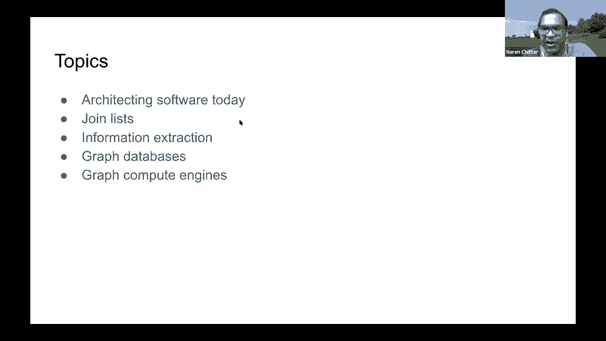

# P32：L19.1- 构建知识图谱的开源工具调研 - ShowMeAI - BV1hb4y1r7fF

欢迎来到今天的知识图表研讨会我们已经进入第十周了，研讨会的最后一周，我们有一个非常有趣的系列，呃，到目前为止，本周我们将结束这个系列，今天我们想，呃，向您展示构建知识图的实现工具的调查。

这是我们一直在问的一个问题，呃，经常，呃，人们欣赏了概述和概念，以及我们在研讨会上讨论的理论，但人们想知道他们应该如何开始一个项目，他们有什么选择，有哪些软件实现平台，它将给我们一个很好的概述。

在他的分之后，呃，我要花十分钟十五分钟来总结一下这个系列，给你一些关键的外卖，呃，尤其是关于知识图的新内容的主题，因为很多时候人们说，哦，你知道的，这只是旧的语义网络，但肯定有一些新的发展。

这里有一些创新，我想向你们介绍我对此的看法，好的，所以呃，让我们开始演示文稿的第一部分，向你走来，当我让我分享我的屏幕时，谢谢，很好，这里有个礼物按钮，看起来不错，你们都看到了吗，好的，听起来不错。

平常的东西，这些是我自己的观点，与我的雇主无关，我没有任何软件的应用程序，但我是其中许多的粉丝，只是印象深刻，其中一些开源项目有多神奇，呃，这些是我今天要讲的粗略的话题，嗯。

我认为今天的软件架构是非常不同的，这一切都是关于代码的重用，而不是从头开始写作，通常用于知识图，因为它是一个经过高度处理的结构化数据数据结构，通常通过这些步骤，你必须加入很多数据源，有时你加入列表。

有时你加入，嗯，你会从非结构化的片段中提取信息，像网一样，喜欢新闻文章，等，在你做了大量的处理之后，您将其存储在图形数据库或检索中，然后是另一类软件或图形计算引擎，它们很适合做大规模的计算或图形。

所以我会把它们都过一遍，你将是一个旋转之旅，所有这些类别，会有点宽，第一次搜索，我不会讲得太深，希望在这次会议上我们能有很多问题，然后我们可以花很多时间回答这些问题，那么今天架构软件有什么不同呢，嗯。

所以很多，很多事情都变了，我第一次从大学毕业是在1997年，一切都是关于我在家里写了多少行代码，你是在写这几千行代码吗？这是面试中的一个典型问题，现在正好相反，您重用了多少包，嗯，如何有效地利用。

如何高效地创建软件，嗯，利用外面所有可用的东西，和，我认为总体策略是把一个高层次的问题分解成更小的部分，然后把每一个都映射出来，每个组件，子组件变成一些，有些，一些软件包。

你可以从开源世界或其他地方找到，或者其他供应商，或者类似的东西，然后您编写大量代码来配置并将所有这些部分粘合在一起，所以我认为你需要成熟地将一个子组件映射到一个特定的包。

那么您需要了解如何配置并将它们粘合在一起，由于呃，我认为这是一个很好的问题，现在开源软件包的选项太多了吗，然后是一个像搜索排名这样的问题，那么你需要自己的排名功能，好的，它是一个著名的消息来源吗。

对于所有这些指标来说，有多少颗恒星，然后您可以就使用哪些包做出明智的决定，酷，所以首先，让我们来讨论前两个话题，比如联接联接数据和从列表，以及从非结构化来源连接和提取信息，让我看看我的笔记，酷所以嗯。

通常你要创建知识图，这是一个非常常见的任务，你会一直做，当我在一次讲座中谈到这个问题时，所以我不会深入探讨，但通常你需要，这里有一个例子，我们希望对苹果和其他公司有一个更全面的了解。

然后你所做的就是从不同的来源购买或创建列表，然后你需要匹配这些列表，问题是没有好的键来加入这些列表，如果你看看苹果和苹果电脑，你可能没有足够的信息说它们是相同的记录，但是当你包括地址时，比如说。

你变得越来越有信心，哪些记录实际上是在谈论同一个实体，哪些不是，所以这是一个很常见的任务，你要不断地做一次又一次，那么你是做什么的，嗯，你找到一份你的名单，你看看这些记录链接软件的开源社区。

有很多可用的，这是最全面的，我发现了一个叫d dupe的包裹，呃，它是一个原生Python包，然后嗯，它为您提供了非常非常好的编程访问，所以首先，你用这些数据类型定义所有的列名，嗯，有这些原语，如文本。

短文本日期时间，等，但还有更多的语义，语义类型的种类，较高职等，呃，数据类型，如价格地址，然后他们给你很多不同的选择来匹配，每一个都以模糊的方式，呃，所以这是一个非常非常全面的一揽子计划。

您甚至可以定义自己的类型，你甚至可以创建自己的，嗯，匹配匹配算法，它们提供了很多内置的，比如说，如果你如果你把某件事定义为很久，如果有生意，有一个很长的柱子，它就会，它有一个非常好的指标。

我想这叫海森距离，它只是不计算最后一个长的欧几里得距离，它实际上考虑了地球的曲率，好像它是一个它是一个球体，呃，有很多不同的，良好的地址匹配和解析技术，姓名，等，如果你还记得我教你拦网的时候。

他们有很多，呃，默认阻塞技术，您可以配置阻塞技术，也有两三种不同的，如果你有哪些对的例子，哪些记录属于一起，它实际上会，默认情况下，能够学习逻辑分类器，然后你就可以，当然啦，用其他标量方法更新它。

但它有一些内在的，如果默认使用，它只是计算余弦距离，然后你要给它一个阈值，然后根据你是否有UI或类似的东西，你实际上可以把它推入他们的模块进行主动学习，所以你可以学得更快，给出了更少的例子。

算法对此不太自信，所以有时候你可以用机器学习做任何事情，有很多情况下你不能使用机器学习，你只需要最简单的方法可能是，只需编写一组规则，人名匹配是其中之一，呃，我们一次又一次地遇到的任务，很容易说出来。

你知道吗，让我们用一个预先创建的字典，所以有人创造了一个非常好的，昵称词典，小名字，等，对于西方来说，西方名字，所以它是相当全面的，所以这是你用的东西，在其他情况下，你的名字的拼写方式非常不同。

然后你必须找到一些声音甲板的实现，或者今天他们用双音变音，是重用这类技术的一种非常常见的算法，把这些转换成语音表示，它实际上会匹配，所以这是我们必须使用的一个常见的东西，他是一个很好的。

某人创造的一张漂亮的桌子，这个用户创建的最常用的，UM记录链接软件，看看所有的专栏，他们有API吗，有贵人吗，他们中的一些人有桂，以便以更有效的方式使用它们，嗯，连接重复，监督学习。

所以所有这些漂亮的功能，酷，所以接下来，让我们来看看非结构化数据源，所以世界上大部分的信息都是，我觉得，以非结构化文本的形式出现，非结构化信息，如文本，新闻文章，报告，电子邮件，等，然后呃。

解析出信息是一项相当困难的任务，在这个文本上进行信息提取，并将它们转化为这个空间中的知识图，我对一个叫做spacey的开源软件包非常满意，这是一个NLP软件，嗯，不像NLTK，nltk，呃。

我想很多人都用过LTK，更多的是为了研究目的，给你很多不同的选择，就像十种不同类型的标签器，代币器，这是一个很好的实验和学习包，但是史派西已经优化了，比如构建现实世界的软件。

所以它有很多预先构建的词类模型，纳尔名词分块，您甚至可以创建自己的自定义，和从，假设你有生物医学申请或法律申请，在那里你有不同种类的实体，比如分子名之类的，英语的句法是不同的。

那么你就可以从头开始为任何R模型构建自己的NR软件，或者你可以改进现有的NAS，他们有一个非常好的，呃工具，一个叫做Prodigy的用户界面工具，你可以很快地构建所有这些模型，所以想象一下你有。

你可以雇佣几个能使用这个神童的用户，ui，你可以很快地浏览几千个例子，我认为也有一个积极的学习组件，所以如果嗯是这样，这东西用幕后建造了这个神童，在标记示例时构建模型。

然后它选择示例并对示例进行优先级排序，分类器不确定，嗯，所以这是一个非常好的软件正在做的，它还包括一个实体链接框架，所以我们在课堂上学习了实体链接，所以我不会穿过它们，去那个。

但是spacey还包括实体链接框架，它是一个框架，它实际上并不链接到数据库，但外面有人，它叫太空，实体链接器，他们创建了一个映射到Wiki数据的链接器，所以它是预先构建在维基数据上的。

所以你可以很好地使用它，差不多可以用了，酷，所以这大概是，嗯，如何从文本中提取信息，哦，spacey还提供了一个很好的功能，那就是依赖解析，所以看看这里的这句话，因此。

如果您想了解有关依赖项解析的更多信息，去拿CS 2 2 4 S，克里斯，曼宁或珀西·杨得分，我们将告诉您所有关于依赖解析的知识，但本质上它创造了这种，这里有一个图形结构，看这句话，约翰和金结婚了。

1998年，你就像一个图表，它是有棱角的，有向边，它们是根据英语语法贴上标签的，你可以用所有这些信号来构建一个图表，事实上，如果你看看外面，你会得到很多主题的实现，项目，谓词，对象。

使用spacey依赖解析的三重提取，好的，酷，所以有人创造了一个非常好的包，叫做间谍性爱，它是用于知识提取的太空管道，它是一个整体，要通过的端到端管道，从非结构化文本一直到构建一个称为Wiki图的图。

这是参考应用程序，它们包括了所有这些不同的组件，所以它很新，所以我鼓励你看看，现在让我们来，让我们来看看图形数据库，所以想象一下你做了所有这些工作，按摩，提取和处理你的清单，然后你增加所有这些，呃，从。

非结构化文本，现在你有了一个知识图表示，现在你必须把所有这些信息存储在所谓的图数据库中，所以图数据库非常类似于SQL，数据库更多地用于在线事务处理，而不是分析处理，我将在下一节中介绍分析处理。

也就是图形计算引擎，所以在选择图形数据库时，有很多不同的维度，你可以在其中评估它们，他们是否有分布式实现，那是酸吗，它支持哪些查询语言，不像SQL，还没有很好的标准化，最近在图形世界里。

密码已经领先了一点，但我还是觉得像续集，没有明确的赢家，也没有明确的标准，然后对于现实世界的项目，有很多其他的维度，是管理的吗，定价是多少，什么是支持，生态系统，插件可用吗。

是否有开发人员可以为您的项目工作，支持您的项目，所以很多不同的维度，然后我会经历其中的两个，实际上一个是近地天体四J，所以Neo 4G实际上提供了，是啊，是啊，所以Neo 4J是我见过的最受欢迎的。

他们有两个版本，一个叫做社区版，它是开源的，然后他们有一个企业版本，我不会经历太多的深度，如果你看看去年去年的课程，你会发现一个非常好的视频，来自接近4J的人，所以这是一个属性图，它是水平缩放的。

它有很多访问控制，你可以我认为节点级和边缘级访问控制，所以你可以给这些节点贴上标签，然后给一些人访问控制，有些用户可能无法看到所有节点，我想他们是密码的主要驱动者，他们有很好的支持。

驱动程序通过不同的编程语言以编程方式连接，他们有一个用户界面，如果你去专业版，那么您就有很多托管故障转移的选项，备用求解器，但我不会深入太多，我在这里给出了链接，所以你可以阅读更多关于它的信息，酷。

所以接下来是因为云如此流行，我想我只提几句关于亚马逊海王星的台词，它不是开源的，但如果这里有人，这里的一个学生或任何人打算，我知道斯坦福创造了斯坦福，学生就像最好的企业家之一，你可能有一个想法。

如果你这样做了，他们需要知识图或图dbs，亚马逊海王星是一个很好的选择，这是一个相对较新的产品，它是被管理的，它既有属性图又有，小精灵和火花界面，查询接口，它是酸的，对亚马逊三个的持续备份，嗯。

如果你有一个，如果您的产品是全球不同地区的用户，不同区域之间有自动复制，如果你有，如果您正在处理敏感数据，它有静止的加密，运动中的加密，嗯，如果你在一个，在金融这样的行业，像金融这样受监管的行业。

或医疗保健，是从日志中自动审计，您可以生成相当好的日志，这些日志有很多信息可以用于AUD，事实上，他们迈出了一步，甚至嗯，他们，他们采取下一步，让他们，他们基于图形数据库设计了三个常见的用例。

所以身份换身份，嗯，和个性化，欺诈检测，以及关于，所以他们定义了三种在亚马逊海王星上建造的产品，所以如果他们中的一个，其实，如果你能把你的后端放在其中一个，那就太棒了，你可以开始使用它们。

而且定价很有竞争力，这可能是你以最低的成本推出产品的最好最快的方式，酷，嗯，这是一个关于图形数据库的部分，我在做一个快速的时间检查，好的，所以我再去十到二十分钟，所以图计算计算引擎与图数据库略有不同。

它们主要用于对图进行繁重的计算，假设你有你的图表，现在你想在上面做一个非常大规模的计算，比如Pagerank或社区分析社区检测，所以这是一个单独的软件类别，属于这个类别图计算引擎，有些像近地天体四J像。

如果你看看近地天体四J，它们有很多特性，实际上把它们放在这个类别的图形计算引擎中，但通常它们是不同的，所以让我来看看其中的两个，嗯，设计得很好，一个就像一个非常原始的包，叫做网络X。

这是一个Python包，非常非常活跃的包，很多贡献者明星，乡亲们，这一切都在记忆中，所以你必须以编程的方式构建一个图，下面是您看到的一小段代码，和你有关的权利，如果你是一个优秀的Python开发人员。

你应该试试这个，嗯，在记忆中，它有一个Python接口，它没有查询语言，等来查询图形，但如果有其他可用的软件包，为此创建了一种查询语言，如果你是蟒蛇专家，它非常灵活，你其实可以，如果您的节点。

如果你的类，Python类是可实现的，等，您实际上可以将任何类型的对象发射到节点和边缘中，它很富有，非常非常丰富的算法，所以我要点击这里，看看有多少算法，它查看了所有可用的算法，只是太神奇了。

令人印象深刻，其实，嗯，所以各种各样的东西，所以肯定用，使用这个包，呃，如果你想要一个平原，非常简单，下一个好的，所以这里有一个很好的，是啊，是啊，所以这里有一个非常好的演示，有人创造了，呃。

基于网络X完成社区检测，嗯，所以这是一本你们都知道名字的小说，然后嗯，我想是维克多雨果写的，然后有一个，这些都是在，呃，在小说中，然后有人真的创造了一个CO，同一章中提到的字符的出现矩阵。

然后他们运行了一个社区检测算法，它们是代表那些的颜色，有人创造了一个非常好的，呃，使用名为D3的包进行动画，我提到了三个，因为它又是由，它是一个JavaScript可视化软件，由斯坦福大学毕业生创作。

让我看看这是岩石协方差矩阵，然后使用D3 D3有这种可视化，我不知道，我不知道你是否能看到所有漂亮的动画，但是呃，你实际上可以做社区检测，做这种可视化，这样我们就可以得到，我们可以看到动画。

但这个动画到底展示了什么，所以它显示了以下内容，呃，从协方差矩阵，它实际上试图根据哪些角色可能都认识来猜测，可能是一个社区，并相应地给它们着色，然后这整个花哨的动画是一个很好的方式，重新排序行和列。

所以所有这些社区，他们是，它们一起出现在这个可视化中，清楚了吗，是啊，是啊，我想这很清楚，听起来很有趣，所以你知道，如果呃，人们已经验证了这一点，好问题，我其实不知道，我不知道人们怎么，如果人们被验证。

或者这里的所有这些群体，这是一个社区，实际上彼此认识，我不是很好的问题，我不知道，但在这里他们跑了，呃，卢万，卢万社区检测算法来创建这些社区，猜测这些人可能认识对方，这是个很好的问题，其实。

我们需要有人来验证这一点，酷，嗯，好的，所以网络接入很棒，如果你很了解Python，您的数据集适合一台机器，如果您的数据集更大，您该怎么办，如果你用你的知识图做得更大，那我觉得你有问题。

垂直缩放是非常昂贵的，很难买到闸板越来越大的机器，um和水平，你必须诉诸水平缩放，那么你是做什么的，然后嗯阿帕奇火花，这是最受欢迎的，um并行计算引擎，并行分析引擎，分布式分析引擎，这是一种，的。

Hadoop的下一步，所以前身是Hadoop，现在人们用阿帕奇火花，桑福德和阿帕奇火花有很好的联系，Matea Aria是Apache Spark的创造者之一，所以你可以用阿帕奇火花。

Apache Spark有许多不同的模块，一个用于机器学习，一个只用于数据库，操作种类，他们有一个叫做图形的模块，它非常适合创建图形应用程序，然后嗯，我在斯坦福那边找到了几个非常好的教程。

把你指向阿帕奇，阿帕奇，阿帕奇火花，整个阿帕奇的火花，特别是图形模块，所以X在这里，阿帕奇火花，主对象或类称为图类，这延伸了他们的主要，名为RDD的um类，弹性分布式数据库，这是他们对分布式列表的实现。

他们定义了很多运算符，在图表上，他们的财产经营者，结构算子，让我们说，你想你想颠倒你的整个图形，您想创建反向页面排名，因此，与其读取整个百万节点图，然后复制并创建一个，有非常高效的并行实现。

对图中的边进行反转，然后来这样你就可以创建，您可以计算PageRank，非常有效地反向寻呼，所有这些邻里接线员，想象一下你有一张Facebook图表，你想快速地说出每个用户拥有的邻居的平均数量是多少。

所以你可以使用这些运算符和整个，嗯，我想整个努力，阿帕奇火花图形家伙花了是并行的，呃，实现，在ml端非常高效的实现，他们没有太多的算法，他们只有页面排名和个性化的页面排名，在所有这些离散算法的空间中。

他们只有两三个，所以根本没有网络X丰富，但是如果你的图很大，那么我想你可能会被阿帕奇火花之类的东西困住，对于这里的学生来说，如果您正在寻找一个项目来为一个开源项目做出贡献，你可能会试着加入这个项目。

丰富他们的图表，或者这个或者只是他们的图算法，包装，很酷嗯，那么清单上的下一个是什么，我已经用完了阿帕奇火花，酷，嗯，所以我想就是这样，所以我让我回顾一下我给你带来的很多信息。

我刚刚告诉你今天的软件是如何架构的，以及您如何看待开源社区，以一种非常聪明的方式来弄清楚如何映射组件，并向您展示一些关于如何加入列表的软件，列表的模糊连接，呃，然后我说，在那里我说了D欺骗。

这是一个非常可定制的Python包，然后我谈到了史派西，它允许您从非结构化文本中提取信息，所有的NR链接，如何使用空间空间构建自己的模型，嗯UI被称为史派西神童，然后我讲了一点关于图数据库的知识。

然后我谈到了neo four j一个开源社区，然后我谈到了我谈到了云管理，然后我谈到了图形计算引擎，假设你有一个图表，你想做这个沉重的分析，呃，它的工作量，嗯，所以网络X中的阿帕奇火花。

这是一次旋风式的旅行，呃，当你创建一个知识图时，你将经历的最典型的步骤是什么，所以有了这个，我想我的演讲结束了。

呃，Vinay交给你，有几个问题，呃，我们可以从阿南德开始这两个问题，呃，我们如何匹配公司之间的关系，比如说，柑橘逻辑是苹果的供应商，我们要不要用，你还是史派西，或实体链接，或维基数据，或。

所以你需要一些消息来源说，卷云逻辑是苹果的供应商，你需要看看新闻，呃，有时对于重要的供应商，呃，苹果会在他们的文件中提到这一点，在他们的，呃，金融SCC十K或八K或严肃的逻辑可能。

如果这个逻辑大部分时间都想，小公司提到大公司，所以你必须看看这些，呃，um的来源，对于这条信息，有很多像FactSet这样的供应商实际上策划了，有一群人看着所有这些文件，他们出售所有这些信息。

这样你就可以，如果你用它来工作，或者你可以花那么多钱，那么你甚至可以从供应商那里购买这些信息，或者让你只是看看新闻，在上面运行史派西，呃，在其上运行实体链接，运行关系提取，等，用你自己的权利创建这个。

所以这是呃，似乎识别某人是供应商还是其他人，这不是真正的链接问题或做问题，这更像是一种关系提取问题，是呀，这是一个关系提取问题，然后加强边缘，要真正自信，因为呃，因为Web不包含精心策划的信息。

然后你要看很多文件，如果在多份文件中有强有力的证据，那个严肃的逻辑是苹果的供应商，那我想你可以，你可以说好，我将策划这个节点，为什么当你查看那里的多个文档时，我想你可能需要用d dupe。

或d dupe的字符串匹配功能，您可能需要使用实体链接，等，史派西，为您提供关系提取库，否，所以他们为你提供了构建块，你可以用来提取关系，所以他们首先提供了任何名词的分块，然后他们为您提供依赖关系图。

这样您就可以遍历依赖关系图，然后你就可以建立自己的关系了，如此如此好吧，如此卑鄙的史派西，没有关系提取的交钥匙解决方案，有没有另一个包裹有，呃，所以我看到了，比如说，有一些包装可以做SVO。

主语谓语与宾语提取，嗯，我见过一些软件包可以进行某种关系提取，但根据我的经验，没有一个是太好的，所以你必须在你的数据集上训练一些东西，简单的挑战如下，假设你在新闻文章上训练一个，新闻文章的正文。

但当你在另一个上面运行它时，语法略有不同的数据集，即使你运行它运行一个已经建立在新闻文章正文上的，然后你把它放在新闻文章的标题上，它失败得很惨，因为的语法和句法，嗯，新闻标题不一样，所以你很可能要训练。

你拿着软件训练自己的提取器，那很好，我认为价值所在，好吧那就有个问题，我们能一起使用AWS海王星网络X图形吗，端到端机械有交钥匙模板吗，推出一个基于公斤的系统，呃，是呀，所以他们都在编程，呃。

所以使用网络X可以以编程方式使用，可以使用图形，简单的答案是肯定的，呃，你可以很容易地把所有这些东西绑在一起，网络X和图形很容易打包、工作和加入，互相连接，因为他们都是，嗯，是一个提供休息的包裹。

apis，和其他类型的API，你的另外两个程序实际上可以与之通信，所以你实际上可以创建一个系统，将三者结合在一起的复合系统，好的，好的，呃，有人知道一般的公斤工具，一个可以用于博彩供应商，比如说。

分级许可证，定价类型，等，这是我没有遇到的，遇到这个，你会看到所有这些，我在那里没有看到任何公式或任何形式或任何东西，真正评估它全靠你了，对于您自己的用例，是啊，是啊，我是说再来一次。

我想冒着把自己的想法推到这里的风险，我是说，如果你如果你要审查供应商，您可能会指定某种基于规则的知识，你会用它来再次检查它们，我不确定你是否，这个问题更适合机器学习，因为，根据你过去的做法。

你可能不想得到供应商，对呀，你想做一个有意识的决定，至于为什么这个供应商对你有好处，这就是您希望在程序中显式编码的知识，对，我们已经讨论过这方面的例子，呃，在整个课程中，呃，当我们在谈论，嗯嗯，你知道。

知识图推理，我们有一个利益冲突的例子，对呀，所以当你检查利益冲突时，你写规则说Pinterest的冲突是正确的，所以对我来说，这似乎是一个问题，它有一个基于规则的组件，是啊，是啊，这是一个很好的观点。

太酷了好吧，你想让我读问题吗，是啊，是啊，我只给你，我可以安贾说得很好，我们在哪里可以读到使用开放源码组件构建软件的现代方式，到处都是，所以我会告诉你我个人是如何努力赶上的，然后也许呃，当你和迈克。

也可以给出你个人如何赶上所有这些新软件的想法，软件，所以订阅了很多时事通讯，看科技新闻，呃，它在看GitHub，无时无刻不在，他们有一个叫做趋势的功能，嗯，你可以按星星排序，他们每周都有，他们有一个嗯。

他们那里有一个模块，它告诉你上周所有的趋势软件，嗯，在领英上，有一个，有一个叫菲利普凌空抽射的家伙，谁策划，继续，在他链接的LinkedIn提要中，他提到了所有这些，很棒的软件，所以我跟着他，所以有。

我想所有这些不同的方式，嗯，也许当你和迈克可以建议一些方法，我的建议是继续参加知识图表研讨会，呃不，我是说，我觉得你很好地回答了这个问题，我没有更好的答案可以补充到麦克风上，怎么样你在干什么，我不是。

你知道的，因为我是，嗯更多，也许更多的是在研究界，我最关心的是阅读文献，并试图找出什么新的想法来融入，不像你和维奈那样广泛地跟踪，这些功能被放在这些不同的存储库中，比如GitHub，所以我了解了他们。

正如费伊所说，通过听你们听我们在这里听到的各种不同的演讲者，然后嗯，我有很多邮件列表，似乎已经找到了他们的方式，邮件似乎找到了进入我邮箱的方法，所以呃，就是这样，但是是的，我没有什么可说的了。

比你们已经说过的要好对吧，所以有一个问题，是否有基准或知识图表，嗯，所以我见过几个计算，我见过很多不同的包装，在计算PageRank时比较他们的数字，比如说，这就像在图上的计算，但是对于构建图表来说。

我敢肯定有喜欢，也许是维基维基百科什么的，哦，但我没有，我已经，是啊，是啊，我什么也想不起来，是啊，是啊，我是说，我认为它们大多是任务特定的基准，对，所以如果你在做实体链接，那么就有一个基准。

如果你在做关系提取和关系提取，你提取的关系有许多不同的变化，每个都有自己的数据集，自己的基准，我是说那里有一大堆东西，那么如果你只是对…的原始性能感兴趣，在知识图上做推理的um，这将需要不同类型的基准。

好吧，这是一个完整的空间，我们是，我没做对，我不知道还有谁，是啊，是啊，问得好问得好，我不知道，我不知道，最令人沮丧的是什么，烦人，构建知识图的耗时方面，你的经历有什么故事吗，我想你知道的第一部分。

你知道，加入这些列表，然后从这些非结构化文本中提取信息，那需要很长时间，它根本不是百分之百准确的，所以这是一个保证，它是你的，你可以百分之百准确，你不会准确，那么你是做什么的，那你怎么Q。

你如何获得反馈循环，你怎么，呃，让您的用户对此进行更正，你怎么含蓄地，显式反馈，内隐反馈，质量，所以我认为在构建知识图时有各种各样的挑战，这就是我遇到的，不如，呃，你们两个，是啊，是啊，我是说，我同意。

嗯，这是一个，这是一个嘈杂的过程，对呀，这是一个嘈杂的过程，然后嗯，你必须处理规模，这可能是令人沮丧的权利，以确保你得到你想要的准确性，人们倾向于声称一切都可以自动完成，但在实践中，这是不可能的。

对我来说，这是最令人沮丧的部分，人们宣传他们的解决方案是全自动的，而它实际上不是，我是说你还得做很多体力活，他们不告诉你这件事，是啊，是啊，我同意对我个人来说呢，一件事就像学习这些不同的图形查询语言。

像SQL是相当直观的，等，但是我遇到的这些图形查询语言，学起来有点挑战性，有点不直观，你对此有什么印象？嗯，我想从我对CIR的了解来看，还不错，但我认为中情局和火花他们都很好，我想你知道，是啊，是啊。

它们是基于三重的语言，我认为他们有一个很好的SQL正式翻译，如果你想为我，个人查询语言并不是图形系统的挑战，也许是因为我对这些语言是如何组合在一起的有合理的理论基础，但是。

你们能分享一下对一个好的过程的见解吗，首尾相连，涉及自动化和手动管理，以推出一个新的基于公斤的系统，答案是个好问题，但这也是一个非常广泛的问题，我不确定是否有一个公式来指导你如何正确地做这件事。

这不取决于什么数据，你有问题，你试图解决你有多少资源可以支配，我是说，i，我不知道这个问题是否有现成的解决办法，是呀，我同意，然后耶，它是，非常凌乱，几分钟前我们在讲座中谈到的事情。

然后如何让用户参与进来并保持图表的新鲜，等没有简单的公式，好的，所以有一个问题，人们可以使用图DB进行图计算吗，图为OLTP，图计算是OLAP，你能用一个换另一个吗，我想雨滑很清楚地解释了这一点。

我想我从幻灯片上得到的是，如果你对资产属性之类的东西感兴趣，你想做正确的交易，那么您需要一个图形数据库，因为您将正确地更改数据库，而您不能，它不是纯只读操作，对呀，而OLAP或分析，它们主要是只读操作。

你更新的不是很清楚，如果你想做更新，你不应该用OLAP，如果你用的是OLAP，如果你只有读数，您可能会进行优化，你做不到的，如果你必须读和写都这么清楚，您可以为OLAP使用OLTP系统。

很可能不会那么快，因为您必须优化读和写，是啊，是啊，我对此有一个评论，呃，在这条评论中嵌入了一句话，似乎图dbs没有多大用处，所以假设你想做的只是遍历链接，或者类似的东西。

您可以很容易地在SQL数据库中实现它，但是你必须索引其中的一些列，然后匹配，实际上你自己做遍历，如果您查看图DB是如何设计的，呃，对呀，在节点中，有指向下一个节点的类似C的指针。

所以所有的遍历都变得超快，所以在你必须，这些节点真的很快，在那里，i图dbs非常非常有用，是啊，是啊，是啊，是啊，我想我们在课堂上也讨论过这个问题，我比较的地方，呃，在一个非常简单的例子上。

如果你用图表来建模它会是什么样子，与使用SQL右建模相比，SQL查询结果是更大或更长一点，对吗，与查询和图表相比，我也说过，你知道的，您可以编写一个从图形查询到关系查询的翻译器，事实上，嗯嗯。

关系点AI人正在建立的系统是在他们的精神上对吧，所以我的意思是它们的底层存储是纯粹的关系权利，但它们仍然接受类似图形的查询，该语言允许类似图的查询，这样您就可以进行紧凑的查询，他们实现了特殊的连接算法。

在，在图形查询上，好的，那么我们要回答哪个问题呢？让我，其实，有一些，聊天里也有很多东西，好的，嗯酷，这样你和我就可以阅读，聊天很公平，你是一个不，它是，它在QA里，Q一个盒子，呃，好的。

任何可能有助于逐步采用KGS的想法或工具，而不是采取大爆炸的方法，所以我总体上说，如果是知识图的简单应用，你不必做太多的手术，类图形操作，只是遍历，或者类似的东西，只需使用续集，自己实现所有的遍历。

你将无法做很多事情，比如，然后计算最短路径，做所有的图形，类型分析，子图，页面排名社区，但这一切都取决于，也许您有一个简单的应用程序要创建，是啊，是啊，我想另一种说法是如果你有问题。

他们的解决方案正在失败，然后看一个图形系统，我不认为推行一个基于图形的系统是有意义的，只是为了推一个图形基础，如果你在使用关系系统，它对你手头的任何问题都有效，只要继续使用它，对呀，是啊，是啊。

使用关系使用搜索引擎，不知何故找到使用搜索引擎的聪明方法，嗯，如果你能过得去，就这么做，所以这里的这个，当我为基于KG的用户体验系统分享了一个很好的UI框架时，在D3中是很好的模板，我不知道具体是什么。

但是三个有一套很好的可视化，它们是交互式的，你可以看看，作者有一个很好的网站，作者从不同的人那里策划了大量的例子，呃，发送他们的想法，所以你实际上可以通过，然后你就会有一个很好的主意，所以有人说。

对于非专家来说，什么是一套好的工具，用于构建知识图，我是说，我不是很确定，没有一个专家能轻松地构建一个知识图，这就是为什么我们有关于这个主题的课程，一次又一次，你知道，非专家是，这是一个非常广阔的领域。

你知道我的意思，有非专家程序员和非专家CS，人与英语专业学生，对呀，所以我不知道我们在这里说的是什么样的非专家，是啊，是啊，这取决于数据源，假设你有五个列表，您想要连接在一起并创建知识图。

我今天提到的一些加入列表的包，他们实际上有UI，他们有一个UI，然后你可以让非技术用户，呃，加入那些名单，等，一旦他们结合在一起，我想你可以，你可以把它们加载到知识图中，对呀，所以画一个图式，好学。

我有几百张桌子，是否有从数据中绘制模式的工具，我敢肯定有，你知道吗，我是说，我敢肯定有些人，嗯，谁在可视化关系模式，他们正在映射到某种急诊室计划或，对呀，你知道有什么，所以我看过所有的急诊室图表。

模式等，但是从数据中自动学习，我不知道，好的，好的，所以我提议我们结束这一部分，好的，答案回答了大部分问题，呃，实质性问题，我需要大约15分钟来做我的工作，是啊，是啊，听起来不错，然后呃。

大概是5点48分5点38分，然后我们还有5分钟左右的提问时间，呃，问答，是啊，是啊，听起来不错。