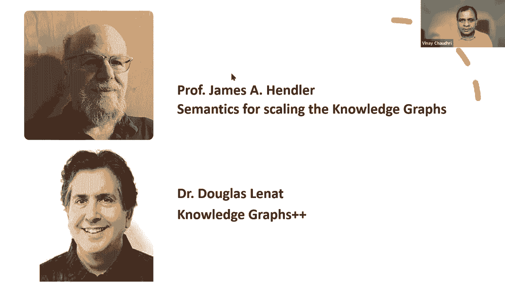

# 【双语字幕+资料下载】斯坦福CS520 ｜ 知识图谱(2021最新·全20讲) - P33：L19.2- 从知识图谱到AI，两者如何关联 - ShowMeAI - BV1hb4y1r7fF

所以让我拿我的幻灯片。

所有的权利，所以这是最后一周，然后呃，在本系列中，我们首先讨论了什么是知识图，我们讨论了数据模型，查询语言，然后我们上了几堂课，关于我们如何创建一个知识图，我们有一个关于如何用知识图推理的片段。

如何访问知识图，我们今天看到了很多不同的应用程序--我们一直在谈论实现工具，现在我们在一个点上，我们想总结一下，我们也想展望未来，我们将主要在周四的会议上进行，所以在接下来的10到15分钟内，我要去。

呃，试图综合并试图解决这个问题，知识图如何与人工智能相关，就像我之前说的，我见过很多人做出这种下意识的反应，知识图和知识图没有什么新的，在AI中做了很长时间，所以这只是老掉牙的东西，我自己的观点是。

基础理论就是基础理论，不会改变的，这就是为什么我们定义知识图有一个有向标签图，它已经存在了很长时间，好长时间了吧，那没什么新鲜事，但有新的东西对吧，这就是我要试图传达的，在接下来的十到十五分钟里。

其中一些想法，是基于我们去年在系列节目中的各种谈话综合而成的，他们也受到一些已经说过的事情的影响，呃，在讲座中，呃，在今年的系列中，我基本上把它们综合成三个要点，三大要点，一个是，呃。

知识图成了人工智能的试验台，有一种新的学科，我们现在称之为，图形数据科学，现在已经存在了，曾经存在过，然后有一些有趣的观察，关于知识图如何适应，的终极愿景，好的，我将更深入地研究这三个问题中的每一个。

知识图与人工智能有双向关系，工作的方式是在某种程度上，知识图使许多人工智能应用程序通过使用知识类人工智能应用程序性能更好，他们会变得更好，在其他方向，人工智能算法--它们可以用来创建知识图。

AI正在帮助我们构建知识图，让我们更仔细地看看关系的每一个方面，所以像Alexa、Siri和谷歌这样的私人助理，现在他们都用知识图，人们普遍认为，如果这些助手能使用知识图表，他们可以做更多的事情。

我们还看到知识图在推荐系统中发挥着核心作用，我们听说过亚马逊的产品知识图，我们已经看到了它是如何在他们的呃，商业网站和我们看到它的效果，你知道的，它能够表明某种程度的准确性。

至于我们应该感兴趣的其他事情，我们很早就收到沙希的消息，呃，在这个系列中，当他谈到如何使用知识图来改进搜索结果时，事实上，在我的第一次演讲中，我谈到了如何改进像Wiki数据这样的图表。

可用于改进搜索结果，呃人工智能应用程序，他们正在使这些，AI应用程序发挥作用，所有这些应用程序我想说你知道它们是新颖的，这些应用程序在五十年前肯定不存在，对呀，这更像是在过去十年里出现的一种现象。

在另一个方向，我们正在使用的知识图它们正在使用，所以说，比如说，我们讨论了图式，模式映射和实体链接，尤其是做实体链接，我们谈到了主动学习技术，我们在对随机森林进行主动学习，也就是人工智能技术。

但它正在帮助我们建立关于，通过融合来自不同数据集的实体，从文本中提取实体和关系，呃，他们使用NLP技术，我们在课程中考虑了语言模型的使用，以进行实体和关系提取，然后像数据清理这样的事情，异常检测，推理。

问答，这些是知识图上的操作，例如，推理和问答，呃，在知识图上做问题回答，我们使用自然语言处理算法，在某种程度上，这些人工智能技术帮助我们更好地利用这些知识图，所以这是一种双向的关系。

知识图与现代人工智能算法，以一种我们都在互相喂食的方式，所以这是我的第一点，好的，所以第二点是，呃，这个新领域的出现，我们称之为图数据科学，这是由两种不同的趋势驱动的，一个是嗯，现代组织拥有海量的数据。

是搜索引擎，e，商业网站，银行，杂货店，他们有，他们在跟踪很多很多的数据，企业对从知识中获得知识非常感兴趣，从数据的结构来看，对于各种任务，推荐产品，做营销，做商业智能，随便啦。

所以利用这些数据的愿望催生了这个领域，我们称之为图数据科学，图数据科学的许多组成部分，它们不是新的，所以像图算法这样的东西，图形可视化，图形查询，这些主题已经研究了30到50年甚至更长。

但它们在数据可用性方面的汇合，呈现了一些新的东西，首先也是最重要的，嗯，机器学习越来越多地用于预测，这导致了一个叫做分析的子专业，但是这些机器学习算法不能在真空中工作。

您需要一些关于该领域的知识来确定模型中应该包含哪些特性，然后你还必须了解你的模型是如何响应这些特性的，对呀，所以这是一个相当独特的技能集，在更老的时候，过去被知识工程师所拥有，但在当今时代，呃。

你必须能够做功能工程，这需要一些真正的技巧，无论是在领域还是在对算法的理解上，然后需要一种新的数据探索，呃，比如当你处理大量的数据时，您希望将其呈现给用户，需要一种技能来为它设计适当的用户体验。

这样用户就不会迷失在其中，他们能够，呃，有效地利用它，而这三个领域的交汇点，分析学，特征工程与数据探索，这就是我们所说的图数据科学，而这种技能是嗯，在行业需求非常高的情况下。

我知道很多组织都躲得不可开交，呃，图数据科学家，我们预计这项技能将继续重要，也许在未来变得更加重要，这是我的第二点，现在，第三点是，嗯知识也是AI，正如我所注意到的，早期的知识图已经在人工智能中使用。

从一开始，最早的语义网络知识类，然后有人说不不，我们必须将更多的语义与语义联系起来，或者我们必须形式化语义网络的含义，这催生了整个描述逻辑领域，一些更关心推理的易处理性的人，他们进入了描述逻辑的空间。

有些人专门关注规则语言，他们不一定关心，呃，推理的可判定性，但是描述逻辑和规则都是语义网络的一个进步，通过添加严格的逻辑语义，我们也需要处理现实世界中的不确定性，并应对不确定性。

早期的人工智能模型是简单的基贝叶斯网，但最近贝叶斯网有了实质性的发展，目前被称为图形概率图形模型，所以所有这些，呃，表示，它们有它们的根和有向标签图表示，他们已经工作了很长时间，他们已经相当成熟了。

但代表性只是故事的一面，我们还必须能够建立代表性，为了建立代表性，早期的方法是基于一个人坐下来写一篇知识，被称为知识工程，但也有自动学习符号知识的技术称为归纳学习。

最近我们看到了机器学习方法的大量使用和成功，所以这就引出了一个问题，是什么改变了，呃，什么是新的，在我的脑海里，关于这些主题的经典著作有三个不同之处，与现在发生的事情相比，这三个差异是规模。

施工底部与混合施工方式，所以按比例，我的意思是，即使我们现在正在构建的是语义网络，但这些真的很大，对呀，我们说维基数据知识图，即使你说它只是一个语义网络，它已经，八千万，八十，大约八千万件物品。

或者30亿左右的三倍，对呀，我们从来没有一个语义网络接近如此大规模，所以就我们今天所看到的知识而言，规模真的不同，呃，第二点是施工的底部，呃，人工智能的早期工作是由这种自上而下的设计的愿望驱动的。

我们坐下吧，让我们仔细设计我们要建模的东西，然后他们会填充我们的模型，但我们这些天看到的是，让我们看看我们有什么数据，好的，让我们看看我们能收集到什么数据，然后我们将运行我们的机器学习。

或者我们将运行我们的NLP，我们将看看我们可以提取什么样的实体和关系，一旦我们提取它们，然后我们再想办法，呃，什么样的结论或推理，我们就可以，我们可以从中提取，我想说还有很多这种自下而上的工作在进行。

这些天比以前，我们知道在早期没有工作的底部，但目前大部分工作都集中在自下而上的分析上，数据驱动分析，和三个，嗯，我们今天看到的那种知识图，它们是使用混合建筑模式建造的。

我是说显然有一些手工劳动或传统的工程知识，但是自动化的使用很多，这就是帮助我们达到正确比例的原因，建立知识图不仅仅是一种策略或一种方法，我们正在使用多种方法的组合来构建知识图，话虽如此。

这三个是今天知识图之间的巨大差异，与几十年前发生的事情相比，这并不意味着我们不能小规模地拥有人工智能，你知道有很多小规模的问题，但它们仍然需要聪明的行为，这并不意味着自上而下的设计不重要。

即使你以自下而上的方式建立我们的知识图，但我们仍然要考虑我们所学的语义，我们能从中得出什么结论，这确实需要一些自上而下的设计，事实上，我们可以自动学习的一些知识，并不意味着我们不能写下我们所知道的。

我们所知道和理解的一切，我们必须能够用可计算的形式来表达它，这一点的重要性不会消失，仅仅因为我们能够学习这些知识，所以在AI你知道，人们对系统有这样的看法，他们有这些有远见的能力，就像有，呃。

域的完整模型，能够形成假设的系统，执行高水平的认知任务，如设计实验或提供解释，我们还是做得不太好，我们不能建立那样的系统，目前还不清楚知识图是否真的足以构建系统，就像那些知识商店碰巧在一个点上。

他们能够为我们提供足够的代表性，它是，呃，我们谈到的应用程序，比如搜索和数据集成，和NLP和视觉它，它只是在一个点上匹配所需的，但尚不清楚这是否足以满足我们最终想要去的地方。

这将是我们下周的主要焦点而不是下周，星期四，所以周四我们将有两位来自我们领域的远见卓识者，呃，吉姆·汉德勒教授和道格·伦内博士，谁会，呃，给我们他们对嗯的看法，知识图的未来在哪里。

以及知识图表如何帮助我们超越当前的艺术状态，走向今天不可能的事情，因此，我将结束，呃，我要说的话，我们可以多回答几个问题和评论，然后我们结束今天的会议。

酷，所以有一个问题，好的，伟大的洞察力和指导，非常享受这次学习，传递并寻找问题，哦，好的，所以我只是评论，来自所以谢谢的评论，非常感谢，是啊，是啊，所以还有一个关于个人知识管理的问题。

几乎没有任何工具可以做到这一点，嗯，你知道，我是说，我以前参与过这个项目，叫做卡洛，在SRI的哪里，我们在哪里，我们的章程是建立一个个人知识管理系统，事实上，我们的模式是一个知识图。

上面有联系人之类的东西，电子邮件，文件，项目和人员，所以我们有五个左右，呃，不同的阶级，你知道他们建造了一个，我们建立了一个版本，我们在研究项目中使用的系统有很多有趣的功能，只有一小部分被生产出来，嗯。

但你知道有人说，哦，它们仍然受到文件夹层次结构的限制，是啊，是啊，我的意思是我同意你，你知道的，不知何故，产品的艺术状态发展得不是很快，呃，参与了那个研究项目，我知道我们在研究项目中追求的想法。

其中只有2%对产品产生了影响，我真的不知道该说什么，对那个说，你知道的，我是说，呃，一部分是在多大程度上，嗯，初创公司能够从研究中获得想法并将其推向市场，你对此有什么看法吗，是啊，是啊，我同意。

所以我想，呃，你很快就尝试了很多想法，尤其是在这个人工智能的空间里，我想我们，当然我们肯定非常非常远，所以我有这些非常智能的产品，然后我们将在任何情况下操作，我认为诀窍是找出一个非常非常狭窄的用例。

整个产品设计也要做得很好，这需要所有的努力，是啊，是啊，我的意思是我想呃，评论是最终用户是正常人，不是科学家，你提到的工具对那个用例并不有用，我同意，我的意思是我认为这门课真的是为程序员设计的，对呀。

我们有一个关于HCI和用户界面设计的会议，但你知道这是一种完全不同的心态和技能，和完全不同的问题，所以我认为很多最终用户，不是科学家或工程师。

很可能受益于这些科学家和工程师建立的特定领域特殊目的知识管理系统，而不是通用的个人知识管理工具，即使是光环的事情也有特定类别的信息，你正在管理，因此，通用的个人知识管理工具可能并不在，和商业需求一样大。

让我看看这里还有几个，哦不，好的，是啊，是啊，我是说再来一次，我想，在个人信息管理系统方面有大量的工作，我独自知道，Halevi有很多关于这个主题的论文，这意味着他最接近数据库类型，我熟悉的事情，嗯。

我相信你知道HCI内部有，有大量的人在办公自动化和个人知识管理工具上工作，好吧，个人知识管理是什么办公室工具，什么是，就是那个，我不确定这是不是唯一被报道的东西，在那个问题上，我同意你的观点。

这显然是一个可能有商业价值的领域，这是一个关于知识科学家的问题，我想这与知识工程师不同，所以我不太确定，i，得到了全部的要点，嗯，是啊，是啊，我是说，我认为知识科学家的概念是由颜序田推动的。

他是我们去年邀请的演讲者之一，我想他在第二讲，是啊，是啊，所以所以我的意思是，我鼓励你去听听他对知识科学家的论点，但是据我回忆，他说当你做这个模式映射的时候，真的不可能自动地做这件事。

你必须对域有很多了解，这就是他作为知识科学家所说的技能，呃，不仅仅是处理数据，它还能够对域进行建模，并理解域的语义，然后能够捕捉到，你不给任何颜色，不不，我只是，你知道的，我有点像游艇人。

在这个知识图表的世界里，我认为智力的标准已经下降得很低了，如果我们认为Siri和Alexa和推荐系统是智能的，我是说它们很有用，毫无疑问，我喜欢他们，但我不会让自己被诊断出来。

必须由Alexa或Siri，或者至少利用这一点，但我还是想有个医生在那里，就目前而言，使智力下降的原因是这样的，我关心的不是大数据科学，它产生了非常肤浅和薄弱的结论，但相当小的数据科学。

世界上的夏洛克·福尔摩斯，只需要两三个小事实就能告诉你是谁干的，利用知识，大量的知识来形成结论，从非常少的数据似乎更符合人工智能过去的情况，所以说，是啊，是啊，所以所以我的意思是，我想我，这正是为什么。

我在我的一张幻灯片中承认了这一观点，对是的，仅仅因为你在做大数据，并不意味着这是获得情报的唯一途径，有小数据智能，我也是，这同样重要，对呀，是啊，是啊，嗯是的，我也认为有一个问题，这是我们之间的讨论。

是否要触及知识图和人工智能之间的重叠，你知道吗，我是说，在这门课程中，我们已经涵盖了某些算法和技术，它们对某些类别的应用程序有用，对，这本身就很有趣，对呀，否，你不同意不，这是不可避免的。

因为机器学习现在是如此，嗯，目前生产效率很高，我们必须谈论与人工智能的关系和知识等于机器学习，和，当然，知识图是其中的一个关键部分，你刚才辩论得非常非常雄辩，所以我想我们必须把这种联系联系起来。

问题是这是不是古老的人工智能，这是我认为已经出现的分裂，还没有真正解决，但我认为你说得很好，用你的滑过末端，是啊，是啊，我是说，我想人们会争论这个权利，尤其是如果你提出，他们可能会说你到底在说什么对吧。

所以挑战肯定是存在的，我亲身经历过，是的因为这些天如果你和人们谈论代理，表示的意思是向量，这就是代表所需要的，这是人们唯一知道的代表，所有的权利，所以我们大约有一分钟，嗯，有什么结束语吗，嗯。

期待星期四，不要错过星期四，星期四会好的，是啊，是啊，星期四会很好，我们有两个名人，吉姆·亨德勒以很少说语义而闻名，道格·勒奈特博士，他的生活一直处于语义学的最高端，对呀，所以这应该是一次很棒的谈话。

所以非常感谢大家，我们星期四见，感谢演讲者，我很感激，谢谢，欢迎。