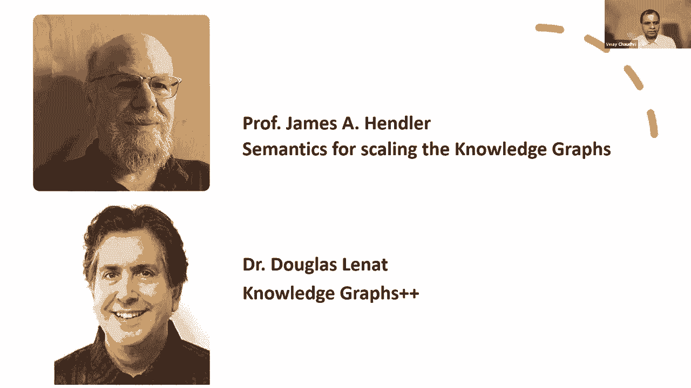
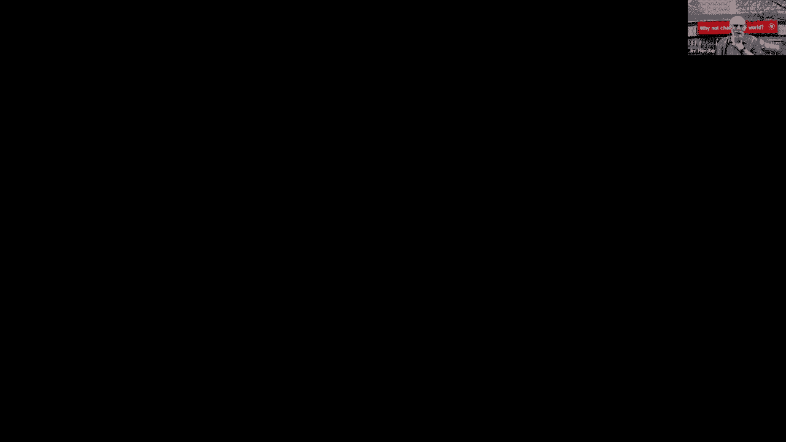
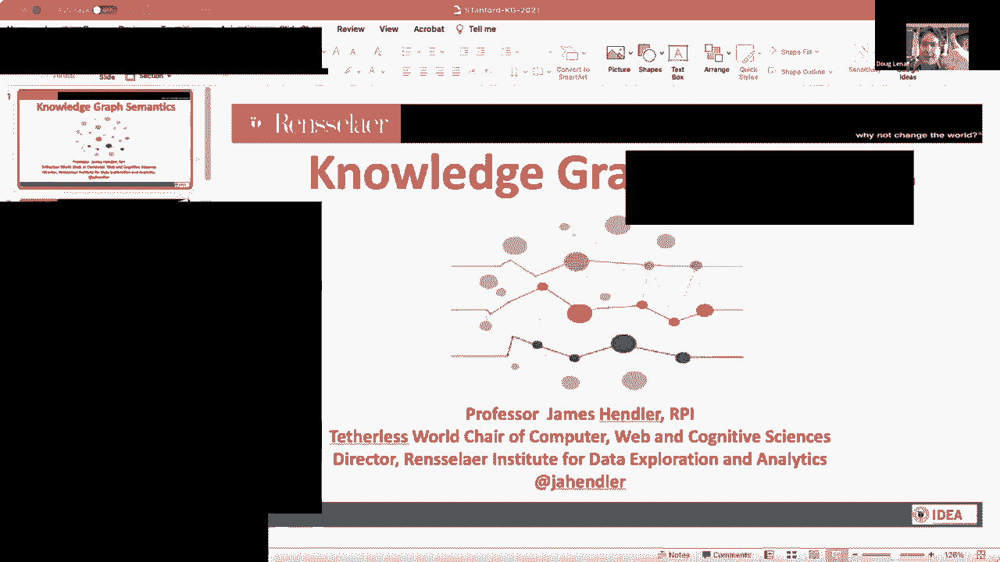
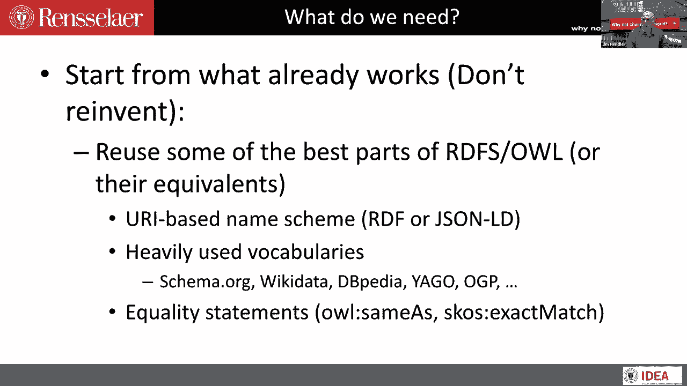
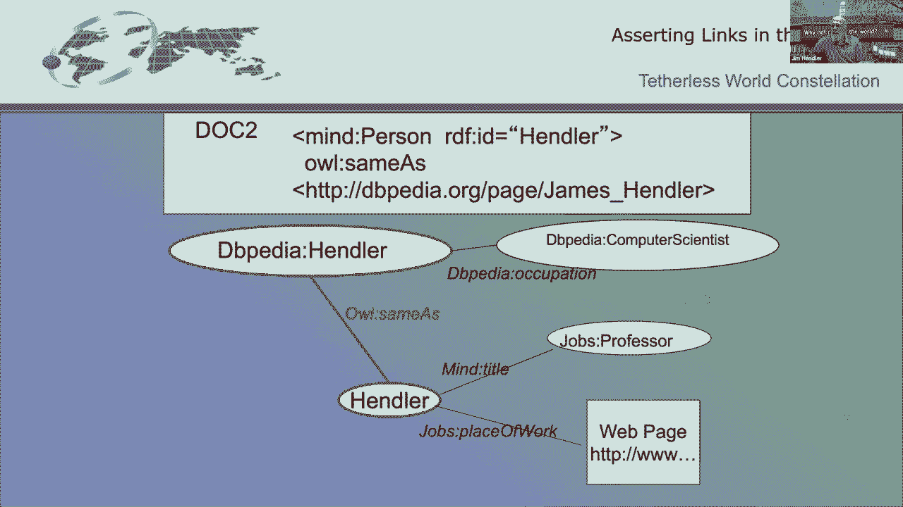
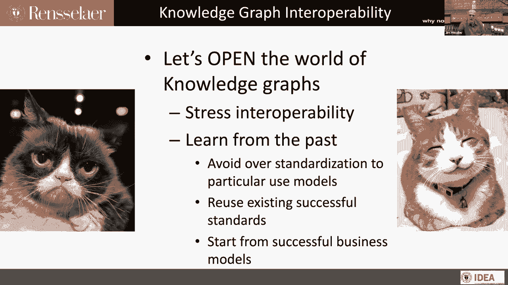

# 【双语字幕+资料下载】斯坦福CS520 ｜ 知识图谱(2021最新·全20讲) - P34：L20.1- 用于扩展知识图谱的 Hendler 语义 - ShowMeAI - BV1hb4y1r7fF

欢迎来到今天的知识图研讨会，我们在课程的第十周，在最后一次会议上，我们的重点是，关于知识图的一些研究问题是什么，我们很幸运有，两个非凡的人，他们是我们领域最有活力和远见的演讲者之一，呃。

吉姆·汉德勒教授，他给了我们一个口号，一点语义会有很大的帮助，它激励了许多人周围的社区来实现这一愿景，Lennett教授，是人类常识中最丰富、最详细的计算模型的创造者，今天存在的。

我们希望从他们那里听到他们对当前知识状况图表的评论，并得到他们的指导，知道下一步该去哪里，我们要从，呃。

汉德勒·吉姆教授给你，我应该分享我的屏幕吗，是呀，所以能在这里见到人们真的很高兴，尤其是好吧，为什么不是我的樱桃给你，我现在有两百个开着的窗户，我在找我的幻灯片，它在堆栈的顶部。

当我在一个之前尝试的时候，所以如果事情不顺利，你总是可以嗯，假装你的缩放连接冻结了，什么的，你知道好吧，我不能我道格，我不能，我有你的侧健身房，如果你需要我投射，我有，我要一份，我马上就去拿。

只是他们有，呃，他们有一个应用程序，这实际上对那些想摆脱变焦电话的人产生了这种效果。

你知道他们叫那个应用程序什么吗，是什么变焦，是啊，是啊，是啊，是啊，我总是开玩笑说变焦最棒的地方是，你有理由，因为我迟到了，糟糕的是，通常都是真的，迈克尔，如果你不想听金属级别的笑话，你不应该邀请我。

我们中的任何一个，那倒是真的，你知道我第一次看到的演讲之一，艾是道格，伦内的电脑与思想对话，所以是的，精彩的演讲。

我还记得那天他讲的许多笑话，一九七七年，到目前为止，我已经改变了至少一半的笑话，对呀，好的，所以理论上我分享，除了我只是是的，它是，它起作用了，它起作用了。

去吧，大家可以看到，我们没事，谁能看到你的留言，所以说，所以你知道，所以我把谈话称为知识图语义学，但我真正应该称之为，如果它能让我提前我的切片，这就是知识图互操作性，你知道我对网络了如指掌。

我所做的一切都集中在，真的，网络如何变化，我们如何做事，我们现在如何使用网络，那很简单，很明显我们可以举办这样的课程，但你知道，当我开始做网络的时候，它是几年前的，花了一段时间，但对我来说。

网络一直是关于分享和链接的，所以当我们把人工智能带到网络上时，很多都是关于分享和链接的，AI等，我要快速浏览一下，因为某种原因，我看不到幻灯片的顶部，这也不能给我一秒钟，呃，嗯哼，好的，所以说。

但不管怎样，几十年前，所以大约2000年，网络在增长，我们有所有这些孤立的搜索引擎，如果你幻灯片的顶部写着古代历史，我们可以看到你幻灯片的顶部，是啊，是啊，不不，我知道你能看到，我不能。

它没有关闭小窗口，为了分享，因为某种原因，我不在乎，我只是要去，我们看到了这样一个事实社交网络刚刚起飞，每个人都认为这个应用程序会成为网络的杀手级应用程序，这个东西叫Flickr吗。

它实际上并没有成为杀手级应用程序，但它导致了更多的社会事情，诸如此类的东西，但真正的问题是，一切仍然是在基本的超链接上完成的，我们试图想出一个不同的方法，所以在恐龙时代，这个想法是，你知道的。

如果你想做AI，你知道的，在Web进程中发现内容，它用它做事，我们需要一个模特，所以呃，2001年我们写了，呃，我很幸运地和蒂姆·伯纳斯合著了一篇文章，李和光环，最后一个我们提供了一个网络的愿景。

我们现在所说的知识图，呃裁定，你知道我们可以为，你知道我们说的是同一件事还是不同的事，我对那段历史有完全不同的看法，关键的想法是这一切都是关于互操作性的，我们想的是互操作性主要是通过推理来实现的。

关于事情是如何联系的，这并不完全错误，但在某种程度上，用例是，网络的大小将是，我们在那里，如果我们把事情放在一起，并对此进行推理，我们可以做很酷的事情，但即使我们在指数级增长中。

我不认为我们中的任何一个人真正意识到这种增长是多么的指数级，除了蒂姆和，甚至蒂姆的想法也和网络的发展方向不同，所以当我们从两千年来，并开始真正进入网络数据的增长，我们真正的一件事，你知道的。

所以很多早期的，嗯，语义网络视觉很快改变了大约2000年，2003年进入所谓的数据网络，蒂姆和我有另一篇不太为人所知的文章，大约2004年在数据网络中，也许我们用日语出版的事实。

这就是为什么它不那么为人所知，附近有英文版，但是嗯，但又一次，我们所讨论的是从Web访问数据库的方式是如何增长的，在接下来的几年里，这些强大的知识开发工具开始发展，然后深度学习在1314年出现了。

突然间，真正强大的工具可以完成，但是所有这些工具都需要大量的数据，所以产生的东西，知识图需要数据，它们是非常数据密集型的程序，但另一件正在发生的事情是开放数据运动，所以网上有很多很多免费的数据。

把你的网竖起来，把你在网上的数据放在机器里，可读形式，所以语义网的概念，演变成了链接数据的概念，呃，将网络发展成为全球数据空间，对呀，很多观点都是基于这个概念，我们想要的是将这些数据集。

以某种机器可读的方式描述它们并将它们链接在一起，这开始增长，嗯，我们创建了一个叫做链接开放数据云的东西，这就是为什么，可能最著名的是它的中心，我意识到它太小了，不能在这个版本中读，但那是维基数据。

对不起，那是dbpedia，最终成为维基数据，所以如果我们今天这样做，情况就不一样了，另一件事是中间的圆和其他圆一样大，但事实上，其中一些是，定义它的人，是创建维基百科的人，他们做了他们的。

他们说没有比这更大的圆圈了，所以其他一些圆圈真的让人相形见绌，这个，生物和政府的，诸如此类的事情，但是维基数据被证明是真正有用的东西，从dbpedia到wikidata。

因为它能够消耗人们正在做的很多事情，并以机器可读的形式，但这并不是说你在使用维基数据来回答问题，是你，你在使用Wiki数据把东西放在一起，以获得互操作性。

所以最初的语义Web版本是应用程序之间的互操作性，如果你回去读我们讨论过的原始文章，你知道的，试图安排时间的人，你知道，两个人试图安排，他们的父母，即使在今天，二十年后。

所有这些都可以通过不同的应用程序和网站在网络上完成，你还是不能把一切都放在一起，所以整个想法是互操作性，所以到了2010年，我们已经转向了数据互操作性的概念，所以开始生长，然后我们到了。

然后我们看到了非结构化数据的增加，所以你知道，现在我们真正关注的是非结构化数据，使用如此强大的知识图工具正在发展，尤其是我们有，嗯，现在图神经网络之类的工具可以，呃，可以消耗更大的知识，嗯。

能创造出真正应该说的，可以创建不太大的知识图，不消耗大的知识图，这些知识图正在增长，但不是在筒仓之间，对呀，所以我们开始看到知识图之间的任何互操作性，它是由维基之类的东西驱动的。

Wiki数据或其他单一系统，所以用旧的术语来说，你知道的，可能还记得本体论术语，你知道的，我们在某些方面看到了一个共同的本体论，仍然有很多人对创建本体感兴趣，讨论本体，本体力量，有些是不同的观点。

对一些深度学习的东西至关重要，知道哪些东西属于什么类别，当你训练的时候，你仍然主要在筒仓里看这些东西，我还没有机会复习你们在这门课上所看到的一切，但我看过其中一些，你有很多不同的东西在看。

我们有亚马逊知识图，谷歌知识图，这个知识图，知识图，所以对我来说就像，首先是网上大约两千年的文件，然后网上的数据，但2010年，所以现在是网络电路上的知识图，所以这一切都是为了介绍，我想做的主要事情是。

这就是我们如何让这些知识图协同工作，那么我们如何创建开放的或可互操作的知识图，可以为这些新的创新应用提供动力，我们在我的实验室里一直在找的几个，包括可以与专门知识图互操作的一般知识图，例如。

健康知识图表，当你开始用某种个性化的方式来看待这个时，更多的乐趣就来了，所以个人健康知识图是我们在一个大项目中使用的术语，我参与了，这是对我们所谈论的东西的一种概念性的看法，但是能够把两者结合在一起。

这种基于，你知道的，临床纪录，采矿，图像挖掘，遗传信息，然后把人们实际上在做的事情聚集在一起，他们都有健康知识，我们知道他们，所以这可能是，你知道的，电话里的事情，Fitbits，诸如此类的事情。

但更有趣的是，我们也知道网络行为可以告诉我们很多关于人们的，嗯，你知道他们生活中发生了什么，但关于他们个人，所以换句话说，它不会把所有这些都吸进某个全球性的东西里，然后把它放在。

然后创建每个人都使用的知识图表，原因有很多，您的个人健康信息希望保持隐私，你的个人在线行为正在通知你的健康，你可能不想和那边的人分享所有这些，在另一边，他们在采矿。

但如果你能用有趣的方式把这些东西放在一起，通过这种互操作性，然后我的手机就知道我了，大知识图，知道他们得到了某种互操作性和某种通信，人们现在正在努力，像分布式学习之类的东西。

所以所有这些东西都可以通过让这些东西一起说话来提供动力，那我们怎么去那里，所以起点是从我们已经知道怎么做的开始，而不是重新发明一些轮子，所以RDFS猫头鹰的一些最好的部分，实际上还有一些其他的事情。

你知道的，我知道你听说过很多关于属性图和RDF模型的知识，我实际上要说一点，关于那次谈话中遗漏的东西，当我看了一些幻灯片，我认为属性图的东西有一些优势，我们需要进入另一个模型，但这种模式有一些优点。

我们得进去，我一会儿再谈这个，但是RDF的一些最好的部分所做的，是一个基于URI的名称方案，我将在一分钟内对此进行更多的讨论，因为我认为这是至关重要的，而且已经迷失了，为什么这这么重要。

那么您就可以开始重用这些大量使用的词汇表，猫头鹰有一点很重要，我会，我可能会也可能不会再回到这个问题上，我不记得我是否放了幻灯片，我只是想，我试图转身像四，一小时的谈话变成半小时的谈话。

所以很明显有些东西错过了，嗯，但是平等声明是非常重要的。

所以这是一张幻灯片，我从两千三到两千四就开始用了，但它有点迷失了很多对吧，所以如果你想想网络，网络是认真的超链接，现在它们经常藏在下面，Web应用程序，隐藏在下面，嗯。

你知道JavaScript之类的东西，但它基本上仍然是由页面构建的，被指向其他东西的东西咬，所以传统上在网上，在很早的时候，你有一个网页，指向Web资源，它可能是另一个网页，可能是一份文件，可能是。

你知道，PDF文档，可能是一张照片，几乎可以是任何东西，你想要的，这真的是基础，网络的核心，嗯，所以你看到的是一个创建这些链接，但是rdf说你知道你想做的是给这些链接贴上标签。

你想要的是一组无限大的标签，很好理解，我们在网上有一个，它被称为URI或URL，当你在看文件的时候，网页，因此，而不是一个URI指向另一个URI，现在我们有一个URI点和另一个URI点。

我们用一些东西给它贴上标签，那个东西是URI，好吧，这让你立即得到一些东西，那就是你是可有可无的，这样你就可以看到正在播放的内容，你可以跟随其中一个URIS，实际上去你的系统，可以去那里看看。

所以语义网中的想法是，如果我们有一个共同的语法，不是通用语义，和一个简单的语义，它将把语法联系在一起，你可以做这种事，所以再一次，其中一些是旧幻灯片，现在会更复杂一点，这里有一个例子，有一个文档。

说我们有一个叫做处理程序的东西，谁与这个特定网站称之为工作的事情有关，教授叫道，有另一个网站，一个叫乔布斯的地方，有工作场所的，其中一个工作场所，这是工作的地方吗，这是你知道的，我的大学。

所以我得找到一个人的小东西，所以现在当我在文件上把这个，你知道放一些关于这个特定的URI的东西，然后它指向所有这些不同的东西，它把它们拉在一起，所以它就像知识图，除了有些链接可以去其他地方。

它们定义得很好，如果你想，你可以立即得到两样东西，如果使用与您相同的URL相同的URI，那我们就知道我们说的是同一件事，如果用不同的，我们不一定知道，如果我们谈论的是不同的事情，那是个问题。

我们马上要处理的，但如果用同样的，和冒号标题乔布斯教授把乔布斯的一些东西放在一起，我们产权矿的东西，我在马里兰的实验室，几年前我在RPI的第一个实验室，所以这些是你可以用来实现互操作性的东西。

然后你可以开始使用这些常见的东西，但你也需要一种方法把它们绑在一起，所以猫头鹰和猫头鹰的一部分一样，还有一些其他的事情，它怎么会做同样的事情，所以现在我可以说，DBpedia里的这个家伙。

DBpedia知道谁是计算机科学家，就是，这家伙和头脑引用垂钓者的这个人是一样的，同样，这些可能是不同的名字，我马上就会告诉你，处理程序有这个标题，教授等等等等，所以现在你可以把它都放在一起。

所以现在你得到了看起来就像，你一直在看的知识图，但请注意，我们在这里链接了几个不同的页面，当然，现在这些页面可以是知识图，可以放在一起。

然后用，嗯，与并使用，呃，反函数数据类型，这是世界上最糟糕的名字，但非常重要的是，你可以开始建造这样的东西，所以这些只是几个例子，所以这是，哦上帝，我不记得多久以前了，可能是212214。

如果你把我的名字放到，所有这些都是一样的，所以它会开始，我会说找到所有和维基百科一样的东西，通过追逐开放的数据云，你可以在不同的地方找到数百种不同的东西，所以你可以看到我的db lk db lp，文件。

维基百科上的报纸和观光者的东西，我大学的东西，你知道我们有很多不同的例子，所以很多人都在玩这个，所以我们需要这个知识图的第一件事，互操作性是我们在那里的那些东西，但我们还需要一些其他的东西。

如果我们真的要追求这个数据用例，这就是引人注目的用例，对呀，所以我们希望知识与外面的数据对话，我还在说简单的知识，我会让道格谈谈为什么我们需要延长一些，至少我想那是我们要讨论的。

所以我们犯了一个真正的错误，我们忽略了一些语义网络的东西，程序性附件，这实际上是有原因的，我有个演讲叫呃，凋零鸮，我一会儿就会提到，它谈到了为什么我们忽略了这些东西，历史上我们做这项工作的时候。

但粗略地说，我们真正的问题是这种东西有专利，专利还没有到期，我们不能使用某人在标准中获得专利的东西，而不让每个人为此付出代价，但是那个专利已经过期了，几乎所有和我交谈过的人，比如说，那个呃，医学本体论。

我相信你已经看过其中的一些了，你知道我在模糊本体论这个术语，知识图，RDF东西，等，因为我们开得很快，但是无论您使用的是哪种模式类型的东西，你真的在说用一些能让你有所成就的东西。

但是如果你在后面有一个数据库，你真的希望能够使用某种数据，所以你真的想说，当你来到这里，获取此数据，做这种查询，呃，运行这种过程，这是我们很久以来就知道怎么做的事情，我们甚至知道如何。

如果你是一个逻辑纯粹主义者，坚持认为你需要描述逻辑，语义网络上的所有东西，这是我们犯的另一个错误，但不要让我继续下去，那个，你还需要我们，我们仍然知道怎么做，我是说序幕已经做了很多年了。

你知道DL有办法做到这一点，当它意味着描述逻辑时，交易又回来了，不是深度学习，所以我们需要那些东西，我们需要一些其他的东西，我有一个关于我们在数据互操作性方面遗漏了什么的谈话，时间模型，不确定性。

我会注意到这些实际上是，在属性图中吃得更容易，如今，属性图的问题又是，它们不提供这种解引用能力，我不是你或我以一种简单的方式基于或嵌入网络，它们通常不会提供指向有基本内容的东西的指针，所以再一次。

他们是，它们在企业中广泛应用，像那样宽的东西很强大，但互操作性不是很好，除非你把这些事情解决了，所以我有一个演讲，嗯，这是一个非常，这是一次谈话，我在二十六年左右屈服了，在幻灯片上很受欢迎。

我想你会喜欢它叫枯萎，W I T，他不会枯萎，我很感激，是啊，是啊，所以你们中那些在那里不那么熟悉的人，枯萎的意思是消失，枯萎意味着它要去哪里，我试着做一个关于这两件事的演讲，但不管怎样。

这里面还缺少隐私和安全控制，人们现在一直在研究的，另一件事是为什么要做这件事的动机，现在有很多系统，我一直在和一家我是顾问的公司合作，在顾问委员会里玩过这个吗，既然我不推动我的公司，我不会多谈这件事。

但真的，我们如何从主要生活在数据世界中的东西中提取东西，使用这个语义和知识图基础结构将它们放在一起，然后把它们交给大量使用的商业和商业智能工具，它将开放和共享这些资源货币化，所以这是我们努力做的一部分。

这是另一个学问，另一件事是，你知道的，呃，Vinay提到了这一点，一点语义会有很大的帮助，只是想告诉你，我一直在说这是我的团队的T恤，从鞋子项目，始于1996年，我意识到许多斯坦福大学的学生还没有出生。

嗯，你知道，呃，我不认为这，你或我再做任何事，但小语义一直在进行，嗯模式点组织，我相信在这门课上已经介绍过了，是从雅虎开始的，然后谷歌在一个财团中接管了它，发生的事情是，你最终得到了许多不同的。

基本上定义了一些非常，逻辑世界中没有人愿意作为本体论的非常简单的本体论，是基于搜索中最常用的东西，网上这样的东西，所以嗯，所以真的，当谷歌接管这个，这确实是推动谷歌知识图获取的很大一部分原因。

因为他们可以学到很多，但他们仍然需要大量的标记数据，现在你有世界各地所有这些不同的Web开发人员实际上定义了这些数据，所以模式，org在数十亿个网页上，现在，如果你看最大的，UM网站。

你知道有一堆不同的，我只是喜欢这个，你知道全世界都在用，它已经完成了，从任何有意义的语义来看，它都是可怕的，例如，呃图式组织有六种宗教，这是五大宗教，现在一个叫另一个，没有人会说这是宗教的伟大典范。

但事实证明，如果你想做的是通过网络赚钱，主要是试图击中顶部的东西，这些都是很好的设置，同样的事情，你知道的，人都有，我想什么十五二十只猫，你知道，属性，不适合定义一个人，但很好地说。

这个人和另一个人是同一个人吗，所以用了很多推断，诸如此类的事情，所以总结一下我今天要说的，我们真的需要重新开始考虑互操作性，你知道现在，大多数知识图互操作性是由大玩家之间的业务关系提供的。

但打开它们让我们开始，你知道的，找到和他们玩的新方法，创建图形的更多方法，像这样更大的知识图，再一次把它和这些联系在一起，当你能把大的东西和小的东西联系起来的时候，那是一场胜利，所以强调互操作性。

以史为鉴，避免过度标准化，重用现有标准，从成功的商业模式开始，我也不会是一个真正的教授。

如果我没有把自己的书藏起来，所以我们现在在语义网的第三版为工作的本体论者，我一直在谈论的很多东西都可以在那里找到，我会停在那里，非常好非常好，我觉得，在你身上掘金，我只是看到一个又大又黑的黑幕，在那里。

我们去，我想吉姆，你必须停止分享，这样他们才能分享，是啊，是啊，我同意，我就在那里，没关系的，我的屏幕有一段时间是纯黑的，就在外面。

