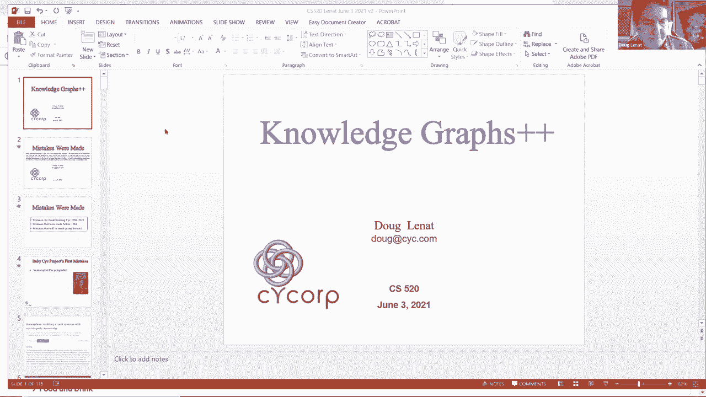
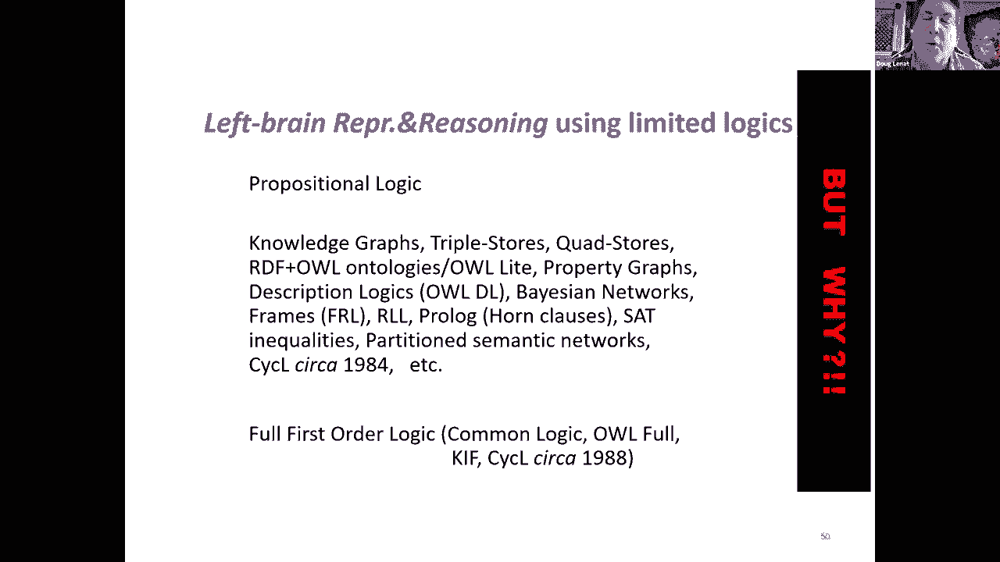
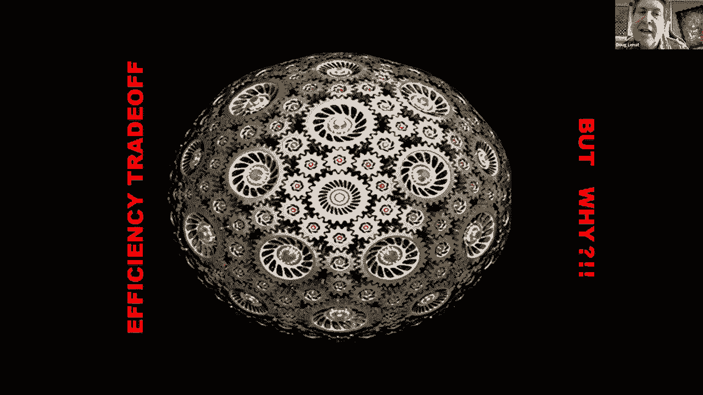
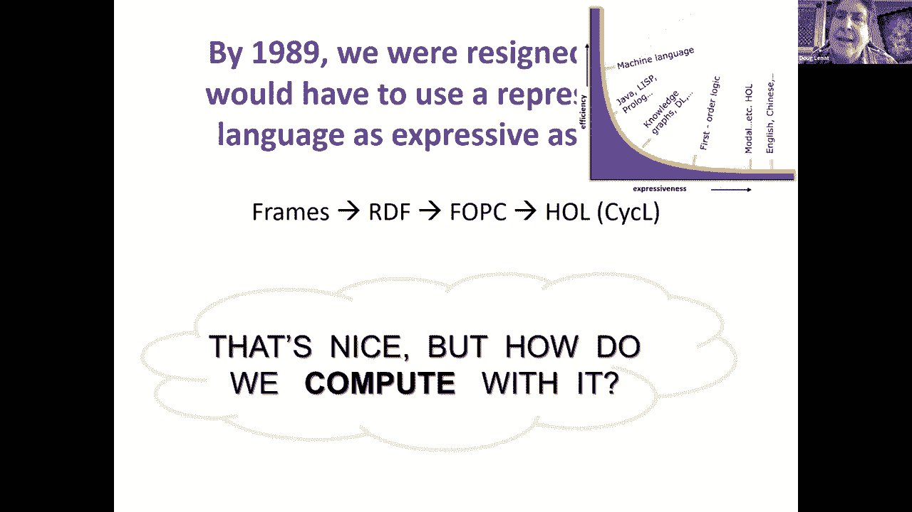
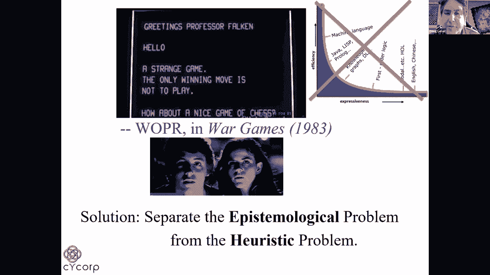
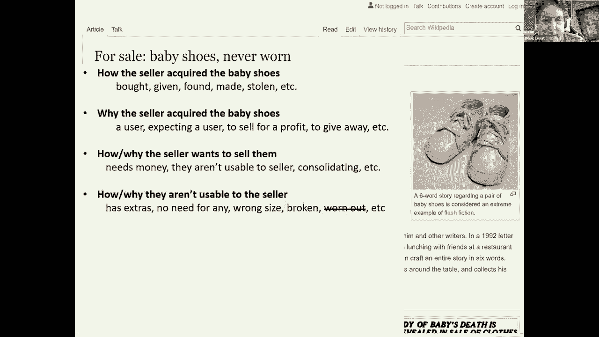
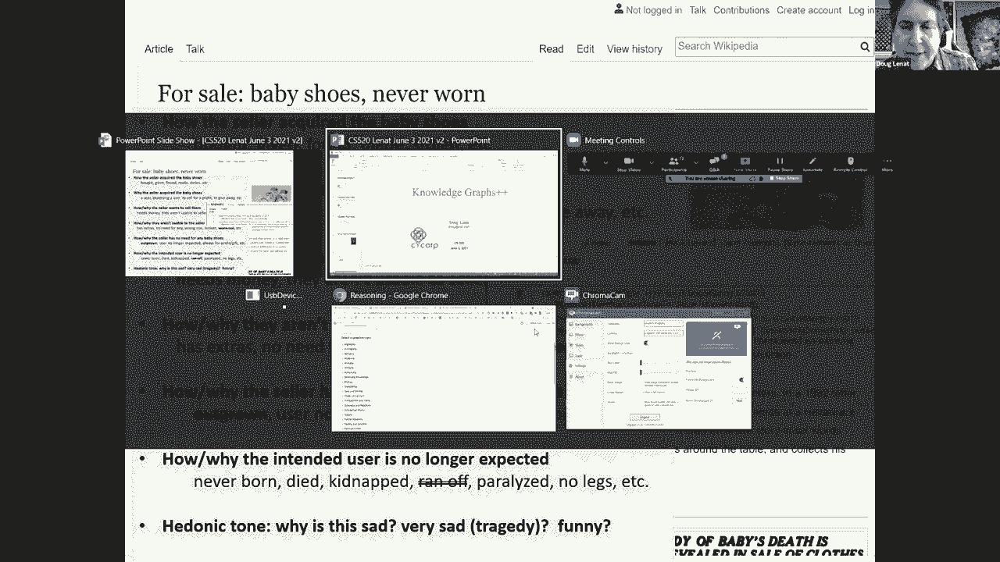
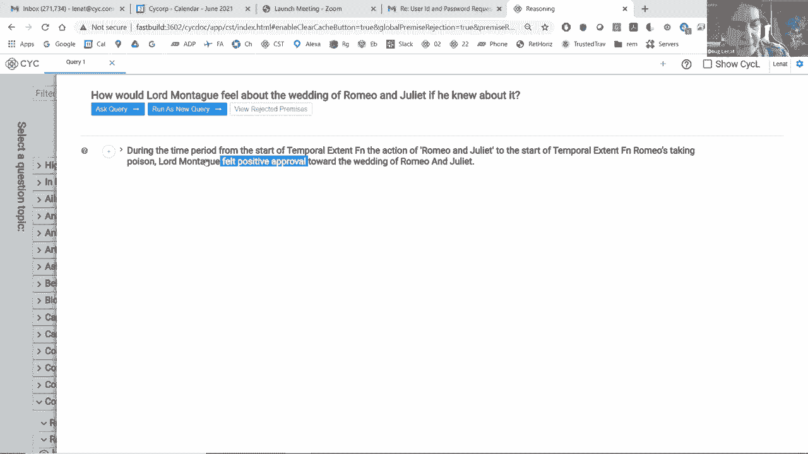
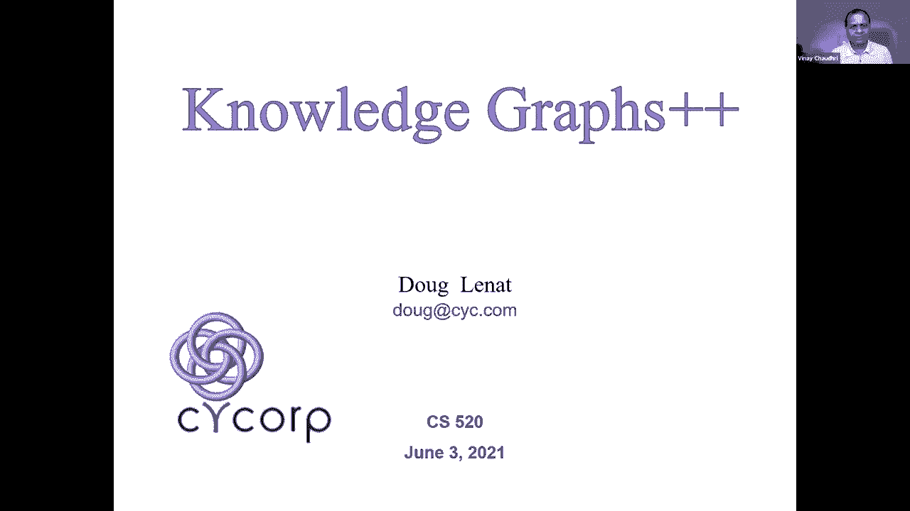

# P35：L20.2- 知识图谱++ - ShowMeAI - BV1hb4y1r7fF

你静音了，好的，你现在能听到我吗，是呀。

我们可以很好，这是呃，显示是，完美，所以我想和你谈谈，在某种意义上，几乎是的赞美，吉姆刚才跟你说的，嗯，但是嗯，正如你可能从我的摘要中看到的，呃，我真正想说的是，除了我们今天所说的知识图。

我们还能做什么，我们为什么应该，我们应该如何等等，这真的是一个关于所犯的错误和吸取的教训的谈话，在某些情况下，在大多数情况下，在心理AI项目的建设过程中，我很高兴看到，嗯，观众席上的九个人，我们是。

我们是，那很令人兴奋，嗯，在这段时间内，你知道我会成为什么样的学者吗，如果我不也至少触及，1984年以前犯的错误，还有我计划在未来几年犯的错误，嗯等等，我会得到，呃，知识图，滑梯三二，可能会吓到你。

但我说得很快，几分钟后就到，所以这个，从某种意义上说，我们犯的第一个错误，在20世纪80年代初，人们专注于，嗯，纸上文本的黑色空格，就像它一样，呃，所以我们在最后一部百科全书出版的时候，我们和艾伦谈过。

凯，和其他，嗯，表示百科全书的内容，文章实际上说的事情，我们开始这样做，我们找到了获得资金的方法，我们开始，嗯，在20世纪80年代初这样做，但大约一年后，我们意识到水下冰山的很大一部分是常识，补语。

如果你愿意，文章到底说了什么，作者假设读者已经知道世界是如何运作的，使他们能够消除歧义，嗯，语言中的歧义，并实际理解和推理所说的话，推断出没有说的话，比如说，在一个句子的结尾和下一个句子的开头之间。

所以我们的很多工作，那么嗯，把乐趣转移到看像国家问询报和每周世界新闻这样的东西上，说是什么，我们对这个世界的了解使我们对什么持怀疑态度，这些文章和头条新闻都在说，等等，嗯所以嗯，我们。

我们也非常努力地努力，区分的上层本体论，嗯，我们尽可能正确，事后看来，我会说那是个错误，不是完全的错误，但我们在上面浪费了很多时间，不仅仅是我们，如果你看看所有的本体，他们中的很多人花了最多的钱。

甚至是他们所有的努力都在为这种上层本体论的概念而苦恼，可能嗯，我们可以回去责怪亚里士多德，用于，错误的，它告诉我们，我们应该担心对称性，类别的数量和诸如此类的事情，什么时候，事实上。

真正重要的是你的本体论的整体是足够的，嗯，这是在埃德·费根鲍姆的一次会议上被带回家的，谁在这里，出席了在东京举行的关于EDR的日本第五代UM会议，电子词典研究人员介绍。

他们展示了他们版本的上层社会本体论和心理学等等，我很惊讶，因为他们的上层区别是有灵魂的东西，和没有灵魂的东西，大树倒在一边小树倒在另一边，尽管有许多不同的文化方式来瓜分世界。

我们在互动和理解对方方面仍然没有问题，等等，所以所有这些都受到了上层本体论的影响，不仅仅是上层本体论，你所做的所有区分，你可以把这看作是你在知识图上做出的区别，嗯，实际上只是一种效率问题。

所以即使你做出了可怕的选择，就像生长和瘦削，嗯，生长的是白天是绿色的东西，晚上是蓝色的，绿色正好相反，你仍然可以说草是绿的，你只需要说得不那么有效率，所以嗯，真的，这一切都归结为，你们的区别有多大。

它们足够吗，如果它们足够，这才是最重要的，你做了足够的区分吗，这样你就不会失去各种牵引力的机会，因为你太模棱两可了，所以如果你大部分的名词和动词都用蓝精灵这个词，嗯。

你得更长篇大论才能把你的观点表达出来，或者当我们建立心理本体论来表示X在Y中的物理时，我们最终不得不区分X的75种不同含义，身体上在Y，否则你就会答错问题，因为这美元在我口袋里的方式是不同的。

从我咖啡里的糖，嗯等等，其他词也是如此，比如有和有等等，在某种程度上，这是我们的常识，这使我们能够处理这种程度的模糊性，然后嗯，如果你是一台机器，你还没有常识，那么你的歧义就越少，你的本体论就越好。

效率越高的东西，公理可以是，泰瑟尔，你在知识图中的断言，如果你愿意，可以，这对必须写它们的人来说更好，对于必须尝试学习它们的自动程序来说更好，对一个必须和他们讲道理的推理机来说更好。

我们学到的另一件事是，嗯你，你并不真的想要一个比你需要的更大的本体论，因为你开始有多种方式说同样的事情，比如用英语，同样的话有很多种说法，这就是为什么自然语言处理，自然语言理解对计算机来说是如此困难。

你说同样的话的方式越多，如果你不想失去牵引力，如果您希望演绎闭包保持不变，你必须把它们联系起来，例如，如果我想说太阳是黄色的，我可能会说它是一个黄色的物体，或者它有黄色，或者它的颜色是黄色的。

或者是黄色的，如果我真的有这些词汇，然后我得开始写所有的，嗯n，将所有词汇相互联系起来的平方公理，所以这是另一个重要的教训，也许是一个很好的例子，说明一些东西正处于价值的边缘，或者不值得定义。

可能是黑白相间的猫，关于黑猫有很多话要说，涉及女巫和迷信，但真的，你会怎么评价白猫除了他们的白猫和他们的猫，所以它可能不值得在你的知识图上有自己的术语，最后我们谈到了一个相关的事情，我想在座的各位。

那就是我们从一个不够有表现力的表现开始，又踢又叫，我们必须慢慢地让它越来越有表现力，所以我们开始使用的表示法或多或少就是你所说的知识图，今天，在那些日子里，我们有很多类似的名字，比如演员和生物。

框架和槽，和关联三元组、属性值对和属性列表，还有各种各样的东西，但它们都归结为或多或少相同的表现力，你熟悉知识图，那么为什么我们被迫进行越来越多的表达，最简单的例子是，嗯。

想要表达的东西不仅仅是二元关系，需要不仅仅是两个参数，所以如果我想说A是在圣何塞和圣地亚哥之间，沿着，你是零一，嗯，你知道，我有几个这样的概念值得存在，如果我有一个关系，需要四个参数，比如。

我可以这样说，如果我被迫用三倍，然后我有很多三倍，从某种意义上说，这本身并不意味着什么，只有一束三重奏才有意义，在这种情况下，你还不如有更高的元数关系，所以我为什么关心这个。

这就是为什么我们不再用机器语言编程的原因，转向汇编语言，然后是越来越高级的语言，等等，会有很多，嗯，你想说的话之间更紧密的阻抗匹配，你要怎么说，所以这让我们，嗯，就像艾德所说的那样，从如何到什么的光谱。

事实证明，这是非常强大的，嗯，如果你走得越远，你可以把它作为一个微不足道的例子，自然语言生成，嗯，这样做容易得多，我可以有一个四元关系的自然语言生成模板，基本上把它翻译成一个听起来自然的句子。

而如果我只是翻译那些三重奏，那会更丑陋更混乱更难理解，嗯，另一个例子说明了为什么我们被拉得比知识图更远，作为一种表示，我们想表示很多很多的逻辑连接词，不仅仅是知识图表，嗯，嗯允许这样。

远离否定之类的东西，作为失败，能够谈论量词，所有人都喜欢，量词的嵌套，因为虽然这些句子在英语中看起来非常非常相似，当然它们的意思完全不同，如果你用逻辑来表示它们，说一阶逻辑，当然他们看起来很不一样。

在一个案例中，我们谈论的是同一个国王，在另一种情况下，我们说的不是同一个母亲，和其他类型的量词是这样的，至少存在，或者完全存在，诸如此类的事情，我们想区分传递性的关系。

非传递的子集或从非传递的子集或推广，所以从一到十的一组数字，嗯有十个元素，从一到十的自然数，这是一个有限集，它们是无限个有限集合，但当然1到10之间的整数不是那些无限集合中的一个，它只有十个元素等等。

我们希望能够使用变量并提出这样的问题，吉尔和乔怎么样了，拜登相关，我们希望变量在谓词位置，这是第二步要做的事情，我们希望能够引用各种元级别，比如谁告诉我这些的，我为什么要相信呢？什么时候是真的，它在。

嗯，过去的推论，然后嗯，到目前为止，我尝试了什么来回答这个问题，然后嗯，我有多成功，也许我应该改变战术等等，我们希望能够代表反事实，如果这是真的呢，或者嗯，某种定性的可能性。

以及涉及信仰和欲望的各种情态动词和嵌套情态动词，恐惧和期待，嗯，这不仅仅是一些，嗯，任意，嗯，哲学家们说这将是很好的，如果我们能点点点点，如果你翻到几乎任何新闻报道的谈话记录，嗯，你会看到的。

所有这些东西，比如嵌套情态动词，到处都出现了，嗯，你知道我可以对你说，当朱丽叶喝下让她假死的药水时，她相信罗密欧会相信她还活着吗，那么你知道答案是肯定的，你回答这个问题没有任何问题。

你理解这个问题肯定没有任何问题，嗯等等，如果我要求你，你可以解释你的答案，如果我们看看纽约时报，从几天前开始，我们看到嗯，类似的事情，很难想象，将其内容表示为一组三元组，而不扔掉95，这里99%的内容。

不扔掉，九十九点，九九九，你可以推断的事情的百分比，或者作者希望读者能够推断，阅读和理解了这篇文章等等，我可以给你更多的例子，嗯，像这样的事情，但是你可以看到阻抗不匹配的问题，嗯喜欢，比如说，和呃。

乔很生山姆的气，因为他偷了他的午餐，所以用英语，我们对缝纫的原因做了一个微小的改变，乔很生山姆的气，所以他偷了他的午餐，现在他和他的第一句话显然是嗯，乔，嗯生了萨姆的气，因为山姆偷了他的午餐。

但在第二部里，乔生了萨姆的气，所以乔偷了山姆的午餐，所以我们很容易理解这些，或者理解如果我说阑尾切除术，嗯，因为人们通常不会做一次以上的阑尾切除术，我真的是说，或者而不是这里，嗯等等。

所以大约到了1989年，我们已经意识到，我们需要高阶逻辑和模态逻辑来表示这一切，那么我们怎样才能让这变得高效呢，这就是真正的原因，嗯，每个人都呆在代表池的浅端，所以问题是上面的表象是单数而不是复数。

所以嗯，就像我常说的，我们真正讨论的是左右脑推理，嗯，但是你们所有知道知识图表的人都在左脑，嗯侧，但仍然有这个选择，即使你对左脑推理做出了承诺，你的逻辑会有多有表现力，嗯，你会对知识图感到满意吗。

还是要转到完全一阶逻辑，或者到高阶逻辑等等，所以为什么不为什么呆在浅水区。

嗯，很明显，这是因为在它的效率之间有一种权衡。

以某种方式对事物进行推理，以及这种表示语言有多有表现力，在一个极端，你有自然语言和高阶逻辑，在另一个极端，你有某种，嗯，你知道的，机器学习和嗯。

机器语言等，所以真的从战争游戏中吸取教训，赢得这场比赛的唯一方法就是不玩，本质上说我们不会做交易，我们将把系统应该知道什么的认识论问题分开，从启发式问题，它如何有效地推理它是什么。

所以这意味着我们将有多种表示语言和它们之间的翻译器，有点像埃洛伊和莫洛克，埃洛伊是，让我们说，哲学家们在一个很好的干净的认识论水平上工作，莫洛克人是推理程序员，嗯，在地表下挖掘以提高工作效率。

所以我们基本上用至少两种方式来表示事物，在EL和HL的心理学中，实际上到现在，我们有一千多种不同的方式来表达事物，超过一千种不同的表示和HL模块等等，嗯，我不会真的通过，嗯，我不太注意这里数字的原因是。

但本质上，你可以，嗯，把事情从你知道的十个变成二十二个，你要说的话，嗯，降到十个，你必须说的四件事，所以我们的很多时间，一次又一次，嗯，你们中的几个人已经，嗯，和我们一起工作的人都花在聪明上了。

监管事物，寻找概括的方法，所以事情发生在少数公理中，而不是一些天文数字的公理，并且有像上面段落这样的表示是可以的，但如果你意识到你可以把它重新表示为五个线性方程组，在五个未知中。

那么你可以在一分钟内解决这个问题，对战，五到十分钟还是放弃，嗯，但不管怎样，鸿沟一直存在，我们犯了很多很多其他的错误，我们吸取了教训，我没有时间细看，但我会快速浏览其中的一些。

这样你就可以了解它们是什么，他们总共有一百五十节课，我很快就看完了，150个突破听起来很多，也许吧，但如果你除以37年，我们一直在做这个项目，它有点不那么令人印象深刻，但不管怎样。

其中之一是迈克非常清楚的，几十年前他和我在斯坦福大学一起工作，这就是你经常可以获得巨大的效率，通过明智地使用元知识甚至元知识，所以你有一些规则，元规则，元规则等等，然后嗯。

也许百分之九十的时间你实际上是在解决问题，但有一点时间你在做元级推理，这使得一个巨大的，um效率，增益，嗯，规则宏谓词只是一种说法，哦耶，下面是这些复杂的模式，但它们经常复发，我们将定义一个全新的谓词。

在本例中，一个简单的三元谓词，它捕获该模式的含义，所以现在我变成了，如果然后规则进入一个缺口，一个基本的原子公式和有间隙的推理是非常有效的，与推理相比，另一个例子是我们有推理参数的扩散，嗯。

就像有多少推理步骤，我们应该允许多少个后链步骤我们应该允许创造多少新概念，我们最终得到了大约150个不同的推理参数，就像一个小刻度盘，你可以在问这样的问题时设置，我们学到的一个经验教训是，事实上。

如果你只选择这些参数的六个组合，这六个组合，足以在过去的一百万个问题上给出几乎相同的答案，那个心理学家问，所以你真的不需要这些，你只需要这些小的，嗯六个设置，你有一个表盘有六个设置，那个。

嗯取代了所有的恶化，嗯和嗯，我会，我将举几个例子来说明我所说的效率。

这是另一个例子，但是嗯，只是为了给你看一个快速的。

嗯，快速演示，所以你可以明白我回答这些问题的意思，嗯快点，嗯，所以这里，我们在问，心理学，嗯，就会，人类不喜欢在白炽灯亮时触摸它们，然后嗯，所以嗯，就像一句谚语，你知道，是呀，我们可以问为什么。

它会告诉我们为什么，就像人类不喜欢感觉痛苦一样，就像真的，天气真热，所以在下面，所有这些都是潜在的心理，它实时生成这些表达式，而是拿东西，呃，戏剧性地更加复杂，去嗯，一问一答，我们可以说些什么。

就像罗密欧与朱丽叶，嗯，当罗密欧试图购买，药剂师的致命毒药，药剂师的专业是什么，卖给他的理由，就像那里，这是个骗人的理由，基本上就是嗯，在，嗯，曼图亚的戏剧，意大利，扮演卖家的角色可被判处死刑。

在购买中，然后在另一边基本上是好的，药剂师一家正在挨饿，他真的不想让他的家人，也是他所爱的人，饿死，或者举一个更戏剧性的反事实的例子，嗯，假设性问题，嗯，你知道吗，蒙塔古勋爵对他们的婚礼有何感想。

如果他早知道这件事，嗯，他会感到非常憎恶，但我实际上可以做一些事情，说，嗯，呃，让我们启用前提，拒绝等等，现在我基本上可以看到，呃，这样做的理由并说，哦，是啊，是啊，一切都归结为，嗯，事实上。

在戏剧的时候，这些得到了，这两家是冤家，如果他们不是敌人呢，现在我可以回去再问一遍那个问题，嗯，我们假设，现在它只是意大利的一个中世纪城市，两个统治贵族家庭的孩子在那里结婚，嗯，所以它是在心理学上。

他的推理是，哦好吧，他可能会对他们感到赞同，等等。

所以我在这里向你们展示的一部分是向你们展示，嗯嗯很快，它可以有效地实时，表现力就在那里，表现它的能力，有没有，推理的能力，有没有，嗯，等等，我给你上一堂秘密的课，博学的，嗯，人们一直在抱怨。

因为时不时的心理会下降，通过这一千一百个特殊用途的推理器，打电话给后面的人，他总是举起手来，你从来不想去拜访，除非你不得不，因为他太慢了，这是一般定理的证明者，事实证明，心理学的任何问题。

它必须求助于一般定理证明者，它已经没有时间了，所以我们在大约十年前悄悄地关闭了一般定理证明模块，从来没有人注意到，所以这是一件令人兴奋的事情，而且是的，我知道理论上这是件可怕的事，如果你想。

你可以把它打开，但这只是你的事情，嗯，嗯，你后悔，我们也犯了一些错误，我们认为人们会想要分享什么，我们以为他们会明白，只是分享本体，分类法，知识图，嗯会错过关键信息，很高兴知道，嗯嗯，你知道。

人和睡眠和夜晚等等，但如果你不知道人们晚上睡觉，他们睡了几个小时，他们闭着眼睛睡觉，他们躺着睡觉，他们可以被叫醒，他们不喜欢被吵醒，如果你实际上没有本体论的补充，或者知识图。

那你就把90%的婴儿和洗澡水一起扔掉了，所以尽管如此，我们嗯，人们抓住了开放的心理，他们对此很满意，事实上，开放心理学的全部意义在于向社区中的每个人展示，为什么这还不够，嗯，所以嗯。

回答吉姆的那个他认为是反问句的问题，你真正需要的是分享足够的内容，以及足够的本体论和上下文，因为所有这些不同的本体都是在不同的上下文中构建的，和不同的时间段用于不同的目的等等，嗯。

所以你不会有一个很好的一致的可以团结他们，所以你需要有上下文，明确，这样你就可以推理了，嗯，利益战略，就像你推理构造板块的空隙，那种互相推动的感觉，嗯，即使每一块板都是刚性的，无论如何。

我们早期引入心理学的一个东西是明确的上下文，作为第一类对象，如果你使用高阶逻辑，这很容易，否则你必须做某种分区网络，如果你用知识图之类的东西，我们从全球一致的知识概念转向知识，这只是局部一致的。

就像你知道地球表面是，嗯，差不多是球形的，但你每天都过着平淡的生活，这没关系，因为它局部是平的，它是一个双流形，偶尔你会遇到麻烦，但如果你在和澳大利亚的人说话，你很少想到它们是颠倒的，嗯，给你和嗯。

等等，所以以同样的方式，心理学知识，um仅在默认情况下为真，并且是高度上下文化的，你永远不能在任何事情上完全语境化，我可以谈论上下文空间的维度，但我认为为了时间的利益，我只做，嗯。

关于几乎没有什么是绝对正确的事实的几句话，几乎所有的事情都只有在上下文中才是正确的，这也意味着当你被问到一个问题时，事实上，你的系统应该找到支持和反对每个答案的论据，不是在它找到一个答案的模式下工作。

好像只有一个答案，或者我傲慢地认为最好的答案是，客观可定义的，以此类推，现在下一个错误，你可能会从中得到乐趣，夺走了一切，我只是说得太认真了，因为很多时候你知道你在解决一个问题，事实上你可以忽略一切。

除了这一小套知识，或者你知道，当你希望系统能够容纳新的知识时，什么都学不到，从外面的世界，当我解决这个问题时，或者你知道你在分配教授和学生，嗯，下学期上课的教室，所以SAT约束是你所需要的，你知道。

也许在某些问题上，事情会是一致的，等等，这样我就可以通过，我们的本体论工程师经历了很多很多额外的陷阱，但我想在这一点上你有点明白了，我们可以谈谈，把变量名和术语名看得太重。

关于过度概括实际上是默认错误的东西，关于过度专业化这样的事情，事实上，一些更普遍的东西，相似的原因先于结果，嗯，真的是你所需要代表的一切，等等，我想最后的错误或者说最后的教训，我们真的需要绘制。

在过去的十年或二十年里，我们已经，映射，喜欢不同的本体，到不同的数据库，到Web服务和机器学习系统，嗯等等，正如我所说，大概有一百五十只，嗯嗯这些，我只详细介绍了大约六个，嗯。

看起来我们没有足够的时间对我来说不幸的是，告诉你错误，我打算在接下来的几年里，但也许会在问答环节出现，所以让我停在这一点上，把事情回到我们的版主身上，所有的权利，谢谢道格和吉姆。

对于那些杰出和发人深省的演讲。

我们现在有大约二十分钟的时间来提问和讨论，聊天中已经发布了一些问题，所以让我们从，从观众的提问中，呃，所以有一个问题，什么会导致大公司开放他们的知识图来实现互操作性，所以你知道我认为这是一个大问题。

你知道我有几个不同的历史答案，一个你知道的商业答案是我们，你知道那种打赌，我知道至少有一家公司被押上了，所以历史的答案是可互操作的，小事情是唯一能挑战不可互操作的大事情的事情。

我能想到的最著名的例子是现在你去谷歌，当你去亚马逊的时候，或者任何你不仅得到的东西，嗯，你知道他们会卖给你什么，还有很多人会卖给你的，所以在早期，一堆书店像，如果你去巴恩斯和贵族。

你只看到了巴恩斯和贵族所拥有的，如果你去亚马逊，你只看到亚马逊有什么，然后一群小书店开始说嘿，你知道如果我们合作，你知道我们会得到一些生意的，你知道20%的生意对我们来说很好。

他们开始拿走很多东西的故事，这迫使其他人打开他们的东西，至，你知道，所以现在你知道了，在每个人的东西里闲逛的特工，所有这些互操作性都成为标准，你会看到很多地方的筒仓，他们唯一能赢的，你知道脸书。

否则他们会输，因为他们在一起会受到很多小事的挑战，模式组织是一个没有一个搜索引擎可以让任何人单独做这件事，但一旦所有的搜索引擎都开始支持它，他们没有更远的路了，所以我认为同样的模式说，你知道的。

我们有很多小公司为PS建立了一些非常专业的知识，我们可以一起开始挑战一些更大的家伙，大公司被迫要么开门要么买下我们，以及我顺便提到的具体商业案例，很多商业智能系统需要你从不同的数据库中提取东西。

主要是在你的企业中正在做的，但现在当你开始得到一些开放的企业，所以我们是一个财团，我们的数据中没有一个商定的标准，我们没有钱把所有的东西都重新编码，但我们可以用某种互操作性来做的是把我们的东西放在一起。

然后将其投入到通用业务工具中，所以我们只需要，你知道的，一个结束一个到工具而不是n平方之类的东西，所以我想这将是同样的争论，好的，如此如此考虑到吉姆，你觉得嗯，的语义互操作性，对于知识图应该是下一件事。

呃，我脑海中的问题，语义学是心理学的历史，道格的问题是，如果我们说，我们想解决知识图在Web上的互操作性问题，我们能用百分之一的网站来解决这个问题，是啊，是啊，所以我想我会说，嗯，问题的一部分。

这实际上是奥马尔的问题，部分问题是，有百分之一是这样的，就像在说，嗯，我们想雇用一名新的石油工程师。我们应该让他保留他大脑的1%，或者让她保留，嗯，我认为嗯，拥有吉姆所说的那种中间语言的关键。

其实你可以，嗯，就像你会，一个人看着数据库模式，你可以向，在这种情况下是心理，这个模式元素的含义是什么，那种关系的意义是什么，在这个特定的本体论中，这个概念边界的意义是什么，或者那个等等，然后嗯。

只有那样做，我想我们真的会看到那种，um积分，这是很早就学会的东西，在斯坦福启发式编程项目中，当人们拿着，如果规则，嗯，这些集合分别适用于不同的应用，但是当你试图把它们结合在一起的时候，嗯。

可怕的事情要么发生在遗漏的错误上，因为这些人用不同的术语，所以这些规则通过了，就像黑夜中的船，甚至更糟，他们用相同的术语来表示不同的东西，它们会碰撞，或者他们中的一个会做出各种各样的假设，其他的没有。

好的，所以也许你是说我不应该问什么，真正的答案是我们需要百分之百，假设我们同意，同意那个，然后呢，我想有几个人在问的下一个问题是，我们怎么能超越只有一百个人在做心理学，而不是其他人参与其中。

我们怎么能把一个表现力，更有表现力的方法，并向观众、公司或潜在买家推广，因为这是一个真正的挑战，我们不容易让人们相信，哦，你知道的，他们需要更有表现力，因为他们甚至不能让不那么有表现力的东西正确地工作。

所以我认为答案必须是走向某种知识效用，类似于电力公司，电信公用事业等，在那里你有如此巨大的规模经济，嗯，个人的实际成本可以忽略不计，所以即使这些行业赚了很多钱，嗯，你知道吗，已经很久没有人看你了。

要求把手机插在墙上充电，因为你在用，电力的千分之一等等，所以我可以想象各种各样的方法，就像我们用电一样，在那里你可以连接太阳能集热器，我可以想象对于那些连一点点钱都买不起的人来说，这需要某种经济。

知识经济，在那里你有微交易，小额信贷，这样你就可以为心理学贡献一些知识，就像你骑自行车一样，嗯，来偿还你接下来四个小时的电费，你可能需要向系统贡献四条知识，为了获得足够的学分来问你接下来的十二个问题。

或者类似的东西，因为你很清楚，因为在心理学上很清楚是谁贡献了，你基本上可以决定什么，哦是的，这个人为此得到了十亿分之三，其他人问了这个问题等等，随着时间的推移，嗯嗯你会达到一种规模经济的状态。

所以我认为我们可以做的任何事情来启动国家的知识经济，就像我刚才描述的那样，我们可以达到这种状态，在哪里，嗯嗯，就像，阿帕网的梦想是拥有，嗯，计算有效自由，今天计算实际上是免费的。

我想说的是我们如何才能达到一个规模，出于各种意图和目的，嗯推理是免费的，我想不出还有什么比进球更有价值的了，好的，所以让我也考虑一下，从不同的角度，所以你知道，有趣的是，道格提到埃德·费根鲍姆在一个。

它现在或曾经在，呃道格，我都发表过与他们合作的论文他们都有相同的标题，知识就是力量，我的副标题不一样，我在用，我们在电池的第二篇文章中使用了这个类比，第一篇文章中使用的是发电机，道格刚才描述的，有时候。

你知道，当我扛起我的井，你看不到我的手机，因为我有背景，但你知道当我拿着手机的时候，我不一定要把它挂在发电机上，我随身携带的，你知道我不想插电，对呀，所以再一次，我想当我谈论小语义学时。

我几乎是在说自下而上，到达某地的方法，当道格谈到大语义时，他说的是自上而下，但我认为那些认为我们不能一起做这些事的人，或者两者都可能发生，或者两者都能活下去，错过了什么，网络发展的过去二三十年。

和类似的大型系统向我们展示了，很多小碎片的连接在哪里，是一种力量，和建筑，中间的那种巨石，是另一种力量，当你把它们放在一起时，最大的力量就来了，我其实，我其实不同意你的观点，我想。

所以我要穿上我的保持你的距离，吉姆是的，嗯，你知道，道格·道格和我曾经在我们要去的地方，道格说你知道，重要的是，这些家伙相信我们都在同一张纸上，即使我们真的站在不同的一边，我是说你肯定知道从呃的数量。

在针头上跳舞的天使，我比其他人更亲近，所有的权利，我把电话转给你，我要换这个，这个打了疫苗的好吧，迈克，你有什么评论要补充吗，我有个问题要问，但我很抱歉，是啊，是啊，请继续，请继续，这里的病毒。

在心理学中发生的一件事是，呃，在某种程度上，你从HL Focus开始，然后这个h，对不起，然后他进来了，我有点好奇，如果你从来没有带来，hl，如果你带着一个团队，把他们送走，说，做EL方法，认识论方法。

忽略H的东西，心理现在看起来会一样吗，它能用吗，如果不同的人从E做H呢，我真的有点好奇这两者之间的相互作用，我只是对此发表评论，那是那是，这是个有趣的问题，我想答案肯定是现在。

我们可以有不同的团队分别工作，在某种程度上你可以认为他们每个人都是另一个团队的客户，所以确切地说是的，在某种程度上，这就是今天实际发生的事情，所以我们有一个新的应用程序，其中一个问题是关于应用程序的。

所以我们做一些事情，嗯，帮助预测病人会发生什么，当他们通过医院入学时，或者这种油会发生什么，嗯，好吧，那正在钻，或者当我们试图制造时会发生什么，考虑到所有的不确定性和供应链，所以我们有一些新的应用程序。

当我们构建这个新的应用程序时，埃尔的人把新知识，突然间他们发现专家们正在做的事情只需要他们，你知道的，一秒钟现在需要三分钟才能想出答案，所以我们基本上对专家说，嘿嘿，你怎么能做得这么快，他们会说，哦耶。

我们这样表示事物，我们应用这个已知的，这里的um算法或公式，这就是我们如何能够如此迅速地平衡这个方程，或者不管碰巧是什么，所以我们采取零假设，你不需要更多的HL模块，然后在一次又一次的应用中。

事实证明是的，你做的，这就是为什么我们现在有一千多个，是啊，是啊，嗯，所以问题是，你能幸福吗，说我们在认识论上是足够的，我们没有，是的，我们得添加一些吃过的东西，但从认识论上来说，我们是足够的，哦。

对不起，3。我误解你的意思了，所以是的，我会说它已经，嗯，真的大约十年或十五年，因为我们不得不修改嗯，埃尔，在某种意义上，你的意思是，当然，出于效率的考虑，我们增加了新的术语等等。

但就语言的语义和可以表达的内容而言，嗯，我们已经很久没有在那里做任何改变了，所以我们在EL做的所有修补，实际上更多的是出于自然和简洁的原因，而不是任何表现力的原因，是啊，是啊，这才是我真正想看的。

另一部分也很有趣，但这实际上是我一直关心的事情，事实上，有些人看到你那些华丽的演示，你给出的那些奇妙的例子，继续思考，那里有很多道格，那是你在回答，提出的问题，这取决于你的认识论版本，你在问问题。

但如果有人来了怎么办，来了，问了一个新的问题，它能不回答吗，它能很快回答吗，但它能回答吗，所以很高兴知道EL实际上是相当坚固的，在这一点上，这才是真正的，我知道那很重要，我会说，比如说。

罗密欧与朱丽叶问题，嗯回答了嗯嗯，从某种意义上说，我们不必对太多的问题进行修改，但不是在我们必须修补HL的意义上迅速，为了让，嗯，很多，我有很深的推理。

x相信什么y相信x相信关于y的事情发生得非常非常快，所以我认为这是一个迷人的讨论，我相信迈克能继续做下去，我想说逻辑学家总是可以继续的，就像，这是正确的，所以我想我想知道的是，呃，在现实世界中。

知识图是正确的，有筒仓，然后嗯，做我们看到的事情的人，亚马逊知识图或谷歌知识图，和较小的知识图，鉴于这是现实，你认为我们下一步会在哪里，说，三年或五年，所以所以所以你知道，维奈，我会用下面的类比。

你知道我们曾经开玩笑说，呃，我们还在一些你知道的地方开玩笑，本体就像牙刷，每个人都有一个，没有人愿意分享，除了现在有很多共享的本体，看看，查看Wiki数据，对呀，它现在被用来为各种东西供电，然后再看。

嗯，生物本体，对呀，NIH压力很大，他们想停止资助，一些工作，世界各地的生物学家都说不，你不能停止资助，它对我们的功能能力至关重要，所以再一次，我们肯定看到了行业和利基市场，你把大东西放在一个地方。

小事另一件，几乎是任何人需要同意的地方，然后你也有企业的，只是在一些东西中的一致，你知道今天的普通企业网络，网络比网络大，是在1995年当你知道它第一次问世时，大家都说，哇哦，看看网络，所以你知道。

我实际上认为历史告诉我们，唯一获胜的是大大小小的东西，事情开始一起移动，所以我认为KG技术在部署小型应用程序时变得越来越容易，那么人们就会开始寻找这种联系的商业模式，你是否知道心理学是中间。

Wiki数据是中间的，中间还有很多其他的东西，或者你知道当我个人的信仰是为什么有一个中间，你知道吗，这在现实世界中似乎是有效的，这是现实世界中唯一有效的东西之一，真正获得成长。

我有一个惊人的具体和不同的观点，我想如果你观察五年，你会看到更高级的语言，比我们一直在谈论的一切都高一个层次，在心理和知识图表方面，我这么说是什么意思，我的意思是我们现在终于说到重点了，我想在哪里，嗯。

心理学本身能够积极帮助，第三方源的使用、扩展和映射，嗯本身，这是非常令人兴奋的，我给你们举一个简短的例子，这是一个进行溯因推理的工具，所以那些甚至不明白的人，ai，不懂逻辑的人。

他们不想了解心理学或认识论，甚至知识图都可以使用它，本质上发生的是，您正在构建一个应用程序，你问一个问题，它把问题弄错了，专家说这是正确的答案，然后心理学利用一切，它知道常识，关于域，关于话语，说。

哦好吧，这里有十件事似乎是合理的，如果其中任何一个是真的，我会得到答案的，你刚刚告诉我，我应该得到，然后是什么都不懂的专家，看着那些说，哦是的，第七件事是真的。

所以通过把这些知识编辑和知识积累做得越来越好，和知识调试工具，我们现在有大约40个这样的工具，就像我刚才描述的，嗯，我相信使用、构建和相互关联的整个概念，这些本体实际上会改变。

变得更像是一种隐藏的基础设施，而不是那种裸露的电线，嗯，嗯，被工程师们拧在一起，这是我们今天仍然在做的事情，所有的权利，是啊，是啊，我是说，这很公平，你知道吗，我是说，道格的论点很好。

让我们继续做我们一直做对的事，最终它会击中现实世界，嗯，呃，我们快结束了，嗯，结论，通过询问我们每一位小组成员的想法，在接下来的几年里，他们想犯什么错误，呃吉姆，你想先走吗？是啊，是啊。

道格从来不让我说脏话，好的，嗯，你知道的，我想我想犯的错误，看看这些东西的许多不同方式，尚未对商业模式进行标准化，所以我认为我们在知识图的世界里没有，然而，足够了嗯，让我称之为共同基础，分享的东西。

我们已经准备好做那件事了，所以知识图的模式组织还没有出现，因为我们不太知道用例是什么，这将真正推动，所以问答中的很多问题都是，你知道有点好吧，那么我们该怎么处理这个，我的回答是，我们还在想办法。

但你知道我们已经可以从学术上看到这种东西，但你知道我们在玩很多可互操作的，你知道，早在网络出现之前，知识系统就已经存在了，只是它真的知道如何做对，然后在网上我可以给你同样的故事，一遍又一遍一遍又一遍。

某种东西开始生长，变得有趣，成为事实上的标准，不同的款式，你知道我们是不同的商业模式，所以你又知道了，我想几年前，在语义网络空间上，我说你知道我们的问题，不是鸡和蛋了吗，是这栋楼，农场，过程场。

我认为知识和我们现在，模式组织就是一个例子，如果我有时间去看很多其他人，我想我们看到了同样的事情，我在知识图中也看到了同样的事情，只是感觉很熟悉，每次我去参加知识图表讲座。

我觉得我在二十年前就听过这句话，好的，正如我今天所说的，有一些不同，他们不一样，但，但是是的，那是我的事，所以我觉得我们真正想做的是尝试很多不同的东西，犯了很多错误，好吧，进化正确的东西。

极好的极好的答案，呃，你的看法是什么，虽然我希望这不是一个错误，但潜在的大错误是假设这种基础设施，知识效用的缩放将会发生，事实上，世界上有很多人可能，嗯很快就跟上了使用更多的速度，嗯嗯强大，的。

我描述的电动工具，和，嗯，可以加快做的速度，本体论和公理化工作等，事实上，我们成立了一个叫做知识公理化研究所的机构，嗯，相信我们可以找到，有潜在天赋的人，包括嗯，你知道高中辍学等等。

因为美国目前的教育制度之间没有真正的相关性，世界上，以及学习这样做并训练这些人的能力，嗯，让他们接受一种核心训练，嗯，到了他们可以，嗯，某种本体论工程师，整个职业生涯都在做这件事等等。

所以我们下了几个赌注，有可能，其中一个或多个赌注将被证明是错误的，但我仍然认为这对世界最有利，让人类下这些赌注，希望他们能得到回报，是啊，是啊，否，我想这听起来很令人兴奋，这整个知识的概念。

艾玛蒂化研究所，1。我以前从未听说过，而我，我很高兴你愿意赌这个，我只希望这不会是个错误，我们刚刚得到了国税局的批准，成为一个四A一C三慈善机构，好消息，好消息，非常好，所以我们已经过了一段时间了，嗯。

我想结束，呃，今天的会议，呃用一个，呃，向我们两位受邀的演讲者表示感谢，呃，今天能和你们两个在一起真是一件幸事，听到你的观点，听到你的想法，这也是我们21世纪春季系列研讨会的结论。

我也要感谢我们班的参与者，还有客人，我们每周都全身心地出现在这里，我们学到了很多，呃和你们所有人，所以非常感谢大家，希望呃，我们将继续这个系列的某种形式，呃明年再来，非常感谢大家，谢谢吉姆。

谢谢道格很高兴在这里看到你们俩还有机会再来一次，不久的将来我们会有更多的聊天，有更多的时间聊天，是啊，是啊，如果我不知道人们是否有他们的嗯，电子邮件，嗯，公开提供，但有一大堆问题，嗯聊天，我们没有得到。

如果你能把问题复制下来寄给我，联系人的信息，是一些得到回应的方法，我很乐意回答这个问题，也许最简单的事情是说他们可以写信给你，at Doug at site dot com，是呀，这是在网站上。

C点com，是啊，我会给同样的报价，把它们寄给我在cs rpi edu的处理程序，或者只是把我的姓放进谷歌搜索并找到它，但是请告诉我你在这里，因为我有很多随机的问题，没有时间回答所有的问题。

每个人都送我，但我觉得给我时间的人，有幸花时间听我说话，值得我花时间回答他们的问题，准确地说，它是，你们设置了这个，正在做这个，这太棒了，所以说，是啊，是啊，真的鼓掌，你是，你这样做，谢谢好的，谢谢。

好的，大家想待会儿见你。