# 【双语字幕+资料下载】斯坦福CS520 ｜ 知识图谱(2021最新·全20讲) - P3：L3- 图数据模型 - ShowMeAI - BV1hb4y1r7fF

Welcome to the knowledge of seminar， we are in big two and our。

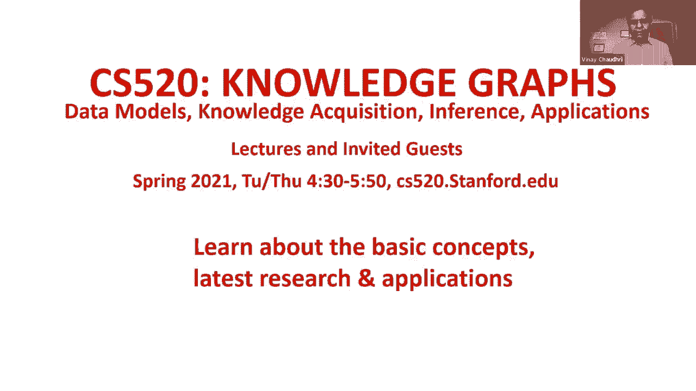

Focus today is going to be on。What are some knowledge of data models？

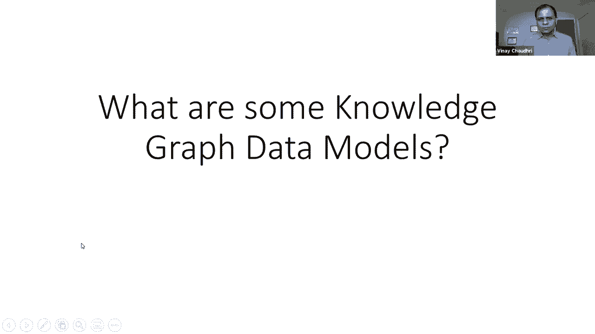

There are two popular knowledge graph data models， resource description framework and property graphs。

Re resource description framework or RF has a query language called Sparle and property graph data model has a query language called SR。

I'm going to give you a brief overview of both of these data models and explain the query language using examples。

I should say that this is not going to be a very deep and rigorous introduction。

 the goal here is just to give you enough of taste so that we can understand the comparison between these two data models。

 as well as also understand how these data models relate to more traditional relational data models。

We will also talk about what are the limitations of the graph data models and conclude the lecture with a summary。

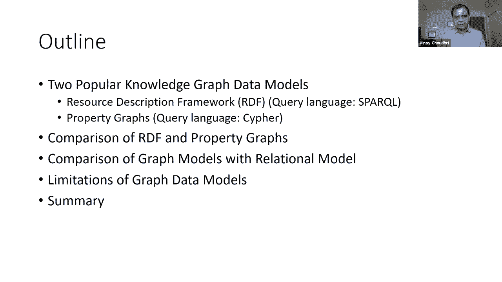

The resource description framework was originally designed to represent information on the web。

 so if you are interested in publishing data on the web and you want it to be easily discoverable and usable by other folks。

Resource description framework， data model is a good choice。And for that reason。

 worldwide the consortium W3C has put in considerable amount of effort in standardizing it so that when people use this data model to publish their data。

 they do it in A。Standard way which is easily usable by different people。

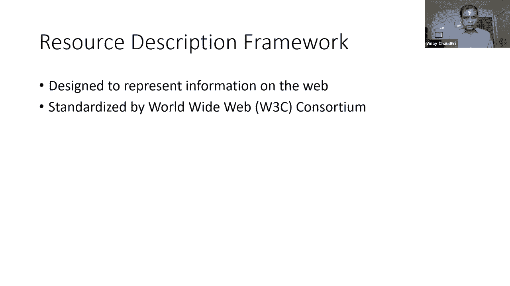

The fundamental construct in the RDF data model is a triple which is subject predicate an object。

 this is exactly how we define a knowledge graph in our last lecture。

 so if you have a statement such as art knows Bob， art and Bobb become the subject and object respectively and knows is the predcate okay。

So the RDF data model is。Fairly true and faithful to the abstract definition that we gave for the knowledge graph that it's a directed label graph。

But let's look at some details on how the data is actually represented in the RDF data model。

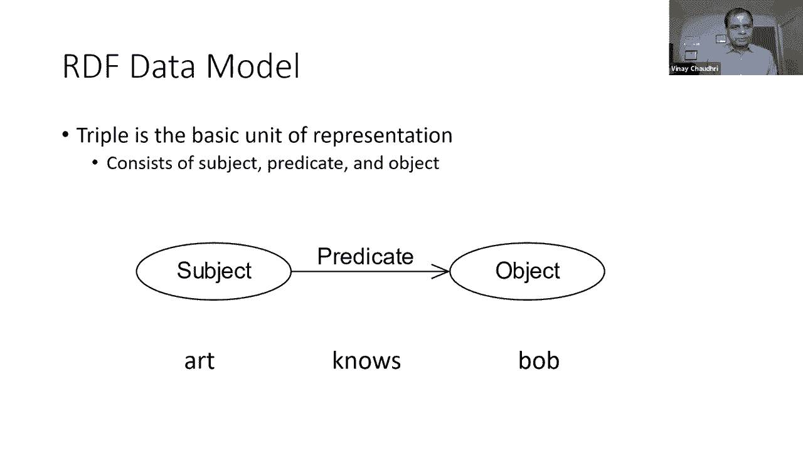

In this data model， there are three different node types。

 internationalized resource identifiers or IRIs， literals and blank nodes。

IRs are a mechanism to uniquely identify objects， data objects on the internet。

 just like for websites， we have URLs and Us， Is are meant to uniquely identify objects。

 those objects can also include websites and other kinds of resources on the internet。

And we will look at examples of Is and how they are different from URLs。

Literals are values of certain types， for example， literals could be integer strings， etc。

Blanck nodes are special kind of nodes in an RDF model which don't have any identifier。

 they don't have any name， so there is no way to refer to these outside or immediate context in which those nodes are originally introduced。

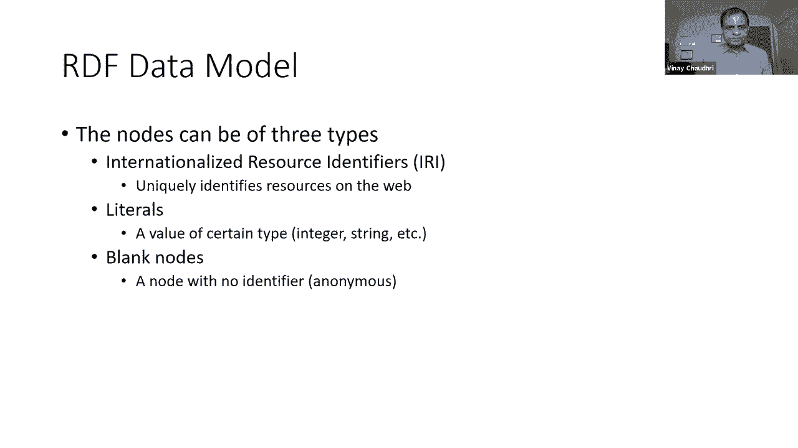

不清。So let's look at internationalized resource identifiers so first。

W to understand II is through example so on this screen i'm shown a URL a URLI and IRI right and just from the surface form of these three identifiers we can kind of get the difference and i'm going to sort of verbalize and make it explicit for you URL you know we use it on a daily basis when we visit the websites and that's a standard way to access resources through a web browser that all of us are very used to。

The main difference between URI and URL is that。In a UI。

 it is not necessary to specify the method of access in a URL we are saying we'll be using SGTP protocol。

 but in UI we don't have to say that， right？嗯。And the main difference between an IRI and URI is in the use of the character set。

In URI the character set is limited to US ASI character set。

 but in IRI we can use full universal character set which can also include foreign language characters so in the third example that you're seeing here you see some foreign language characters and this is natural because we are going to be using it on the internet so therefore we have to be able to make use of foreign language characters。

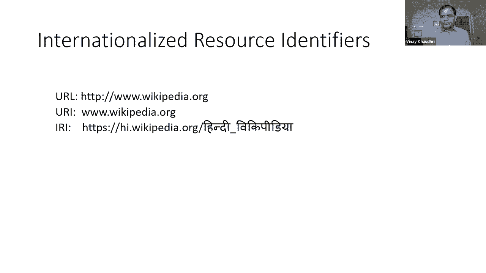

So it's the same thing stated in a little bit more detail。

 we can think of Is as a generalization of uniformed resource identifiers， Us。Limited to US ASI。

 whereas in II we use universal character set。

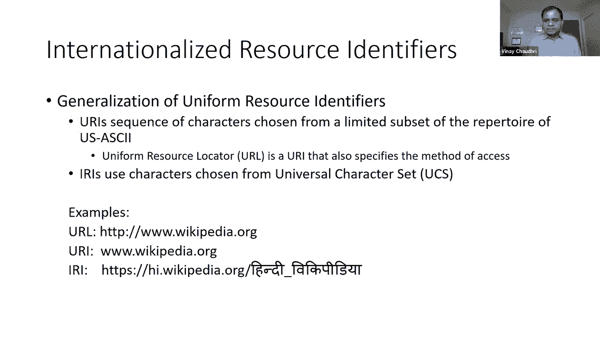

Now， if we wanted to represent a very simple art knowsB example using RF。

 we won't use just the names art and Bob， we would use URIs corresponding to them。

So for each object we would have a URri and in the next lecture I would be talking about how we go about constructing these URIs。

 but here I'm just giving you example Us so for example here art has a Uri corresponding to him。

 which is httP colon/examp。org art similarly Bob has a IRri corresponding to him and then for the predicate knows we have defined a IRri。

The basic idea behind these is that。Anybody who has to use these objects on the web。

 they can use them using these Is and any data source which is serving these Is。

 could potentially also provide additional details and definitions about each of these objects when they areque。

As we can see that these IIs can get burs and to get around that。

 RDF gives us a facility to define prefixes。If you define a prefix， for example。

 fourth colon is a prefix for the URL shown here httP colon xmlns。 co slash slash0。

1 once we have defined this prefix， then we can shorten the。The URLls and wherever So in the。

In the triple shown at the bottom of the screen， I'm using FO colon node。

 and RDF interpretter or compiler would know that while you know FOF should be expanded as per the abbreviation that has been defined within the document。

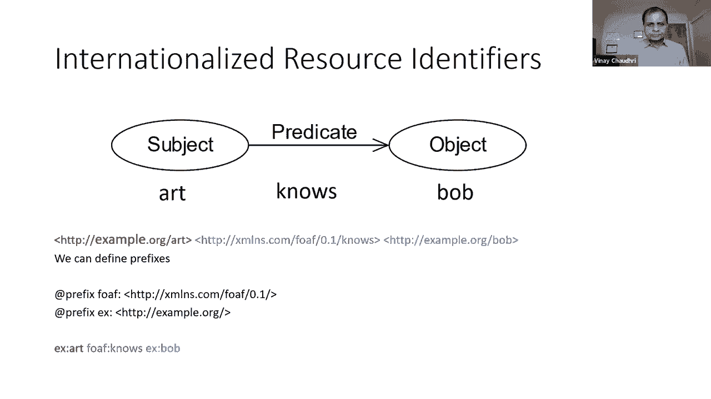

Literals are values of certain type in the first example which is shown on the screen here。

 we are stating that Bay， a person named Bay has age of 23。In general。

 we don't have to specify explicitly specify the type。

 in this case it's understood that 23 is integer， but it's also possible to make the types explicit。

In the two examples below that we see， we are making the type of the value here explicit by stating that it is of type excess equal integer。

These types that we are using， they are not defined as part of RDF。

 they are part of XmL schema definition。But these are standard types and we are able to refer to them using the excessD colon whiches。

Rereferd to as the namespace。And the type integer， so whenever we use excess equal and integer name space within an RDf document。

 it would know that it should。Follow the standard definition of the type integer。

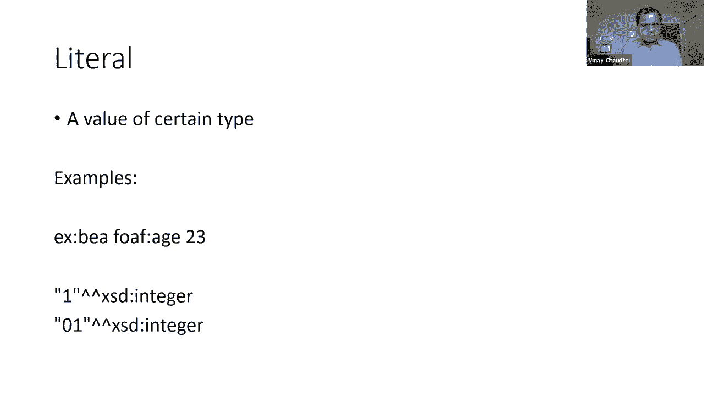

Let's not talk about the Black noteses in RDF。One of the use cases for using blank nodes is to represent structured information。

A concrete example of that situation is， let's say we have。

A triple in which we are quoing the address in the triple which is shown here。

 the address 1501 grantant Avenue， Bedford， Massachusetts。It's represented as a string。

But now we are actually interested in。Capturing the components of the address separately。

 so we want street city stadiums represented separately。But， you know， we don't want to。

Or we don't have need to refer to the whole address string by itself。

 so to get around that problem or to to have that level of detail。

 we can introduce a anonymous object。The anonymous objects they begin with an underscore。

And we can use those objects within the scope of the current RDF document so here we've defined a new anonymous object underscore colon art underscore address and then for that。

And on a subject， we can define these additional properties like street cities， state and zip。

These anonymous objects， they cannot be used outside the immediate context in which they are initially introduced。

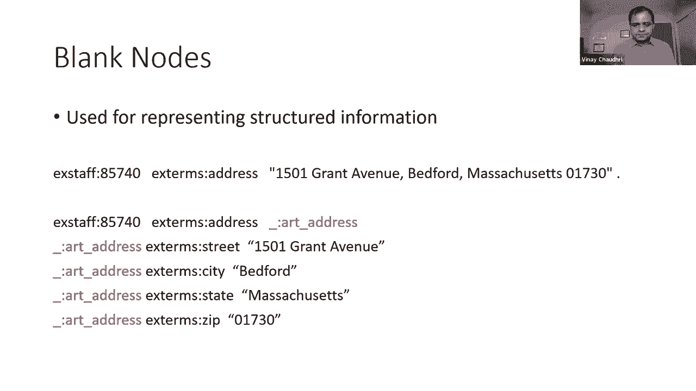

The RDF vocabulary is defined as a set of Is which are used in describing the data in general the RDF data or the graphs that define a static view of the word which is fixed at any given point of time。

 but there are some extensions in RDF vocabulary which allow us to capture the dynamics of the data also I'm not going to cover that in this lecture but I just wanted people to be aware that there exist facilities to capture the dynamics。

An R of data set， it consists of a collection of RF graphs。

And already and each data set has exactly one default graph and one or more named graphs。

The names of these name graphs can either be left blank or it could be a blank node or it could be an II。

So the main use of this is that if in AML。Particular R of data set。

 we want to group different parts of it in。Multiple disconnected graphs。

 we can do it using this facility。And whenever we issue queries。

We can refer to a particular graph within a data set。If you don't mention any graph。

 then the query will be evaluated against a default graph you say so again this is a final aspect of the RDf model I'm not going to cover this。

In any more detail than just mentioning this concept here。

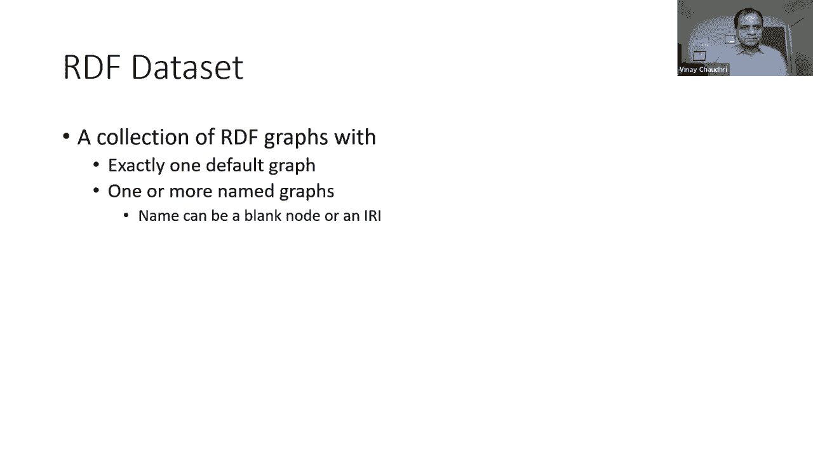

Let's now turn our attention to the query language Sparle Sparle stands for simple Pro and query language。

 the distinguishing characteristic of Sparle as compared to many other query languages is that we can state queries that go across multiple sources。

And the most obvious way these queries can go across multiple sources is because we can refer to objects which may be defined in multiple sources simply by。

Invoking their Iris right those Is could be mentioned or defined in different website and those could be used as part of a sparkle query language。

Sparkle is a full featured query language， just like many other query languages。

 you can have required parameters， optional parameters， you can filter the results。

The results can be data or the results can be graph。

I'm going to illustrate Sarle by taking some examples just to give you a feel for what is it like to write queries in Sparkle？

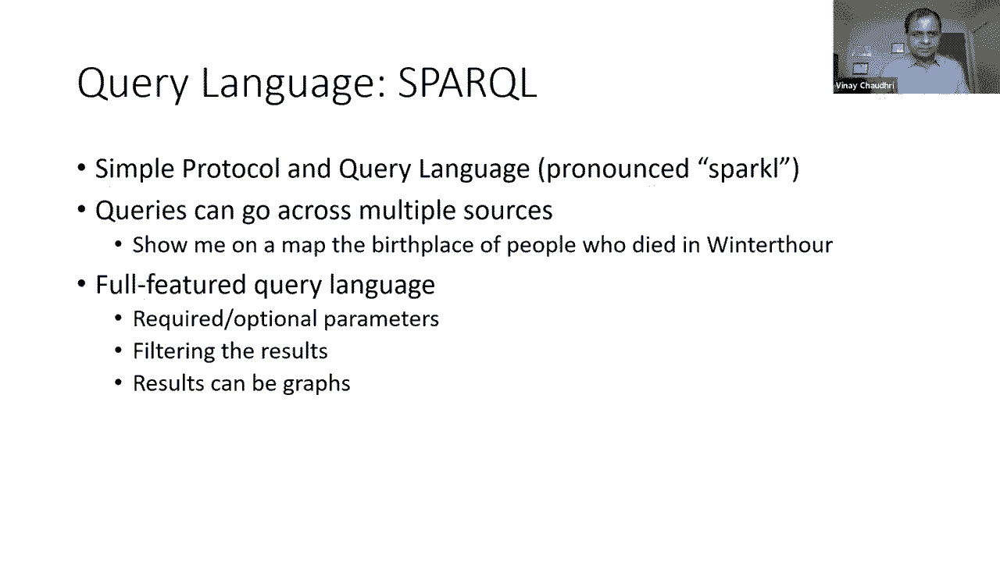

Here's a very simple query which asks for who are the persons that art knows against our very simplistic single triple data set。

We can。Pose this query by the one which is shown here。

 which goes like select question mark person where。

Art knows question mark person okay so this triple which appears in the red rectangle it is the graph pattern it's known as a graph pattern and question mark person here is a variable and we are looking for different bindings for question mark person。

So in fact， it turns out instead of onerup， there's more information in our data set and we get the。

Two answers， Bob and babe， when this query is evaluated。

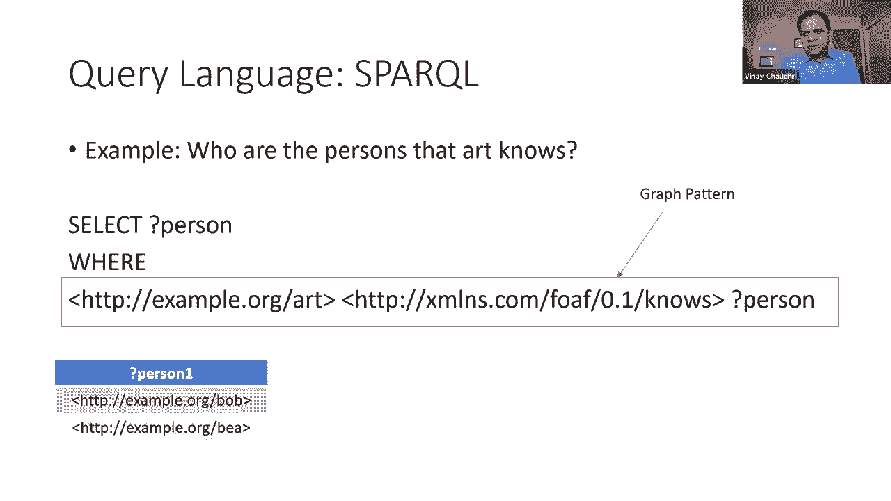

In general， the queries can obviously have more than one variable and in the graph pattern you can have more than one triple。

So if for example， we wanted to query who are the persons known by the persons that artt knows。

 we can do that using the query which is shown here。

 select question mark person question mark person one。

 and the first triple in the query is asking for people who art't knows and the second triple is asking for people who people known by art no like it's basically traversing the graph two levels D okay and when we evaluate this query。

 we get the data which is shown here in the table below。

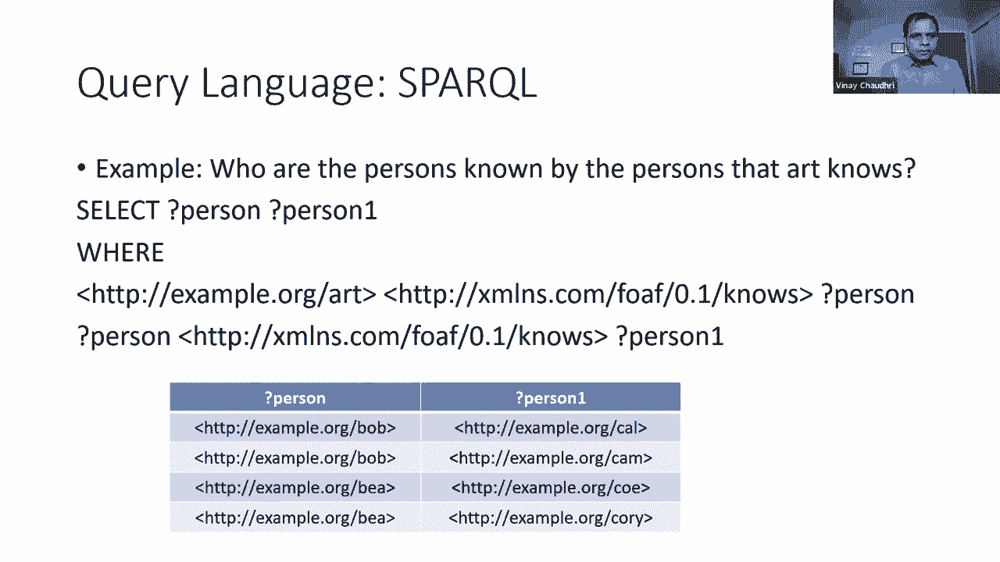

Okay， yeah， so this。In this query I'm showing that just like we were able to use abbreviations or prefixes in defining the RD of data。

 we can also use prefixes in posing the queries so in this slide we've defined the abbreviations for EX and fourth and then once we have defined those abbreviations then we can state the query a little bit more compact we don't have to fully spell out the II in the query。

 but when we get the results back the results are complete they spell out the Is as they appear in the dataset。

These queries illustrate a very basic graph pattern match。

 so each query would have a graph pattern which would be matched against the RDF data set and would return a set of data。

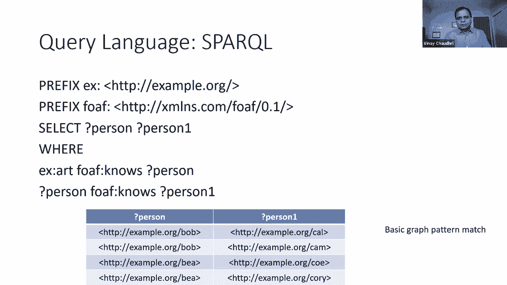

Now I will illustrate some examples of how we can filter the query results using Sarle。

On the left of the screen I'm showing a very simple data set in which we have two books。

 the title of the first book is Park tutorialial， it costs Price is 42。

 the second book the title is Semanic web， the price is 43。Now let's say given this data set。

 we want to query for all the books which have sparkarle in their title title begins with Sparle。

We can do that using the query which is shown to the right。

 the main thing to notice in this query is this filter expression。

In which we are using a regular expression and this is a very simple regular expression which is looking for those titles which begin with portal in general we can stick in any regular expression here and we can do any kind of filtering that would be allowed by the regular expression language。

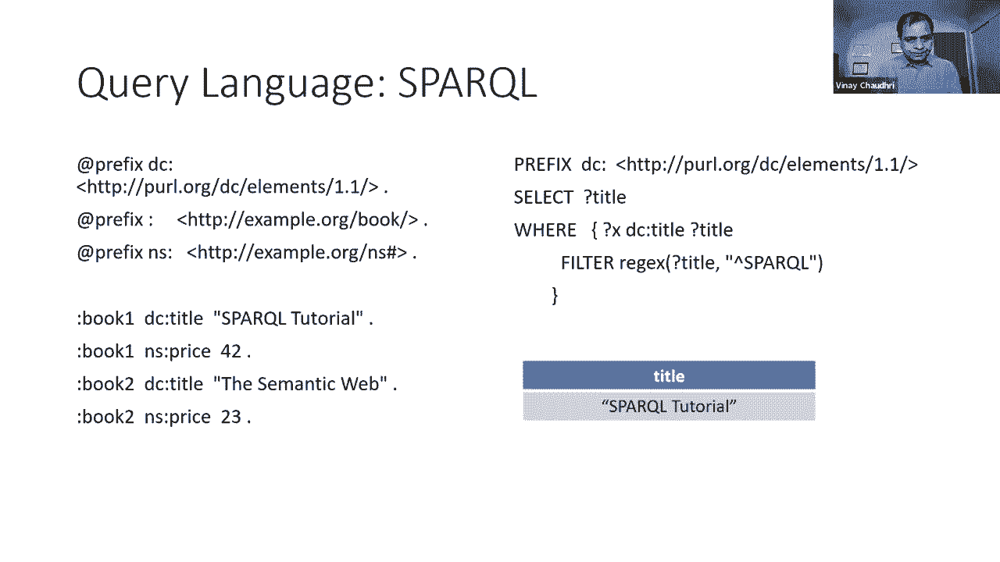

。Just like filtering based on regular expressions we can do filtering based on numerical constraints if you wanted to query for books whose price happens to be less than 30。

 we could put a filter constraint in which we are numerically checking the value of the price。

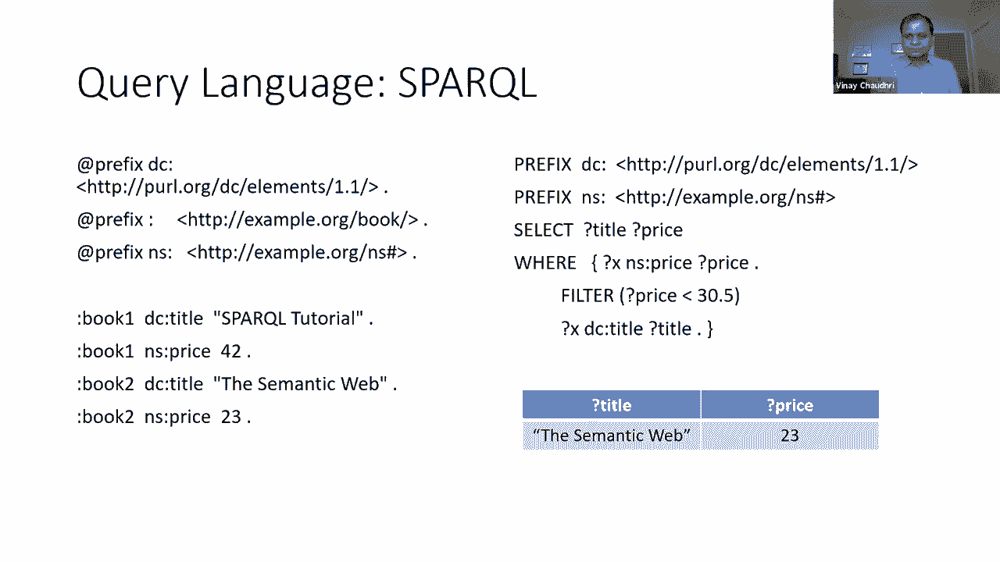

So that was sort of a quick few examples about the Spart query language instead of the select clause。

 the queries can also be posed using a construct clause when you post the queries using construct laws。

 the result is not just the list of data items but it could be a graph in itself。

 it could be an RF graph。In general， queries can contain more than one graph pattern。

Spararkle also gives facilities to eliminate duplicates。

 to counter a total number of results and a few other aggregate operations。Okay。

 and with that I will move to now the property Go data model is before I do believe that Vina， yeah。

 you mentioned earlier when you were discussing sparkle that you can ask queries across data sources。

 but you didn't say how one asks a question across data sources。

 can you summarize or briefly describe how that would be done。

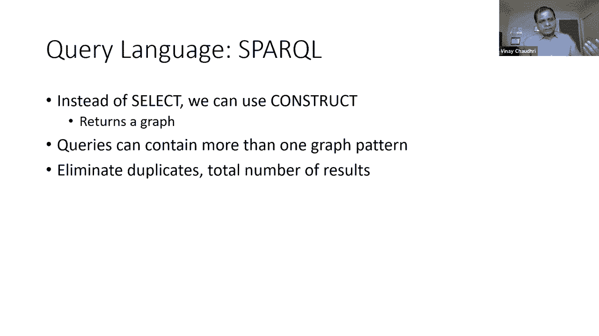

Yeah， so。The best thing would be for me to just defer to next week。 so okay。

 fine like I shouldn't say next week this Thursday so the focus of our lecture on Thursday。

Is on distributed Spartle query execution。And we have Professor Tamar Ozu。

 who will be our guest speaker， that's what he works on。Right。Thank you， yeah。

I also notice that there are a few questions in the chat。呃。It's okay so far。

 just confirming that anonymous blank notes are basically scm constants for those who know what those are。

オオ。That sounds good， Okay， so I will then move along to the property graph data model。

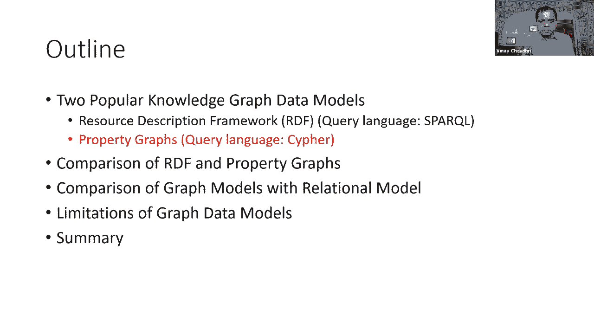

Property graph data model is used by many graph databases， including a neoo 4j。

 which is quite widely used in the industry and there are many more Amazon Neune。

And I don't think Amazon neptune is tied to a property graph model。

 but there are many graph data models out graph databases out there which are built around the property graph model this data model is meant for general graph data and in particular it is positioned in the space where。

We can characterize the application aschema free。We don't necessarily have to start with a predefined schema。

 we can just you start putting data into into our database using。

The schema is just using a simple structure that I will introduce to eliminatemin。

Property graph data model is also positioned in a space where。Tversing the graph is very important。

And we will look at examples of queries that involves traverscing graphs。

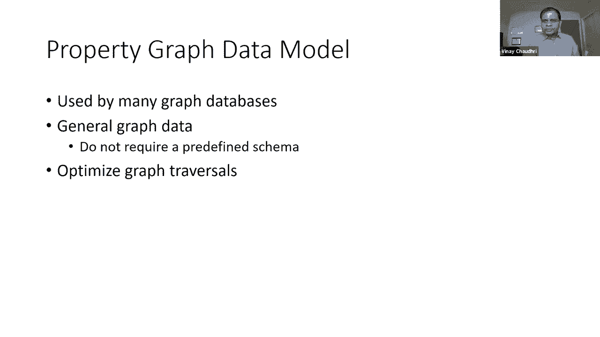

So here's the property graph data model in a nutshell。

The basic constructs in the data model are nodes， relationships， and properties。

Each node and a relationship has a label， so in the spirit of the label directed graph model。

 you know that's our label directed graph nodes are the nodes of the directed graph and the。

And the relationship is the label over the edge between the nodes。

So each node and a relationship can have a label associated with them and also a set of properties associated with both nodes and edges。

And properties are key value pairs， keys are strengths and values can be any data type。

And the relationships have a direction， right， so made' say directed growth。Let's look at an example。

The very simple art knows。Bob example is shown here now represented as a property graph。

 so in the property graph representation of this simple example。

 we will have two nodes which will have a label of person okay they are person nodes。

And they are connected using a directed edge。Which is labeled as nose okay now the node to the left person has a property called name。

 which is given a value art。Okay， the note to the right。

 it has a property called name which we've called bay。

 sorry it's I change the example from Bob to bay， but the basic idea remains the same。

So in addition to the basic。Representation of art knows Bob just for illustration I have shown few additional properties。

 so like for the note to the right we also have an age property we have a based near property。

And for the Edge nose， we have a sense property， which captures that art and bay have known each other since 2005。

Now at this point， one question you may ask is why is base near a property。

 why are we not modeling cities as nodes in themselves and why are we not connecting them using edges？

That would be a valid question。I could answer that by saying you one that would be valued representation too right you could represent city as an node and then you could have a no property name equal to Seattle and then you can have a new edge card base near okay。

This actually is also the main design decision we have to make when we are designing a property to update a model as to what should be our nodes。

 what should be our edges， what should be the properties， what should be node properties。

 what should be our edge properties， etc。I'm planning to。Do a whole lecture on this next week。

 which is next Tuesday so I'm not going to get into the considerations around why this would be better than the one which was shown on the previous slide we will get into it next week but for the purpose of just understanding the data model it's sufficient to know that in the property of data model we have nodes relationships and properties and nodes and relationships themselves can have a set of properties associated with them and and these edges are directed。

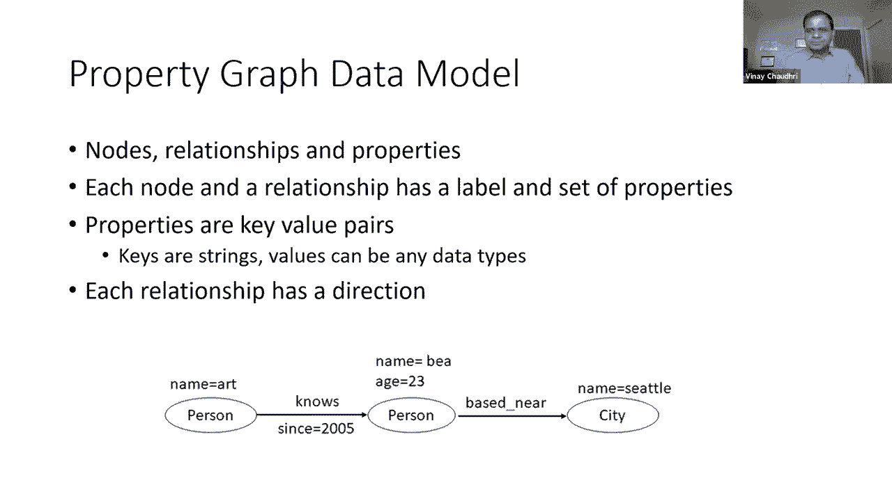

Now let's jump into the query language， CFR is a query language which was originally designed for querying graph data。

It's呃。Being considered for adoption as an ISO standard。

One of the big difference between Spartle and saferfer is that。

Sfer is not limited to just query operations。And it supports all popular grid operations。

 which include create， read， update， and delete。You can do all for using Sfer。For this lecture。

 I've chosen to focus just on the read operations， but I just want people to be aware that CFfer also does create update and delete。

Okay， so here's a query， which。Ask for which people does art know。Stated in Sfer。

Overallal structure is same you know there's a match clause and we are asking for some variable to be returned。

 but the main thing to note here is that here also we have written a triple。But。

In a notation which is more popularly known as ASI notation photograph graphs。

The first set of parentheses represents a node。The second set of parentheses at the end that also represents a node and in between we have the edge。

Within each node， we can。Specify what kind of label we are looking for。

 what kind of properties we are looking for。Right as part of the qua， right？

So when this query is executed by a s engine， they would it it would result in。

A list of people who are knows。Now， as a generalization of this query， we can。

Let's say we want to ask which people does art know since 2010。So， this is a。

Restriction or constraint on the relation that we are looking for， right。

We can put that constraint right there as part of the relation in our word。

In our askingI notation for the graph pattern that we're adding here。

Now suppose you wanted a slightly different definition of 2010 in that we are now looking for people who art has known not just since 2010 but also before 2010 right so let's say we wanted to write that query。

In that case， we would on the since property， we would put a variable。

And then we would introduce a where constraint， which says that。Y has to be less than equal to 2010。

 right？So just like you know we have in Sparkle， we had the filter constraints here， again。

 we can introduce filter constraints by introducing variables which would match either numbers or strings and then we can put constraints in the weight loss。

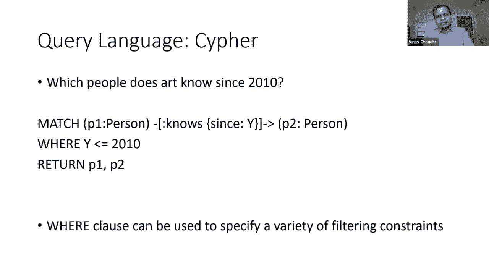

Siffer also has a comprehensive range of constructs for counting things， for grouping things。

 for aggregating things， for taking mins and Macs， etc cea。Again， I'm not going into detail。

 I just wanted to introduce the language just to give you a feel for what it is like。

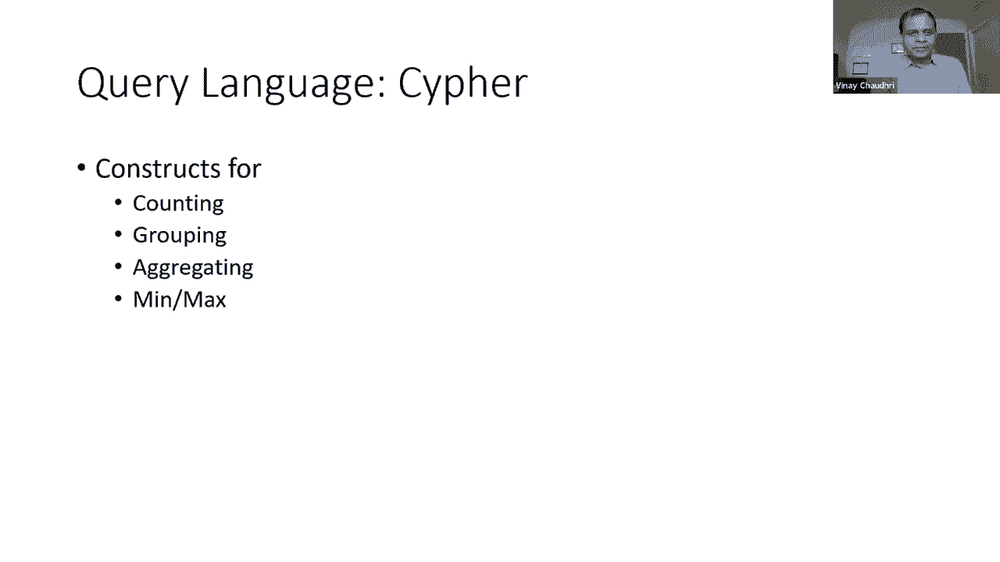

So that we can talk about the comparison between Rdf and property graphs as to how they're similar。

 how they're different。

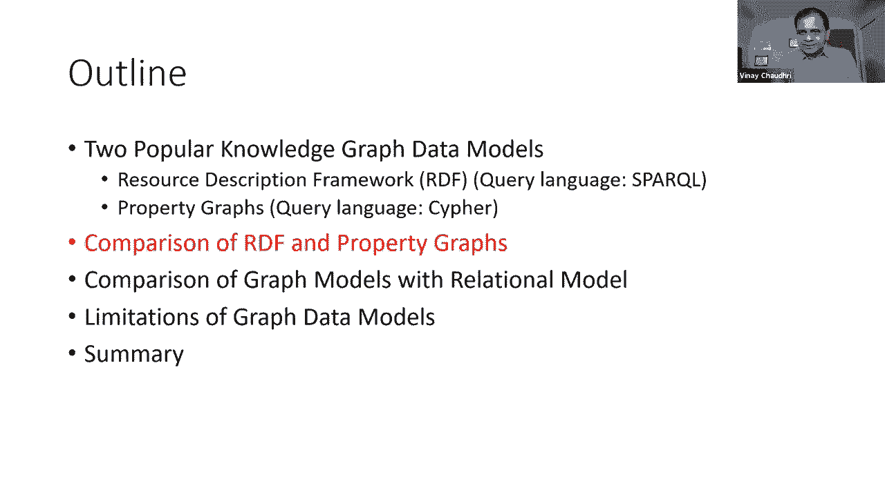

Now while comparing these to one thing I should say before you move on。

 there was a question that came in actually it had to do with RDF。

 but maybe before the comparison the question is so does Sple work only with information available in websites similarly question for RDF it seems that as you've described it that all of those IRIs have a web domain that they're associated with HTTP。

 there's an access method and then a web domain， so if you don't have a web domain you have an access method you can't even refer to an object。

 so is there a necessary relationship to a website？

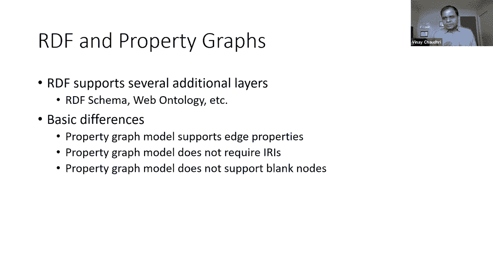

Well， I mean there is definitely that's definitely the use case to use the query language over web resources。

 but in principle you could have a。Central software system or central server。

 which is not even connected to。A web right which is totally disconnected from the web and within that server。

 you could have RDF data set， which you could query use in sparkle。

mean there is nothing that would prevent that right because single isolated website is a degenerate case of that。

It's a web but only single site。Right。So so the so there's international standards for naming websites。

 what about this special central site you're talking about。

 is there a prefix or something that one could use to refer to things which are not websites？

Things that are not well， I mean， I think there are certain standard namespaces which are defined as part of the specification。

 the the RDF specification and RDF specification， and those can be used and those would be recognized by any compliant RDf engine。

Any engine that claims to be compliant to the specification。

 they would respect and honor the definitions which are defined as part of the RF specification。

Right。And beyond that。I would like to defer to the next lecture where we wouldn't actually be focusing on the distributed query execution。

Okay， so let's that now move on to discussing。How the RDF and property graph models compare and what's the real difference between the two？

And the first thing I wanted to state in that context was that。

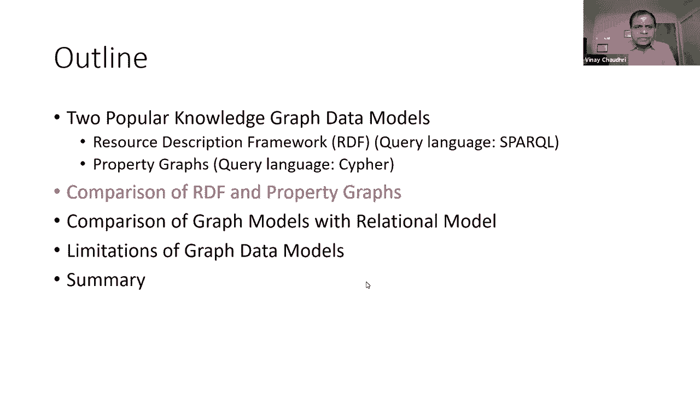

呃。RD F is the。Most basic and simplest language in a layer of more complicated languages right so there is the RDF and then there is RDF schema there is the ontology languages there are rule languages。

I've not covered any of those。You know， some people would say that， oh， you know。

 you shouldn't be comparing RF in isolation and you should be comparing this whole family of languages。

I mean， I have chosen to keep that big comparison out school for this lecture and I'm focusing just on the very basic。

Graph representation which is supported in RDf and I'm going to compare that to the property graph right and it's possible that property graph people have also done more extensions I'm not considering those either right I'm just focusing at very cold basic fundamental graph representation that we have in RDf and property graph and i'm comparing you comparing at that loop。

Okay。So in that context， the basic differences are that in property of data model。

 we have edge properties in the RDF model we。In the property Go model。

 there is no requirement as such to。Have everything be referred to using Is。Whereas in Spartle。

 it is given that because it is designed for use on the web。

 we would be using Is for referring to different things。

And currently the property G model does not have any notion of black notes in the same way that RDF does。

This at the highest level now this difference about edge properties。

 it needs a little bit more elaboration because it's not as simple。

And the reason is that the need for edge properties can arise even when one is using Rf for doing data model。

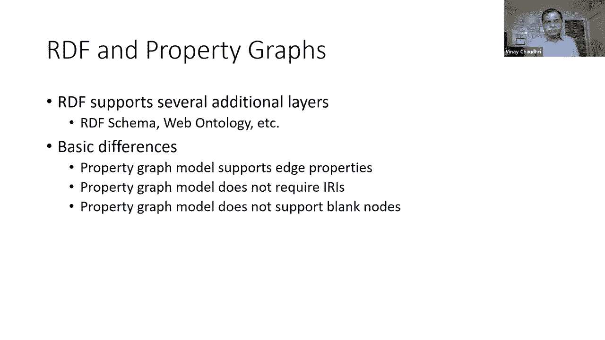

And here's one example， let's say we have a triple in which we are saying that the weight of an item is 2。

4 okay， and we have a need to state that。This measurement was taken by a certain person， right。

 which if you were using a property G model， you will just have an edge property and you would be done。

 right？But。We are doing a modeling using RDF and in RDF， we don't have edge properties。

 so what do we do？Right， so RDF has。A mechanism called reification and I should say that this mechanism is not specific to RDf you can do reification in a property graph model also。

 but for this particular use case if we wanted to model this in RDf we would do reification and for reification。

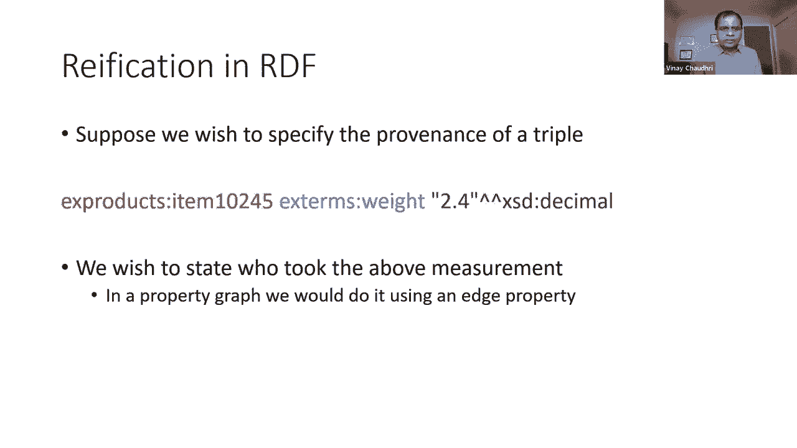

There are。Four new predicates that we are going to use RF colon and Ti RDF colon subject。

 RF colon predicate， RF colon object， these are four new preddiicates I'll show you how they are used in a minute on the next slide and in one new class it's called RDF colon statement。

Okay， and I think their use will become their definitions will become cleared by their usage。

So what we do is given the triple for which we want to introduce a property。

 we will first invent a new object okay so in this case we are inventing a new object triple 1，2，3。

45 and this is an object which represents the triple for which we are going to specify property and the first thing we would say is that this object triple 12。

34，5。It has a type of statement。Which indicates that。

This object is actually representing a statement。诶。😊，And then for this object。

 we will define three new。Properties using subject， predicate and object。Relations。Okay。

 so the subject of this triple is going to be the subject of the original triple。

The predicate relation of this triple is going to be the predicate of the original triple。

 and you can see this using these arrows that I have drawn on this slide。Now， once we have。

An object available that represents the original triple。

 we can associate any number of new properties using using。Additional predicates with that object。

 so in this case we've introduced a new new predicate DC colon creator and using that we are saying that this object was created by Exta 85740。

 which is the person who actually took this measurement okay。

So the point here is that if we want to capture relationship properties in。RDf。

 we have to use reification I mean it can be done， but we have to use reification。

Our representation gets more complex， more verbo， I shouldn't say complex， but it gets more verbo。

 we need more things， more triples in our representation to say the same thing。

 which we could say in property graph。But it's not that we。

Are prevented from associating properties with the relations in a RDF model。Have an added question。

 yeah， so that allows us to talk about a triple within one data set to suppose that same triple appears in two different data sets。

How do we talk is there a is there an extension of this that allows one to talk about one triple as opposed to another。

 so one might be。であ、はい。Stated by one person another one might be stated by another。

 so it might have a property of its own， so you have to differentiate those two different triples into two different data sets how would you differentiate that must is there an extra property for that。

Well， so you're saying so in this example， you're saying that the same triple appears in a different data set there's two different there might be two triples in different it might be the same triple may appear in two different data sets with a different property so that means there's a new triple one。

 two， three， four five is which data set is that in。

 how does one identify the data from which that triple is being drawn because the same triple may appear in two different data sets。

Right， yeah so。I mean， I would think that you would associate you would use named graphs。

In that situation。Right， so I mean you need some way to distinguish， right？If， if。

The two triples are identical and they appear in two different data sets。

Right and I mean they are identical because they're using identical they're not they're not because the purpose of reification was to give a property to a triple so you might have one the data the triples are identical the subject the predicate and the object are the same but this extra property may be different one might be 2003 one might be 2004 so so year it was true yeah so I think in that case the object identifier that represents the reification that would be different。

So in this case， we have triple 1，2，3，45 in the other data set， the identifier of the refiite。

Version would be different I agree with you， I think that's the right way the question is how do you say that this triple one two。

 three four5 is opposed to one， two， three four six what data set it came from。

There must be another property to say one，2，3，45 came from data set one，  one2，3。

46 came from data set two， it must be some additional property of the triple。

And my understanding is that you would use name。Named graphs to do that there might be a simpler way of doing it。

 but that's sort of the first thing that comes to my mind okay。Okay。

 so just to sort of further understand this comparison between RDf and property G modelsus。

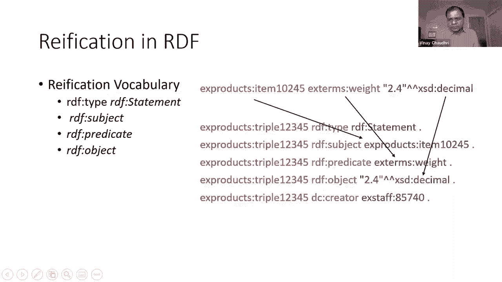

I'm going to quickly sketch how you would take data in one and put into the other。Okay。

 this just to sort of deepen our understanding of how these two things relate to each other。

So in the property graph model， we have node properties and if we were converting them to RDf。

 we can simply。Take a note property and turn it into a triple in RDF。啊。

For if there is an edge between two nodes that also。Becomes a triple if you have edge properties。

Then we would refi those edges and then we'll get refiite edges and we'll get additional triples for those refiite edges okay that's a translation。

Of course I'm glossing over the fact that in the original property Go model。

 we may not have Is and we may also have to amend the Is when we are going into RDF。

At the highest level， I think this translation or this mapping is pretty straightforward。

Now let's look at it in the other direction， so in Rf we have triples and the simple and most。

Brain dead， I should say。Simple or easiest way to do this is to take audio triples and just turn them into。

Nos and nodes and edges in property graph， subject and object become nodes with predicates as the edges between those nodes。

Now some people will say， no， no， no， no， this is really abuse of the property data model。

 you're not really making use of it。And that is true。

 and it also turns out that it's not that difficult to do better than this very simple translation。

And the way you do that is。When you are turning those triples into nodes and edges in the property graph model。

 you create new nodes only for those RF nodes。That are Iiz or blank nodes。

For anything which is a literal you don't create a new node。

 you simply turned that into a node property okay so which is a little bit more faithful to the way the property data model is designed so you will get slightly less number of nodes because litals no longer become nodes right literals will become node properties。

Now some people say will say that oh even that is not sufficient or that's not enough because in the RDf we may have modeled a lot of information using refiite edges。

 we don't need reification in property graphs so we need to sort of reverse engineer or reite edges from the RDf and we need to convert them into relations with edge properties in property graph so that can be done right so I mean conceptually it doesn't seem that hard mean I'm sure the details are not that easy and maybe more complex and there could be a whole lecture on how you do that but here i'm just trying to convey the basic relationship between the two and how you would map one to the other。

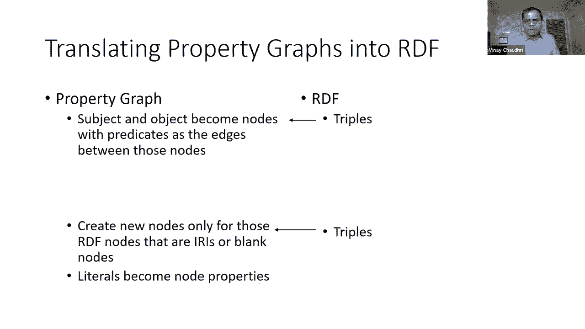

嗯。Okay， so this in this slide I'm just summarizing the comparison between Rdf and property graphs per all Rdf is sort of a part of a much larger and richer family of languages。

In terms of differences， property G model has edge properties which are not directly supported in RDF。

 but you can do edge properties in RDF in a little bit more of abo manner。呃。

RDF model is tied to Iise property golf models is not mean you don't have to use I in a property golf model and there's this。

No explicit treatment of black nodes or need for black nodes in property health model。

And but in terms of people who are practitioners and who are trying to build systems using this so trying to integrate data expressed in these two data in one can indeed be interconverted into the other。

 it's definitely some work， depending on how faithful you want to be。

 I think going from property graph to RDF is a little easier。

Then going the other way around because if you want to reverse engineer your reification。

 you have to do a lot more work if you are going from RDF into the property graph data model。

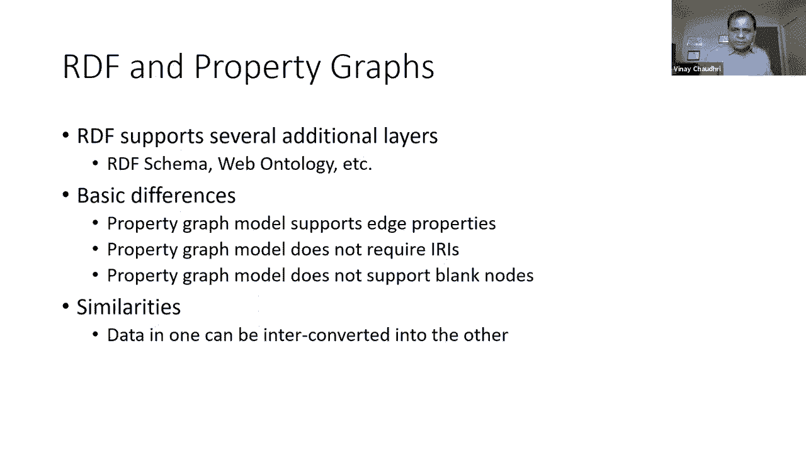

Okay。Now I'm going to switch gears， and I'm going to talk about the relational model versus the graphphor。

And here are the two sort of basic arguments on each side of the relational and graph model perspectives。

And I should say that my goal here is not to say one is better than the other。

And I'm not going to do that。 My goal here is to。Characterize the differences and help you understand。

嗯。For what kind of problems one is suitate or one may work better。

 or what are the tradeoffs between the two between using one versus the other？Okay。

 so that's sort of where I'm coming from。Now， some people say that the graph models are easier to understand。

But the proponents of the relational。Approach would also claim that well you know we can visualize a relational schema。

 you know you just have to write an appropriate tool and we can visualize a relation schema using some kind of entity relationship model or a concept model it can be done it's not an inherent limitation of the relational system。

好。And then the proponents of G approach claimed that graph queries are more compact and faster。And。

The reductional folks would say that no， no， no， we can also take your draftqueries and we can compile them into relations and we can make them run as fast as you can make them run into the draft system。

 okay。Now this second point about the query evaluation。

 it's a little bit interesting and I thought it would be good to make it concrete so that at least you can see for yourself what the argument is okay and to make that concrete we will take an example。

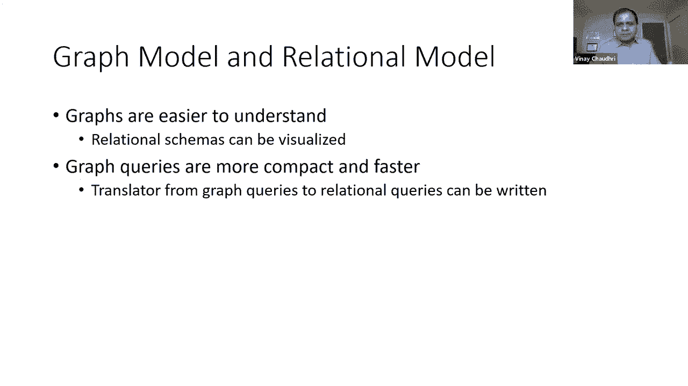

In which we have three tables， we have an employee table where we have employees and all the information about them and a department table in which we have information with the department。

 the name and the manager。And there is a table which connects it to employees and department。

Now I'm not going to defend this design I'm going to assume that this design is the best design for this domain and people have followed standard normalization and other principles to come up with this design so that that。

Not going to be topic of discussion， let's say we have this design。

 this is the best design for this particular domain。And given these tables。

 we want to calculate who are the employees who work in the IT department？

Okay so if you wanted to do this in SQL， oh actually before I show you a SQL。

 let me show you this schema in property graph， so if you were modeling the same thing in property Gra we would have an employee node and we would have a department node。

 there would be a works in E between the two， the employee node would have properties like ID a name a department would have properties like ID name and manager。

Okay。Here's the SQL query SQL query to figure out the employees in the IT department and the way it would work is we are going to first select。

A name from theEmploy Dev。And then we are going to do a join between the employee table and the employee department table。

To figure out which department that employee works in。

And once we know what department their employee works in。

 we will do a join with the department table。And filter the results on the name， which should be I。

Okay， so。Doing this SQL query requires us to do two left joints， which you can see here。And。

We can find out the employees who work in the IT department。

Now let's say we would write the same query using C， how would we write this？

If you were to write this in CFfer we would have a match clause and the match clause we would have this pattern employee works in the department and in our rare constraint we will say that the ID of the department has to be ID okay so clearly this Cer version of the query is。

More compact than the SQL version。You know， I use a very simple example to sort of convey the intuition and you will see people showing a SQL query。

 which is like a full00 lines or 200 lines and they'll show。Tline graph query。

 but the basic idea or the essence of the difference is what I've captured in this very simple example。

And you know there are queries where you have to do joins and those joins are not going to be in the numerical medical values。

 they're going to be on the objects。Wwhichch people in the graph database systems。

 they refer to as traversals， graph traversals， and they claim that okay， well。

 if you have to do queries which involve traversals like this，Our system is optimized for it。😡。

That's sort of the claim from the Gulf。

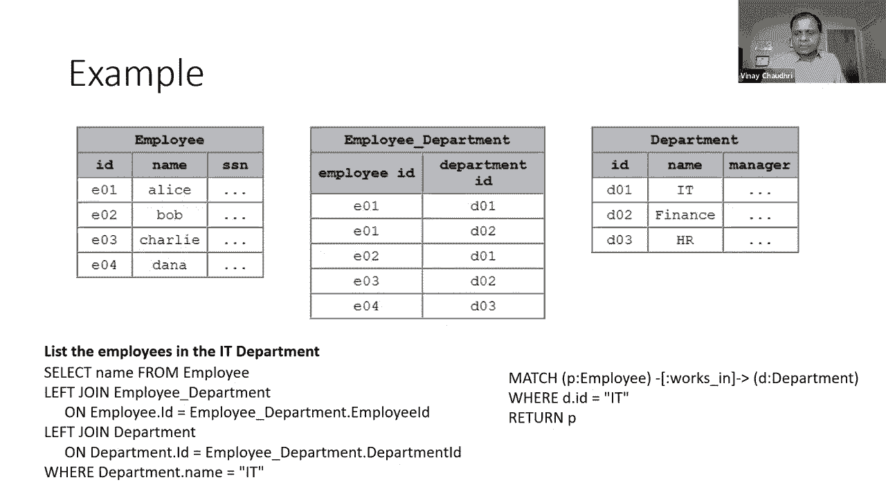

Database side。I might point out Fnay that if a SQL person were here。

 he could point out that there's a three line sQL version of this too that you've made a。

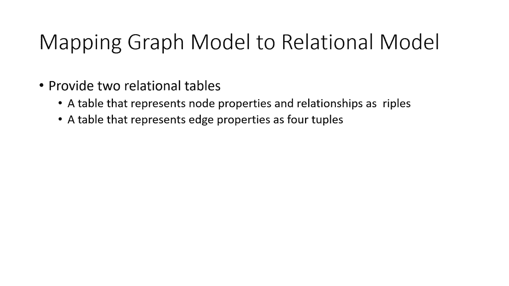

Not a particularly compact version of SQL using left join。

 theres other ways of doing that select name from employee employee department comm department。

 set where and then give the condition and it looks not much longer than the ciR version。

But the point is taken that that one on the right does seem to be a little more intuitive。Right。

 so I mean I think it'd be interesting to analyze that more compact version and to be fully convinced that when we are presenting a comparison we are using the best version。

 I think that would be exercise worth doing and I'm actually very interested in doing that。

And the reason why I chose this example is because。

 you know I was getting frustrated with people showing very long SQL queries and you know it's very difficult to understand what's going on and why is it better。

 right？And so in this example， I've tried to come up with。

Simplest possible pedagogical way to illustrate the difference right and if this is not the simplest we need to make it even simpler。

And I think that's definitely worth building。

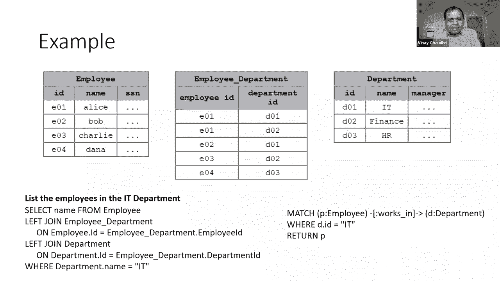

Okay， now from the relational perspective， people would argue that， okay。

 if you give me a data in the property Go map model， I can。

Represented using two relation table in one relation table I'm going to have all the note properties and the relationships and I'll store them as triples Okay theres may be one table which is set of triples and i'll have a second trip second table in which i'll have only four tuples and in that I would store edge properties because I properties are。

Essentially four triples， right， they are not triples， they are four triples。And。

And this whole all the relational data that you or all the graph data that you have in the property graph model。

 I can model it using these two simple tables and then use my existing machinery。

 you know there is no particular advantage to going with the graph database route。

Now that argument makes sense and it makes especially good sense if you have a system like this in which。

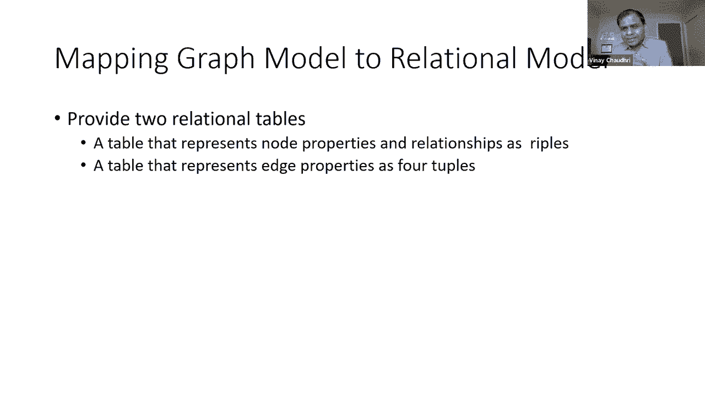

You have a lot of legacy relational data and you don't want to touch it。

You don't want to touch it and you don't want to put everything into the draft database。

 but you also do have some draft data and you do want advantage of these compact way of stating queries and graphically visualizing the schema that you have for that kind of use case。

 there are people who are building systems in which the queries can be expressed。

In a graph query language like Ser or some version of it。

 and then they would provide a translator that will take those graph queries and it would convert them into the queries over the underlying SQL data relational data store。

And it would optimize the evaluation of those queries。

And it would also work for situations where part of the data might be relational and part of the data might be in sitting in a graph database。

 graph database engine。In terms of you know which one。

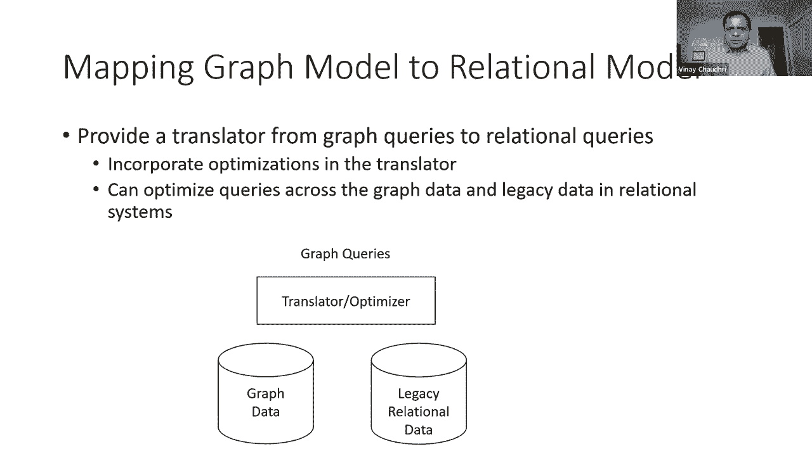

Works better， you know I mean again， that was not the charter that I had in in this lecture。

 but I hope I've given you intuition into the argument from both sides as to why the。

Proponents of the draft systems say that， oh， you know， this is more visual。I mean。

 even though you can visualize the relational data or relational schema using a suitable tool。

 but your storage format is different。The advantage in the case of the graph system is that。

Whatever schema you're visualizing in the graph form that's exactly how you're storing the data so there' is no difference between you your visual representation of the schema and the storage representation。

 whereas in the relational case， you still would have some disconnect like if you're using some kind of entity relationship visualization。

 that's the visualization is different from the actual storage。And this。

Issue about whether we can use a relational engine as。As a storage mechanism for a graph data。I mean。

 I think that's as far as I know that's a topic of ongoing work and ongoing research。

 there are successful highly successful systems doing each of those kinds of。

Now processing and providing capabilities again I don't want to name them here。

 but such systems do exist on both sides and I hope with the discussion we've had here。

 it gives you a little bit more insight and power into comparing and understanding the differences between the two。

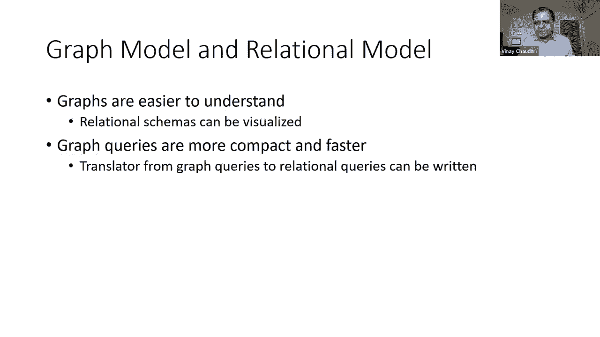

Maybe I can say a word or two here on that today so it's it is true that if。

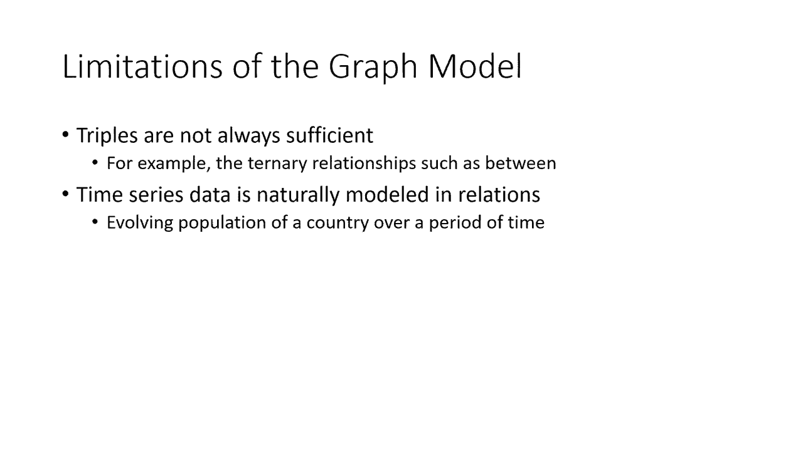

Your goal is to represent a knowledge graph。Then doing that in a relational model， in other words。

 representing triple tables。And。If all your tables therefore representing triples。

 then specialized languages for accessing triples。

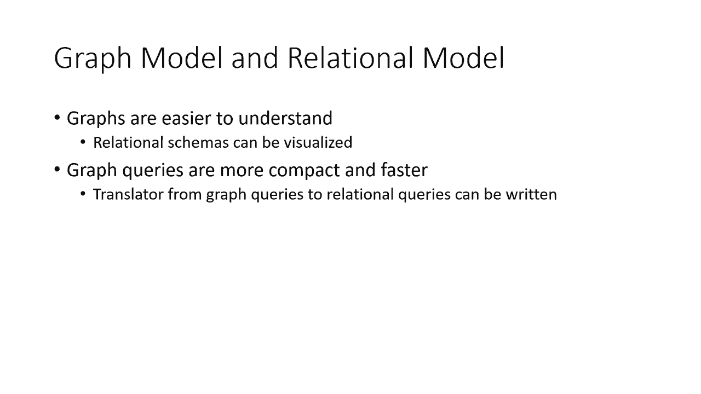

Can can。In many cases， dominate to do better in terms of speed than。

Databases that are designed to handle wide relations as well as triples。

The argument that is often made by the relational folks is that storing the data as triples。

Is not necessarily the best way。You might have a wide table， for example， you have a person。

 the person has a father， person has a mother， a person has an age。

 a person has an address where they store， so storing all those attributes in a single row of the table。

If it's done that way， then one can access data about that person much more rapidly than one can with a triple database。

So in that case。SQL and relational engines are going to be faster than the triple engines and so it does depend on your data model however we're talking here about knowledge graphs in other words triples how do we store triples so yes。

 the relational model the relational approach is is not optimized for that case and is not going to do as well。

 but there are other ways to represent that same data where the relational folks。

Could show better performance if it restored in that other way。

I also I'd mention it because there is an argument back and forth between between the triple the implementation of triple T databases and the implementation of relational databases yeah so I agree with everything that you said right so that if you didn't use knowledge graph representation there might be other representations that are better so that that point is definitely valid but I think the argument that I was trying to follow through here was that。

Even when you have a knowledge graph representation。

Relational implementation could still be a viable alternative in terms of efficiency and that's the claim that some systems that's the claim on which some systems are based。

Areee， agree optimizing for triples can do better still。

 but you're right that certainly is viable they're comparable in those cases that you say right。

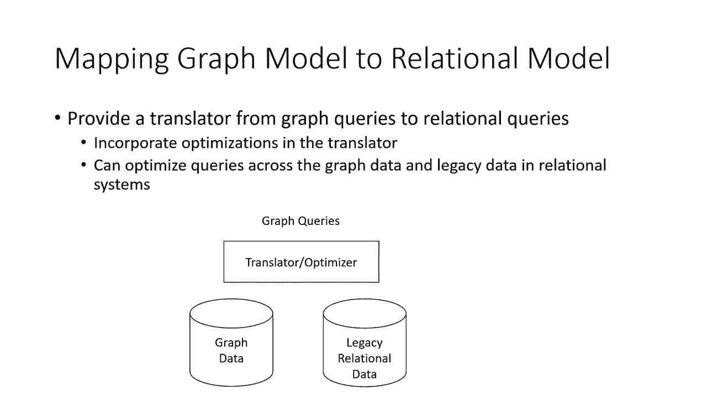

Okay， so let's now talk about。

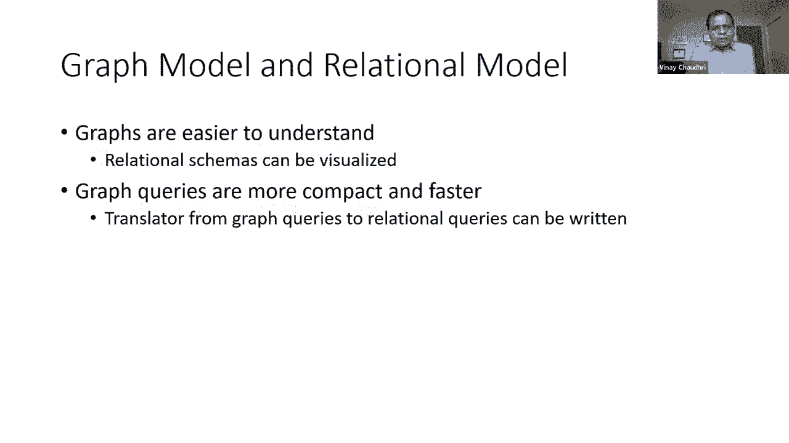

Limitations of the graph model right because there are die hard graph people who want to do everything using graphs right so the question is what are the boundaries you know what what are the kind of problems for which the graphs are。

Good and what are the problems where the graphs actually break down？And my favorite example is。

 you know。Anytime you have a relationship which is not binary and there are lots of them and for example。

 take the relationship between A's between B and C it's inherently a relationship between three things right and you cannot model that using binary relationships now some people will say of course you can model it using binary relationship by using the reification technique right so you can refi binary sorry between relationship and you can have properties which capture the object that is in between and the surrounding objects you can do that。

But again， it's it's。Not the most natural， you know， I mean it's kind of like， you know。

 I'm going to do everything using ternary or using binary relationships regardless of whether it's the most useful tool the most appropriate tool or not。

 right？😊，So and again between is just one example I've just taken one example。

 I mean there are a lot of other examples where。A triple representation is not the most obvious or useful thing to do。

 right？And for that， a graph model is not the best choice， you know。

 you need something which is more expressive。Another example where graph model is not the best choice is。

When you don't have a lot of these object to object relationships， you mostly have values。

 you know let's say you are tracking the population of a country over a period of time。

 so it's just numbers， you know and。You could make node out of those numbers， but。

The advantage and mileage you would get out of that is questionable right it's I think you're much better off just using a relational model and put your data in a table and do the crunching over that and not even worry about trying to build knowledge graphs out of way。

呃。So I think the point here is that。Clearly， there are boundaries there are limitations that knowledge graphs。

2。not that in the sweet spot for solving the problem and one has to be aware of those limitations instead of trying to force everything into knowledge graphs。

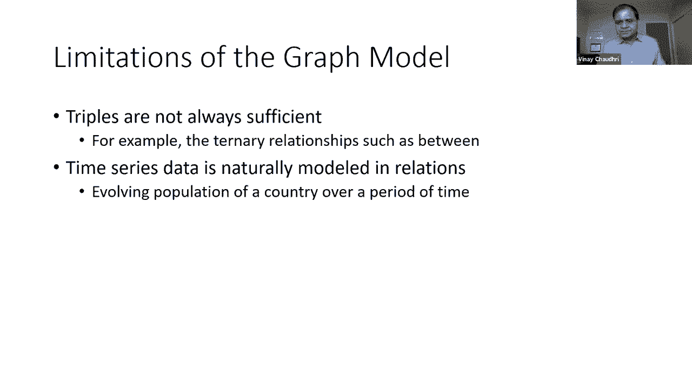

I。That's my last slide， so I'm going to summarize most of the key points I made during this lecture。

Just to remind you， the topic was。嗯。What are some knowledge to our data models and we took two representatives。

 the RDF sparkle data model and the property graph。诶。And S as the other data model。

And I argued that RDF， the primary use case is modeling data on the web。

 that's what it is geared for and foring data on the web。

Whereas the property graphs are used as a data model for general graph databases。They are。

Small differences between the two， the translations exist between the two， if you have data in one。

 you can with some effort， you can convert it into the other。

There are also translations from the graph data into relations there is。Still open question about。

 you know， if you convert your graph data into relations。

How well you can optimize it I mean that's I think a bit of a research question。

But in terms of the uniqueness， the uniqueness of graph models is that。The queries are more compact。

Some queries， some queries are more compact， especially you know where you're chasing relationships between objects。

 those queries are likely to be more compact and an engine graph engine which is designed mainly for queries。

 which involves travercing objects is going to do better on those queries。

And it has some advantage in graphical visualization because you're storing the data in the same format as as the way you are visualizing it okay so that's my summary I will conclude there in terms of what I wanted to say and we can look at some of the questions and messages that have been typed in the chat。

Yeah， so so we've covered a few of the things of the topics that people have raised there are a couple remaining ones and non Raj would like to ask if you can share your insights。

On the key challenges of building graph models， a graph model， what are the key challenges？

Is the question one is the question about building the just a graph I don't knows it's unclear as the graph the conceptualization of the graph itself or whether it's the implementation of the graph the question doesn't specify。

 but okay， so I think I would interpret it as saying that what are the challenges in building the just a。

Conceptual representation of the graph model and I started to allude to some of them like how do you pick what should be my nodes and what should be the property should I make this into a property should I make it into an edge should I refi this or not right so I mean those are some of the decisions you have to make I have whole so that's the focus for the next week okay so the next week the lectures are going to be focused on how do we design the graph data model okay and I have some prepared lecture material on that that I will go over and we also have to invited guests next week one of who would be talking about how do you design a。

Draft data model， which would live over a long period of time。

And the other speaker would also talk about how do you define constraints over over a graft data model to maintain its integrity in the long run？

So I think we should break till next week and because we will cover this topic in lot of depth Another earlier question points out as you were discussing the issue of giving properties to links to Arcs links one other possibility is to use quadruples rather than triples。

Where the fourth argument then is some sort of context that would capture all that additional information。

 any comments about that？Well， so RDF does actually have the concept of quadruple and in the at least based on my understanding of RDF。

 that quadruple representation is used。To track。The graph from which that triple is coming from that's the current use case in the RDF context right but again I think the strong position that is taken in the graph data model is that you can do a lot of problems using triples so let's do that right and the point I've tried to make is that well sure yeah you can do a lot of problems using triples but you can't do all the problems using triples so we shouldn't be just blindightd by just using sticking to graphs there are other things also there are problems for which other tools might be more appropriate。

Here's one more question in the long run， will the RDF mod data model win over property graphs？

For open knowledge networks， the kind that NSF wants to build。Yeah， I mean， again， I， as I said。

 you know， my goal in this lecture was not to。Take any sides， right？And。啲。

The I think in terms of which model we last would be primarily driven by the application requirements and the business needs and use cases。

 and it's also partly social cultural in terms of。Who is working on a particular project right if particular NSF。

Open Know network project has people with so many web background， they are going to use RF model。

 they're not going to use property graph period right that it's primarily a social socially created constraint。

Whereas if you talk to some people who are in the neoo4j and associated communities。

 they just love property jobss right and any project if there were people in the NSF open knowledge network cover using Neo4j。

 they will use Neo4j right so mean they won't use anything else。

So I think it's ultimately at the end of it and end of the day。

 it's the market reality in terms of what gets adopted and what has more use cases。And what acts。

What helps in solving more problems， right？But I think from the point of the academic point of view we are saying that both property graphs and RDF data model。

 they have the shared mathematical structure directed label graphs right that's what's more important from the academic point of view and regardless of whether RDF means a property graph means are both in。

The directed labor graph representation is going to be around for long time for lots of problems。

Excellent so I think that's that's all the all the comments questions seem to have been addressed at this point and so I think unless people have more you can relax V Okay well I can announce our program for this Thursday so I sort of pointeded some questions about。

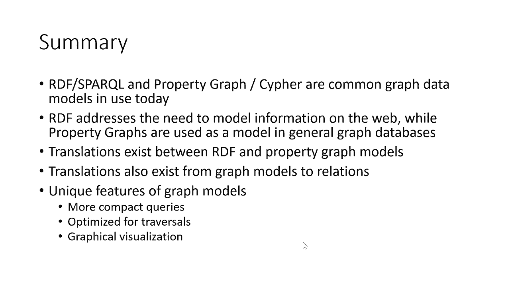

Qury evaluation and how do you do sparkle query evaluation when the data sits on multiple sources and in fact this was a nagging question in my mind from the seminar series last year because we had a lot of people come and speak at the seminar end。

And nobody really addressed that that even though in the design of Sparle there is this implicit built feature that you can go to multiple sources。

 but nobody showing me how to do this and nobody's talking about it so I actually made a lot of effort to figure out who were the leaders working on this problem and that's when I connected with Professor Rozu and that's what he works on he works on distributed sparkle execution and he's going to tell us about that。

And our second speaker is going to be Petra Dr。 Petra Summer。

 she has been involved in OpenSfer project， so the Sfer query language that I only sort of teaed you with in this lecture she will go into a lot more depth that she'll give you much more comprehensive overview of SFer and she'll also talk about how CFfer is being used as input to standard for Graph query language。

So I think it'll be a really interesting discussion on Thursday。

 I look forward to seeing you all and learning more from these experts。With that。

Let's conclude today's session and we will see you on Thursday。

