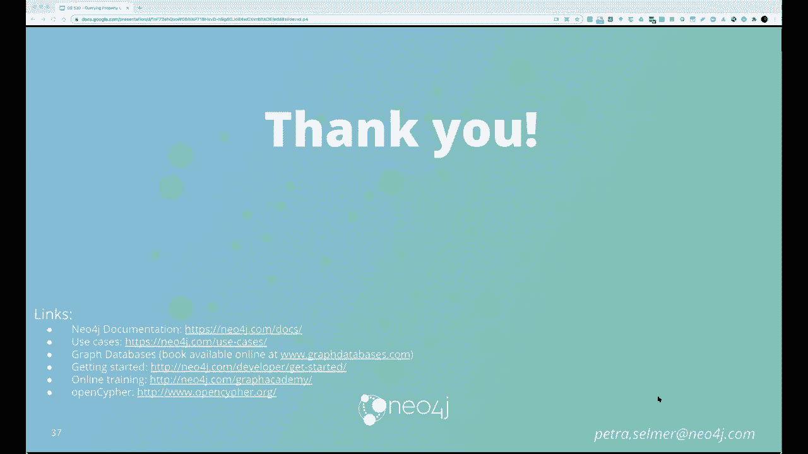

# P4：L4.1- 应用Cypher进行图谱查询 - ShowMeAI - BV1hb4y1r7fF

欢迎参加知识图研讨会，如你所知，本周的重点是知识图数据模型，上周，我今天向您概述了属性图和RDF数据模型，我们很高兴在这两个问题上各有两位专家，呃，佩特拉·塞尔默博士。

她在Neo Four J的查询语言设计工作设计组工作，她参与了CIR的开发，她还为图形查询语言的国际标准化工作做出了贡献，以及SQL的图形查询扩展，呃，小津教授，在他的职业生涯中。

他一直在研究分布式数据库系统，他写了一本关于这个主题的教科书。他还是数据库系统百科全书的编辑，他的贡献得到了包括ACM和I Apoli在内的多个专业协会的认可，以及通过终身成就奖和时间考验奖等众多奖项。

我们希望，每个演讲者都会给我们大约30分钟的技术概述，这将给我们留下大约20分钟左右的时间，问他们更深入的问题，我们将从萨默·佩特拉博士开始，所以只要显示屏幕，希望大家都能看到我的屏幕，是呀，你可以。

但非常感谢，我非常非常高兴来到这里，谢谢你邀请我参加演讲，所以呃，只是会谈的简短概述，我要做的是快速回顾一下属性图数据，模型标志业主上一次讲座，给大家介绍一下，但是嗯，以防你需要一点提醒。

我很快就会看完的，嗯，然后我实际上会去到密码查询语言，我将特别关注密码的只读部分，特别是在密码的只读部分的位上，这真的给了很多火箭助推，实际上我们读取和访问图形数据，嗯，然后我会提到一点开放循环项目。

所以我们有一些术语，开塞恩密码，它们到底是什么意思，开密码，从技术上讲，这个项目实际上培养了语言密码的开放版本，稍后会有更多关于这一点的信息，然后我将介绍一种GQL或图形查询语言。

这实际上是我们将要标准化的查询语言，还有续集，在ISO II的支持下进行Tograph查询扩展，最后以，我将浏览几个提议的扩建项目，我们将把它制作成密码的下一个版本，也制作成G。

所以从属性图数据模型开始，基本上有三个结构组成属性图数据模型，第一个是一个节点，这实际上是顶点的同义词，所以如果你来自一个非常数学的背景，你可能更熟悉后一个术语，本质上，这表示了图中的一些实体。

在您的域内，本质上在属性图数据模型中，目前的情况，实际上，一个节点可以有零个或多个标签，节点也可以有零个或多个属性，这些本质上是名字，值对，有一件事确实值得记住，两个具有完全相同标签集的节点。

实际上可以有完全不同的性质，这实际上是非常重要的事情，利用了图数据的异构性，所以现在我们在图中有节点，所以实际上要增加这一点，让它真正成为一个图表，我们实际上有第二个构造，这是一种关系。

它是边缘的同义词，我更倾向于说边缘而不是关系，给它一个更短的词说，但不管怎样，它们是同义词，可互换的，本质上，这是真正让你绘制图表的结构，它本质上是给图增加结构，非常重要的是，它为节点提供了语义上下文。

所以节点本身并不是很有用，但一旦你在它们之间有了边缘，你真的开始建立一个画面，这一切实际上意味着什么，以及这一切是如何结合在一起的，现在看一个时代的属性，本质上是什么。

一个边可以有的是它必须有一种且只有一种类型，你可以把这看作是同义词或类比，而不是节点的标签，但不像节点，边只能有一种类型，边缘也要有方向，所以这是一种传出节点和传入节点，相对于边缘，也像节点一样。

我们实际上可以有属性，非常重要的是，要提到节点和边，呃，它们可以具有零个或多个属性，所以你有时确实会，呃，您不想拥有任何属性或任何数据的情况，这样附着在你的模态边缘，这当然是我们有时看到的，然后呃。

只是为了打回家，事实也是，边缘必须有一个开始和结束节点，当然，我们确实迎合了自我的边缘，所以和h实际上可以有相同的节点，既是它的开始节点，也是它的结束节点，为了更深入地研究这个财产，本质上。

这是一个名称值对或一个映射，它实际上可以在节点和边缘上，这实际上是所有的数据都将被存储，所以它本质上可以是名字年龄之类的东西，重量，等，我通常实际上，呃，属性的名称是字符串。

就像它应该是字符串名称或字符串年龄一样，等，然后该值可以是一定数量的类型中的任何一个，它可以是一个整数，有点像小数，一根绳子，甚至是一个列表，等，对，这实际上是属性图数据模型。

所以希望这真的让每个人都有点湿了脚，实际上，这很好地引导我们进入密码，查询语言本身，所以介绍密码，这实际上已经持续了很长时间了，它实际上是由尼尔·4J在2010年开发的，实际发生的是五年后的2015年。

我们实际上很好地向每个人开放了它，所以这些年来，显然，许多不同的图数据库供应商已经脱颖而出，我们真的认为这是一种很棒的语言，让我们实际上传播它，实际上允许任何实现者，他们是否是工业界的从业者。

研究人员是否真的，我们已经见过很多了，实际上可以，呃，实现密码，我们当然创建了这个项目，为了真正允许这种情况发生，所以说，正如我在后面的演示中所说的那样，所以嗯，只是想谈谈，呃，密码特征。

我现在只关注屏幕的下半部分，所以非常跟随SQL的脚步，我也提到了火花，我们从这些语言中继承了很多语法和功能，例如，我们有阅读贴花，我再次提到这是这次演讲的重点，我们也有用于更新、插入和删除的DML。

我们也有能力，嗯，定义、指定和管理约束和索引，所以你现在可能想知道为什么密码，那么本质上，定义声明性图形模式的概念是什么，那个，呃对不起，图模式匹配语言，这实际上对用户来说是非常直观的。

这实际上遵循了许多现代范式，事实上，我一会儿会谈论其中的一个，独特的卖点，如果你喜欢密码，那就是图形模式非常容易表达，那本质上是密码跳动的心脏，它是一等公民，它实际上允许你很容易地制定递归查询。

与链的变长关系，以及实际返回路径的能力，所以如果我们真的后退一步，为什么有人会使用属性图数据模型，而不是说关系数据库，用例的种类，您将看到使用密码数据模型，会是当你真的想，比如说，理解实体之间的关系。

尤其是在你有很多不同种类的实体的情况下，它们之间有很多不同的关系，您还将使用属性图数据模型，当你对同一种实体有很多自我引用时，或者如果你想真正探索不同或未知深度的关系。

当你真的想通过你的数据发现不同的路线或路径时，因为这四种内在和内在的动机，使用属性图数据库，镰刀是专门为，非常有价值，来满足这些需求，这实际上是我们的来源，所以它实际上是在开始的时候。

密码绝对基本的内核是模式的概念，本质上，正如你在幻灯片上看到的，我们实际上有一个事实，嗯，这种ASCII艺术的概念，见，如果你斜视一下，它实际上可以，你可以看到，你在白板或餐巾纸上画的圆圈。

或者你把你的领域画出来的任何东西，实际上可以用圆括号表示，比如说，它实际上代表您的节点，你的边缘会穿过这些箭头，um构造，所以它非常，嗯，呃，ASCII艺术第一，这就是图案被磨损的原因。

在性方面重申这种模式的概念是多么重要，他们不仅在密码的读取部分进行匹配，实际上，在屏幕的左下角有一个read子句，它们实际上也在更新中被大量使用，以及所有DDL语句和定义中，我也是，几乎到处都是。

那是密码的DNA，所以让我们更深入地研究一下，呃，在读取上下文中使用这些模式，因此，其中的核心是匹配子句的概念，基本上我们这里有两个关键词，所以匹配然后一个模式和返回实际上是投影子句。

所以你在匹配模式中实际上有什么，抱歉，在查询的部分，match语句后面是一个模式，这本质上是一个，被一条边隔开，实际上我只是从左到右工作，描述一下那里到底发生了什么，所以在左手边。

我们实际上有这样一个事实，我们从一个节点开始，上面有一个人的标签，然后呃，我们也在期待，呃，标记为节点的人必须具有名称关系，此外，如果它确实有名称关系，必须完成该名称关系的值。

那么我们所做的实际上是找到所有，基本上是与特定节点模式相关的，我正在检查它们，他们中有人有外向的恋爱关系吗，我有没有从那个节点出去的边，它实际上有一个爱的边缘类型，如果有的话。

然后我们实际上检查另一边的节点，本质上，我们实际上根本没有任何谓词，我们所拥有的，有一个节点变量，这实际上是注意，我们实际上然后在return语句中返回，所以本质上只是深入研究一下各种不同的版本。

如果你喜欢你实际拥有的模式和关系模式，你实际上在左手边的列，各种不同的节点模式，所以它们都必须用圆括号包围，如果在冒号之前使用任何标识符，这将永远是您的节点变量，你实际上可以用它作为AAS。

以便稍后在查询中引用该特定节点，尤其是当您开始使用多个部分来向上移动查询时，如果您实际上想指定标签，然后你实际上必须使用冒号，然后标签，正如我之前提到的，节点和属性图数据模型实际上可以有零个或多个标签。

所以说，比如说，您希望找到一个同时具有标签Person和Employee的节点，实际上应该具体说明的是嗯，冒号，人，冒号，雇员，它实际上说找到所有有这两个标签的节点，嗯，然后实际上你有一个事实。

我知道也可以有属性，而且非常，非常同义词，我们右手边的关系也是如此，现在如果你真的在读，如果您在match子句中使用这些模式进行阅读，这些是属性映射文字实际上是什么，这些是花括号，道具点值。

这些实际上将充当平等谓词，所以在你的阅读声明中，实际上说一些类似于标签的东西，适当值，你实际上是在说，呃，该特定节点必须具有具有该名称和该值的属性，但你也可以用它来，正如我前面提到的，UM更新。

在这种情况下，实际上在这个意义上做的是字面上的道具，呃，近端抱歉实际上将插入或更新到您的节点中，所以使用完全相同的范例来改变你的图形，所以看起来更多一点，更复杂的，呃，只读语句，我们这里实际上有的是。

这其实是，呃，查询的实际结构方式，所以你实际上开始，所以这不像SQL，你实际上是从你实际上试图寻找的东西开始的，所以这里有你的匹配声明，而这只是一个标准的盒子，um三节点，每个节点模式。

然后实际上可以用谓词过滤，因此您可以使用其他属性映射文本，如果您对属性质量谓词感兴趣，或者你可以像在续集里一样使用“嗯知道”从句，这实际上更先进一点，因为您实际上可以使用任何质量谓词。

您实际上可以开始绑定来自所有不同节点的代理值，在比赛中你的模式，所以那里更强大，嗯，所以无论如何，这对SQL的用户来说非常非常熟悉，你实际上结局很好，您几乎以返回语句结束，这本质上是你的投影子句。

类似于续集中的选择语句，你有两只手，在续集中可用的所有各种功能，像上面和聚集，诸如此类的事情，嗯，然后我也是说从SQL继承，是他们排序和切片的概念，诸如此类的事情，所以那是，嗯，这是呃差不多。

如果你喜欢最基本的查询，你实际上可以有一件事，呃，记住是，如果你看看对不起，右上角的方框实际上非常非常好，你实际上能够描绘出相当复杂的形状，如果你喜欢你的嗯模式，所以嗯，只是有三个不是很有趣。

所以我的朋友朋友不是很年轻，不是很有启发性，如果实际查看匹配示例，我在灰色盒子里给了，你实际上可以开始转录更复杂的形状，不仅仅是线性模式，但实际上你可以开始转录星形图案或T形图案，就像这个一样。

所以你有一个匹配的abc，那实际上是三个由边缘隔开的节点，我们什么都不在乎，所以我们只是把它作为一个破折号，我们实际上没有提供更多的信息，逗号，另一种模式，拍f，实际上会发生的是。

两个B节点将匹配相同的，呃，图中的节点，所以基本上你转录的是一个T形图案，你其实可以，呃，继续添加更多常见的分离模式，用这种方式，这实际上给了你很多表现力和灵活性，关于抄写呃。

直接匹配图形形状的复杂模式，你想要匹配的，所以我相信之前的演示文稿，Irina实际上已经向你介绍了cy中的基本模式匹配功能，我想在这张幻灯片上做的是，在接下来的几个实际上是专注于更先进的有匹配，呃。

特征，所以这实际上是A与SQL有很大区别的地方，所以我们实际上从顶部开始，就是，我们从基本的三重开始，我在这里把这种借用叫做重闪，节点h节点可能不是，呃，不是那种小说。

它开始变得非常强大的方式是当你实际上添加关闭的过境时，或可变长度路径，变长路径匹配，所以在上面的第一个查询中，你会看到，我匹配我的朋友明星，这实际上意味着在更多的朋友关系中。

所以你从左手边膝盖的节点开始，然后实际上你会呈扇形展开，实际上开始遍历尽可能多的朋友边缘，从那里出去还是从我这里进来，那实际上是一个无向边，嗯，尽可能多的框架边，因为你在一个图表中，你真的得到了回报。

所有的我和你的直接朋友，或者你朋友的朋友，或者你朋友的朋友或者朋友的朋友，等，等，然后以图的大小为界，你有我们的朋友边缘的转录，你实际上可以有各种口味，特别是，um有界传递闭包，例如。

第二个实际上是遍历两到四个帧关系，或检查您的指定，有我的朋友启动指示器，这是另一个可变长度的路径，她说的至少是两个朋友的边缘，但最多四岁，并把所有符合的结果带回来，我们还有第三种变长图案。

与我们的范式相匹配的是实际上穿越一个，喜欢和鼻子一次或多次，所以真正的我冒号喜欢烟斗角色，没有恒星本质上意味着一次或多次，任何喜欢或知道所以喜欢的组合，喜欢喜欢那些不知道的人，点赞和点赞都会有回报。

还有小雪，等，等，同样，这是以图的大小为界的，你显然可以把所有这些界限结合在一起，边缘标签的数量没有限制，你可以表达一个联盟，所以这是可变长度关系模式，正如我提到的，这真的真的超级有用，嗯。

在续集里做到这一点是可能的，当然，有些变体您有常见的表表达式，只是要做到这一点要困难得多，你也可以用工会来模拟，但这开始变得非常麻烦，所以这是一个很好的方法来表达相当多的复杂性。

在我们文本的一小段篇幅中，下一部分实际上是返回零件的能力，这是目前续集不可能的，至少据我所知，所以如果你真的看看返回的路径段，首先，它们匹配p等于，然后那边有一条小路，顺便说一句。

这些东西需要只是节点年龄，节点，你可以开始创作链条，只要你想，但本质上匹配p等于某个路径，返回p实际上会返回所有可以形成特定模式的路径，然后你可以真正的黑曜石，之后也是按长度排序之类的。

实际上人们的样子是，它将按照节点和边缘的顺序，返回的节点和边，是以那种方式归还的，然后你实际上会在你可以调用的部分上有函数，说，比如说，p的返回节点，呃，这实际上会给你带来什么，实际形成的节点，呃。

形成，呃，那条路的那一部分，模式匹配是密码绝对跳动的心脏，紧随其后的其他东西，这就是线性合成的概念，这是一种自顶向下的流和查询部分的概念，基本上我会试着把它拆开，使用那边的示例查询。

所以我们实际上有的密码是，查询需要以return结束的规则，但是如果您想真正分解您的查询，通过在此过程中进行集合聚合，或者如果要在查询中混合读和写，这也可能与密码有关，我们实际上使用了一个关键字或结构。

它非常类似于返回，它还投射出它就像一个中间投影，这实际上是用键盘来表示的，所以我就给你介绍一下那边的查询，所以我们实际上在第一行做的是进行某种匹配，以及匹配的结果实际上将被放置到绑定表中，然后。

该绑定表将被用作第二个width语句的输入，上面写的宽度是多少，它实际上会通过变量me，它会通过对不起的聚合，把所有的朋友都算作朋友，但这意味着在第三行，那个匹配可用的是变量me，也是多变的朋友。

但是可变的朋友本质上不会像门一样可用，如果你不是真的，呃，书面的，呃，with语句中的变量，查询之后就不可见了，所以在第三行，然后我们实际上继续呃，在结果表上进一步匹配，呃，呃，由第一行产生。

因此在第三行，我们实际上采用了以前匹配的方法，我们都必须有一个人的标签和一些参数化的名字，然后进一步匹配，然后我们最终把第二行的聚合数作为朋友，我也会数数敌人，所以希望这真的能给你一个概念。

什么是线性合成，所以这个想法基本上是每个函数，您可以将每个函数视为对不起，每个子句作为一个函数在表中，并以某种方式改变它，也许添加更多行，或者添加更多列，然后实际上把它传递到下一个子句，以地平线的作用。

我们实际上所说的密码，两个不同的查询部分，所以第一行是查询部分，第3行和第4行将是另一个查询部分，基本上把这些家伙粘在一起，这实际上是一个非常非常有用的范例，从现代编程语言中借鉴了很多。

我们发现自上而下的写作和阅读顺序，它实际上被证明是非常有用的，这当然是我们的客户和开发人员社区，非常感谢能够这样做，只是为了关闭，所以我们还剩十分钟左右，好的，我会跟进的，是啊，是啊，我大约做了一半。

所以嗯，只是给你一个简单的例子，很复杂的图形，有很多不同的，正在发生的事件，和一个实际的查询，你可以在相当短的行中提出，所以实际上这最初的灵感来自于，呃，当然，我在英国的一个数据收集中工作。

在2009年的时候，所以不管怎样，我完全不知道，这实际上会被当前的事件所预示，但不管怎样，它实际上只是显示了建模复杂领域的适用性，使用图表，实际上在短短的几行字中，你实际上可以表达一个相当复杂的查询。

无论如何，不会有时间真正走过，所以我会很快地继续前进，这实际上只是显示，嗯，SQL与密码，特别是，我想把重点放在这样一个事实上，即密码语句有一个传输关闭语句，实际上它是一个可变长度的部分。

实际上这又出现了，实际制定这一点需要多长时间，在续集里，显然需要的时间，嗯，吸收并正确传递，还有一点关于四密码查询引擎的内容，这实际上非常非常类似于关系数据库引擎。

所以基本上这里没有什么真正壮观的小说发生，但本质上我们有一个查询字符串，已经过去了，对生成的抽象语法树执行额外的语义分析，我们走通常的路线，实际上是找到最便宜的，呃合乎逻辑的计划。

使用我们在数据库中维护的一些统计数据，想出一个最优的，呃合乎逻辑的计划，然后我们把它转化为三个人的处决，呃，物理规划操作员，然后执行查询，所以我要说的一件事是，因为它是一个图表。

显然我们实际上必须添加一个额外的操作员，两个，但超出了通常的关系运算符，这特别与从节点向外扩展有关，对呀，所以只是一个非常快的，在开放密码项目上提到，所以这是，嗯，嗯，我前面提到的一点。

因为我们实际上发现密码是一个非常非常有用的，也是一件好事，它实际上传播了它的传播，尽可能多的图数据库实现，所以无论如何，这里有几个链接供您之后查看，嗯，当然，我可以说的是，语言工件是语法的提供。

形式语义学的，特别是TK或技术兼容性套件，当然在火箭助推实现方面做了很多，实际上，在网站上，你可以看到完整的列表，可能还有许多其他的开放密码实现者，这只是向你展示了，这些测试是什么样子的。

我们有两千多个，这实际上是一个非常好的方法来确保您的实现，绝对符合密码语义，So到图形查询语言，或gql，所以基本上，正如我在导言中提到的那样，这实际上是一个正在进行的，嗯。

如果真的要标准化一种新的图形查询语言，ISO C支持下的属性图查询语言，这是如何发生的几年前我们遇到了这样的情况，以顶部的三个M标签为例，我们真的有，随着更多的图数据库实现的出现。

我们开始看到许多不同的语言开始出现，这对工业来说并不是很好，有多种版本的语言，彼此之间有很大的交集，所以实际上是时候把所有这些语言，所有的共性，而且每一个都增加了所有额外的比特，这使得它很特别。

实际上把它融合成一种标准的图形查询语言，GQL就是这样诞生的，这实际上显示了更多关于这个过程的信息，所以嗯，这是第一个国际标准数据库语言项目，自从SQR在1987年被接受以来，我把所以到现在的续集。

任何即将出现的新语言，任何新的范式，就像XML一直被背在SQL之上一样，所以这是第一次一个独立的语言坐在续集旁边，而不是在上面、下面或旁边，有点藏在续集的一边实际上已经发生了。

投票实际上在20年里成功地进行了，本质上这就是我，我的同事和许多其他工业伙伴在所有主要的弯曲者，在过去的几年里，我一直在努力，这基本上是在下面两个方面做工作，所以我们实际上有，呃。

不断进化的凯撒语言的续集，图表实际上在任何地方都变得很大，也许这并不奇怪，SQL本身也在寻找一些东西，称为属性图查询扩展或PGQ，所以这将是续集的下一个新部分，定于22年发布，这里会发生的是，本质上。

您将能够从底层关系数据库虚拟化图形，所以基本上你可以从你的桌子上映射，一个虚拟图，然后您可以查询，使用完全相同的查询功能，所有这些都非常，非常受密码的影响，所以这两个，模式匹配能力。

图表的阅读将由两种语言共享，这就是你真正找到的地方，同样的人或多或少地参与了这两个群体，全科医生也会给你什么，虽然，还有很多其他的事情，例如为多个图对齐的dml，实际上能够形成视图，图形投影和图形方案。

以及其他各种各样的东西也将于2020年发布，我们希望实际上，GQL的未来版本实际上将把图作为这样的基底，然后再走得更远，例如查看流时态图，等，呃，这只是一张非常快的照片，只是展示这个。

只是所有种族语言的一个小快照，以及所有各种学术努力，它们实际上是在过去三十年里进行的，或者说它实际上导致了人的形成，以及每种语言给这幅画带来的特殊影响，很快，我只想提一下扩展。

所以这将成为GQL标准的一部分，但实际上也有未来版本的密码，所以本质上我们这里实际上有的是，呃，路径模式重复的概念，所以不仅仅是能够重复边缘标签，实际上也不能重复整个模式，嗯。

实际上这里有一个例子显示了查询实际上是如何计算它的，可能你们中的一些人对火花很熟悉，这类似于火花，一个一个属性部件，但它实际上也会考虑属性谓词和节点标签，这又一次显示出来了，一些各种各样的呃。

额外的旋钮和旋钮，你实际上可以应用于此，还有标签表达式之类的东西，等，还可以配置模式匹配语义，所以能够真正表达一个路径，uh应用于节点同构下，边同构或同态，有不同的原因，每一个都在不同的背景下。

取决于域，也如你所料，呃，路径模式输出修饰符，你想要所有的路径，您想要所有最短路径吗，你想要最短的零件吗，等等和数据类型，所以很多，它与SQL非常相似，我们将完全按原样使用SQL，但也有额外的东西。

比如很多嵌套的数据，特别是与图形相关的数据类型，这些节点，边路径和图，也是一个模式，所以传统上，cio是无模式的，这真的是一件好事，或者我们都用例，模式的概念实际上是一件好事，尤其是更成熟的领域。

我们实际上有数据治理或数据质量，狭窄，可能只是倒数第二实际上是有能力，呃，引用和管理多个命名图，还有项目图，也要考虑到，嗯，图形构图，您实际上可以跨多个图进行组合操作以形成，说一个新的图形。

你说也许从那个图中投射出一个子图，等等，这实际上需要建立非常复杂的工作流，嗯是的，那肯定会是一件非常强大的事情，这就是组成我会，因此，一个查询的输出可以形成另一个查询的输入，这也是我们的基本目标之一。

这只是我们最近看的一些关键论文，但我不得不说有很多，很多，更多，不幸的是，没有足够的时间给他们空间，但在这方面，我们绝对站在巨人的镜头上，非常感谢大家的关注，谢谢。佩特拉，呃。

这是对CIR、扩展和标准化努力的出色概述，嗯。

我们将在最后回答问题，但现在我们将继续，呃。

