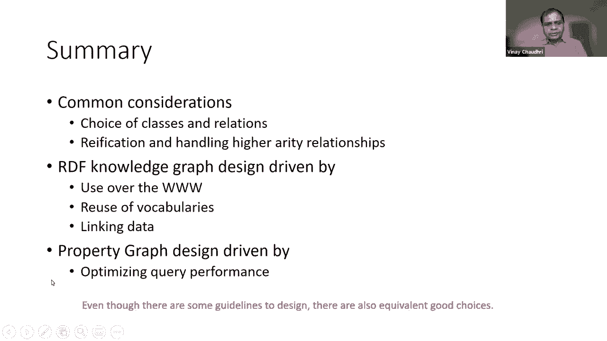

# 【双语字幕+资料下载】斯坦福CS520 ｜ 知识图谱(2021最新·全20讲) - P6：L5- 如何设计知识图谱schema - ShowMeAI - BV1hb4y1r7fF

欢迎来到知识工艺研讨会今天是系列的第三周，因此，我以为，对我们来说，了解如何，这些不同的会话在前两个会话中排序，我们讨论了什么是知识图，我们从定义什么是知识图开始，然后我们考虑了两个流行的数据模型。

它们用于定义知识图，今后三届会议，我们将关注如何创建一个知识图，第一次会议将在今天，我们将主要关注知识图的设计，然后在这三次会议之后，我们将讨论如何用知识图推理以及如何访问知识图，在本系列的最后。

我们将讨论应用和研究问题，好的，今天的话题就这样吧，呃，它将是关于如何创建一个知识图，我将首先给你一个概述，呃，创建知识图涉及什么，然后呃，我们就来聊聊，呃，设计RDF图和设计属性图的注意事项，最后。

我将总结要点，创建知识图有两个大致的步骤，呃，图式设计，然后用一组实例填充该模式，在这一点上，你可以说，嗯，等一下，我们说过知识图不需要任何模式，这是一种无模式的方法，严格地说，那是真的，呃。

知识图的模式是它是一组三元组，对，这就是你开始构建知识图所需要的一切，但我们假设一旦我们建立了更多的知识主题，想用它做点什么，所以意义或定义意义，或者定义这些关系的含义，我们可以从中得出什么样的推论。

但我们可以从中得出结论，这些关系是如何定义的，这很重要，最终，这将是重要的，我们不，我们可能不想做那个工作，前面所有的工作，但在知识图生命周期的某个时候，这项工作必须进行，在某种程度上。

我们可以做一些前期设计，它适合我们的，呃，呃，开发过程和开发范围，在未来的道路上，这绝对是非常有帮助的，所以这是我们真正要关注的地方，呃，今天的讨论是关于我们必须记住什么样的事情。

为今后两届会议设计知识图表，重点将是填充知识图，进入知识图的信息可以来自任何数量的来源，它可能来自，呃，结构化数据源，它可能来自半结构化数据源，呃，我们可以把这个通过，嗯。

在文本上进行nlp或使用一些计算机视觉技术，最后，它可以用老式的方法创建，只需输入，通过数据管理，在接下来的两节课中，我们将研究其中的许多技术，但今天，我将主要关注知识图的模式的设计，我们先从，呃，呃。

RDF图的设计，他们的RDF知识图的设计指南可以总结为，在所谓的链接数据原则中，这些原则，最初由蒂姆·伯纳斯·李爵士介绍和阐述，他也被认为是呃，万维网的发明，这些都是非常简单的原则。

这就是他们的美妙之处，可以简单的说就是，您将使用IIS命名事物，使用http虹膜，这样人们就可以查找这些东西，每当有人查找iri时，使用标准提供有用的信息，rdf和sparkle。

在你的数据集中包括其他东西的链接，这样人们就可以发现新的东西，好的，所以这些是主要的原则，RDF图的设计原则，我们将更详细地研究这些原则中的每一个，让我们从第一个原理开始，用IIS作为呃，呃。

我们习惯在网上命名事物的名称，例如使用URL的网站，所以对于维基百科来说，我们知道什么是URL，正如我们在上一节课中讨论的那样，URL也是iri的权利，所以那部分很简单，很容易理解。

但是RDF数据模型中的主要概括是，除了信息资源，我们也可以谈论非信息资源，比如说，戴夫·史密斯可能是现实世界中的人，可能没有一个网站对应呃，戴夫·史密斯，但通过创建一个与戴夫·史密斯相对应的iri。

我们可以在我们的呃数据集中参考它，而不仅仅是参考它，我们可以唯一地引用它，所以任何时候我们使用II，背后的意图是这是一种独特的方式来指呃，我们正在创建的对象，呃，(ii)。

IIS设计的基本准则是保持简短，和助记，一般来说，这些呃，计算机程序可以使用IIS，所以它们是什么实际上并没有太大的区别，但这有点像当我们在写一个计算机程序时，我们希望变量名有意义。

所以如果有人看着他们，他们可以理解代码，所以这个原则是本着类似的精神，这些URIS最终会被人类使用，人类会看着它，所以我们想让它们保持简短，我们想让他们记住，这样人类就更容易理解什么。

特定RDF数据集中有什么，虹膜的第二个重要准则是我们应该定义它们，这样它们就会持续很长一段时间，还有这个呃，呃，原理和直觉与URL没有什么不同，就像我们在网页中创建网页一样。

我们提供特定的网址我们希望这些网址是持久的，因为其他人可能会用来指向这些URL，如果我们要继续改变我们的URL，虽然我们会有很多断开的链接对吧，所以这里的想法是一样的，只是我们现在正在应用这个想法。

也对应于非信息资源或对象的IIS，我们可能想在网上参考，我可以提个问题吗？嗯，就在一分钟前，你说过，所以有两种方式可以解释iri指的是一个物体，只有一个对象，另一个是每个对象只有一个iri。

我肯定你是说第一个，我不确定你是说第二次，是呀，我我是说第一个，好的，伟大，谢谢，是啊，是啊，谢谢你的澄清，好的，现在，让我们来谈谈第二个原则，嗯，使用http iri，这样人们就可以查到这些名字。

现在我们可能都熟悉文档对象标识符的想法，如第三行所示，嗯，这是一种指代，呃，到联机文档，就像如果你去搜索引擎，你输入呃，这个doi冒号后面跟着的字符串，它会把我们带到网上的那个特定文档。

但这里的建议或设计原则是，与其使用URIS，其中未指定访问方法，我们应该明确，更喜欢II，其中我们使用http访问方法，所以我们要访问那个特定对象的地方，作为数据集的一部分清楚地说明。

当计算机程序遇到iri时，它知道该怎么处理它，它知道去哪里找到更多关于它的信息，现在在这个原则上，这个查找的想法需要更多的解释，iri的查找也被称为呃，去参考，它被称为取消对特定iri的引用。

取决于我们处理的是信息对象还是非信息对象，当我们查阅他们的II时，可能会发生不同的事情，传统的信息对象是我们习惯的东西，它有点像一个网站，这就像通过网络浏览器访问一些东西。

行为与Web浏览器中发生的行为完全相同，我们将得到该iri当前状态的表示，所以在某些情况下，我们会得到一个网页，或者我们可能会得到一个有一组数据项的网页，等，但是当我们查找或取消引用一个非信息对象时。

事情就变得有趣了，在非信息对象的情况下，我们会得到一组关于它的RDF事实，所以它不再是，呃，必须是网页，或者即使是网页，这是一套呃，嵌入到该网页中的rdf事实，好的，现在。

那么下一个原则是给我们更多关于这些RDF事实的细节，这些不仅仅是任何随机的RDF事实集，我们希望这些事实有用，呃，你知道的，考虑到我们希望使用标准，如RDF和Sparkle到，呃，提供这些事实。

但我们希望这些事实有用，现在让我们看看有用的方面，有用性方面本质上来自，或渴望定义意义权利，呃，因为当我们公布这些事实时，我们必须在某种程度上能够说出这些任务的实际含义，什么，如果我的网络联盟有，呃。

让这个任务轻松了一点，通过为人们提供一些标准词汇，人们可以用来发布他们的RDF数据集，例如，如果你发布一些关于殖民的信息，存在一个组织词汇表，呃，可在RDF中获得。

人们可以从词汇表中提取并使用标准关系名称，发布数据权限，所以它只是让它很容易，如果您使用标准化词汇表发布数据，任何使用这些数据的人也可以引用相同的词汇，并清楚你的实际意思或这些数据试图传达什么。

在上一堂课里，我们还提到了这个叫做模式组织的倡议，这是一个试图为领域发展一组共享词汇表的社区，它们对支持，呃，在互联网上搜索查询，好的，所以我们可以利用这些现有的资源。

它使我们在Web上发布的RDF数据集更加有用，从其他人可以找到的意义上说，其他人能够编写程序，它可以假定与您发布的数据相关联的某种含义，所以为了给出一个具体的例子我们会看看，那个呃，看一个示例数据集。

我们在其中描述了英国内阁，好的，英国内阁在这里有一个客观对象标识符叫做co，呃，但它在一个命名空间中，我们已经为其定义了前缀，前缀是你在这里看到的第一行，作为前缀的RDF代码集，在这里的第二行。

我们是说英国内阁科林公司有一种组织冒号组织，好的，RDF冒号类型，我们在它之前遇到过那个谓词名，它说这个对象是一个类型组织，和org冒号组织是一个标准词汇表，由W3C出版，在这里。

我们正在利用可用的词汇，与此相关的是，我们说这个对象是类型组织，在这里的第三句中，我们说这个物体co有一个分数，冒号，准备；准备，标签或内阁办公室，现在这不是很深的语义或很深的技术。

但这里很少有另一个标准化的词汇，称为简单知识组织系统，它只是给定义一个很好的名称来将标签与对象相关联，对吗，它有点像文档字符串或一个漂亮的名称，呃，对应于一个对象，如果你跟着走，呃，三重的其余部分。

您将看到我们正在使用来自组织本体的其他关系名称，呃，或组织词汇，呃，在此数据集中定义各种三元组，现在在这一点上，一个自然出现的问题是，如果我们想发布一个数据集，会发生什么，呃，对于特定域或应用程序。

但我们需要的词汇并不存在，没有其他人提供，很明显，一种方法或首选方法是使用模式或组，因为它是一个，这是一个由，呃，他们有进化这些的宪章，呃，协商一致，呃，词汇表，嗯，但还是有一些原则，比如，不管你是否。

呃，使用模式工作，www。icj-cij。org，或者你自己发明东西，创建新词汇表背后的原则是，应该记录在案，应该是自我描述，应该有一个版本控制策略，就像如果你时不时地改变你的词汇。

你们应该能够跟踪你们所说的特定版本，它应该有多种语言版本，因为我们希望这个词汇表可以在互联网上使用，因此它应该有多种语言版本，所以它在世界各地都很有用，它应该是，呃，由可信来源发布。

这真的建立在这个基础上，呃，我们之前谈到的持久性原则，该词汇表应放在，在一个位置或一个网站，这是不容易改变的，它会存在很长一段时间，这些原则大多是不言自明的，我是说，我们可以理解他们试图传达什么。

但我要多说一点，呃，我们所说的自我描述是什么意思，因为这很有趣，呃，概念，呃，它很有趣，因为它要求，当我们定义一个新词汇或新模式时，我们要确保，嗯，我们理解模式所需的所有信息都在模式本身中可用，对呀。

所以这是自我描述，从某种意义上说，我们需要知道的任何东西来理解模式都包含在其中，好的，我们可以只看那个模式，我们知道模式是关于什么的，让我们现在，呃，继续到第四和呃，最后原则，也就是，呃。

包括其他东西的链接，这样人们现在就可以发现新的东西，在最简单的层面上，这与在文本文档中创建超链接完全相同，除了在这种情况下，我们不在文本文档中建立链接，我们正在数据集中建立链接。

我们从一个数据集链接到潜在的一个或多个其他数据集，所以要更深入地理解这一点，嗯，让我们看看一个人可以建立什么样的联系，呃，人们可以在不同的数据集之间，我们知道在传统的文档Web中只有一种超链接。

你知道有一个超链接，你点击它，然后导航到另一个文档，但在呃的情况下，RDF数据集中的链接，区分这些是很重要的，呃，三种不同的链接，关系链接，身份链接和词汇链接，我们将看看它们中每一个的具体例子。

关系链接是两个对象之间的链接，两个不同的数据集对吧，所以让我们来看看三重，也就是，呃，如图所示，主题用红色显示，谓词以蓝色显示，物体以绿色显示，三元组是使用上面定义的两个前缀编写的，就在它上面。

所以这里，大冒号戴夫·史密斯是一个数据对象，在一个数据集中，Colen Birmingham是一个完全不同的数据集中的对象，在本例中，它碰巧是一个名为dbpedia的数据集。

我们使用基于冒号的关系来关联这两个对象，Colin的下划线很有趣，呃，基于near来自一个被称为两者的词汇，其中一个呃，在网络上使用的标准词汇，描述人，代表朋友的朋友，它是。

它本质上是一个描述人和人与人之间关系的词汇，所以这是一个关系链接的例子，呃下一个，我们要看身份链接，呃，身份链接是链接，呃，它将两个不同数据集中的对象等同起来，呃，所以这里。

三元组在这里再次显示为最后一句，一个主题是红色的，蓝色谓词，和绿色的物体，这里我们说对象d冒号me和对象是一样的，大冒号德史密斯一分钟前进来了，呃，迈克提出了眼睛的独特性的问题，这个例子说明了。

一个对象可以有多个URI，我们可以用这些来等同这些URIS，呃，与断言相同，但它们实际上都指的是现实世界中唯一的物体，呃，最后让我们呃，查看词汇链接，词汇表链接是连接呃的链接，呃数据到术语的定义，呃。

所以这里我们有一个物体，一个大结肠，中小企业，我们断言它是dbpedia冒号公司的一个子类，好的，现在的子类被认为是对象定义的一部分，我们将中型企业定义为公司的子类，定义为，作为DVP词汇表中的一个类。

好的，所以再一次加强，这些链接你，它们可以被视为超链接的泛化，在超链接中，这些基本上是呃之间的联系，中的文件，呃，在传统的html上，呃网，这些是对象之间的链接，它们可能是，把事物等同起来。

他们可能在定义事情，或者他们可以简单地在不同的数据集中对对象进行断言，好的，呃，所以差不多就是这样，和，你知道的，我花了很多时间寻找图表设计的材料，我选择涵盖这四个原则，因为这些直接来自某个伯纳斯·李。

这些都很简单，通俗易懂，如果你在做RDF图的时候，呃呃用我有东西的名字，使用http iis并使用rdf和sparkle发布您的数据，每当人们查东西的时候，给他们一些有用的东西，一次又一次。

我想他的希望和愿景是，如果你遵循这四个在Web上发布数据的基本原则，它最终会以与爆炸的文件相同的方式进行探索，我们将看到新的服务和能力，哪些将成为可能，这在今天是不可能的，所以维奈，有一个。

有一个关于某些词汇是否存在的问题，呃，这里的细节与公司和公司之间的关系有关，但概括起来就是，一个人如何找到，呃，有用的关系，我是说，你提到了几个，一个常见的集合，如faux和rdfs等等。

一个人怎么找到那些，有没有一种机制，如果我想说的子类，我在哪里能找到，我怎么才能知道什么是对的，是啊，是啊，所以耶，有一个，是啊，是啊，所以有两个来源，我个人使用，一个是阅读标准规格。

比如如果你去阅读RDF的标准规范，它会列出一些词汇表，因此，它将列出组织词汇表和目录词汇表等内容，它会给你链接去哪里找到，所以这是一个地方，我从第二个地方开始，一个是模式，点工作，对吗。

我们看到模式组织，我提到过几次，这是一个社区倡议，你知道他们，有一群人正试图弄清楚，哪些词汇最常用，他们正在创造他们，他们有一个网站，你可以搜索他们，然后他们有一个非常好的文档。

所以我会从这两个地方开始，我敢肯定有更多的资源，对但这是我遇到的前两个，所以这个问题的另一面是，假设我收集了，把我的手放在其中的几个消息来源上，假设我在多个地方找到了一个关系，比如。

有没有办法决定哪一个更好用，呃，我知道他们的意思是一样的吗，在那种情况下，一个人如何做出选择，是啊，是啊，所以我认为的子类是更容易的一个，因为它是标准W3C规范的一部分，所以我会说，对于像。

只需使用RDF规范中定义的，对呀，但同样的问题显然也适用于其他关系，对呀，就像朋友关系或父母关系，或者对，再次，我更喜欢模式组织中的东西，因为它们背后有很多追随者，它们正在被利用，它们被用于搜索引擎。

然后呃，但除此之外，我想我们只需要看看关于每一种关系的可用信息，或者作为英语文档字符串提供，或者作为一组公理可用，可作为示例，在某些样本数据集中的使用，对呀，所以你知道的决心，我们必须自己做。

关于一个关系的特定定义是，最接近我们试图使用我们的数据集实现的目标，好的，谢谢。现在我们要继续设计一个属性图，现在在属性图的情况下，设计问题或考虑因素是什么，这些也很简单，问题都可以。

属性图数据模型中的节点、标签和属性应该是什么，我应该做一些节点标签吗，还是我应该引入一个新的物业，我是否应该在属性图数据模型中引入一个新关系，呃，我应该把一些东西作为关系财产吗。

如果我遇到不能用三元组捕捉到的东西，我该怎么办，对呀，所有这些事情他们都出现了，这些都不是很深刻的哲学问题，它们是简单的工程问题，软件工程问题，然后嗯，我会试着用一些非常简单的例子来讨论它们。

最简单的例子是我们试图捕捉人，好的，所以我们有两个人在我们的领域，约翰和玛丽，我们想在我们的属性图中表示它们，所以在属性图数据模型中，我们会有约翰的节点，不是玛丽的节点。

每个节点都将有一个与之关联的标签，在本例中，我们有一个标签人员与这两个节点中的每一个相关联，标签通常有点像一个类对吧，这就是它被使用的方式，呃，在属性图数据模型中，呃，标签，呃，代表，呃。

课程现在离它更进一步，讨论是否引入新的课程，是否，呃，引入节点属性，又是一个非常简单的例子，你甚至可能认为这是一个愚蠢的例子，我为什么要把这变成一个问题，但主要是为了教学目的，因为我要讨论的问题。

它们是你在做这些决定时会面临的问题，即使你在建模非常复杂的东西，例子是如何建模性别，对呀，我们怎么能这么说呢，呃，约翰是男的，也许是女的，好的，这是我们想做的一件非常简单的事情，好的，现在。

第一个也是显而易见的解决方案，问题只是引入一个新类，所以标签，就像我们说的，有点像上课，所以我们已经有一个标签人员有这两个节点，我们将推出一个新的标签，有一个叫约翰的结节的男性，和一个名为女性的新标签。

节点名为玛丽，现在这是一个很好的解决方案，呃，唯一的考虑，一次又一次，这更多的是一种美学和文体上的考虑，就是这些标签应该是自然的，对呀，不应该是那样的，哦，你知道，我们，我们把它，把这些变成长长的段落。

这些节点的段落描述，他们应该是，你知道，名词短语，动词短语，呃，足够短，这样它们就有意义了，作为呃，上课，另一个可能更棘手，呃，呃，考虑到这些标签不应该随着时间的推移而变化，对。

因为如果这些标签随着时间的推移而变化，然后它使建模或表示变得更加复杂，在性别方面，你知道九十九点，百分之九的病例，到今天为止，它不经常变化，所以我们可能没事，呃，这里的另一个考虑是呃。

索引大多数属性图数据模型的使用，他们对类进行索引，他们对关系进行索引，但是它们不对节点属性和关系属性进行索引，他们不把它们编入索引，所以如果我们要，呃正在访问我们的数据，所以我们要去。

经常会发现雄性和雌性，那么这将是一个很好的选择，因为在这种情况下，我们可以利用，呃，索引，我们将有快速访问，但同时你可以争辩说不，我不想介绍课程，我只想把这些建模为属性，好的。

我希望在我的属性图数据模型中有一个属性，其中它的属性称为性别，它可以有两个值，男性和女性，现在，从捕捉信息内容的纯粹角度，这两个设计是等价的对吧，没有区别，因为我们还在捕捉一个人是男性，对方是女性，呃。

我们仍然考虑到这个性质不能随时间改变，它，它应该保持静止，呃，这两者之间唯一的区别是在索引方面，因为呃，在第一种情况下，数据将被索引在，某人是人还是某人是人，某人是一个人，呃，某人是男的还是女的。

在第二种情况下，没有关于性别的索引，对呀，所以呃，访问会更慢，如果我们要做的查询，呃，在这些上的选择，呃，节点属性，凯瑟琳·性别还有第三种解决方案，第三个解决方案是，我们可以把性别建模为一个对象。

在这种情况下我们有一个性别对象这个性别对象我们要，关联名为name的属性，可能有价值的男性或女性，我们将在一个人节点和性别之间有一个性别关系，现在你会说这太疯狂了，为什么会有人想做好这件事。

您可能想这样做的一种情况是，如果你的关系会改变时间，承认性别对大多数人来说不是一种关系，它不会改变时间，但我们知道有些人，可能只有极少数人的性别可以改变时间，如果我们想在我们的知识图中跟踪它。

唯一的办法就是，将其建模为关系，并在关系中引入关系属性，因为这让我们可以从什么日期开始跟踪这种关系，是啊，是啊，在这种情况下，一个很大的缺点是，呃，我们需要每个节点的性别属性，突然间。

我们的知识图的大小变成了双右，如果我们有一千人，我们会有一千个性别节点，突然间，我们的知识图变得越来越大，也不清楚是什么信息，但除了捕捉之外，我们还得到了额外的好处，这个非常角落的案子，2。

现在我想从长远来看，如果真正的例子只是性别的例子，第一或第二表示，精细，也许第一个是首选，因为它也给了我们更快的访问，但如果我们想要快速访问和简单的表示，但我们还需要捕捉这种时变，呃，呃的性质。

在某些情况下，也许我们最终会得到这两者的某种组合，好的，所以我的目标是，这个非常简单的例子是为了说明考虑和关注，你如何在这三种不同的选择中做出选择，对呀，第一种选择是最简单的，它让我们更快地访问。

第二种选择，它解决了制作非常人工的类的问题，你知道的，它可能是没有意义的某些事情呃，上课，所以它们的性质是有意义的，当我们想要捕捉时变时，第三种表示非常有用，呃，性质或，或者我们想关联其他属性，呃。

与关系，那么唯一的方法就是通过将它们建模为关系，和关联属性，呃，有了那种关系，一个问题，是呀，所以呃，只是澄清一下，也许你说，呃，如果我们使用第三种方法，如果我们有一千人，我们必须有一千个性别节点。

那是那是，有两种方式很明显你必须有一千个性别联系，你做，你实际上有一千个性别节点，你有两个性别节点，一个给男性，女用一个，然后一千个链接到这两个节点，是啊，是啊，我我我觉得你是对的，呃你。

你可以用两个节点，但你需要，千两千个链接，如果你是两千人只是澄清谢谢，是啊，是啊，是啊，是啊，不不，我想那是一个，这是一个很好的澄清，我其实，我知道这是一个人为的例子，但是呃，访问效率的问题，我想，呃。

再深入一点，并使用一个略有不同的示例来解释这一点，你可能不会觉得像这样傻，作为这个性别例子，这是一个电影的例子，所以我们试图为电影及其流派建模，呃，一种方法是我们有一个节点，呃，称为具有电影标签的节点。

它有一个叫做流派的属性，所以如果你有一部电影《钢铁侠》，我们可以把流派和它联系起来，动作与超级英雄，然后还有第二种方法，我们有一个节点，它是类型movie，就像钢铁侠之前，但我们有一个流派节点。

然后我们联想到，类型客体与电影客体的使用有类型关系，然后类型对象可以具有节点节点属性，如动作和超级英雄，所以我想说明这些是如何，选择这两种不同的表示形式会影响查询，好的，以及它如何与索引相互作用。

我们将通过一个非常简单的查询示例来说明这一点，我们正在寻找同类型的电影，有共同的流派，所以如果呃，我们有第一个代表，我们将把我们的查询写为匹配M一个可乐电影和空电影，我们基本上在找两部电影。

在我的一个类型中，我们正在迭代第一部电影的类型，在第二部电影的类型中，这就是这里从句的作用，然后我们要确保我们不会这样做，同一部电影的类型重叠，电影必须与众不同，然后我们会把这两部电影，好的。

这就是使用的查询，呃，呃，我们会使用第一种表示来找出具有相同类型的电影，在第二个表示中，查询将按此处所示编写，我们会说我们正在寻找一个类型为G的电影对象，然后我们将寻找第二个电影对象。

它也有同样的流派G，好的，这就是我们如何得到相同的流派，然后在我们确定这两部电影是不同的电影之前，我们将回到两部电影，现在，这两个查询的基本区别在于，在第一个查询中，我们几乎要做设置交集，你知道。

我们正在做的是，嗯，呃，在一部电影中的属性，与另一个的属性，嗯电影和考虑到这些嗯，这些属性没有索引，这可能是一个昂贵的手术，在流派的情况下，它仍然可能没有那么令人望而却步，但是如果我们有一个节点属性。

它有很多很多的值，在计算上，这可能不是第二个代表中的最佳选择，图形引擎，大多数图形引擎，他们就是这么做的，你知道，他们会索引他们的关系，他们超级快，疯狂，快速遍历这些关系，和。

他们肯定能够评估查询的第二个版本，比查询的第一个版本快得多，所以这是一种权衡，呃，是否将某些内容设置为节点属性，与是否创建新对象和创建链接的比较，呃，在这些对象和基本的，呃，呃，呃，考虑的是。

如果你要访问这些链接很多时间，我们将对这些链接进行大量计算，最好把它们变成，呃，对象，图形引擎通常为此进行优化，所以我们已经讨论过了，呃，呃，节点属性和节点属性之间的差异以及更好地使用节点属性。

或者是否建立关系，现在我们来看看，呃，什么时候应该使用关系属性，什么时候使用关系属性有意义，现在我们已经考虑了关系属性的一个用例，那就是，只要有活力，每当我们需要时变信息时。

把它变成一个关系属性是有意义的，这样我们就可以吸引它，我们看到了其他例子，呃，我们想把出处联系起来，比如这种特殊的关系是从哪里来的，假设我们想那样做，对于那个用例，很容易，呃。

引入一个新的关系属性并对其进行建模，所以就像呃，节点属性，关系属性通常不被索引，大多数图形引擎都不会，呃，索引它们，所以如果我们的查询是这样的，我们必须根据关系属性进行大量的选择。

那么关系属性可能不是最好的选择，然而，如果我们的大部分查询和选择要完成，基于导航关系，关系属性会出现，仅在查询的最后一个筛选阶段，那我们可能就没事了，对呀，关系属性可能会解决，但是如果我们有一个情况。

我们必须做很多选择，嗯用呃，关系属性，我们有这样的查询，那么唯一的方法就是将这种关系具体化，并将此关系属性也转换为关系，好的，我知道我们在，在上一次讲座中的RDF数据模型的情况下。

现在我要谈谈物化技术在呃的背景下，呃，属性图模型的，我们将看到潜在的技术和想法本质上是相同的，基本上是一样的想法，呃，但你知道它是在不同的背景下呈现的，这张幻灯片中的一些我已经讨论过了。

许多系统没有对关系进行索引，以及对于性能敏感的查询，最好把那些关系具体化，所以性能当然是一个，呃，想要重新定义关系的一个原因，改善关系的另一个原因是当我们有，当我们处理非二进制关系时。

非二进制关系的一个典型例子是，呃，之间的关系，我们想说x在y和z之间，这是一种内在的三件事之间的关系，不是二元关系吧，捕捉它并不简单，呃，使用知识图，呃代表，如果我们要在知识图中捕捉，呃代表。

物化是做这件事的方法，工作方式是，我们将创建一个表示关系的对象，所以在本例中，我们创建一个节点，它表示两者之间的关系，然后我们为关系的每个参数创建对象，所以x会有一个节点，y的节点和z的节点。

然后我们将这些对象与关系对象联系起来，利用我们选择的关系对吧，所以在这种情况下，我们说，好的，呃，我们将有一个名为has object的关系，和，对象和x对象之间的关系是具有对象。

对象与y和z之间的关系是两者之间的关系，所以我们所做的本质上是我们把一种永恒的关系，我们已经打破了它，或者使用一组二进制关系来表示它，现在你们可能还记得上一节课，这就是我们正在做的。

即使对于RDF数据模型，除了在rdf中有一个已经建立的词汇表来做这件事，他们在主题上给你类似RDF的关系，谓词对象，呃做这个物化，如果你想，你可以在这里用同样的关系来做，我只是选择用不同的关系来表达。

那个，物化的概念实际上是独立于，关系名称是，我们可以用很多不同的方法来做这件事，在RDF中有一个特定的关系选择，在这里你知道，我选择了一套稍微不同的关系，但我们试图解决的潜在问题是一样的。

我们有一个三元关系，我们正在努力，呃，代表呃，使用知识图中的一组二元关系，好的，所以那是呃，我今天想传达的精髓，在这两种不同数据模型中的知识图设计中，我会试着总结一下这节课的内容。

知识图设计中的注意事项，有共同的考虑，对呀，什么应该是一个类，应该是什么关系，什么时候做物化，如何具体化，这些问题对于rdf数据模型和属性图数据模型都是常见的，你知道，我只是在展示，呃，属性图模型。

但在RDF的情况下，您必须做出类似的选择，呃数据模型，也是，问题其实是一样的，尽管我选择在，呃，不同标题，但也有一些不同，呃，在设计考虑中，呃我是说，在RDF的情况下，呃，知识图，这个，呃。

在Web上使用数据的能力，这是一个驱动性的考虑，你知道人们担心，嗯，其他人能够找到并理解我们发布的数据，有使用词汇的明确授权，标准词汇表和用于链接，建立跨数据集的链接，现在。

这并不意味着这些原则和指导方针对属性图数据模型没有用处，对呀，如果您正在构建属性图数据模型，嗯，如果你正确地重复使用一个词汇，那将是非常有益的，如果您使用的是属性图数据模型，如果我们把链接做好就太好了。

当我们在，呃，试图在未来进行数据集成，只是因为你知道，这些原则是在rdf数据模型的上下文中介绍的，这并不意味着它们与属性图数据模型不相关或不适用，它们同样适用和有用，只是，和许多属性图数据模型。

它们被用于某种封闭的企业设置，在这些环境中，数据是专有的，它在后面，呃，封闭防火墙，在网上发布不是中心考虑权，但即使在这种情况下，当公司在其严密的防火墙后面使用属性图数据模型时，有时候你知道。

他们有自己的内部命名方案，有点像虹膜，对吧，所以说，比如说，呃，在许多地方，呃，呃，组织，他们必须有一个唯一的客户ID权利，他们有这些精心设计的计划来弄清楚他们将如何，唯一标识客户，他们懒得在网上发布。

但是唯一识别对象的问题是存在的，不管你是否在网上做，还是你在做一个非常呃，封闭企业设置，然后我应该说，在属性图中，呃，呃，呃，设计讨论，有很多关于索引的强调，以及如何优化查询，你有什么疑问。

这是一种独特的方式，呃，正在使用属性图体系结构或属性图体系结构，呃，因为他们处于这个利基空间，能够优化草稿遍历，或者能够做分析，在那里我们必须追逐关系，呃，在物体之间，所以最后总结一下，呃，我想说的是。

嗯，我在这次演讲中所介绍的材料的味道，它不是数学或硬科学的味道，意思是说，呃，这些是指导方针，我是说这些都很好遵循，在许多情况下，有同等的好选择，在许多情况下，如果你不遵循一定的设计准则，东西不会坏的。

呃，我的意思是你可能从你的数据中得到的好处更少，你可能会得到呃，能力较小，功能较少，但这不是灾难，对呀，原来如此原来如此，应该本着这种精神来解释，这些原则就在那里。

帮助我们最好或最大限度地利用我们正在构建的系统，我们应该，呃，试着利用他们，在可能的程度上，同时我们也应该认识到，在许多情况下，有同等的好选择，对呀，又不是只有一个答案，这总是所有情况下的最佳答案。

今天的课就讲到这里，嗯，几个问题，芬尼，是呀，呃，首先呢，之前你说过要去掉虹膜，所以我们知道它的格式是什么，你使用http并提到iri，呃，从那个特定的来源，呃，我没听到的是答复的格式。

要求我们提供更多信息的排序，但这些信息是什么格式的，如果我试图建立一个程序使用该iri并试图取消引用，那个iri，我怎么知道回报会是什么，是啊，是啊，所以我的意思是，我希望这是一个RDF数据集，可以是。

嗯，只是一组射频三重奏，也可以是RDF图，好吧，你说期待，当然，问题是你还提到了信息，嗯虹膜，这些都是正常的网页，你会期望一些不是RDF图的东西，但它实际上只是一个html页面，可能会被返回或其他东西。

所以问题是，如何知道申报表的格式，大多数评论都与，查询的格式是什么，iri是什么，以及图表所包含的内容，但是当你取消引用时，一个人如何得到什么是不清楚的，是啊，是啊，所以我同意这还不清楚。

我在照片上感觉很清楚，如果您使用Sparkle进行去引用，你会得到一个数据或一个RDF图，呃，但是如果要取消对信息对象的引用，您显然没有得到RDF图或已经得到的数据，你得到了html，对呀，是的。

所以我真的不知道答案，我是对的，我只是觉得值得评论一下，好的，所以这里有几个具体的问题，呃，我来读给你听，就可以，你，请分享你对，特定领域中的kg和rdf搜索将如何发展，在接下来的十年里，嗯说，呃。

用过去20年左右的时间来类比搜索在网页上的发展，会有什么不同，它将如何与网络发展的方式相同，传统网络成长，语义网将如何发展，会和我们预期的一样吗，见差异，对那口井有什么评论吗？

预测未来的唯一法则就是预测不准，但是呃，我认为我们的愿景，我们希望社区中的许多人都有，对于这个RDF类型知识图来说，这是一个引人注目的用例吗，那是呃，搜索引擎可以发出查询，它们可以提供更有用的知识面板。

um作为查询结果的一部分，经过一段时间，搜索可以演变成网络问题回答，对呀，你不仅仅是在处理，您不仅仅是处理一组关键字并给出文档，但对于某些情况，你实际上可以给出答案，RDF上的查询处理是机制，它是。

这是一个非常合理的机制，这将为这种执行提供一个重要的组成部分，所以我们应该，我在第一堂课就用过这个，对对，所以冬季旅游的例子，在本系列的后面，我们会有几节课，我们有客人来的地方，来自谷歌和亚马逊。

在那里他们将谈论他们如何使用这些知识图，在加强搜索面板的背景下，以及提出建议，我对搜索部分有一些评论，好的，所以通常在一些商业甚至开源中，呃不是，呃，图dbs，嗯，他们现在已经引入了搜索功能，嗯。

因为当你有一个足够大的数据库，那么你自然需要搜索，和，至少根据我的理解，他们不得不实施，嗯，与常规搜索引擎非常相似的技术，像倒指数，等，在内部，它们创建了一个完全独立的倒置索引，就像阿帕奇一样。

Lucene，或者类似的东西，它允许你快速查找这些链表并计算交点，第二交叉口，这些链表的联合，所以现在就是这样，呃，如果你看看实现，这些东西有平行的，嗯有平行，呃，呃，知识图，检索系统与搜索。

搜索引擎检索系统已经在这两个系统中并行实现，所以这就是，呃，这就是像Neo 4J这样的产品的实际情况，嗯，把搜索引入他们的系统，我不知道这是否有帮助，是啊，是啊，所以本质上本质上。

你是说传统搜索和知识图搜索正在融合，是呀，他们有实现，所以他们在同一款产品中提供了这两种功能，但是实现是相当大的存储，实现实际上是完全不同的，对呀，我不认为每个人都不。

至少没有人知道如何有一个共同的实现，其中规定了，所以万维网搜索起飞了，当搜索引擎开始构建爬虫，它可以在网络上爬行，并在各种不同的来源中索引信息，供以后进一步使用，而无需该等拥有人的任何参与，嗯。

那些来源在那里在那里，语义网中的等价物是什么，知识，所以我的意思是，我我想知道是否需要有一个等价物，我认为等价物是一个潜在的等价物，我不会说这是唯一的潜在等价物，是已经建立的搜索引擎在多大程度上。

像谷歌、必应和其他公司开始利用结构化数据，作为他们搜索结果的一部分，好的，但我们在这里谈论的是语义网的发展，假设万维网消失了，语义网仍然存在，假设我想知道戴夫·史密斯和，呃美国宇航局，你知道的。

如果能知道，有一个消息来源说，只是个问题，我不知道不，我没有，我没说这是个合理的问题，和，呃是的，我是说再来一次，我想有一个问题，嗯，有没有某种，数据爬行，就像我们有一个文件爬行，有没有一种像数据搜索。

我们搜索文档的方式，你知道和嗯，是啊，是啊，我是说，我想这些都是很好的问题，我个人对他们没有现成的答案，但是呃，我认为这些都是有趣的问题，我希望我们能，我们可以从本系列后面的一些演讲者那里学习。

想知道现有的公司在这个领域做什么，如果没有，为什么没有一两个创业公司，好的，还有其他几个问题，我想我们还有一点时间，嗯，呃，下一个问题，呃，你能分享一些关于什么样的信息应该自动摄入的指导吗。

与应该保留什么样的信息相比，呃，里面应该有什么，呃在，呃，依靠人工策展，如何让专家参与质量控制，大概在这两种情况下，所以自动拥塞和手动管理，我们如何进行质量控制，是啊，是啊，我觉得这有点超前了。

我是说我们确实有一个关于，呃，从文本中提取，我们实际上我特别我出去了，呃，寻找行业人士，我提出了这个问题，我邀请他们来我们的系列节目直接解决这个问题，呃呃，但我的意思是，我可以简单地预览一下我对。

这个问题的答案是什么，嗯，总的来说，我想对于任何我们有很多标记数据的东西，我们可以训练机器学习或自动提取，使用训练数据，那将首先被自动化，呃，但在我们没有数据的地方，或者精度要求很高的地方，需要，嗯。

这是第一关的答案，以及如何让专家参与这一进程，嗯，你知道的，我希望人们喜欢，嗯，呃，像谷歌和苹果这样的人，还有一些人告诉我们他们在防火墙后面做什么，关于如何如何，他们，呃，整理自动提取的信息。

但很难得到答案，我敢肯定他们会做很多人工验证和管理，但是，他们到底做什么对我来说是个谜，所以我可以在这里评论，呃在，在大多数工作过的公司，他们需要创造和策划，大型信息数据库，总的来说，我见过两三种类型。

一个就像你说的，呃，当我在项目开始时标记数据时，它可以通过几种方式来完成，你有一个专家团队，还有一些工具可以让贴标签的过程变得非常容易，所以这些都是内部完成的，有这样的情况，嗯，如果数据不是很敏感。

他们把它作为一项任务来产卵，呃进入亚马逊机械土耳其，或者一些可以外部的众包机制，那是一回事，一类努力，另一个类是你实际上以某种形式发布产品，然后让实际用户含蓄地或明确地告诉你质量，呃就像一个社区。

所以这些都是整体的，我在人们身上看到的两种方式，或者半自动或自动递归这类系统，但作为晚餐，你说像，我们有些人会在这方面花更多的时间，好的，我们还有最后一个问题，嗯，谷歌，我想其他大公司将继续主导搜索。

呃，即使对于特定的域，还是在语义网的情况下会出现新的参与者，还是他们准备好了，就在一分钟前提到了这一点，但是是的，所以所以我又说了一遍，我想我们当然不想进入预测，未来部分，呃，但我觉得，据我们所知。

还有其他初创公司正在努力做更好的搜索，事实上，去年我们有几位演讲者，比如说，呃，阿南德·普拉卡什，呃，在普拉卡什中，他谈到了他们正在开发的搜索引擎，主要集中在企业市场，它的工作方式有很大不同。

就像你可以提出问题的保真度与，呃，你会期望从一个，呃，呃，传统搜索引擎，我不是说传统的搜索会消失，它可能不会，但很明显，在垂直应用程序中，您需要更高的保真度查询，高保真搜索查询。

我认为这个问题空间或垂直空间现在没有得到很好的解决，在普拉卡什去年在我们的研讨会上介绍的工作中，是朝着这个方向创业的一个例子，我很确定还有很多人在沿着类似的路线工作，这个这个呃。

本季度我们将在新的搜索引擎中进行另一次搜索，呃，涅瓦，内马的人会过来谈论他们正在建造的搜索引擎，它大多是免费的广告，然后嗯，他们正在处理这类问题，但也许他们有话要说，嗯，使当前的Web更加语义化，等。

这样我们就可以，呃，把这些问题留给我们从涅瓦来的客人吧，好的，但让我问你们一个关于这个的问题，就是嗯，你看到了吗，语义Web搜索将被视为与文本搜索分开的功能，我的意思是很明显文本搜索得益于语义网。

但是会有一种不同的搜索引擎提供高质量的，维奈在评论，与文本搜索相反，它只生成文档列表，诚然，谷歌确实回答了一些问题，但你知道我也能想象未来，那里有一种全新的界面提供了这些高保真，是啊，是啊，是啊，是啊。

我是说我想肯定有，呃，有创新的需要和空间，我唯一熟悉的系统，我其实以为斑点是一个，我认为另一个系统从alpha开始就很好，对呀，我是说他们也试图，呃，以更高的保真度合并这种搜索类型的界面，基础计算处理。

嗯和我，我很确定你知道有，那里有更大的创新空间，是啊，是啊，我认为搜索已经从文件，所以两五年前你提出了一个查询，它给了你一份文件清单，然后慢慢地谷歌插入片段，它们是文档的子字符串，你的答案可能在哪里。

现在他们甚至给出了非常非常具体的答案，比如奥巴马是哪一年出生的，会像一根绳子一样给你，有一些类型检查，等，呃，我想在那里，他们会给你字面上的那个词，所以也许你可以在某个时候，嗯。

对他们做一些进一步的手术，对呀，所以洛伦茨认为谷歌将继续，只是会越来越好越来越好，Vinay提供了一种可能性，即可能有质量不同的搜索服务，这将直接提供问题的答案，用这个，是啊，是啊。

所以我想我不知道我们还有多少时间，但我认为这是一个，我真的很喜欢这个话题，我想，万维网之所以流行是因为每个人都可以创建文档而不需要太多，拥有，在应用标签上给他们带来了太多的负担，使Web变得语义化。

所以他们可以扔掉所有，并表达他们的想法，没有太多的标签负担，解析东西，添加标记，等，我认为这仍然会占上风，这给搜索引擎带来了越来越多的负担来理解这些东西，但让我们看看事情是如何演变的，所有的权利。

所以嗯，也许我应该说几句关于我们下一次会议的事。

呃，下一节是在星期四，和主题，我们给演讲者的整体主题仍然是如何设计一个知识图，我们有一个人取消了，黛布拉·麦吉尼斯因为一些不可避免的原因不得不取消，但我们能够填补空白，所以我们会有彼得，彼得。

彼得·施耐德，这两位先生，呃，彼得要说的是，嗯，他为之设计的一种新语言，嗯，将Wiki数据转化为Wiki知识，制作维基数据，呃，更容易理解机器，何塞和安德拉。

他们将讨论在维基数据中添加关于Covid的信息，嗯，最初我们认为这个主题是一个模式进化的例子，我是说，很明显，这是一个现有模式的演变，但是呃，但我们有点因为这些事件，我们刚把它带到这个会议上，和。

我认为它仍然很好地适合于模式设计的整体范围，因为在很短的时间内，他们必须弄清楚，你知道关于Covid的哪些信息应该进入维基数据，他们必须让人们团结起来支持这一点，他们让它发生了。

所以他们会在周四更详细地讨论这个问题，所以我想，彼得的演讲和呃，和这两位先生，这应该是一个非常激动人心的会议，呃，这个星期四，我期待着届时见到你们大家。

