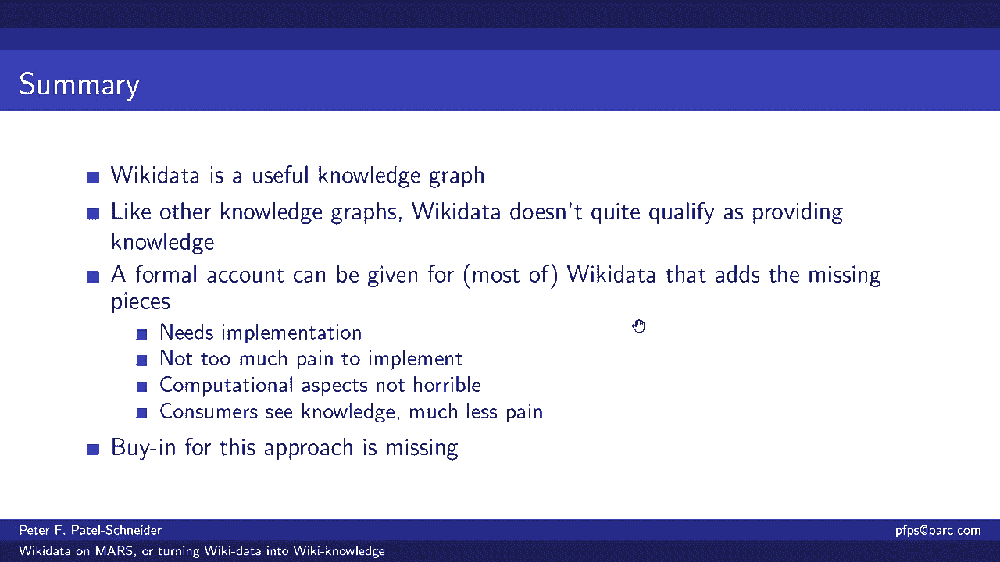

# P7：L6.1- 把维基百科数据构建成维基知识库 - ShowMeAI - BV1hb4y1r7fF

欢迎参加知识草案研讨会，我们这周的主题是，如何设计知识图的图式，我们今天很幸运有，关于这个主题的两次杰出的会谈，第一个将由彼得·帕特尔·施耐德博士给出，他参与了两种非常著名的本体论语言的设计，包括ao。

第二个演讲将由安德里亚·瓦格迈斯特和何塞·高教授进行，他们将告诉我们他们是如何扩展维基数据的模式的，带有Covid信息的知识图，所以这些应该是非常迷人的谈话，所以不要再拖延了，我把它交给彼得。

彼得交给你，好吧，不幸的是，我似乎不能分享我的东西，所以我得做远程控制，并要求幻灯片上的移动，所以无论如何，嗯，所以这次演讲影响到了模式设计，但它是它的排序上，知识图中的模式设计缺少什么。

所以下一张幻灯片，拜托了，所以我在知识工艺中看到的问题是，他们身上真的没有知识，只是数据，所以这个演讲是关于我们如何从下一张幻灯片中的数据中获得知识，拜托了，来支持那个论点，我需要做两件事。

我认为一个是让你相信知识不仅仅是知识和工艺，然后如何添加缺失的位，嗯，我将用维基数据作为我的例子，知识图um，因为它就在那里，嗯，因为它是可访问的，嗯，因为它很好，Wiki数据与所有的知识工艺有点不同。

但没有太大不同，至少不是为了这次讨论的目的，我对维基数据有点苛刻，维基数据中有些东西我不打算谈论，帮助组织，一点点Wikidata是一个社区努力，这使得在Wikidata中做事情变得非常困难。

所以从某种意义上说，他们试图，但也许不是，我想让他们做下一张幻灯片，拜托了，那么什么是维基数据，嗯，我不知道，我是说你们中有多少人知道，但它是一个非常大的社区驱动的存储库，拥有超过9300万个实体。

包括各种各样的东西，这是任何人都可以更新的东西，你可以去维基数据网站，也就是维基数据点组织，拉出一个页面并编辑它，有一个图形编辑器，你的编辑是像维基百科一样实时完成的，人们会生你的气。

如果你做了像维基百科这样愚蠢的编辑，你应该识别，你应该登录，这样人们就知道你是谁了，当你做编辑的时候，但你不必，嗯，你可以做任何你想要的，Wikidata中的数据是绝对免费的，cc零，你可以。

你可以拿着，你可以自己用，你可以用它做任何事情，下一张幻灯片，拜托了，下面是Wiki数据的显示界面示例，你可以看到一个Wiki数据页面看起来很像WikiWikimedia Wikipedia。

我是伊丽莎白·泰勒，有很多关于伊丽莎白·泰勒的信息，我只是把上面的部分放在后面，这一页本质上是，Wikidata与伊丽莎白·泰勒的所有信息的数据库，你实际上可以得到，你可以在垃圾场看到它。

你可以做很多其他的事情，但这是你在下一张幻灯片中看到的视觉界面，拜托了，还有一个Wiki数据的查询界面，这是使用Sparkle查询接口完成的，以及从Wiki数据到RDF的转换。

下面是孩子们的Wikidata查询，作为伊丽莎白·泰勒的一点，如果你真的能阅读右上角查询框中的文本，你会发现用它是非常讨厌的，因为Wikidata内部使用数字标识符，查询界面要求您使用它们。

所以我们在这里要求伊丽莎白·泰勒的孩子，有四个，我们可以看到他们在底部，我们可以在左边看到他们的标识符，它们基本上是下一张幻灯片右手边的名字或标签，拜托了，维基数据有用吗，我绝对认为它很大。

而且还在增长，所以目前大约有13亿个事实，这可能有点高估了，因为有些事实是内在的，下一张幻灯片，拜托了，它的质量很高，包括很多信息，但这里有伊丽莎白·泰勒的孩子，包括她的亲生子女和养女。

所以人们去了相当大的，公平，公平，好努力，包括大量的信息，并做好一件事，在确保它是正确的方面做得很好，下一张幻灯片，拜托了，Wikidata的另一个非常好的地方是它有很多，许多到其他存储库的连接。

这里的每一块都是伊丽莎白·泰勒和其他地方的链接，例如Viaf站点，所以一个ISI很多很多的事情，所以伊丽莎白·泰勒有几十个这样的，所以这是一个非常非常有用的，作为语义的中心存储库。

这个语义装备的中心位置，因为你可以在下一张幻灯片上看到很多其他地方，拜托了，然后你就知道了，我还没给你看，我还没有给你看图表，你可能会想，Wikidata只是一个数据库，但它真的是一个图表。

大家可以看一下，它里面有节点，它有棱角，它有标记的边缘，你实际上可以显示这个图的一部分，这是约翰·鲍威尔·泰勒后代的图表，我选了谁，因为他是一个很好的看到，伊丽莎白·泰勒的曾曾曾曾曾祖父。

所以你可以看到伊丽莎白·泰勒，很多名字很难看到，但你可以从Wikidata中获得图形信息，这是一张图表，下一张幻灯片，拜托了，嗯，它有关于现实世界的信息，这是知识图的另一个方面，不仅仅是人。

但是地方和很多很多关于现实世界的事情，和，这个消息非常接近事实。在世界的下一张幻灯片中，拜托了，它还有一个相当大的模式，所以这里我们有了人类的定义，我们可以看到下面，你知道吗，你看不到太多。

这个东西最有趣的部分是你往下看，对呀，你会看到它是另一个类的子类，被叫人，下一张幻灯片，拜托了，所以这里是人类，好的，下一张幻灯片，拜托了，它有属性或关系的定义，我永远记不住的名字，永远不要保持直线。

哪个系统使用关系，哪个系统使用财产，我认为维基数据使用属性，以下是财产配偶的定义，好的，所以配偶是一种关系，它从Wikidata中的实体到其他实体，这就是底部的数据类型项下一张幻灯片，拜托了。

下面是孩子的定义，下一张幻灯片，拜托了，这里有一个，除非你认为这是一个小本体，以下是人类的概括，所以人是人的一个子类，它是个人的子类，它是对偶的子类，实体，它是实体的子类。

所以我们有一个相当大的类层次结构，这将上升到下一张幻灯片中最通用的类实体，拜托了，在人类下面，我们有非常，它的许多专业，嗯，这些是从哪里来的，wikidata在维基百科的每个页面上都有一个条目。

并从维基百科上获取了许多链接，这么多这样的课程，这些人类的亚类来自维基百科，但其他人来自其他地方，所以这是一个图表，它谈论的是现实世界，它有类和关系，这足以使它成为一个知识图，在我看来。

在我的视图下一张幻灯片，拜托了，下一张幻灯片，拜托了，但是维基数据有知识吗，怎么能不，你在那里看到了很多东西，看起来像是知识，嗯，下一张幻灯片，拜托了，外表是有欺骗性的，所以我们在维基数据中。

我们有这个本体或分类法，不管你怎么称呼个人，它们是类的实例，如果我们问人类的例子，那是q 5，例子是p31，如果您真的能看到查询中的内容，维基数据里有多少人，我们可以在查询接口中运行这个查询。

我们得到了九百万六万七千零一十六，我想是昨天我运行这个查询的时候，但这是正确的答案吗？下一张幻灯片，拜托了，否，这不是正确的答案，问题是Wiki数据中有人类子类的实例，那些不被计算在内。

当您执行直接查询时，例如，您还需要显式地计算趋势的实例，人类的亚类，不仅仅是直接子类，而且它下面的所有传递子类，获得真实的信息，你应该从Wikidata获得的东西，您必须精心设计您的查询。

在某类中的实例，它是如此重要，任何了解Wikidata的人，知道你需要把这个小P三一，在Sparkle查询中获取类的实例，但类似的问题对属性的影响程度并不相同，虽然，人们经常忘记，呃到，看看那个。

更糟糕的是，在某些情况下，即使是这里的查询也不足以获得人类的所有实例，在某种意义上，有一些隐含的信息告诉你Wiki数据应该意味着什么，但那不是，那根本不是机器可读的，它在维基数据的定义中，也就是文本。

或者在下一张幻灯片的老地方，拜托了，所以这里有一个，这是另一个例子，说明信息只能在机器可读的东西之外获得，所以这里有一个女人的定义，上面写着，女人，女性，成人，人类，所有的权利。

你认为Wikidata下一张幻灯片里有多少女人，拜托了，零，但是哦，我们忘记了，我们还需要在下一张幻灯片中查看子类，拜托了，维基百科中的11个女性实例，曾经，当我几年前这么做的时候。

现在实际上有四个两个，所以这可能是错误的方向，但是四二和十一都不是正确的答案，向道格拉斯道歉，亚当斯，那么这里发生了什么，嗯，我们有一个班上的女人，它有一个非常好的自然语言定义，但维基数据里什么都没有。

它获取了应该属于这个类的人类的实例，并使他们属于这个阶级，换句话说，没有识别条件，所以如果我们想弄清楚维基数据中的女性是什么，我们将不得不而不是问简单的问题，我们必须找出一个与自然语言定义等价的查询。

女性自然语言描述下一张幻灯片，拜托了，其实，这是他们中的十一个，这是维基数据的另一个问题，我们看到其中一些是有理智的女人，其中一些是标题，所以嗯，希腊的王后是什么，目前没有。

但这实际上是对一群女人的描述，这不是一个真正的女人，一个历史上的女人下一张幻灯片，拜托了，所以说，从Wikidata中获取信息的另一个问题，Wikidata中有很多信息可以给你一个上下文。

如果我们忽略了上下文，我们只是得到了错误的答案，所以我们在这里问伊丽莎白·泰勒的配偶是谁，嗯，伊丽莎白泰勒死了，反正我也这么想，反正她现在也没有六个老婆，她要么是零要么是一，反正她已经死了。

六是错误答案，对呀，如果我们现在问伊丽莎白·泰勒的配偶是谁，如果我们问谁是女人的配偶，泰勒随时，是啊，是啊，那么我想这将是正确的答案，但这不是人们倾向于问的问题，他们现在想知道什么是真的。

在过去的某个时候是真的，在其他情况下什么是真的，那就没问题了，如果我们确切地知道如何构建上下文，如果一台机器能弄清楚如何构造下一张幻灯片的上下文，拜托了，但问题是，机器中的任何地方都没有状态。

可读表单和维基数据，我们从哪里得到我们需要的上下文，那么维基数据中发生了什么，我们有这些事实，这里有一些，这些是伊丽莎白·泰勒的一些配偶，所以理查德·伯顿是，因为两者都是量身定做的，从三月十五日起。

一九六四年六月二十六日，一九七四年，那是他们的第二次婚姻，哦，对呀，他们两个都在那儿，然后又从七十五到七十六，找出伊丽莎白·泰勒在某个特定时间的配偶，我们需要看一下开始的时间。

与Wikidata中的事实相关联的结束时间信息，问题是，没有什么能真正告诉我们，开始时间和结束时间是正确的关联信息，在某个特定的时间点得到什么是真的，至少在那里，你又知道了，如此如此，如果我是人。

我可以自己写查询，我可以精心设计一个查询，这给了某人的配偶在某个特定的时间，但它不会在那个特定的时间提供其他类型的信息，因为其他类型的信息使用其他限定符来给出它们的开始和结束日期。

他们中的一些人可以像盗梦空间这样的事情，一堆这样的东西，地图上到处都是，你知道，你不知道你需要知道什么，在你能从Wikidata中找到东西之前，下一张幻灯片，拜托了。

所以Wikidata的另一个问题是很少有理智的检查，我给你看了，这个是关于希腊王后的，我忍不住放了一个非维基数据的例子，这是几年前谷歌查询的结果，它实际上从谷歌知识图的早期版本中提取信息。

我们有亨利的六个妻子，第八个，这里有点不对劲，不仅是错误的，这是可笑的错误，有人没有，你知道的，没有支票说一个现居的女演员，不适合做生活在十六世纪的人的妻子，很久以前的某个地方，所以说。

任何知识图上的错误都是可以理解的，你只是不想让他们变得可笑，像这样的错误下一张幻灯片，拜托了，所以如果我们尝试这样做，维基数据有问题，你并没有真正得到你想要的，这是否意味着它不是知识，我声称是的。

我指的是这个，嗯，拉塞尔·奥夫的谈话，我的天啊20年前，他说知识是被组织起来并准备好使用的信息，维基数据还没有真正准备好使用，因为你必须知道一些东西，在你想出正确的方法来获得下一张幻灯片中的信息之前。

请如此如此重申，使用维基数据卡尔，这需要知识不在数据中，人类可以，你知道我使用维基数据博览会，但我甚至偶尔会感到困惑，但人类通常可以得过且过，程序不能，除非人类，一些人通过并训练他们。

你如何获得培训信息，或者写一些代码，弄清楚如何做正确的事情，然后它，你知道没有数据可以找到，你只需要，你知道的，把它都放进去，所以Wikidata中的信息还没有准备好使用。

因此维基数据并没有真正的知识下一张幻灯片，拜托了，所有的权利，那么我们如何将维基数据转化为维基知识，所以我们真的需要做些什么来增加数据的后果，如果我们知道它们是什么，这就是逻辑的工作。

所以如果我们能为维基百科设计一个逻辑并实现它，我们可以弄清楚后果是什么，我们可以将语言信息转化为表达式，在这个逻辑中，我们可以考虑上下文，嗯，通过弄清楚如何组合限定符，然后我们就可以。

um并用当前上下文增强查询接口，不会考虑最后一个，这是一种扩展查询系统的工作，下一张幻灯片将有背景上下文，拜托了，所以事实证明，有逻辑可以用于此目的，嗯我应该，哦，我忘了。

我应该对火星和马普尔的来源提出一两个很好的观点，火星和大理石，来自，不仅仅是德累斯顿的团体，由马库斯·克鲁兹领导，它们是优秀的逻辑，戴维·马丁，我添加了一些小的东西，使它们对Wikidata更好一点。

因此电子邮件是大理石，但这些是知识图的逻辑族，他们的主要思想是用事实上的限定词来增强正则逻辑，所以这些提供开始日期的额外小东西，结束日期，他们喜欢某人结婚的地方，很多东西我们也这些。

这些逻辑还添加了Wiki数据中的数据类型，它们添加了处理限定符和推断的规则，它们增加了约束，这是你所做的另一部分，其中两个逻辑，马尔科和埃马尔，实际上可以使用前向链接规则来实现，其中推理的复杂性还不错。

如果你做出合理的假设，我故意含糊其辞，在那里，嗯，要了解这些逻辑的细节将是一口完整的井，至少整整一个小时的谈话，我不必没有机会在这里做这件事，那么我们如何把这个。

所以如果我们把e marple和维基数据中的事实，这里有几个，这里我们有伊丽莎白·泰勒人类的例子，就像我们以前看到的那样，现在我们有伊丽莎白·泰勒的配偶，理查德·伯顿。

这个小标志是你添加到事实上的额外东西，在这里我放了一个开始时间，幻灯片上还有很多其他的东西，几张幻灯片前，所以基本上你把Wikidata中的所有事实，你把它们堆起来，你把它们做成一个e marple。

方便地说，像子类和子属性这样的东西，没有上下文限定符，i，e，如果一个人是一个人，如果你或者如果人类是人的一个子类，那么它总是人的一个子类，这是绝对必要的，这让一切都容易多了，下一张幻灯片，拜托了。

我们加一个，然后定义Wikidata本体属性后果的规则，i，e，这就是Wikidata本体论的全部，这里我们看到子类是传递的，在子类上分发，嗯，的子属性是传递的，我们知道有了这些小X，我们在拖动上下文。

所以某物是x的一个实例，x是y的一个子类，这只在某些特定的情况下是正确的，然后我们把所有的信息拖来拖去，这就是下一张幻灯片的超级骗局，拜托了，嗯，然后我们添加主要属性的属性，所以这里有一个例子。

配偶是Wikidata中的对称关系，这不是自动为您推断的，在维基数据中，您可以在下一张幻灯片中添加一个规则，拜托了，我们实际上可以添加约束，我根本没有谈到约束，约束是Wiki数据中的东西，它说。

什么样的更新是完全可以的，哪些不是很好，所以这里有一个例子，一个本质上说，嗯，好吧，反正，这里有一个来自Wiki数据的示例约束，它移到我们的逻辑中，很好地进入下一张幻灯片，拜托了，对于两个难的部分来说。

这是容易的部分，下一张幻灯片，所以我们有这些，这些限定符，当我们进行推断时，我们真的希望能够将它们结合起来，我们想把事情做好，如果我们有两个开始时间，我们想把它们结合起来，我们取最大值或后者。

如果我们有两个结束时间，或者实际上有N次，我们想把它们结合起来，至少我们创造了更早的，这就是你如何做到这一点，所以如果你有多个开始时间，所以结果的开始时间，是推理组件开始时间的最大值。

和类似的下一张幻灯片，拜托了，这是一个艰难的过程，因为限定符是Wikidata的重要组成部分，但是英文描述很模糊，嗯，目前还不清楚这些东西到底是什么意思，以及它们应该如何结合在一起。

所以有相当多的工作需要进行，去弄清楚这些东西到底意味着什么，特别是我需要得到多个组合，下一张幻灯片，拜托了，另一件事是我们想做像女人这样的事情，这里有一个女性行动的例子，我们想说，如果某物是人类。

而它们的性别或性别是女性，那么他们是一个女性，听起来很合理，也很容易做到，下一张幻灯片，拜托了，问题是有很多，很多，许多这样的阶级，我没有数，但是，我猜至少有几十个，可能至少有数万，可能有几十万。

我不知道，我收回刚才的话，数以万计，嗯，他们中的一些人可能没有很好的识别条件，你真的不知道属于某个古怪的阶级需要什么，所以你需要在下一张幻灯片上做一些猜测，拜托了，所以所有这些。

然后我们可以把Wiki数据变成知识库，在逻辑中，我们就可以，说好，我们能得到的是，在这种逻辑中有后果，但我们的问题当然是这还不够，我们实际上必须实现这些东西，到目前为止，我所描述的东西是到目前为止。

只是一个在一些系统中接近实现的提议，但没有什么能做到这一点，所以它们是可以存储Wiki数据语句的属性图的实现，有些图数据库的规则与这些非常相似，例如图db，但是没有一个系统真正实现这些规则。

正如所描述的那样，在这里实现逻辑需要大量的工作，我非常乐意做这件事，如果有人付钱给我做这件事，但它就在那里，好像没人对此感兴趣，但最终都只是前链规则，您可以做的一件事是通过以下方式实现这个逻辑。

本质上是在RDF中编码所有内容，并使用RDF规则引擎，下一张幻灯片有很多，拜托了，在将维基数据转化为维基知识的过程中，一个更大的问题是维基数据社区，依我看，它相当支离破碎。

Wikidata社区的一部分对这种努力不友好，他们认为没有必要，即使对于本体论，很难看出，如何做足够的说服力来让足够多的人进入Wiki数据，配合这个，这样它就可以在维基数据中完成，部分问题是。

当然是维基数据的支持小组，这是维基媒体计划的一部分，资源非常有限，他们不想做任何编程，他们只想把东西从架子上拿下来，嗯，即使是非常简单的改变，我将对开源项目进行简单的更改。

所以我认为获得愿景的最大问题是，这样做实际上是让一个社区推动它，那么我们有什么，我们在执行方面有些问题，我们在社区中的地位有一些问题下一张幻灯片，就是这样，所以总而言之。

Wikidata是一个有用的知识图，我的主张就像其他知识图一样，速战速决并不完全符合提供知识的条件，但你可以做对，正如我试图描述的那样，您需要此实现是必需的，计算访问方面并不可怕，嗯。

这是一个前链规则系统，它运行可以运行数据，嗯它，我是说Wikidata已经有很多运行数据的小机器人了，所以这不是一个明显的--不是明显的--更多的计算努力，嗯，好处是电脑消费者我的意思是。

计算机消费者看到知识，构建程序的痛苦要小得多，这些程序实际上可以看到，维基数据固有的知识，所以让我，结论意见，说，这与定义模式有什么关系，嗯，在我看来，模式不仅仅是分类法，这不仅仅是说人是人的一个亚类。

它真的给出了这样的定义条件，屠夫或面包师，事实上，屠夫和面包师也是维基数据中的问题，如果你想知道维基数据中的屠夫大概没有屠夫，但是维基数据中描述了很多屠夫，你只是不能通过得到类屠夫的例子来得到它们。

所以在我看来，为知识图制作一个真实的模式，你必须拥有比当前知识工艺更多的东西，为了做到这一点，你需要有一个逻辑，至少有某种形式的承认条件，和某种形式的推理，使一切都保持向上和向上，这样你就不会得到这些。

嗯，对你的知识图中实际存在的东西的错误看法。

就是这样，谢谢。谢谢。彼得，呃，这是一个出色的演示，嗯，我们将在最后回答问题。

