# 【双语字幕+资料下载】斯坦福CS520 ｜ 知识图谱(2021最新·全20讲) - P9：L6.3- 维基数据中的实体schema和形状语言 - ShowMeAI - BV1hb4y1r7fF

你能看到吗，是呀，好的，所以我们现在要讨论Wiki数据中的实体模式和表达式，呃。

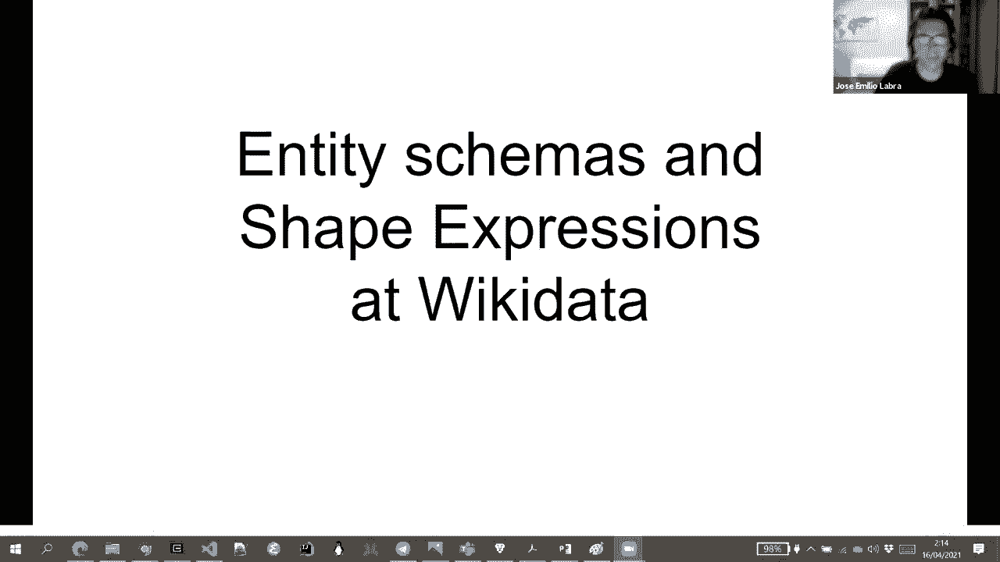

所以这是，第一个，呃，为什么存在，为什么因为我们从相同的表达式开始，然后呃，GUI数据中采用了sapersons，为什么要创造一些东西，呃像安全的表达，这里我们讨论的是知识图。

很多人也把知识课和RDF联系在一起，因为有很多好东西，我的意思是RDF对数据集成非常好，因为您可以自动合并RDF图，您还可以使用RDF作为知识表示的基础，而且RDF在。

您可以使用眼睛将RDF适应不同的上下文，我认为RDF在默认情况下是可以减少的，而且你有很多工具，数据存储和闪光点，你甚至可以在html中嵌入rdf。

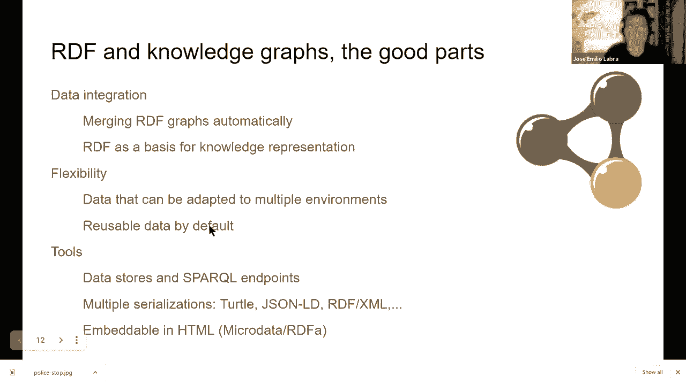

所以RDF有几个优点，但还有其他部分，我想我是说这个，我想RBF还没有，Web开发人员首选的技术，比如说，我认为有几个原因，在实践中发生的原因之一，当你试图消费和产生关于你的RD数据时，否。

没有草或火花和点，通常这并不容易，因为，比如说，闪光点，文档不是很好，呃，如果你是消费者，你想看看有什么是如何做一个火花查询，正如彼得所说的，用户很难和你在一起，你需要查看数据。

有时文档只是一组Sparkle查询的示例，所以没有一个很好的文档或对我们知识图内容的很好的描述，所以看不见是很难的，嗯，为了解决这个问题，呃，在二千零一三年，有人提议使用一种被称为安全表达式的定义语言。

这种语言的想法后来会变成，还有另一种语言是安全约束语言，它还采用了保险箱的想法，就是，制作人可以，他们，他们知道他们将生产什么内容，他们可以确保他们是，他们想生产那些内容，他们也可以做广告。

还有评论说结构，那些那些扑救，他们甚至可以生成用户界面，以便验证人们可以手动输入的数据，也适用于消费者，如果能对后面的内容有所了解，那就太好了，还有那些闪闪发光的点，并且能够在开始处理之前验证数据。

或者用数据做一些事情，甚至能够生成查询或优化，呃，闪闪发光，我是说，一些查询甚至数据，所以可以优化，所以说，所以这就是为什么最安全的人被创造出来并且非常有用的一些原因，呃。

只是对柏树存在的一个非常简短的介绍，它被定义为一种有两个主要目标的语言，那一个是人，可读的，呃人类可读，从某种意义上说，它是预定的观众，呃是呃，知道的人，比如火花，但他们也不是需要成为参数的人。

所以他们可以是领域专家，事实上，例如，在Wikidata社区，您可以看到能够进行Sparkle查询的人，他们不是有很多计算机科学知识的人，他们只是其他领域的人，他们只是可以闪闪发光。

所以我们安全表达的想法是以观众为目标，所以语法的灵感来自Turtle和Sparkle，这是呃的一个例子，性别图式，我们是说你有一个用户，它有一个名字，它是一个字符串，知道另一个用户，语言也是机器处理。

从它具有形式语义的意义上说，还有几个JavaScript中的开源实现等等，我会谈谈这个在线演示，我稍后会展示，所以先结束这个简短的介绍，说表情，假设你有一些数据，你有龟中的RDF数据，然后你可以有一个。

呃，模式模式，呃，我的意思是描述这些数据的内容，在这种情况下是一个非常简单的例子，在那里你有非常简单的网络，你有爱丽丝的地方，它的名字，它是一根弦，知道一个，呃她自己，鲍勃和鲍勃只宣布罗伯特这个名字。

最后我们有了同样的地图，这个想法是，如果你有这三样东西，然后你可以验证，验证会说，好的，所以现在我可以，如果我试着检查，如果爱丽丝是用户，呃或符合用户的形状，然后我可以去这里。

因为爱丽丝必须知道这两个嗯，为了成为用户，这个也必须是一个，我说两者的形状都必须是用户，所以在验证期间，我觉得你可以说好，爱丽丝是个用户，因为鲍勃也是一个用户，所以这是验证的结果。

这是对cPresse语言的非常简短的介绍，它是在2013年开始的，如果你想要更多关于我们在这本书中写的表达式的细节，它是可用的。

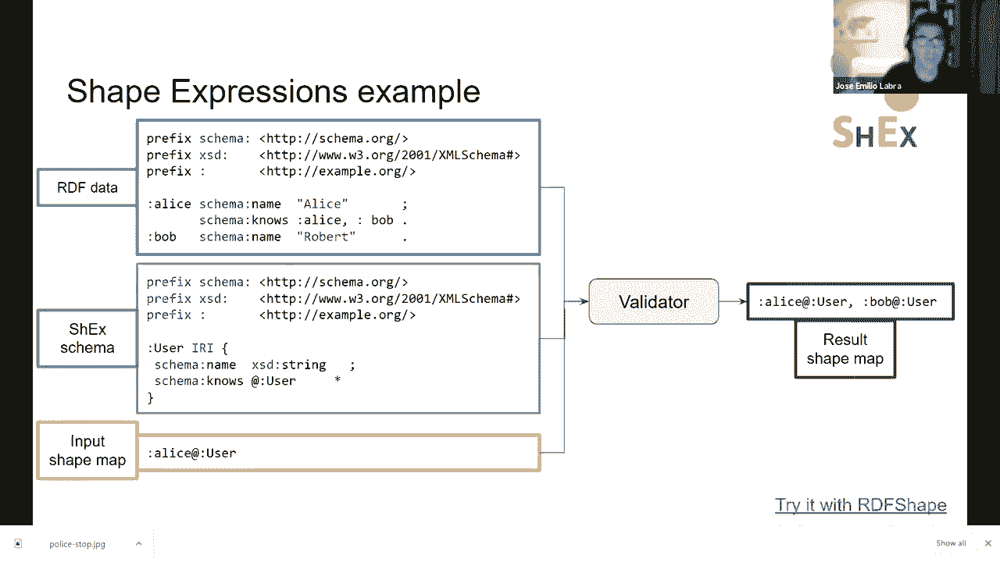

这被称为验证RBF数据，而且这本书也可以在网上买到，它是html，还有我去年给的这个教程，参加国际语义网会议，在那里你也有幻灯片。

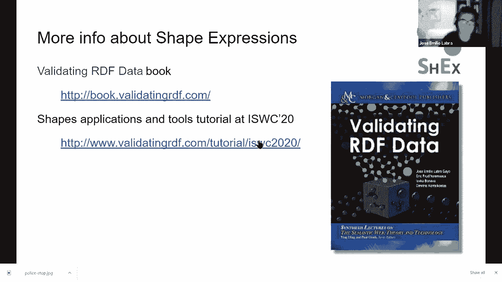

你可以获取更多关于它的信息，我知道这些表达式和Wiki数据之间的关系，嗯，问题是在2000年，呃，采用的Wiki数据，呃，安全表达，呃，作为另一个，名字，空间，就是他们，他们把名字改了一点。

因为他们用了，呃，实体模式，呃，但是这些实体模式被表示为使用安全表达式，现在您有了一个新的名称空间，所以在其他名字空间中，最受欢迎的，可能是排队，a q和a数字代表实体，p表示属性，L代表莱克瑟姆。

S是为感官保留的，这就是他们不用于模式的原因，但他们把E作为实体模式，例如，如果你点击这里，这是实体架构。

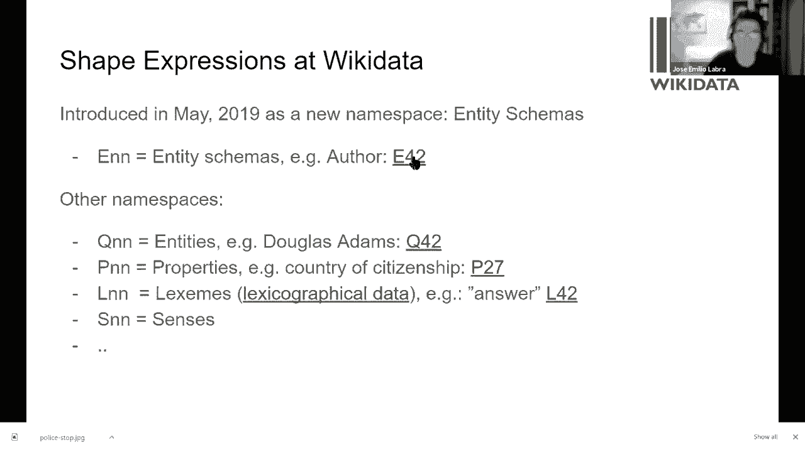

你能看到吗，就是这样，是呀，是呀，好的，所以这是，呃，现在，这是一个维基数据，所以有一个作者的实体模式，所以嗯，也许我甚至可以做样本来做到这一点，如何验证数据，比如说，呃，这是身份模式。

如果你点击检查实体，然后打开这个，此工具可用于验证实体，比如说，我们可以在这里做一个闪亮的查询，让我们看看它是否有效，您可以检查要验证的身份，它正在解决这个Parker查询，现在它开始进行验证。

我想他们中的一些人验证了，我的意思是没关系，例如，这是彼得以前说的话的一个例子，所以你可以有一些满足，所以符合这个同样的表达式，可能还有其他不符合此表达式的数据。

所以这是我认为Wikidata接受的东西，因为不是所有的数据都是正确的。

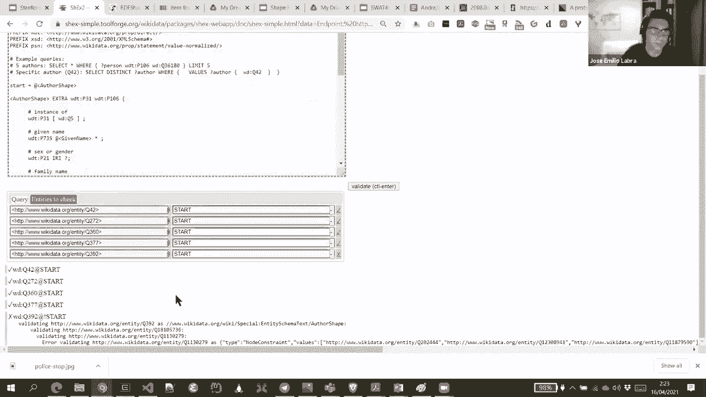

还有东西要修理，好的，这就是安全表达式的介绍。

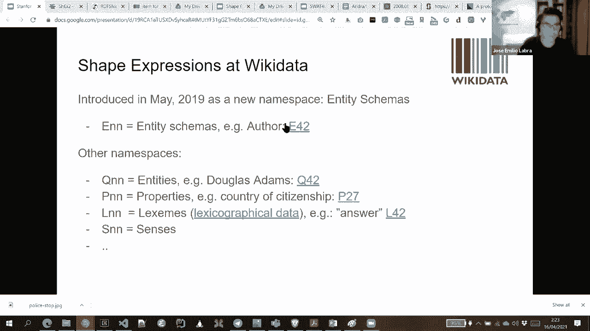

现在我想继续一点，使用一些安全表达式的工具和用例，呃，第一个是验证，我想我已经说过了，所以不打算重复，但是假设您可以用这个验证做的事情也是过滤实体，因为您可以过滤那些符合，呃。

从那些不符合给定模式的实体中。

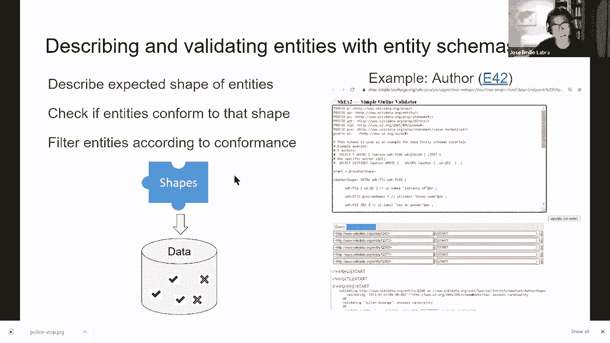

你也可以我们创建了几个我们正在工作的工具。

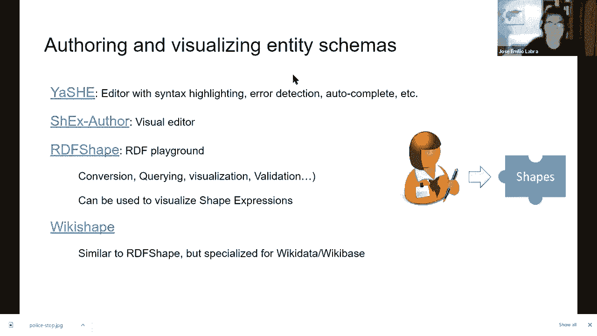

例如，这是一个叫做Yasi的工具，它允许你编辑一个安全的表达式这很好因为，比如说，如果我走到E42，你知道吗，你可以看到任何人，你可以有自动完成，因此，编辑安全表达式是非常有用的。

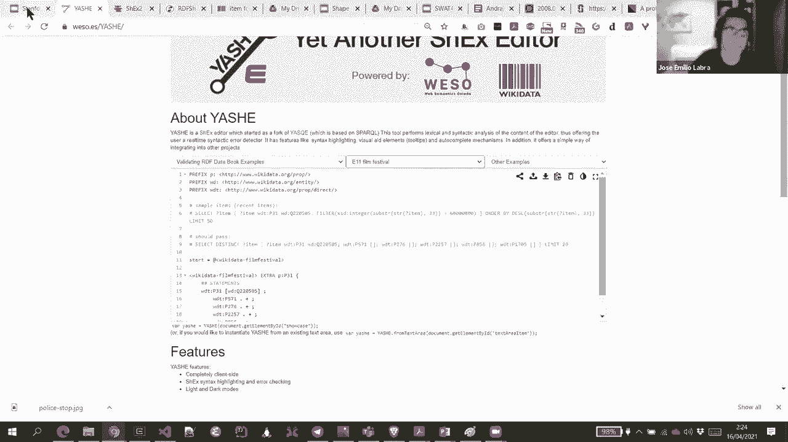

还有一个性爱的视觉编辑器，安全表达，RDF SAP是一个工具，安全空间的游乐场，维基安全也是类似的，但专门用于Wiki数据。

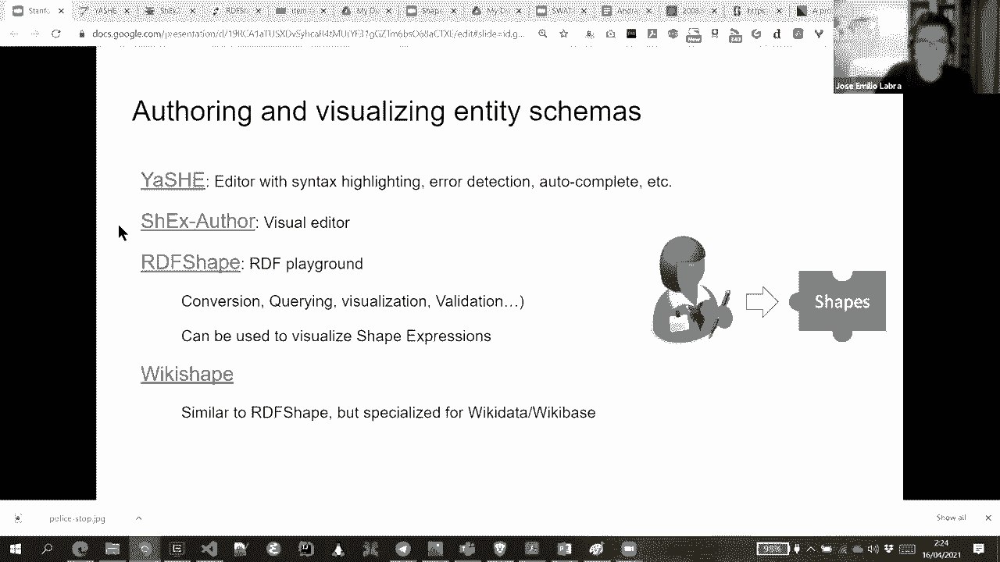

然后我们也有，呃，刚才说的扇区工具，它在做什么，呃，在相反的地方，这很有趣，因为当我们从表达式开始时，我记得我们去了维基数据的会议，用户问我们是否可以从RDF中提取，已经存在的数据，提取和推断形状。

所以我们创建了这个工具，因为它来自，用户的需求和另一个工具，也就是用户现在要求的，如果他们能从安全的表达式生成表单，因为我是说，比如说，如果您知道要创建的，呃，作家，你知道一个作者的属性是什么。

您可以创建一个表单，和，比如说，让我们让我们看看。

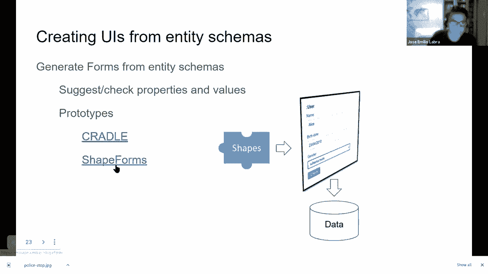

比如说，这个这是摇篮，如果在这里有效，例如，在这个演员身上，比如说，所以它从最安全的存在，它可以生成一个表单，您可以，人们能感觉到，等等。

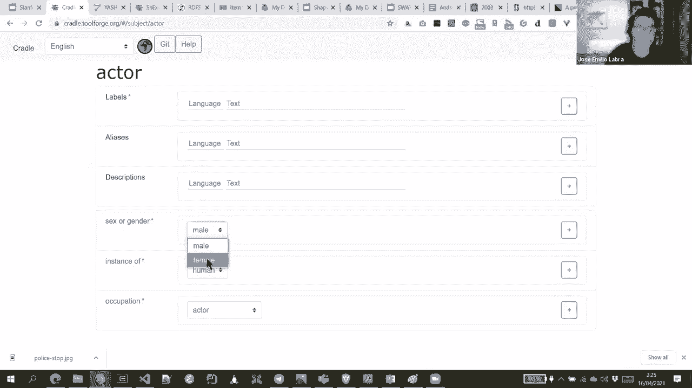

所以这是用户，我是说，这是用户要求的一个实际应用程序。

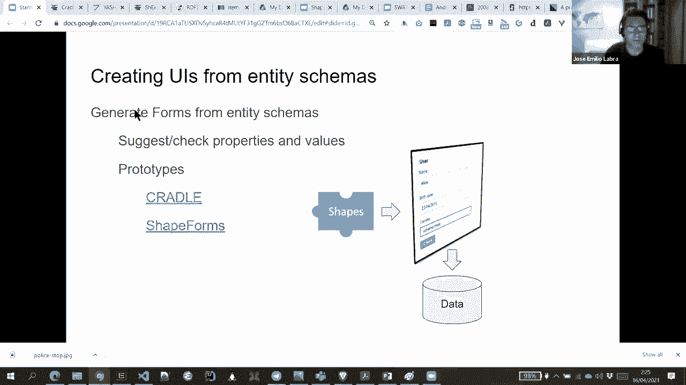

最后是关于Wikidata中的安全空间，一些也很有趣的事情，是吗？而且领养人数一直在增加，人们开始使用越来越多的实体模式，现在有了这个模式项目，还有这个。

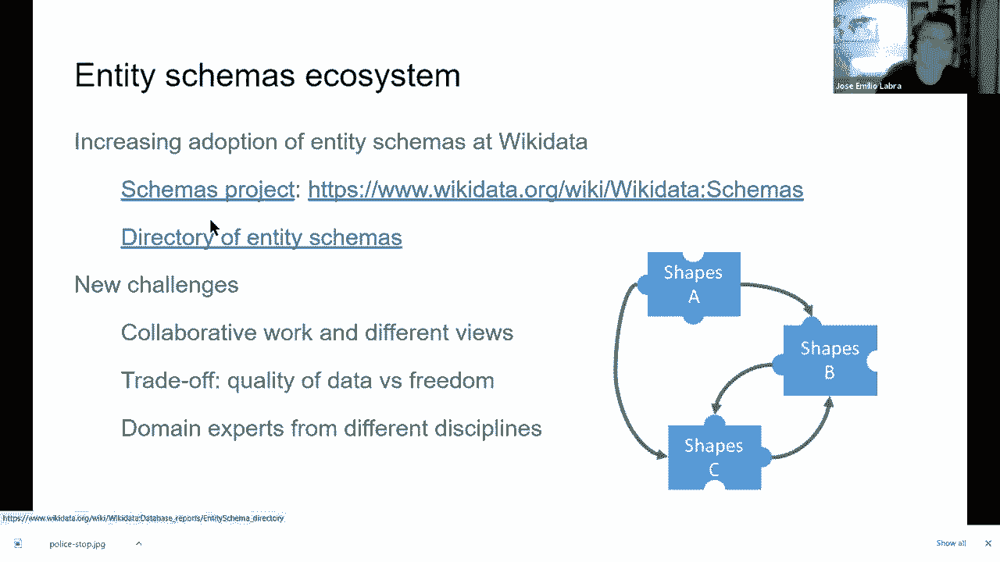

呃，有一个实体架构目录，如果我们点击这里，你可以看到很多实体架构，第一次去医院，再次为医院，其中一些是重复的，因为，如你所知，这是我们保持PD风格的合作，和每周合作的风格，人们只是添加的东西。

有时它们会重叠。

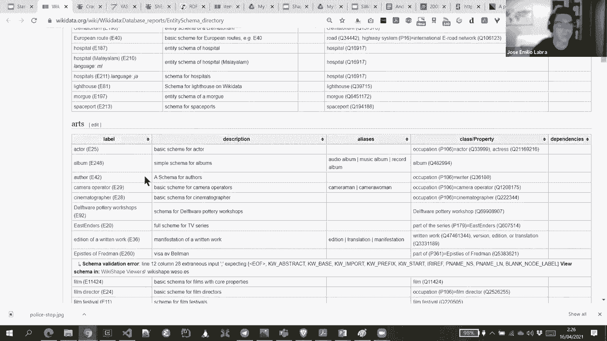

所以这也是一件有趣的事情，如此公正，开启了新的挑战，比如说，这种合作以及对什么是正确的什么是不正确的不同看法，呃，这也很有趣，两者之间的权衡，呃，数据的质量，但与任何人都可以添加的自由相反。

他想要什么都可以，来自不同学科的领域专家之间也有这种合作，所以这就是我想说的，现在我认为安德拉可以继续和社区在一起。

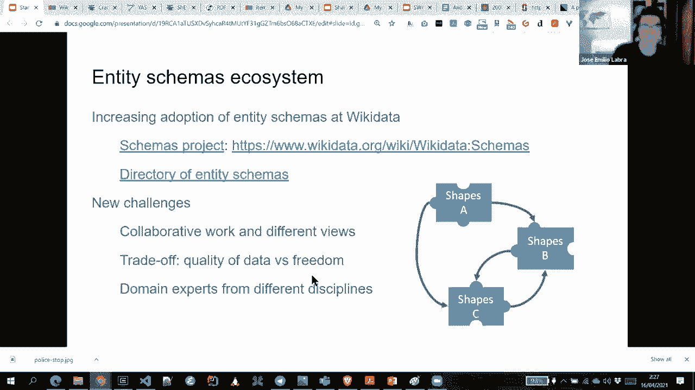

所以我可能得这么做，停止服务，你在那里，你把它，好的，我又打开它分享了。

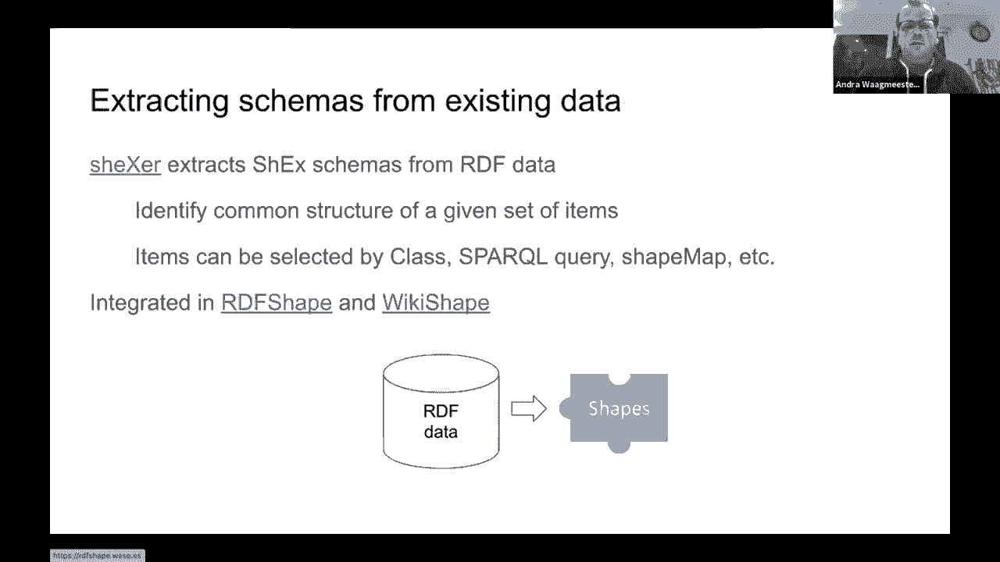

是呀，我正在收尾，我想我大约有五分钟或更短的时间，所以这就是我要做的，所以我们回到CO所做的，我在这里展示的是什么，我们在基因维基项目中所做的工作的幻灯片，那是在，第一步是与领域专家社区接触。

并讨论世界上可用的数据是如何，并有公共许可证，因为这也是需要强调的，Wikidata是一个公共公共知识图，所以只有公共数据才能进去，然后你在这个社区参与过程中所做的，你试图在一张纸上得到提取关系。

一旦有了共识，这也被展示给Wikidata的社区社区，通常在讨论中，呃，但一旦就位，然后将模式转换为形状表达式，在维基的情况下，在这种情况下，Wiki数据可以用于审查，它可以用于文档，因为对一些人来说。

这是一组领域专家的决定，关于模式应该如何看待审查中的某个数据集，您可以为客户使用，呃，提交前检查，或者是服务器预摄入检查，一旦完成。

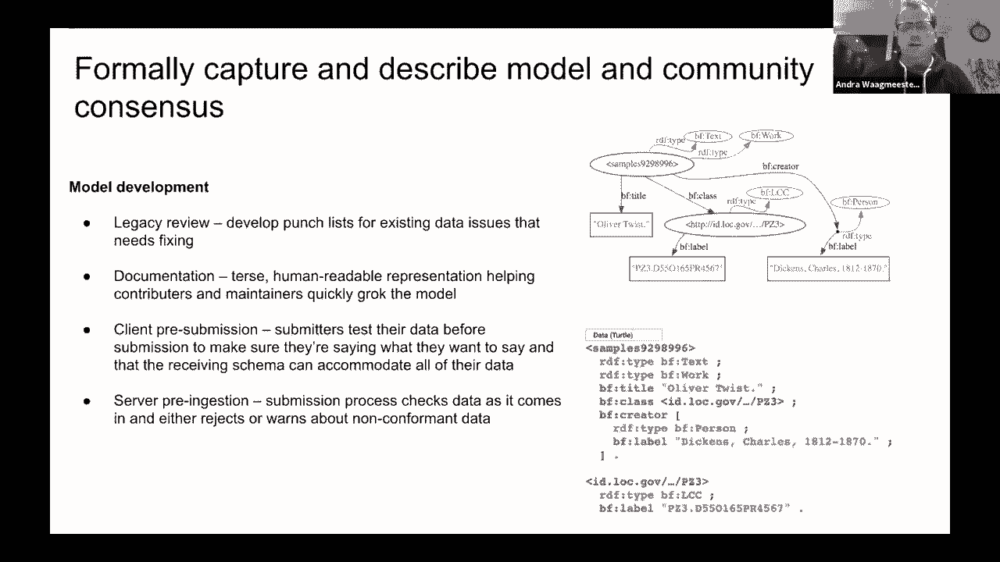

我们有一个形状表达式，呃，在项目中我们写，定期对齐这些数据的机器人，使用Wiki数据来保持Wikidata与数据库的同步。

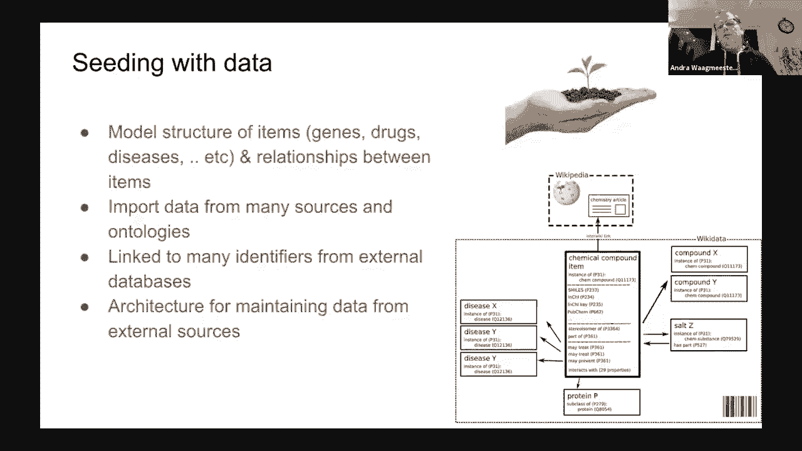

这是在持续集成工作流中完成的，所以定期更新。

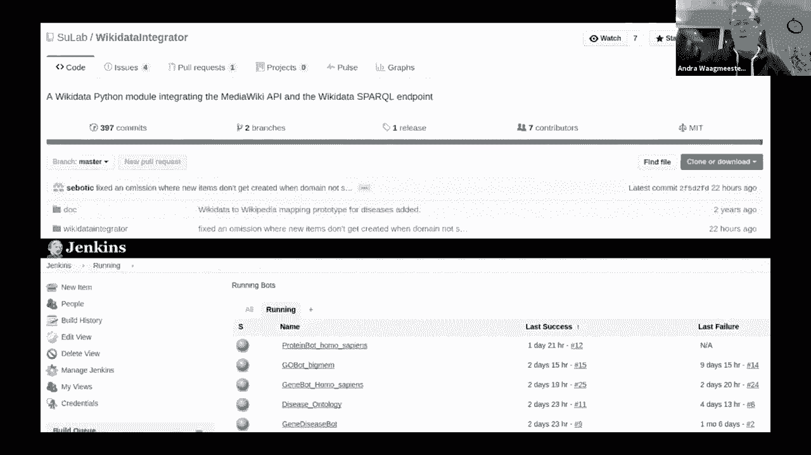

然后你会得到这样的东西，有一个维基数据，有一个Wiki数据有自己的策展周期，然后你有一组数据库，我们的本体有自己的身份，用自己的，然后这个项目试图将这两种努力结合起来。

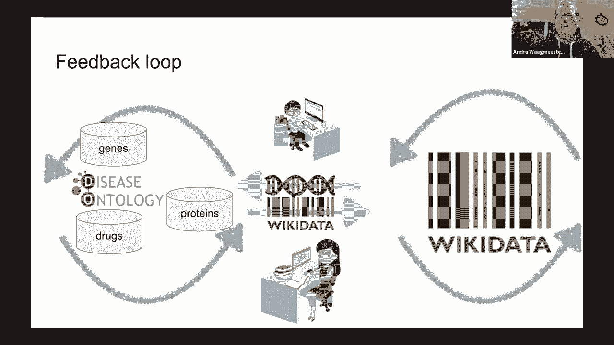

我们只是复制了这一管道，从社区参与，呃，提取模式，编写机器人，在这个过程结束时，我们有，我们有管道，我们有他们，呃，下面的方案链接模式，所以所有这些我们都有一个疾病的实体图式，对于火应变，一种菌株。

病毒分类单元，然后我们有蛋白质基因，途径、蛋白质和基因，这就是产品的结尾，所以我们利用社区来做到这一点，结论和今后的工作，我们正在努力建立一个与Wiki数据对齐的实体模式生态系统，这有助于更好地理解。

维基数据中的，wikidata是一个很好的协作中心，不仅在数据上，而且还在底层架构上，我想以水獭的致谢结束，还有基因维基项目，酋长社区团体，和，当然啦，整个维基社区，演讲到此结束，谢谢，我想得很好。

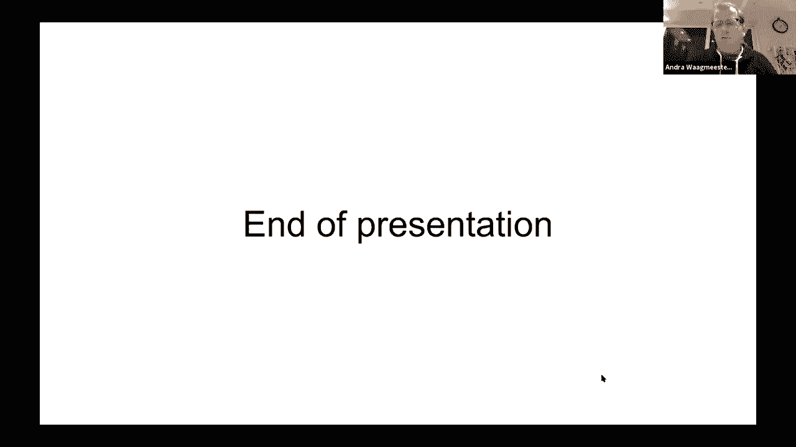

非常感谢，那是呃，真的很迷人很有趣，两个演示都是呃，超级酷，我们有足够的时间讨论，我们还有20分钟，所以也许我们可以看看观众的一些问题，然后我们可以在小组成员之间进行讨论，然后你想问一些观众问题吗。

所以呃，我们有几个观众问题，让我们从彼得开始，嗯，还有一个关于钥匙的问题，一样大，呃，数据大小，所以有一个问题这里有一个问题，嗯，一个问题是关键数据大小，比如说。

鉴于其拥有近200万种类型的大而深的类型系统，嗯，我不知道，我不知道它有这么多类型的明确，所有关系的实例都会增加非常多的关系，如果你完成了实例的事情，是呀，你确实添加了很多信息，真的，当然啦。

它不适合Wiki数据中的任何特定实体，您只添加类型的祖先，总的来说，它已经在了，然后呢，我是这么说的，因为你加上了两件事，你把祖先加起来，然后你添加识别，公认的，所以这很重要，嗯。

我不认为你会接近两百万，为了任何事情，你可以很容易地得到一千个左右的权利，那并不罕见，嗯我会的，那就是，它就会这样，所以是的，有一个重要的，那里很痛，然而，储存的关于每个人的信息量至少是这么多，所以说。

我们让我说，让我不屑一顾地说，我们只加倍，在最坏的情况下，接下来我们有一个问题要问何塞和安德拉，形状表达式如何与多个约束链接进行比较，为什么一个人要用其中一个或另一个，是啊，是啊，好像形状表情。

语言和大理石，呃，彼得说他们的目标是一样的，然后显而易见的问题是好的，有什么区别，嗯，有，所以让我说一点大理石，所以大理石的约束，可以被视为类似于检查，制约因素，对马普尔的规则部分是不同的，嗯。

检查一般是，不会向任何类似维基数据的东西添加信息，它只是检查那里的东西是否可以接受，但这些都不是约束系统的细节，嗯，实际上让我让我让我稍微修改一下，Wikidata已经有了一个受限的系统，嗯，那个。

那个，寻找像嗯，你只能有一张父亲支票，也能做到，在某种意义上，让我让我把话放进支票的嘴里，人们检查，是关于创建适合类的约束集合，而Wiki数据，约束和像markle这样的约束实际上是非常本地化的。

它们是像你只能有一个父母一样的东西，它们是像，嗯，你的孩子必须比你小诸如此类的事情，本质上不是约束的完整定义，用于，比如说，你想在人类身上拥有的那种东西，好的，谢谢。我的意思是，何塞，你想在。

还是你想提出你的观点，是啊，是啊，否，也许另一个区别是，在最安全的表达式中，主要是为RDF创建的，并原则上亲自出席，所以我们不处理限定词，我想这很神奇，他们，它可以处理。

可能可以扩展到处理这将是一个一些研究，我得到的另一个肤浅的表达是，形状表达语言可能主要是，完整性检查或约束检查，而Marple可以用来推断和得出新的结论，不仅仅是为了约束检查，精确地，是呀，好的。

所以这很好，所以呃，下一个问题，嗯，为什么使用形状表达式而不是本体来验证RDF数据，这是个有趣的问题，嗯是的，我喜欢用，事实是我想对我来说，但请彼得和何塞，纠正我，阿尔·伊斯特。

uh是专门用来描述世界的，其中形状表达式被专门设计来描述要给出的数据，举一个例子，如果你是，如果你用猫头鹰，你会说每个人都有两个亲生父母，这是一个有效的索赔，如果你看数据，一般情况下，凌乱。

你想描述一下，嗯，一个人可以有多个监护人，因为我们不是在谈论生活中的现实，我们说的是，我们说的是，代表世界的数据，所以你实际上可以我想，这就是猫头鹰和棚屋的区别，好的，所以用另一种方式来陈述。

这可能是支票更多，呃有点自下而上，就像它是由数据驱动的，而猫头鹰，你知道这是自上而下的，你知道你在试图描述这个世界，而不是，不管数据可能是什么，我会做出稍微不同的区分，检查是关于你所拥有的信息。

所以Shex说每个人都必须有一个社会安全号码，还是出了什么问题，我们必须有一个社交，你必须得到一个社会安全号码，否则就有问题了，猫头鹰只是说每个人都有社会安全号码，一切都很好。

如果你在我们的数据库中没有，它就在那里，我们只是不知道，所以说，世界的方式有多好，检查和其他类型的约束是关于，我们关于世界的数据是，或者你可以说我们对世界的了解是，虽然真的是现在，我觉得你说得很美。

很清楚，非常接近，我有个好奇的问题要问彼得，呃，你呃提出了这个问题，维基数据中有多少女性，你也发布了查询吗，有多少男人，嗯，我刚才做了同样的数字，你知道它说，都一样，这是完全一样的问题。

所以再一次找到Wikidata中的男人，你必须向人类查询正确的性别或性别，当然，我们有非二元性或性别问题，然后如果你想长大，那么你必须对作为一个成年人有一些明确的定义，就像，你多大了，是啊，是啊。

我是说，很高兴知道，因为我们不希望反歧视的人追杀我们，我知道我，我在这个医生和类似医生身上举的所有例子，我无意中发现了他们，对呀，我是说，如果我在某些种类，我真的看过。

但我告诉别人的一切都是我刚刚遇到的，所以这就是那个女人，一个是特别的，因为有人问我对，我说好，我不知道，让我看看，哇哦，哇喔，真奇怪，对呀，如果我能给它一个关于对此反应的轶事。

我从维基约会的人那里得到的反应是，哦四二是错误答案，它需要为零，所以有人到处去把那些都处理掉了，基本上删除了那些，那四样东西和女人，对其实，和妇女的次阶层，因为他们的观点是应该有零，零间接。

现在这些事情的实例为零，当然那是个更好的答案，对呀，然后你可以说，哦，Wikidata中有一些类永远不会有任何讲述的实例，对呀，你永远不会，你永远不应该说某人是女人，你应该说他们是人，有性别或性别。

女性和适当年龄，你就是这么做的，但没有任何迹象表明情况是这样的，所以，当然，因为没有任何迹象表明这个案子，人们创造了这些人，最终成为女性的例子，对呀，嗯，呃谢谢你，我有个问题要问安德烈，和何塞，呃。

我是说，有趣的是你，嗯，在维基数据中添加关于Covid的信息，呃，有什么影响，我是说有人利用过它吗，我是说它导致了疫苗的发现吗，或者我是说，做这件事有什么好处，这是个好问题，它的好处很好，事实上。

报纸刚刚出版，好处是，我们有很多后续项目，所以，例如嗯，后续项目之一是建模综合体，所以我想说很难说，我们找到疫苗了吗，我想可以肯定地说，否，可能不是，但它是什么，呃它它，它把数据整理好了。

所以它创造了研究人员之间的合作环境，做这个项目的哪一部分并扩展它，而且是的，该资料目前正用于，有一个叫Scholia的工具，那模型，那个模型，那口井的文献，我们还没有做任何结构分析来得出结论。

除了它被用于Wiki数据下游的工具之外，我们有我知道的项目是建立在，复杂门户是其中之一，维基路径是其中之一，所以是的，在那个层面上，它只是其他项目的一步，研究界的合作项目，对疫苗有影响吗，很高兴知道。

但这需要做一些额外的研究，但另一个好处也是，这也是我们的目标，我是说我们相遇是因为我们在世界各地都被封锁了，所以我们用我们在coit中使用的作为叙述，驱动此协议。

所以更大的好处是我们终于有了一个即将发表的协议，并可用于其他用例，不管是沉船还是河流，或者任何你想做的事情，现在可以用，所以是的，我想那些是，这些是可以提出的观点，我还想说一点，我们继续讨论约束。

可能有点吹毛求疵，但我想说实际上形状表达不是关于应变，而是关于期望，我想这就是为什么形状表达对，以彼得为榜样，当我们开始在基因，我们把人类，维基数据中的基因，我们放进去的是Q5基因，它是一个人类。

在某个时候，我们无法复制进化树，基于Wiki数据中的数据，因为事实上呃，我们需要把它建立在智人的模型上，因为那些分类信息不在Wikidata中，接近人类，因为它也作用于一个信仰体系。

有人不相信人类会进化，所以我们必须创造一个智人项目，与人类平行，能够再现该用例，所以里面有相互矛盾的信息，这对形状表达式很好，因为它是什么你怎么区分，那就是你可以看到，呃。

对社区中添加到Wiki中的引用和限定符进行限定，所以作为用户，您可以决定我只想要下面的Wiki数据子集，下列模式中的下列引用，这是给我个人的，是我当时的大，为什么我投资形状表达式。

这个形状表情让我可以表达，嗯，让我们加上期望，所以这不是对数据的限制，这是我期望的表达，我个人也仍然在谈论约束，但我试着把它变成不是约束检查，但检查是否符合申请费或申请简介，那是由用例驱动的，所以是的。

但你可以这么说，你知道的，使用形状表达式，受启发的权利，你实际上将如何使用这些数据，以及如何期望您的应用程序，您的应用程序所期望的，对呀，所以耶，用户，也包括数据发布者或数据所有者，是啊，是啊。

所以有几个关于上下文的评论，呃，我们如何组织描述上下文的方法，什么是上下文，如果时间在我们的时间和空间维度的上下文中，也许彼得，你可以对此有所了解，所以是的，我们立即进入哲学，对所以对。

我们现在可以离开两千年来思考这个问题，却没有任何答案，嗯，但我们当然是计算机科学家，所以我们需要想出一些粗略的准备好的东西，嗯，所以Wiki数据中的限定符，或者许多其他知识图中的属性。

你可以把它们分成两种东西，其中一个给出了额外的东西，所以他们不是真正的上下文，就像伊丽莎白泰勒，无论在哪里都嫁给了理查德·伯顿，我不知道，拉斯维加斯，让我们说的权利，所以我们通常不认为这是一个上下文。

你可以，如果你愿意，也许我们几乎总是认为是上下文的一件事是时间范围，对呀，所以如果我们有一个时间范围，这绝对是上下文，其他的东西真的是，我通常不担心它们是上下文，如果我想，你知道它会。

但它会像这里的东西，也许是一个好的，所以也和婚姻有关，所以假设我们有，我们在问婚姻问题，我们关心你是什么样的婚姻，我们想要一个基督教背景下的婚姻，所以我们只接受基督教宗教婚姻，这可能是一种不同的背景。

但真正的孩子是时间，对呀，你会说，哦，那没问题，我们只有结束时间和开始时间，但在Wikidata中有相当多的，与时间上下文有关并增长的um限定符，我是说，我几年前看过，有一对夫妇，我又看了看。

还有一两个，我又看了看，又有一个，所以在这里，我是一个糟糕的计算机程序，当这些事情发生时，得有人告诉我，没有人也没有办法知道啊，除了人类注意到这些东西在哪里，做一些这样的事情，有些想法是对的，但是是的。

我是说它们是元数据吗，我不喜欢元数据，作为一个概念，它只是一种或另一种形式的数据，酷，Mike准备说不，我完全同意彼得刚才说的话，我的意思是上下文的概念是，它是有用的。

有时当人们想从数据中提取一些数据并将其放入上下文中时，然后有时你想把数据放回上下文之外，回到白天，这是一种有用的机制，但我不从哲学上思考，你需要把它放在一个地方或另一个地方，我同意彼得的观点，我喜欢。

喜欢最少的编辑，元数据绝对是这样，我只想指出还有一件事，除了时间，也就是信仰，不同的人相信不同的事情，在上下文中表示这一点是相当常见的，呃BNA的世界观，与迈克的世界观，彼得的世界观，是啊，是啊。

那是随着时间流逝的另一件事，作为上下文的一种相当常见的用法，是啊，是啊，我觉得，我觉得，他们之前举的关于一些人相信进化论的例子，与一些不相信进化论的人，那是一个有趣的，呃，呃，信仰的例子，对呀，所以说。

我是说有假设，我也是，你知道你有无摩擦的飞机，因为它们是摩擦不是摩擦，你有简化等等，所以有很多事情你可能想要，呃使用，使用机制，你需要做的是，我们需要能够在上下文的使用之间来回移动。

把同样数量的信息直接放入我们的数据中，我想彼得是对的，这个问题在短期内不会有一个简单的答案，是啊，是啊，但是为了，对于大多数当前的知识图，以及它们使用的应用程序，时间真的是，他们储存信仰。

他们不储存无摩擦的东西，他们，他们没有真正的信息，你知道他们不能，他们不懂物理，对呀，协议，我同意，时间是第一位的，所有的权利，所以呃，我想这是个总结的好地方，我们下课了，呃，所以我真的要感谢我们的。

呃，发言者，我认为这是非常有趣的讨论，你们坚持时间，我们有，呃，讨论和交流的好时机，我们很清楚你们每个人在做什么，所以说，非常感谢大家，就全班而言，我们下周二和下周二继续，呃或者下周。

我们的重点将是从结构化数据中创建知识图。