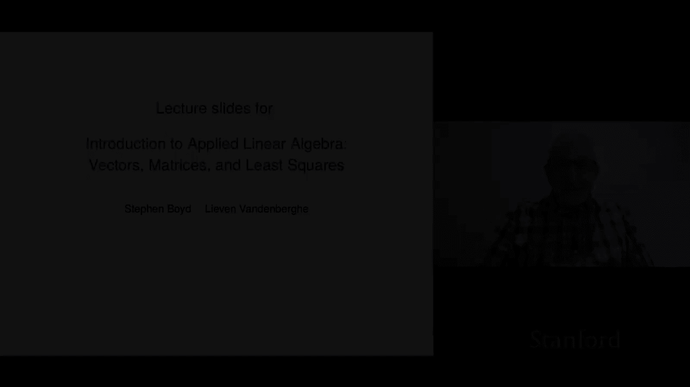
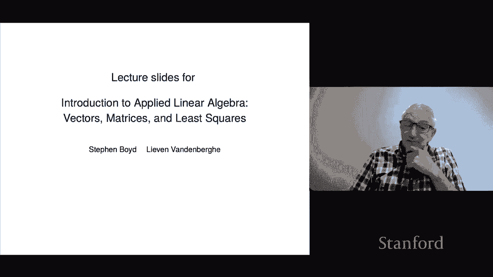

# P1：L1.1- 课程介绍 - ShowMeAI - BV17h411W7bk

はい。

I'm Stephen Boyd， I'm one of the co-authors of the book Introuction to Applied Linear Algebra Ves matrices and Le Squares。

 I teach the course engineeringering 108 ENGR 108 at Stanford Le Vananderbergt。

 my coauthor also teaches a course EE133 at UCLA。So these are the these are the the these lectures are going to follow the slides。

 which in turn followed the book very closely so that's and before we jump into the details i'm just going to spend a couple minutes right now and talk about how you might。

Use the material you know how you might use these lectures and the book and other stuff。

 so I'll say a few things about that the first I should say is something about the prerequisites about what what you need to know to do this course or for that matter to read the book and get get the most out of it actually very little so we will use a little bit of calculus a few times in the course。

 but to be honest it's it's not like it's that's that's a giant prerequisite。

Another one and I'll talk much more about this in a bit is you should have seen some simple programming in essentially any language I'll say a lot more about that you do not have to be like an expert programmer you don't have to take maybe a whole full course on computer science but you do have to know a little bit and I'll say more about that later okay so let me say about how I think you can use these resources so one resources to the book I should mention that the book is actually just available online you just go to Google or your favorite search engine you'll find it pretty quick the PDF file of the book ands that's courtesy of Cambridge University Press who were openminded enough to allow us to post the book online which I think is wonderful。

In fact， I even use the book online as well I have obviously hard copy。

 but I use it online too because there's links and you can jump from one place to another in search so just everyone should be aware the book is online also online you'll find these slides the slides that I'm going cover and eventually you're going to find these lectures as well are going to be online so post it for anybody in the world to watch okay so let me say a little bit about these the different resources and how I think what the best you know what might be a good way for you to learn so first of all the book is complete so you can read the book and you can read it like a conventional book in other words you could read a chapter and know whatever I mean it's readable I think so you could just read it and in fact that's that's a good thing to do you know so it may not be take it to the beach book but it you know maybe kind of of a windy and cold。

Afternoon reading book could be perfectly good for that just the book just read it turn the pages page to page。

And it's of course the most detailed， it's got pretty much everything is in there so you know that's where you'd want and we're very careful in our language in the book relatively careful。

The slides are well of course they are a condensation of the book so they are more terse in some ways there's there's something like the essence of the book now not everything is there so we don't carefully define every every notation and things like that in the slides but the ideas it's supposed to be at maybe a。

5000 foot level what the course looks like And finally。

 there are these lectures right and you might ask， you know。

 why would I listen to someone read the lectures I can read perfectly well myself that's true and so the lectures are even more informal than the slides。

 it's me and what you get in the lectures is gossip I might tell stories about various aspects。

 something like that Of course it' not it's not complete you know the lectures and you can't hold me to you know everything won't be perfect and I may not define I might not define everything and all that sort of stuff So that's sort of so how these three resources work for you I think that that's very personal depends on the person Some people like to read like a chapter at a time。

Then look at the slides， maybe watch the lecture， maybe the other way around。

 watch the lecture first， totally up to you， actually。

 honestly I think all of these methods these work。This brings me to something very， very important。

And that's this the material that we're going to be covering that we cover in the book is super interesting and it is super useful And in fact。

 one of one of the most important parts about it is that it's all actionable。 It's not just theory。

 I mean， it is theory。 There's beautiful theory that we're going that we're gonna look at but what the really cool part about it is you can do it is actually empowering and it enables you to do all sorts of crazy stuff you can fit models like in machine learning。

 we'll see other types of things you can do， we can do signal processing where you can extract a signal from a noisy signal you can you can do all sorts of stuff you can model you can model epidemics。

 for example， using some of the material that we're going look at in the course So you can do a whole lot of stuff and it's very important in my opinion。

 it's a very important that you follow along the book and the course。

Doing numerical exercises in some computer language and even if that's not your interest even if your interest is just to learn the theory。

 let's say this helps enormously because it will actually just it'll help you go over in a different way and understand in a different way the topics we're talking about so you know if I show you an identity you know an equation that is supposed to always hold don't believe me just go to your favorite computer program type in you know type in something on the type in the left hand side。

 type in the right hand side they should agree or be very very close numerically right so this is it's really great that I would strongly recommend even though it's not necessary you can read the book from cover to cover and we actually mention in the book no specific computer language and I think you could actually I mean it'd be fine that would be treating it as a conventional math book but I think you'd really be wasting。

Important opportunity here， which is that the material of this course is actually actionable。

 you can actually do it， or I like to say this linear algebra should not be a spectator sport so。

Jump in there， get your hands dirty， fire up one of these tools and follow along that way。

 I think that that'll help a lot。I should add， that's going to be super important when you。

 you know if you end up doing a summer internship or something like that where you use these things。

It's one thing to know the material in this book it's quite another to be able to sit down and actually do something with it which is very very cool so let me say a little bit about languages so at the Stanford course we we happen to use Julia thats that's a relatively new language and you the reason is it works super well but it's also it's the one that maybe has the notation that is kind of closest two hours。

Another one that is an option is MATLb now that's proprietary， meaning that you'd have to pay for it。

 but it is a perfectly good option to follow along with the ideas in this course and the last another option is Python Python's an interesting option and I do know that some people are teaching this course teaching a course based on the book and they're using Python and it's actually a perfectly good choice and the reason is that。

Most people these days are using Python to do the kinds of stuff that you're going to learn about in this course。

 so in some sense it makes sense for you to start off with with the language that you'd actually use your internship or your job or your startup。

 so that would be the argument behind Python my only reason for not selecting Python in my own course is that the syntax is a little bit clunky and it deviates a little bit from the mathematical syntax。

 not in a terribly horrible way， but it just seemed to me that Julia the Julia language syntax fit the ideas just a little bit better。

 but anyway， overall though I would strongly urge you to follow along this course with doing some numerical examples。

Now the book itself does not refer or refers only a few times to computation。

 it does describe a little bit about computation， but we don't mention any specific computer language in the book there will be a few there are a few exercise in the book where we say go ahead and check us out see if you really believe this or evaluate this two different ways or something like that so we haves that we certainly have but。

With the you'll also find some kind of you know real worldishh examples and if you go to the website for the book。

 it's going to point to a set of exercises called additional exercises and these are dynamically updated each year and those exercises unlike the exercises of the book those actually include problems with real data so'll even you'll find it at the website you'll find a bunch of data files and you can do some you can do some finance some portfolio construction。

 you can do tomography and things like that you can fit some models make a prediction or something like that and I think that's an important part of the course。

Okay， well， I guess that finishes up this preliminary and what we'll do next is we're just going to jump right in。

