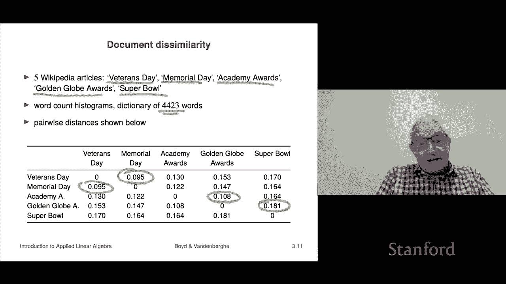

# P10：L3.2- 距离度量 - ShowMeAI - BV17h411W7bk

Now we're going to talk about distance， distance between two vectors。

 that's a concept that comes immediately from the idea of norm which is roughly the length of a vector。

Okay。So if I have two vectors， let's suppose these are two vectors or three vectors right then the Euclidean distance between the if A and B represent two positions is simply the norm of a minus B and so some people would write that this way So disk is the distance function says the distance between A and B is the norm of a minus B And you know the picture might be this that that's the point A that's the position B in this case B minus a。

Is the vector shown by the blue arrow， which in this case is two comma1 if we believe if the units on that grid are units and then the distance between A and B within B b minus a that's the same of course as a minus B at the same thing so that's the distance between two vectors and it agrees with the ordinary distance you know that you learned about in your algebra class you know certainly for dimensions12 and 3 it's the same。

Sometimes people also will look at the RMS deviation between A and B so that's the but it's it's just the distance divided by square root and okay so so you automatically get distance now what's new here is though we can now talk about the distance between 100 vectors namely vectors with dimension 100 that's interesting you can't visualize that now you can pretend to visualize that you can claim know in front of your friends that you can say well I can visualize there's one vector and there's the other and the distance between them is 12 I told you I can see it but no one can visualize 100 dimensions so that doesn't really make any sense okay。

Now we can get to the triangle inequality and I can I can explain how it got its name so here's how it works think of three positions A B and C these are all three vectors Now the edge length and I've drawn that down here so here's A B and C Now what we're going to do is the edge lengths are well the edge between A and B has length norm a minus B the length between B and C is norm B minus C for example。

And the length between the distance between A and C。

 the length of this triangle side is norm a minus C and so we're going to apply the triangle inequality。

 The triangle inequality says that the sum of two vectors So first of all I've just I've added B and subtracted B going from this equation to this equation so nothing's changed so I have an equal sign here and now what I'm doing is I'm using the triangle inality。

 triangle inequality says that the norm of a sum is less than equal to the sum of the norms so here I have norm of a minus B norm B minus c and what it says is I mean it goes way back goes to euclid I guess and basically says the following it says that that the length of any side of a triangle is less than or equal to the sum of the other two lengths Sos that's what it says so that's why this is called the triangle inequality the original the inequality for norms。

Now I'm just as a teaser， we're going to talk about some very interesting ideas that even the norm is a very simple concept。

 you can actually already see that it's going to there is hints that it could get super duper useful so let I'll talk about the concept of a nearest neighbor so if you have two feature vectors for example。

Then the norm of the difference which is the distance between them that's called the feature distance and so what that says is you could talk about feature you can you have the concept of two features two feature vectors being close or two being very far away so I mean if we go back to that very simple example in of regression we had the house area as the first component and the second was the number of bedrooms and so。

Two houses that are close would have probably the same number of bedrooms and similar number of thousands of square feet right so that would be in that case the feature distance would be small。

 but a a one bedroom you know，900 square foot house right would not would have a large feature distance to a six bedroom 5000 square foot house right so that that's kind of the idea So we all a sudden we have the distance now。

That's not a geometric notion of distance， right？So that's the that's the that's the idea okay so this brings us to this idea of a nearest neighbor it's something you will hear about in other courses for sure maybe we'll say something about it too later but let's see so here if I have a list of vectors。

嗯。Then Zj， one of these vectors is， and then have another vector X。

Like a query vector then what it will say is that among this list of vectors。

 the one that is closest to x we're going to call the nearest neighbor makes perfect sense right so here's x in this picture and here's my z's you can see the six of them and the distance between x and the z's I mean the farthest one maybe is Z1 right so that's the farthest distance intermediate know intermediate there's various intermediate distances but it looks like the winner is z3 here so you would say that Z3 in this in this tiny baby example here Z3 is the nearest neighbor of X。

Among Z1 dot dot dot Z6 Okay so and it makes perfect sense， I mean。

 you're basically saying of this list of vectors， which is x closest to Okay。

 so now you might ask like who cares， but actually immediately this is a powerful concept in in sort of very basic machine learning and data analysis。

 it's already very powerful concept， I mean， even though it looks very innocent。

Let's look at an example， which hopefully will give you a rough idea of some cool stuff here。

So what we're going to do is we're going to look at feature vectors which are word count histograms okay so what we did is we took some Wikipedia articles here。

 I guess there's five of them， and we have a dictionary of 4 four and a half thousand words。

That's all okay And then what we're gonna to do is we're going to take for each of these five Wikipedia articles。

 we take the entire article and we count the number of words in our dictionary that appears in each of those so I don't know what the first entry in my dictionary is but I guarantee you that for these I have five vectors corresponding these Wikipedia pages right and the first entry tells you how many times that first dictionary word appeared in those five articles okay so that's it now yeah don't even try to visualize what a vector in with 44 or 23 dimensions is because you can't you can pretend you can and you can in fact if you like you can sort of pretend that it looks like that okay but I mean I guess it does look like that just in 4423 dimensions okay。

So let's take a look at what happens now， we're going to calculate the pairwise distances of all six。

 five of these Wikipedia pages okay。And and all all we want to do is to see kind see if it makes sense。

 Okay well， the first one is the diagonal is easy because Veterans Day has a vector associated with it so does and if I say what's the distance between a vector in itself it's  zero It's the norm of0 minus0 So it's  zero。

 So the diagonals are all  zero right Oh by the way。

 it's also this is symmetric in the sense that the distance between Veters Day and Memorial Day which is 0。

095 is actually the same as the distance between Memorial Day and Veans day So I mean。

 of course right so by the way， in some people when they give a table like this。

 they just omit the bottom half of the table because you don't need to see it because it's the same as the top half Okay all right so now let's dive a little bit deeper。

And let's ask ourselves some questions like among these five。Vectctorors。

 which two are the closest to each other？and if we just scan across all this。

 it is indeed Veterans Day Memorial Day。Okay， and then you'd ask。

That'sDoes that make sense and the answer is。Yeah， yeah Veterans Day and Memorials Day are both Wikipedia pages describing holidays so they are actually related in fact they're more closely related than any of the others right we can also ask what would be the second closest pair and look at that it would be in fact the Academy Awards and the Golden Globe Awards。

So by the way， when I say closest I mean the ones that are not the same right that's kind of amazing because it says that just among these five things the two that are closest are the two that are the two pages that describe that the two pages that describe holidays right the next two are ones that describe two different kinds of entertainment awards right so something is happening and you can kind of imagine why you know like I don't know the the word holiday probably appears in veterans and memorial or something like that but but not in the super well okay not in the Golden Glo Awards something right okay so it's actually kind of interesting so we could ask all sorts of stuff here right have。

We could say what are the most。 What was's the farthest distance and the farthest distance， I guess。

 is going to be this， the Golden Gbe Awards and the。And the Super Bowl， okay， well， yeah。

 those seem pretty far apart。Let me just say a couple things about this because you can already do some pretty cool stuff instead of doing it with five pathetic articles like this。

 we could do something like this， we could actually we could do this for 5000 articles and you could have a new article that you've never seen before and you could ask。

What is its nearest neighbor？Actually， a very common thing to do is give me the three nearest neighbors。

 Those would be the the one that's closest， the second closest and the third closest。

 So these are these are kind of things。 Now what's stunning about this is how something so profoundly stupid has actually quote figured out that。

 for example， Memorial Day and Veterans Day are related。 Now， let me remind you how dumb this is。

We've taken the Wikipedia page。Two Wikipedia pages。

 and we have simply counted the number of words in the page。

That obviously we have obscured all meaning therere no longer sentences。

 there are no longer paragraphs。 It just tells you how many times each word occurred I mean that's all it is it's just really pretty simple it doesn't understand English。

 it doesn't understand anything at all it's simply counts the words and when you do that it's kind of cool that stuff comes up that you recognize like it figured out that these two things are close right so so we'll talk we'll come back to this kind of stuff later in greater detail but this should just give you a little hint that even though the concepts we' working with are embarrassed are actually really very simple it's just the distance between two feature vectors it's already interesting。

I give you a couple of examples。Someone comes into an ER I take their I take their feature vector it's a feature。

 but you know let't say it's 100 long with different things and symptoms。

 attributes of the patient all sorts of other stuff Okay。

 so I take that test they've had results so I take that1 hundred vector1 thousand vector doesn't that I take a0 thousand vector and I take that and I run it against all the patients we saw in the last five years Okay that's a whole bunch of each one has a feature vector。

And then I say， give me the 10 nearest neighbors， that means show me the patient。From the past。

 you know five years who had a feature vector closest to my patient， the second closest and so on。

 Now the closest one is interesting。What we can do then is we can actually do immediately。

 you can think of cool stuff you can do。 You could pull up that file and take a look at it and say。

 oh oh not cool。 oh boy that that patient developeds sepsis on day two。

 that's really bad So maybe we better put this one on prophylactic antibiotics right now or something like that So the point is it's already like pretty cool that you can already see just with a concept of feature vector and distance。

 you can already see you should be able to see that this practical application is like coming up right I mean。

 give you a perfect example somebody says you know go by me a bond I want this bond It's gonna to be issued by this issue where blah。

 blah blah， blah and you're like there aren't any for sale。

And you go then what this would do would say I would make a feature vector for bonds and this would someone would say。

 okay， in that case， go get me a similar bond and sure enough you will find a similar bond that is for sale and you'll buy it right and so and actually a lot of things work kind of bond just just stuff like this。

