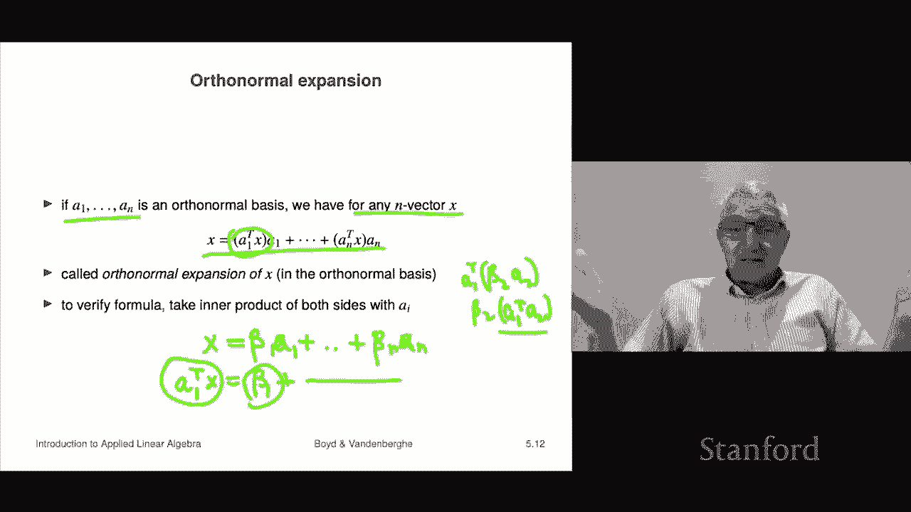

# P15：L5.1- 线性无关 - ShowMeAI - BV17h411W7bk

This is chapter5 it's on the concept of linear independence I should say it's a little bit abstract and not that interesting at least yet on the good on the positive side I would say this actually in this book。

There is actually only one mathematical concept。 And this is it。 So the good news is。

You're going to see this， this is going to be linear independence is going to be your friend for the rest of the book and actually hopefully later it'll become clear what its importance is。

 but for right now just consider this a first description of the topic so linear independence。

So we'll first describe what it means to be linearly independent。

 and then we'll talk about a related concept， a very important concept called a basis。So。

A set of n vectors， so here I'm using set notation that's what those curly brackets mean and this says we have a1 up to aK。

And it's called a set is called linearly dependent。If。

There is a linear combination of the vectors that gives you zero Now， of course。

 you can always make a linear combination of the vectors to be0。 if you take the coefficients betas。

 all the betas to be 0， that doesn't count。 So it has to be a non zeroro set of coefficients。

 that means at least one of them is non-zero。 That's what we mean here。

 So and that's you can show that that's exactly the same thing as saying that one。

 if they're dependent， if a set of vectors is dependent。

 it says that one of them is a linear combination of the others， right， And so in many contexts。

 we'll see that。Something being a linear combination of the others means somehow it's redundant。

 Okay so that's that would be the concept。 And so if a set of vectors is dependent。

 it means it's like redundant because at least one of them。

 you could express as a linear combination of the others。 Of course that depends on the application。

 but that's the idea。 Okay and the way now the correct way to say it is the set of and vectors is linearly dependent right because a set is in English。

s it's not plural， it's singular。 And so you say it is linearly dependent Now people get sloppy and not that sloppy to be tell you tell you the truth。

 This is just standard sort of mathematical convention。

 but what people do is they say a1 through aK linearly dependent and you have to be very careful because that's just that's just the way people say it and。

It's technically not quite right Okay， that's fine。 So let's look at some examples。 Well。

 if I have a set that consists of a single vector， oh， by the way。

 doesn't hurt you to know this a set with one element is called a singleton So that's this is a set of vectors there's only one and it's a1 So when is that linearly dependent Well。

 the question is when can I make a linear combination of one entry0 with a non0 coefficient well。

 that's only if a1 is0 in which case I can take any beta I like here's one beta beta1 in that case equals2 there Okay so two times 00 Okay so basically for a singleton for a single vector linear linear dependence is like being0 so okay。

If I have two linearly if theyre linearly dependent so the set with two entries a1 and a2 is linearly dependent only if one of them is a multiple of the other okay and so that means actually they lie on the same line roughly speaking okay so that's what that means now for more than two vectors there's no simple to state condition right like I can't tell you that for four vectors they're dependent if blah。

 blah blah it's complicated we will see later an algorithm that will take a set of vectors and will。

Process them and tell you in the end if they're linearly dependent or not so we'll be able to to check that。

 but it's a computational thing it's not something you can do Okay by just looking at it I mean it depends okay。

So let's look at some examples。There's three， three vectors， A1， A2 and A3。

And it turns out in this case， here's a linear combination with non zero coefficients。

 the coefficients are 1，2 and minus3， and you can check that a1 plus 2 a2 minus3。

 a30 there so that means。These vectors are linearly dependent， right， or to say it very precisely。

 this set of three vectors is linearly dependent。 Okay。

 and what this says is you can express in this case。

 you can express any of these vectors as a linear combination of the others。 So for example。

 let's express a2 as a linear combination of a1 and a3。 Well。

 here a2 what I do is I take this equation this equation， and I put a3 and a1 on the other side。

 and I divide by2， and I get this expression here right So in this case。

 I can also express a a1 as a linear combination of a2 and a3。

 and I can express a3 as a linear combination of a1 and a2 so so that's what it means it simply means these are dependent and one of the vectors in this case all three can be expressed as linear combinations of the others。

Now in some applications a linear dependence you has a meaning。

 and it also may have a different name， so for example， if you have cash flows。

 if your vectors represent cash flows of investments or something like that or some kind of investment or you know it could be a loan or bond payment。

 it doesn't matter。A mortgagetg so these are these are cash flows and there when when one one of those cash flows is a linear combination of the others in finance people would say you have replicated that cash flow I don't remember if you remember like a very long time ago we looked at you can replicate a you know a two period loan you know as a you can represent as a linear combination of two one period loans so then you would say that you have replicated that the two period loan cash flow okay so so in different in different in different areas。

Specific applications there'll be other names for linear dependence okay so but right now I should also just fully admit that this should look abstract weird and utterly uninteresting to you if that's what you're thinking right now then that's fully justified so hopefully that won't be the case in a couple of weeks or certainly by the time we've finished the book this should be this should be natural to you and stuff like that。

 but for now now you you're looking at this and saying like。ho could care less。

 and all I want to say is that's a perfectly good question。O。

Now if if a set of vectors is not linearly dependent。

 they are linearly independent so and that that's actually the concept we really need is linear independence and so a set of n vectors here is linearly independent if it's not linearly dependent and so what that means is this it says one way to say it is this it says that if you have a linear combination of those vectors and you get zero。

So if you can make zero with a linear combination， the only way to do that is if all the betas are zero。

 right？For any vectors at all， if I make a linear combination with all zero coefficients， I get zero。

 so I can always make a linear combination zero， I just take how the base be0。

Qu is whether or not I can do it with nonzero coefficients and so and that says that if the set of vectors is linearly independent。

 I can't do it， the only way to have a linear combination come up to zero is that all the coefficients are zero。

Okay， and again here people say， you know， the vectors are linearly independent instead of the set of vectors is linearly independent but by the way。

 if you're around fancy mathematicians and if you。Are being careful and you say this set of vectors is linearly independent。

 they'll smile。They're not they're not that emotive， but anyway。

 I'm just saying that your status will go up， maybe you won't you won't be able to tell but it will go up okay。

 all right。And basically that says that not one of these vectors can be represented as a linear combination of the other so that's another way to say it so here's an examples the let's take the unit the end unit end vectors。

 they are linearly independent。How do you know that， Well。

 ask yourself if I had a linear combination of the unit vectors and it was zero。

 but then you can quickly figure out all the coefficients have to be zero and that's what it means to be linearly independent。

Okay。This will be the first hint that this might be a useful concept it's quite interesting here it is。

 suppose you have a vector x and suppose I tell you it is a linear combination of some vectors A1 through AK and let's suppose those vectors or that set of vectors to say it precisely is linearly independent。

So that means that x is beta 1 a1 plus up to beta K ak。Okay。

 that's what it means to be a linear combination。So here's what's cool about it in this case the way you'd say it in math is you'd say the coefficients beta 1 up to beta K are unique。

And that's what that means is this if x suppose x had a representation as a different representation。

 so here I've written x as a linear combination with a set of coefficients gamma1 up through gamma K then what we're saying is if that's true the only way that's true is that gamma1 is beta 1 gamma2 is beta2 and gamma K is beta K So what it's cool what this means is that we don't know how to do it yet but we will later。

 but it says that in principle you can deduce the coefficients from the vector so I'll say this this is weird but it says you can actually decompose have if x is a linear combination of some linearly independent vectors。

I can actually I can actually discover the in principle I can discover those coefficients there's only one way to do it that's actually super interesting and later in the class' get you'll see exactly how to do that but for now we're just and all you need is the concept of linear independence to argue that you can do this okay now why would that be well suppose？

X has that expansion， it's a linear combination with the bettas。

 but it's also a linear combination with the gammas。

So what I'm going to do is I am going to subtract this from that and here's what I'm going to get。

 I'm going to get beta1 minus gamma1 times a1 up to this and that's going to be zero because the right hand side is going to be x minus x this is zero over here okay now you look at this and you realize like wow。

 this is a linear this is a linear combination of a1 up to ak the coefficients or beta 1 minus gamma1 up to beta k minus gamma K and you get zero。

But if they're linearly independent， what it says is if you have a linear combination that gets you zero。

Then all the coefficients have to be zero and that means that all of these numbers。

 beta 1 minus gamma1 all the way up to beta k minus gamma K， they're all zero。

 and that just means that the betas are the gammas okay so that's called it has a unique representation as as a linear combination。

Okay， or another way to say it is in principle， if something is a linear combination。

 there's only one way it's a linear combination， not only that。

 but we can actually deduce what those coefficients are in principle。

 we don't know a way to do it yet， but we will later。

Okay this leads us to something that's a super important concept again for now it's abstract but we're going to be using these things throughout the rest of the book so as well get used to it just consider this your first your introduction so and it's a concept of basis so。

We start with a very well， okay， some people call it fundamental Some people actually call it the fundamental theorem of linear algebra or something I don't that's overblown it is and it's not even that hard to show if you look in the book I'm not going to show but if you look in the book as like a two thirds or half a page proof of this but much less important than the proof is actually just what it says and here's what it says it's very simple it says if you have a linearly independent set of n vectors。

You can have it most end。Of them， another way to say it is this。

If you have n plus1 or more N vectors。They are linearly dependent， Okay， so that's。

And you know even it's not obvious， but it's actually kind of true。

 it's interesting right so it says that if I have 12， 10 vectors。

Then I absolutely guarantee you one of those， at least one I can write as a linear combination of the others。

Okay， so or I could say they are linearly dependent， okay？

That's that that's how that works and it's actually kind of kind of interesting right so okay。

 so that that's that's it and that's that's called the independence dimension inequality right because basically it says that。

A set of linearly independent vectors has us if they're n vectors。

 that set can never be bigger can never have more than n elements in it。That's what it means， okay。

 so right now this is totally abstract， but that's okay。ok。

Now this gets us to basis if I have a set of n linearly independent n vectors that's a1 through A1 that's called a basis this is like completely universal standard mathematical notation okay so what it says then is any n vector。

 say B can be expressed as a linear combination of them。Okay。

 for some beta1 up to beta n and not only that， but those coefficients are unique。

 there's no other way you can do that that follows from linear independence。Now。

 this formula here in that context， when A1 up to AN is a basis。

 that's called the expansion of B in the A1 dot dot dot AN basis。Okay。

 so I mean expansion K kind of makes sense that you were taking B here and we're kind of writing it as a linear combination and the old world 19th century term for that is it the expansion in the AI basis。

Here's an example。 I mean， this is completely pedantic and silly because it's completely obvious。

 but here's an example。 E1 up to E， those are the standard unit vectors That's a basis。

 And here's the expansion of a vector in the unit vector basis。 I mean this is silly。

 It says it says B is B1 E1 plus up to B and E。 Well we already know that n plus is completely obvious right。

 so but it's just an just an example of a basis and an expansion in a basis。Okay。

 next topic is orthoormal vectors， we'll talk about that's also going to play a big role in actually the rest of the material in the book and we'll say what they are。

So a set of vectors a1 through aK are said to be mutually orthogonal or just orthogonal if any pair of them that has to be distinct right are orthogonal right so this says that AI that if you recall that little this little symbol here。

 which is by the way sometimes read in English as perp for perpendicular this says that AI is perpendicular to AJ and remember that's a that's another that's one of the ways we say orthogonal and of course all this means is it the inner product of AI。

And AJ is zero that's that's all that means so that's what it means a set of vectors is called normalized if they have linked one right so just means they're normalized they're not like some of them are big and some are small they're all the same size in fact specifically size one okay then they're called normalized and a set of vectors is called ortho normalmal if both hold。

So what that means is two things， it means that any pair any pair of them。

 any distinct pair right you can't have I I equal to j any distinct pair of the vectors has an angle of 90 degrees that's number one that' they're orthogonal and number two each of those each of vector has a norm or length of one okay so that's orthoormal and you can write that just in terms of the inner products what it says is a set of vectors is orthoormal if the following is true if I take an inner product of the I vector with the J vector I get。

Either one， if I equals J， because the inner product of a vector with itself is its norm squared。

 and if it's normalized， that's one squared， which is one。On the other hand。

 if I is not equal to J AI， the inner product of AI and AJ is zero and that expresses the fact that they are orthogonal okay so what it is it's a way to say that the inner products between the entries you know have very simple and very specific they are very specific and simple numbers。

 okay？Now we're going to see later that orthoormal sets of vectors are linearly independent and that's a quick calculation we're going to see much more about it later。

 in fact what we're going to find out is you can actually get the coefficient you can actually say what the coefficients are in an expansion and obviously by the independence dimension inequality you can't have more than n orthoormal n vectors you can't have n but you can't have more and when k is equal to n so I have n and vectors and they are orthonormal they're called an orthoormal basis that's the idea and this is very very common across lots of fields of applied mathematics and other areas。

Okay， so let's look at some examples well we've already seen this the standard unit vectors they have norm one all each one has norm one because the norm square sum of the squares the entries of each of these is one because all entries are zero one is one square1 okay you get it so they all have norm one they're normalized and they're also orthogonal if I take any two unit vectors for different I andJ then in a product of EI and Ej is zero because the ones are in the different positions and everything else is zero okay。

Here's an example of an orthoormal basis for three dimensional vectors。

 and here they are the first vector is 00 minus1， it's normalized。

 the second one is one over squared2，110。Okay， let's check。

 let's get let's take the norm of that in our head or let's take this。

 So you put the one over square root two inside right and you square it So the first you square the first entry is gonna be a half half0 add up to some of the squares。

 you get one take the square root of that you get one so it's also normalized and here's our third one。

 It looks like that Okay， and you can also check it is normalized。

 let's check let's just audit a few inner products just for fun。 Well。

 let's do the inner product of this guy。Andhan that one。Well。

 what you can see is when you take the pairwise products this is zero here so that first entry is zero then that's zero and that's zero so it's zero How about these two these two here let's do that well I multiply this one on this one and I get one if you like we could add the one over square two so I would get a half okay in the first entry and the next one I get minus a half and then the last one I get zero and I add these up and I get zero。

And so they are orthogonal， these two vectors are orthogonal。嗯。

Visually heres here is here's two two vectors and they are ortho orormal。

 I mean I assume I'm assuming here the length of that is one and the length of that is one but that's what it means it means they both have length one and that's the origin and they have 90 degree angle between them so this is what an ortho orormal basis looks like okay it's easy to you can also visualize north orormal basis in three dimensions you cannot visualize it in 10 dimensions right you can pretend you you can pretend to but you line basically so know if you're around people who don't know anymore。

 you can actually like and press them incredibly you just say well look you know what this looks like here this two orthoormal things。

 three things you know you can make a little hand document hand thing and kind of get your fingers in the approximately orthoormal and and then you can say okay well the same thing only just in 10 dimensions that's not that hard anyway of course people can。

It can't really visualize that。This brings us to the concept of an orthoormal expansion。

 So suppose I have an orthonormal basis， A1 through A。 Then it says the following。

 we have for any n vector X， I can write it this way。 Now。

 we knew because it was a basis we can write it as a linear combination of A1 through AN。

 We knew that。 but now we're going to be super specific about what the coefficients are。 they are。

 in fact， the inner product of A1 and x。 all the way up to the inner product of A and X。 So this。

 this is what we call the orthonormal expansion of x。 you know， in some orthonormal basis。 Okay， now。

 if you want to check this formula Let's do the following。 Let's just take the let's just write。

 We know that x must have the form。Because it's a basis， it's got to have the form。

Like that looks like this of。Like that， okay， so we know it's a oh god。

 what have I done Okay here we go， there's a， those are A's。

My mistake Okay so so we know that because because it's a basis any vector x is a linear combination。

 but we don't know the coefficients beta beta pi okay so let's take the inner product of left and right hand size of this equality with let's say a1 and it's going to be similar for the others so on the left I get the inner product of a1 and x and on the left I get the inner product of beta 1 a1 and a1。

That's beta 1 times the inner product of A1 and A1。But these are ortho a normal， so that's one。ok。没有。

How about the inner product of a1 and the second term which is2 beta2 a2 well that's beta2 if I take the inner product like that。

 that's I can put this inside and I get a1， the inner product of a1 and A2 like that。

This is zero by normality sorry by orthogonality right so that's zero and so all the other terms here a0 and you just get beta so it says a1 transpose x is beta one right so that tells us that beta1 is a1 transpose X So that's the calculation it's pretty pretty simple again。

 at the moment this should be completely abstract and weird。

 I mean you may have seen in another class you know I don't know the context right but you may have seen this in another class but if you haven't and this looks like it's weird and abstract and has no particular interest to you that's a perfectly normal feeling to have。

