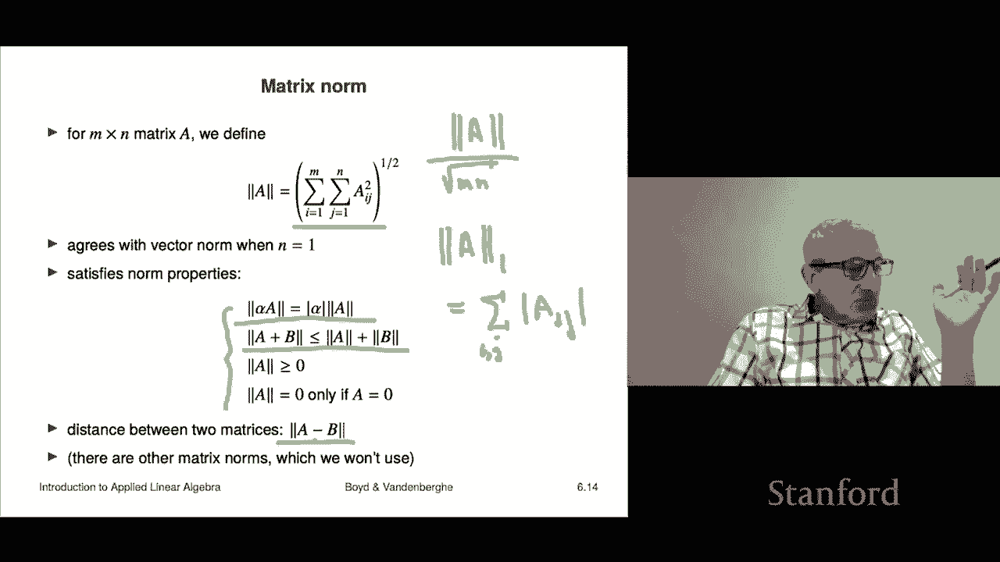

# P17：L6.1- 矩阵标记与表示 - ShowMeAI - BV17h411W7bk

We're now starting part two of the book which is on matrices， the first part was on vectors。

 the third part will be on lease squares， these are the components of the subtitle of the book Okay。

 so now we're going to talk about matrices and we'll start with just first just the basic notation and nomenclature first。

Okay。So a matrix is it's a rectangular array of numbers written between square brackets。

 Now some people also use curved brackets， so that's a variation that you will see sometimes So this is what a matrix is it's a square array and we talk about its size or its dimensions and its dimensions are given by the number of rows by the number of columns。

 So for example， this matrix right here has three rows and four columns So we call that matrix of three by four matrix。

 So' that's how you would refer to this it's a three by four matrix。

Now the entries of a matrix these are the numbers inside inside the array are these are called entries coefficients or elements of the matrix right and you refer to them by their row and column index so the row index is one for this the top row of numbers it's two here and it's like three here and the column index is like one here。

 you know two， three， four that kind of thing that's how that works Oh I should mention that the indexes start at one。

That's an important distinction because in some computer languages indexes start at zero so but in standard mathematical notation indexes for matrices for vectors and matrices。

 they're indexed starting from one that's something to remember okay。

 so if we refer to this matrix up here as B。Then B IJ refers to the IJ element I is almost always reserved for row and J for column。

 but that's just that's again， just a that's just a convention and you'd say that B IJ。

 so for example， in this matrix if this is B， then I could ask what is B23。

Well let's take a look the two is the that's the row index okay and the second is the column index so we go to the second column and the third row and we get this number right here and so this is minus 0。

1 there you go so that is that is the you'd call that the 23 entry of B is minus 0。01。

Okay now like vectors we we have a equality between matrices and we overload the symbols so there's no special symbol for saying two matrices are equal to the same old equals and here's what it means for two matrices to be equal first of all number one they must have the same size that's the first part and second of all。

 the corresponding entries must be the same right so just like a vector。Okay。

 now matrices are classified according to their shapes if you have an M by n matrix A。

 and that means that if you know a has if here's a， it means that it's got M rows and n columns。

So this is a our matrix， I haven't written out the entries。

 but I'm just showing you the the number of rows and columns。Okay。

 now the matrix is called tall if it has more rows than columns and it's kind of obvious Y it means that if the entries were you know took a constant width。

 then it would actually be physically a tall the symbol the way we describe the matrix right down would be taller it's wide if there are more columns than there are rows and it's square if there's an equal number of columns and rows。

 so I think these are pretty well these are pretty well standard standard terms。

 anyone would any anybody in math or applied math or any any associated field like that would understand these terms so they have square。

 tall and wide。Now， in fact， you vectors are actually special cases of matrices so let's see how that comes about so we're going to consider an n by one matrix to be an n vector an n vice versa so if I show you an n vector you can think of it as an n by one matrix n by one matrix means it simply has a single column that's all so for example if I write two minus one like that and you say what's that you could say well it's a two vector it is it's also a two by one matrix because it's got two rows and one column and we'll see that that doesn't that's not going to cause any harm we'll talk about that later now even more extreme is a one by one matrix we consider to be just a number that's the same as you a one vector is just a number we don't distinguish so we don't really distinguish for example between this right the one vector with so entry minus3。

Number minus three， we just we don't distinguish okay。

Now you might ask what is a one by n matrix so that's a super interesting thing it looks like this right so I have square brackets and I have the numbers but they're in a row not a column right so this is a column vector and by the way we also write it the alternative notation is with comm。

Right。Right， something like this， okay？And so in this book and course we're going to be very very。

 very strict about notation right so you know that's a column vector you can write it this way or you can write it that way this is a row vector there are no commas there are no semicolonons or anything like that。

We just that sort of is you can't put commas in here and say， oh， well， gee， why， you know。

 we're going to be very strict about notation。Having said that。

 I should say I'll give you another warning is that I very much hope that you are following along the material in this class programming or just fiddling around in some computer language。

 could be Julia， could be Python could be MATLb， well， it could be a lot of different things， right？

You should be aware that in all of these languages there is also there's a computer syntax for writing matrices and it's not exactly this so just be aware that you know you'll have to unfortunately keep two notation systems in your mind if you work with one computer language I mean honestly if you work with two computer you have to take it's like you know whatever speaking you know French and German you have to keep you have to keep the mathematical notation in mind and you have to keep the computer notation in line in mind and you have to have a little table that translates between here's how you express a column vector and a matrix and a row vector。

One very important thing is don't ever confuse these two notations right so if you're doing or writing math write math if you're programming don't write math besides your compiler or parser is not going to accept it okay。

 but just be aware that there are two syntaxes。I'm showing you here the synax the standard mathematical syntax Okay。

 so please keep them separate。 Oh one other thing I should say is that， you know， people， you know。

 once you know a lot and you get familiar with all these things。

 people do actually kind of don't distinguish between row and column vectors Okay well okay I'm going just go ahead and say this that's bad Okay。

 to not do that。 But nevertheless， a lot of people do that once you kind of know your way around for now and certainly for the entirety of this course and this book。

 we will not be casual like that， a wrote this vector， this thing is not the same as that。

 this thing is a four vector period， if someone's someone says column a row vector。

 you'd say it's a column vector， but the default for vector is a column vector。

This is a row vector and it's not it's not the same as a column vector like for example。

 if I asked you is this equal to that， the answer would be no and actually or it would be some worse thing like you know hey what are you doing you cannot you cannot ask me if a one by four matrix is equal to a four by one matrix doesn't even make sense right so it could be some instead of no it could be some kind of nasty like comment coming back like hey。

 you can't even there're an incomparable something like that okay。All right。

 so I just mention that here。Okay now if you have a matrix。

 we can actually talk about its columns in its rows and these are kind of obvious concepts。

 but let's let's and this is very simple， but we're going to see it's going to be very powerful ideas come from this so now suppose I have an M by n matrix and the entries are going to be capital AI J and that's for I going from one to M they M rows j going from one to n because it's n columns So the J column of it is this and what that means is I'm going to give you all the rows。

 so you can see a1 down to a that's the first index。

 the row index and the second index is always j because it refers to the column and so the J column is this which is that's an M vector because it gives you all the entries in that column the I row is a row vector and it's an n row vector and it's all the entries in the Ih row and so you can see here every one of these number the first。

The row index is always I and the second one goes from one to n。

 which is the width of the matrix Okay， so that's a row vector。

Now another concept that comes up is a slice and that's actually one of these concepts that actually originated in computer languages and then made it back made its way back into mathematics okay so and that's fine because they kind of go back and forth like that so here the colon notation P colon  Q means the integersq q plus 1 q plus2 dot dot dot up to Q okay so that's what that means so it's an index range I should add you know in programming languages you have more sophisticated things like you can say P colon2 colon you know Q in a computer language and that means it means p p plus2 p plus4 and so on so the second one is called the stride and then until you get to Q or less than  Q or something like that。

Okay， that's this we don't use so so this is that's computer notation。

 but this we do use is is a so if this is please take the between the P and Q rows and the R to S columns and so what you get is exactly that that's a submatri of a is what it's called we'll get to that in a minute a submatri well we'll get to that。

Okay。Now block matrices is like block vectors you can assemble matrices together to make a bigger matrix or another way to say it is you can have a matrix whose entries are matrices that's a very interesting interpretation of it so let's see what that means here's a matrix A equals B DE Now if B DE were numbers you would say。

 well， that's a two by two matrix it is So what we do is we call these we're going to call these we're going to this is a block these are block matrices and we're going to call these submatrices or even literally you can even say the sub matrix entries of a Now there's some rules here right if you look at a row this is a block row B now。

For them to they have to have the same height otherwise they can't go together and that means they have to have the same height。

 which is the number of rows right so B and C have to have the same number of rows。In addition。

 like a column here's a column C stacked on top of E they have to have the same width and that means they have to have the same number of columns C and E so that's the rule so let's do a let's do an example here's B。

C， D and E， and a couple of things to mention is if you like。

 you could call be a row vector or a one by three matrix C。

 you could simply call the number minus one or you could call it a minus one。

Vectctor or the minus11 by one matrix， your choice and here's D that's a two by three matrix and E is a two vector。

 Or if you like a two by one matrix right so okay so we're going to form this block matrix B C D E and let's first check that the rules work So the height of B here is one right so you can see that here the height of C is one so we're good on the top row bottom row D E D the height of D D has two rows and E has two rows also so the second row has been audited from the dimension point of view now let's take the first column that's B stacked on top of D and so B is three wide it has three columns B columns are silly they're just numbers but it's got three columns B that's stacked on top of D and sure enough D has got three columns so that's cool。

The final one is C stacked on top of E， C has one column E does two we're cool， okay and。

It's a big drum roll。 It's not very exciting。 This is the matrix obtained with these block matrices。

 right so so that that's the idea。 and and I can I could even hear I'll even I'll even try to do this right and let's see。

 I think I got it right there we go， okay so I've partitioned it there。 by the way。

 sometimes when you have a block matrix， people will actually draw a a little dotted their dashed line inside the matrix to show you the submatrices that they want to show you。

 So here you can see there's B C。D and E and everything is cool Okay。

 so all languages for manipulating matrices have methods for constructing block matrices and by the way。

 and sort of the converse of that is to extract a sub matrixx and that slicing all all computer languages and packages or manipulating matrices will also have a mechanism and syntax for computing for extracting slices or submatrices of matrices。

😊，Okay， now if you have a matrix， it's M by N。嗯。We can actually write it as a block matrix where the blocks are actually just the columns so we can and this will do many。

 many times， so a is when I write it this way， notice that that that it looks like if the A1 through AN were numbers that would be an N row vector。

But here theyre actually columns oh also I should say that this matrix a could very well be tall。

 but visually when you write it down this way， it looks wide， but that's another story okay so here。

These so a1 here is the first column and they're M vectors because the height of a is it's M by n that means it has M rows。

 So each of these is an M vector a1 a2 a and in fact you sometimes in fact。

 a matrix is often often very sometimes it is just thought of as a sequence。

Of vectors of the same size， of course， right， So， and that's a very common use of a matrix。

 is's literally just to store a sequence of vectors。 We'll see examples shortly。 All right。

 now I can also take a matrix。 and I can decompose it as a block a block。

 this time I'm gonna to make them the row rows。 So here the rows。

 and I'm going to call them B1 through B Now these are row vectors。 So B1 has a dimension。

 which is1 by n。 So these are one and these are n row vectors。 the bes okay。

And we'll see several times it's surprising， but simply going back to this interpretation of what a matrix is is actually going to be quite useful in a lot of applications。

 we're going to see that。Okay， so let me just quickly give you some examples you're going to see a whole lot more before the book is over。

 but just to give you a rough idea of like you know where the matrices come up here's a natural one is in an image an image of course is chopped up into pixels and so here you know here's your image and this is a bit silly but heres' here's something which has two by three pixels now that's ridiculous because。

You know most images are you know hundreds of pixels vertical by hundreds horizontal or thousands these days right so you would never have an image that has you know two that has six pixels doesn't make any sense oh but technical this is what it looks like and then what you're doing here is you're simply giving the value in here this is a grayscale or monochroone image and so what that means is it might go from zero to one or a very common scaling now for historical reasons is zero to 255 so okay anyway so that's the idea is is a matrix could represent an image a monochone image。

Here's one from data， AIJ could be the rainfall in location I on dayJ。That's it。

 so I have I'm interested in 10 locations and let's say a year， so 365 days。

 then I would have a matrix which is 10 by 365 and that would give me the rainfall at my 10 locations so it's going to have a height of 10 and a width of 365。

 so it's going to give me one year of rainfall data at 10 locations。

And now what's interesting is whenever you see a matrix like this in some practical and you should ask yourself。

 I immediately， what do the rows and columns mean？And it's not a big deal。

 but it just means you should be thinking about it so let's see what this means in this case。

 so the let's talk about a column， let's look at the 17th column of this matrix a the rainfall matrix。

 what does it mean。Well， the column index。Indexes days in a year， if the first one is January 1t。

 then this is going to be January 17th so。The 17th column of this matrix of this rainfall matrix is a 10 vector。

 And what it does is it gives you the rainfall in my 10 locations on January 17。

That's it so so you might even call it a it's actually the rainfall in my 10 locations on a certain date Okay。

 let's look at the third row of this matrix Well that' that's a 365 row vector okay and the third row the meaning of that is it's the third location let's say that's Palo Alto so it's Palo Alto and then you get the row gives you the one year's worth of rainfall okay so that's what it means so a row vector a row of this matrix you can interpret as a time series of rainfall at a particular location which location depends on the row so that's the idea。

In Palo Alto， there'd be a lot of zeros in that， okay？Not so much in the rainforest。

 but in Palo Alto， that would be a sparse matrix， okay。

Here's a very common one is multiple asset returns so here I have a set of assets in fact the slang for that we'll talk about this later is called a universe of assets right so I would have let's say you know and assets or something like that and these could be stocks that you're going to invest in or the stocks that you might invest something like that and then we'd also have periods days so this could be I could index period which could be trading days which are like typically Monday to Friday something like that not counting holidays so you get about 250 in a year but that's the idea so there if I asked you for this matrix what is what is the meaning of a column it's super interesting here columns are indexing the columns are indexing the assets。

The row is indexing the time period or day if we make it a day， doesn't have to be a day。

 so for example， the third column of the matrix R is the time series of the return for the third asset。

Very interesting， you could plot it， it would make sense， you could look at it， all sorts of stuff。

 okay。Let's talk about rows， what is the fourth row of the matrix R， Well。

 the fourth row means that I is4。Throughout that row and that means it's on the fourth trading day。

 it gives me the returns of my entire universe that would be the slang of stocks right and it means that for all n stocks I give you the return right so that row might look like this you know let's make it minus 002。

03。Right and so on and what this would mean is the first asset on that that on that period had a negative 2% return。

 the second asset' that's here that's here had a plus3% positive return and so on that's the idea okay。

All right， here's a very common one and it comes up in data science， statistics， machine learning。

 and it's this。It's a feature matrix also just known as a data matrix and we'll say a little bit more about that and you'll see a whole lot of this later in the class。

 So here the idea is you use a matrix to store the value of a bunch of features for a whole bunch of entities entities have other names like samples examples or in specific context it could be you know a purchase or a customer or a student or something like that but in general is just an entity and so here X Ij is the value of feature I for entity J So in this case。

 all you're doing is you're writing you're thinking of a matrix in terms of its columns like this and it would go like that and these would be M that's M would be M vectors and X1 is the feature vector for item1 X2 is the feature vector for item2 and so on all of that is shoved together in what's called。

Feature matrix or a data matrix， so that's the idea that that's what this looks like。嗯。Again。

 I'll just show you some simple examples and then we're gonna to see a whole lot more later。

 So a graph or relation actually can be encoded as a matrix and that's often useful so a relation is I have let me tell you what a relation is I have a finite number of objects I'm going to call them one。

2，3 up to n by the way， they could have other names you know like CEOo CO， you know head of sales。

 I don't know this kind of stuff Okay so they don't but we're just going to call them one，2。

3 up to n okay and a relation is a set of ordered pairs among them so for example。

 this is you'll recognize that squiggly bracket as defining a set and the entries of a set are given between the brackets with comma between them so that's an entry of the set that's a second entry third oh I should mention。

Seets don't have an order， so I shouldn't have said the second entry。 Well。

 the second entry in our description of the set， but a set doesn't have an order to its entries to its elements。

 So here and and the entries are themselves pairs。 So here it' it's 1，2，1，3。

21 Okay and that'ss that's what that looks like。 and you know I could we can you know。

 it could this could be an asymmetric social network graph where one， two means one likes two there。

 one，3 means one also likes three，2，1 means well two likes one。 Okay， so it's mutual。 that's good。

 Okay and you get the idea。 So this is this is a type of thing a relation would would would encode。

Okay， these could be， for example， a bunch of web pages and the objects could be web pages and these could say this could say that web page。

 let's say two links to web page one， that's what it means it means that it's a link to okay for example。

 that's for example， okay now a lot of times people will write a relation as a as a or visualize it as a directed graph。

And a graph， if you haven't seen this before， I hope you'll see it again in other classes。

 but maybe you haven't but I'll and I'll be very informal here but a graph you think of the objects as these are called vertices or nodes it's just yeah it's vertices or nodes in a graph then the actual relations between here are denoted with an arrow and so here what we're doing is we're drawing an arrow so you draw an arrow if you have here let's look at one here's something it says four comma1 and we're interpreting that to mean that there's an arrow from one to four note it's kind of backwards you might think it would be four to one but we're going write it one to four by the way people use both definitions of that So every one of these blue arrows is one of these things here and we could just do an audit let's find three4 Well that represents something you know。

An arrow going from four to three and let's check it it's right here there you go's it's this one right here okay。

 that's the that's that one。Okay so this is the idea。

 of course this is very abstract now but when any application it's actually kind of well it'll actually be kind of interesting to see see it'll be more clear what all this means okay so the connection to matrices is this is we can write a graph or matrix we can write a graph as a matrix that's a very common way to describe it whose entry00 01 and what we do is we say AIj is0 if Ij is in the relation meaning if you have an edge from J to I in the graph we put a one there and so this relation and this graph and this matrix all describe the same relation or graph or matrix or whatever so and we can check here let's see what is what does that mean well that's the three4 entry and so that corresponds to this this element right here and it's a。

Oh and it's the same as this one that edge so this number this edge and that entry of the relation are all the same I mean they represent exactly the same thing let's check another one how about zero that is the four to entry of the matrix a so it's zero and that means there is no there is no edge from two to four right or it says at 42 they pair 42 does not appear in R and you can look here and you will see indeed4 two does not appear it visually in the graph it says that there is not an edge from four to2 let's see they get that right from two to four let's twist them around and indeed there is not an edge from two to four there is one from four to two but not two to four。

Okay， so this is just an example， so you know matrix can also represent a graph or relation and we'll see plenty of that in the SQL。

All right， I'm going mention some special matrices now this is you know not unlike the zero matrix the zeros vector。

 the ones vector，01 and unit vectors right so there's some analogs of that matrices and we'll just get that out of the way right now so if you have a matrix and all the entries are zero it's written as zero and sometimes you can put a subscript below it if you want to let somebody know what the size is right otherwise you just write it as zero so same way we write zero vector so this is highly overloaded notation it means that when you have zero it either means it could be the zero number could be the zero vector or it could be the zero matrix your job to find out which is meant so that's kind of the idea okay。

An identity matrix that's something that you don't there's no analog of that for vectors。

 Here's what it is。 It's a matrix。 It must be square number one。

 and then it's diagonal entries that's the entries here where the row and column index are equal they're one and the off diagonal entries。

 those are the those are the the entries where I is not equal to j are zero so this is an identity matrix an identity2 by two matrix and that's an identity4 by four matrix right and this is also just written as I that's pretty universal actually notation So if you just walk into the math department and say I okay but you may have to say something about the context is matrices and then there will be absolutely no no just everyone lies in what you're talking about just the identity matrix okay。

Now like vectors， we have a concept of a sparse matrix and a sparse matrix is one where a lot of entries are zero。

We've already seen to， here's the sparse matrix that could possibly be the zero matrix because all entries are zero the identity is sparse because you know only the diagonal out of n squared total entries。

 you only have n which are non zeroro and the ideas like vectors if you have a sparse matrix they can be stored more efficiently and they can be manipulated more efficiently now we haven't actually seen anything you can do with matrices yet。

 but we're going you and all of those operations can be done more efficiently when the matrix is sparse okay so this is these are just some quick ideas of matrices。

We have diagonal and triangular matrices right so again these are not things you don't have no analog of this for vectors right so a diagonal matrix is a square matrix for which AIj is zero for I equal to J and that means simply that if your rh and column index are different。

The entry is zero and so here's that's a diagonal matrix right there Okay。

 that's an example and you can see you know here are the the ones this is referred to as the diagonal with the matrix it's where I equals J and then these this is referred to these entries are part of the off diagonal and off diagonal just means I is not equal to J okay。

So we have a notation if you have dig of A1 through anN and these are numbers。

 then that's a diagonal matrix with those entries， so in that notation di of 0。2 minus minus31。

2 would be this three by three matrix okay so that's the di thing I should say that all computer languages for manipulating matrices have something that will affect this operator dig it allows you to construct a diagonal matrix。

Lower triangular matrix means that AIJ is0 of I is less than J and so a lower triangular matrix is going to look like this right it's going have it's going to have stuff on the diagonal and below but everything above the diagonal it's going to be zero okay so it's going to look like that Here's a here's a lower triangular matrix right there so that's lower triangular here's another lower triangular matrix zero。

I mean find it' lower triangular it's also upper triangular by the way。

 identity is lower triangular and upper triangular and in fact we can say the following if a matrix is lower triangular and upper triangular it's diagonal sos that's that's sort of the idea behind this so here's an upper triangular matrix as an example and here's a lower triangular one okay so yeah by the way not one bit of this should have any particular interest to you yet okay so I'm just admitting that right that we're just we're just talking about the nomenclature the plumbing you know we're going to talk about things like we'll see diagonal and triangular matrix is going to play an important role but for now this is just you're just learning the basics of you know how you refer to matrices and things like that。

Here's your first matrix operation that's not true we already had a couple had we can actually form blocks so we know how to stack matrices vertically and horizontally to create blocks but here's our second what is transpose very important concept and what it is is this I have an M by N matrix A and if I put this superscript with a T by the way。

 not an accident， that's the same T that we use in the inner product not only that if you will recall when we were talking about inner products I tried very hard but failed and several times instead of saying the inner product of A and B。

 I actually said a transpose B which is what it is but so just the notation I shouldn't have said it then because we had not yet had the concept of transpose。

 but now we have it henceforth I can refer to the inner product as well we'll get to that a transpose B so but just just to let you。

You've seen that notation before where it was completely mysterious and now it's not and you know what the t is now in our notation for an inner product this is a transpose Okay so it's this the transpose just swaps the row in columnss it does nothing else so here's an example here's a matrix it's 3 by2 it entry are 047031 if we transpose it you will see that for example the first column here。

 0，7，3 becomes now the first row 07，3 the second column for01 becomes the second row401 or if you like the first row over here becomes the first column however you like so all a transpose does is it swaps the rows in the columns okay。

And of course， if you transpose a column vector， you get a row vector and vice versa， Okay， oh one。

Pretty obvious thing is a transpose transpose is a。 So if I take a matrix， I transpose it。

 I transpose it a second time I get back to the original matrix， okay so。Pretty straightforward。

We also have addition subtraction and scalar multiplication of matrices so just like vectors that's not an accident of course because matrices generalize vectors right because if you can think of a vector as an and vector as an n by one matrix so okay so like like vectors I can add two matrices of the same size and I do it just simply by adding the course I just add the corresponding entries subtraction is the same scalar multiplication the same I just do it entry by entry and there's a whole lot of obvious properties now。

You should probably you know make sure you understand these we just' you can't just write these down technically somebody should show that that these things hold right I mean it's incredibly boring to do that but nevertheless at the same time I don't know the right way to do this but don't just look out and go yeah cool whatever。

So you need to you know need to sit down and you might want to verify one of these identities yourself Okay。

 so this would say that you know if I add two matrices then multiply by scalar that's the same as multiplying both of them by the same scalar and then adding the matrices so I could ask you a question like。

What is that plus and what is that plus？Well。That's the place of two matrices。So is that？

So that that's the same， I'm just saying at the very least you want to go through these and audit every part of the equation left and right hand side and make sure you know what it's talking about is。

 you know， what is everything is that an N vector， is it a matrix， that kind of thing？Okay。

Matrix norm。So like vectors， we have an idea of the size of a matrix or if you like the length or something like that。

 and it's going to be the sum of the squares of the entries of the matrix and then the square root。

So that's it People also sometimes talk about the rMS value of a matrix and that would be that would be in fact。

 the norm of a divided by square root mn because mn is the number of entries here and so that that would be the rm。

Value of the entries of a actually， you don't hear people talking about that too much。Okay。

 now when the when a is a vector， we already have a definition of the norm。

 but fortunately in that case they agree completely so that works and this would have the same norm properties that norm of a vector had right that if you scale a matrix by a number and take the norm it's the same as multiplying the absolute value by the norm and so on here's that's the triangle inequality okay and so on these are basically analogous to the vector one so we're not going to say anything about that one cool thing is I now have a distance between two matrices。

So I can have a distance between which is very cool so I could do something like this。

 I could have the rainfall at 10 locations over a year and I'd represent it as a 10 by 365 matrix we talked about that So I can have a matrix A which is the 2015 rainfall and a matrix B。

 which is the 2014 rainfall matrix and're probably not the same I mean。

 that would be pretty weird if the exact same amount of rain fell on every single day of two years in these all 10 locations that'd be crazy but we can actually now talk about things like in that case I can have a minus B and take the norm of that and that's going to give that's something that tells me how close where the two seasons of rainfall So at least we have a notion of a distance between two matrices then one thing before we go on and I'm not going to come back to this but I should say for well。

 it's true for vectors as well。There are other norms of vectors than the one we look at。

 which is a square root to the sum of the squares and there are other norms of a matrix other than the square root of the sum of the squares of the entries。

 but we're not going to use those in this book or this course but you should know that there are other norms and they're usually denoted by some kind of mnemonic I'll just tell you one just for fun so here's one。

There's this thing and that is actually the sum for over I and J of the absolute value of A I J。

There you go。There go it's that okay and so it's the sum of the absolute values of the entriess it's also clearly kind of a measure of a size it does satisfy all these properties right but we're not going to be using that norm in this course you may use it in other courses in statistics。

 machine learning other areas you might end up using it so just be aware that there are other norms in which case the norm we're talking about here is called the Frroenius norm that's named after a mathematician named Frrobeius but but for here it's just going to be it's just going to be the it's simply going be we're just going to call the norm。

