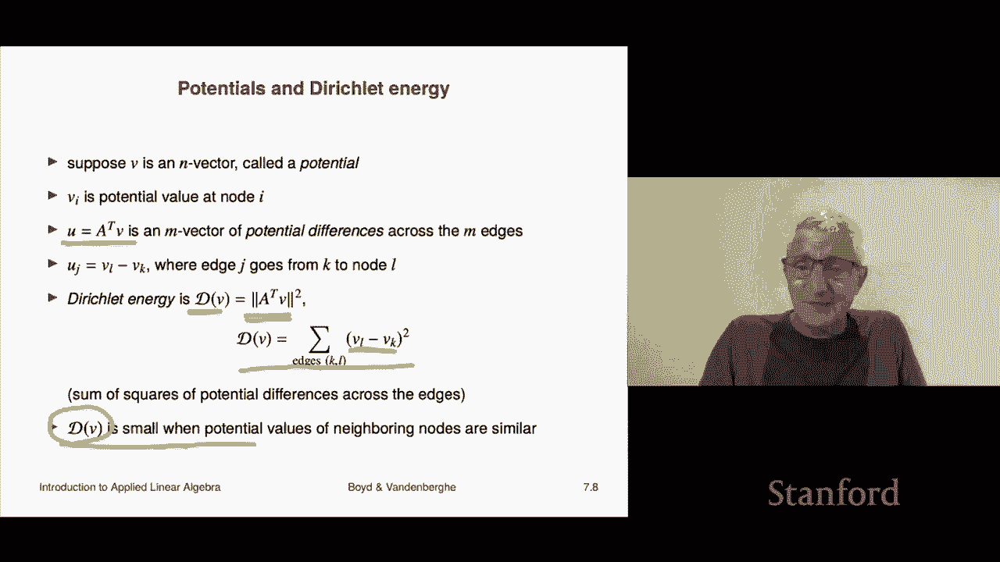

# P21：L7.2- 关联矩阵 - ShowMeAI - BV17h411W7bk

We're now going to look at another matrix that comes up very frequently。

 it's the incidence matrix associated with a graph， so this comes up in a ton of fields。

 so we'll look at the basics now。

So basically we have a graph。 graph is something you should know about。

 you probably have an intuitive idea of what a graph is。

 but I'll say a little bit more formally if you've taken some computer science you may have seen this in a more formal setting or maybe a math class or some other class where you've already seen this for example electrical engineering where you you use a graph to represent a circuit anyway so here it is a graph we're going consider graph with n vertices So I've drawn one down here and it'll give you a rough so this is just a baby example。

 this is got four vertices and the vertices are usually drawn as like circle or dots or something like that So here it's got four vertices some people use other names for vertices like nodes is another common name used for a vertex of a graph and then there are also edges now an edge is an arrow and it's oriented so it goes from one node to another or from one vertex to another so for example。

 that's an edge and here。We're drawing them they're typically drawn as arrows and the arrow of course tells you where it goes from and to so for example this is an edge that goes from vertex1 to vertex2 and we're actually calling it edge number one in this case okay and so we have n vertices and we have M edges oh other names for edges are links is one edge link is' probably a couple of other names for it depending on the field maybe branch and electrical engineering is another name for it so a bunch of people have different different names for different nomenclature for a graph。

Okay， now associated with this graph， one very common way to describe a graph is by its incidence matrix。

And so this is a matrix， it's n by M。 So it's the number of vertices and that's the number of rows and number of columns is the number of edges。

 and it's defined this way。 it's AIj is equal to it's one if edge J remember the second index is going to index the edges or the links and the first index I is going to index the nodes so or the nodes or the vertices So it's plus one if edge J points into node I and it's minus1 if edge J points。

Out of node I， and it's zero otherwise。 So what that tells you is a column which consists of a fixed value of J and all I's。

 A column corresponds the J column tells you about the J edge。 And of course。

 an edge only it goes from one node to another node。

 And that tells you that every column of this matrix has exactly one plus1 and 1 minus-1。

 All the other entries are0。 Okay， so that's that's what this looks like。

So here is an example of a graph and here is the corresponding incidence matrix for that graph。

 so let's take a look at what what we see here， let's audit it well， let's take edge1 Okay。

 so edge number one goes from vertex 1 to vertex2 so and then I remember edge1 is associated with the first column of a and so here's the first column of a。

And you see sure enough， this says it goes to node two。

 that's why there's a plus one here minus one says it comes out of node1 and that's why there's a 1 and it doesn't have anything to do with node3 or node4 that's what these zeros mean here and I think the fancy way to say it is you would say that edge1 is not incident。

To you know vertices 3 or four。 that's why there's zeros there。

 And so let's we can actually I could ask some questions。 for example。

 we've already discussed that the columns of an incidence matrix correspond each one each column describes one edge or link in in the in the graph and it'll have a plus one and a minus one period Now the rows are more interesting。

 Let's take like the third row and let's ask ourselves what does it mean well。

The third row is associated with node3， that's over here。

And what it says is now if you go along that row， it tells you whether or not that edge is either coming into that node or going out of that node or doesn't even touch that node is not incident to that node and so for example。

 if we go across the third row we see zero0 and that means that edges1 and2 don't have anything to do with node3 and that's true here's node1's sorry edge1 and here's edge2 and you can see that they they go between one and2 and one and4 and they have absolutely nothing to do with node3 so those are correct。

Then you get a plus one and that says that this tells you that edge3 points into node3 and indeed that's the case you can see this it also says that so in other words a plus one indicates that that edge is incoming the minus one in4 and5 says that that edges4 and5 go out of node3 and let's check that and sure enough that's right so these are outgoing edges right so that's an example so so again the columns tell you about a single edge and it tells you well very little it tells you where the edge comes from and where it goes and a row tells you focuses on a node and it tells you which of the edges are coming in which are going which are incoming which are outgoing and which have nothing to do with that node okay so that's a graph now these come up in a ton of applications I'll say a little bit about。

We'll probably see some later in the class as well。O。

So very common is this is we imagine that the M vector X is going to give you the flows of something along an edge right so graphs often tell you in that case by the way。

 in that case a graph might be called a network right like a transportation network or something like that or well an energy or power network so usually you can interpret what flows along the edges as something like it could be heat。

 it could be money， it could be power as in an electricity distribution system it could be mass literally mass is flowing from one process to another or it could be people and the node could be locations and an edge tells you that people are moving from one location to another okay。

Now， in this case， it depends in many cases， so here x。

 there's a common a a universal convention is this is when you're talking about the flow。

 when x is positive， x sub J is positive， it means that the flow follows the edge direction if it's negative。

 it simply means that the flow of people mass money。

 whatever it is you're keeping track of goes the opposite direction as the edge。

 the opposite orientation。So that's the idea of a that's sometimes called a network， okay。

Now when you do AX， something super interesting happens。

 it takes a flow so x is a flow vector so vector flows on the edges and if you go back and think about what it means to multiply by x so if these are the flows like here's x1 no down to x5 here then if you look at one of these I mean here we could just let let's audit the bottom one so。

What's gonna happen is a X is going to be x2 plus x5。 Okay they're both positive。 Okay。

 I'm just telling you that this is what ax the fourth entry of x is。

 Now that fourth entry is associated with a vertex So let's look over here And sure enough look at that what it tells you is that if x1 x2 x x4 x5 or the flow of something on each of these edges。

 then x2 plus x5，s that's the total flowing into node 4。 let's look at node2， that's this thing。

 and you can see that I multiply this out， I get x1 minus x3。 And so let's look at node 2 Here it is。

 And what we see is that x1 is the incoming flow on edge1 x3 is the outgoing flow on edge3 and you see in fact it's the net flow for node2 In other words。

 it's the algebra net like you know one unit is。Com in or x1 units are coming in x3 are going out and you subtract them and that's kind of the net amount that's flowing into node to so that's the idea that's that's what matrix vector multiplication does when you have an incidence matrix。

It converts a flow into the net flows at all of the nodes。 So that's that's the idea。

 Now a very special equation is ax equals0 and that's called flow conservation And in that case。

 if X satisfiedfi that it's called a circulation right and that's super interesting because what it means is flow conservation says that the net amount flow the total the net amount flowing in the node is zero。

 and that means that the total amount flowing in on incoming edges exactly balances the total the total flow going out of the node on outgoing edges So that's flow conservation So if this was an electrical circuit。

 you would say this would be called like Keroff current law and it basically says that all the current coming into that node。

Go you know， balance is exactly all the current going out of it。

 So that's the context of which it comes up。 And it's called a circulation。 So as a matter of fact。

 let's just make ourselves a circulation for this graph。

 So a circulation could be something that looks like this。 I'll just visualize1。

 Here's a circulation I'm gonna draw it。 It's gonna go like that and that okay So a circulation says that you have a flow going from node2 to03。

 another flow going from3 to1 and a flow going from one to2。 and you can see that it circulates。

 And so that would correspond exactly to x equals and let let's try to get it right。

 So it's first on edge1。 and it's a one edge2 is0 edge 3 is one edge 4 is one and5 is0。

 So that is that is a circulation and you can check with that vector that Ax is in fact0。Okay。

 so this is the idea。And this different in different areas it's going to have different specialized names。

 I already mentioned one in circuits this is called Krkoff current law and it says okay。

 it's the obvious one。Okay now with graphs there's something that involves the transpose of the incidence matrix and it's actually very interesting。

 we' focus before x was a vector that gave you flows on the edges but now what we're gonna to do that was an M vector now we're gonna to look an n vector and we're going to call it V and it's going to be we're going to call it a potential because that's what it's called in many fields mostly comes from physics mechanics。

 these kinds of things or electrical engineering also okay so you have an n vector and what an n vector is is it tells you it gives you a number on each of the nodes of your graph right so it says。

 well it's 12。6 there it's minus-11 there it's to you know that kind of thing so every node on your graph has a number and we think of it as a potential now here what is very interesting is if you multiply by the transpose of the incidence matrix you get something super interesting。

对？Let's go back to an incidence matrix here we've messed it up quite a bit。

 but if you transpose this in your mind the rows of a transpose are these vectors that are each row is associated with an edge and it tells you it's got exactly 111 minus1 and in fact if you multiply such a vector by if you multiply sorry such if you have the inner product of that vector with another vector what you're doing is you're taking the difference of two entries so it turns out the following is what happens it turns out that a transpose v is super interesting what it is is it's an m vector of the potential differences across the m edges so again an electrical engineering you could think of this could be a circuit the graph could represent a circuit and the V。

Could represent the voltage at each node， then when you form a transpose V。

 what you're getting is a vector， which is the length of the edges and it tells you the voltage difference across each of the edges。

 okay？So that's the idea now something else related to potentials is something called the Deish Lake energy and that'll also come up it's super interesting it's this what it is is it is the norm squared of a transpose V V is a potential a vector of potentials and so as you know a transpose V gives you a vector now associated with the edges each component of a transpose V is。

Corsponds to an edge and it gives you the difference in the potential across that edge and if you take the sum of the squares of them that gives you the so-called delelay energy and so here's one way to write this this says that you only sum you sum over the edges on the graph so whenever two nodes are adjacent I didn't say that but when two nodes are connected by an edge you would say that they are adjacent so this says that you sum over the potential differences okay。

And right now there's no application of this but we'll see it later。

 you should think of the deestlay energy as an interesting thing。

 it is zero when the potential or the vector v is constant in other words it's a multiple of the ones vector why because in that case all of these are zero because every entry of the vectors the same you subtract them you get zero and you some square them you get zero。

Otherwise what this is is it's something that measures I'll say very roughly how wgly your potential v is across the graph right it penalizes potential differences that are large across an edge okay so you would say if D of V is small。

 you would say that the potential V is smoothly varying over the graph okay I just mentioned these ideas we're going to see more of this later。

 but that's the idea。

