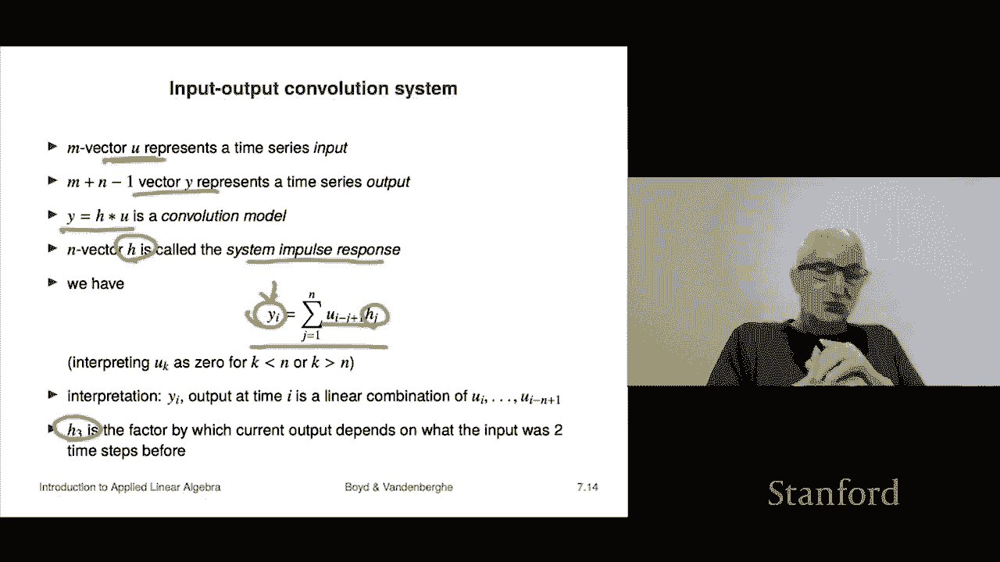

# P22：L7.3- 卷积与矩阵 - ShowMeAI - BV17h411W7bk

Our next topic is convolution it's something you may have seen in other courses as well or will see in other courses as well。

 for example it comes up in probability， it comes up in signal processing a bunch of areas。

 so it's actually something very good to know about。

So and this is I should say this is completely standard mathematical notation so and it comes up in lots and lots of different areas okay。

 so if you have an N vector A and an M vector B， the convolution and it's denoted with this star of course the star hints that it's some kind of a multiplication that's true。

 it is a kind of a multiplication。So this is so you say a convolved with B is what C is and it's an n plus m minus1 vector and its entries are given by sums of products of an entry from A and an entry from B now which entries that's complicated it's given by this kind of scary looking formula here but what it is is it's all the products AI and Bj where I plus J adds up to K plus1 so let's take a look at an example let's do this with n equals for an m equals3 so a is a four vector and B is a three vector then we form C we're going to simply form C equals a convolved with B and now I'll tell you what the entries of C R and we're just using this formula here but I think you'll see a pattern here so C1 is going to be the product of every AI and Bj。

Where i plus J adds up to two。Well， the only choice there is they're both one。

 so you get C1 is A1 B1。Which notice is like a product C2 is all of the products of AI and BJ for which i plus J adds up to three and there's two ways to do that there's one plus two and there's two plus one and there you go these are the two entries it's a1 B2 plus A2 B1。

C3， that's going be all the ways it's product it's the sum of the products of the entries of AIDS of AI BJ where I plus J adds up to four and the ways to do that are1322 and31 and so on okay so at this point you might be saying like well this is crazy this is complicated it is complicated but in fact you'll get used to it and it'll actually have a meaning for you and depending on what field you're in it may end up being a well a very important part of your life as convolution so here's a specific example if I just take the convolution of these two vectors here I get this vector here and we can at least audit the size right so here M and n are both three and so you should get something that is three it's three plus3 minus1 so you should get a five vector and indeed that's exactly what we get I'm not going to audit it there might be and the error in that。

Wait but my suspicion is it's right and that this is actually what the convolution of that is right so at this point by the way。

 you should have absolutely no idea why anyone should care about this or why would you okay why。

So here's here's where it comes up this is a very important idea it's essentially polynomial multiplication and to be honest it's the way I think about it。

 I only think about this polynomial multiplication so let me explain so suppose the n vector A represents the coefficients of a polynomial this way so a1 is the zeroth order coefficient A2 is the x to the one coefficient right and so on up to AN which is the x to the n minus1 coefficient and the same for B except B only goes up to the x to the M minus1 coefficient the vectors A and B represents the coefficients of a polynomial。

Well， it turns out if I call this polynomial P of x and that's Q of x and I take the product now the product of two polynomials is a polynomial also。

 and in fact it is one of degree up to m plus n minus1 n plus m minus1 and its coefficients are precisely the convolution like that so if we were to go back and see that here it says that another way to get these coefficients is actually to multiply two polynomials together and collect the coefficients and the coefficients give you the entries of the convolution so for example it would be a1 plus a2 x plus a3 x squared plus a4 x cubed and we would multiply that by B1 plus B2 x plus B3 x squared right and if I multiply these two polynomials together。

え？I multiply everything out and I collect the terms and I would get things like， for example。

 the constant term when I multiply this polynomial by this polynomial well the only way to get the constant term is by multiplying A1 and B1。

 Oh hey， look at that That's what C1 is Now how do you get the X term the linear term when I multiply this polynomial by this one well the only way to do that is the constant times the linear part plus the linear part here times the constants that's a1 times B2 plus a2 times B1 and that is exactly C2 and so on。

 so basically what convolution is is it tells you how the coefficients it gives you the coefficients of the product polynomial。

Okay， so that's the idea Now once you have that interpretation a lot of things come for free that would otherwise be well kind of a pain to show yourself So for example。

 it turns out that the convolution of A and B is the same as convolution of B and A so or you would say it is commutative commutative means you can carry out an operation in either order and you get the same thing so that's what that's what this tells you why is the answer is that when I multiply the polynomial p of x times  Q of x I get the same thing as multiplying the polynomial Q of x times B of x so it's got to be the same。

Here's one， it is associative if I。Take the convolution of A and B and then convolve that with C turns out that's exactly the same as convolving B and C first and then convolving that with A convolving is the verb for convolution。

Okay， okay so that's again that comes just from polynomials。

 you're just multiplying three polynomials together and you're collecting the coefficients in like powers of x and then the results as what you get okay it also tells you this it says that the convolution of two vectors is zero only if one of them is zero okay so that's the idea oh I should also say if if the two if the two vectors are one vectors right like their n equals m equals one。

 then convolution is just ordinary multiplication it's nothing but multiplying to two numbers together so in that sense you can think of convolution as a generalization of multiplication。

Okay， now。We can represent convolution using matrix vector product Okay。

 so let's see how that works S C is is a convolved with B I can write that as a matrix T of B times a。

So that's how that works。 And for example， this is an example for a particular size of B。

 which is B is 3 and a is 4。 So it's following the example from here So these dimensions okay but for that example。

 T at B looks like this and you can just check that if I multiply this by a1 a2 a3， a4。

If I multiply this matrix here。By this vector， what I will get， that's no longer T of B。

 but this is going to tell me it's going to give me the convolution。

 and I'll just work out a couple of things like the first row is going to B。

 the first one is going to be A1 B1。W whichch is correct， Okay。

 and the next one is I'm going to go across here and down here， and I'm going to get B2， a1 plus B1。

 a2。Right and I keep going down and you'll see that I'm getting the convolution。

 So that's it Now the matrix T of B is super interesting。

 It's called a tops matrix or triples matrix that's named after a mathematician named templatets and it's a super interesting matrix if you take a look at it so on when you look at these are called the diagonals of a matrix right they're all the entries where you know I plus I might I minus j is equal to some number right like when they're equal that is called the diagonal right but these are the diagonals and what you see is are the tus matrix is constant on the diagonals。

 that's the right way to say it So in other words if you have a triples matrix and you know what the value is at one point。

 then it's got to be the same all up and down that diagonal so that's it So these come up in a lot of areas。

 but what this says is another way to say if you connect all these things。You're saying that。

To multiply a polynomial， you represent a polynomial by a vector of its coefficients。

 and it says if you multiply by another polynomial， you get， of course。

 another polynomial and its coefficients are given by a matrix。

Times the original vector and that matrix is just templates matrix of T of B， Okay。

 so that's the idea。Okay now I'll just mention a few quick cases where convolution and therefore triplets matrices come up。

 So one very common thing is is in time series so I think of x representing a time series So x1 is the first sample it's a number x2 is a second sample x3 and it could be anything you like。

 it could be the temperature and in10 minute intervals。

 it could be the price of something doesn't matter what it is right it's just it's just a time series okay now if I do a convolution with a where a is this vector one third。

 one third， one third then it turns out what you get is yk is is this it's actually beautiful。

 what it is is it is a sum So each Yk is an average of a little window of three different x's okay and so people call that a three period moving。

And it's used， of course what it does is it smooths out a time series So over here here's a time series I don't know what it is it doesn't matter and here it is I have now convolved it with a which is one third one third one third and you get kind of something that has the same shape but it has but it's smoother and it's smoother because you're sort of averaging stuff so if it kind of jumps up and jumps down that gets smooth out a little bit by the averaging so it's a smooth very very common its a very common operation to carry out on a time series just so that your eye is not whatever distracted by all the wiggles so it would be very common in economics or finance to quote like a five day a five day moving average as what this would be called so that's an example。

Okay， so it comes up a lot in time series， this is one example。的。

Now it also comes out as an interpretation of an input output system and let me explain what that means so we think of you that's actually one of the traditional names used for as foreign input so and it's a time series and then the vector y also represents a time series but we think of u as an input and why as an output I could give you lots of examples of this but you could be the power that we apply to a heater and why could be the temperature rise of let's say whatever I'm heating and let's say this is sampled on every you know fivemin intervals or one minute intervals it really doesn't matter right then that's the idea that would be an example and by the way such systems I mean depends on what it is of course but would generally be described precisely by convolution right so it says so you think of u as what goes in and why is the result。

And so when it turns out that this so-called output is simply a convolution of the input with something one of the traditional names is H it's called a convolution model so it means that I don't know what this thing well what it says it's a very specific I'm saying the way you relate the input to the output is it's via convolution and H is called lots of different things it's called the system impulse response that would be a mechanical engineering and electrical engineering for example it would have other names in statistics it comes up as well and it's called the kernel in mathematics that would be a very common thing you might hear it'd be the convolution kernel you would hear that and if you hear that so system impulse response is actually a little bit of a dialect that's not standard like if you walk into a math department and say oh the impulse response is this they'll say what is that right but if you sorry I meant to say convolution kernel they'll say oh cool what didn't you say so okay。

And what it says is this， if we write out what it means。

 it looks like this and it's a kind of a scary equation， but let's take a look at it。

It says that the I output。Is equal to it's a sum over the inputs here multiplied by Hj。

 Now u minus J plus1 is something if you think of I as now then you minus J plus1 is something like you know J minus1 steps ago。

 that's what it means and it says you multiply that by Hj。

 and so what it says is the output now is a linear combination of previous inputs with the coefficients given by Hj okay so that's the idea。

 And so in fact， you can even interpret J as literally the number of periods ago。

 that's what it means because it tells you your current output， how does it depend on the input。

 let's say three samples before and that would be something like H3 Okay so that's what it says and here you can interpret H3 as as the factor by which the current。

Output depends on what the input was two time steps before。

 two time steps because the first one tells you how it depends on now and then。

Previous than previous previous and that would give you H3 so that's the and input output systems come up throughout actually all of science and engineering I mean it's just it's absolutely ubiquitous right it could be things like you know the rainfall in a region that could be you and why could be the height of a river above some normal height that would be given by convolution in thermal systems dynamical mechanical systems would many mechanical systems would work this way so it would just be this is an extremely common model of systems。

