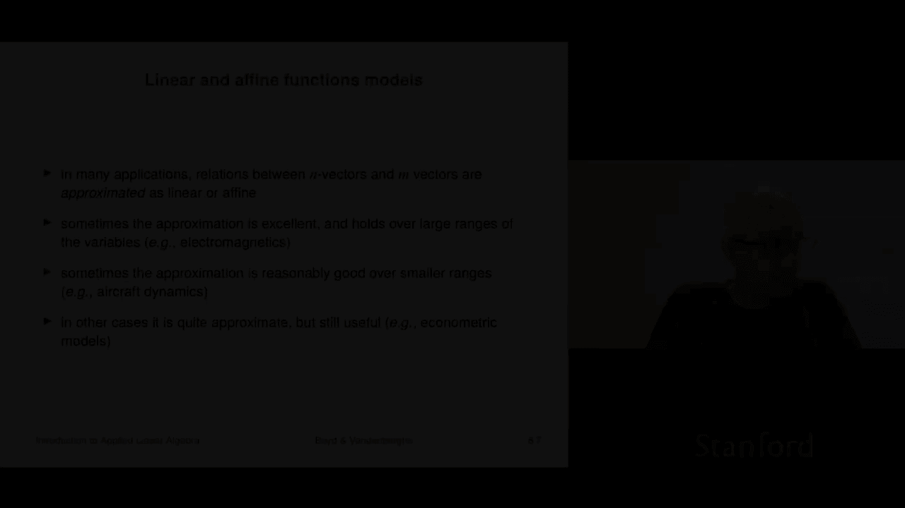
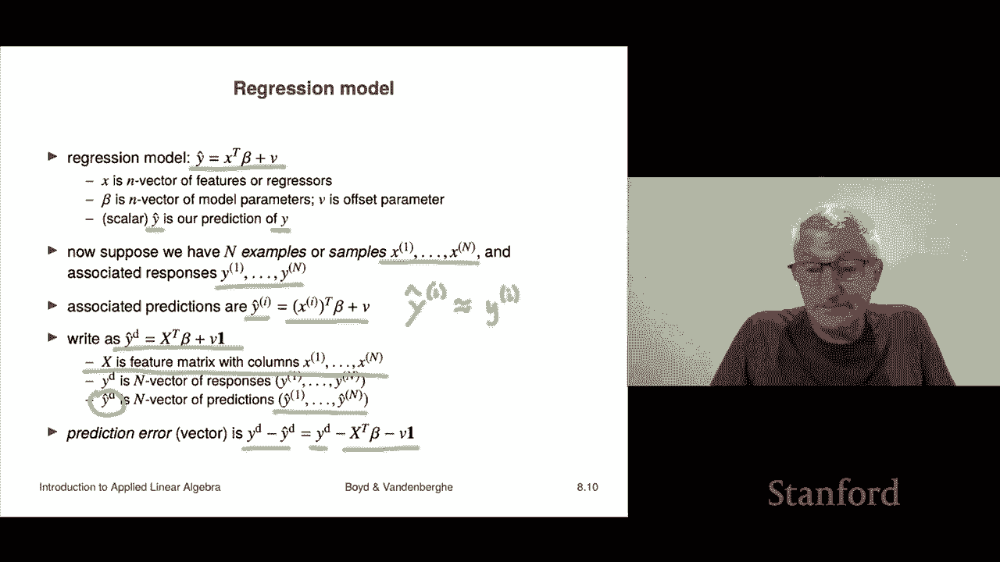

# P24：L8.2- 线性函数模型 - ShowMeAI - BV17h411W7bk

So in many applications， relations between an in vectoror and an in vectoror either are approximated sometimes the approximation is very good as linear or aline right so sometimes the approximation is really good and holds over like you know holds out at the you know fifth and sixth decimal place or something and example of that would be electromagnetics or for example acoustics there are many cases where it's just like that function is basically linear now sometimes it is the approximation is just it's pretty good over smaller ranges so for example aircraft dynamics right if I take an airplane and I ask what are the forces and torques that are put on the airplane you know as a function of its speed and sort of the angle of it the angle of attack and the control surface deflections that's approximately。

fineine for you know reasonable ranges， certainly for most of the ranges that you would be comfortable flying an airplane in。

 but it doesn't hold when when you you know the airplane is like falling out of the sky or upside down or something like that。

 okay。Now in other cases still the approximation is quite approximate like its plusmin is 50% or worse but it's still super useful so that's for example in econometric models right so I mean just to put something on this。

 you know my colleagues in electrical engineering when they're doing E&M you know their models they can predict things to three significant figures quite easily right so that's good my friends who work at hedge funds they basically put it this way。

 they say we're happy if we get the sign right okay so but nevertheless it's still useful。Okay。

 so our first example is from economics。So here we have end goods or services。

 I'll just imagine them to be end goods and we have the prices for those goods。

 the market prices are given by an Nveor P here so P3 is the current price of item or good3 and we have demand and that's given as an nveor D So D4 is the demand。

 the number of units of good4 okay and then what you do is what we're going to do is we're gonna imagine changing the prices and so what we do is we take the new price that's Pi new that's the new price for item or good I minus Pi so if that's positive it's a price increase if it's negative it's a decrease and we divide by pi or the prices I should say are all positive and that has a beautiful interpretation is the fractional change in prices and we're going to call that deelta price sub。

Right so if that is equal to plus 0。1 that means basically you just increase the price of that item by 10% right if it's minus 0。

05， that means you just decrease the price on that item by 5% Okay so highly interpretable so that's what the deelta vector gives you delta price vector it tells you the fractional changes in the prices for those goods。

Okay now we do the same with demand right we have the fractional change in demand right so if we subtract from the new demand。

 we subtract the current demand or something like that we divide by the current demand。

And demand also， by the way， is positive。 And so this is the fractional change in the demands right so that that's how that that's the idea。

 So， for example， if deelta Dm sub2 is minus 0。1 that says that the change in demand for good or item two went down 10%。

 So highly interpretable okay now clearly there's some relation between the prices and demands。

 we all know that if you have a single thing and you increase the price。

 the demand goes down okay and what relates them is called elasticity the elasticity， in fact。

 that's called the price demand elasticity and for multiple goods。

 there's a very common model and it looks like this It says that the vector of demands is a matrix E called the elasticity matrix times。

The relative changes in prices， Delta price， okay？Now that's super interesting A is an E is an n by N matrix。

 it's called the elasticity matrix， and it's highly interpretable and it's very important to understand like what it means so for example。

 E11 is minus 0。3。What does that mean， Well， E11 tells you how much does the price of the first entry tells you sorry。

 how much is the demand that's the first， the first one。 So we say one。

 How much is the demand for item one。Change per fractional change in the price of item 1。

 And this is -。3。 And so here， here's a specific。 This is a very specific conclusion。

 This says if you increase， if you increase the price by 10 by let'ss， let's make it less， like。

 let's increase it by 1%， right， if we increase the price for item 1 or good one by 10%。Our model。

 that price demand elasticity model predicts that the demand will go down by 03%。 Okay。

 so that's what it says。 Oh， you can ask another question。

 does your profit go up or down and that depends on how much it costs you to manufacture all that sort of stuff So we' here we're just predicting how the demand is going to change Of course。

People are interested in how the demand is going to change for two reasons number one for supply chain you want to make sure you can you can actually have that amount of that good on hand and the other thing is you want to find out what happens your profit does it go up or down okay so all right。

E12 equals plus 0。1。Super interesting， let's see what it says that says that under the price demand elasticity model。

 if you increase the price。Of。Good2 by， let's say，1%。 This says you can。

 you can expect the demand for good number one to go up by 01%。

So increasing the price of the second good increases the demand of the first good now。

That comes up all the time and what people call in economics。

 these are referred to as substitutes right that you know when that somehow if people say oh。

 that's more expensive， I'm not I'm buying less of it right so that would be E22 you know is minus you know 02 or something right so if you increase the price it says that the demand for good2 the demand for good2 goes down but demand for good1 goes up because there's somehow you know you know their substitutes right so thats that's the idea here's one E23 was minus 0。

05 that tells you that if if you increase the price of good 5 it says that the demand for good2 goes down。

And sorry， if you sorry， if you increase the price for good3。

 then the demand for good2 goes down and it's quite specific about how much it goes down。

 it's not much right， but so what that usually says that you know I mean the typical thing would be if you increase the price for shoes。

 you know of course the demand for shoes goes down。

 but also the demand for socks goes down or something like that。

 I mean okay so and there's a name for that in economics， which I've forgotten but this is the idea。

 but it's a very very common model， of course it's only accurate for small changes right if I double or triple the price。

 I would hardly expect this thing， this simple model， the simple linear model to hold。

 but first small changes it's actually pretty good so it's a pretty good way to predict stuff。Okay。

The next one is another source of aine models is directly from well differential calculus， in fact。

 you can even say the differential calculus is nothing more than an organized way to come up with an aine approximation of a function a function given by a formula so you can whatever do all your derivatives and stuff okay so here the setting is suppose we have a function from Rn to RM and it's a differentiable okay and the first order Tayloror expansion of F hat is called F hat of F near Z is equal to this it is equal to。

Now， to tell you what my approximation is I have to tell you what each of its component is。

 so I'm telling you what the I component is， it's f hat I of X is equal to F of Z。

 that's the value of F at Z plus and then I have a whole bunch of little terms here， each tells you。

About how much you've changed x from Z and then you multipied by the associated partial derivative so that's just the Taylor expansion and you've seen that before and that we write out this way。

 in fact we've seen this in previous lectures it's an interpretation of the inner product so it says that Fi had of X is Fi out of z plus the gradient of Fi at z inner product with X minus z which is an x minus z is interpreted as the deviation of X from Z okay and in compact notation people write that this way。

F hat of x equals F of Z plus Df of Z times x minus Z。 Okay now Df is an M by N。

 It's called a derivative matrix， Jacobian matrix。 It's got other names depending on the field。

 right And in some cases， it's very specific， right， It's about。

 I mean it's got all sorts of names like anyway， depending on the field for specific applications。

 But here it's called the derivative or the Jacobian matrix。 And it's a very simple， you know。

 thing it looks like that。 It says that roughly speaking。

 it says your approximation is the value at at Z。 Now， these are all M vectors。

 It's the value at Z plus an M by n matrix times your deviation from Z on your input right。

 So that's kind of the idea。 And this thing you can think of it。 this way。

 this derivative matrix has rows， which are the transposes of the gradients。

Of the entries of F or you could think about this that this is a matrix and to get its Ij entry。

 you take the partial derivative of Fi with respect to Xj and that's what it is so it's so another way to say it is Df of X is the matrix actually this should be a Z sorry about that it says that it is the matrix of partial derivatives is what this matrix is okay。

And the idea is that that is a very good approximation of x for x Ne z and it's an aine function。

 so I mean it's not clear it's an aine function， well I think it is we could write it this way you could write as DF。

Of Z times X。 That's sort of like the A X。 And then the B term looks like this。 I'll put it together。

 It's F of Z minus。D F of Z transpose Z like that。 Okay， so this is sort of like a。

 And this thing here is sort of like B in the in in the way you write an aine function out。 Okay。

 so this is this is， so this， this is a giant source。Of aine functions。

 it's simply you do a first order Taylor series expansion of your function。

 and that's going to give you an aine function。Another one where it comes up is in statistics。

 machine learning。And prediction so and it's called a regression model you've already seen this before。

 but it's it's worth here we can actually stack it into some vectors and I'll explain how that works Okay。

 so the regression model remember looks like this it's it's Y hat equals x transpose beta or the inner product of x and beta plus V okay now here x is an n vector of features or regressiongressors depends you know so these could be attributes of a patient or anything else attributes of a person or a customer or of an email or something like that it doesn't matter。

So's that's what x is beta is an n vector of model parameters and v is the so-called offset parameter and then this produces a scalar a scalar y hat and that's our prediction remember that a hat on top of something is not universal but common mathematical it' certainly an applied math it hints that it's an approximation of something and in this case it's an approximation of y y we assume is what the actual observed value was。

🤧Now suppose that we have a so called data set and a data set is going to be we have a set of we have capital n samples and x1 up to XN those are vectors right and then I have the associated responses and those are y1 through YN okay now。

This is just these are just like some observed， it's a data set， it's observed data。

Now we can also for each of the x1 through XN， for each of our data our observed or data sample features。

 we can actually calculate what the prediction is， y hat I is this now。I mean。

 it's clear a super good predicting what we really want， of course， is this we want why。I。

 to be approximately equal to why。Of I like that so that that's what we've want if they're close that we'd say that that your model does a very good job predicting why that's that's that's the idea。

Okay， so what we'll do is we're going to stack。We're going to stack our data set we're going to form a matrix and a vector out of it so what I'll do is I'll form a vector Y hat D D is for data and it's simply stacks the observed Ys on top of each other it's a capital n vector and I'll make a feature matrix with the columns X1 up to Xn by the way it's also very common in in fact honestly it's more common in statistics to work with the transpose of x but you just have to figure that out。

When you go to your internship and someone says， here's the data matrix。

 you have to figure out are they talking about other columns， the features or other rows and。

While in this book， we make the columns the features。

 it's probably more common on the streets for people to give a data matrix with the bros。

 but that's fine and I'll show you why that is in a minute。

So the reason is when you write that on a matrix vector notation。

 you write this that the vector of predictions is the data matrix transpose times beta that's a vector plus v times the vector of ones okay so now you can see why people often work with the data matrix being having the rows as the beach is because then you don't have this transpose here before the matrix vector multiplication but it's fine that's the idea And so for example。

 the prediction error and it's a vector is this is y d minus y hat it's what it's what actually happened minus and then your prediction of it and that's going to be equal to this thing and so for example if I take the RMS value of the prediction error and it's0。

1 I could say on that data set my regression model made predictions that we about you plus or minus 0。

1 I mean that's what it means to have an RMS value of about 0。1 sos's。

Regression model we're going to see a whole lot more about that later in the class so so far we haven't told you。

How do you find beta or V we'll see that later in the class it's a very important thing。

 but for now there's note that we can certainly interpret and look at a regression model before you know how to fit one fitting one is going to come later。

