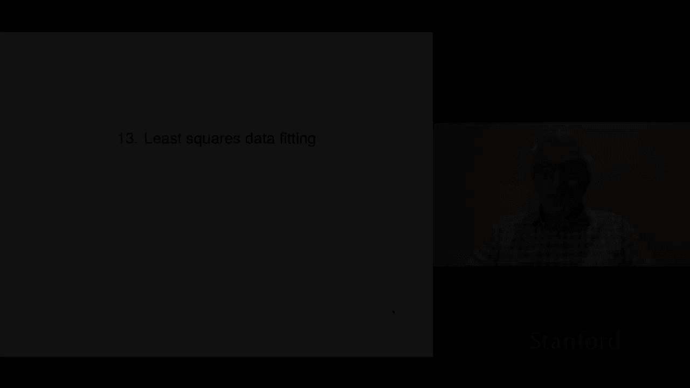
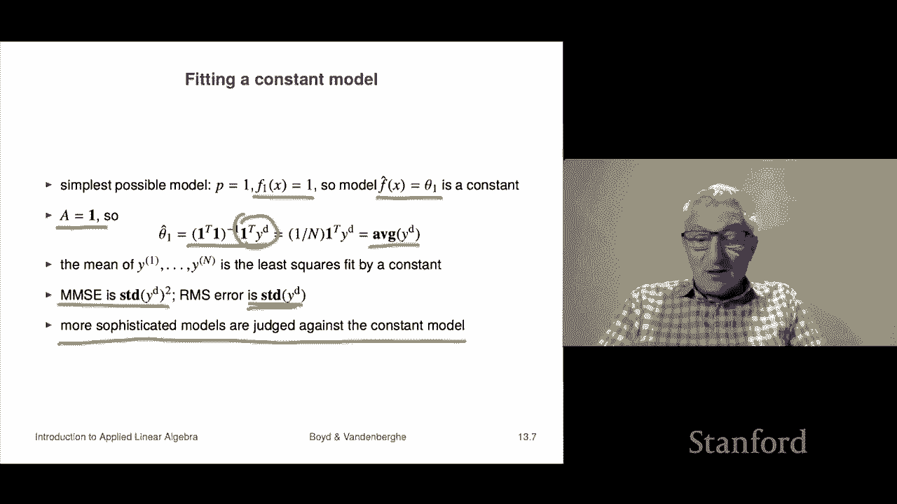

# P35：L13.1- 最小二乘数据拟合 - ShowMeAI - BV17h411W7bk

This is Cha 13 on least squares data fitting， which is one of the most important applications of least squares we'll see。

Okay， so the setup is this we have a scalar y and we have an n vector X and we believe that there's some functional relationship between them。

 meaning we believe that y is approximately equal to f of x I'll say a little bit more about that later so here x is called the independent variable this is a traditional name for it and y is called the outcome or the response variable。

Now this function F tells you how X and y are related now often x is a feature vector so it's a vector whose entries are features associated with an attributes of some item and then y is something about that item that we want to predict so that's the most common setting here now we don't know F this function which gives the quote true unquote relationship between x and y and the truth is there usually is no such f right that it simply we have some data and we simply want to fit a model that approximately predicts what y is given X so but sometimes there there's a true model or something like that certainly when we experiment with methods we will do it with data that we generate ourselves and then there's a true model but in most applications there's no such thing as F doesn't exist it's a fantasy。

Now we're going to be building our model or data fitting methods based on some data and so data we're going to have a set of capital n data points and they're going to be X1 superscript1 up to x superscript capital n those and the associated outcomes so is the independent variables and the associated outcomes are going to be y1 up to Yn and we're using superscript here to index which of the data examples we have right so we refer to X superscript I y superscript I as the I data pair and。

If you want to refer to a component in X， you would have x superscript I subJ。

 that's the J component of the IF data point， so this is a data set it's called and what we're going to do is we're going to try to build an approximate model using this data set。

Now our model we're going to denote by F hat and as I've said before。

 it is in applied math it is kind of a convention that hat means an approximation of something so the idea here is F hat is supposed to be an approximation of F this true this true function which in fact probably doesn't even exist anyway。

 but the idea is that this thing is supposed to guess or make an approximation of y is given x so we'll be focusing on a very simple set of a very simple model form in which F hat of x is equal to a linear combination of F1 of x up to Fp of x with coefficients theta 1 through theta p now these Fs。

 these F F1， f2 F3 those are so-called basis functions and we're going to choose them and we'll say a little bit later about how would you choose。

and why would you choose them one way or another that kind of thing， these are the basis functions。

And then theta I are the model parameters that we choose right so so the idea is you first you pick the basis functions and then you choose the model parameters which are just numbers their theta1 up to theta P Now here the way we interpret as this is if I is in general Y hat equals F hat of X this number y hat is our guess as to what the y the outcome or label associated with X would be So this is our guess and of course we can have a drum roll and and you reveal y and y hat and just see how close we are okay so。

If we look at our known data F hat of X I is Y hat I we're going to call that that's our prediction of what Yi is now that's in our data set so the truth is we know what we know this that's a number and we know this number and we can of course what we'd like I mean ideally we'd like them to be well equal then I'd have a perfect predictor of what's happening so but we're going to see that that's for a number of reasons not a good idea but nevertheless so what we're going to do is we're going to actually back off and say that we want actually what we' really like is the predictions to be close to the true values we'll get to what we' really like shortly actually in the next section。

Okay。So this brings us to least squares data fitting so the prediction error or residual on the if data point is the true value minus the predicted value so that's that's it but by the way some people reverse it the other way around and so on but but it is actually not for us it's not going to matter so least squares data fitting says this。

Choose the model parameters theta I to minimize the RMS prediction error on the data set。

 and that's simply the sum of the squares of the residuals divided by n just capital n of them and then you take the square root。

 so that's root mean square。Now's that's the RMS error on our prediction set and remember what each of these is each of these is the difference between the true value and what you predicted right so if this is small you would say that your model is pretty good if it's large your model is well pretty poor now this method。

Of choosing the parameters theta， this can be reduced to a least squares problem and therefore we can easily solve it even when these are quite big。

So let me explain how that works so let's express our data set and we're going have several things we're going to have Yi that's actually the true observed labels or sorry outcomes we'll have Y hat I that's what our model is predicting Now y hat I is a function of our thetas I mean it's also a function of the choice of F but we're assuming that the choice of the basis functions is fixed right so so y hat I is our prediction on the I data sample and then R I of course。

 is the difference of the two is the residual or prediction error lots of other ways to call it so and these are going to be n vectors and that means that the J entry of it is the is the error and is the outcome prediction and residual or error on the J data example okay so these are not vectors。

Now if you look at RMS of our the superscript D means data on our data set， so the RMS value of RD。

 that's just the RMS prediction error and that's what we want to minimize we want to choose the theta to minimize that so。

We're going to form an n by P matrix A and the elements are going to be AIj equals fj of X。

 so it's the J basis function evaluated at the IF data point data the independent the independent variable value right and so with this definition we get a very compact matrix vector equation it says our predictions are equal to this matrix a multiplied by theta。

So this this makes it very clear by the way， how the predictions depend on theta and what we see is it's linear in this case now this is that's why we call it a linear in the parameters model because the predictions are linear functions of the parameters okay now of course once we choose the parameters they don't vary and it's not relevant that your model is linear in the parameters anymore but nevertheless that's it okay。

So least squares data fitting says please minimize the well the RMS value。

 that's the same as minimizing the norm squared so of R D。

 but that's y d minus y hat D norm squared and that's equal to this。 And we quickly get it。

 We have moved it around we now have a least squares problem， so that's it。

Now we know everything we then know that in fact the optimal theta this is assuming that the columns of a are linearly independent Okay。

 assuming that's the case， then theta hat is a transpose a inverse a transpose Y that's a formula for it。

 In fact， we don't compute it that way we would computed by let's say a Qr factorization as as we saw last time also I should say in most languages。

 this would look like this。 It would simply say that theta hat is a。

Back slash Y D Now what I do want to remind you of is that is not mathematical notation that is code so if you're among friends or something like that or people who know about this。

 you can write that down but you know don't write that or mention that if you have friends who are mathematicians or something like that so but so that's it so basically this is this page can be implemented very shortly。

 basically it says the first thing you do is you create the matrix。Number one。

 then you do this and then then you get your parameters and now you have your prediction model Now if I take a theta hat minus y squared that is the smallest norm squared value that can take and if I divide by n that's called the mean minimum mean square error fitting error and I think it's minimum mean square error MMMSE so you will see that you'll see that several places right the idea of MMMSE those everyone will just assume you know that acronym。

🤧Okay， so what we're going to do now is we're going to look at so essentially the simplest possible prediction model or model and it's a constant model and that's obtained' it's crazy goes like this I have one basis function only so p equals one and and here's my first basis function it's f1 of x is equal to one always period that's it just one okay and so the model is well it's theta1 times f1 of x but F1 of x is1 so it's just theta1 and so this is a fancy way of saying our model is just a number so I will here's here's our prediction model is you would say what do you think the demand for xyz is going to be tomorrow and you say 13。

1 and you go then the next day they come back and they say what's the demand for blah blah。

 and you'd say 13。1 and so on so the idea is it's a pretty simple model it's simply a constant that's it。

Okay， so let's we can actually just work it out from the formula。

So here a is simply the ones vector right it's p equals1 So the width the a is only one and in fact what you're supposed to plug into this matrix A is the value of that basis function at that data point。

 but that's always one So a is is simply the vector of ones Well here's the formula is's just theta transpose theta inverse you know theta you know one sorry one transpose one inverse one transpose yd but one transpose one is just n capital n it's the number right because it says sum of n numbers each of which is the product of one and1 otherwise known as n So what this is and one transpose yd is the average that's sorry it's the sum of yd So this is the sum divided by n。

 that's the average。And that's really cool So it says and you know it in retrospect。

 it's extremely intuitive right what it says is that if。You want to use a constant model。

To summarize or predict some data you should simply look at the mean of what that data has been and guess that right so if you want to if you want to guess the temperature in Palo Alto let's say well based on nothing as a constant you would simply take the mean the mean and you'd say that's what it is okay that's the temperature。

Okay now interestingly， the minimum mean squared error is the standard deviation of yd squared right and so the RMS error。

 the optimal RMS error is the standard deviation so this is actually a very good interpretation of what the standard deviation is so if I tell you that I have some data of YD and I say well the mean is5 and the standard deviation is two。

I mean you can understand that by itself right it means that basically roughly speaking yd is kind of above five and below five about equal amounts。

 that's false but you know just roughly and it also tells you that it varies from five by about plus minus2 so we would not be surprised if we saw five in that or a7 of course we could have we can have a larger number larger deviations from the mean which is five。

 but you knows that's the rough idea okay and so another interpretation of that is simply to say that guessing five is the best constant predictor for that for that variable y that's one way to say it and if you do that if you use that constant model which is the simplest model you could possibly have the RMS errors to standard deviation so I should say that you know sophisticated models which we are shortly going to be looking at。

All basically must be judged against this simplest model it doesn't make any sense right if you someone walks up to you and says oh I've created this incredible thing I've been working for days on you know putting the model together and blah。

 blah， blah and my RMS error is like you know point two and you go cool dude that's great and you go by the way what was the standard deviation of the data and if they say oh point22 then you can say look you did basically nothing right so because the constant predictor is not a whole lot worse than your complicated predictor so anyway so this is a very important point it's actually something a lot of people well unfortunately some people don't do but this is what puts everything in context it's your baseline model always。

