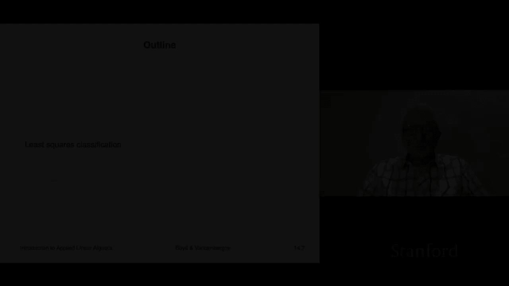
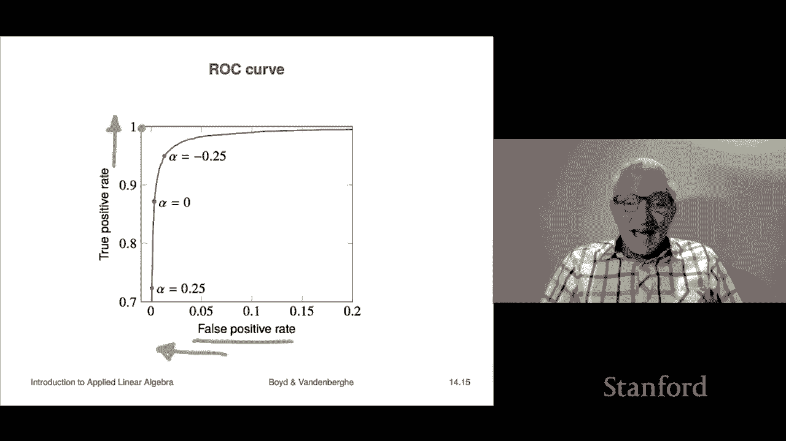

# P39：L14.2- 最小二乘分类 - ShowMeAI - BV17h411W7bk

We're now going to look and see how least squares can be used to build， tune or fit a classifier。

So the way we're do it it's actually pretty straightforward what we're gonna to do is we're simply going to do standard least squares data fitting where the outcome is simply going be a plus or minus1 the number plus or minus1 now remember the actual outcome is either always plus or minus1 so we'll build a model that just targets that that's a standard least squares data fitting Now of course what that means we're going to call that thing ftilde not f hat the reason we're going to call ftilde is because what it gives you is a number whereas in fact f hat must be plus or minus1 because if you say does the patient have the disease you're not allowed to say you know whatever plus 02 or something like that you have to say yes or no I should add there are methods for classification where you guess a probability of something happening and that would indeed be a number So the idea here is well by construction filD it should be near plus。

When y is1 and it should be near minus1 when y is minus1。

 so that's what we're going to construct such a thing。

And then what we're going to do is we're going to take the s of this now s is a mathematical function that gives you this is equal to plus one if f tilde of x is bigger than or equal to zero and minus one if ftilde of x is less than zero now what I've done here is I have broken tie which is when ftilde of x equals zero by calling it plus one。

 but it really doesn't I mean you can break it the other way if you like or randomly it doesn't matter。

And you can even sort of think of a couple of interesting things here right like that you can certainly interpret when FtilD is near one。

 you would say oh， it's pretty confidence plus one， if it's near minus one。

 it's pretty confident it's minus one， if it's plus 0。01。

 it's basically saying honestly I don't know if it's plus one or minus one but if you force me to guess I would guess plus one so okay。

What we'll do is we'll look at an example now of this and we're going to look at a famous data set。

 it's the MNIST data set， it's 70，000 images of handwritten digits with some pretty bad handwriting in there too okay so these are 28 by 28 images of the digits zero to9 and it's about 70。

000 of them that's been divided into a training set of 60，000 and a test set。

So X is a is a 494 vector。 It's not 28 squared， by the way。

 because a lot of the entries are just always0 and therefore don't matter。 and we add a constant1。

 and and we get the's only 493 pixels， which are ever nonze。 right， So for example。

 the pixel at the bottom left is always dark。 So it doesn't really contribute。 Okay。

 and we what we're gonna do is we're going to consider the problem of guessing whether a handwritten digit is 0 or not a0。

 So it's gonna to be plus one if it's0， and  minus-1 if it's not 0。 So if it's 1，2，3 up to 9。

 but plus one if it's one。 So so we're we're just trying to we're just trying to make something that will guess if an image is a0。

 That's it。Okay。So here's the training set results and the error rate is about 1。

6% so here is the confusion matrix for that and you know these were we can check a couple of things we can say that oh yeah how about that look at that that the number of true zeros was about 6000 well okay that's on a 60。

000 that's about 1-10th makes sense and of the 6000 zeros we got we got a little over 5000 correctly okay and we got 765 times it was a zero and we said no it's not。

Good news is that when the digit wasn't a zero， we got a whole lot of them right。

 and we didn't make too many errors。 We didn't make too many false positives。

 We made 167 false positives。 a false positive in this context， means that there's a digit。

 It's not 0。 but we look at it we go， we guess it's0。 Okay， so and overall， the error rate。

 which is this number plus this number divided by the total， which is 60000， it's 1。6%。

 Now when we go to the test set， which is a test set of 10000。

 we get about the same error rate and that's actually all is well， right， these these numbers here，😊。

These numbers here are approximately you know the same as these scaled by 16 and that's good that means that we're not over overfit and what it means is we can likely find a zero with an error rate of about 1。

6% on unseen images okay so and we can guess that because the train and test are very very close here。

By the way， this sounds pretty good， it's not that good to tell you the truth you know so people are down at a lower level than that and more advanced methods of machine learning these days and even some of the ones that we'll be able to look at later in the class will get you actually at or beyond human performance right so they can actually they'll do better than people which is kind of cool this one doesn't is this is just very elementary least squares classification。

So a very interesting thing to do here is to look at the distribution of the values of FtilD of XI over the training set okay and so this is what you get and it's actually really cool right so the red ones are the ones where it was negative meaning it was a digit1 through9 and the blue ones show what our value of FtilD is on the cases where it really was a zero and you know remember what our classifier does this it makes a threshold here right at zero and it says if you're to the right of that we're going to consider you a you know positive which means zero and if you're to the left we're going to consider negative and that means you're a digit1 to9。

Okay， so this is this is how that works。 And you can see a lot of stuff。

 There's a lot of blue over here that that was our maybe disconcertingly large number of。

 I guess those are false negatives。 that's when we say nope， that's not a zero， but it really is。

 Okay， so you can see that。 But you do see a beautiful separation of the two classes And that says we're really doing something here。

 So which is kind of cool。😊，So here are the coefficients in the classifier。

 so a bunch of zero so on the outside here you see a whole bunch of pixels that are like just zero that's because in fact those pixels are never zero in the images so there's zero here but you can see all the others you can see various things and we can even interpret it like it's kind of weird like for example。

 the fact that these are negative says that for those pixels。

Having a bright spot in those pixels basically you know， I'm anthropomorphizing this。

 you know basically very much reduces the probability that that handwritten digit is a zero here there's some kind of distributed things you can actually sort of see visually kind of an annulus here where it it's kind of red and that says pixels that land you know when you have when you have you know a white spot in those in that region it's more likely to be a zero than not。

I mean， from some points of view， when you see this。

 it's hard to imagine that this really does give you like a 1。

6% error rate on things you haven't seen， but it does， it's super simple。

One more topic relating to well classification in general。

 but in particularly squares classification is this。

We have been using a threshold here now let's go back a couple of zero right but your eyeball might want to do something weird like's say you know what。

 let's use this threshold right and that threshold is going to very much reduce the number of our false negatives it's going increase the number of our false positives but you know then we'll get them kind of maybe on the same scale or something like that。

 So this is the idea of just switching the threshold from zero So what we would do is we choose a number alpha and we're gonna say that f of x f hat of x。

 that's our actual guess like minus1 or plus one is plus one if you're bigger than alpha and minus one if you're less than alpha So alpha equals  zero。

 we recover exactly what we had before and alpha is called the decision threshold I mean for obvious reasons now for positive alpha what happens is the false positive rate is roughly speaking when alpha is positive you are more reticent am again anthropomorphizing you are more reticent to guess plus。

One。Well， that means you're going to make less false positives because there'll be something where it's not positive。

 you don't know it of course， and you'll be less likely to announce that that's a plus one。

But so will be the true positive rate because also some of the ones that are true positives。

 you'll now look at and go， yeah， it was bigger than zero， but it's not bigger than alpha。

 so I think it's minus1。Okay now when you vary alpha and you make you make a tradeoff curve of the true positive versus the false positive rates。

 you get a strange thing called the receiver operating characteristic or ROC curve and it is drawn in other in other ways but this is this is the basic idea and I'll say a little bit about the history of it it's a term from World War II and it refers to either sonar most likely or radar and so the basic idea was to try to figure out you know you is there an enemy ship but you know out at 22 kilometers in that direction right you'd be getting some you'd be getting some sonar readings and then you would just guess I mean that's what this is about okay so that's the origin of receiver operating characteristic。

But it's been taken up and it's used universally in statistics machine learning that everyone would know what an ROC curve is so to give a rough idea of what an ROC curve is or how this works。

 what we do here is here I have displaced I've set alpha equals I don't know 0。

2 and what that means is all of these。I'm going to I'm going to classify as plus one and that's good because they're all plus one notice that you know the red distribution down here。

 I'm going to have an extreme when alpha is 0。2 I'm going have a really low error error on my on things that are negative that I think are positive so false positive is going to be super low on the other hand look at all these over here those my false positive rate is going be sorry this is the false positive the true positive rate is also going to be much lower so so here it is plotted where we plot alpha and let me show you what's happening here is when you imagine if I put a dashed curve there that's minus05 sorry 0。

5 there。What we're doing is the total number of red。

Points to the left tells tells me the number of negative ones that I correctly nail as negative the ones to the right of that thing are error so this would be error same for the blue except you switch the orientation so you get curves that look like this right and here's zero right and let me remind you what you want you want the red curve to be small and you want the blue curve to be high okay Oh and you can see here that the total error that's the simple metric that just looks at one one thing is。

You can see that actually that you know it could argue for taking you know something like what I drew alpha equals you know minus 0。

3 or something like that and that would be a good threshold for this so this is an example of our ROC analysis this is the kind of curve that you usually get。

And this shows false positive rate so in these curves left is good right and high is good right so that's the best you could possibly do right there that says that your false positive rate is zero and your true positive rate is one right when something is when something is negative when an example is negative you guess it's negative always when something is positive you guess is positive always so this is an ROC curve and it's something you know people would talk about and things like that and。

Re question would be what value alpha should I take right that is subjective and the answer to that depends on the application and it depends on what are the relative costs of making the two types of errors like what you know what is the relative cost of a false positive versus a false negative right so that's kind of the idea so and that's not anything I mean no math can tell you that right and the data can't tell you that that's somebody has to come from the application So if you say you know we can't have too many false positives because you know if there's too many false positives after all people are going to ignore the alarm。

that's a typical thing that might happen or you'd say false negatives are really bad because if we don't catch this and treat that disease。

 the outcome is very poor so that would be something where a false negative would be a very bad thing right it also be that you have another test that's more powerful and you know all you want to do you'd skew it towards in the conservative direction so that if it comes up positive it doesn't mean that you are certain the person has the disease it means let's schedule some more let's schedule some more tests and see what's happening Okay so let me say just a few more things。

About this you will learn in other courses how to do classification like this you probably won't see least squares classification because in fact there are better ways to do it which don't involve least squares but they're extremely similar I think you when you see those things maybe you've already seen them but when you see them you'll see that they actually do work better。

 but they're very similar in spirit， everything else is the same ROC curve。

 everything else makes perfect sense actually even the model form can be identical so you' see you'll see better ways to do this using other other methods that's especially true for the example with the digits right digit those things maybe for five to eight years now there are other methods not based on least squares that give stunning stunning results in test of course I would never tell you anything about the training in testing those have been incredibly successful they be people by the way which is kind of weird because。

You'd think how could a machine？I don't know how could some crazy algorithm that looks at pixels？

act be a human being and the answer is they do so in fact you might you know all I'm doing here is saying this is an example of least squares to be perfectly honest these are not bad classifiers right I mean there are worse classifiers than these they actually work okay it's the right way to say it and they're pretty simple so I think that's why we've covered them and you know it's also just good for you to know about what is a classifier and now that you know least squares you can you can come up with a classifier in other courses you're going to learn more about more sophisticated classifiers but this is not a bad start at all。

