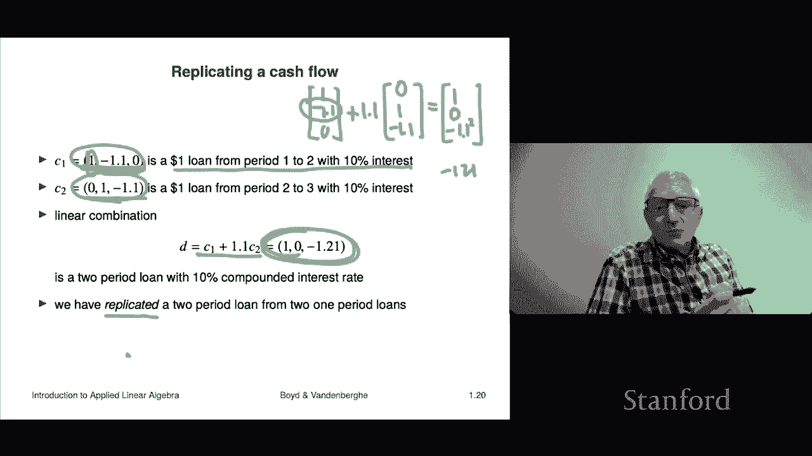

# P4：L1.4- 标量乘法与加法 - ShowMeAI - BV17h411W7bk

In this section we're going to talk about two very basic operations on vectors so far actually we haven't done anything with vectors you've met a couple that have special names like one zero unit vectors in the last section we talked about examples of vectors right but so far we haven't actually done anything with them okay so in this section what we're going to talk about is addition and scalar multiplication so that's these are operations on vectors。

O。So vector addition， if you've got two vectors of the same size。

 you can add them and we're going to heavily overload the notation we're just going to use the same old plus that you'd use to write two plus three So the difference is when plus appears between two vectors it's really referring to vector addition not to of course the addition of two numbers okay and the way you do it。

It's prettytty straightforward， you just add the corresponding entries。 so here's an example is two。

 three vectors， this one and this one。And that's their so called sum。

The way you get it is you just do it entry by entry So for example in the second entry we add seven and two and sure enough we get nine so that's how you add vectors okay you can also subtract vectors to so that' thats that's the idea Now will shortly see practical applications of this but for the moment this is just like this these are the rules of the game。

 this is what it means to add two vectors let me add one thing to that you cannot add vectors of different sizes so if you attempt to if you say what is you know this you know10 minus1 the answer is it has no meaning it has absolutely no meaning right you might as well write something like zero divided by zero so just can't be done so that's an important thing to remember and I should say that all languages that either you support vectors will allow you to add them they'll be。

 in fact， very often is just a simple plus so okay。

So there's some properties a vector addition and let's see what some of them are well it's commutative to commute means that you can switch the order of two things like one thing first or second and it's the same that sort of means to commute and so we write that this way it' says a plus b equals b plus a now I want to say something about some of these equations here and in fact it's about the power of notation right yeah when you look at this you know that this equation is true when A and B are numbers basically says you know addition addition of numbers is commutative if I add two plus three it's the same as adding three plus2 so that's the commutative property right but here the difference is these are vectors and so what's happening here is both plus is a special plus it's the plus between two vectors and even equals has been overloaded here because it's basically saying that the left and right side。

A our vectors right not not numbers now the other thing is that a lot of these things are just really easy to look at and go yeah whatever I mean come on and just glaze over it I mean they look good right like I don't know here if I add two if I add two things and then then add that to a third it's the same as if I added the first to the sum of the second and third right this is true if ABC are numbers but it's also true if they're vectors right。

Here's one a plus0 equals0 plus a equals a well you kind of look at those equations you're like well what else could B。

 what else could a plus zero of be it's got to be a right so it looks good but it's actually saying something and actually this is a great example where we can say something that's kind of interesting here first of all here0 is a zero vector and it's got to be the same size as a so a is a five vector meaning it's got a dimension of5 then this zero is it's five0 stacked on top of each other and a vector that's what that is right and we determine that from the context because it doesn't make sense to add a to another vector unless they have the same size and a has size5 so whatever you add to it better have the same size so that's the idea here so so this is this is an example where we can work out the size of zero from the context。

One if you subtract the vector from itself， you get zero now that this is very important。

 that's the zero vector。Now I want to say just a couple things about properties like this。

 right that。So the first is and this one is important it's easy to let your eyes just bze over things like this I mean they look good that's the point I mean that's the point of goodness you know a minus a is zero well du what did you think it was going to be what's very important is to force yourself until you really have internalized these。

To realize that very elementary looking notation， it looks like the kind of notation you know the stuff you were writing when you were in like first grade or something like that。

 but this time these are not numbers the plus the minus the equals everything here is actually means between vectors so make sure that you you know this is sort of I guess I put it this way it's mindful equation reading don't just read and go yeah whatever okay you look at it and you ask what does it mean is that a three vectors that a five vector what you know that kind of thing and you just you know just process it slowly so that's the first thing I'd ask you to do。

Okay， the second has to do with actually so somebody actually has to show these right like I can't just say this and say。

 well， okay， actually in the you know whatever late late 18th century in math。

 real math had not really started by then I mean they knew a lot of stuff but it was kind of mixed together with theology and all sorts of stuff and nobody had the idea that you actually had to show something it was more like well what else would it be or didn't have that idea but these days and these days means for the last 200 years or so。

 the way we do it is you defined something。And then when you assert something。

 you have to I mean if you you either show it's true or basically no one's gonna believe you。

 Okay so some somebody somewhere has to actually show that for any vector a。

 if you subtract a you get0 Now what I will say about showing this it's interesting to sort of think about1 or two or whatever but no more than that because they get exceedingly boring but it isn't it's interesting to know that I mean somebody has to do this。

 but anyway let's just do an example， I mean， this is really pretty dumb。

 but let's just do an example， let's subtract21 minus3 from that let's subtract you know to1 minus3 Okay and we're just going blindly follow we're gonna go2 minus2 and we're gonna go2 minus2 and we're gonna get zero we're gonna go 1 minus1 that's02 and-3 minus minus-3 that's 0 So there you go okay well。

 apparently this holds for these this specific vector a I mean that's。Kind of silly。

 but that's the idea。So the way you would show this in general is youd actually say well we'd write a let's do three vectors right。

 we would do this and then we'd write it out in component you know in its coefficients like that and then we would say that's a1 minus a1 a2 minus a2 a3 minus a3 and that in turn would be000 okay and then there would be the whole the whole stack of argument now these are。

Often to be honest with you verifying some of these properties is just incredibly boring。

 so if you take a real if you take a real heart， if you take a math class on this。

You will likely be forced to do it， but the good news that's the bad news the good news is's not that bad the good news you do it once in your life and that's it and then after that once you've done it you never do it again so okay。

All right， let's talk about what added， so so far， I mean， really so far in addition。

We've just talked about kind of what it means right it means you just you add the corresponding entries it's pretty okay that's what it is but now what we're going to do is we're going to talk about what does it mean in various practical contexts and that's all that's actually always super interesting and that's kind of the point of this class actually so okay all right。

If you have displacements， right， so here's a vector A， which represents a displacement。

 it says move you know five units to the right and one unit up， what that's what a means。Here's B。

 it's another displacement， it's a displacement that says please move one unit to the left that goes this way and it says and three units up。

 okay。And then here it turns out that the when you add those two vectors up the what you will get is the displacement obtained by doing one of the displacements and then the other now what school here is here it means you could go A and from there you go up here to B and this is the a plus B by the way。

 you could do the same or you could you could we could show commmulivity here in the sense that B if I did first I went to B then I would go to a okay and that would show that that would be B plus a and sure enough it would be the same as a plus B。

 so this is the idea is you add displacements right so。So it says， you know。If you start from a。

 you know， home base and I say go one one kilometer east and two kilometers north。

And then I say let's let's let after that from there， please go， you know。

 negative 2 kilometers east or whatever you know， that's 2 km west and 1 km north you would add them and you'd get the final displacement from your base camp or something like that。

 So that's the idea。 And this is a very traditional idea of。You know vectors。

 this is kind of the picture that you see from you know。

 whatever high school physics or something okay。嗯。那呃。Vctors， I mean。

 vector subtraction is actually very interesting because it can be used to connect positions to displacements and very typically。

The displacement from a point Q that's the coordinates of Q to a point p is actually p minus Q it's actually where you land minus where you started So for example。

 if that's a vector there and  Q is given Q the entries of  Q give the coordinates of Q here's P and it says if we move from Q to P our displacement vector is p minus  Q and that's the blue vector shown here sos that's also a connection and this is you know when people first hear about vectors it's usually in a context like this in a vector calculus or a physics or mechanics class a basic one okay。

Now we can also multiply there's some types of multiplication that you can carry out with vectors we're going to talk about several of them before the course is over。

 but a very important one is that you can multiply a scalar。

 remember that that's just a fancy word for a number。And a vector and so here。

 if I have a scalar beta and an n vector a。Then you can multiply them and you write it this way。

 you literally you just juxtapose them， you put them next to each other the two symbols right so by the way。

 you don't use times and you don't use dot okay those are reserved symbols also those are kind of for children to be honest I mean people who write whatever well okay it's fine here you can write that that's fine but you don't write that over you don't write that with vectors In fact times and dot actually have a different meaning with vectors we're gonna to get there don't worry so here the notation is you just juxtapose them and sometimes people put the vector put the vector in front and the scalar afterwards right so for some weird you know this is just pure convention it means the same thing but this people this is weird I don't know what you don't see it that much but but everyone would understand that if they saw it。

Now the question is what's the meaning， what's the semantics of this Well semantic is pretty simple It says when you take a scalar beta and you multiply by vector you get a vector comes back same size and it's really kind of simple what it says is just please scale every entry in that vector by the coefficient by the scalar or the number beta so that's written out here so let's do a quick example let's multiply minus2 that's our scalar or number times is3 vector 196 and you just you multiply each of the entries by minus-2 so you yeah 2 minus-18 minus-12 there you go there's that sos it's pretty exciting no it's not this is extremely boring but this is just this is just the mechanics this is the plumbing this is what it means to multiply to so far it has no interest no meaning when we look at applications it starts getting interesting so that's the idea。

Okay， let's mention some properties of scalar vector multiplication and things like that。

 so here's one and these equations you know you have to be super duper careful I mean at the very least。

What you need to do is look at these equations and understand。

What it's saying because just a handful of symbols here can say very sophisticated things and you need to be mindful of that right because that's what that's what good powerful notation is right when I write down like five characters right and it has it's packing huge meaning into something that's when you got to be on your toes's that's good notation right Okay so at theset be things like I don't know here's one this says it's associative So here we have to be super duper careful let's imagine that a is a 10 vector。

Okay。😊，And of course， here， beta and gamma are scalrs， so they're real numbers， right？

Real number is just a， I guess it's just a number。 Okay， it's， it's a real number。 that's it。 Okay。

 so then let's go through and very carefully analyze this。 It's not saying something spectacular。

 right It's saying it's saying basically that。If I have two numbers and this one。

 when I put the parentheses here， I see the juxtaposition of beta and gamma。

 now that only means one that's multiplication。But in this case the multiplication is between two real numbers and we know what that is that's just like that's what you learned when you were you know in in grade school right that you multiply the two numbers so so what's in this this parenthesis is a number it's the product of beta and gamma then that is stuck in front of a but a is a 10 vector so now what we see is this looks like a number times a 10 vector now we know what that is that's a 10 vector and it's the 10 vector obtained by taking every entry in the vector and multiplying it by the scalr the number in front okay。

Now， on the right hand side， we see something it's actually different， right on the right hand side。

 we see。Gamma， which is a number times a now gamma is a number a is a vector gamma times a is therefore a vector。

 so that's a 10。 so what's in the parenthesesis here is a vector， it's a 10 long vector。

Then we call the multiplication again， sorry I'm using some computer science language there。

 but then what we do is we carry out multiplication by this scalar beta again and that's that's it so actually and the result on the right hand side is again a 10 vector and it has to be because this equals here doesn't make sense unless the left and right hand side are vectors of the same size and they are in this case so that's the。

That's the basic that's the basic idea here with with all of it so so you know。

 please look at some of these equations， they look silly， it's hard to focus。

 but just go through and make sure you understand what every single thing like you know which like I could ask a question like。

Here you go， what plus is that？Plus is overloaded plus could mean。Between numbers as in2 plus3。

 it could be between two vectors， right， so which is it？Well， in this case。

 if I said that B is also a 10 vector， this plus just happens to be the plus that adds two vectors together。

 right？How about this b right there？Well that plus you look at what it's adding it's left and right it's so-called arguments those are numbers so this plus is is the plus that you knew about when you were a kid it's two plus three equals5 that's that's what that plus is so anyway I would recommend that you you know these equations look super innocent but be sure you understand them perfectly I mean really you should audit it make sure you get it because it's very easy to get into trouble this is a very powerful notation okay。

You can combine the two concepts of scaling or scalar multiplication and addition and you get something which is pretty much at the very center of this course。

 and it's the idea of a linear combination。And let me say what that is。

A linear combination is this I give you a list of vectors and vectors oh this is a perfect example of a notational ambiguity this is absolutely standard throughout all branches of mathematics applied mathematics and many other fields so。

It's not quirky to just linear algebra or something like that。

 and what it is is here these are M different vectors okay so。As opposed to。

 if I just walk up to the street and I say a is a vector。

 then a3 means the the it means literally the third entry in a and it's a number。 So I， for example。

 it minus might be this， okay。Now， here in this case。

A3 does not A3 is the third vector in my in my series of vectors， that's what it means， right。

 so these could be the feature vectors of M patients that are admitted to the hospital。Okay。😊。

🤧So for example， in that case， a3 is a feature vector and it tells you about patient three okay that''s that's the idea right back to our story。

Our story is that we've got these vectors and we've got also a set of M scrs and we're going to call those beta1 through beta m。

 and it says if I just simply。Multiply a1 by beta 1。

You know a2 by beta2 and so on and then add them up that that second one was the vector addition right then that's called a linear combination of the vectors Okay that's that's that's the idea and it's a super important concept Oh here you would call betas the coefficients in the linear combination。

And it's it's not just a very important concept， it is essentially the central concept in this course and for that matter to be honest a lot of others right so it's a very basic idea and that's what it means now。

These sometimes linear combinations have special names right like here's a here's a very common example is when the betas are positive suppose the betas are positive and they sum to one right then this linear combination here is sometimes called a。

A weighted average or something like that， or another word for it is a convex combination。

That's because it connects to somematic some other mathematics。

 but it's just called a weighted average or something like that So you might be an example that like this if you know anyway so that would be that that's kind of that'll be the weighted weighted average okay all right so here's a very important identity you have to look at it to make sure it looks silly and what it says is kind of goofy but this is its makes sense it says this it says B is a vector and it says it's equal to the following here's a linear combination of E1 through E remember these are the unit vectors so it says B is B1 times e1 let's just check this for a very simple baby vector let's take。

B equals 2 minus-1。 That's a two vector。 And so according to this formula。

 it says that B is equal to B1。 That's 2 times E1 plus。Minus one。Times E2。 Okay， so okay。

 let's's let's check。 That's2。Times E1。Right， and then I'll just write it as minus01 like that Okay。

 and then because I've run out of time plan I run out of space and have planned poorly my equation space。

 I'll just do two operations in one， I'm going to multiply this together I get20 and I'm going to subtract that and I get two and I get minus1。

And sure enough that is the same as B okay so so what this says is something I mean it's kind of people can also make this sound weird weird and mystical or something they would say that you know a vector is represented as the sum of its coefficients times the unit vectors something like that anyway it's a this says less than you than you think but I mean it's something we're going to come back to a bunch of times okay that's a linear combination。

Again， so far， it means nothing to you or so far until we look at applications and then it starts getting quite interesting。

So here's one well first we'd look just graphically right so if I have two vectors you know a1 and a2。

 then I can form a linear combination， let's see how to form that visually the linear combination 0。

753 quarters of a1 plus 1。5 a2。Well， I start with a1 here。

 I multiply it by three quarters now what that does is it simply shrinks its length。

By 25% it multiplies it by 0。75 Okay so that's this point here it had it had been going out well。

 this vector is in fact for0 and over here this vector is 30， which is indeed 0。

75 times the vector here。Okay， here's a2， which is 222 comma 2 that's another vector and here what I can do is I'm going to multiply that by 1。

5 and that would give me this vector here which would be the 33 vector right because if you multiply 22 by 1。

5 you get 33 okay and when I add them together I'm going to get this thing here okay so this is kind of a visual example of what a linear combination means and it's an important it's an important figure that you should have in your mind。

ok。Let's jump to finance okay so in finance let's suppose we have this is going to be a super simple thing we have three time periods sorry four three time periods I'm sorry。

 these are three vectors and these are cash flows okay so let's analyze a cash flow so let's look at the first one and the periods could be a year let's say and what it does is it says that this says this one says one and let's assume that one here。

One means a payment to you so this cash flow says here's what it is right now you get a dollar okay。

It says one year from now you get minus$1。1， that means you pay $1。

1 and in the third year zero and so we can understand when you see this vector。

 you should be able to understand it's a 1 loan from period one to period two with2% 10% interest。

 right？So what it is is you get a dollar。That's when you initiate the loan and when you pay it back。

 you have to pay back the dollar plus 10% interest and that's minus1。

1 so that's the idea and it has nothing to do with period three。At the same time。

 when you see that cash flow。That's a super interesting thing too。 It means in period one。

 you get nothing， but a year from now you get $1 and two years from now， we we ask you to pay $1。1。

 So that's a loan that's a$1 loan from period two to period3 with 10% interest， right so。By the way。

 one of the things you're gonna to want to do in this class is for all of the applications we look at。

 you're gonna to want to be able to translate the concepts and ideas。 We don't have many of them yet。

 right， we have linear combination and stuff like that。 translate those to the application。

 by the way， every now and then it either has no meaning or a silly。

 but often it's super interesting right so for example， we could write out。

 you could write out with the cash flow of a mortgage is of a fully amortized mortgage right。

 you could work out the cash flow for a bond right in which case you'd get coupon payments。

 And then at the very end you'd get the whole， you'd get not only the final coupon payment。

 but you'd also get the principal back right so this comes up a lot All right。

Back to our main story here。 Our main story is now to look at the linear combination。

 So we're going to look at a very specific one just for fun。 So we're going to look at C1。

That's literally this vector right here。Plus 1。1 times C2， that's this vector here。

Now when you do that it's really awesome here's let's work out what you get so c1 is1 minus 1。10。嗯。

There we go and then we go plus 1。1 times 01 minus 1。1。And let's see what we get。 Well。

 in the first one， we get 1。1 times 00。 so I get one here I get minus1。1， this one。Plus， 1。1 times1。

 but that's zero。And then down here， I get minus 1。1。Squared， right， which is like minus1。21。

 I think， okay。So that's。Cool， if I just asked you to describe in words the what is that cash flow vector。

 you would say I don't know， it means this， it means I get a dollar in the first period and then the second period nothing happens and in the third period though I have to pay back the dollar and 10% interest accrued twice that's why you get it squared and that's minus-1。

21。So okay， so this is cool and this is a super basic concept in finance and a lot of other stuff。

 you would say， I mean， this is a super simple example。

 but you would say here that you have we have replicated right a two period loan right that's a two period loan cash flow。

I've replicated a two period loan from two one period loans。

 and I've done it as a linear combination。You know C1 plus 1。

1 C2 so that's that's kind of the idea and these are concepts we'll come back to them later。

