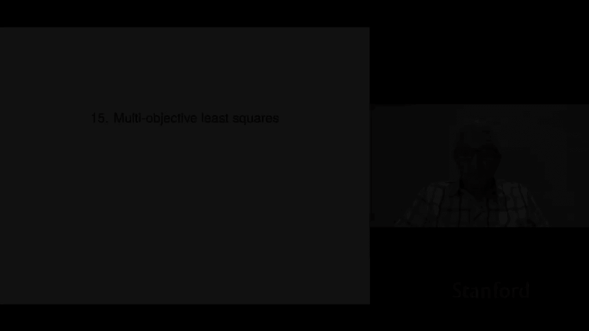
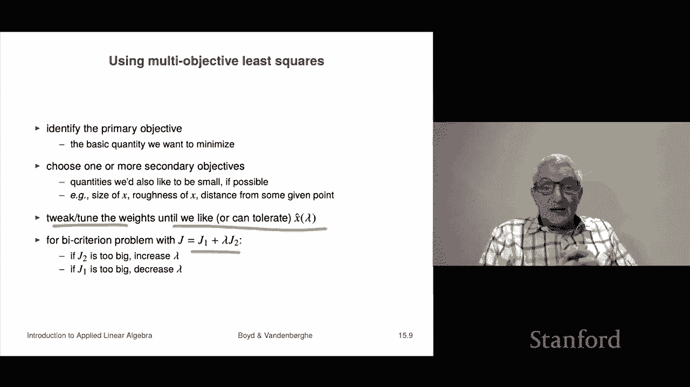

# P41：L15.1- 多目标最小二乘 - ShowMeAI - BV17h411W7bk

Chapter 15 is on multi objective least squares。 This is an extension of least squares in practice。

 it turns out we'm going to very quickly reduce it as a standard least squares。

 so we know how to do it， handle it mathematically， but it's very， very useful in practice。

So we'll start by saying what the multi objective least squares problem is。

So here's the problem What we have is we're supposed to choose an n vector X that's no different from least squares。

 but the difference is now instead of having one least squares objective or norm squared objectives。

 we actually have k of them so I have you know norm a1 x minus B1 squared but all the way up to norm Ak X minus Bk squared so I have k different things that I want small okay now here AI is an MI by n matrix。

 they can have different numbers of rows and B of course is an MI vector。

and we refer to the JI as the objectives in a multi objective optimization problem another name for that is a multicriterion problem because you have K things you care about the only thing that's absolutely settled is you'd like all of them to be small so that's the main that's that's the only thing you agree about but we haven't yet said like which is more important than the others that's coming。

Okay， now of course， in this case， you know， we know how to， if I asked you to minimize J1。

 you would know how to do that that's least squares J2 or J3 now what we want all of them small so that's that's how we're going to that's what we want to do that's the job here。

Okay now here we're gonna to follow a very traditional approach the traditional approach when you have multiple criteria is to actually add them up multi objectivesject is you add them up with weights so we're going to form a master objective called J and it is going to be a linear combination of the objectives for the K problems so that's J1 up to Jk and these weights lambda1 through lambda K they have to be positive that wouldn't make any sense if they were negative because that would be an encouragement to you to make that one big we want all of them small so we're going this is going to be our so-called weighted sum objective and some people refer to this as a scalarization of our multicriterion problem so our original original problem has k different things we care about J1 J2 up to Jk what this is is that we're going to scize it and we're going say we're going to get some weights and we're going to form a single scalar number J okay。

Now here I can multiply all these weights by any positive number I like and nothing would happen。

t it doesn't change the solution， it doesn't change the value of the Js。

 but it doesn't change the solution so it's very common to take lambmbda1 to be one and if it's not one I simply divide all of my other weights by lambda1 and I get a new set of weights where the first one is one and in that case people refer to J1 as the so-called primary objective right and usually that's the thing that you really actually care about being small and the others are things are more like deitorta like if possible please make them small okay。

And we can interpret the lambdas， it is lambmbda I is。

How much you care about JI relative to the primary objective so if lambda is five it says it real it irritates me five times more for J5 to be large than J1 if it's 0。

5 that says it's half it irritates you half as much and so these parameters lambda1 through lambda K or they're sometimes called hyperparameters。

And they're going they're going to be different and we're going to see that we're actually going to you know in practice you'll choose different values we'll see about that momentarily or in applications now an important special case of this is the so-called bi criterion problem that's where K equals2 and that means you have just two things you want small you want a a1 x minus B1 norm squared plus lambda times a2 x minus B2 squared and so here lambda is literally how much the second objective irritates you compared to the primary objective which is norm a1 x minus B1 squared。

Okay， now it turns out now here we just said this is the objective and now we would say， okay。

 what we're going to do is we're going to minimize this weighted objective。 Now we could do that。

 it turns out though we can easily using some tricks from matrices and vectors immediately reduce it to a least squares problem whereupon we know the solution that we don't have to actually re derive anything at all。

 So here's where you do it we're going to write that least square objective as。This。

 so this is lambmbda 1 norm a1 x minus B1 squared plus。And then the last one。

 which is lambda K times norm a K x minus bk squared okay。

 so that is our that's J here and it turns out we can write J this way Well。

 why is that Let's walk through it。This is a stacked vector here， Of course。

 Now the norm squared of a stacked vector is the sum of the norm squares of the vectors themselves。

 That's clear because this is just， well， okay，s that's completely let's clear。 Okay。

 but the norm squared of like， for example， this first stack vector the lambda comes out。

 the square root lambda1 comes out as lambda 1 And so this gives you this this first term gives you exactly that right。

 and this last term gives you exactly that。😊，Okay。Now I'm going to write this objective here。

 I'm going to write it as simply this as a least squares objective。

 I'm going to say that J which is our weighted sum multicriterion least squares problem objective I'm going to write it as norm a tillil the x minus b tilde where a til the and b tillilde are these things which are obtained by stacking the original data and applying the squared of the weights right so this is a tillilde and' that's b tilde so it looks like that Well but look if I walk up down the street and I say please minimize this you know how to do that that's you've known that for two chapters now you know how to do that and the solution is just you know a tillil the transpose a tillil the quantity inverse a tillilde transpose B period that's assuming that the columns of a tillil the are linearly independent which we're going to so what this means is we've reduced this multi criterion。

This scalar， this weighted sum minimization problem to a completely standard least squared problem and we know how to do it。

Okay。So you could work it out I mean it's good enough just to say it's that or you could write it this way if you like a dagger B I mean a tillilde。

 I should say a tilde dagger B it's the same same thing but you can write it out this way which is actually kind of a beautiful thing it says I mean okay very roughly speaking the least square solution is you know a transpose a inverse a transpose B and what this does is it actually basically splits the numerator and denominator I'm speaking very roughly because these are matrices and vectors but the numerator is something like this thing here and you can see it just forms or weighted some of the numerators and it says you take awayed some of the denominators now it's a matrix but if it's inside an inverse that's something like a denominator So that's it now you can calculate via QR factorization of a tillilde lots of ways to solve this problem now an interesting thing is that each of the objectives alone could。

wide or have dependent columns so that we'll see examples of that and now of course stack when you stack them to form ade。

 that has to have linearly independent columns， but the individual AIs do not have to。Okay。Now。

The B criterion problem right let's take one we're just going to look at two for now okay so we have J1 and J2 we're going minimize J1 plus lambda J2 remember that we can always just set the first lambda equal to1 and call the first objective the primary objective so we're going to do that here and then what's going to happen is we're going imagine that we're going to solve this for many different values of lambda and we're going to get something called we're going to call that x hat of lambda now that's an n vector and it's a function of this weight lambda lambda has a very simple interpretation if lambda is small it says we really care much more about j1 than J2。

If if lambda is really big， it means that we really care much more about J2 than J1 and if lambda is one or near one。

 it means we kind of care about them equally and so we'd like you to minimize the sum now when you find this point which is just least squares we know that's very simple then these are these points are what's called for the bike criterion problem peririto optimal that's named after an Italian mathematician and。

You know， someone who worked in economics peririto and here's what it says。

 it says a point X X had or x is peririto optimal respect to J1 and J2 if the following in fact let me explain it this way suppose somebody says well I've got an x and someone says oh yeah well I've got an x2 this is in the context of this spike criterion problem。

And then then people say， well who's is better my X or your x let's find out Well。

 it depends on the different values of J1 and J2 for the two for the two proposed candidate points right so now if one person let me just let me write down if this is J1 and J2 and this is like x and x x and Xilde。

 there you go and if this is like you know 10 and8 if Xilde comes along and it's nine and7 right then for short there's no discussion Xild is better why because you care about two objectives J1 and J2 and Xilde beats x in both objectives so no discussion we don't have to talk about lamb does nothing。

JXility is simply better period， Okay， now that changes if this is。11。Okay。

Now you see this sort of a tradeoff and when someone says you know help us help arbitrate this fight between these two people one is proposing x one is Xtility and we say well。

 let's take a look at their objectives you would say that okay well look in J1 XilD beats it's lower number it's better okay but in J2 x is better so what you would do is you'd say there's a tradeoff here and in fact is you can't say which is better x or XilD I mean that's the whole point。

So the only thing that's really in multicriterion by criterion。

 the only thing that's really clear and unambiguous is if my solution has a lower objective。

 all of the objective values are lower than I win it's that that's the only thing that's clear。

 but if some of mine are worse and some of yours and some of yours are better than some of mine then it's like who knows who's better you can't say so now I can tell you what Purrito optimal means？

Prito optimal means it's a point where no other point can beat you and I'm going to define beating in this context is to mean that it has a smaller value of both objectives okay so and in fact in economics I think they refer to this as dominating right so in this case let me let me restore this to something that dominates So in this case you would say here that x till dominates X meaning it's simply better。

 it's better on both objectives right so that means to dominate and then you'd say a point is peririto optimal。

 if it is not dominated by any other vector okay and what that says is so here it's burto optimal。

 if there's no point Z which beats it in both objectives and beat means smaller value of J J。

And now when when you very lambda you're going to get what's called the optimal tradeoff curve you'll get different values of x and they will have different values of x1 and sorry different values of J1 of x and also J2 of x and I'll change but every single one will be will be a peririto optimal and then this maps out what's called the optimal tradeoff curve so we'll look at some examples so here's an example。

We have a1 and a2 are both 10 by5 B1 and B2 are 10 vectors and what we're gonna to do is we vary lambda over well。

 this is on a logarithmic scale over a very large range right so these are very small lambdas and these are very large now what's happening over here and this just shows you the value this is just five values This is showing you x hat okay so now for 10 of the minus-4 it says that we really basically care about only only J1 So we presume that whatever this is this solution here。

 these five numbers correspond to x hat when you only minimize J1 that I assume conversely。

When I take lambda super big， like lamb 10 to the fourth， that means I really mostly care about J2。

 I don't even really care about J1 Okay and here you get these other numbers they're right here。

 okay and I presume that is the solution of simply minimizing norm a2 x minus B2 that's it Now what's interesting is what happens in the middle and it's actually super interesting right because I mean if this was just sort of a line connecting these two。

 it would not， you know， it wouldn't be that interesting but what's interesting is that weird stuff happens in the middle So let's see。

 I mean， let me just mention a couple of things I mean。

 so this is very strange right here's x3 should have the value I don't know 0。

05 or something in the first thing and to minimizeizing the second one， it should be like minus0。

1 what's weird is in the middle it sort of goes up and then down again So the point and this is a baby example so。

The point about this is is just not clear at all what's going on here or why right I mean this is it here's how they perform So over here what we' plotted is the same value of lambda is from 10 to the minus4 to 10 to the4。

And let's see what that does to J1 of Lambda and J2 of Lambda。

Here at J1 of lambmbda in fact for you know basically lambda up you know as long as lambda is less than around 0。

01 J1 of lambmbda is really small and presumably that's its minimum value which is I don't know it's called six and a half I don't care right six and a half now on the other hand when lambda once lambmbda is big you're basically minimizing J2 and I assume that the solution of that is whatever that I don't know what that is let's call that four okay so it's about four。

Okay so that's that what's interesting is you can see that in the middle you get weird stuff as you start carrying as you move lambmbda out this way you're carrying more and more about J2 compared to J1 and so what happens is you start doing worse on J1 but you're doing better on J2 it's going down like that now some people plot this in what's called a tradeoff curve this is what people would call a tradeoff curve this is your first objective。

Right and this is your second objective here J2 right and this is a good way to understand how this works so I can show you some examples anyway so these are all Pirito optimal point this is the curve given by the the value the tradeoff curve of J1 versus J2 as you vary lambda and so here it is and it's kind of kind of cool and people talk about like the proverbial knee of the curve and stuff like that that's so。

In this plot being。To the left and down is good。Because being to the left means you're beating on the primary objective down means you're beating on the secondary objective so this is the idea these would like these three these three different specific ones actually you can visualize a lot here like for example。

If if if I had a problem and I had you know this point this point this point and this point right and say let's talk about these four different choices of X right so we can say some interesting things we could say that。

This one and this one are dominated， right dominated， if you want to know who's better。

 who's better than you you make， you you look at everything that's to the left and below you because left means you beat on J1 below you means you beat on J2。

 So we look at this。 and we can see look this this point dominates that one。

 And that means you should never choose that one。 I mean， if these are the things you care about。

 This one is also dominated。 It's actually dominated by both of the other two。

 But these two are neitherter is dominated。 There's no among the four points， there's no point。

 And so here， the idea would be， for example， here， if I made something like this。

 that's that's a point we can achieve。Oh you cannot achieve that， that's what's being asserted here。

There's there's no X that would land you in that region if you did then this is a big old lie and that is not the that's not the optimal tradeoff plot okay so this is the the idea and you know these ideas have a lot more application than just these squares and it's something you'll see in a lot of classes I'm guessing but it comes up every time there's an optimization problem and you care about more than one thing you just form a weighted sum and minimize that。

Now， the way it's used is you use the weighting， the weights as knobs to kind of achieve what you really want。

So that's the next discussion is so here's how you would use multi objective least squares the first thing you do is you identify the primary objective like the basic quantity you want to minimize like you'd say I don't know doesn't doesn't matter what it is it's this is the main thing I would minimize。

Then you choose one or more secondary objectives and these are sort of things like， if possible。

 could you make this thing small or if possible， could you make my decision today look like yesterday's because you know it's just that encourages smoothness in the decisions I make right or I would like you to minimize the risk of this portfolio but I would like you to do it with as few trades as possible there's something I mean with a small trade vector I should not have said a few trades because that's a different problem I should have said with a small trade vector So trade as little as possible to minimize to also make the risk small So it would be things these are the kinds of things we're talking about okay。

Now the way this works then is you tweak or tune the weights until you like or at least can tolerate X hat of lambda right so that' that's how that works and the rules are really simple right that here if if you think J2 is too big if you're uncomfortable with it。

 increase lambda to let' sorry increase lambda which is lambda2 increase lambda that says you're putting more weight on that second objective and when you minimize again it's going to come out smaller by the way J1 is going to come out bigger so if you think J1 is too big。

Then you have to decrease Lambda right which is the other way to do this right and this is how this works and sometimes this is done in an organized way。

 but more often than not it's just done by just fiddling around literally just like this。

 you type in a lambmbda， you'll look at the solution。

 run some simulation or something to see if you like it。

And if you don't you tweak lambda and then when you get bored you quit and you say that's my X so this is kind of how it's used in practice this'll be much more clear when we look at some examples which which we'll do next。

