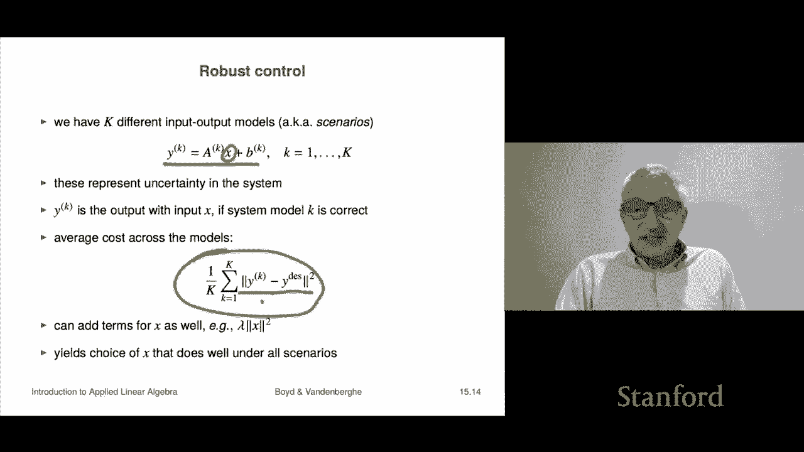

# P42：L15.2- 多目标最小二乘控制 - ShowMeAI - BV17h411W7bk

We're now going to look at applications of multi objective lease squares to the general area of control。

So。A general way to say what control is it's something where you're going to choose an action or an input to achieve some desired output or result so let's see how that looks we'll have an n vector X that's going to correspond to our actions or input by the way a very traditional symbol for that is U not x but we'll leave it as x here。

An M vector Y is going to correspond to the results or the outputs of using the input of using the input X。

 so that's what y is so y is going to be the result and then the inputs and outputs are generallyated by a linear or aine input output model and that looks like this this says that for example。

 since we think of x is the another name for x is the actuator that's an old school name for it if x is zero roughly speaking if we do nothing。

 then the output would be would be B because you'd have a times zero plus B otherwise this aine model kind of gives you what happens if you choose the input to B X Now the matrix A and B they can come they're known and they can come from all sorts of things they could come from first principles physics models or they could come from data fitting right that you could actually just fit a data。

To make this to make this equation approximately hold。NowThe goal in control is to choose x。

 that determines why， of course y is a function of x。

 and we want to optimize multiple objectives that pertain to x and y。

 and so that's why we're going to use multi objective at least squares。Okay。

 so typical primary objective would be something like this I have a desired output or target output and my first objective often is let's see how close can I get to my target it measures my deviation from the desired output okay so and why desired here is given the vector。

嗯。🤧Now a typical secondary objective is something like this。

 it's often just J2 equals a norm x squared and the rough idea is that expresses our idea that the input we put in should be small right and this leads to some kind of efficiency you want to get close to the target but you don't want to do it with a gigantic x that's kind of the idea or another way to do it is you'd have some nominal nominal input x and your secondary objective might be not that x is small。

 but that x is close to this x nominal squared by the way。

 this comes up in sequential in sequential control where you do this every every period or time step or something like that and a lot of times your secondary objective Xno is the previous control action and so what J2 says is。

Please do what I like what I want to happen， but at the same time my please make my control action or input this time close to what it was last time and that encourages smoothness of your control actions over time Okay so this is the idea in multi objectivejective control。

Let's look at a， this is actually a。A specific example of that。

 although people doing this would not would certainly not call it control。

 but nevertheless here it is it's product demand shaping so here's what's going to happen is you have a set of end products and with a price vector P current price vector which is positive and we are going to change the prices by this relative price change vector delta price right so for example if I told you that Delta price sub3 equals minus 0。

1 that means roughly speaking we are going to reduce the price of product 3 by 10% that's what that means right plus means you increase the price。

Now that changes that induce if you change the price of a bunch of products。

 it's going to change the demand for them， and these are related by this linear equation here at ED E superscript D is the elasticity。

 price elasticity of demand matrix， and it's a matrix where the entries tell you how much the change in demand you get for a product。

As a function of how much you change all the prices for your products， okay。

So that's that's your linear model Now here's what we want to do somebody comes to us and says I would like that's the target demand I want Delta target and maybe that matches what what our production capabilities are capable of producing so that would have all our factories and our supply chain running you know full tilt anyway that's that's the target demand so we would like the new demand that's going to be or the change in demand I should say the change in demand should be near a in a target change in demand and that's what J1 tells us so that's the primary objective。

Now at the same time we want to get close to hitting our target change in demand。

 but at the same time we don't want to change our prices like crazy and that's a secondary objective that would be J2 and so that says you know please trade off getting close to the target change in demand while not if possible changing your prices too much so that would be a very common thing and then here we would minimize J1 plus lambda J2 lambmbda is this parametermeter or some people call it a hyperparameter and we would adjust lambmbda and see what happens and it's kind of clear what would happen right if lambmbda is very small。

It says basically for all purposes， minimize J1， it says get as close as you can to Delta the target change in demand。

 okay，elta Delta target。By the way， if E here is inver is invertible。

 so it's an n by n matrix if it's invertible， then basically as lambda goes to zero。

 you would take the solution which is just simply E inverse at times deelta target okay and that would actually make this thing your J10 okay so that's how that would do now that might you know if this inverse this thing here。

 even if it's even if E D is invertible this could involve like very large price change like plus minus 400% things like that by the way at that point it's not just a question of you don't want to raise your prices by 4 x or divide them by a factor of 7 it's not just that you want to do it it's also this model is wrong there know that model is supposed to be good for price changes that are plus minus 15% let's say and it is not it's not even supposed to model what happens if you。

Prices or triple them or divide them by five so so this secondary objective is there to keep the price change from being big Okay now on the other hand。

 as lambda gets super big we're just minimizing J2 J2 has minimize the change in prices and so what happens is as lambda gets bigger and bigger this will suggest price changes that are more and more timid they are smaller and smaller if lambda gets really big then deelta price as in the limit of lambda going to infinity we get deelta price equals zero and that says。

Don' don't touch the prices so this is kind of the idea okay and so the idea is this the whole the whole setting you're going to trade off the deviation from the target demand that's J1 with the price change magnitude that is going to be J2 okay so this is just another example I would call it control I think other people would not and people who do this kind of thing would definitely not call this control but it's okay。

Now I'll mention actually a fairly advanced topic it's robust control。

 but we can do it so robust of course means something that is can handle changes and you know so you would say something like oh is your system robust to something and something is some change right you know that kind of thing so robust control refers to a control scheme that is that can handle uncertainty in the model so this is an advanced topic but it's well within scope of what we're doing now so I'm going to tell you about it okay so here what it is is a very common way it's actually quite effective what it is is that we're going to have K different input output models and these are with the superscript here so superscript one and these are sometimes called scenarios oh sometimes regimes like in finance you would hear people say that like in which regime are we operating？

or which scenario are we operating in so here we have these input output models it looks like that and what it is is you're going to choose a single X and then the we interpret y superscript K as that's the output。

If the system model K is correct that's what that means that's what why superscript K is Now notice is kind of it's interesting here right of oh。

 I should say， you know in applications， these a case are I mean。

 if they're wildly different from each other then it's game over and you should just go home because if someone says to me what if you say what's your model and they say here's my model and they give you 10 models and they're all completely different you're just like okay。

 I quit there's no point you know even going any farther So normally in fact what the a cases look like is they're close to each other but they're not the same they're not quite the same right So for example。

 if we if we actually obtain these models by fitting on data then。

These could be10 different these could be 10 different times that you fit the model。

 you fit the model on Monday's data， Tuesdays， Wednesdays and so on and each time you got a model and they're not quite the same they might differ in the second digit。

 something like that and that's the situation you should think about here okay。

So what we're going to do is we are simply we won we would like why to be why desired。

 so we'll take this objective， which is the deviation of y to y desired。

 but this is under the Kate scenario and what we're going to do is we're simply going to take the mean square mean square deviation。

Something like this right so that's that's how we would do this now I mean and it's interesting because what it's saying is someone said what are you doing you say。

 well I'm choosing an input X and they go what's your goal and you go well I want the output to look like y desired and they go cool how do you do it and the answer well it's a bit what you say is I don't really quite know the relationship between X and y In fact it could be any of these 10 things。

So that's it and so what you're going to do is you're going just going take the mean you're gonna to make the mean square error small so that's that's robust control and this will yield a choice of x that kind of works well under all scenarios I mean that's I mean basically in a mean square sense it's going to work well in all the scenarios it's not going to you know just pick one and make that one you know make one of these zero and the other's big that's the idea so that's robust control it's an advanced topic but it's it's easy to understand it's also super super duper useful in practice。

