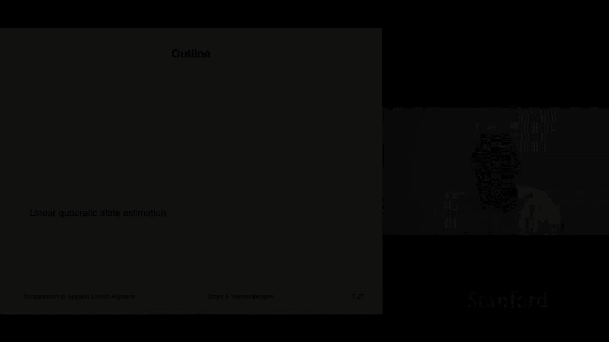
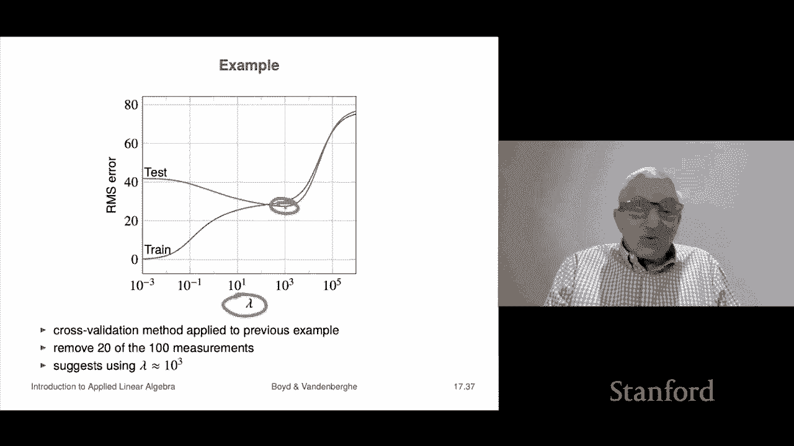

# P49：L17.3- 线性二次约束状态预估 - ShowMeAI - BV17h411W7bk

Our last application of constrained least squares is linear quadratic state estimation。

 like the other two applications， you can take an entire course on nothing but this and it's also like the other two very widely used in a lot of application areas that's got other names like Calman filter or something like that。

 but it's stills used everywhere。All right， let me give you the setting actually。

 the setting is very similar to the control problem， but actually the problem is quite different。

 although they are they are also closely related， I'll explain that。

 So we start with a linear dynamic system model that's exactly what we did before Oh there's a bit of a difference here In fact。

 a bunch is different so I'm gonna to emphasize it compared to control。 So here I have an input。

 but I'm using the traditional term Wt So Wt is actually not an input that we have control over Wt is actually supposed to be like a weird disturbance or or measured it's something like it's process noise or input disturbance right that's the idea and here Yt is not just CTtxt it's also got this Vt term and Vt is the measurement noise or measurement residual and that's a P vector so's so you have these measurements that's the idea。

Now in the state estimation problem here here's a statement of the problem， I'll tell you what AT，BT。

 CT are， and I'm going to tell you what the measurements are。

 y1 through YT so that you know and your job is this estimate or guess the state sequence。That's。

 that's the goal Okay， oh， I should say that these two noises。

 the process noise and the measurement noise， WT and VT。They're not known。

 but they're assumed to be small， and that's going to be how we're going to formulate a constrained least squares problem out of this to solve state estimation problem。

Okay。So here here's how we're going to formulate it。

 we're going to say we're going to minimize again there are two objectives so and basically what these come down to is very simple。

 this is nothing that's V1。This is v capital T and so basically that the two terms are here we can either come up with a state sequence where we make。

The W is small or we can make the V small and that's actually these are the two objectives and of course we're going to scize it and with a positive parameter in between them to trade off and so this is the measurement error plus the process error and then we'd say subject to the dynamics right so what we're really going to do is is we're actually the state the variables in our optimization are going to be the state sequence also the input noise sequence right no we don't care about the input noise sequence but the idea we need it so that we can express the idea that it's small。

Okay， so here they are the measurement noise is simply the sum of the squares of the VTs the secondary objective is going to be the sum of the squares of the processed noise and lambda as I said is a parameter that we can trade off now I should say here in the state estimation problem unlike the control problem。

We're actually going to have a non ad hoc a principled method by which to choose Lambda。

 we'll see that we're going to be able to do that by cross validation， so that's coming later。

All right， so we are going to take this problem and we are going to do the same thing we do in the control and we're simply going to make it a giant constrained least squares problem I say giant because you know it could have thousands of variables but again it is just simply not a non problem so。

Okay so all right here it is， so this is our objective here's our objective is we have to minimize the sum of the squares of the process noise plus lambda times the sum of the sorry sum of the squares of the measurement errors noise plus lambda times the sum of the squares of the process noise that's the w's and so again we're going to write it as a giant constrained least squares problem we're going to concatenate all the vectors into one vector of all of our variable so x1 up to xt w1 up to wt minus1 which is going to concatenate to one vector and now we have to say what is a til d b tl d c tild and d tild。

Well here they are actually they look shockingly close to the same to the matrices you saw in the control case they are very very very close and that hasn't escape people the fact that there's this very close mathematical connection between the control problem and the estimation problem in fact I guess people refer to these as dual problems which I'm not going to go into but it means that they're intimately related note that they're actually very different though right in in the control problem there's an input that we imagine that we have control over and we're saying what should it be like how should I operate my airplane you know or something like that right？

Here， however， we observe some measurements and the goal is to estimate the state so it's really it's a bit different。

 Okay， so I won't go into auditing this or maybe we can take a look at11 you know。

 these I think by now you should be able to read this that C til D times z equals d tilde this first row is basically a state update It says a1 times x1 minus x2。

 that's this term that's a1 times x1 minus x2。Plus， B1， U1 equals 0。

 but that's that's the that's the state。 that's says x2 is a is a 1 x1 plus B1。

You want that so this is dynamic equations， okay。So we solve this problem and it's just a big constrain least squares problem it's once again very sparse so we can solve it extremely efficiently actually even more efficiently than that because it's more than it's actually not dis sparse but it actually has a structure called banded it doesn't matter it's just we can solve it super efficiently okay。

Now we're going to talk about something else which is missing measurements。

 and this is going to be our pathway to a rational method。

 a non ad hoc method for choosing the parameter in here， the Lambda。Okay。

 so missing measurements goes like this let's suppose they have a bunch of measurements Yt but only for t in for certain times so for example at certain times you just don't get any measurements Oh by the way I should say we can make this even more complicated and say that certain individual components of y usually are associated with different sensors and so like we could say that oh in any time period one or more sensors might fail and then so we can make this more complicated if we like。

 but this is good enough so what we do is we just say at certain times we just we have no measurements just there just aren't any sorry I'd like we don't have any measurements。

Okay， and so script T is going to be the subset of one to T for which we have measurements right so no and if you want to think of measurements hered be a typical application of this in navigation。

We could be trying to figure out you know where where we are or where a target is and the different measurements could be things like multiple radars illuminating it and making estimate of position or something like that。

 or if it's on a single， it's a single airplane， you could be attempting your estimates could be things like it could be accelerometers。

 some kind of a radar altimeter， it could be all sorts of things like that， okay。嗯O呃。All right。Oh。

 measurements for T， I should say， there we go， not in T are missing， there we go。Small typepo。

 that's fine。To estimate the states use the same formulation。

 but what we do is we only of course take what we do is only for when we have the measurements。

 do we contribute to this J me thing？Now。If when I perform the state estimation problem。

 I'm going to get x subt for t not in script T and then that's going to be my estimate of Y hat and you can see that we're getting I mean you should be it's kind of cool because you'd say。

 well I didn't make that measurement in that I didn't get a measurement that period and then we can say。

 oh yeah， well we think the measurement would have been had you had a measurement it would have been Yt hat which is CxT hat。

Okay， now by the way， that's the key to being able to cross validateate obviously because I just I pretend that a measurement didn't come in and I don't have it but the truth is I have it in other words I keep it I keep it in reserve exactly is in data fitting it becomes a test measurement okay so I don't give it to the state estimator and the state estimator still pretends it's missing and says oh sorry I don't have that it estimates it and then the state estimator is going make a prediction of that but I've secretly held back the actual measurement Yt and now I can compare Yt and Yt hat。

And if they're close， my state estimator is doing really well。

 and that's exactly the same as like an out of you know out of sample test or some kind of validation test in data fitting。

 in fact it's precisely that。All right， so we're going to look at an example and it's got that's the dynamics matrix A。

 they're constant， that's B， that's C， and this is essentially it's a very simple model of a mass moving in a two dimensionional plane where Xt is its position and its velocity。

 right each of which is a two vector， so it's a four vector。

And then what we're going to get is we're going to get the true position that's CTXT plus WT and that's going to be a noisy measurement position so what C says is we're going to get a position we're going to get a position the X and Y position estimates and there'll be noise on it so it's actually quite simple and we have100 we'll do a horizon of 100 times steps。

Okay so let's take a look at it so here's here's here's what you would note the input to the state estimation problem the green circles show us the actual measurements made right the black line shows you the actual trajectory of the state okay now of course in the state estimation problem we don't know the dark line right that's in fact the whole goal is to guess the dark line now you know you can look at this in your eyeball can see that。

You know， these are the estimates of the state your eyeball can see that you know it looks something like the black line because they kind of follow each other okay so hopefully that will emerge from from this state estimation method okay so we have 100 noisy measurements。

All right， let's do state estimation now with different values of lambmbda so here's lambda equals one and the blue line shows you our state estimate and okay。

 look your eyeball tells you right off right away well look that's not good because it's actually what people would say it's following the noise that's what it is。

This one is following the noise when Lada is 1 thousand00 that's doing very nicely。 thank you。

 that is actually a very nice estimate right there of the state。

 And was 10 to the five it's not a good estimate now and and you we can easily explain this roughly speaking when Lada is one。

 it means you trust the sensor of these noisy sensor measurements， that's these green circles。

 you trust them too much and as a result your estimate of where are you is wiggling around too much I'm anthropomorphizing this but you get the idea when lambda is 10 to the five basically you're saying you barely trust you don't trust the sensors like at all and so you want you want to what you're going to do is have large sensor errors to explain what it is。

 and so you end up with something that looks like that right so that's the idea okay now in this case well okay we know what the exact。

it's kind of clear that lambda equals 10 to the three is about right。

 but let's see how we would do this with cross validation or validation， I should say。嗯。

So here's what we do we just randomly remove 207 of the measurements and use that as a test set then what we do is for you know some you know 10。

 2030 values of lambda， we do the complete estimation problem and we use the other measurements and when they say what happened to the 20% of the measurements that aren't there。

 we just say missing dismissing。Okay it's a lie we actually have those measurements we're just holding them in escrow so that we can actually see how well our system works our state estimation works and then what we do is we evaluate the RMS measurement error on the test set that's fair because we're actually you know we've held back those things and we're actually checking like how how big is the RMS then what you do is you choose Lambda to approximately minimize the RMS test residuals sound familiar it should because this is exactly data fitting with regularization。

Okay， so for that example， this is what it looks like as I increase lambda。

On the training set I just get worse and worse right but on the test set it's actually super interesting that as I increase lambda I start I actually start tu better I go from you know above 40 down to I don't even know what that is high 20s right and it also kind of suggests you should pick lambda right in and there which is you know coincidentally what we did now above that is you get very bad examples and sure enough lambda equals 10 to the three here is quite reasonable and now look the reason you want a method like that。

Is is this is that obviously in real applications， we don't know the state the actual true state trajectory we don't know it because that's the whole point of the problem is to estimate the state trajectory so you don't have this black line here to guide you and not to mention this doesn't happen usually in two dimensions or whatever because there are four dimensions because that's just way too small a problem right so this is and then like you're on your own trying to figure it out and that's exactly where this kind of cross validation method will actually allow you to do this。

