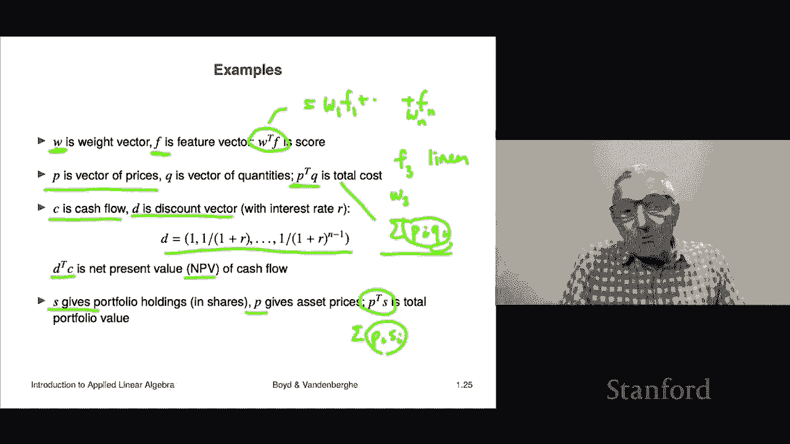

# P5：L1.5- 向量与内积 - ShowMeAI - BV17h411W7bk

In this section， we're going to talk about the inner product。 That's an operation on vectors。

 It's a very important one that we're going to see and use a lot in the course。

So the inner product， it's also called it's got a lot of other names。

 It's also called the dot product。 That's a very common name in physics。

 Some people call it the bracket between two vectors。 But what it is it's an operation。

 It takes two vectors。 It takes a and B to two vectors。 They have to be of exactly the same size。

 And the inner product has a weird notation that we're gonna understand later in the course。

 It looks like a with a superscript T and then a B。 And as I said later。

 this notation will become clear as to what it means。 But here's what it is。

 It's actually pretty simple。 you simply take the product of the corresponding entries in the two vectors。

 and you add up， you add up those products。 That's it。

 Okay so some other notation that you would see would be with these angular brackets。

 That's actually。😊，Very common。You might see that with a bar in between。 another one is this。

 That's not very common。 And this is the one where I think which gave the operation its name。

 You put a dot between a and B。 And I think in some in some mathematical communities。

 people actually literally say a dot B。 That's how they say it like to their friends and stuff Okay let's see what a quick example。

 here's 2，3 vectors。 there's -1，2，2。 and another three vector is 1，0-3。

 And to take the inner product of those two vectors。

 what we're going do is we're going multiply the first entries。 that's -1 and 1。

 Then we're going to multiply 2 and 0。 And then we're going multiply 2 and -3。

 And we're going to add those three numbers。 And so that's going give us -1 plus0。 and then -6。

 And sure enough， you get -7。 That's the inner product。

 Okay so's that's the mechanics or the plumbing of how you calculate an inner product。

 It's the sum of the product of the corresponding entries。 right。This should have no meaning to you。

 it will when we look at examples。Okay， so here are some properties of the inner product。 And again。

 like many of these things， these are extremely boring to work out and stuff like that。

 But you do have to know， you do have to know these properties。

 and it's also very important to stay in your toes here to make sure that you understand each of these equations let me go through them a little bit。

 and maybe I'll audit1 or two of them and we'll try to see what they are。 Okay。

 so the first one says that the inner product of A and B is the same as the inner product of B and A。

 Well， that's clear because both of these are equal to you know， a1。

 B1 plus dot dot dot A N B in Okay， now if I switch the order of B and A。

 then I'm just taking the products instead of A1， B1， you're gonna see B1， A1。

That's the same because two numbers， you can， if you multiply two numbers in either order。

 you're going to get the same thing。 So this is the same。Let's take a look at this equation。

 And what I mean by auditing is you have to go through and make sure you understand what absolutely everything in it means。

 because it's very easy to see something like that and just have your eye go over and go， yeah。

 that's cool， whatever。 But let's， let's look at it more carefully。 Okay。

 on the left the first thing you see where my cursor is。 You see gamma times a。 Now here。

 gamma is a scalar。 And so gamma times a is a scalar vector product。 right， And so what's inside。😊。

What is inside those parentheses。 That's a vector。 That's an n vector。 And this says。

 take the inner product of that n vector with the vector B。 That's the left hand side。

 So the left hand side is a number because when you take the inner product of two vectors。

 you get a number。On the right hand side， we see something different。

 We see first take the innerproduct of A and B。 That's this term here。 And then it says。

 that's a number， right， And then you multiply that by gamma。 So interestingly。

 gamma on the left multiplies a vector。😊，In the right hand equation， gamma is multiplying a number。

 And what we're saying is that these are equal。 Now， this is kind of obvious because this one here。

 The first one says multiply every entry of a by gamma。

 then multiply those entries by B and add it up。 You know， And then this thing says something like。

 you know， multi take all the products of AI times B I， add those up and then multiply by gamma。

 Well， those are the same thing。Okay， and you'd have formulas like this， for example。

 A plus B transpose， sorry， getting ahead of ourselves。

 I let you on the secret of what that notation is about。

 And that's actually something we'll cover later in the course， so。Ignore that。

 The inner product of A plus B and C turns out to be the inner product of A and C plus the inner product of B And C。

 And again， these are very easy to verify。 And you can you can get fancier things like this。

 This is a socalled like it's a distributive property， right， It says that if you take。

 this is a vector sum here。 right， And then you have to be very careful because these are the these are the sum of real numbers。

 right， And so it says if you have vector A plus B In product with C plus D。

 that's the same as as actually calculating all four inner products of a or B with C or D。

 And then adding up those four numbers。 And it's the same thing。 Okay， So allright。😊。

Let's look at some very basic examples and completely generic。

 So this says that if you take the inner product of a unit vector with a vector， the if unit vector。

 it just picks out that entry。 Well， that's easy to see because in fact。

 E I transpose a is gonna be well， lets let's work out what it is。

 Let's let's actually just do an example。 Let's take a equals 2，1，-5。 and let's consider E2。

 the second unit vector of dimension 3。 and that's 0，1，0。 And then let's calculate E2 transpose a。

 sorry， inner product of E2 and a。 Well， that says take the product of these two guys。

 product of these product of these。 Now that's a bit silly because whenever you have a0。

 you're not really， I mean， multiplying these two gives you0。 Multiplying these two gives you 0。

 the only one that gives nonze is this and it's a1。 So we get a one。Right， and sure enough。

 that is exactly。A2， Okay， so that makes sense。 here's another one。

 If I take the inner product of the ones vector with a。 now。

 the ones vector remembers the vector with all ones。

 It says that you get the sum of the entries of a。That's that's interesting。 Okay。

 And another one is a transpose。 that says take the inner product of a vector with itself。

 Here's what you get。 Well， what you do is you simply take。

 you take the products of the corresponding entries。 But the corresponding entries are the same。

 They're all， they're AI。 So you take those， you get AI squared and you add them up。

 So you get the sum of the squares of the entries。 that's also going to play a huge role in the course moving forward。

 right， So so that says that the inner product of a vector with itself is the sum of the squares of the entries of the vector。

😊，Okay， so these are generic examples。Let's see how they come up in practice。 Well。

 let's take a look at this。 Here's a very common one is let's suppose that F is a feature vector。

 So it's got entries corresponding to， oh， it could be， let's say a bag of words model。

 So each entry in F。Tells you it could be from a dictionary。 It's a word count vector。

 It says that every every entry of F tells you how many times a certain word appears in a document。

W is a weight vector。And it's just a vector of numbers。 It's got entries of numbers。 W transpose F。

 You could， you could interpret。 And， in fact， people do interpret that as a score。

 It might be relevance。 For example， with large meaning it's highly relevant。 And by the way。

 if it's small or negative， it means it's not relevant。

 so And then the the entries of W are actually very interesting here， right。

 because this thing is going to be W1， F1 plus， And then you go over all of these plus W N， F n。

 right， And so we can interpret let's suppose that F3。

 let's suppose that F3 is the number of times the word linear。Appears in your document， right。

 Then if W 3 tells you the weight on that word。 And if this was a search for things relevant to like linear algebra。

 we would imagine that W3 would be a large positive number。

 And that says that the more times in your document。

 you say linear the higher the score you assign that document。 Okay， so。

 so this is just a generic example。Here's another one price quantity。

 So here I have P is a vector of prices of， let's say n different N different commodities， right。

 So P1 is the price per unit of commodity 1 P is the price per unit of commodity N Q is a vector of quantities of those of those products。

 right， So thats sometimes， for example， it could be a bill of materials。

 That's that tells you how much of each of those commodities you need or or how many of each of those things you need to produce one unit of something or to complete one task。

 right， That's that's a bill of materials。 And so if you take the inner product， P transpose Q。

I misspoke again inner product of P and Q。You're going to get the total cost。

 And the reason is pretty simple。 That's equal to some P I， Q I。That's beautiful。

 Inter Q Y is the amount of。Commodity eye that you need， right？In units， right。

 P is the price in dollars per unit。 And so the product of these two tells you， sorry about that。

 The product tells you the tells you how much， that's how much you're going pay for commodity I。

 You add it up over all commodities and that's your total cost， right。

 So this is one where so inner product between a price vector and a quantity vector gives you a total cost。

Here's one from finance。 It's an interesting one。 This comes up all the time in finance。

 And it goes like this。 C is gonna to be a cash flow vector， right So it's a cash flow。

 What that means is C 1 is the amount that that you are paid now C2 is the amount that you're paid paid in the next period。

 let's say it's yearly。 So a year from now， you get a payment C2。

 C3 is the amount you're paid in two years and so on。 Okay， then D is a discount vector。

 And I'm going to define it to be this is the vector whose first entry is11 over1 plus R。

1 over1 plus R squared and so on。 And here R as an interest rate， like 5% or 。05。

 And what this does is the first entry then would be1 The second entry would be  one over1 plus R。

 So that would be 1 over 1。05， which is about 0。95。

 And what the discount vector tells you is really interesting。

 It tells you how much is a dollar paid in different in different periods。How much is it， What's the。

 what is the current equivalent now， right， So people call that the net present value。

 And what this says is that if I promise to pay you a dollar in a year and the interest rate is 5%。

That's worth about 95 cents right now。 And you can figure out why that is because although I'm going to give you a dollar。

 it's going to be in a year。 And the difference between having a dollar now in a dollar year from now is if I had a dollar now。

 I could put it into the bank and earn 5%。 actually， interest rates right now or not 5%。

 But nevertheless， this is the idea。 Okay， so here， if you take C transpose D or D transpose C。

 sorry， in a product of D and C in a product of C And D， Same thing。

 What you get is you add up all the cash flows But with the discounts。

 and you're actually taking all of those cash flows and you're， you're making it。

 what is the current。Value of that in current dollars。 And that's going be。

 that's called the NPV net present value of the cash flow。 Okay。

 so if you have a bond or something like that or a mortgage or a loan， anything like that。

 if you simply do this， if you add up the discounted cash flows， that's called the net present value。

 okay。Last one example is also from finance。 So here S is a vector that gives you the portfolio holdings in shares。

 Like suppose it's， you know， it's Apple， Google and Facebook。 fine。 then so for example。

 if it was like 12 comma3 comma 4， that tells you how many shares of Apple。

 Google and Facebook you have。 that's your portfolio。

 P is a vector of the same size in my running example， it it's three long。

 and it gives you the current price per share of Apple。

 Google and Facebook right And if you if you take the inner product of PN S。

 that's the same as some Pi Si， and here S is the number of shares。

 Pi is the dollar dollar value or dollar price per share。

 And when you multiply about Pi S I is precisely how much what's the dollar value of your holdings in each of these things。

 Apple， Google， Facebook。 and you add them up and you get the total value of your portfolio。

 Okay so these are these are just some examples， but they should make it clear that inner product。😊。

Do in fact come up in many， many applications。

