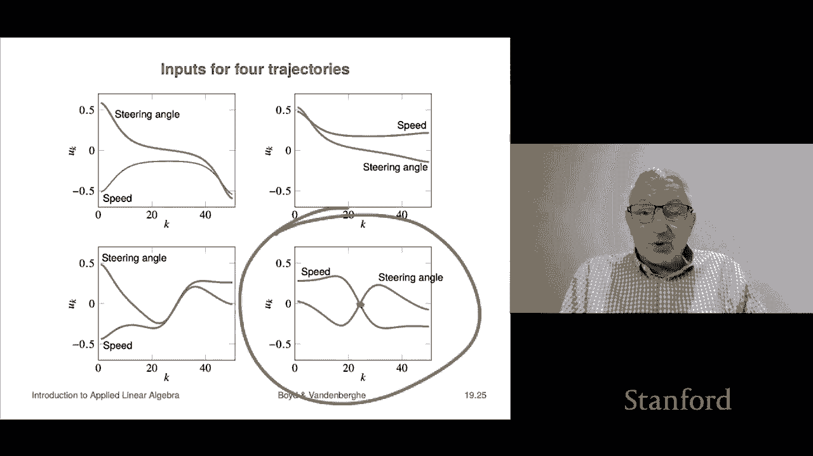

# P54：L19.2- 拓展拉格朗日法 - ShowMeAI - BV17h411W7bk

The next section is on the augmented Lagrangian method。

 which basically is an improvement on the penalty method。

 specifically it's a method that has actually all the benefits of the penalty method。

 which is to say it kind of works or at least as a heuristic it works。

 but it doesn't require that parameter mu to become infinitely large before you get a good solution。

 so that's actually and in practice it also actually works better。Okay。As I said。

 drawback of the penalty method is that new this penalty parameter in UK increases rapidly and it has to get big to drive G of x to zero and what happens is when you do that the nonlinearar at least squared subproblem becomes harder to solve and then it says that we observe that for very large UK。

 Leberg Mark work can either to take a large number of iterations or fail by fail it just means it's a practical matter it just takes too long and just doesn't work。

So to correct that we're going to show a method that is actually actually just a minor modification of the penalty method that keeps different keeps another vector around and updates it in a different way and it actually doesn't suffer from that drawback of the penalty method so here's what it is it's this the so-called and this is pretty standard optimization stuff you may see this in your later studies you might not too but it is standard in optimization so the so-called augmented laggrangian。

Is this it is going to be the original lagangian plus mu times g of x squared。

 Now that's equal to norm of x squared plus G of x transpose Z。 this is the Larons multiplier term。

 And that's another term。 and you might even say it's gratuitous this other term。 I'll tell you why。

 because if you're feasible， G of x is 0。 So like this thing is0。 So。

You could think of the augmentmetlagrian as the laggrangian of this。

 this is equivalent problem to the original problem。

 right the original problem doesn't have this term。

But it's a bit silly because anything feasible for the original problem， this term goes away。

So what that says is this problem is equivalent to the original problem I mean it's got the same set of minimizers if x is a solution of this one。

 it's a solution of the other one， if it's a solution of this one。

 it's a solution of the other one so it just goes back and forth now you might add like why would you do this and how would adding this extra term help shockingly it does。

Oh， I should say that this is the when you say augmenting the Laangian。

 this is the Laangian and that's the augmented term。ok。嗯。

Now when you minimize the well okay first we're going to look at some equivalent expressions for the augmented Lagrangian right so this is what it is right that's that augmenting term which seems like a silly term because that term is zero for any feasible point So what we can do though is actually move some stuff I mean you see a norm G of x you know squared here and so on and we can simply move some stuff in and out and here's what we're going to do it's equal to we're going to actually rewrite this this way if you just simply expand this and then youre going to get this plus that you can just verify by expanding the norm squared but this says that this augmented lagrangian is going to look like this it's actually going to look like。

The norm squared it's going to look like a non nonlinear least squares objective。

 That's this first part。 And then minus a weird term that depends on z。 Okay。

 now let me make a couple of comments。 Oh， first of all。

 it reduces absolutely correctly to the to the non nonlinear to the penalty method right when I take z equals0。

 this just reduces to the penalty method， I think you see that because thats zero and over here。

 this is just the it's actually it's the stacked norm squared expression for the objective。

Now I can minimize if I fix mu and z， I can minimize this lagrangian over x well because I just minimize this and notice it's very close to what we were doing for the penalty method iss only this one little extra term right so this is this little magic term that we're going to add to the second component。

 It's the component that corresponds to feasibility and instead of just making this zero。

 we're going have this very cleverly chosen thing here。 Now I haven't said what Z is yet。

 but we're going to decide what Z should be shortly。So。

That we're going to figure out from the optimality conditions。

 So the minimizer of the augmented laggrangian。 So in other words。

 if I minimize this thing any or a solution of this， right， this thing。

 if I minimize that over x the。Optimality condition for that is that is this is if you work it out it's exactly this it's Dg two times the derivative of F at x transpose f of x and so on。

 And here you get the two mu g plus z equals0 So what we're going to do is we're going to define z tilde to be z plus2 mu g of x tilde。

嗯。Then we can write this big thing up here as this。Wow。

 that's awesome because that is actually this first equation， okay？

And what that shows is that we have a similar thing with this augmented lagrangian as we do with the penalty method。

 in other words， that with this choice of Z here it is。

 the Z till the it says that that the first condition that we need for optimality just holds automatically and it's only the second it's just feasibility we need so once you're close enough to feasible you quit okay。

And what this says is that if G of x Tilde is not small。

 it suggests that Z Tilde is a very good update， that's this one for Z。

 and that actually describes the augmented Laangian method， so here's the way it works。

You set the next x to be the approximate minimizer of this expression now that that actually is minimizing the augmented lagronangian so the first step is you simply minimize the augmented laggrangian oh with the previous value of Zk and you use Leenberg mark art starting from the initial point Xk now you do a multiplier update and you simply use this formula right here right so and that multiplier update this one is the one that guarantees that along as this algorithm runs the first optimality condition of the two just always holds。

Then we do a penalty parameter update Now in the penalty method。

 what you do is you increase mu every single time you have to increase mu otherwise you're not going to drive G to be0 here though you don't if for example this is a measure of how feasible you are I should say how infeas you are right so this says if you have made substantial progress in making it less feasible。

You you just keep the current mute it's fun okay if that's not the case。

 if you haven't made substantial progress， Sub progress。

 we arbitrarily defined it to be dividing the infeasibility the residual by a factor of four if you don't then you crank up mute but notice that you have this thing right that if that's there that you don't increase it if if you if you've automatically made progress towards driving the residual to zero So the idea here is that mu is increased only when needed and therefore it's more slow than in the penalty method and you simply continue until G of xk is sufficiently small that's that is the method okay so let's see how it works on that same example as we looked at before。

So here what happens is actually pretty amazing on the first step we start with mu equals1 z1 equals zero we get this point it turned out we did not make enough progress so we bump mu to two and then we get this point well on the next one that also did not make sufficient progress。

 sufficient progress meant that we the norm of G was reduced by a factor of four and that was just a choice that we made so here now after it goes to four you calculate something and you can see right now on the third step you're very close to feasible。

So at that point you're close enough to feasible that in fact you keep new at four and you do just a couple more iterations and you've really got a very good solution here in I guess this is six steps so this appears appears at least on this baby example to work better than the so-called penalty method okay and so now this looks like this。

It takes us down to 10 to the minus4 pretty quickly again。

 these are the two components of this after the first step which also takes like 50 odd iterations the second the first optimality condition is satisfied and that would just wait for feasibility it looks like that here's what's very cool is if you look at the penalty parameter the other one went up to 10。

000 here it goes up to four and stops so that is actually the idea behind the augmented Lagrangian yeah oh I should say that you know there's whole courses on solving you know so-called non nonlinear optimization problems and maybe you'll take one maybe you won't the truth is most normal people do not need to know the details of all these algorithms。

 most normal people access these by software packages that implement things like Lenburg Markwart or other algorithms。

Still， it's good for you to know， it's good for you to know like what's inside some of these packages and these are not so bad that you couldn't write them yourself I mean these are pretty straightforward。

We're going to finish with one example just to show what it is and it is a simple model of a car and so it's what we're going to do is so let let me give the model so the model is here's a picture of the car in I guess in blue schematic here and you can see here the steering angle that's theta sorry that's not theta theta is the orientation of the vehicle right so what we'll do is we'll say p is the position say of the center of the car SFT is the speed of the vehicle so that's the speed and then p t is the steering angle the steering angle is defined as the angle of the front wheels compared to the orientation of the car so that's illustrated here and the orientation of the car is the angle of the car relative to I would say horizontal but cars don't drive up and down so whatever we decided to。

This axis to be maybe that's a do let's say that that's due east or something right so it's the number of degrees north compared to a do east heading okay。

 so and here's the model and it's usually given in in a continuous time in you know continuous time way to say it。

And it's this let's see if we can even try to figure this out so so DP1 means how far does the car go in sort of in this direction what's its speed and that's going to be it's speed which is a scalar a positive scalar which is SFT sorry doesn't have to be positive S can be negative that ch corresponds to the car backing up so S can be negative my apologies。

Okay， times cosine theta of T， make that makes sense。

DP2 DT is SFT the speed times sine theta f T theta is the vehicle orientation。

And then you have this one， D theta Dt， that is the change in orientation is equal to SF T that's the speed。

divided by L， L is the length of the wheel base times the tangent of phi of T。

 so tangent of the steering angle。Okay， this has got a name。

I think this is called the dubans model of a car， but' don't quote me on that。

 it doesn't matter it's a very simple model of car motion okay。

 and what we'll do is we'll look at a problem where your job is to choose the speed and steering angle as a function of time。

🤧。Okay， so we're going to discretize it。And we'll do that by taking a small time interval H and we'll simply say that the new position is the current position plus H times the velocity or the derivative at the previous time step and so this is very common this。

Simple discretization method is called so called forward Eer Euler after the famous mathematician Euler if you take a course on differential equations and numerical treatment of them。

You'll find out that this is an incredibly unsophisticated discretization and there are way better ones。

 nevertheless this one is just fine it's just and it's the one that's kind of the most obvious。

So we'll define an input vector U， it's going to have two components。

 but at each time step and it's going to be S of KH， the speed and the steering angle。

And we'll make a state vector， we'll call that Xk。It's going to be your two positions and your orientation so that's the state of the car and then the discretized model looks like this xk plus1 the new state is F of Xk UK and F of xk UK is this function here that's a complicated function from R3 to R3 well actually sir xk is R3 it's actually from R5 to R3 because that's three vectors and that's2 So this tells you how your next position and your next orientation depends on how you set the steering angle and what speed you choose for at that time。

ok。Now we'll look at a control problem and the problem is to move the car from a given initial to a desired final position and orientation。

And we also want a small and slowly varying input sequence right so we don't want gigantic speeds and things like that。

 we also don't want the speed or the steering angle to change abruptly， so we want that smooth。

And so we'll make this a constrained nonlinear least squares problem we're going to minimize the sum of the norms of u squared plus gamma times a smoothness constraint on you this is a actually this is nice that' this thing is completely that is at least linear least squares or something like that。

And now we have the constraints which are not linear and they are。

We we insist that the final state that the final one has to equal this thing and we would have here F of this is the state equation right this says that xk plus one is f of xk UK and here we're starting from。

This doesn't look right， this should say that the the initial state should be x in it right that's I suspect what that is supposed to say。

 so that should be X in it。Equals and then x1， I suspect I'm not quite sure what that is。Okay。

 so if we run the augmented Lagrangian method， it actually comes up with a trajectory。

 and it's a pretty sophisticated trajectory。And here we're giving you various things。

 I think in all of these， the initial state is maybe zero oh maybe maybe that was this zero and u1 I'm not sure what that's about but here x1 perhaps the initial state is just here starting from zero okay so here see if we can figure that out yeah so it looks like you start here。

Right and then this is getting you you have to get over to here and you do right because the final state is 010 and that means that you your orientation is still is still the same it's zero it's looking due east and your position goes from00 to01 which is right here I'm pretty sure by the way this involves backing up we'll check if that's the case in this one here's for another final condition this is where you're here you start here pointing that direction and what you want to do is you want to be up here you want to be up at the same position but you want to be pointed due north and that will be this one and that one and that one you take you take off driving well in forward not reverse and you simply go up up to there and。

Here's a crazy one if I say x final is 0。5。And zero it means you want to be here and the trajectory found is actually kind of cool。

 What it does is it it goes back it goes in reverse， it backs up， slows down， stops。

 then comes out in forward and ends up where it's supposed to be。

 So that's a pretty fancy driving maneuure if you don't mind by saying so and it's kind of crazy that this just running the augmented Lagrangian thing finds that Here's another one。

😊，Where you start here and you want to end up at the 005。

5 and minus pi over2 and so that means point it down this way and so the way you do that is you drive forward here you stop and then you simply back up along here so these are pretty crazy trajectories right so by the way I should add that。

People do find trajectories for cars some you know this way or ways that look like this。

 so this is done for you know sort of self- drivingriving cars， auto parking。

 all sorts of other crazy stuff they do something that's equivalent to this it's actually probably pretty close to just this。

So here are the inputs for these four we can take one and try to figure it out let's take this last one here So this says that over your 50 steps or so you start with some speed kind of keep up that speed and then sort of in the middle the speed goes down zero and then negative speed means you've gone into reverse and so on and then the steering angle should look like this it's zero and you turn hard to the I suppose that's the right you would turn the steering wheel to the right hardest here。

 then right at that point when you when you go through zero velocity。

 your steering wheel is straight and you turn at the other way to the left and that's this thing and let's see if that kind of makes sense for this one and I think it does because what it is is you drive you drive straight here you slow down you stop there So you turn the wheel to the right now right at the end your wheel is straight it's at zero then you start negative speed which means you back this is backing up and when you back up here。

Your you're turning the wheel， this is to the left in order to back up。 And sure enough。

 that is exactly what happens here， right so it's pretty cool。

 I mean that that that just this dumb algorithm can can can find， you know。

 pretty sophisticated trajectories and maneuvers for for our car。

 So thiss just to show that the stuff we put together。😊，It's it's not simple， it's not obvious。

 I mean if you didn't know any of this， this would be an insuperable I mean this how would you make a would you do I didn't even know how you would do this if someone said。

 oh make me something that auto parks a car or something like this。

Where would you begin and the answer is this is a pretty important component of it。

