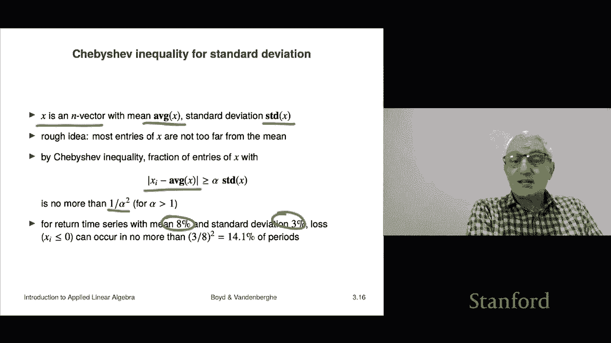

# 【双语字幕+资料下载】斯坦福ENGR108 ｜ 矩阵论与应用线性代数(2020·完整版) - P11：L3.3- 方差与标准差 - ShowMeAI - BV17h411W7bk

We're not going to talk about standard deviation it's a very important concept you'll hear about it in statistics and probably other courses as well very closely related to the ideas we've been looking at we'll look at it in the context of vectors and considering vector collections of numbers。

Okay， so if I have a vector X， it's an n vector， the average of the vector is the average of the entries。

 So it's the it's one transpose x sorry in a product of one and x。

 which you now recognize as the sum of the entries in x and then divided by n。

 So that's the average So it tells you what the average value what the average of the coefficientency is。

 Okay， now demean vector and I should say that this is not。

That's not standard that's not universally accepted standard notation。

 so I mean someone would probably figure out what it means if you wrote this down。

 but just to let you know。Okay， and then the idea of a demean vector is very interesting。

 it says you take the vector x and you subtract the mean value from each entry of it that's called the demeaned vector we're going to denote that as xility and it's x minus the average of x that's a number which is the average value。

 the entries is times ones that's the vector of all ones it all entries one so the average of the average value of xility is0 right because you've subtracted the average and so on。

This allows us to talk about what the standard deviation is the standard deviation is nothing more than the RMS value of the demeaned vector。

And if you want to write it out and all its glory， it looks like this。

 it's x minus inner product of1 and x divided by n， you'll recognize this part。

 this part here as the average value times one， that's when you multiply a vector times ones。

 you get a vector with all entries equal to this number， the average。

 and it says subtract that from x and then take the norm， then divided by squared n。

 which gives you the RMS value。That's the so called standard deviation and what it is it's a measure of the typical amount by which Xi varies from its average。

 so if I have these x's。And you know the standard deviation is 2。6。

 it says that whatever the mean is， let's suppose the mean is seven。

 it says we would expect the the entries to range between let's you know between。

 let's see from if the mean is five， it would go up to seven， eight。

 nine you know and down to two or three， but you wouldn't have numbers that were crazy。

 it would be around that average value okay and the typical deviation would be this standard deviation。

Now， a vector has standard deviation zero， let's see what that means。

What it means is that this is zero， this quantity up here。

That only happens if x is equal to its average times ones， and that means x is constant。

 So a constant vector means it's a multiple of the ones vector。

 that means all the entries are always the same。 And that has standard deviation 0。

 and it's perfectly interpretable because if I give you a vector， all of whose entries are the same。

 And I say。How much do they typically vary from the mean value。

 the answer is they're identical all of them are identical to the mean value so they don't vary at all so that kind of makes sense that's what it means to be to have standard deviation zero Now this as a side note you know very common ways to denote the mean and standard deviation are the Greek letters mu and sigma and I guess they stand for mean mu and sigma stands for。

And standard deviation， okay so that's。And these are also very widely used across applied mathematics probilities statistics and other areas Okay now there's a basic formula relating these the different quantities we have。

 and that's this it's that the RMS value of a vector squared is equal to the average of the vector squared plus the standard deviation squared I'm not going to show that formula although it's a pretty quick derivation。

 but you know I don't know， you probably don't want to see me doing some algebra on my little pad here but it's actually a good thing for you to try to show yourself it's a great exercise and you'll use a couple of the properties of the inner product there to show that okay。

Now this comes up well it's at the heart of a lot of quantitative finance， so let's see what that is。

 let's suppose that X is a time series of returns and it means in each period you know did a dollar of investment go up in which you know or did it go down that kind of thing and so it's just a time series of returns on some investment over some period right so well over end periods I should say because each entry is going to be it' going to be a return in a certain time period。

Okay， so that that's what it is And so， you know， let's suppose it's it's I mean， it doesn't matter。

 but it's going to look like's going to look like this let let's say it looks like this it's you know005 minus 。

03 point11 and minus point。2， that's a lot。 Okay， well， too bad。 I already wrote it。 Al right。

 here it is。 So this is just what it says。 This says in the first period， you made 5%。

 Well that's okay， that's decent。 In the next period， you lost 3% And the next period， you made 11%。

 That's like great。 that's awesome。 And then unfortunately on the next step， you lost 20%。 Okay。

 so this is an example of a of a time series of returns， okay。😊，Now if I take the average。

 then what I get is the mean return of that asset or investment。

 that's the mean return and it's the mean return per period right so usually those are converted to annual but just it's it's just what it means the mean return per period okay and that's usually often just called the return right so I'd say what was the return of that you know over the last year and somebody would tell me you know daily。

Okay， now standard deviation of a return time series， super interesting。It tells you。

Basically typically how much did the return deviate from the average right so for example。

 if it looked like this 0。01 you know 0。001 and all the entries are 0。

01 it's awesome you'd say what was the mean return。

 you go 1% and you go what was the standard deviation and the answer is 0 and what that so we interpret that as sort of risk it means that you were guaranteed to make you know whatever was 1% in each time period period that was never higher。

 it was never lower so that this is actually referred to as just the risk。

 the standard deviation of the return time series and。

And what you do is you'll usually compare these this is how you compare different different time series I mean they have to be yeah this is how you compare different time series so you would say。

 oh， my portfolio made you know， over that time period it had an average return of 12%， you know。

 let's say per year and I had a standard deviation of 10%。

Okay so and we can interpret that that means that we should not be surprised if the return in any one period would be certainly plus or minus here the people would say it is one sigma that would be the slang So you'd say so we should hardly be surprised so we might have a year in there where we did 25% we might also have one where we did where we lost money that's a negative number。

 So okay and then these are often plotted on a risk return plot Okay so which gives you the two the two attributes of a return of a return time series okay。

 so here's an example。I guess I've got like I don't know10 maybe this is 10 periods yeah this is 10 periods and here here are my your terms Okay。

 so this one you know that's what is that that's like the the tortoise or something okay so here's the tortoise。

And it just it's boring it just you get， you know you get a return of one。

 I don't know what is 1% It doesn't the units don't matter it's just a steady return it's you know the average is one and the standard deviation is zero。

 So in fact， what people would then say is it's something like it's riskless there's no it's just every year it's the same there's there's no question of what it's going to be Now this one。

That's kind of interesting。 Let's look at that return time series， it says that。You know。

 in the first。You know in the first time period， let's say you made 5%。

 you're laughing at the person who had this this other this other investment because you say I just I just I just made a return five times what you made okay。

 on the next period you make about one right that's that's this one and then on the third period here you'll lose money。

Right， so then I guess at that point， this one's laughing and saying，hah， I'm always making 1%。

 but I've never lost money， I'm not going to lose money anyway， okay。Here's another one over here。

 another one and you know your eyeball sees that some of these Cs are even larger， more extreme。

 so your eyeball at least tells you that maybe the risk or standard deviation is higher and here' here's a final one D and you know we can almost see that D is bad visually right because for example in the first four periods you lose money。

The return is negative。 you lose， Okay， then all of a sudden you make a bunch。

 then you lose again twice， then you make a bunch more。 And okay。

 so if you work out what the what the mean。Of these R and the standard deviation which we refers to risk return and risk respectively now we scatter now we plot them right and so that would look like this this is a very famous plot in finance so that's the mean return there and that is the risk and just to give you the rough idea although this is not part of that now it's just to show you that the concepts we have like standard deviation come up in real things in this case in finance。

So I mean it should be kind of obvious that we like high return right I'd rather make 5% than 2% and I would prefer that to losing 2% So okay so so up the mean axis is good right for risk people generally prefer it to be smaller In other words。

 if you could do something like that that would be perfect right that would be that's one measure of risk there's actually a lot of a lot of measures of risk。

 But the truth is this is the one that's actually used most often Okay so that's the risk and there small is good So here right so here's where you want to be on a risk return plot。

 you want to be in the upper left corner upper means high return。Left。

Means it was on a corner you want to be on the upper left side Left means you did it with low risk。

 so that's what you want want high return low risk。Okay。

 and those are just these these two attributes。 And so for these four return sequences。

 we can see a couple of things a comes out over here。

 It's got zero risk because it just doesn't it doesn't y， it doesn't。

It's it's it's a concept all the time here's B sure enough look at that it's got a higher it's got a higher return like you know two and a bit times as much as the first investment a。

 but its risk is higher too and that's here C has a higher return and higher risk still and D over here is well it's kind of a sad thing right it's got about that。

That investment has only a little tiny bit more return than a。

 but a has zero risk and D has you know four units of risk so okay so by this thing you know we don't like D oh interesting question we'll come to it later by the way is this which。

Which of these is best？嗯。It's an interesting question。

And the answer is we can't say actually there is something we can say if we like return to be high and risk to be small this is correct then it turns out you can't say if a or B or C is better you can't say which one is better it depends on what people would say is your risk appetite if someone said yeah yes I'll take two and a half times the return for a risk of two I can do that and so you know that's completely subjective it depends on the actual investor but we can say something we can say that D is a is simply a bad that's a bad one why because look here's a which gets about the same return but has zero risk as opposed to whatever four units of risk right so that so the name for something like that is let's see。

The name for that is you would say it is dominated by the others right so it is dominated by the investments you know A B and C。

 but basically it's just it's crappy that's the technical term for what the investment D is Okay so this just to tell you that standard deviation mean these are kind of the staples of quantitative finance。

So the Chebyche inequality can be transposed to handle to talk about standard deviation and there it's very interesting and this is something you should just remember like period is this is the right way to remember the Chebychef inequality in my opinion so suppose you have an n vector X it's got an it's got an average which is just average of x and a standard deviation which is standard of x okay now the rough idea is that the entries you know average of x is sort of like the middle point or whatever it's it's a typical value right the standard deviation tells you how much the entries you know are above and below the average so what this says is if you would like to know。

This is。What fraction of the entries？Are away from the average by alpha standard deviations。

 That's some people would say this。 That is no more than whatever alpha squared。

That sort of that's for alpha bigger than one， I mean it holds for alpha less than one。

 but it's not interesting。Okay， now here's a very specific example is for any return time series with a mean of 8% and a standard deviation of 3%。

A loss and that responds to Xi being less than or equal to zero that can occur no more than three/8th squared。

 which is about 14% of the periods。 that's it so that tells you that by the way it's just the chyche inequality。

 but you kind of get the idea and so the way people think of that in their head is roughly something like this you know mo standard trees of the vector are between plus and minus you know one standard one and a half standard two standard deviations that's kind of now by the way。

 don't if you have had a course on probability don't confuse this with like a normal approximation or something which gives you something something different right this is the chbyche it holds for this inequality holds that nothing do to the probability or distributions or anything。

