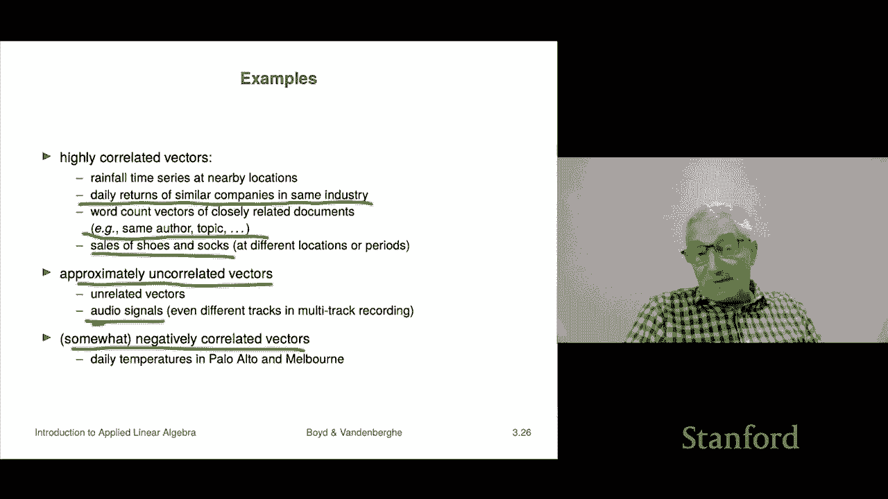

# 【双语字幕+资料下载】斯坦福ENGR108 ｜ 矩阵论与应用线性代数(2020·完整版) - P12：L3.4- 向量角度 - ShowMeAI - BV17h411W7bk

Our next topic is angle， so we'll be able to define the angle between two vectors it's going to be the same as the angle between vectors that have dimension  two and three。

 but we're going to be able to talk about things like the angle between two vectors of dimension 1000。

 which is a very interesting concept。

So we're going start with something called the Kooshi Schwartz inequality and it's named for two mathematicians well Kohi and Schwartz so and it says this it says if I have any two n vectors A and B。

 then the inner product， the absolute value of the inner product is less or equal to the product of the norms that's here and so if you write it out in terms of coefficients it says this it says that the absolute value of the sum of the corresponding productss that's the inner product is less than that's the norm of a and that's times the norm of B and once you have the triangle you know once you have the kshi Schwartzs inequality。

 you can establish the triangle inequality and let's see how that works they're related。

A plus B norm squared is equal to， and I'm simply going to multiply everything out because that's a plus B in product with。

A plus B， and that's equal to the inner product of。A with itself。

Plus the inner product of a with B plus the other way around。 and then plus that。

 Okay this is norm a squared。 That's right here。 This term is right there。

 And then these two are both in number and then the same number。

 it's the inner product of A and B or B and A it's the same number。

 And so that goes in this middle one。 So I've derived that first line。

 Now I'm going to use the kosshi Schwartz inequality in the middle thing to inner product of A and B。

 And I'm going to say that that is less than or equal to two times the norm of a times B。

 And I get this， but that's exactly equal to that。 And now I take the square root of this。

 and I find that A plus B。 The norm of that is less than or equal to the norm of a plus the norm of B。

 and that's the triangle inequality。So。😊，Once we know the Koshi Schwartzs inequality。

 we can actually show the triangle inequality from that。

So let's derive the kosshi Schwartz inequality This is also something where you know it's probably best for you to derive this yourself in your own terms and things like that。

 but we'll just do it here because it's not that hard to do so first of all。

 the koshi Schchwartz inequality is clearly true if either a or B is zero because then both the left and right hand side will be zero right because you'll have the inner product of any vector was0 zero that's a left hand side and on the right hand side you'd have one of the terms would be the norm of a zero vector okay so we can assume that both a and B are non-ze and that means that their norms and we'll call those alpha and beta are positive so these are positive numbers。

Now what we're going to do is we're going to simply do this or we're going to say that zero is less than or equal to and what we're going to do is write out it's a particular linear combination of a and B it's kind of weird actually it's just basically。

You know it's the norm of it's the norm of B times a minus the norm a times B。

 that's a linear combination And we're going to expand out the norm squared of this difference。

 And we get something that looks like this。 It's the norm squared to the first term norm squared to the last term minus twice the inner product of the two terms and so that's going to be this thing here。

 we're going to rearrange a couple of things like here。

 the beta will come out and it becomes out as beta squared here， Al comes out as alpha squared。

 I'm using properties of the norm there And then here using some properties of the inner product。

 the alpha and beta come out in front and you get something like this right。

So in this case we get this expression here and what we get is that that's the same as as this thing as we get we get two times the norm squared of a norm squared B minus two times norm A norm B here what I've done is I've used the fact that alpha is the norm of a and beta here is the norm of B。

 And when you plug those back in you get this thing and what we know is that that thing is bigger than or equal to0 this first one applies immediately because a norm is bigger than0 norm squared is bigger than zero so that's how you get that Now if you simply divide that by this you get kshi Schchwartz inequality and you can also apply it to minus A and B and you get the other half of the kossi Schchwartz inequality。

 So that's the kshi Schchwartz inequality。I have to admit this is what we call a mystery proof like because you'd look at it and you'd say where on earth did who would think of taking writing down the norm square of this bizarre interpro this sorry linear combination here and you know that's okay there's lots of other ways to derive the koshi s Schwartz inequality。

 this is just one of those so I'm just saying I would not have expected you to do this but I've done it for you。

So that's fine。O。Now that we have the kosshi Schwartz inequality。

 we can actually talk about angle and the reason let me explain how that goes。

 it says that the ratio if you have two non zero vectors。

 then the ratio of a transpose B to norm of a norm B， now we know by kosshi Schwartz。

 that's a number between minus1 and plus one。Can't be any outside that range。Well。

 that means that we can actually take the arc cosine and that means that we can actually take we can simply we can associate an angle with that and we're going to literally define that to be the angle between the two vectors and B。

Okay， so that's how that's going to work and it's going to be a number between zero and pi or if you prefer degrees。

 this is radance， zero and 180 degrees， and it's the one that's going to satisfy this that the inner product is norm A。

 norm B times the cosine。Of the angle between A and B Now this is turns out this is exactly the angle in two dimensions and three that you knew about and maybe annalytic analytic algebra analytic geometry course。

 it is exactly the same as the angle right if I say what's the angle between these two vectors you would get exactly this formula。

What's interesting for us is that the formula works and we associate angles between vectors of dimension 100 right so which is sort of interesting we'll get to that by the way the angle is another kind of measure of deviation between two vectors right if the angle is two degrees it means roughly speaking the vectors are pointing kind of in the same direction if it's 90 degrees not so much and the most they could disagree with each other would be to point in 180 degrees apart from each other but we'll get to that in a minute。

Okay so people classify angles these are very useful to know about so I'm going to take theta that's a traditional symbol to denote an angle is the angle between two nonzero vectors A and B so if theta is pi over two that means that A and B are orthogonal and people write it this way you write A with this little upside down thing which suggests 90 degrees right a is orthogonal to B and it's just a very fancy way of saying that the two vectors are have an inner product of zero。

It means nothing more。If theta is zero， that means that A and B are aligned so let me first give you an example visually so here's an example of orthogonal vectors right so the blue and the red vectors are orthogonal they have an angle of 90 degrees with respect to each other aligned means that the inner product is takes on the largest value could possibly take given the norms and it's norm A times norm B and that occurs when basically roughly speaking they point in the same direction that's what it mean it means the angle between them is zero。

If。If theta is 180 degrees or pi radiance， right， that means they're anti aligned and that would be this picture here。

 it says that they're actually on a line， but they point in exact opposite direction。

 so that's anti aligned。If the angle is less than 90 degrees。

 then that says that the inner product is non negative and we call that we say that they make an acute angle and。

The I not the converse， but if it's bigger than 90 degrees we say it's an obus angle so here's an example these two vectors make an acute angle I don't know what the angle is between them 25 degrees or something but it's acute oh and and the inner product is not negative in that case possible。

In this case， the angle is more than a 90 degrees I don't know 110 100 degrees I don't know some 105 degrees anyway so this would be an example of two vectors that make an obtuse angle so and these are just completely standard concepts in all of math。

 so this is what you're going to see。O。Another application is a spherical distance。

 so here if I have a sphere of radius R and A and B are on the sphere。

 so this is supposed to be a point on the surface and that's a point on the surface then there I can talk about this right so the distance between A and B that's this thing。

That is the distance， but that that's the distance of， you know。

 basically let's if this was the earth and these are two places of drilling a hole directly from one through the earth to the other。

 and that would give you this number here。Okay。😊，The distance along the sphere says you have to what's the shortest shortest path from one to the other。

 but you have to stay on the surface of the sphere okay so no drilling if you do that it turns out that's exactly equal to the radius times the angle the angle in radance of course not in degrees that gives you spherical distance so that's another way to think of to think of angle as giving giving you some kind of a spherical distance right so's that's kind of the idea。

The last thing we're going to talk about in this section is that use you can use a document you can measure things like document dissimilarity or feature distance using angles and people do that。

And so a lot of times people will say， oh how are you measuring the feature distance and they might say oh by angles right or by distance right Euclidean distance。

 but let's look at an example we're going to look at the same one we looked at last time。

A previous example and what we do is we have five Wikipedia pages one Veterans Day Memorial Day Academy Awards Golden Gbe Awards Super Bowl and for each of those we're going to work out a vector which is the word count vector with a dictionary of around 4500 words right so that thats we just do that and then what we do is we're going calculate the angles between pairs of these things now whenever you ask what's the angle between the vector and itself it's always zero so the diagonals are all zero here。

Let's see， let's look at the angle between Veterans Day and so you could ask again。

Which two of which two of these feature vectors， the features。

 the feature vectors are nothing but word count vectors， which two have the smallest angle。

 So which ones are closest together in an angle， right？ And so once again。

 the winner is Veterans Day。And Memorial Day。So by that it's suggesting that somehow of these five five Wikipedia pages these are the two closest now they are literally the closest as measured by angle in feature space right but the interesting thing is that actually it picks up on some stuff and you would probably if I asked you I went to a person on the street and said here's five here's five Wikipedia pages which which would you consider to be the two that are closest you'd probably pick these two well you might pick Academy Awards in Golden Globe Awards oh yes indeed you might because guess what？

That's actually the closest one， My apologies okay but they're close and that gives you a rough idea interestingly。

 you see things like this Golden Globe Awards and Super Bowl are off by 86 degrees Now the inner product of two word count vectors word count vectors are non- negativeg and the inner product of two non- negative vectors non- negative vector means a vector that's all of whose entries are non negative the inner product of two such vectors is of course non negative and that means that all of these angles had to be acute they have to be between  zero and 90 degrees So what's interesting about this is 86 degrees is it's saying that they're pretty they're pretty far apart they're about as far as apart as they could possibly be 90 being the only other choice or the biggest that's the biggest they could possibly be。

By the way， I should add that for word count vectors， if the angle is 90 degrees。

 turns out there's only it means that the two documents share zero words in common。

 in other words that for every single word in that dictionary it's either it's not in one document or it's not in the other you could look at that or we'll make a homework problem on it to have you work that out and figure out what it means anyway。

 so once again this is a hint that looking at just angles can actually have practical applications。

Next topic is the so called correlation coefficient。Again。

 this is something you'll see in other courses I'm pretty sure or may already have seen in the basic probability course。

Here we're defining it in the context of well vectors right so what we do is we take two vectors A and B。

 we demean them so I get A tilde and B Tilde I should add that this is not this is not universal mathematics notation so it's my local notation so don't go to the math department and say At tilde and and they go what are you talking about and you can't say it's a dean vector they would say well I didn't know that so so you know I mean you can write this the inner product and that everyone will recognize but not the Tiles so just so you know okay。

So we demean these vectors and the correlation coefficient is defined it's used this is the that is kind of a standard mathematical symbol for correlation of row。

 the Greek character letter row， and it's equal to the inner product of the demeaned。

Vectctors divided by the product of the norms。 Now， if you took the art cosine of this。

 you would get the angle between the dean vectors。 Okay so here what this means is， you know。

 if rh is so rh is literally the cosine of the angle between them。

 So rh equals 0 means that they're uncorrelated and it means a tilde and B tilde are orthogonal right they have zero in a product if rh is bigger than about 0。

8 or so， it depends on the application， you would say that A and B are highly correlated if it's less than minus 08。

 you'd say they're highly anticorrelated。Now， you might ask what does this correlation coefficient mean and what it means actually super interesting。

 it means the following。You take these AIs and Bs and you ask questions like， when are they above？

Their average like for what eyes are they above their average and when are they below their average and if that has nothing to do with each other and sometimes you know A is above its average and B is below and sometimes you know that kind of thing then they're going to be approximately uncorrelated if however they're correlated what that tells you they're highly correlated what that says is very often when a is above its average so is B that they co well it's more or less kind of at the same time roughly that they they're above their averages so that's roughly the idea here。

So here's an example we've got。Three examples of pairs of vectors。

 which we plotted so your eye just for your eye to follow it。 Here's a， here's B。

 And in this first one， you take a look at it。 you know， I don't know what the mean is。

 but I'd say it's about there。 and I don't know what the mean of this is but you know it's not too different like that And now again。

 let's use my my intuitive idea of what correlation is you could see that you know it's over here in index like 2。

3，4， whatever roughly that a is above its mean。 And sure enough， B is above its mean。

 maybe not in the first one but in 2，3，4，5， something like that。

 And also similarly a is below its mean here and so is B。

 And sure enough that these are very highly correlated。 And if I do a scatter plot of a against B。

 what it says is they kind of fall on a line。 that's what it means to have perfect correlation。

 So they have they fall on a line like this。Our second example is here's A， here's B and again。

 I don't know what the mean might be somewhere around here and here they're anticorrelated because you can see when a goes high。

 B goes low， high means high means above its mean and B goes low and as a result when I scan a plot A versus B they're on this declining line like this and that means they're anticorrelated and here is sure enough they're highly anticorrelated。

And here's an example where when you do a scatter plot of A and B。

 they're just kind of all over the map and you can see here A is above its mean sometimes so is B。

 but all four things happen you know I mean I'm being very rough here but approximately the same right with same frequencies you know sometimes a A' is above B' is below sometimes A's above B's above and all four possibilities you get so that's it I should add that things like correlation is also defined in basic probability and in fact this corresponds precisely to that in a certain setting but but here it's just I'm just talking about for vectors。

Okay， so here are some examples， practical examples of highly correlated vectors。

Here you go how about the rain the daily rainfall time series in Palo Alto and Menlo Park there you go these are adjacent cities okay so。

I mean， honestly they're often very they're very close。

 so these would be highly correlated right that in the summer in California it basically don't have any rain at all。

 you know when it's raining in Palo Alto， it's probably raining in Menlo Park， this kind of thing。

 So so that would be an example of highly correlated highly correlated vectors would be like 10 years of daily rainfall data that would be 3650 vector long okay here's another one maybe not as highly correlated is daily returns of similar companies in the same industry。

 So let's look at let's say a year's worth of returns there's about 250 trading days in a year so that's about 250 numbers So if I look at you know two similar companies and I look at their returns will be if the companies are similar meaning。

They've got about the same capitalization they kind of are in the same industry or something like that they're of course the returns are not going to be the same but they're going to be pretty correlated because some of the same things are driving both of them right some of the same underlying causes and so that's the idea correlation is not going to be 95% but it could easily be 08 or something like that。

Here's another one word count vectors of closely related documents are going to be。

Highly correlated so that's a。's that's an example right so for example。

 things written by the same author or things on the same topic right so these are going to be fairly correlated right so okay here's another one it's a classic one from economics is kind of silly but it's the maybe a time series of sales let's say weekly sales of shoes and socks you know and those are going to be those could be a different locations or different periods and then the point is those are correlated because basically when people are buying shoes they're probably also buying socks I mean so you know are they exactly the same of course not but you know you would see that they were they were highly correlated so examples of some approximately uncorrelated vectors it's just two vectors that are unrelated right so。

An example would be go get the daily maximum temperature in Bordeaux for 10 years and I have a 3650 vector okay there it is it's just it's just it varies right it's cool in the cool in the winter and you know high in the summer I don't know okay and I go and I get let's say the rainfall in the Amazon forest。

Actually， I should be careful because those probably would have some correlation with seasonality。

 but I could actually just go get some other vector of the same length。

And then it could be simply this， it could be the weekly purchases at a company of 3650 different products right so the point is they have nothing to do with each other and quite likely they are going to be essentially uncorrelated。

A practical example of this is audio signals， right？

When I take if I you know audio signals are encoded as vectors of length， which is about 44。

000 per second， so even a 10 second clip is pretty big， it's 440，000， 441。

000 actually long and if I just take two audio clips that are each about you know each a 10 seconds long。

They're going to be approximately uncorrelated I mean almost very， very closely。

 I mean unless they were two microphones recorded， you know with you know within。

 you know half an inch of each other or something in which case the correlation coefficient might creep up but other than that they're going to be completely uncorrelated。

 I mean approximately okay。嗯。So if you want to look for some negatively correlated vectors。

Daily temperatures in Palo Alto and Melbourne。W because one's in northern hemisphere。

 one's southern hemisphere and you know kind of when it's above the mean yearly temperature in Palo Alto it's because of summer and that's exactly winter in Melbourne so thats kind that would be an example of that so these are just you know some examples to give you the flavor of what it means to be correlated。

