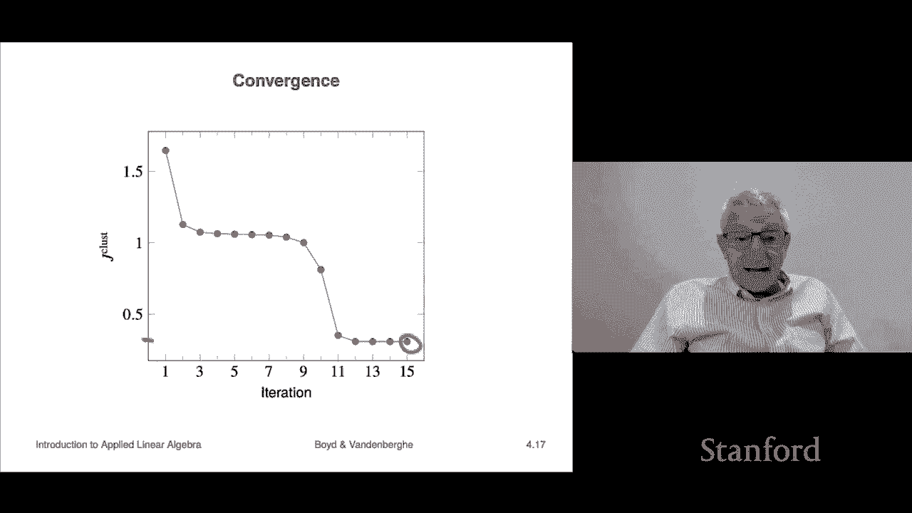

# P13：L4.1- K均值聚类 - ShowMeAI - BV17h411W7bk

We're now going to look at Chapt 4， which is on methods for clustering。 Actually。

 we haven't done that much in the course so far。 We've just seen vectors， some examples。

 We know just a handful of operations on them。 For example， we can look at the norm。

 which is a measure of size。 We can look at distance between two vectors。 And in fact。

 that's where we take off from in the idea of clustering。

But we'll find that even just with this extremely small list of things we know about， and in fact。

 in this case， specifically only simply the distance between two vectors。

We can already do interesting and useful things so in some sense this is just a detour out of the main topic of the course。

 but it's just to show you that even with these an extremely small list of things you know about we can actually do cool and useful stuff you can use this at your next internship by the way and if people don't know about it they'll be very impressed okay。

So the idea behind clustering is this we start with a whole bunch of n vectors we have capital n and vectors and we're going to call them x1 through xn that's a subscript notice this is a little ambiguous right because x7 is actually a vector it is the seventh vector in our list of vectors right so if you wanted to refer to a component of x7 for example you might do this。

And that would be this would in this thing here， that notation would indicate x7 is the seventh vector。

 this is a number now it's the fifth entry of the seventh vector Okay， so I have a list of vectors。

And the goal is to take these capital N vectors and divide or cluster them into part either partitions。

 groups， subsets， however you want to say it。So for example。

 we might want to divide them into three or five by convention actually because of you know it's a long history we're going to call the number of groups that we partition the vectors into K okay so here's the idea the idea is you want to make these partitions of vectors you want to group them into groups that are close to each other and so down here we're going to see a picture here's our actual data now in this case these are vectors in these are two vectors right so we can plot them of course we're not that interested in clustering two vectors right we're much more interested in clustering 1 vectors 10 thousand vectors or even a million vectors right million vectors and I don't know how many we've got here maybe hundred couple hundred it really doesn't matter but you can see them here now your eyeball tells you right away that you know you could cluster them into like kind of three groups。

Like that okay that's just your eyeball now of course your eyeball is not going to work when you have vectors of dimension 10000 right so。

But here and it's kind of like you know there's some question as to which cluster does do the ones likes near the between two lie in but these are like detailed the ideas just as a rough idea to you'd get three groups here so here's an example of a clustering and what we've done is we have color code we've had we have k equals three here and we've color coded them so you can see which of the which of the vectors over here have been assigned to which group and so we have a green group a red group and a blue group okay and you know you could quibble with some of our choices here like for example I don't know if you can see but there's a little green dot right there and you might say oh no that one should be red you know are this is minor it's not a very precise concept's and we'll see that in applications that'll be clear that it's not a very precise concept but we'll see also it's unbelievably useful so this is the idea so the question is how do we automatically come up with a clustering like the one shown here。

that if we're doing this， if we're doing this for vectors that are in that have dimension two。

 you use your eyeball to do the clustering， you get out a pencil and you cluster them just like I did over here that's exactly what that's manual clustering。

 that's not going to cut it in higher dimensions okay。

So before we talk about how to do it I want to talk about what you might use it for what would you use clustering for or what would be the setting in which you would use clustering Well it's actually super interesting So here's an example let's suppose that the vectors are word count histograms a collection of documents some people call a collection of documents a corpus so for example Wikipedia is sometimes consider a corpus I forget how many documents well it's changing every day or in Wikipedia but that's a corpus of documents and then for each document you would have a word count histogram it just counts the number of words so you know it's very unsophisticated know I want to add that that means that when we associate a vector with each document it is really profoundly stupid it not it does not understand English it does not understand syntax it doesn't know what a sentence is。

 it doesn't know what a paragraph is it has absolutely no meaning what any the word。

It simply counts the words in our dictionary and that's our vector so I just emphasize how crude how crude this really is and yet we'll see it's pretty shocking what happens okay。

Here would be another potential area where you might do this is let's go back。

 let's do patient clustering so let's have a large hospital or network of hospitals and what we do is each vector is going to represent one patient and what it's going to have the entries are going things are going to encode things like age。

 sex， weight， height blood pressure， diastolic systolic whether or not they're currently experiencing chest pain it could give the vector could also have entries that tell you that encode whether not just symptoms but also the results of tests have they tested negative for something or positive for something so that would be or if it's a numerical test it could I mean that's also that would be encoded in X okay so these are your vectors is actually a set of attributes of each patient okay。

Now there it would be very useful if you had 100，000 patients to group them into， I don't know。

 I' mean not'm making this up， but you know 60 different clusters and you could probably find out some interesting stuff that way customer market segmentation so this is as a matter of fact this is done pretty much universally and the way that works is that each vector corresponds are a set of attributes that correspond to a customer and so what you do is it would include things like their purchase history how many dollars over the last month of item such and such have have they purchased that's an example it could include other attributes of it could include like where they live age group education level I mean any of all of these are possible right so we can that's the idea and now what you do is you would cluster these vectors right and。

Idea is we would get， I don't know， 68 groups of clusters。

And groups are clusters of customers and then a person would get their eyeball in there and go in and look and they'd say。

 oh I see what this is these are you know these are 18 to 22 year old college students or some I don't know that kind of thing okay so there there this would be quite useful right because you could then tune your marketing and other stuff advertising okay here's here's an application it's actually one of the it's a famous one that the people you know typically show all the time and it's color compression of images right so an image here what you do is you have an image and what you do is you think of each of its pixels so you might have 4 million pixels right and a 4K by1k image you 4 million pixels each pixel is at three vector which give you the R G and B that's red green and blue intensity right now for historical reasons those。

Go between zero and 255 but we'll just call them between zero and1 I mean it actually it doesn't it's not going to make any difference it's just a three vector right okay。

So if you cluster three vectors it's actually super duper interesting right so you can actually cluster the number of different colors to maybe 100 by the way that's not that many right because these are three vectors but you know once you get 100 you actually images that way and then the advantage of course is you don't have to give three real numbers for every pixel you just say oh that's cluster number 45 that one is cluster number 66 or something like that and so that's kind of the idea that's used for compression because you can。

Say you can describe an image way faster if you have only 100 different colors。 Okay。

 here's another example is in finance。 So each vector corresponds to a company and my vector includes attributes of that company。

 It could be， for example， the return of their stock last month last year could have both of them。

 it could be their total capitalization。 it could be their price to earnings ratio。 it could。

 we could encode the sector therein right So for example。

 if there we could have we could have a feature that's either zero。

 if you're not in the energy sector and one， if you're in the energy sector， these are examples。

 Okay So this would be So if the vectors correspond to companies， basically。

And now what would happen is we would take these vectors it might be 10000 of them， 1500030，000。

 and they might have each I don't know hundreds of attributes and then we would cluster them right and so this would be the idea and so nearby vectors there mean companies that are similar in terms of the attributes it means they're probably kind of in the same area they have about the same capitalization you know this kind of thing right that they're just similar and you could use this for lots and lots of things but in fact what would appear when you do this kind of automatically are financial sectors when you see companies that cluster together those would be considered thats typically called like a financial sector or something so these are the examples we're going to come back to the practical examples later because what we're going to do now is we're going to talk about actually how to do clustering actually it's a huge field you can take an entire course on。

But how to do clustering， but we're going to show you a shockingly simple algorithm that was one of the first and it's still very widely used it are actually variations on what we're about what I'm about to show you are actually widely used right now。

Okay， so the way this is gonna work first some notation and it' it's not pretty。

 but it's just we have to be able to say to describe a clustering。

 And so we're going to describe a cluster in two different ways。

 One way is we're going to give we're going we're going to take so this is set notation when you see that squiggly bracket that constructs a set and so this is a set with n elements and the elements are the integers 1。

2，3 up to capital n those are the indices of our our vectors this symbol means that G is a subset of those GJ and a subset means it is。

 well， it's just what it sounds like it means that it is a selection of some of the entries there so for example。

 okay here's let's say we have I'll do something really simple here。

That's our here capital n is four， so I have four vectors and then I could have two groups。

 so I would have something like this G1 is1 and four。

And G2 is two and three there okay so that's an example of a clustering I put the first and last one together and I put the middle two together and that's my two groups okay。

Now we're also going to use C subi， so C is a vector， which is capital n long。

And what we're going to do is C sub I is going to give you the group that X I is in so in this case let's see so here C1 is going to equal1 and C2 equals two right because this says that entry item one is in group1 you can see that from here and so C1 is1 C2 equals2 C3 equals3 and C4 who no no that is very wrong this is two there you go and one there we go sorry okay so yeah so these are this is how we would these are two ways that we'll use to describe the clusters right。

Okay now what we're going to do is we're to have group representatives and so these are vectors Z1 through Zk remember we have K groups and these vectors don't have to be in our original data in fact generally they are not they're just arbitrary N vectors and we're going to call them the group representatives we're going to later see what they are and actually there's by the way by themselves going to be super interesting but let's just take look they're just group representatives okay。

Now the cluster the best， I mean a very good way to actually kind of do anything is to make it an optimization problem。

 so the way you do that is you say。What you're going to do is you're going to write down an objective function and in this case we're going to write down this objective function I will。

Talk about it momentarily。 But then the idea is we say that if this is smaller。

 if that objective is smaller， we like that clustering better。 Okay。

 so you should be very suspicious of people who tell you about something and launch into a method before they tell you what it is that would make them happy。

 So now I'm telling you what would make us happy。 What makes us happy is this j cluster being small。

 And so that way there's no arguments， right， if you come up with another algorithm and I come up with an algorithm and we evaluate our two clustering objectives。

 then who'sever is smaller is their clustering is better period。

 Okay so this is kind of the approach。 In fact， it's the approach for a whole lot of of sort of know mathematically oriented methods and frankly。

 it's the correct approach right， Otherwise things get weird and vague and you'd say I don't like your clustering It doesn't look good And they say yeah。

 well I don't like your clustering and so on anyway。 So fine， All right。

So let's look at this clustering this cluster objective so here's what it is what it does is it iterates over all of the data and for each each vector XI。

It finds the distance squared。To its representative okay so that's the ZciI so that's that's so this is this is the distance without the square that's the distance of item I to its cluster representative so that's how that works and this says that we should take the sum of the squares of those things and then we could divide by n so you get a mean square clustering objective right and so this is it so。

You know， your job here， well here's your job， your job is to choose the Z1 through ZK。

 those are the cluster representatives。And your other job is to choose if you like the C's。

 which is the same as choosing the G's so the C means you have to say for each item which cluster are you in so for item 22 are you in cluster 1。

2，345， something like that so that this is going to be your job is to do that。Okay。

 sos this is the clustering objective and it's perfectly reasonable， right？Okay。

 so that's going to be our goal is to choose a clustering and representatives to minimize this number and that's how we're going to when we we'll have an algorithm that does this and we're going to monitor our progress by looking how J clusterlu is it going down has it stopped decreasing that sort of thing and that's also how we're going to compare two different methods for example。

 if we try two different methods or will two different clustering potential clusterings we'll judge them by this objective okay。

So we're going to now talk about an algorithm， it's a very famous algorithm， it's actually very。

 very simple and yet very powerful。Okay， so here's the way it's going to work。

So what we're going to do is we' we're going solve the problem not all at once remember our job is to find the representatives and also the assignments to clusters。

 those are the Cs right so instead what we're just going to break it down and try to figure out how to do one how to choose say the assignments if you knew the representatives and then the converse how would you choose the representatives if you knew the assignments so we're going to start right now saying suppose we knew the representatives that's these C1 through CK so we're not going to mess with them they're just fixed and the question is what assignment would minimize the cluster the J cluster right and so the answer is actually easy to figure this out what happens is if you go back to the cost here you'll see that if we look at so Z if I ask like how do I which let's consider entry I。

CI appears nowhere else except that one entry and so what it really says is to make this as small as possible choose I should choose C to be the index corresponding to the nearest neighbor of X in the representative set Z1 through ZK so that's what I should do okay so。

So that's the idea and that's it so we would you'd say that this way you will assign each vector to its nearest representative by the way。

 another way to say that is if you haven't assigned if you have not assigned a vector to its nearest Z。

Then in fact， by assigning it to us nearest Z， we can reduce J cluster or whatever the cluster objective Okay。

 so this is this makes perfect sense it just perfect sense Okay now please note this does not solve the problem this says if you knew the if you knew the representatives the way to assign items to the clusters。

Is to assign them to their nearest neighbor among the representatives and again that makes just perfect sense。

 okay。Now we're going to look at the other the other way around now suppose we fix we fix the clusters。

 that means every vector has been assigned to a cluster and then the question is。

How do you choose now the representatives to minimize our objective， Okay， so in this case。

 what we can do is the original objective is a sum over one over n。

 But what we're going to of n items right， But what we're going to do is going to we're going to rearrange them and and collect all the terms together that are in each cluster。

 And so what it is is that the cluster objective， which is the mean square mean square distance to your representative。

 We're going to write it as a sum of。K， different numbers and each of these。

Ptains only to cluster J so let's look at this notation， This says that I should sum over X minus Zj。

 but I I'm only going to look at the one the I that are in Gj that means that is the items which are assigned to group J okay so that's what this sum here means and I put a one over n in front of it。

I got that from the original one Okay now then the question would be this How do you choose。

 let's say， for example， Zj Well Zj only affects one of these。

 which is j subj right and then it's this thing and so we're left with the question how do you if I give you a set of vectors namely the Xs that are in partition in partition J and Gj group J then the question is how do you choose a single number that minimizes the mean square distance to them Now that has a very simple answer very simple solution which you know in the book we describe how to work it out or whatever and it's completely intuitive it's the mean In other words。

 if someone says how do you find a vector that minimizes the mean square distance to a set of other vectors you simply average all those vectors and thats that's the solution of that problem Okay so that says Zj is。

Literally， the representative is the average of the vectors in its group makes again。

 this is completely natural。Now I want to point out that at this point we have absolutely not solved the problem because we've been asked to optimize over both the partition and the representatives now oh we know how to do。

 but at least we know how we don' know how to do two things pretty well if you fix the representatives we know how to we know how to choose the clustering if we know the clustering we know how to choose the representatives and now we're in something very famous in mathematics algorithmic mathematics anyway when you can't really solve the problem。

 but you can do you know how to solve part of it if one thing is fixed and you know the converse right and that's just called iteration it it's really it's pretty dumb and that gives us to brings us to a very famous algorithm it's called K means it's actually from the 60s but actually like a lot of things when you start looking the history goes back older than that and the ideas we certainly there All right so heres here's the way it's going to work's very simple we're going alternate between updating the partition。

That means literally assign each item to its cluster， sorry to you assign each item to the cluster。

 which corresponding to the closest representative， okay？

Then we're going update the representatives and to do that that's simple we simply for each group we are going to look at we're going to set the representative to be the average of that group okay that's a famous algorithm and in fact what happens is in every single step our objective goes down。

 that's good because it makes us happy when our objective is small and the reason is pretty clear that in the first step when I assign each element if I move an element if an element had been in group3。

 if a vector had been in group3 and I move it to group6 because the group  six centroid is closer。

 my objective is going to go down same for this the other part。

 the second step that if I update the representatives by assigning them to be the mean once again the objective goes down so here's the algorithm' here's how we're going to write it it says that we should simply update the partition So you find the nearest neighbor。

And then you update the centroids and what will happen is at some point you're going to get to the point where the partition doesn't change and thereafter nothing will ever happen right that that's it in other words every item。

Is assigned to its nearest neighbor nearest neighbor among the representatives number one。

 and number two， each centroid is the average of its entries， the entries in its group。 Okay。

 sorry each representative or centroid I shouldn't say that the centroid here is an alternate name for the representative or mean Okay。

 so and then when it stops， we just then we quit if part if the partition is the same on two you know。

 if the partition doesn't update， then there's nothing to do and we quit because nothing's ever going to change again So that's the K means algorithm。

 very famous algorithm。Oh， and notice that it。To understand this。

 you only need to know a very little bit you know what a vector is and you know what distance between two vectors is。

It's not much。Okay。Now， let's see， as I said， the objective goes down every step until they stop changing。

 right now？One thing about this is that you now you might think this would actually solve the problem Okay。

 so now the fact is it does not we will even see specific examples where the algorithm stops and it is not the optimal clustering optimal clustering means that that clustering there's no clustering that has choice of representative has a lower objective and we'll see that that's just not the case。

So it doesn't actually solve the problem and so when you have an algorithm that's not guaranteed to really fully completely solve your problem。

 it's called a heuristic okay and there's many heuristics around。

 I mean honestly it's obviously better to have an algorithm that solves that solves something exactly。

 I mean， of course because。Then you don't have to worry about it there's no worry。

 but there are many， many cases where basically we can't do that and so we resort to heuristics and heuristics can be extremely powerful and this is one of the cases where it works very。

 very well okay okay so one fact about that is for example。

 depending on how you initialize the algorithm right you initialize it either with some representatives or with an assignment to of assignment of items to clusters depending on how you do that that can actually affect the final result okay and what people do sometimes is they run K means like 10 times let's say with different different initializations。

 they let it converge and then among those 10 they just choose the one that has the lowest value of J cluster because that's kind of what we're after okay so that's the idea。

But it has to be remembered that depending on how you initialize it。

 you can get different clusterings， so that's just the way this works。Okay。😊。

We're going to look at an example now the first one's going to be an abstract example in fact it's the example we started with at the beginning of the lecture and so what we're going to is going to take this data now of course this data is in is two vectors and the right way to cluster two vectors is with your eyeball and draw okay but we're just going to see how we're going to walk through K means and see how see what it does in this case okay so here we go so we initialize it with these。

Cluster representatives， okay， I don't know why， but we did okay。

 there's just three three different vectors， the red the red。

 the blue and the green square okay then what what's happened here is I have I have colored the points。

According to their nearest neighbor among those three so if you're a green point like all these guys are green down here。

 they're green because they are closest， they are closer to the green centroid or representative than the red or the blue and up here this is it's just sad it's very sad it's just two points that are closer closest to the red the red representative than the blue or green Okay now。

The next step you'll recall is we now update the centroids and what that means is or the representatives that means that among all of these green ones here we're going to calculate the average and that's going to be our updated our updated representative for greens and you know look eyeball there something in the center it's like right there well okay here's where it is exactly okay so's that's the updated green centroid or representative all right the blue is going to shift over to here and you can see that that blue thing is kind of in the center of where the blue things are and okay it's kind of pathetic there's two points and the average of the two is a point right smack in the middle and so this this sad little red box here is telling us it is now the average of its two is two constituents that's iteration one if you look at that that is a pretty bad clustering right there but the point we're going to iterate so that's iteration one let's look at it。

Iteration2。On the next step， things are getting a little more reasonable because now what we do is we go back and for every data point we fix the new centroids which are here。

 here and here， and we now go back and we ask every point which one are you nearest and then that's your color or that's your assignment group assignment and that we do that and now you see well。

 we got a big old group down here we got a few more reds。

And then we update the centers and so now these update this way and we keep going okay so this is iteration 3。

 here's iteration 10 and you can see we're getting there right so by now I mean still a bit wrong right you can see that these green things morally should be blue and so on this little bottom down here morally should be red and by morally I'm just joking it means like our eyeball can see what the clustering is but you know if you go like up to iteration 15。

 the thing just stops and that's the final clustering you get right and so there it is and you you might quibble with it you might say oh that green point maybe should be red。

Whatever， fine that the point is， you know， that this is the final clustering now， of course。

this was just to walk you through what it looks like how Ka means works Obviously the point of Ka means is not to cluster two vectors because you can do that with your eyeball and a pencil okay so that's not the point the point is this algorithm works in dimension 10 and it works in dimension 100 or 1000 or a million right if Amazon clusters their customers there's a whole lot of customers and a whole lot of items that they may have bought last month right so you know these are very。

 very big problems and basically the exact same algorithm just runs Okay so that's that okay。

All right。Let's look at how this algorithm converges as a function of iterations well this is J clusterlu and remember the whole point of having an objective is so we know when we're happier or not right so on the first step it goes down it kind of makes some little baby progress and all of a sudden w it goes down here and then this ends up being our final clustering objective and it's about whatever it is it's about 0 I don't know 0。

3 0。35 I don't know so so that's how Ka means RA on this thing and this is actually kind of typical。

